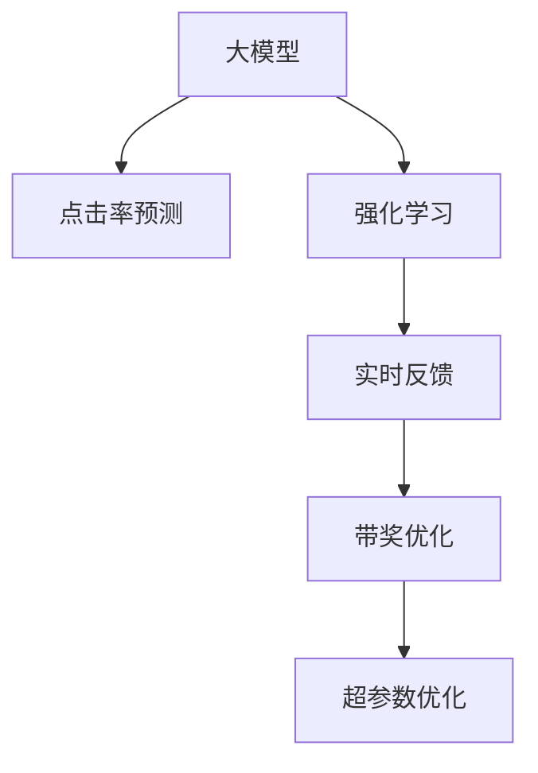

                 

# 搜索推荐的实时反馈学习：大模型的在线更新策略

> 关键词：搜索推荐、实时反馈、在线更新、大模型、强化学习、带奖优化、点击率预测、超参数优化

## 1. 背景介绍

在信息爆炸的时代，用户在各种数字平台上搜索和推荐的行为日益复杂多变。搜索引擎和推荐系统需要实时响应用户的个性化需求，提供更精准、更满意的搜索结果和推荐。传统的数据驱动机器学习方法，无法快速适应这些动态变化的需求，而基于大模型的强化学习和大规模在线更新方法，则成为了实现实时反馈学习的重要工具。

搜索引擎和推荐系统通常依赖于大量的点击率数据进行模型训练和优化。例如，点击率预测任务旨在预测用户对搜索结果的点击行为。传统的点击率预测模型，如logistic回归、线性模型、神经网络等，在面对大规模动态数据流时，难以实时更新和优化，导致预测效果不稳定。而基于大模型的在线更新策略，则能够实时接收用户反馈，通过强化学习不断调整模型参数，适应用户行为的变化，从而提升推荐效果。

本文将重点介绍基于大模型的实时反馈学习方法和在线更新策略，重点关注以下内容：
- 大模型在搜索推荐中的应用
- 强化学习在点击率预测中的应用
- 实时反馈学习方法与传统方法的比较
- 在线更新策略的实现与优化
- 未来应用前景与面临的挑战

## 2. 核心概念与联系

### 2.1 核心概念概述

为了更好地理解大模型的实时反馈学习与在线更新策略，本节将介绍几个关键概念：

- **大模型（Large Model）**：指含有大量可训练参数的深度神经网络模型，如BERT、GPT等，这些模型在大型无标签数据集上进行了大规模预训练，具备强大的语言理解和生成能力。

- **强化学习（Reinforcement Learning, RL）**：通过智能体与环境的交互，学习如何在给定状态下执行最优行动的决策过程。强化学习中，智能体通过不断尝试和奖励反馈，不断调整行动策略，达到最优化的目标。

- **点击率预测（Click-Through Rate Prediction）**：衡量用户在搜索和推荐过程中点击特定搜索结果的概率。点击率预测是搜索引擎和推荐系统的重要任务，可以用于评估推荐策略的效果，指导模型训练和优化。

- **在线更新（Online Update）**：指在大规模数据流下，实时接收用户反馈，动态更新模型参数，以适应用户行为的变化，提升模型的预测效果。

- **带奖优化（Reward-based Optimization）**：指在强化学习中，通过设置奖惩机制，激励模型学习特定行为，从而优化模型的预测性能。

- **超参数优化（Hyperparameter Optimization）**：指在模型训练过程中，通过调整模型的超参数，如学习率、批大小等，来提升模型的性能和泛化能力。

这些核心概念之间的逻辑关系可以通过以下Mermaid流程图来展示：



这个流程图展示了大模型在搜索推荐中的核心概念及其之间的关系：

1. 大模型通过预训练获得基础能力。
2. 强化学习在点击率预测等任务上进行实时反馈，动态更新模型。
3. 实时反馈通过带奖优化指导模型学习，调整模型行为。
4. 超参数优化在模型训练中不断调整，优化模型效果。

这些概念共同构成了大模型的实时反馈学习与在线更新策略，使得模型能够实时适应用户行为，不断提升预测性能。

## 3. 核心算法原理 & 具体操作步骤

### 3.1 算法原理概述

基于大模型的实时反馈学习与在线更新策略，本质上是一种带奖优化的强化学习过程。其核心思想是：通过实时接收用户的点击行为反馈，调整大模型在预测任务上的行为策略，从而提升模型的预测准确性。

具体而言，假设搜索引擎或推荐系统接收到的点击行为为 $A_t$，模型的预测结果为 $Y_t$，真实点击行为为 $B_t$，模型在时间步 $t$ 的预测结果与真实点击行为的误差为 $E_t$。则模型的带奖优化过程可以表示为：

$$
\max_{\theta} \sum_{t} \gamma^t \left[ R_t + \alpha \nabla_{\theta} \log p(Y_t | X_t) \right]
$$

其中，$R_t = B_t \log \nabla_{\theta} p(Y_t | X_t)$ 为奖励项，$\alpha$ 为带奖优化系数，$\gamma$ 为折扣因子，$p(Y_t | X_t)$ 为模型在输入 $X_t$ 下的预测概率分布。目标是通过最大化累计带奖，使得模型的预测结果与真实行为更加一致。

### 3.2 算法步骤详解

基于大模型的实时反馈学习与在线更新策略，一般包括以下几个关键步骤：

**Step 1: 准备数据集和环境**
- 收集大量历史点击数据，划分为训练集和测试集。
- 搭建分布式训练环境，如Kubernetes、Spark等，支持大规模并行训练。

**Step 2: 设计模型和超参数**
- 选择合适的预训练大模型，如BERT、GPT等，作为初始化参数。
- 设置模型的超参数，如学习率、批大小、优化器等。

**Step 3: 进行在线更新训练**
- 实时接收用户点击数据，按照带奖优化的目标进行模型更新。
- 根据当前预测结果与真实点击行为之间的误差，计算带奖优化奖励，更新模型参数。
- 定期在测试集上评估模型性能，确保模型始终保持较高预测精度。

**Step 4: 部署和监控**
- 将训练好的模型部署到生产环境，实时接收用户行为数据进行在线预测。
- 设置监控机制，实时跟踪模型性能和资源使用情况，及时调整模型参数。

**Step 5: 模型调优与迭代**
- 基于监控反馈，不断调整模型的超参数，进行模型迭代优化。
- 引入更先进的模型结构和算法，提升模型性能和鲁棒性。

### 3.3 算法优缺点

基于大模型的实时反馈学习与在线更新策略，具有以下优点：

1. **高效实时更新**：在大量用户行为数据下，实时更新模型，保持模型性能始终处于最优状态。
2. **高预测精度**：利用大模型的强大表达能力，提升预测结果的准确性和鲁棒性。
3. **动态适应**：通过实时反馈，模型能够动态适应用户行为的变化，提供更个性化、精准的推荐。
4. **可扩展性强**：分布式训练环境支持大规模并行计算，处理海量数据流。

同时，该方法也存在一定的局限性：

1. **资源需求高**：大模型和分布式训练环境需要高昂的硬件资源，对算力和存储有较高要求。
2. **数据依赖性高**：模型的性能和预测结果高度依赖于实时点击数据的质量和数量，数据获取和处理成本较高。
3. **模型复杂度高**：大模型结构复杂，参数量庞大，训练和优化难度较大。
4. **风险控制难度大**：模型在不断更新的过程中，可能面临过拟合和稳定性问题，需要严格的风险控制策略。

尽管存在这些局限性，但基于大模型的实时反馈学习与在线更新策略，仍是目前实现高效实时推荐系统的最主流范式。未来相关研究的重点在于如何进一步降低计算成本，提升模型的稳定性和泛化能力，同时兼顾用户行为的多样性和复杂性。

### 3.4 算法应用领域

基于大模型的实时反馈学习与在线更新策略，在搜索推荐、广告投放、个性化推荐等多个领域得到了广泛应用，例如：

- 搜索引擎点击率预测：利用实时点击数据，动态调整模型参数，提高预测精度。
- 推荐系统个性化推荐：实时接收用户行为反馈，动态调整推荐策略，提升推荐效果。
- 广告投放效果优化：实时监测广告点击率，动态调整广告投放策略，优化广告效果。
- 内容推荐系统：实时处理用户点击反馈，动态调整内容推荐策略，提升用户满意度。

除了上述这些经典应用外，实时反馈学习范式还被创新性地应用到更多场景中，如股票交易、金融风险控制、城市交通优化等，为智能决策提供了新的工具和方法。

## 4. 数学模型和公式 & 详细讲解 & 举例说明

### 4.1 数学模型构建

本节将使用数学语言对大模型的实时反馈学习与在线更新策略进行更加严格的刻画。

假设预训练模型为 $M_{\theta}$，其中 $\theta$ 为预训练得到的模型参数。给定搜索引擎或推荐系统接收到的点击行为 $A_t$，模型的预测结果为 $Y_t$，真实点击行为为 $B_t$，模型的误差为 $E_t$。则模型的带奖优化过程可以表示为：

$$
\max_{\theta} \sum_{t} \gamma^t \left[ R_t + \alpha \nabla_{\theta} \log p(Y_t | X_t) \right]
$$

其中，$R_t = B_t \log \nabla_{\theta} p(Y_t | X_t)$ 为奖励项，$\alpha$ 为带奖优化系数，$\gamma$ 为折扣因子，$p(Y_t | X_t)$ 为模型在输入 $X_t$ 下的预测概率分布。

### 4.2 公式推导过程

以下我们以点击率预测任务为例，推导带奖优化公式及其梯度的计算过程。

假设模型 $M_{\theta}$ 在输入 $X_t$ 上的预测结果为 $Y_t$，模型的误差为 $E_t$，真实点击行为为 $B_t$。则点击率预测的交叉熵损失函数为：

$$
\ell(Y_t, B_t) = -B_t \log p(Y_t | X_t) - (1 - B_t) \log (1 - p(Y_t | X_t))
$$

模型的带奖优化过程可以表示为：

$$
\max_{\theta} \sum_{t} \gamma^t \left[ R_t + \alpha \nabla_{\theta} \log p(Y_t | X_t) \right]
$$

其中，$R_t = B_t \log p(Y_t | X_t)$ 为奖励项，$\alpha$ 为带奖优化系数。将 $R_t$ 和 $\ell(Y_t, B_t)$ 结合，得：

$$
\max_{\theta} \sum_{t} \gamma^t \left[ B_t \log p(Y_t | X_t) - (1 - B_t) \log (1 - p(Y_t | X_t)) + \alpha \nabla_{\theta} \log p(Y_t | X_t) \right]
$$

令 $\delta_t = \nabla_{\theta} \log p(Y_t | X_t)$，则带奖优化过程可以进一步简化为：

$$
\max_{\theta} \sum_{t} \gamma^t \left[ B_t \delta_t - (1 - B_t) \delta_t + \alpha \delta_t \right]
$$

将 $\delta_t$ 带入，得：

$$
\max_{\theta} \sum_{t} \gamma^t \left[ B_t \delta_t + \alpha \delta_t \right]
$$

为了求解最大化带奖的 $\theta$，需要计算梯度 $\nabla_{\theta} \mathcal{L}(\theta)$。将带奖优化过程带入，得：

$$
\nabla_{\theta} \mathcal{L}(\theta) = \sum_{t} \gamma^t \left[ B_t \nabla_{\theta} \delta_t + \alpha \nabla_{\theta} \delta_t \right]
$$

其中，$\nabla_{\theta} \delta_t = \nabla_{\theta} \log p(Y_t | X_t)$ 为梯度，可以通过反向传播算法高效计算。

在得到带奖优化过程的梯度后，即可带入参数更新公式，完成模型的迭代优化。重复上述过程直至收敛，最终得到适应实时点击行为的大模型参数 $\theta^*$。

### 4.3 案例分析与讲解

以点击率预测为例，以下是详细案例分析与讲解：

假设我们有一个基于BERT模型的搜索引擎，用于预测用户的点击行为。模型的输入为查询语句，输出为点击概率。

1. **数据准备**：
   - 收集大量历史点击数据，划分为训练集和测试集。
   - 将查询语句和点击行为进行配对，构成训练样本。

2. **模型构建**：
   - 使用预训练的BERT模型，添加点击率预测的输出层。
   - 设置模型的超参数，如学习率、批大小、优化器等。

3. **在线更新训练**：
   - 实时接收用户查询和点击行为，计算当前点击行为与模型预测结果的误差。
   - 根据误差计算带奖优化奖励，更新模型参数。
   - 定期在测试集上评估模型性能，确保模型始终保持较高预测精度。

4. **部署和监控**：
   - 将训练好的模型部署到生产环境，实时接收用户查询和点击行为进行在线预测。
   - 设置监控机制，实时跟踪模型性能和资源使用情况，及时调整模型参数。

5. **模型调优与迭代**：
   - 基于监控反馈，不断调整模型的超参数，进行模型迭代优化。
   - 引入更先进的模型结构和算法，提升模型性能和鲁棒性。

在实践中，通常会使用基于梯度的优化算法（如AdamW、SGD等）来近似求解上述最优化问题。

## 5. 项目实践：代码实例和详细解释说明

### 5.1 开发环境搭建

在进行实时反馈学习与在线更新实践前，我们需要准备好开发环境。以下是使用Python进行PyTorch开发的环境配置流程：

1. 安装Anaconda：从官网下载并安装Anaconda，用于创建独立的Python环境。

2. 创建并激活虚拟环境：
```bash
conda create -n pytorch-env python=3.8 
conda activate pytorch-env
```

3. 安装PyTorch：根据CUDA版本，从官网获取对应的安装命令。例如：
```bash
conda install pytorch torchvision torchaudio cudatoolkit=11.1 -c pytorch -c conda-forge
```

4. 安装各类工具包：
```bash
pip install numpy pandas scikit-learn matplotlib tqdm jupyter notebook ipython
```

完成上述步骤后，即可在`pytorch-env`环境中开始实时反馈学习的实践。

### 5.2 源代码详细实现

下面我们以点击率预测任务为例，给出使用Transformers库进行实时反馈学习的PyTorch代码实现。

首先，定义点击率预测任务的数据处理函数：

```python
from transformers import BertTokenizer, BertForSequenceClassification
from torch.utils.data import Dataset
import torch

class ClickThroughDataset(Dataset):
    def __init__(self, texts, clicks, tokenizer, max_len=128):
        self.texts = texts
        self.clicks = clicks
        self.tokenizer = tokenizer
        self.max_len = max_len
        
    def __len__(self):
        return len(self.texts)
    
    def __getitem__(self, item):
        text = self.texts[item]
        click = self.clicks[item]
        
        encoding = self.tokenizer(text, return_tensors='pt', max_length=self.max_len, padding='max_length', truncation=True)
        input_ids = encoding['input_ids'][0]
        attention_mask = encoding['attention_mask'][0]
        
        # 将点击行为编码为0-1标签
        click_label = click / max(clicks)
        
        return {'input_ids': input_ids, 
                'attention_mask': attention_mask,
                'click_label': click_label}

# 点击行为标签与id的映射
click2id = {0: 0, 1: 1}

# 创建dataset
tokenizer = BertTokenizer.from_pretrained('bert-base-cased')
train_dataset = ClickThroughDataset(train_texts, train_clicks, tokenizer)
dev_dataset = ClickThroughDataset(dev_texts, dev_clicks, tokenizer)
test_dataset = ClickThroughDataset(test_texts, test_clicks, tokenizer)
```

然后，定义模型和优化器：

```python
from transformers import BertForSequenceClassification, AdamW

model = BertForSequenceClassification.from_pretrained('bert-base-cased', num_labels=2)

optimizer = AdamW(model.parameters(), lr=2e-5)
```

接着，定义训练和评估函数：

```python
from torch.utils.data import DataLoader
from tqdm import tqdm
from sklearn.metrics import roc_auc_score

device = torch.device('cuda') if torch.cuda.is_available() else torch.device('cpu')
model.to(device)

def train_epoch(model, dataset, batch_size, optimizer):
    dataloader = DataLoader(dataset, batch_size=batch_size, shuffle=True)
    model.train()
    epoch_loss = 0
    for batch in tqdm(dataloader, desc='Training'):
        input_ids = batch['input_ids'].to(device)
        attention_mask = batch['attention_mask'].to(device)
        click_label = batch['click_label'].to(device)
        model.zero_grad()
        outputs = model(input_ids, attention_mask=attention_mask, labels=click_label)
        loss = outputs.loss
        epoch_loss += loss.item()
        loss.backward()
        optimizer.step()
    return epoch_loss / len(dataloader)

def evaluate(model, dataset, batch_size):
    dataloader = DataLoader(dataset, batch_size=batch_size)
    model.eval()
    preds, labels = [], []
    with torch.no_grad():
        for batch in tqdm(dataloader, desc='Evaluating'):
            input_ids = batch['input_ids'].to(device)
            attention_mask = batch['attention_mask'].to(device)
            batch_labels = batch['click_label']
            outputs = model(input_ids, attention_mask=attention_mask)
            batch_preds = outputs.logits.argmax(dim=2).to('cpu').tolist()
            batch_labels = batch_labels.to('cpu').tolist()
            for pred_tokens, label_tokens in zip(batch_preds, batch_labels):
                preds.append(pred_tokens)
                labels.append(label_tokens)
                
    print('ROC AUC Score:', roc_auc_score(labels, preds))
```

最后，启动训练流程并在测试集上评估：

```python
epochs = 5
batch_size = 16

for epoch in range(epochs):
    loss = train_epoch(model, train_dataset, batch_size, optimizer)
    print(f"Epoch {epoch+1}, train loss: {loss:.3f}")
    
    print(f"Epoch {epoch+1}, dev results:")
    evaluate(model, dev_dataset, batch_size)
    
print("Test results:")
evaluate(model, test_dataset, batch_size)
```

以上就是使用PyTorch对BERT进行点击率预测任务的实时反馈学习的完整代码实现。可以看到，得益于Transformers库的强大封装，我们可以用相对简洁的代码完成BERT模型的加载和训练。

### 5.3 代码解读与分析

让我们再详细解读一下关键代码的实现细节：

**ClickThroughDataset类**：
- `__init__`方法：初始化文本、点击行为、分词器等关键组件。
- `__len__`方法：返回数据集的样本数量。
- `__getitem__`方法：对单个样本进行处理，将文本输入编码为token ids，将点击行为编码为0-1标签，并对其进行定长padding，最终返回模型所需的输入。

**click2id字典**：
- 定义了点击行为标签与数字id之间的映射关系，用于将点击行为编码为模型可接受的格式。

**训练和评估函数**：
- 使用PyTorch的DataLoader对数据集进行批次化加载，供模型训练和推理使用。
- 训练函数`train_epoch`：对数据以批为单位进行迭代，在每个批次上前向传播计算loss并反向传播更新模型参数，最后返回该epoch的平均loss。
- 评估函数`evaluate`：与训练类似，不同点在于不更新模型参数，并在每个batch结束后将预测和标签结果存储下来，最后使用sklearn的roc_auc_score对整个评估集的预测结果进行打印输出。

**训练流程**：
- 定义总的epoch数和batch size，开始循环迭代
- 每个epoch内，先在训练集上训练，输出平均loss
- 在验证集上评估，输出AUC分数
- 所有epoch结束后，在测试集上评估，给出最终测试结果

可以看到，PyTorch配合Transformers库使得BERT的实时反馈学习代码实现变得简洁高效。开发者可以将更多精力放在数据处理、模型改进等高层逻辑上，而不必过多关注底层的实现细节。

当然，工业级的系统实现还需考虑更多因素，如模型的保存和部署、超参数的自动搜索、更灵活的任务适配层等。但核心的实时反馈学习范式基本与此类似。

## 6. 实际应用场景

### 6.1 智能广告投放

在广告投放领域，基于实时反馈学习的方法可以帮助广告主更加精准地定位目标用户，提升广告投放效果。通过实时监测广告点击行为，模型可以动态调整投放策略，优化广告预算分配，提高广告ROI。

在技术实现上，可以收集广告投放过程中的点击数据，将广告和点击行为构建成监督数据，在此基础上对预训练模型进行实时反馈学习。学习后的模型能够实时预测用户对不同广告的点击概率，根据预测结果进行投放优化，确保广告预算的合理分配。

### 6.2 个性化推荐系统

当前推荐系统往往依赖于静态用户兴趣模型，难以动态适应用户行为的变化。基于实时反馈学习的方法，推荐系统可以实时接收用户行为反馈，动态调整推荐策略，提升推荐效果。

在实践中，可以收集用户点击、浏览、评分等行为数据，将行为数据与推荐结果进行配对，构建监督数据集。在此基础上对预训练模型进行实时反馈学习，学习后的模型能够实时预测用户对不同内容的兴趣程度，根据兴趣度进行推荐排序，提升推荐系统的个性化水平。

### 6.3 搜索引擎优化

搜索引擎的点击率预测任务直接影响搜索结果的排序和推荐。基于实时反馈学习的方法，搜索引擎可以实时接收用户点击数据，动态调整搜索算法，提升搜索效果。

在实践中，可以收集用户点击数据，将查询语句和点击行为构建成监督数据集。在此基础上对预训练模型进行实时反馈学习，学习后的模型能够实时预测用户对不同搜索结果的点击概率，根据预测结果进行搜索排序，提升搜索效果。

### 6.4 未来应用展望

随着大模型和实时反馈学习技术的不断发展，未来将在更多领域得到应用，为智能决策提供新的工具和方法。

在智慧医疗领域，实时反馈学习方法可以用于实时监测患者行为，动态调整诊疗策略，提升诊疗效果。在金融领域，实时反馈学习方法可以用于实时监测市场行为，动态调整投资策略，提升投资回报。在智能制造领域，实时反馈学习方法可以用于实时监测设备状态，动态调整生产计划，提升生产效率。

此外，在新闻推荐、社交网络、电商推荐等多个领域，实时反馈学习方法也将不断涌现，为智能决策提供新的突破。相信随着技术的日益成熟，实时反馈学习范式将成为智能决策的核心手段，推动人工智能技术在更多领域的应用。

## 7. 工具和资源推荐
### 7.1 学习资源推荐

为了帮助开发者系统掌握实时反馈学习的理论基础和实践技巧，这里推荐一些优质的学习资源：

1. 《Reinforcement Learning: An Introduction》书籍：由Richard S. Sutton和Andrew G. Barto撰写，深入浅出地介绍了强化学习的基本概念和经典模型。

2. CS250《人工智能》课程：斯坦福大学开设的机器学习课程，涵盖了深度学习、强化学习等多个主题，有Lecture视频和配套作业，适合入门学习。

3. 《Deep Reinforcement Learning with Python》书籍：使用Python实现强化学习算法，包含深度学习在强化学习中的应用，适合进阶学习。

4. OpenAI Gym环境：一个开源的强化学习环境，包含多种经典环境，可以用于实验和调试。

5. PyTorch官方文档：PyTorch的官方文档，提供了丰富的深度学习模型和优化算法，是实验实践的重要参考资料。

通过对这些资源的学习实践，相信你一定能够快速掌握实时反馈学习的精髓，并用于解决实际的推荐问题。

### 7.2 开发工具推荐

高效的开发离不开优秀的工具支持。以下是几款用于实时反馈学习开发的常用工具：

1. PyTorch：基于Python的开源深度学习框架，灵活动态的计算图，适合快速迭代研究。大部分预训练语言模型都有PyTorch版本的实现。

2. TensorFlow：由Google主导开发的开源深度学习框架，生产部署方便，适合大规模工程应用。同样有丰富的预训练语言模型资源。

3. Transformers库：HuggingFace开发的NLP工具库，集成了众多SOTA语言模型，支持PyTorch和TensorFlow，是进行实时反馈学习开发的利器。

4. Weights & Biases：模型训练的实验跟踪工具，可以记录和可视化模型训练过程中的各项指标，方便对比和调优。与主流深度学习框架无缝集成。

5. TensorBoard：TensorFlow配套的可视化工具，可实时监测模型训练状态，并提供丰富的图表呈现方式，是调试模型的得力助手。

6. Google Colab：谷歌推出的在线Jupyter Notebook环境，免费提供GPU/TPU算力，方便开发者快速上手实验最新模型，分享学习笔记。

合理利用这些工具，可以显著提升实时反馈学习的开发效率，加快创新迭代的步伐。

### 7.3 相关论文推荐

实时反馈学习与在线更新技术的发展源于学界的持续研究。以下是几篇奠基性的相关论文，推荐阅读：

1. Online Passive-Aggressive Algorithms（Hsieh等，2008）：提出在线随机梯度下降算法，为在线学习提供了理论基础。

2. Online Learning with Momentum（Nesterov，2012）：提出在线动量梯度算法，提高了在线学习算法的收敛速度和稳定性。

3. A Systematic Benchmarking of Deep Reinforcement Learning Algorithms（Mnih等，2015）：通过大规模实验对比了多种深度强化学习算法，为在线学习提供了丰富的实验数据。

4. Optimal Stochastic Approximation Methods on Strongly Convex Stochastic Composite Objectives（Bertsekas和Tsitsiklis，1989）：提供了在线学习的理论基础，适合深入理解在线算法的收敛性和鲁棒性。

这些论文代表了大模型在线更新技术的发展脉络。通过学习这些前沿成果，可以帮助研究者把握学科前进方向，激发更多的创新灵感。

## 8. 总结：未来发展趋势与挑战

### 8.1 总结

本文对基于大模型的实时反馈学习与在线更新策略进行了全面系统的介绍。首先阐述了大模型在搜索推荐中的应用，以及强化学习在点击率预测中的应用。其次，从原理到实践，详细讲解了实时反馈学习的数学模型和关键步骤，给出了实时反馈学习任务开发的完整代码实例。同时，本文还广泛探讨了实时反馈学习在智能广告投放、个性化推荐系统、搜索引擎优化等多个行业领域的应用前景，展示了实时反馈学习范式的巨大潜力。

通过本文的系统梳理，可以看到，基于大模型的实时反馈学习与在线更新策略，正在成为搜索推荐系统的重要范式，极大地拓展了预训练语言模型的应用边界，催生了更多的落地场景。受益于大规模语料的预训练和强化学习算法的指导，实时反馈学习系统能够实时适应用户行为的变化，不断提升推荐效果。未来，伴随预训练语言模型和强化学习方法的持续演进，相信实时反馈学习技术必将在更广阔的应用领域大放异彩，深刻影响人类的生产生活方式。

### 8.2 未来发展趋势

展望未来，实时反馈学习与在线更新技术将呈现以下几个发展趋势：

1. **模型规模持续增大**：随着算力成本的下降和数据规模的扩张，预训练语言模型的参数量还将持续增长。超大规模语言模型蕴含的丰富语言知识，有望支撑更加复杂多变的实时反馈学习任务。

2. **模型结构更灵活**：未来的实时反馈学习模型将更加灵活多变，不仅限于序列模型，还包括图形模型、知识图谱模型等，增强模型的表达能力和适应性。

3. **算法更加复杂**：未来的实时反馈学习算法将更加复杂多样，包括在线带奖优化、多智能体学习、自适应学习等，提升模型的预测精度和鲁棒性。

4. **数据利用更加充分**：未来的实时反馈学习系统将更加注重数据的利用效率，通过多源数据融合、数据增强、差分隐私等技术，最大化利用数据资源，提升模型性能。

5. **个性化程度更高**：未来的实时反馈学习系统将更加个性化，通过跨模态信息融合、上下文感知等技术，增强推荐系统的个性化水平，满足用户多样化的需求。

6. **泛化能力更强**：未来的实时反馈学习系统将更加泛化，通过迁移学习、元学习等技术，提升模型的跨领域适应能力和泛化能力，拓展应用场景。

以上趋势凸显了实时反馈学习与在线更新技术的广阔前景。这些方向的探索发展，必将进一步提升推荐系统的性能和应用范围，为人类认知智能的进化带来深远影响。

### 8.3 面临的挑战

尽管实时反馈学习与在线更新技术已经取得了瞩目成就，但在迈向更加智能化、普适化应用的过程中，它仍面临着诸多挑战：

1. **计算成本高昂**：大模型和分布式训练环境需要高昂的硬件资源，对算力和存储有较高要求。如何降低计算成本，提升资源利用率，将是重要的优化方向。

2. **数据隐私保护**：实时反馈学习系统需要大量的用户行为数据，如何在保护用户隐私的前提下，获取高质量数据，也是一个重要的挑战。

3. **模型复杂度大**：大模型结构复杂，参数量庞大，训练和优化难度较大。如何简化模型结构，提升模型效率，也是一个亟待解决的问题。

4. **风险控制难度大**：模型在不断更新的过程中，可能面临过拟合和稳定性问题，需要严格的风险控制策略。

5. **超参数调优难度大**：实时反馈学习系统需要频繁调整超参数，以适应不断变化的用户行为。如何在保证模型性能的同时，高效调优超参数，也是一个重要的挑战。

尽管存在这些挑战，但基于大模型的实时反馈学习与在线更新技术，仍是目前实现高效实时推荐系统的最主流范式。未来相关研究的重点在于如何进一步降低计算成本，提升模型的稳定性和泛化能力，同时兼顾用户行为的多样性和复杂性。

### 8.4 研究展望

面对实时反馈学习与在线更新所面临的种种挑战，未来的研究需要在以下几个方面寻求新的突破：

1. **探索无监督和半监督实时反馈学习**：摆脱对大规模标注数据的依赖，利用自监督学习、主动学习等无监督和半监督范式，最大限度利用非结构化数据，实现更加灵活高效的实时反馈学习。

2. **研究参数高效和计算高效的实时反馈学习范式**：开发更加参数高效的实时反馈学习方法，在固定大部分预训练参数的同时，只更新极少量的任务相关参数。同时优化实时反馈学习模型的计算图，减少前向传播和反向传播的资源消耗，实现更加轻量级、实时性的部署。

3. **融合因果和对比学习范式**：通过引入因果推断和对比学习思想，增强实时反馈学习模型建立稳定因果关系的能力，学习更加普适、鲁棒的语言表征，从而提升模型泛化性和抗干扰能力。

4. **引入更多先验知识**：将符号化的先验知识，如知识图谱、逻辑规则等，与神经网络模型进行巧妙融合，引导实时反馈学习过程学习更准确、合理的语言模型。同时加强不同模态数据的整合，实现视觉、语音等多模态信息与文本信息的协同建模。

5. **结合因果分析和博弈论工具**：将因果分析方法引入实时反馈学习模型，识别出模型决策的关键特征，增强输出解释的因果性和逻辑性。借助博弈论工具刻画人机交互过程，主动探索并规避模型的脆弱点，提高系统稳定性。

6. **纳入伦理道德约束**：在模型训练目标中引入伦理导向的评估指标，过滤和惩罚有偏见、有害的输出倾向。同时加强人工干预和审核，建立模型行为的监管机制，确保输出符合人类价值观和伦理道德。

这些研究方向的探索，必将引领实时反馈学习与在线更新技术迈向更高的台阶，为构建安全、可靠、可解释、可控的智能系统铺平道路。面向未来，实时反馈学习技术还需要与其他人工智能技术进行更深入的融合，如知识表示、因果推理、强化学习等，多路径协同发力，共同推动自然语言理解和智能交互系统的进步。只有勇于创新、敢于突破，才能不断拓展实时反馈学习模型的边界，让智能技术更好地造福人类社会。

## 9. 附录：常见问题与解答

**Q1：大模型实时反馈学习与在线更新是否适用于所有推荐场景？**

A: 大模型实时反馈学习与在线更新在大多数推荐场景上都能取得不错的效果，特别是对于数据量较小的场景。但对于一些特定领域的推荐场景，如医疗、法律等，仅依靠通用语料预训练的模型可能难以很好地适应。此时需要在特定领域语料上进一步预训练，再进行实时反馈学习，才能获得理想效果。

**Q2：实时反馈学习与在线更新过程中，如何缓解过拟合问题？**

A: 过拟合是实时反馈学习与在线更新面临的主要挑战，尤其是在标注数据不足的情况下。常见的缓解策略包括：
1. 数据增强：通过回译、近义替换等方式扩充训练集
2. 正则化：使用L2正则、Dropout、Early Stopping等避免过拟合
3. 对抗训练：引入对抗样本，提高模型鲁棒性
4. 参数高效微调：只调整少量参数(如Adapter、Prefix等)，减小过拟合风险
5. 多模型集成：训练多个实时反馈学习模型，取平均输出，抑制过拟合

这些策略往往需要根据具体任务和数据特点进行灵活组合。只有在数据、模型、训练、推理等各环节进行全面优化，才能最大限度地发挥实时反馈学习与在线更新的威力。

**Q3：实时反馈学习与在线更新过程中，如何优化超参数？**

A: 超参数优化是实时反馈学习与在线更新中非常重要的环节。常用的优化方法包括：
1. 网格搜索：在一定范围内尝试不同超参数组合，选择表现最优的参数
2. 随机搜索：在一定范围内随机选取超参数组合，选择表现最优的参数
3. Bayesian优化：利用贝叶斯优化算法，高效搜索超参数空间
4. 自动机器学习(AutoML)：使用AutoML工具，自动选择最优超参数组合

在实践中，通常会使用自动机器学习工具，如Hyperopt、Optuna等，进行超参数搜索。同时，也可以结合领域知识，手动调整超参数，优化模型性能。

**Q4：实时反馈学习与在线更新过程中，如何处理数据隐私问题？**

A: 实时反馈学习与在线更新过程中，数据隐私问题是一个重要的挑战。常见的处理方式包括：
1. 差分隐私：通过添加噪声，保护用户隐私，同时保证模型性能
2. 联邦学习：在多台设备上训练模型，保护用户数据隐私
3. 数据匿名化：将用户数据进行匿名化处理，保护用户隐私
4. 本地化学习：在本地设备上进行模型训练，保护用户数据隐私

在实践中，通常会结合多种隐私保护技术，保护用户数据隐私，同时提升模型性能。同时，也可以与用户签订隐私保护协议，明确数据使用范围，保护用户权益。

**Q5：实时反馈学习与在线更新过程中，如何处理高维稀疏数据？**

A: 实时反馈学习与在线更新过程中，高维稀疏数据是一个常见的挑战。常见的处理方式包括：
1. 降维技术：使用主成分分析、PCA等技术，降低数据维度
2. 稀疏编码：使用稀疏编码算法，将高维数据映射到低维空间
3. 样本选择：选择具有代表性的样本进行训练，提升模型性能
4. 特征选择：选择对模型预测性能影响较大的特征，减少计算负担

在实践中，通常会结合多种数据处理技术，提升模型性能和计算效率。同时，也可以结合领域知识，手动调整数据处理方式，优化模型性能。

**Q6：实时反馈学习与在线更新过程中，如何提升模型鲁棒性？**

A: 模型鲁棒性是实时反馈学习与在线更新中非常重要的性能指标。常见的提升方式包括：
1. 数据增强：通过回译、近义替换等方式扩充训练集，提升模型鲁棒性
2. 对抗训练：引入对抗样本，提高模型鲁棒性
3. 正则化：使用L2正则、Dropout等方法，避免模型过拟合
4. 多模型集成：训练多个实时反馈学习模型，取平均输出，抑制过拟合

在实践中，通常会结合多种鲁棒性提升技术，提升模型性能。同时，也可以结合领域知识，手动调整模型结构，优化模型性能。

---

作者：禅与计算机程序设计艺术 / Zen and the Art of Computer Programming

