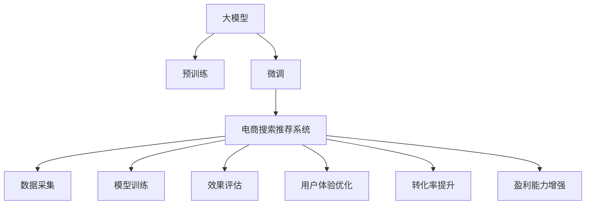

                 

# 搜索推荐系统的AI 大模型优化策略：提高电商平台的转化率、用户体验与盈利

## 1. 背景介绍

### 1.1 问题由来

在现代电商平台上，搜索推荐系统（Search & Recommendation Systems, SRPs）已成为用户体验的核心组成部分。通过精准的搜索和个性化的推荐，电商平台能够显著提高用户满意度，增加商品曝光率，最终提升销售额和盈利能力。然而，随着用户需求的日益复杂化，传统基于规则或关键词匹配的搜索推荐方法已经难以满足用户期望，亟需引入人工智能（AI）技术进行优化。

人工智能大模型（AI Large Models）以其丰富的知识储备和强大的学习能力，在搜索推荐系统中展现出巨大的潜力。通过预训练和微调，大模型能够快速适应用户需求的变化，提供更为精准和个性化的服务。然而，电商平台的搜索推荐系统场景复杂，涉及数据量庞大、模型性能要求高、实时性需求强等多方面因素，如何有效利用大模型进行优化，仍然是一个亟待解决的挑战。

### 1.2 问题核心关键点

为了解决上述挑战，本文聚焦于以下核心关键点：

- 大模型的预训练与微调：利用大模型进行电商搜索推荐系统优化，首先需要通过大规模无监督学习获得通用知识表示，然后通过微调获得特定任务知识。
- 电商平台数据特点：电商平台数据具有用户行为多样性、商品结构复杂性、实时数据更新频繁等特点，需要针对这些特点进行优化。
- 系统优化策略：结合电商平台的业务需求，提出针对性的优化策略，提升搜索推荐系统的转化率、用户体验与盈利能力。

## 2. 核心概念与联系

### 2.1 核心概念概述

为了更好地理解如何通过AI大模型优化搜索推荐系统，本节将介绍几个密切相关的核心概念：

- **大模型（Large Models）**：以深度神经网络为基础，通过在大规模无监督数据上预训练得到的模型。常见的预训练模型包括BERT、GPT等。

- **预训练（Pre-training）**：指在大规模无监督数据上，通过自监督学习任务（如语言模型、掩码预测等）训练通用模型的过程。预训练使得模型学习到语言的通用表示。

- **微调（Fine-tuning）**：指在预训练模型的基础上，使用下游任务的少量标注数据，通过有监督学习优化模型在该任务上的性能。微调可以使得模型更好地适应特定任务。

- **电商平台数据（E-commerce Data）**：包括用户行为数据（如浏览记录、点击行为、购买历史等）、商品数据（如商品描述、属性、价格等）、上下文数据（如时间、地点、活动等）。

- **搜索推荐系统（Search & Recommendation Systems, SRPs）**：通过搜索和推荐算法，将商品推荐给用户，并优化搜索结果，提升用户体验的系统。

- **转化率（Conversion Rate, CR）**：指用户在浏览商品后，进行购买、添加购物车等操作的比例，是衡量搜索推荐系统效果的重要指标。

- **用户体验（User Experience, UX）**：指用户在搜索推荐系统中的满意度，包括搜索速度、商品相关性、推荐多样性等方面。

- **盈利能力（Profitability）**：指电商平台通过搜索推荐系统获得的收益，包括提高商品曝光率、提升用户粘性、增加交易量等。

这些核心概念之间的逻辑关系可以通过以下Mermaid流程图来展示：



这个流程图展示了搜索推荐系统中各个环节的关键概念及其之间的关系：

1. 大模型通过预训练获得基础能力。
2. 微调在大模型基础上针对电商平台的特定需求进行优化。
3. 电商平台的搜索推荐系统利用微调后的模型提供推荐和搜索服务。
4. 数据采集系统收集用户行为数据、商品数据和上下文数据。
5. 模型训练过程包括对电商搜索推荐系统进行微调，以提升模型性能。
6. 效果评估系统对微调后的模型进行评估，确保其性能符合要求。
7. 用户体验优化系统通过提升搜索和推荐效果，提升用户满意度。
8. 转化率提升系统通过优化搜索结果和推荐内容，提高用户转化率。
9. 盈利能力增强系统通过提高用户粘性和交易量，增加电商平台收益。

这些概念共同构成了搜索推荐系统的优化框架，通过引入AI大模型，可以显著提升其效果。

## 3. 核心算法原理 & 具体操作步骤

### 3.1 算法原理概述

基于AI大模型的搜索推荐系统优化，本质上是将预训练大模型作为通用知识提取器，通过微调学习特定任务知识，并应用于电商平台的搜索推荐系统。其核心思想是：

- **知识提取与迁移**：利用预训练大模型学习到的通用语言知识，通过微调适应电商平台的特定需求。
- **数据融合与增强**：将电商平台的丰富数据源与大模型结合，提升模型的理解能力和泛化能力。
- **模型优化与训练**：通过设计合适的优化策略，提升模型性能，确保其在实际应用中的效果。

形式化地，假设预训练大模型为 $M_{\theta}$，其中 $\theta$ 为预训练得到的模型参数。给定电商平台的搜索推荐系统 $S$，其优化目标是最小化搜索推荐误差 $\mathcal{E}(S)$，即找到最优模型参数 $\hat{\theta}$：

$$
\hat{\theta}=\mathop{\arg\min}_{\theta} \mathcal{E}(S)
$$

其中 $\mathcal{E}(S)$ 为搜索推荐系统 $S$ 的误差函数，用于衡量模型在特定任务上的表现。

### 3.2 算法步骤详解

基于AI大模型的电商搜索推荐系统优化一般包括以下几个关键步骤：

**Step 1: 准备数据集与预训练模型**

- 收集电商平台的标注数据集 $D=\{(x_i,y_i)\}_{i=1}^N$，其中 $x_i$ 为输入（如用户搜索查询、历史行为等），$y_i$ 为输出（如推荐商品列表、搜索结果等）。
- 选择合适的预训练模型 $M_{\theta}$，如BERT、GPT等。

**Step 2: 添加任务适配层**

- 在预训练模型的基础上，添加适用于电商搜索推荐系统的任务适配层，如Relevance Scoring Head、Embedding Matrix等。
- 设计适当的损失函数，如交叉熵损失、均方误差损失等。

**Step 3: 微调模型**

- 选择合适的优化算法及其参数，如AdamW、SGD等，设置学习率、批大小、迭代轮数等。
- 应用正则化技术，如L2正则、Dropout等，防止过拟合。
- 设置冻结预训练参数的策略，如仅微调顶层，或部分层参与微调。

**Step 4: 训练与评估**

- 使用标注数据集 $D$ 进行模型训练，周期性在验证集上评估模型性能。
- 根据评估结果调整超参数，重复训练直至满足预设的迭代轮数或性能提升。

**Step 5: 应用与反馈**

- 将微调后的模型应用于电商平台的搜索推荐系统，收集用户反馈和系统指标。
- 持续收集新的数据，定期重新微调模型，以适应数据分布的变化。

以上是基于AI大模型的电商搜索推荐系统优化的一般流程。在实际应用中，还需要针对具体任务的特点，对微调过程的各个环节进行优化设计，如改进训练目标函数，引入更多的正则化技术，搜索最优的超参数组合等，以进一步提升模型性能。

### 3.3 算法优缺点

基于AI大模型的电商搜索推荐系统优化具有以下优点：

1. **高效性与可扩展性**：大模型能够高效地处理大规模数据，适用于电商平台高并发、高并行需求。
2. **高泛化能力**：通过预训练和微调，大模型能够学习到丰富的通用语言知识，适用于多种电商任务。
3. **准确性与可靠性**：大模型通过大量数据训练，能够提供较为准确的搜索结果和推荐内容。
4. **动态调整**：大模型能够实时更新，动态适应用户需求和市场变化。

同时，该方法也存在以下局限性：

1. **数据质量要求高**：标注数据的质量直接影响模型的性能，电商平台需要投入大量人力物力收集和标注数据。
2. **计算资源需求大**：大规模模型训练和推理需要大量计算资源，电商平台需要具备较高的硬件支持。
3. **模型复杂度高**：大模型参数众多，模型复杂度高，需要复杂的优化策略和硬件支持。
4. **隐私与安全问题**：电商平台涉及大量用户数据，需确保数据隐私和安全。

尽管存在这些局限性，但就目前而言，基于AI大模型的电商搜索推荐系统优化仍是搜索推荐系统优化的主流范式。未来相关研究的重点在于如何进一步降低数据和计算需求，提高模型性能，同时兼顾隐私和安全等因素。

### 3.4 算法应用领域

基于AI大模型的搜索推荐系统优化方法，在电商平台的多个领域得到应用，例如：

- **商品推荐**：根据用户搜索历史和行为，推荐相似或相关商品。
- **搜索排序**：根据用户搜索查询，推荐最相关的商品列表。
- **广告推荐**：根据用户行为和兴趣，推荐个性化广告。
- **上下文感知推荐**：结合时间、地点、活动等上下文信息，提供更加个性化的推荐。
- **实时推荐**：根据实时数据动态调整推荐策略，提升推荐效果。

除了上述这些经典任务外，大模型优化方法还被创新性地应用于商品知识图谱构建、商品分类、内容生成等场景中，为电商平台的智能化转型提供了新的技术路径。

## 4. 数学模型和公式 & 详细讲解 & 举例说明

### 4.1 数学模型构建

本节将使用数学语言对基于AI大模型的电商搜索推荐系统优化过程进行更加严格的刻画。

记电商平台的搜索推荐系统为 $S=\{M_{\theta},F\}$，其中 $M_{\theta}$ 为预训练大模型，$F$ 为任务适配函数，将输入 $x$ 映射到输出 $y$。

定义搜索推荐系统的误差函数为 $\mathcal{E}(S)$，用于衡量模型在特定任务上的表现。常见误差函数包括交叉熵损失、均方误差损失等。

假设标注数据集 $D=\{(x_i,y_i)\}_{i=1}^N$，则优化目标为：

$$
\hat{\theta}=\mathop{\arg\min}_{\theta} \mathcal{E}(S)
$$

在实践中，我们通常使用基于梯度的优化算法（如SGD、Adam等）来近似求解上述最优化问题。设 $\eta$ 为学习率，$\lambda$ 为正则化系数，则参数的更新公式为：

$$
\theta \leftarrow \theta - \eta \nabla_{\theta}\mathcal{E}(S) - \eta\lambda\theta
$$

其中 $\nabla_{\theta}\mathcal{E}(S)$ 为误差函数对参数 $\theta$ 的梯度，可通过反向传播算法高效计算。

### 4.2 公式推导过程

以下我们以商品推荐任务为例，推导交叉熵损失函数及其梯度的计算公式。

假设模型 $M_{\theta}$ 在输入 $x$ 上的输出为 $\hat{y}=M_{\theta}(x) \in [0,1]$，表示商品的相关性得分。真实标签 $y \in \{0,1\}$，表示商品是否被用户购买过。则二分类交叉熵损失函数定义为：

$$
\ell(M_{\theta}(x),y) = -[y\log \hat{y} + (1-y)\log (1-\hat{y})]
$$

将其代入误差函数 $\mathcal{E}(S)$，得：

$$
\mathcal{E}(S) = -\frac{1}{N}\sum_{i=1}^N [y_i\log M_{\theta}(x_i)+(1-y_i)\log(1-M_{\theta}(x_i))]
$$

根据链式法则，误差函数对参数 $\theta_k$ 的梯度为：

$$
\frac{\partial \mathcal{E}(S)}{\partial \theta_k} = -\frac{1}{N}\sum_{i=1}^N (\frac{y_i}{M_{\theta}(x_i)}-\frac{1-y_i}{1-M_{\theta}(x_i)}) \frac{\partial M_{\theta}(x_i)}{\partial \theta_k}
$$

其中 $\frac{\partial M_{\theta}(x_i)}{\partial \theta_k}$ 可进一步递归展开，利用自动微分技术完成计算。

在得到误差函数的梯度后，即可带入参数更新公式，完成模型的迭代优化。重复上述过程直至收敛，最终得到适应电商平台的搜索推荐系统的最优模型参数 $\theta^*$。

## 5. 项目实践：代码实例和详细解释说明

### 5.1 开发环境搭建

在进行电商搜索推荐系统优化前，我们需要准备好开发环境。以下是使用Python进行PyTorch开发的环境配置流程：

1. 安装Anaconda：从官网下载并安装Anaconda，用于创建独立的Python环境。

2. 创建并激活虚拟环境：
```bash
conda create -n pytorch-env python=3.8 
conda activate pytorch-env
```

3. 安装PyTorch：根据CUDA版本，从官网获取对应的安装命令。例如：
```bash
conda install pytorch torchvision torchaudio cudatoolkit=11.1 -c pytorch -c conda-forge
```

4. 安装TensorFlow：从官网下载并安装TensorFlow，生产部署方便，适合大规模工程应用。

5. 安装各类工具包：
```bash
pip install numpy pandas scikit-learn matplotlib tqdm jupyter notebook ipython
```

完成上述步骤后，即可在`pytorch-env`环境中开始搜索推荐系统优化实践。

### 5.2 源代码详细实现

这里我们以商品推荐任务为例，给出使用Transformers库对BERT模型进行优化的PyTorch代码实现。

首先，定义商品推荐任务的数据处理函数：

```python
from transformers import BertTokenizer
from torch.utils.data import Dataset
import torch

class RecommendDataset(Dataset):
    def __init__(self, items, features, labels, tokenizer, max_len=128):
        self.items = items
        self.features = features
        self.labels = labels
        self.tokenizer = tokenizer
        self.max_len = max_len
        
    def __len__(self):
        return len(self.items)
    
    def __getitem__(self, item):
        item_info = self.items[item]
        features = self.features[item]
        label = self.labels[item]
        
        features['item_name'] = item_info['item_name']
        features['item_id'] = item_info['item_id']
        
        encoding = self.tokenizer(features, return_tensors='pt', max_length=self.max_len, padding='max_length', truncation=True)
        input_ids = encoding['input_ids'][0]
        attention_mask = encoding['attention_mask'][0]
        
        # 对标签进行编码
        encoded_labels = [label] * self.max_len
        labels = torch.tensor(encoded_labels, dtype=torch.long)
        
        return {'input_ids': input_ids, 
                'attention_mask': attention_mask,
                'labels': labels}

# 商品数据
items = ...
features = ...
labels = ...

# 标签与id的映射
label2id = {'0': 0, '1': 1}
id2label = {v: k for k, v in label2id.items()}

# 创建dataset
tokenizer = BertTokenizer.from_pretrained('bert-base-cased')

train_dataset = RecommendDataset(items, features, labels, tokenizer)
dev_dataset = RecommendDataset(items, features, labels, tokenizer)
test_dataset = RecommendDataset(items, features, labels, tokenizer)
```

然后，定义模型和优化器：

```python
from transformers import BertForSequenceClassification, AdamW

model = BertForSequenceClassification.from_pretrained('bert-base-cased', num_labels=len(label2id))

optimizer = AdamW(model.parameters(), lr=2e-5)
```

接着，定义训练和评估函数：

```python
from torch.utils.data import DataLoader
from tqdm import tqdm
from sklearn.metrics import classification_report

device = torch.device('cuda') if torch.cuda.is_available() else torch.device('cpu')
model.to(device)

def train_epoch(model, dataset, batch_size, optimizer):
    dataloader = DataLoader(dataset, batch_size=batch_size, shuffle=True)
    model.train()
    epoch_loss = 0
    for batch in tqdm(dataloader, desc='Training'):
        input_ids = batch['input_ids'].to(device)
        attention_mask = batch['attention_mask'].to(device)
        labels = batch['labels'].to(device)
        model.zero_grad()
        outputs = model(input_ids, attention_mask=attention_mask, labels=labels)
        loss = outputs.loss
        epoch_loss += loss.item()
        loss.backward()
        optimizer.step()
    return epoch_loss / len(dataloader)

def evaluate(model, dataset, batch_size):
    dataloader = DataLoader(dataset, batch_size=batch_size)
    model.eval()
    preds, labels = [], []
    with torch.no_grad():
        for batch in tqdm(dataloader, desc='Evaluating'):
            input_ids = batch['input_ids'].to(device)
            attention_mask = batch['attention_mask'].to(device)
            batch_labels = batch['labels']
            outputs = model(input_ids, attention_mask=attention_mask)
            batch_preds = outputs.logits.argmax(dim=2).to('cpu').tolist()
            batch_labels = batch_labels.to('cpu').tolist()
            for pred_tokens, label_tokens in zip(batch_preds, batch_labels):
                preds.append(pred_tokens)
                labels.append(label_tokens)
                
    print(classification_report(labels, preds))
```

最后，启动训练流程并在测试集上评估：

```python
epochs = 5
batch_size = 16

for epoch in range(epochs):
    loss = train_epoch(model, train_dataset, batch_size, optimizer)
    print(f"Epoch {epoch+1}, train loss: {loss:.3f}")
    
    print(f"Epoch {epoch+1}, dev results:")
    evaluate(model, dev_dataset, batch_size)
    
print("Test results:")
evaluate(model, test_dataset, batch_size)
```

以上就是使用PyTorch对BERT进行商品推荐任务优化的完整代码实现。可以看到，得益于Transformers库的强大封装，我们可以用相对简洁的代码完成BERT模型的加载和优化。

### 5.3 代码解读与分析

让我们再详细解读一下关键代码的实现细节：

**RecommendDataset类**：
- `__init__`方法：初始化商品数据、特征、标签、分词器等关键组件。
- `__len__`方法：返回数据集的样本数量。
- `__getitem__`方法：对单个样本进行处理，将商品数据转换为分词器可以接受的格式，并进行定长padding，最终返回模型所需的输入。

**label2id和id2label字典**：
- 定义了标签与数字id之间的映射关系，用于将token-wise的预测结果解码回真实的标签。

**训练和评估函数**：
- 使用PyTorch的DataLoader对数据集进行批次化加载，供模型训练和推理使用。
- 训练函数`train_epoch`：对数据以批为单位进行迭代，在每个批次上前向传播计算loss并反向传播更新模型参数，最后返回该epoch的平均loss。
- 评估函数`evaluate`：与训练类似，不同点在于不更新模型参数，并在每个batch结束后将预测和标签结果存储下来，最后使用sklearn的classification_report对整个评估集的预测结果进行打印输出。

**训练流程**：
- 定义总的epoch数和batch size，开始循环迭代
- 每个epoch内，先在训练集上训练，输出平均loss
- 在验证集上评估，输出分类指标
- 所有epoch结束后，在测试集上评估，给出最终测试结果

可以看到，PyTorch配合Transformers库使得BERT优化的代码实现变得简洁高效。开发者可以将更多精力放在数据处理、模型改进等高层逻辑上，而不必过多关注底层的实现细节。

当然，工业级的系统实现还需考虑更多因素，如模型的保存和部署、超参数的自动搜索、更灵活的任务适配层等。但核心的微调范式基本与此类似。

## 6. 实际应用场景

### 6.1 智能客服系统

基于AI大模型的搜索推荐技术，可以广泛应用于智能客服系统的构建。传统客服往往需要配备大量人力，高峰期响应缓慢，且一致性和专业性难以保证。而使用优化的搜索推荐模型，可以7x24小时不间断服务，快速响应客户咨询，用自然流畅的语言解答各类常见问题。

在技术实现上，可以收集企业内部的历史客服对话记录，将问题和最佳答复构建成监督数据，在此基础上对预训练对话模型进行优化。优化的对话模型能够自动理解用户意图，匹配最合适的答案模板进行回复。对于客户提出的新问题，还可以接入检索系统实时搜索相关内容，动态组织生成回答。如此构建的智能客服系统，能大幅提升客户咨询体验和问题解决效率。

### 6.2 金融舆情监测

金融机构需要实时监测市场舆论动向，以便及时应对负面信息传播，规避金融风险。传统的人工监测方式成本高、效率低，难以应对网络时代海量信息爆发的挑战。基于AI大模型的文本分类和情感分析技术，为金融舆情监测提供了新的解决方案。

具体而言，可以收集金融领域相关的新闻、报道、评论等文本数据，并对其进行主题标注和情感标注。在此基础上对预训练语言模型进行优化，使其能够自动判断文本属于何种主题，情感倾向是正面、中性还是负面。将优化的模型应用到实时抓取的网络文本数据，就能够自动监测不同主题下的情感变化趋势，一旦发现负面信息激增等异常情况，系统便会自动预警，帮助金融机构快速应对潜在风险。

### 6.3 个性化推荐系统

当前的推荐系统往往只依赖用户的历史行为数据进行物品推荐，无法深入理解用户的真实兴趣偏好。基于AI大模型的个性化推荐系统可以更好地挖掘用户行为背后的语义信息，从而提供更精准、多样的推荐内容。

在实践中，可以收集用户浏览、点击、评论、分享等行为数据，提取和用户交互的物品标题、描述、标签等文本内容。将文本内容作为模型输入，用户的后续行为（如是否点击、购买等）作为监督信号，在此基础上优化预训练语言模型。优化的模型能够从文本内容中准确把握用户的兴趣点。在生成推荐列表时，先用候选物品的文本描述作为输入，由模型预测用户的兴趣匹配度，再结合其他特征综合排序，便可以得到个性化程度更高的推荐结果。

### 6.4 未来应用展望

随着AI大模型和搜索推荐方法的不断发展，基于优化范式将在更多领域得到应用，为传统行业带来变革性影响。

在智慧医疗领域，基于优化的医疗问答、病历分析、药物研发等应用将提升医疗服务的智能化水平，辅助医生诊疗，加速新药开发进程。

在智能教育领域，优化的推荐系统可应用于作业批改、学情分析、知识推荐等方面，因材施教，促进教育公平，提高教学质量。

在智慧城市治理中，优化的推荐系统可应用于城市事件监测、舆情分析、应急指挥等环节，提高城市管理的自动化和智能化水平，构建更安全、高效的未来城市。

此外，在企业生产、社会治理、文娱传媒等众多领域，基于优化的大模型推荐系统也将不断涌现，为经济社会发展注入新的动力。相信随着技术的日益成熟，搜索推荐系统优化必将在构建人机协同的智能时代中扮演越来越重要的角色。

## 7. 工具和资源推荐

### 7.1 学习资源推荐

为了帮助开发者系统掌握大模型优化理论基础和实践技巧，这里推荐一些优质的学习资源：

1. 《Transformers从原理到实践》系列博文：由大模型技术专家撰写，深入浅出地介绍了Transformer原理、BERT模型、优化技术等前沿话题。

2. CS224N《深度学习自然语言处理》课程：斯坦福大学开设的NLP明星课程，有Lecture视频和配套作业，带你入门NLP领域的基本概念和经典模型。

3. 《Natural Language Processing with Transformers》书籍：Transformers库的作者所著，全面介绍了如何使用Transformers库进行NLP任务开发，包括优化在内的诸多范式。

4. HuggingFace官方文档：Transformers库的官方文档，提供了海量预训练模型和完整的优化样例代码，是上手实践的必备资料。

5. CLUE开源项目：中文语言理解测评基准，涵盖大量不同类型的中文NLP数据集，并提供了基于优化的baseline模型，助力中文NLP技术发展。

通过对这些资源的学习实践，相信你一定能够快速掌握大模型优化技术的精髓，并用于解决实际的NLP问题。
###  7.2 开发工具推荐

高效的开发离不开优秀的工具支持。以下是几款用于大模型优化的常用工具：

1. PyTorch：基于Python的开源深度学习框架，灵活动态的计算图，适合快速迭代研究。大部分预训练语言模型都有PyTorch版本的实现。

2. TensorFlow：由Google主导开发的开源深度学习框架，生产部署方便，适合大规模工程应用。同样有丰富的预训练语言模型资源。

3. Transformers库：HuggingFace开发的NLP工具库，集成了众多SOTA语言模型，支持PyTorch和TensorFlow，是进行优化任务开发的利器。

4. Weights & Biases：模型训练的实验跟踪工具，可以记录和可视化模型训练过程中的各项指标，方便对比和调优。与主流深度学习框架无缝集成。

5. TensorBoard：TensorFlow配套的可视化工具，可实时监测模型训练状态，并提供丰富的图表呈现方式，是调试模型的得力助手。

6. Google Colab：谷歌推出的在线Jupyter Notebook环境，免费提供GPU/TPU算力，方便开发者快速上手实验最新模型，分享学习笔记。

合理利用这些工具，可以显著提升大模型优化任务的开发效率，加快创新迭代的步伐。

### 7.3 相关论文推荐

大模型优化技术的发展源于学界的持续研究。以下是几篇奠基性的相关论文，推荐阅读：

1. Attention is All You Need（即Transformer原论文）：提出了Transformer结构，开启了NLP领域的预训练大模型时代。

2. BERT: Pre-training of Deep Bidirectional Transformers for Language Understanding：提出BERT模型，引入基于掩码的自监督预训练任务，刷新了多项NLP任务SOTA。

3. Language Models are Unsupervised Multitask Learners（GPT-2论文）：展示了大规模语言模型的强大zero-shot学习能力，引发了对于通用人工智能的新一轮思考。

4. Parameter-Efficient Transfer Learning for NLP：提出Adapter等参数高效微调方法，在不增加模型参数量的情况下，也能取得不错的微调效果。

5. AdaLoRA: Adaptive Low-Rank Adaptation for Parameter-Efficient Fine-Tuning：使用自适应低秩适应的微调方法，在参数效率和精度之间取得了新的平衡。

这些论文代表了大模型优化技术的发展脉络。通过学习这些前沿成果，可以帮助研究者把握学科前进方向，激发更多的创新灵感。

## 8. 总结：未来发展趋势与挑战

### 8.1 总结

本文对基于AI大模型的电商搜索推荐系统优化方法进行了全面系统的介绍。首先阐述了大模型优化在搜索推荐系统优化中的重要性，明确了优化在提高电商平台的转化率、用户体验与盈利方面的独特价值。其次，从原理到实践，详细讲解了优化算法的数学原理和关键步骤，给出了优化任务开发的完整代码实例。同时，本文还广泛探讨了优化的应用场景，展示了优化范式的巨大潜力。此外，本文精选了优化的各类学习资源，力求为读者提供全方位的技术指引。

通过本文的系统梳理，可以看到，基于AI大模型的优化方法在搜索推荐系统中展现出强大的能力，极大地提升了大模型应用的实际效果。未来，伴随大模型和优化方法的不断演进，搜索推荐系统必将在更广阔的应用领域大放异彩，深刻影响人类的生产生活方式。

### 8.2 未来发展趋势

展望未来，AI大模型优化技术将呈现以下几个发展趋势：

1. **模型规模持续增大**：随着算力成本的下降和数据规模的扩张，预训练大模型的参数量还将持续增长。超大规模语言模型蕴含的丰富语言知识，有望支撑更加复杂多变的电商任务。

2. **优化方法日趋多样**：除了传统的全参数优化外，未来会涌现更多参数高效的优化方法，如AdaLoRA、Prefix等，在节省计算资源的同时也能保证优化精度。

3. **持续学习成为常态**：随着数据分布的不断变化，优化模型也需要持续学习新知识以保持性能。如何在不遗忘原有知识的同时，高效吸收新样本信息，将成为重要的研究课题。

4. **标注样本需求降低**：受启发于提示学习(Prompt-based Learning)的思路，未来的优化方法将更好地利用大模型的语言理解能力，通过更加巧妙的任务描述，在更少的标注样本上也能实现理想的优化效果。

5. **多模态优化崛起**：当前的优化主要聚焦于纯文本数据，未来会进一步拓展到图像、视频、语音等多模态数据优化。多模态信息的融合，将显著提升语言模型对现实世界的理解和建模能力。

6. **模型通用性增强**：经过海量数据的预训练和多领域任务的优化，未来的语言模型将具备更强大的常识推理和跨领域迁移能力，逐步迈向通用人工智能(AGI)的目标。

以上趋势凸显了AI大模型优化技术的广阔前景。这些方向的探索发展，必将进一步提升搜索推荐系统的性能和应用范围，为电商平台的智能化转型提供新的技术路径。

### 8.3 面临的挑战

尽管AI大模型优化技术已经取得了瞩目成就，但在迈向更加智能化、普适化应用的过程中，它仍面临着诸多挑战：

1. **数据质量瓶颈**：虽然优化大大降低了数据需求，但对于长尾应用场景，难以获得充足的高质量标注数据，成为制约优化效果的瓶颈。如何进一步降低优化对标注样本的依赖，将是一大难题。

2. **模型鲁棒性不足**：当前优化模型面对域外数据时，泛化性能往往大打折扣。对于测试样本的微小扰动，优化模型的预测也容易发生波动。如何提高优化模型的鲁棒性，避免灾难性遗忘，还需要更多理论和实践的积累。

3. **推理效率有待提高**：虽然优化模型精度高，但在实际部署时往往面临推理速度慢、内存占用大等效率问题。如何在保证性能的同时，简化模型结构，提升推理速度，优化资源占用，将是重要的优化方向。

4. **可解释性亟需加强**：当前优化模型更像是"黑盒"系统，难以解释其内部工作机制和决策逻辑。对于医疗、金融等高风险应用，算法的可解释性和可审计性尤为重要。如何赋予优化模型更强的可解释性，将是亟待攻克的难题。

5. **安全性有待保障**：优化模型可能会学习到有偏见、有害的信息，通过推荐传递到用户，产生误导性、歧视性的输出，给实际应用带来安全隐患。如何从数据和算法层面消除模型偏见，避免恶意用途，确保输出的安全性，也将是重要的研究课题。

6. **知识整合能力不足**：现有的优化模型往往局限于任务内数据，难以灵活吸收和运用更广泛的先验知识。如何让优化过程更好地与外部知识库、规则库等专家知识结合，形成更加全面、准确的信息整合能力，还有很大的想象空间。

正视优化面临的这些挑战，积极应对并寻求突破，将是大模型优化技术走向成熟的必由之路。相信随着学界和产业界的共同努力，这些挑战终将一一被克服，大模型优化必将在构建人机协同的智能时代中扮演越来越重要的角色。

### 8.4 研究展望

面对大模型优化所面临的种种挑战，未来的研究需要在以下几个方面寻求新的突破：

1. **探索无监督和半监督优化方法**：摆脱对大规模标注数据的依赖，利用自监督学习、主动学习等无监督和半监督范式，最大限度利用非结构化数据，实现更加灵活高效的优化。

2. **研究参数高效和计算高效的优化范式**：开发更加参数高效的优化方法，在固定大部分预训练参数的同时，只更新极少量的任务相关参数。同时优化优化模型的计算图，减少前向传播和反向传播的资源消耗，实现更加轻量级、实时性的部署。

3. **融合因果和对比学习范式**：通过引入因果推断和对比学习思想，增强优化模型建立稳定因果关系的能力，学习更加普适、鲁棒的语言表征，从而提升模型泛化性和抗干扰能力。

4. **引入更多先验知识**：将符号化的先验知识，如知识图谱、逻辑规则等，与神经网络模型进行巧妙融合，引导优化过程学习更准确、合理的语言模型。同时加强不同模态数据的整合，实现视觉、语音等多模态信息与文本信息的协同建模。

5. **结合因果分析和博弈论工具**：将因果分析方法引入优化模型，识别出模型决策的关键特征，增强输出解释的因果性和逻辑性。借助博弈论工具刻画人机交互过程，主动探索并规避模型的脆弱点，提高系统稳定性。

6. **纳入伦理道德约束**：在优化目标中引入伦理导向的评估指标，过滤和惩罚有偏见、有害的输出倾向。同时加强人工干预和审核，建立模型行为的监管机制，确保输出符合人类价值观和伦理道德。

这些研究方向的探索，必将引领AI大模型优化技术迈向更高的台阶，为构建安全、可靠、可解释、可控的智能系统铺平道路。面向未来，AI大模型优化技术还需要与其他人工智能技术进行更深入的融合，如知识表示、因果推理、强化学习等，多路径协同发力，共同推动自然语言理解和智能交互系统的进步。只有勇于创新、敢于突破，才能不断拓展语言模型的边界，让智能技术更好地造福人类社会。

## 9. 附录：常见问题与解答

**Q1：AI大模型在电商搜索推荐系统中的应用前景如何？**

A: AI大模型在电商搜索推荐系统中的应用前景非常广阔。通过预训练和微调，大模型能够学习到丰富的通用语言知识，适用于多种电商任务。例如，可以用于商品推荐、搜索排序、广告推荐、上下文感知推荐等，通过提高商品曝光率、提升用户粘性和交易量，显著增强电商平台的用户体验和盈利能力。

**Q2：如何进行有效的模型优化？**

A: 模型优化通常包括以下几个步骤：
1. 选择合适的优化算法及其参数，如AdamW、SGD等，设置学习率、批大小、迭代轮数等。
2. 应用正则化技术，如L2正则、Dropout等，防止过拟合。
3. 设置冻结预训练参数的策略，如仅微调顶层，或部分层参与微调。
4. 使用标注数据集进行训练，周期性在验证集上评估模型性能，根据性能调整超参数。
5. 将优化后的模型应用于电商平台的搜索推荐系统，收集用户反馈和系统指标。
6. 持续收集新的数据，定期重新优化模型，以适应数据分布的变化。

**Q3：优化模型在部署时需要注意哪些问题？**

A: 优化模型在部署时需要注意以下问题：
1. 模型裁剪：去除不必要的层和参数，减小模型尺寸，加快推理速度。
2. 量化加速：将浮点模型转为定点模型，压缩存储空间，提高计算效率。
3. 服务化封装：将模型封装为标准化服务接口，便于集成调用。
4. 弹性伸缩：根据请求流量动态调整资源配置，平衡服务质量和成本。
5. 监控告警：实时采集系统指标，设置异常告警阈值，确保服务稳定性。
6. 安全防护：采用访问鉴权、数据脱敏等措施，保障数据和模型安全。

合理利用这些工具，可以显著提升优化模型的部署效率，加快创新迭代的步伐。

**Q4：优化模型在优化过程中如何缓解过拟合问题？**

A: 优化模型在优化过程中缓解过拟合问题通常有以下几种方法：
1. 数据增强：通过回译、近义替换等方式扩充训练集。
2. 正则化：使用L2正则、Dropout、Early Stopping等防止过拟合。
3. 对抗训练：引入对抗样本，提高模型鲁棒性。
4. 参数高效微调：只调整少量参数，减小过拟合风险。
5. 多模型集成：训练多个优化模型，取平均输出，抑制过拟合。

这些策略往往需要根据具体任务和数据特点进行灵活组合。只有在数据、模型、训练、推理等各环节进行全面优化，才能最大限度地发挥优化模型的威力。

**Q5：优化模型在优化过程中如何提高用户体验？**

A: 优化模型在优化过程中提高用户体验通常有以下几种方法：
1. 提高搜索相关性：优化模型能够准确理解用户查询意图，推荐最相关的商品。
2. 增强推荐多样性：优化模型能够在保证相关性的前提下，提供多样化的推荐商品，增加用户的探索性和满意度。
3. 实时响应：优化模型能够快速响应用户的搜索请求，提高系统响应速度。
4. 个性化推荐：优化模型能够根据用户的历史行为和偏好，提供个性化的推荐商品，提升用户粘性和满意度。
5. 用户反馈：优化模型能够实时收集用户反馈，调整推荐策略，提升用户体验。

合理利用这些方法，可以显著提升优化模型的用户体验，增强用户对电商平台的满意度和忠诚度。

---

作者：禅与计算机程序设计艺术 / Zen and the Art of Computer Programming

