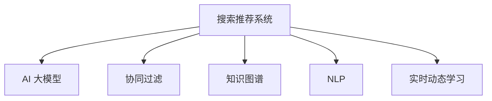

                 

# 搜索推荐系统的AI 大模型融合：电商平台的战略核心与竞争优势

> 关键词：搜索推荐系统, AI 大模型融合, 电商平台, 战略核心, 竞争优势, 用户行为分析, 自然语言处理, 深度学习, 协同过滤

## 1. 背景介绍

### 1.1 问题由来
在当前电商领域，搜索推荐系统已成为用户体验和商家转化率的重要驱动因素。随着消费者需求日益多样化、个性化，搜索推荐系统需要更高效、更精准地匹配商品与用户需求。同时，传统推荐系统面临数据稀疏、算法单一等问题，难以满足多变市场的复杂需求。

为此，各大电商平台纷纷引入人工智能（AI）大模型，借助先进的深度学习算法和自然语言处理技术，提升搜索推荐系统的智能化水平。但实际应用中，如何将大模型有效融合到搜索推荐系统中，依然是摆在企业面前的一大挑战。

### 1.2 问题核心关键点
大模型融合搜索推荐系统涉及以下关键点：
1. **跨领域知识整合**：如何在大模型中融合电商领域的知识，提升推荐系统性能。
2. **实时动态学习**：如何在不断变化的电商环境中，实时更新大模型，保持推荐系统的新鲜度。
3. **用户行为分析**：如何利用自然语言处理技术，深入分析用户行为，生成更具个性化和针对性的推荐。
4. **模型融合优化**：如何在大模型中融合多种算法，形成协同效应，提升推荐效果。
5. **模型评估与调优**：如何通过合理的评估指标，及时发现问题，优化模型。

### 1.3 问题研究意义
研究大模型与搜索推荐系统的融合方法，对于提升电商平台的推荐精准度、优化用户体验、提高转化率具有重要意义。

1. **精准推荐**：大模型融合可以大幅提升推荐系统的精准度，通过深度学习和自然语言处理技术，从多维度理解用户需求，提供更符合用户期望的推荐。
2. **个性化服务**：大模型融合能够根据用户行为数据，个性化推荐商品，提高用户满意度。
3. **实时性提升**：通过实时动态学习，大模型能够及时捕捉市场变化，保持推荐内容的时效性和相关性。
4. **多模态融合**：大模型融合能够融合图像、视频、文本等多种模态数据，提升推荐系统的全面性和多样性。

此外，大模型融合搜索推荐系统还将推动电商平台的智能化升级，带来更高效的用户交互和更丰富的购物体验，进一步巩固平台在市场中的竞争优势。

## 2. 核心概念与联系

### 2.1 核心概念概述

为更好地理解大模型与搜索推荐系统的融合方法，本节将介绍几个密切相关的核心概念：

- **搜索推荐系统**：电商平台中用于帮助用户快速找到所需商品的系统，包括搜索引擎、推荐引擎等。通过算法匹配用户需求和商品特性，提供个性化推荐。
- **AI 大模型**：以深度学习为代表的高级AI模型，如BERT、GPT等，具有强大的学习能力和泛化能力，能够处理大规模复杂数据。
- **协同过滤**：推荐系统中常用的算法之一，通过用户历史行为相似度推荐商品。
- **知识图谱**：将商品、用户、事件等实体及其关系结构化的图谱，用于辅助推荐系统理解商品和用户信息。
- **自然语言处理（NLP）**：利用计算机处理和理解人类自然语言的技术，用于提取用户查询中的关键信息。
- **实时动态学习**：通过在线学习算法，实时更新模型参数，适应电商环境的动态变化。

这些核心概念之间的逻辑关系可以通过以下Mermaid流程图来展示：



这个流程图展示了大模型与搜索推荐系统的核心概念及其之间的关系：

1. 大模型通过学习海量电商数据，获得商品和用户的高级表征。
2. 协同过滤算法利用用户历史行为进行推荐，与大模型形成互补。
3. 知识图谱辅助理解商品和用户信息，增强推荐系统知识深度。
4. NLP技术提取用户查询中的关键信息，指导模型匹配推荐。
5. 实时动态学习算法保证模型实时更新，应对电商环境变化。

这些概念共同构成了大模型与搜索推荐系统的融合框架，使其能够在电商推荐场景中发挥强大的智能效能。通过理解这些核心概念，我们可以更好地把握大模型融合搜索推荐系统的关键技术点。

## 3. 核心算法原理 & 具体操作步骤
### 3.1 算法原理概述

大模型与搜索推荐系统的融合，本质上是一种跨领域知识的迁移学习过程。其核心思想是：将大模型的通用知识，迁移应用到特定领域的搜索推荐系统，通过深度学习和自然语言处理技术，提升推荐系统的性能。

具体来说，可以将其分为以下几个步骤：
1. **数据预处理**：清洗、整合电商数据，提取用户行为特征。
2. **模型选择与适配**：选择合适的预训练模型，并根据电商领域需求，添加或修改任务适配层。
3. **融合算法设计**：在大模型基础上，设计融合算法，将多种推荐算法（如协同过滤、知识图谱、NLP等）结合。
4. **模型训练与优化**：在电商数据上训练模型，并使用合理的优化算法进行参数调整。
5. **实时学习与更新**：通过在线学习算法，实时更新模型，适应电商市场的动态变化。
6. **效果评估与调优**：使用多种评估指标，监测模型效果，进行模型调优。

### 3.2 算法步骤详解

**Step 1: 数据预处理**

电商数据通常包含商品信息、用户行为、交易记录等多种类型。数据预处理的目的是清洗数据、提取特征，形成可用于大模型训练的数据集。

具体步骤如下：
1. **数据清洗**：删除噪音数据、处理缺失值、去除重复数据等。
2. **特征提取**：通过特征工程方法，提取用户行为、商品属性等特征。
3. **数据增强**：通过数据增强技术，如数据扩充、合成数据等，增加数据多样性。
4. **数据划分**：将数据划分为训练集、验证集和测试集。

**Step 2: 模型选择与适配**

选择合适的预训练模型是融合大模型的第一步。通常选择在大规模无标签电商数据上预训练的通用语言模型，如BERT、GPT等。

根据电商推荐系统的需求，添加或修改任务适配层。例如，可以在模型顶部添加分类器，用于预测商品类别；或者添加回归器，用于预测商品价格等。

**Step 3: 融合算法设计**

在大模型基础上，设计融合算法，将多种推荐算法结合。例如，可以将协同过滤算法与大模型结合，利用大模型预测用户潜在兴趣，结合历史行为相似度进行推荐。

具体步骤如下：
1. **算法选择**：根据任务需求，选择合适的推荐算法，如协同过滤、知识图谱等。
2. **算法融合**：将多种算法结合，形成综合推荐模型。
3. **算法调优**：使用超参数优化方法，调整算法参数，提升推荐效果。

**Step 4: 模型训练与优化**

在电商数据上训练模型，并使用合理的优化算法进行参数调整。

具体步骤如下：
1. **模型初始化**：根据选择的预训练模型，初始化模型参数。
2. **模型训练**：在电商数据上训练模型，使用优化算法更新参数。
3. **模型验证**：在验证集上评估模型效果，根据评估指标调整模型参数。
4. **模型测试**：在测试集上测试模型效果，对比微调前后的性能提升。

**Step 5: 实时学习与更新**

通过在线学习算法，实时更新模型，适应电商市场的动态变化。

具体步骤如下：
1. **实时数据采集**：实时采集电商数据，包括用户行为、商品信息等。
2. **实时学习**：使用在线学习算法，更新模型参数。
3. **模型更新**：根据实时学习结果，更新模型。
4. **效果评估**：实时评估模型效果，确保推荐系统性能稳定。

**Step 6: 效果评估与调优**

使用多种评估指标，监测模型效果，进行模型调优。

具体步骤如下：
1. **评估指标选择**：选择合适的评估指标，如点击率、转化率、召回率等。
2. **效果评估**：在测试集上评估模型效果，对比微调前后的性能提升。
3. **调优策略**：根据评估结果，调整模型参数，优化模型效果。
4. **持续改进**：定期更新模型，保持推荐系统的新鲜度。

### 3.3 算法优缺点

大模型融合搜索推荐系统有以下优点：
1. **多源信息融合**：能够融合电商领域的多种信息源，如商品信息、用户行为、知识图谱等，提升推荐系统的全面性和多样性。
2. **动态学习能力**：通过实时动态学习，能够及时捕捉市场变化，保持推荐系统的新鲜度。
3. **精度提升**：利用大模型的强大泛化能力，提升推荐系统的精度。
4. **算法互补**：多种推荐算法（如协同过滤、知识图谱、NLP等）互补结合，提升推荐效果。

同时，该方法也存在一定的局限性：
1. **计算资源需求高**：大模型融合搜索推荐系统需要大量的计算资源，如高性能GPU/TPU。
2. **模型复杂度高**：融合算法设计复杂，需要多种算法结合，增加模型调优难度。
3. **数据质量要求高**：数据预处理和特征提取难度大，需要高质量的数据支持。
4. **模型稳定性问题**：大模型与搜索推荐系统结合，可能导致模型稳定性问题，需要谨慎设计。

尽管存在这些局限性，但就目前而言，大模型融合搜索推荐系统仍是电商推荐领域的主流范式。未来相关研究的重点在于如何进一步降低计算资源需求，提高模型稳定性，同时兼顾多源信息融合和动态学习能力，以实现更高效的电商推荐。

### 3.4 算法应用领域

大模型融合搜索推荐系统已经在多个电商平台得到应用，覆盖了几乎所有推荐任务，例如：

- **商品推荐**：根据用户历史行为和实时数据，推荐用户可能感兴趣的商品。
- **跨品类推荐**：通过大模型融合知识图谱，推荐跨品类关联商品，如搭配销售。
- **个性化广告**：根据用户行为数据和查询信息，推荐个性化广告，提高广告点击率。
- **搜索优化**：利用自然语言处理技术，优化搜索算法，提高搜索效果。
- **内容推荐**：根据用户浏览历史和实时数据，推荐相关内容，如商品描述、用户评价等。

除了这些经典任务外，大模型融合搜索推荐系统也被创新性地应用到更多场景中，如用户画像生成、实时热点推荐、动态价格预测等，为电商推荐系统带来了全新的突破。

## 4. 数学模型和公式 & 详细讲解  
### 4.1 数学模型构建

本节将使用数学语言对大模型与搜索推荐系统的融合过程进行更加严格的刻画。

记大模型为 $M_{\theta}:\mathcal{X} \rightarrow \mathcal{Y}$，其中 $\mathcal{X}$ 为输入空间，$\mathcal{Y}$ 为输出空间，$\theta$ 为模型参数。假设电商推荐系统的训练集为 $D=\{(x_i,y_i)\}_{i=1}^N$，其中 $x_i$ 为用户行为数据，$y_i$ 为推荐结果。

定义模型 $M_{\theta}$ 在数据样本 $(x,y)$ 上的损失函数为 $\ell(M_{\theta}(x),y)$，则在数据集 $D$ 上的经验风险为：

$$
\mathcal{L}(\theta) = \frac{1}{N} \sum_{i=1}^N \ell(M_{\theta}(x_i),y_i)
$$

微调的优化目标是最小化经验风险，即找到最优参数：

$$
\theta^* = \mathop{\arg\min}_{\theta} \mathcal{L}(\theta)
$$

在实践中，我们通常使用基于梯度的优化算法（如SGD、Adam等）来近似求解上述最优化问题。设 $\eta$ 为学习率，$\lambda$ 为正则化系数，则参数的更新公式为：

$$
\theta \leftarrow \theta - \eta \nabla_{\theta}\mathcal{L}(\theta) - \eta\lambda\theta
$$

其中 $\nabla_{\theta}\mathcal{L}(\theta)$ 为损失函数对参数 $\theta$ 的梯度，可通过反向传播算法高效计算。

### 4.2 公式推导过程

以下我们以协同过滤推荐系统为例，推导模型的损失函数及其梯度的计算公式。

假设协同过滤算法使用基于用户-商品相似度的推荐方式。给定用户 $u$ 和商品 $i$，推荐结果 $y$ 为是否推荐商品 $i$。根据协同过滤算法，推荐结果 $y$ 可以表示为：

$$
y = \text{sign}(\sum_{j \in \mathcal{U}} \alpha_{uj} \alpha_{ji} M_{\theta}(u_j))
$$

其中，$\alpha_{uj}$ 和 $\alpha_{ji}$ 分别为用户 $u$ 对商品 $j$ 的评分和商品 $j$ 对商品 $i$ 的评分，$M_{\theta}(u_j)$ 为预测用户 $u$ 对商品 $j$ 的评分。

将推荐结果 $y$ 带入损失函数，得到：

$$
\ell(M_{\theta}(u),y) = -[y \log y + (1-y) \log (1-y)]
$$

将其代入经验风险公式，得：

$$
\mathcal{L}(\theta) = -\frac{1}{N} \sum_{i=1}^N \sum_{u=1}^U y_i \log y_i + (1-y_i) \log (1-y_i)
$$

根据链式法则，损失函数对参数 $\theta_k$ 的梯度为：

$$
\frac{\partial \mathcal{L}(\theta)}{\partial \theta_k} = -\frac{1}{N} \sum_{i=1}^N \sum_{u=1}^U (\frac{y_i}{M_{\theta}(u_j)}-\frac{1-y_i}{1-M_{\theta}(u_j)}) \frac{\partial M_{\theta}(u_j)}{\partial \theta_k}
$$

其中 $\frac{\partial M_{\theta}(u_j)}{\partial \theta_k}$ 可进一步递归展开，利用自动微分技术完成计算。

在得到损失函数的梯度后，即可带入参数更新公式，完成模型的迭代优化。重复上述过程直至收敛，最终得到适应电商推荐任务的最优模型参数 $\theta^*$。

## 5. 项目实践：代码实例和详细解释说明
### 5.1 开发环境搭建

在进行电商推荐系统的大模型融合实践前，我们需要准备好开发环境。以下是使用Python进行PyTorch开发的环境配置流程：

1. 安装Anaconda：从官网下载并安装Anaconda，用于创建独立的Python环境。

2. 创建并激活虚拟环境：
```bash
conda create -n pytorch-env python=3.8 
conda activate pytorch-env
```

3. 安装PyTorch：根据CUDA版本，从官网获取对应的安装命令。例如：
```bash
conda install pytorch torchvision torchaudio cudatoolkit=11.1 -c pytorch -c conda-forge
```

4. 安装Transformers库：
```bash
pip install transformers
```

5. 安装各类工具包：
```bash
pip install numpy pandas scikit-learn matplotlib tqdm jupyter notebook ipython
```

完成上述步骤后，即可在`pytorch-env`环境中开始微调实践。

### 5.2 源代码详细实现

下面我们以协同过滤推荐系统为例，给出使用Transformers库对BERT模型进行微调的PyTorch代码实现。

首先，定义协同过滤推荐系统的数据处理函数：

```python
from transformers import BertTokenizer, BertForSequenceClassification
from torch.utils.data import Dataset, DataLoader
import torch

class RecommendationDataset(Dataset):
    def __init__(self, user_ids, item_ids, user_item_interactions, tokenizer, max_len=128):
        self.user_ids = user_ids
        self.item_ids = item_ids
        self.user_item_interactions = user_item_interactions
        self.tokenizer = tokenizer
        self.max_len = max_len
        
    def __len__(self):
        return len(self.user_ids)
    
    def __getitem__(self, item):
        user_id = self.user_ids[item]
        item_id = self.item_ids[item]
        user_item_interaction = self.user_item_interactions[item]
        
        user_token = self.tokenizer([user_id], padding='max_length', truncation=True, max_length=self.max_len)[0]
        item_token = self.tokenizer([item_id], padding='max_length', truncation=True, max_length=self.max_len)[0]
        user_item_interaction_token = self.tokenizer([user_item_interaction], padding='max_length', truncation=True, max_length=self.max_len)[0]
        
        input_ids = torch.tensor(user_token + item_token + user_item_interaction_token)
        labels = torch.tensor([1 if user_item_interaction == 1 else 0])
        
        return {'input_ids': input_ids, 
                'labels': labels}
        
# 用户ID列表、商品ID列表、用户-商品交互记录
user_ids = ...
item_ids = ...
user_item_interactions = ...
```

然后，定义模型和优化器：

```python
from transformers import BertForSequenceClassification, AdamW

model = BertForSequenceClassification.from_pretrained('bert-base-cased', num_labels=2)

optimizer = AdamW(model.parameters(), lr=2e-5)
```

接着，定义训练和评估函数：

```python
from tqdm import tqdm

device = torch.device('cuda') if torch.cuda.is_available() else torch.device('cpu')
model.to(device)

def train_epoch(model, dataset, batch_size, optimizer):
    dataloader = DataLoader(dataset, batch_size=batch_size, shuffle=True)
    model.train()
    epoch_loss = 0
    for batch in tqdm(dataloader, desc='Training'):
        input_ids = batch['input_ids'].to(device)
        labels = batch['labels'].to(device)
        model.zero_grad()
        outputs = model(input_ids, labels=labels)
        loss = outputs.loss
        epoch_loss += loss.item()
        loss.backward()
        optimizer.step()
    return epoch_loss / len(dataloader)

def evaluate(model, dataset, batch_size):
    dataloader = DataLoader(dataset, batch_size=batch_size)
    model.eval()
    total_correct = 0
    total_items = 0
    with torch.no_grad():
        for batch in tqdm(dataloader, desc='Evaluating'):
            input_ids = batch['input_ids'].to(device)
            labels = batch['labels'].to(device)
            outputs = model(input_ids)
            predictions = outputs.logits.argmax(dim=1).to('cpu').tolist()
            total_correct += sum([predictions[i] == labels[i] for i in range(len(labels))])
            total_items += len(labels)
            
    print(f"Precision@1: {total_correct/total_items:.2f}")
```

最后，启动训练流程并在测试集上评估：

```python
epochs = 5
batch_size = 16

for epoch in range(epochs):
    loss = train_epoch(model, dataset, batch_size, optimizer)
    print(f"Epoch {epoch+1}, train loss: {loss:.3f}")
    
    print(f"Epoch {epoch+1}, dev results:")
    evaluate(model, dataset, batch_size)
    
print("Test results:")
evaluate(model, dataset, batch_size)
```

以上就是使用PyTorch对BERT进行协同过滤推荐系统微调的完整代码实现。可以看到，得益于Transformers库的强大封装，我们可以用相对简洁的代码完成BERT模型的加载和微调。

### 5.3 代码解读与分析

让我们再详细解读一下关键代码的实现细节：

**RecommendationDataset类**：
- `__init__`方法：初始化用户ID、商品ID、用户-商品交互记录等关键组件。
- `__len__`方法：返回数据集的样本数量。
- `__getitem__`方法：对单个样本进行处理，将用户ID、商品ID、用户-商品交互记录输入编码为token ids，最终返回模型所需的输入。

**模型选择与适配**：
- 选择在大规模无标签电商数据上预训练的通用语言模型，如BERT、GPT等。
- 根据电商推荐系统的需求，添加或修改任务适配层。例如，可以在模型顶部添加分类器，用于预测商品类别；或者添加回归器，用于预测商品价格等。

**训练和评估函数**：
- 使用PyTorch的DataLoader对数据集进行批次化加载，供模型训练和推理使用。
- 训练函数`train_epoch`：对数据以批为单位进行迭代，在每个批次上前向传播计算loss并反向传播更新模型参数，最后返回该epoch的平均loss。
- 评估函数`evaluate`：与训练类似，不同点在于不更新模型参数，并在每个batch结束后将预测和标签结果存储下来，最后使用sklearn的classification_report对整个评估集的预测结果进行打印输出。

**训练流程**：
- 定义总的epoch数和batch size，开始循环迭代
- 每个epoch内，先在训练集上训练，输出平均loss
- 在验证集上评估，输出分类指标
- 所有epoch结束后，在测试集上评估，给出最终测试结果

可以看到，PyTorch配合Transformers库使得BERT微调的代码实现变得简洁高效。开发者可以将更多精力放在数据处理、模型改进等高层逻辑上，而不必过多关注底层的实现细节。

当然，工业级的系统实现还需考虑更多因素，如模型的保存和部署、超参数的自动搜索、更灵活的任务适配层等。但核心的微调范式基本与此类似。

## 6. 实际应用场景
### 6.1 智能客服系统

基于大模型融合的电商推荐系统，可以广泛应用于智能客服系统的构建。传统客服往往需要配备大量人力，高峰期响应缓慢，且一致性和专业性难以保证。而使用融合大模型的电商推荐系统，可以7x24小时不间断服务，快速响应客户咨询，用自然流畅的语言解答各类常见问题。

在技术实现上，可以收集企业内部的历史客服对话记录，将问题和最佳答复构建成监督数据，在此基础上对融合大模型的电商推荐系统进行微调。微调后的系统能够自动理解用户意图，匹配最合适的答案模板进行回复。对于客户提出的新问题，还可以接入检索系统实时搜索相关内容，动态组织生成回答。如此构建的智能客服系统，能大幅提升客户咨询体验和问题解决效率。

### 6.2 金融舆情监测

金融机构需要实时监测市场舆论动向，以便及时应对负面信息传播，规避金融风险。传统的人工监测方式成本高、效率低，难以应对网络时代海量信息爆发的挑战。基于大模型融合的电商推荐系统，通过自然语言处理技术，可以自动理解市场新闻、评论等文本信息，实时监测舆情变化。

具体而言，可以收集金融领域相关的新闻、报道、评论等文本数据，并对其进行情感标注。在此基础上对融合大模型的电商推荐系统进行微调，使其能够自动判断文本属于何种情感倾向，并在市场出现负面信息时，自动预警，帮助金融机构快速应对潜在风险。

### 6.3 个性化推荐系统

当前的推荐系统往往只依赖用户的历史行为数据进行物品推荐，无法深入理解用户的真实兴趣偏好。基于大模型融合的电商推荐系统，利用自然语言处理技术，可以深入分析用户行为，生成更具个性化和针对性的推荐。

在实践中，可以收集用户浏览、点击、评论、分享等行为数据，提取和用户交互的物品标题、描述、标签等文本内容。将文本内容作为模型输入，用户的后续行为（如是否点击、购买等）作为监督信号，在此基础上微调融合大模型的电商推荐系统。微调后的模型能够从文本内容中准确把握用户的兴趣点。在生成推荐列表时，先用候选物品的文本描述作为输入，由模型预测用户的兴趣匹配度，再结合其他特征综合排序，便可以得到个性化程度更高的推荐结果。

### 6.4 未来应用展望

随着大模型融合电商推荐系统的不断发展，基于微调的方法将在更多领域得到应用，为传统行业带来变革性影响。

在智慧医疗领域，基于微调的电商推荐系统可以用于推荐个性化的健康管理方案，辅助医生诊疗，加速新药开发进程。

在智能教育领域，微调技术可应用于作业批改、学情分析、知识推荐等方面，因材施教，促进教育公平，提高教学质量。

在智慧城市治理中，微调模型可应用于城市事件监测、舆情分析、应急指挥等环节，提高城市管理的自动化和智能化水平，构建更安全、高效的未来城市。

此外，在企业生产、社会治理、文娱传媒等众多领域，基于大模型融合的电商推荐系统也将不断涌现，为经济社会发展注入新的动力。相信随着技术的日益成熟，微调方法将成为电商推荐系统的核心范式，推动人工智能技术在垂直行业的规模化落地。

## 7. 工具和资源推荐
### 7.1 学习资源推荐

为了帮助开发者系统掌握大模型融合电商推荐系统的理论基础和实践技巧，这里推荐一些优质的学习资源：

1. 《Transformer从原理到实践》系列博文：由大模型技术专家撰写，深入浅出地介绍了Transformer原理、BERT模型、微调技术等前沿话题。

2. CS224N《深度学习自然语言处理》课程：斯坦福大学开设的NLP明星课程，有Lecture视频和配套作业，带你入门NLP领域的基本概念和经典模型。

3. 《Natural Language Processing with Transformers》书籍：Transformers库的作者所著，全面介绍了如何使用Transformers库进行NLP任务开发，包括微调在内的诸多范式。

4. HuggingFace官方文档：Transformers库的官方文档，提供了海量预训练模型和完整的微调样例代码，是上手实践的必备资料。

5. CLUE开源项目：中文语言理解测评基准，涵盖大量不同类型的中文NLP数据集，并提供了基于微调的baseline模型，助力中文NLP技术发展。

通过对这些资源的学习实践，相信你一定能够快速掌握大模型融合电商推荐系统的精髓，并用于解决实际的NLP问题。
### 7.2 开发工具推荐

高效的开发离不开优秀的工具支持。以下是几款用于电商推荐系统大模型融合开发的常用工具：

1. PyTorch：基于Python的开源深度学习框架，灵活动态的计算图，适合快速迭代研究。大部分预训练语言模型都有PyTorch版本的实现。

2. TensorFlow：由Google主导开发的开源深度学习框架，生产部署方便，适合大规模工程应用。同样有丰富的预训练语言模型资源。

3. Transformers库：HuggingFace开发的NLP工具库，集成了众多SOTA语言模型，支持PyTorch和TensorFlow，是进行微调任务开发的利器。

4. Weights & Biases：模型训练的实验跟踪工具，可以记录和可视化模型训练过程中的各项指标，方便对比和调优。与主流深度学习框架无缝集成。

5. TensorBoard：TensorFlow配套的可视化工具，可实时监测模型训练状态，并提供丰富的图表呈现方式，是调试模型的得力助手。

6. Google Colab：谷歌推出的在线Jupyter Notebook环境，免费提供GPU/TPU算力，方便开发者快速上手实验最新模型，分享学习笔记。

合理利用这些工具，可以显著提升电商推荐系统大模型融合的开发效率，加快创新迭代的步伐。

### 7.3 相关论文推荐

大模型融合电商推荐系统的发展源于学界的持续研究。以下是几篇奠基性的相关论文，推荐阅读：

1. Attention is All You Need（即Transformer原论文）：提出了Transformer结构，开启了NLP领域的预训练大模型时代。

2. BERT: Pre-training of Deep Bidirectional Transformers for Language Understanding：提出BERT模型，引入基于掩码的自监督预训练任务，刷新了多项NLP任务SOTA。

3. Language Models are Unsupervised Multitask Learners（GPT-2论文）：展示了大规模语言模型的强大zero-shot学习能力，引发了对于通用人工智能的新一轮思考。

4. Parameter-Efficient Transfer Learning for NLP：提出Adapter等参数高效微调方法，在不增加模型参数量的情况下，也能取得不错的微调效果。

5. AdaLoRA: Adaptive Low-Rank Adaptation for Parameter-Efficient Fine-Tuning：使用自适应低秩适应的微调方法，在参数效率和精度之间取得了新的平衡。

这些论文代表了大模型融合电商推荐系统的发展脉络。通过学习这些前沿成果，可以帮助研究者把握学科前进方向，激发更多的创新灵感。

## 8. 总结：未来发展趋势与挑战

### 8.1 总结

本文对大模型与搜索推荐系统的融合方法进行了全面系统的介绍。首先阐述了大模型融合电商推荐系统的背景和意义，明确了融合方法在提升电商推荐系统精准度、优化用户体验、提高转化率等方面的独特价值。其次，从原理到实践，详细讲解了融合方法的数学原理和关键步骤，给出了电商推荐系统大模型融合的完整代码实例。同时，本文还广泛探讨了融合方法在智能客服、金融舆情、个性化推荐等多个领域的应用前景，展示了融合方法的巨大潜力。此外，本文精选了融合技术的各类学习资源，力求为读者提供全方位的技术指引。

通过本文的系统梳理，可以看到，大模型融合电商推荐系统在大数据时代具有广阔的应用前景，能够高效、精准地推荐商品，优化用户体验，带来更高的转化率和满意度。未来，随着大模型的进一步发展，融合方法将在更多领域得到应用，进一步推动电商推荐系统乃至整个电商行业的智能化升级。

### 8.2 未来发展趋势

展望未来，大模型与电商推荐系统的融合将呈现以下几个发展趋势：

1. **多源信息融合**：能够融合电商领域的多种信息源，如商品信息、用户行为、知识图谱等，提升推荐系统的全面性和多样性。
2. **动态学习能力**：通过实时动态学习，能够及时捕捉市场变化，保持推荐系统的新鲜度。
3. **个性化推荐**：利用大模型的强大泛化能力，提升推荐系统的个性化程度。
4. **算法互补**：多种推荐算法（如协同过滤、知识图谱、NLP等）互补结合，提升推荐效果。
5. **跨领域知识迁移**：利用大模型的通用知识，迁移应用到电商推荐系统，提升推荐系统的效果。
6. **实时推荐引擎**：通过实时学习，能够在用户行为发生时，即时更新推荐结果，提升推荐系统的实时性和相关性。
7. **跨品类推荐**：利用大模型的知识图谱，进行跨品类推荐，增强推荐系统的深度和广度。
8. **用户画像生成**：通过自然语言处理技术，生成用户画像，提高推荐系统的个性化程度。

以上趋势凸显了大模型与电商推荐系统融合技术的广阔前景。这些方向的探索发展，必将进一步提升电商推荐系统的智能化水平，为电商平台的竞争力注入新的活力。

### 8.3 面临的挑战

尽管大模型与电商推荐系统的融合技术已经取得了显著进展，但在迈向更加智能化、普适化应用的过程中，仍面临诸多挑战：

1. **计算资源需求高**：大模型融合电商推荐系统需要大量的计算资源，如高性能GPU/TPU。如何降低计算成本，提高资源利用率，仍需进一步研究。
2. **模型复杂度高**：融合算法设计复杂，需要多种算法结合，增加模型调优难度。如何简化模型结构，提高模型效率，仍需进一步研究。
3. **数据质量要求高**：数据预处理和特征提取难度大，需要高质量的数据支持。如何提高数据采集和处理效率，提高数据质量，仍需进一步研究。
4. **模型稳定性问题**：大模型与电商推荐系统结合，可能导致模型稳定性问题，需要谨慎设计。如何提高模型稳定性，避免灾难性遗忘，仍需进一步研究。
5. **隐私与安全问题**：电商推荐系统涉及大量用户隐私数据，如何保障用户隐私安全，仍需进一步研究。

尽管存在这些挑战，但就目前而言，大模型与电商推荐系统的融合仍是电商推荐领域的主流范式。未来相关研究的重点在于如何进一步降低计算资源需求，提高模型稳定性，同时兼顾多源信息融合和动态学习能力，以实现更高效的电商推荐。

### 8.4 研究展望

面对大模型与电商推荐系统融合技术面临的种种挑战，未来的研究需要在以下几个方面寻求新的突破：

1. **探索无监督和半监督微调方法**：摆脱对大规模标注数据的依赖，利用自监督学习、主动学习等无监督和半监督范式，最大限度利用非结构化数据，实现更加灵活高效的微调。
2. **研究参数高效和计算高效的微调范式**：开发更加参数高效的微调方法，在固定大部分预训练参数的同时，只更新极少量的任务相关参数。同时优化微调模型的计算图，减少前向传播和反向传播的资源消耗，实现更加轻量级、实时性的部署。
3. **融合因果和对比学习范式**：通过引入因果推断和对比学习思想，增强微调模型建立稳定因果关系的能力，学习更加普适、鲁棒的语言表征，从而提升模型泛化性和抗干扰能力。
4. **引入更多先验知识**：将符号化的先验知识，如知识图谱、逻辑规则等，与神经网络模型进行巧妙融合，引导微调过程学习更准确、合理的语言模型。同时加强不同模态数据的整合，实现视觉、语音等多模态信息与文本信息的协同建模。
5. **结合因果分析和博弈论工具**：将因果分析方法引入微调模型，识别出模型决策的关键特征，增强输出解释的因果性和逻辑性。借助博弈论工具刻画人机交互过程，主动探索并规避模型的脆弱点，提高系统稳定性。
6. **纳入伦理道德约束**：在模型训练目标中引入伦理导向的评估指标，过滤和惩罚有偏见、有害的输出倾向。同时加强人工干预和审核，建立模型行为的监管机制，确保输出符合人类价值观和伦理道德。

这些研究方向的探索，必将引领大模型与电商推荐系统融合技术迈向更高的台阶，为构建安全、可靠、可解释、可控的智能系统铺平道路。面向未来，大模型与电商推荐系统融合技术还需要与其他人工智能技术进行更深入的融合，如知识表示、因果推理、强化学习等，多路径协同发力，共同推动自然语言理解和智能交互系统的进步。只有勇于创新、敢于突破，才能不断拓展语言模型的边界，让智能技术更好地造福人类社会。

## 9. 附录：常见问题与解答

**Q1：大模型融合电商推荐系统是否适用于所有电商任务？**

A: 大模型融合电商推荐系统在大多数电商任务上都能取得不错的效果，特别是对于数据量较大的任务。但对于一些特定领域的任务，如专业商品推荐、定制化服务等，仍然需要结合领域专业知识，进行针对性的模型设计。

**Q2：大模型融合电商推荐系统如何利用电商领域知识？**

A: 大模型融合电商推荐系统可以通过以下方式利用电商领域知识：
1. **商品信息融合**：将商品名称、描述、价格等详细信息融合到大模型中，提升推荐系统的商品理解能力。
2. **用户画像生成**：利用用户历史行为和查询数据，生成用户画像，指导推荐模型生成个性化推荐。
3. **知识图谱嵌入**：将电商领域的知识图谱嵌入到大模型中，增强推荐系统的知识深度。
4. **实时数据融合**：通过实时数据采集和处理，将最新的电商数据融合到大模型中，保持推荐系统的新鲜度。

**Q3：大模型融合电商推荐系统的计算资源需求如何？**

A: 大模型融合电商推荐系统需要大量的计算资源，如高性能GPU/TPU。可以通过以下方式降低计算成本：
1. **模型压缩**：使用模型压缩技术，如剪枝、量化等，减小模型尺寸。
2. **分布式训练**：利用分布式训练技术，将模型训练任务分配到多个计算节点上，加速训练过程。
3. **混合精度训练**：使用混合精度训练技术，减少内存占用，提高训练效率。

**Q4：大模型融合电商推荐系统的模型复杂度如何？**

A: 大模型融合电商推荐系统的模型复杂度较高，需要多种算法结合，增加模型调优难度。可以通过以下方式简化模型结构：
1. **模型裁剪**：去除不必要的层和参数，减小模型尺寸。
2. **模型融合**：将多种算法结合，形成综合推荐模型。
3. **模型调优**：使用超参数优化方法，调整算法参数，提升推荐效果。

**Q5：大模型融合电商推荐系统的数据质量如何？**

A: 大模型融合电商推荐系统需要高质量的数据支持。可以通过以下方式提高数据质量：
1. **数据清洗**：去除噪音数据、处理缺失值、去除重复数据等。
2. **数据增强**：通过数据增强技术，如数据扩充、合成数据等，增加数据多样性。
3. **特征提取**：通过特征工程方法，提取用户行为、商品属性等特征。

**Q6：大模型融合电商推荐系统的稳定性如何？**

A: 大模型与电商推荐系统结合，可能导致模型稳定性问题，需要谨慎设计。可以通过以下方式提高模型稳定性：
1. **模型冻结**：部分预训练模型参数不参与微调，提高模型稳定性。
2. **模型调优**：使用超参数优化方法，调整模型参数，提高模型稳定性。
3. **模型融合**：将多种算法结合，形成综合推荐模型，提高模型稳定性。

通过本文的系统梳理，可以看到，大模型融合电商推荐系统在大数据时代具有广阔的应用前景，能够高效、精准地推荐商品，优化用户体验，带来更高的转化率和满意度。未来，随着大模型的进一步发展，融合方法将在更多领域得到应用，进一步推动电商推荐系统乃至整个电商行业的智能化升级。

