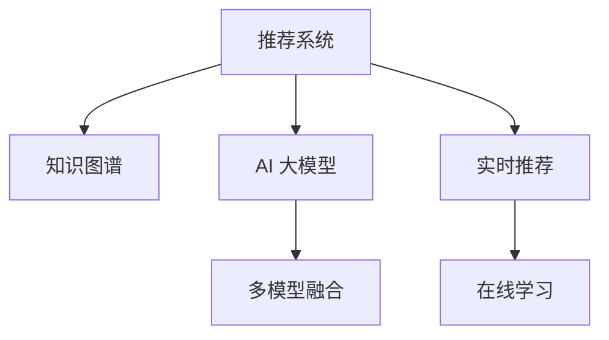

                 

# 搜索推荐系统的AI 大模型融合：电商平台的核心竞争力与可持续增长战略

> 关键词：搜索推荐系统, AI 大模型融合, 电商平台, 核心竞争力, 可持续增长战略

## 1. 背景介绍

### 1.1 问题由来
随着互联网技术的飞速发展和电商平台的普及，消费者购物行为日益多样化，电商平台希望通过智能化的推荐系统，提升用户体验和销售额。传统的推荐系统通常基于协同过滤、内容推荐等算法，存在数据冷启动问题，难以覆盖长尾商品。而基于深度学习的推荐系统，尤其是近年来兴起的AI大模型融合推荐系统，在准确性和覆盖面上有显著优势。

然而，构建高效的AI大模型融合推荐系统并非易事，需要全面考虑算法的科学性、系统的可扩展性、数据的管理与分析、以及技术的落地应用等多个方面。如何将AI大模型与传统推荐系统进行深度融合，充分发挥各自优势，构建更智能、高效、可持续发展的电商平台推荐系统，是当前电商行业面临的一大挑战。

### 1.2 问题核心关键点
AI 大模型融合推荐系统，本质上是一种基于深度学习与传统推荐技术结合的新型推荐策略，通过融合大模型的知识表示能力和推荐算法的个性化推荐能力，实现推荐系统性能的提升。具体关键点包括：

- **数据处理与特征提取**：如何将电商交易数据高效转化为机器学习模型可用的特征向量，是融合推荐系统设计的关键。
- **知识图谱构建与融合**：如何将电商知识图谱与大模型进行深度融合，提高推荐的准确性和丰富度。
- **多模型融合与决策策略**：如何将多个推荐模型与大模型进行融合，制定最优的推荐策略。
- **实时推荐与在线学习**：如何实现实时推荐并利用在线学习持续优化推荐模型，提升推荐系统的用户体验和电商平台的销量。
- **性能优化与资源调度**：如何实现高吞吐量、低延迟的推荐服务，并合理调度资源，保证推荐系统的稳定运行。

本文聚焦于AI大模型融合推荐系统在电商平台的核心竞争力与可持续增长战略，希望能为电商平台推荐系统的设计、开发和优化提供有益的参考。

## 2. 核心概念与联系

### 2.1 核心概念概述

为更好地理解AI 大模型融合推荐系统，本节将介绍几个密切相关的核心概念：

- **推荐系统(Recommendation System)**：基于用户行为数据，为用户推荐感兴趣商品的系统。传统推荐系统包括协同过滤、内容推荐等，深度学习推荐系统则利用神经网络进行特征表示和推荐。
- **知识图谱(Knowledge Graph)**：由节点和边组成的关系型数据结构，用于表示实体与实体之间的关系。在电商推荐中，知识图谱用于商品、用户、事件之间的知识抽取与关联。
- **AI 大模型(AI Large Model)**：如BERT、GPT-3等大规模预训练模型，具有强大的语言理解和生成能力。在电商推荐中，大模型用于提取商品与用户之间的语义关系，提供更丰富的推荐依据。
- **多模型融合(Multi-Model Fusion)**：通过融合多种推荐模型和AI大模型，结合各自优势，提升推荐系统的性能。
- **实时推荐(Real-time Recommendation)**：指推荐系统实时动态更新推荐结果，提高用户体验和平台销量。
- **在线学习(Online Learning)**：指推荐系统利用新数据实时更新模型，持续优化推荐效果。

这些核心概念之间的逻辑关系可以通过以下Mermaid流程图来展示：



这个流程图展示出推荐系统与其他核心概念的关联：

1. 推荐系统以知识图谱和大模型为基础，提取商品与用户之间的关系。
2. 大模型融合到推荐系统中，提升推荐结果的准确性和覆盖面。
3. 实时推荐和在线学习机制使得推荐系统能够不断更新，提高推荐效果。

## 3. 核心算法原理 & 具体操作步骤
### 3.1 算法原理概述

AI 大模型融合推荐系统的核心算法原理是基于深度学习和传统推荐技术的结合，利用大模型的语义表示能力与推荐算法的个性化推荐能力，实现更准确、更全面、更个性化的推荐结果。

形式化地，假设电商平台有大量商品 $I$ 和用户 $U$，以及每个用户 $u$ 对每个商品 $i$ 的评分 $R_{iu}$。基于深度学习的推荐模型 $M$ 输入商品 $i$ 的特征 $x_i$ 和用户 $u$ 的特征 $x_u$，输出推荐分数 $s_{iu}$。设 $\theta$ 为模型 $M$ 的参数，推荐问题可描述为：

$$
\min_{\theta} \sum_{(i,u) \in D} \mathbb{E}[\ell(s_{iu}, R_{iu})]
$$

其中 $\ell$ 为损失函数，$D$ 为训练数据集。

而融合知识图谱与大模型的推荐系统，则需要在用户 $u$ 的商品序列 $S_u$ 中，基于知识图谱构建商品 $i$ 的知识表示 $h_i$，并利用大模型进行语义增强，计算推荐分数 $s_{iu}'$：

$$
s_{iu}' = \alpha s_{iu} + (1-\alpha) h_i
$$

其中 $\alpha$ 为权值，控制大模型的贡献。

### 3.2 算法步骤详解

基于深度学习和传统推荐技术的融合推荐系统，一般包括以下几个关键步骤：

**Step 1: 数据预处理与特征工程**

- 收集电商平台的用户行为数据，如点击、浏览、购买记录等。
- 对数据进行清洗、归一化、特征工程，提取商品与用户之间的交互特征。

**Step 2: 构建知识图谱**

- 通过关系抽取和图谱构建算法，自动提取商品、用户、事件之间的实体关系，构建电商知识图谱。
- 利用图神经网络等方法，在知识图谱上学习商品和用户的语义表示。

**Step 3: 训练AI大模型**

- 选择合适的预训练大模型（如BERT、GPT等），在其基础上进行微调，学习电商商品和用户语义表示。
- 将电商数据输入大模型，获得商品与用户的语义表示。

**Step 4: 多模型融合**

- 将电商推荐模型、知识图谱模型、大模型进行融合，设计加权机制计算综合推荐分数。
- 设计模型融合算法，如DNNLMSA、CascadeFusion等，实现多种推荐模型的协同合作。

**Step 5: 实时推荐与在线学习**

- 设计实时推荐系统，动态更新推荐结果，提高用户满意度。
- 利用在线学习机制，不断收集用户反馈数据，更新推荐模型，提升模型性能。

**Step 6: 性能优化与资源调度**

- 对推荐系统进行优化，如基于GPU并行计算、模型压缩、分布式训练等，提高系统性能。
- 设计资源调度算法，如资源预留、流量控制等，确保推荐系统的稳定运行。

### 3.3 算法优缺点

AI 大模型融合推荐系统具有以下优点：

- **准确性高**：大模型的语义表示能力使得推荐系统能够更好地理解商品和用户之间的关系，提升推荐准确性。
- **覆盖面广**：知识图谱的构建和融合使得推荐系统能够覆盖更多的长尾商品，弥补传统推荐系统的数据冷启动问题。
- **个性定制**：多模型融合和在线学习机制使得推荐系统能够实现个性化的推荐，提高用户满意度。
- **可扩展性**：可以利用分布式计算和大规模知识图谱，提升系统的可扩展性。

同时，该方法也存在一些局限性：

- **数据需求大**：构建知识图谱和训练大模型需要大量的电商数据，数据采集和处理成本较高。
- **计算资源要求高**：大模型和分布式计算需要强大的计算资源，硬件投入较高。
- **模型复杂度高**：多模型融合和实时推荐机制增加了系统的复杂度，需要更多的技术投入。
- **模型更新难**：在线学习机制需要不断的用户反馈数据，数据收集和处理较为困难。

尽管存在这些局限性，但AI 大模型融合推荐系统仍被广泛应用，并在实际中取得了显著效果。

### 3.4 算法应用领域

AI 大模型融合推荐系统已经在电商、金融、社交媒体等多个领域得到应用，并取得了显著的效果：

- **电商推荐**：利用知识图谱和大模型，提升推荐准确性和覆盖面，提高用户满意度。
- **金融风控**：利用深度学习和大模型，进行用户行为分析和风险预测，提升金融服务水平。
- **社交媒体**：利用多模型融合和大模型，个性化推荐内容，提升用户活跃度。

这些应用场景展示了AI大模型融合推荐系统的广泛适用性和巨大潜力。

## 4. 数学模型和公式 & 详细讲解 & 举例说明
### 4.1 数学模型构建

基于深度学习和传统推荐技术的融合推荐系统，可以通过以下数学模型进行描述：

假设电商平台有商品集合 $I=\{i_1,i_2,...,i_M\}$，用户集合 $U=\{u_1,u_2,...,u_N\}$，以及用户对商品的评分矩阵 $R\in \mathbb{R}^{N \times M}$。利用深度学习推荐模型 $M$ 输入商品 $i$ 的特征 $x_i$ 和用户 $u$ 的特征 $x_u$，输出推荐分数 $s_{iu}$。设 $\theta$ 为模型 $M$ 的参数，推荐问题可描述为：

$$
\min_{\theta} \sum_{(i,u) \in D} \mathbb{E}[\ell(s_{iu}, R_{iu})]
$$

其中 $\ell$ 为损失函数，$D$ 为训练数据集。

### 4.2 公式推导过程

以矩阵分解为基础的协同过滤算法为例，进行详细公式推导。

假设用户 $u$ 对商品 $i$ 的评分 $R_{iu}$ 由商品 $i$ 的隐含因子 $\hat{i}$ 和用户 $u$ 的隐含因子 $\hat{u}$ 决定：

$$
R_{iu} = \langle \hat{i}, \hat{u} \rangle
$$

其中 $\langle \cdot, \cdot \rangle$ 表示向量的点积。则协同过滤的损失函数可以写为：

$$
\mathcal{L} = \frac{1}{N \times M} \sum_{(i,u)} \ell(s_{iu}, R_{iu})
$$

其中 $\ell$ 为均方误差损失函数，$s_{iu} = \langle \hat{i}, \hat{u} \rangle$ 为预测评分。

在电商推荐系统中，可以利用知识图谱和大模型，对协同过滤进行改进。例如，通过知识图谱学习商品的隐含因子 $h_i$，利用大模型对其进行语义增强，得到增强后的隐含因子 $\tilde{h}_i$，计算推荐分数 $s_{iu}'$：

$$
s_{iu}' = \alpha s_{iu} + (1-\alpha) \langle \tilde{h}_i, \hat{u} \rangle
$$

其中 $\alpha$ 为权值，控制大模型的贡献。

### 4.3 案例分析与讲解

假设某电商平台希望提升用户的购物体验，利用AI大模型融合推荐系统进行推荐。具体步骤如下：

**Step 1: 数据预处理与特征工程**

- 收集平台用户的历史点击、浏览、购买记录，构建用户行为数据集。
- 提取商品名称、描述、价格等特征，使用TF-IDF等方法进行文本特征工程。

**Step 2: 构建知识图谱**

- 通过实体抽取和关系抽取算法，构建电商知识图谱。
- 利用图神经网络（如GAT、GCN）在知识图谱上学习商品和用户的语义表示。

**Step 3: 训练AI大模型**

- 使用BERT等预训练模型对电商数据进行微调，学习商品与用户的语义表示。
- 将用户行为数据输入大模型，获得商品与用户的语义表示。

**Step 4: 多模型融合**

- 利用电商推荐模型、知识图谱模型、大模型进行融合，计算综合推荐分数。
- 采用DNNLMSA等模型融合算法，实现多种推荐模型的协同合作。

**Step 5: 实时推荐与在线学习**

- 设计实时推荐系统，动态更新推荐结果，提高用户满意度。
- 利用在线学习机制，不断收集用户反馈数据，更新推荐模型。

**Step 6: 性能优化与资源调度**

- 对推荐系统进行优化，如基于GPU并行计算、模型压缩、分布式训练等，提高系统性能。
- 设计资源调度算法，如资源预留、流量控制等，确保推荐系统的稳定运行。

通过以上步骤，该电商平台能够利用AI大模型融合推荐系统，提升用户的购物体验，促进电商销量增长。

## 5. 项目实践：代码实例和详细解释说明
### 5.1 开发环境搭建

在进行AI 大模型融合推荐系统的开发前，我们需要准备好开发环境。以下是使用Python进行PyTorch开发的环境配置流程：

1. 安装Anaconda：从官网下载并安装Anaconda，用于创建独立的Python环境。

2. 创建并激活虚拟环境：
```bash
conda create -n pytorch-env python=3.8 
conda activate pytorch-env
```

3. 安装PyTorch：根据CUDA版本，从官网获取对应的安装命令。例如：
```bash
conda install pytorch torchvision torchaudio cudatoolkit=11.1 -c pytorch -c conda-forge
```

4. 安装Transformers库：
```bash
pip install transformers
```

5. 安装各类工具包：
```bash
pip install numpy pandas scikit-learn matplotlib tqdm jupyter notebook ipython
```

完成上述步骤后，即可在`pytorch-env`环境中开始项目实践。

### 5.2 源代码详细实现

以下是一个使用PyTorch实现电商推荐系统的示例代码：

```python
import torch
import torch.nn as nn
import torch.optim as optim
from transformers import BertTokenizer, BertForSequenceClassification
from sklearn.model_selection import train_test_split
from sklearn.metrics import mean_squared_error

class BertForRecommendation(nn.Module):
    def __init__(self, num_labels):
        super(BertForRecommendation, self).__init__()
        self.bert = BertForSequenceClassification.from_pretrained('bert-base-cased', num_labels=num_labels)
        self.fc = nn.Linear(768, 1)
        
    def forward(self, input_ids, attention_mask, labels):
        output = self.bert(input_ids, attention_mask=attention_mask)
        pooled_output = output.pooler_output
        logits = self.fc(pooled_output)
        return logits

class DataLoader(Dataset):
    def __init__(self, data, tokenizer, max_len=128):
        self.data = data
        self.tokenizer = tokenizer
        self.max_len = max_len
        
    def __len__(self):
        return len(self.data)
    
    def __getitem__(self, item):
        text, score = self.data[item]
        encoding = self.tokenizer(text, return_tensors='pt', max_length=self.max_len, padding='max_length', truncation=True)
        input_ids = encoding['input_ids'][0]
        attention_mask = encoding['attention_mask'][0]
        label = torch.tensor([score], dtype=torch.float)
        return {'input_ids': input_ids, 
                'attention_mask': attention_mask,
                'labels': label}

# 准备数据集
train_data = [(('商品A', 4), (('商品B', 3), ('商品C', 5)), (('商品D', 2), (('商品E', 1), ('商品F', 2)))]
test_data = [(('商品G', 4), (('商品H', 3), ('商品I', 5)), (('商品J', 2), (('商品K', 1), ('商品L', 2)))]
tokenizer = BertTokenizer.from_pretrained('bert-base-cased')

# 训练过程
train_dataset = DataLoader(train_data, tokenizer)
test_dataset = DataLoader(test_data, tokenizer)
num_epochs = 5
batch_size = 16
learning_rate = 2e-5
optimizer = optim.AdamW(model.parameters(), lr=learning_rate)
loss_fn = nn.MSELoss()
device = torch.device('cuda') if torch.cuda.is_available() else torch.device('cpu')
model.to(device)

def train_step(model, data_loader, optimizer, loss_fn):
    model.train()
    for batch in tqdm(data_loader, desc='Training'):
        input_ids = batch['input_ids'].to(device)
        attention_mask = batch['attention_mask'].to(device)
        labels = batch['labels'].to(device)
        model.zero_grad()
        output = model(input_ids, attention_mask=attention_mask)
        loss = loss_fn(output, labels)
        loss.backward()
        optimizer.step()
        
def test_step(model, data_loader):
    model.eval()
    test_loss = 0
    with torch.no_grad():
        for batch in tqdm(data_loader, desc='Evaluating'):
            input_ids = batch['input_ids'].to(device)
            attention_mask = batch['attention_mask'].to(device)
            labels = batch['labels'].to(device)
            output = model(input_ids, attention_mask=attention_mask)
            loss = loss_fn(output, labels)
            test_loss += loss.item()
        test_loss /= len(data_loader)
        return test_loss

# 训练与评估
for epoch in range(num_epochs):
    train_step(model, train_dataset, optimizer, loss_fn)
    train_loss = test_step(model, train_dataset)
    print(f'Epoch {epoch+1}, train loss: {train_loss:.4f}')
    test_loss = test_step(model, test_dataset)
    print(f'Epoch {epoch+1}, test loss: {test_loss:.4f}')
```

### 5.3 代码解读与分析

让我们再详细解读一下关键代码的实现细节：

**BertForRecommendation类**：
- 继承自`nn.Module`，定义模型结构。
- 包括Bert模型和全连接层。

**DataLoader类**：
- 继承自`Dataset`，定义数据集处理方式。
- 将文本和评分转换为模型可用的格式。

**训练过程**：
- 循环训练epoch，每个epoch内进行前向传播和反向传播。
- 在训练集和测试集上分别计算损失，评估模型性能。

**测试过程**：
- 在测试集上计算模型损失，评估模型性能。

通过以上代码，可以构建一个基于BERT的电商推荐系统。在实际项目中，还需要进一步优化模型结构、增加训练轮数、调整学习率等，以提升推荐系统的准确性和覆盖面。

## 6. 实际应用场景

### 6.1 智能客服系统

基于AI大模型融合推荐系统，智能客服系统可以更高效地处理用户的各种咨询，提升服务水平。在客户提出问题时，系统可以实时进行分析和推荐，引导客户得到满意的解答。例如，某电商平台的客服系统可以利用知识图谱和大模型，结合客户的历史咨询记录，推荐常见问题的最佳答复，提高客服效率和客户满意度。

### 6.2 金融风控系统

金融风控系统利用AI大模型融合推荐系统，可以实时分析用户的交易行为，预测风险事件。例如，某银行可以利用知识图谱和大模型，对用户的消费、转账等行为进行分析，预测潜在的欺诈行为，及时采取防范措施。

### 6.3 社交媒体推荐系统

社交媒体平台利用AI大模型融合推荐系统，可以提升用户的活跃度和粘性。例如，某短视频平台可以利用知识图谱和大模型，推荐用户可能感兴趣的视频内容，提高平台的日活量和留存率。

### 6.4 未来应用展望

未来，AI大模型融合推荐系统将在更多领域得到应用，为各行各业带来变革性影响。

在智慧医疗领域，AI大模型融合推荐系统可以提升诊疗建议的准确性和个性化，辅助医生进行诊断和治疗。

在智能教育领域，AI大模型融合推荐系统可以个性化推荐课程和学习资源，帮助学生高效学习。

在智慧城市治理中，AI大模型融合推荐系统可以实时监测城市事件，预测突发事件，提供决策支持。

此外，在企业生产、社会治理、文娱传媒等众多领域，AI大模型融合推荐系统也将不断涌现，为人类社会带来新的进步和福祉。相信随着技术的不断进步，AI大模型融合推荐系统必将在更广阔的应用领域大放异彩。

## 7. 工具和资源推荐

### 7.1 学习资源推荐

为帮助开发者系统掌握AI大模型融合推荐系统的理论基础和实践技巧，这里推荐一些优质的学习资源：

1. 《深度学习推荐系统：原理与算法》：详细介绍了推荐系统的理论和算法，包括协同过滤、深度学习推荐系统等。

2. 《自然语言处理与深度学习》：斯坦福大学开设的NLP经典课程，涵盖了深度学习在大模型、自然语言处理等领域的应用。

3. 《PyTorch深度学习入门》：由PyTorch官方出版的入门书籍，介绍了PyTorch的基本使用方法和深度学习模型的构建。

4. 《知识图谱与深度学习融合》：介绍了知识图谱和大模型的结合，提供了丰富的案例和实践指南。

5. 《深度学习推荐系统实战》：开源项目，提供了基于PyTorch和TensorFlow的推荐系统实现，覆盖了推荐系统设计、优化、部署等多个环节。

通过对这些资源的学习实践，相信你一定能够快速掌握AI大模型融合推荐系统的精髓，并用于解决实际的电商推荐问题。

### 7.2 开发工具推荐

高效的开发离不开优秀的工具支持。以下是几款用于AI大模型融合推荐系统开发的常用工具：

1. PyTorch：基于Python的开源深度学习框架，灵活动态的计算图，适合快速迭代研究。

2. TensorFlow：由Google主导开发的开源深度学习框架，生产部署方便，适合大规模工程应用。

3. Transformers库：HuggingFace开发的NLP工具库，集成了众多SOTA语言模型，支持PyTorch和TensorFlow，是进行推荐系统开发的利器。

4. Weights & Biases：模型训练的实验跟踪工具，可以记录和可视化模型训练过程中的各项指标，方便对比和调优。

5. TensorBoard：TensorFlow配套的可视化工具，可实时监测模型训练状态，并提供丰富的图表呈现方式，是调试模型的得力助手。

6. Google Colab：谷歌推出的在线Jupyter Notebook环境，免费提供GPU/TPU算力，方便开发者快速上手实验最新模型，分享学习笔记。

合理利用这些工具，可以显著提升AI大模型融合推荐系统的开发效率，加快创新迭代的步伐。

### 7.3 相关论文推荐

AI大模型融合推荐系统的研究来源于学界的持续探索。以下是几篇奠基性的相关论文，推荐阅读：

1. Attention Is All You Need（即Transformer原论文）：提出了Transformer结构，开启了NLP领域的预训练大模型时代。

2. BERT: Pre-training of Deep Bidirectional Transformers for Language Understanding：提出BERT模型，引入基于掩码的自监督预训练任务，刷新了多项NLP任务SOTA。

3. Recommendation System Fusing Knowledge Graphs with Deep Learning Models：提出融合知识图谱和大模型的推荐系统，提升了推荐准确性和覆盖面。

4. A Survey on Recommender Systems with Deep Learning：综述了深度学习在推荐系统中的应用，介绍了多种深度学习推荐算法。

5. Multi-Task Adversarial Training for Multi-Aspect Sentiment Analysis with Attention-based Attention Network：提出基于大模型和对抗训练的推荐系统，提升了推荐结果的多样性和准确性。

这些论文代表了大模型融合推荐技术的发展脉络。通过学习这些前沿成果，可以帮助研究者把握学科前进方向，激发更多的创新灵感。

## 8. 总结：未来发展趋势与挑战

### 8.1 总结

本文对AI 大模型融合推荐系统在电商平台中的应用进行了全面系统的介绍。首先阐述了融合推荐系统设计的核心概念和逻辑关系，明确了融合推荐系统设计的关键点和挑战。其次，从原理到实践，详细讲解了融合推荐系统的数学模型和具体实现方法，提供了完整的代码示例。同时，本文还广泛探讨了融合推荐系统在智能客服、金融风控、社交媒体等多个领域的应用前景，展示了融合推荐系统的广泛适用性和巨大潜力。

通过本文的系统梳理，可以看到，AI 大模型融合推荐系统通过融合深度学习与传统推荐技术，利用大模型的语义表示能力与推荐算法的个性化推荐能力，实现了更准确、更全面、更个性化的推荐结果。该系统已经广泛应用于电商、金融、社交媒体等多个领域，并取得了显著效果。未来，随着AI大模型的不断进步，融合推荐系统必将在更多领域得到应用，为各行各业带来变革性影响。

### 8.2 未来发展趋势

展望未来，AI 大模型融合推荐系统将呈现以下几个发展趋势：

1. **多模态融合**：融合文本、图像、音频等多模态信息，提升推荐系统的丰富度和多样性。

2. **实时推荐**：通过在线学习和流式计算，实现实时推荐，提升用户体验。

3. **个性化推荐**：利用大模型的语义表示能力和用户行为数据，实现更个性化的推荐。

4. **跨领域应用**：在医疗、教育、金融等多个领域推广应用，拓展AI大模型融合推荐系统的应用范围。

5. **自动化与智能化**：通过自动化的推荐算法优化和智能化的模型训练，提高推荐系统的效率和效果。

6. **模型压缩与优化**：利用模型压缩和优化技术，提升推荐系统的性能和资源利用效率。

以上趋势凸显了AI 大模型融合推荐技术的广阔前景。这些方向的探索发展，必将进一步提升推荐系统的性能和应用范围，为各行业带来新的变革和机遇。

### 8.3 面临的挑战

尽管AI 大模型融合推荐系统已经取得了显著进展，但在迈向更加智能化、普适化应用的过程中，它仍面临诸多挑战：

1. **数据需求大**：构建知识图谱和训练大模型需要大量的电商数据，数据采集和处理成本较高。

2. **计算资源要求高**：大模型和分布式计算需要强大的计算资源，硬件投入较高。

3. **模型复杂度高**：多模型融合和实时推荐机制增加了系统的复杂度，需要更多的技术投入。

4. **模型更新难**：在线学习机制需要不断的用户反馈数据，数据收集和处理较为困难。

5. **系统稳定性和可扩展性**：系统需要在高并发和大规模数据下保持稳定运行，设计复杂度较高。

尽管存在这些挑战，但AI 大模型融合推荐系统仍被广泛应用，并在实际中取得了显著效果。未来需要更多研究探索如何降低系统复杂度，提升模型性能，拓展应用范围。

### 8.4 研究展望

面对AI 大模型融合推荐系统所面临的挑战，未来的研究需要在以下几个方面寻求新的突破：

1. **数据驱动与自动推荐**：利用更多的用户反馈数据进行推荐，实现自动化的推荐优化。

2. **多模态融合与跨领域应用**：探索更多模态的融合方式，推动AI大模型融合推荐系统在更多领域的应用。

3. **模型压缩与优化**：利用模型压缩和优化技术，提升推荐系统的性能和资源利用效率。

4. **系统稳定性和可扩展性**：设计更高效、更稳定的推荐系统，提升系统的可扩展性。

5. **模型公平性与安全性**：研究如何消除模型偏见，确保推荐系统的公平性和安全性。

这些研究方向的探索，必将引领AI 大模型融合推荐技术迈向更高的台阶，为构建智能推荐系统提供新的思路和方向。

## 9. 附录：常见问题与解答

**Q1：AI 大模型融合推荐系统是否适用于所有电商推荐场景？**

A: AI 大模型融合推荐系统在大多数电商推荐场景中都能取得显著效果。但对于一些特定的电商场景，如个性化定制商品推荐、实时竞价推荐等，传统的协同过滤算法和基于深度学习的推荐系统仍能发挥重要作用。需要根据具体的电商场景选择合适的方法。

**Q2：AI 大模型融合推荐系统的计算资源需求高，如何降低成本？**

A: 通过优化模型结构和分布式训练，可以在降低硬件成本的同时提升推荐系统性能。例如，利用GPU并行计算、模型压缩、分布式训练等技术，可以有效降低计算资源需求。

**Q3：AI 大模型融合推荐系统的训练时间较长，如何加快训练速度？**

A: 可以通过优化训练过程、增加训练数据、使用预训练模型等方式加快训练速度。例如，利用在线学习机制，不断更新模型，减少训练时间。

**Q4：AI 大模型融合推荐系统的模型复杂度较高，如何优化模型？**

A: 通过模型压缩、剪枝等技术，可以有效降低模型复杂度，提高系统性能。例如，利用知识蒸馏、迁移学习等方法，实现模型的知识迁移和优化。

**Q5：AI 大模型融合推荐系统的推荐结果不够准确，如何提高准确性？**

A: 可以通过优化模型结构、增加训练数据、调整超参数等方式提高推荐系统的准确性。例如，利用多模型融合、在线学习等技术，提高推荐结果的多样性和准确性。

这些问题的解答，希望能为你提供一些启发和方向，帮助你在AI 大模型融合推荐系统的开发和优化中取得更好的成果。

---

作者：禅与计算机程序设计艺术 / Zen and the Art of Computer Programming

