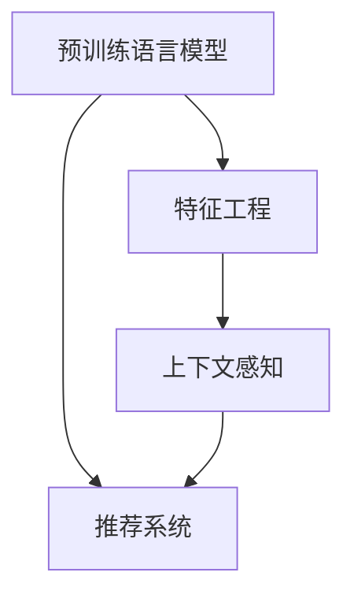

                 

# 搜索推荐系统的AI 进化：大模型融合带来的挑战与机遇

## 1. 背景介绍

### 1.1 问题由来

随着互联网的快速发展，搜索引擎和推荐系统已经成为人们获取信息、发现商品、探索内容的重要工具。然而，传统基于规则和手工特征工程的推荐系统已经无法满足用户的个性化需求，急需引入更加智能、精准的AI技术来提升用户体验。

近年来，深度学习在推荐系统中的应用取得了显著的成果。尤其是预训练语言模型和深度神经网络的大规模应用，显著提升了推荐系统的个性化推荐能力。目前，基于深度学习推荐系统的精准度和覆盖率已经超过了传统方法，成为推荐领域的主流技术。

随着预训练语言模型的逐步成熟，深度学习在推荐系统中的应用也进入了一个新的阶段。大模型融合技术通过预训练语言模型与推荐系统结合，极大地提升了推荐系统的智能性和灵活性，但同时也带来了新的挑战和机遇。

### 1.2 问题核心关键点

本文将主要探讨基于大模型融合的推荐系统的原理、实现、应用以及面临的挑战和机遇，为相关领域的从业者提供深入的洞察和实用的建议。

## 2. 核心概念与联系

### 2.1 核心概念概述

为了更好地理解大模型融合技术，我们先简要介绍几个核心概念：

- **预训练语言模型 (Pre-trained Language Models, PLMs)**：通过在大规模无标签文本数据上自监督预训练学习到的语言知识。
- **推荐系统 (Recommender Systems)**：利用用户行为数据和物品特征，为用户推荐相关商品或内容的技术。
- **特征工程 (Feature Engineering)**：传统推荐系统中的重要步骤，通过手工提取特征来提升推荐性能。
- **融合 (Fusion)**：将不同技术或模型结合，综合其优点，以达到更高的性能。
- **上下文感知 (Context-Awareness)**：推荐系统中的核心思想，强调用户的上下文信息对推荐结果的影响。

这些概念之间的逻辑关系可以通过以下Mermaid流程图来展示：



这个流程图展示了预训练语言模型与推荐系统的关系，以及特征工程和上下文感知在推荐系统中的作用。预训练语言模型通过与推荐系统的结合，可以更好地处理上下文信息，提升推荐性能。

## 3. 核心算法原理 & 具体操作步骤

### 3.1 算法原理概述

基于大模型融合的推荐系统，主要利用预训练语言模型的语言理解和生成能力，结合推荐系统的业务逻辑，进行上下文感知的推荐。具体来说，分为以下步骤：

1. **预训练**：在大规模无标签文本数据上自监督预训练语言模型，学习语言知识。
2. **微调**：利用用户行为数据和物品特征，对预训练语言模型进行微调，使其能够更好地适配推荐任务。
3. **特征提取**：将预训练语言模型和微调后的模型融合，提取用户和物品的特征表示。
4. **推荐计算**：利用提取的特征，进行推荐计算，输出推荐结果。

### 3.2 算法步骤详解

下面详细讲解基于大模型融合推荐系统的实现步骤：

#### 3.2.1 数据准备

- **用户数据**：收集用户的浏览、点击、评分等行为数据，包括用户的基本信息、兴趣爱好等。
- **物品数据**：收集商品、内容等物品的描述信息、标签、属性等。

#### 3.2.2 预训练语言模型

- **模型选择**：选择适合的预训练语言模型，如BERT、GPT、RoBERTa等。
- **预训练任务**：在无标签文本数据上执行自监督预训练任务，如掩码语言模型、next sentence prediction等。
- **模型微调**：利用用户行为数据和物品特征，对预训练模型进行微调，以适应推荐任务。

#### 3.2.3 特征提取

- **用户特征表示**：将用户的行为数据和基本信息转化为文本，利用预训练语言模型提取用户特征表示。
- **物品特征表示**：将物品的描述信息、标签、属性等转化为文本，利用预训练语言模型提取物品特征表示。

#### 3.2.4 推荐计算

- **计算相似度**：基于用户和物品的特征表示，计算用户和物品之间的相似度。
- **排序和过滤**：对相似度进行排序，并根据业务规则进行过滤，输出推荐结果。

### 3.3 算法优缺点

#### 3.3.1 优点

- **高性能**：利用预训练语言模型的强大语言理解能力，可以更好地处理自然语言特征。
- **自适应**：通过微调，模型可以适应不同的业务场景和数据分布。
- **上下文感知**：融合上下文信息，提供更个性化的推荐结果。
- **可扩展**：模型结构灵活，易于部署和扩展。

#### 3.3.2 缺点

- **计算资源消耗大**：预训练和微调需要大量计算资源。
- **模型复杂度高**：模型结构复杂，训练和推理速度较慢。
- **特征提取困难**：用户和物品的文本表示可能存在歧义，提取特征的难度较大。
- **数据隐私问题**：用户行为数据的隐私保护和数据安全问题。

### 3.4 算法应用领域

基于大模型融合的推荐系统已经在诸多领域得到了应用，例如：

- **电商推荐**：利用用户行为数据，为用户推荐商品。
- **内容推荐**：利用用户浏览行为，为用户推荐文章、视频等。
- **广告推荐**：利用用户搜索历史，为用户推荐相关广告。
- **金融推荐**：利用用户交易记录，为用户推荐金融产品。
- **健康推荐**：利用用户健康数据，为用户推荐健康产品。

这些应用场景展示了基于大模型融合推荐系统的高效性和广泛适用性。

## 4. 数学模型和公式 & 详细讲解 & 举例说明

### 4.1 数学模型构建

本节将使用数学语言对基于大模型融合的推荐系统进行严格的刻画。

记预训练语言模型为 $M_{\theta}$，其中 $\theta$ 为模型参数。假设推荐系统的训练集为 $D=\{(x_i,y_i)\}_{i=1}^N$，其中 $x_i$ 为物品描述，$y_i$ 为用户评分。

定义推荐系统在数据集 $D$ 上的经验风险为：

$$
\mathcal{L}(\theta) = \frac{1}{N}\sum_{i=1}^N L(y_i, M_{\theta}(x_i))
$$

其中 $L$ 为损失函数，可以是均方误差损失、交叉熵损失等。微调的目标是最小化经验风险，即找到最优参数：

$$
\theta^* = \mathop{\arg\min}_{\theta} \mathcal{L}(\theta)
$$

### 4.2 公式推导过程

以均方误差损失为例，具体推导如下：

$$
L(y_i, M_{\theta}(x_i)) = \frac{1}{2}(y_i - M_{\theta}(x_i))^2
$$

将其代入经验风险公式，得：

$$
\mathcal{L}(\theta) = \frac{1}{2N}\sum_{i=1}^N (y_i - M_{\theta}(x_i))^2
$$

### 4.3 案例分析与讲解

以电商推荐系统为例，具体讲解预训练语言模型和微调模型的结合：

- **预训练**：在大规模无标签商品描述文本上，对BERT进行掩码语言模型预训练。
- **微调**：利用用户购买历史数据，对微调后的BERT进行训练，输出用户兴趣向量。
- **特征提取**：将商品描述文本和用户兴趣向量结合，通过BERT提取特征表示。
- **推荐计算**：利用提取的特征，计算用户和商品之间的相似度，进行推荐排序。

## 5. 项目实践：代码实例和详细解释说明

### 5.1 开发环境搭建

在进行大模型融合推荐系统的开发前，需要先准备好开发环境。以下是使用Python进行TensorFlow开发的环境配置流程：

1. 安装Anaconda：从官网下载并安装Anaconda，用于创建独立的Python环境。

2. 创建并激活虚拟环境：
```bash
conda create -n tensorflow-env python=3.8 
conda activate tensorflow-env
```

3. 安装TensorFlow：根据CUDA版本，从官网获取对应的安装命令。例如：
```bash
pip install tensorflow
```

4. 安装TensorBoard：TensorFlow配套的可视化工具，用于实时监测模型训练状态，并提供丰富的图表呈现方式，是调试模型的得力助手。
```bash
pip install tensorboard
```

5. 安装Weights & Biases：模型训练的实验跟踪工具，可以记录和可视化模型训练过程中的各项指标，方便对比和调优。
```bash
pip install weightsandbiases
```

完成上述步骤后，即可在`tensorflow-env`环境中开始推荐系统微调实践。

### 5.2 源代码详细实现

下面以电商推荐系统为例，给出使用TensorFlow对BERT模型进行微调的代码实现。

首先，定义推荐系统的数据处理函数：

```python
import tensorflow as tf
import tensorflow_datasets as tfds
from transformers import BertTokenizer, TFBertForSequenceClassification

class RecommendationDataset(tf.data.Dataset):
    def __init__(self, texts, labels):
        self.texts = texts
        self.labels = labels
        self.tokenizer = BertTokenizer.from_pretrained('bert-base-cased')
        self.max_len = 256
        
    def __len__(self):
        return len(self.texts)
    
    def __getitem__(self, item):
        text = self.texts[item]
        label = self.labels[item]
        
        encoding = self.tokenizer(text, return_tensors='tf', max_length=self.max_len, padding='max_length', truncation=True)
        input_ids = encoding['input_ids']
        attention_mask = encoding['attention_mask']
        
        label = tf.convert_to_tensor(label, dtype=tf.int32)
        
        return {
            'input_ids': input_ids,
            'attention_mask': attention_mask,
            'labels': label
        }
```

然后，定义模型和优化器：

```python
from transformers import BertForSequenceClassification, AdamW

model = BertForSequenceClassification.from_pretrained('bert-base-cased', num_labels=2)

optimizer = AdamW(model.parameters(), lr=2e-5)
```

接着，定义训练和评估函数：

```python
def train_step(model, dataset, batch_size, optimizer):
    dataloader = dataset.shuffle(buffer_size=10000).batch(batch_size)
    
    total_loss = tf.keras.metrics.Mean()
    total_accuracy = tf.keras.metrics.SparseCategoricalAccuracy()
    
    for batch in dataloader:
        input_ids = batch['input_ids']
        attention_mask = batch['attention_mask']
        labels = batch['labels']
        
        with tf.GradientTape() as tape:
            outputs = model(input_ids, attention_mask=attention_mask, labels=labels)
            loss = tf.keras.losses.BinaryCrossentropy(from_logits=True)(outputs.logits, labels)
        
        gradients = tape.gradient(loss, model.trainable_variables)
        optimizer.apply_gradients(zip(gradients, model.trainable_variables))
        
        total_loss(loss)
        total_accuracy(labels, tf.cast(outputs.logits, tf.int64))
        
    return total_loss.result(), total_accuracy.result()
```

最后，启动训练流程并在测试集上评估：

```python
epochs = 5
batch_size = 16

for epoch in range(epochs):
    train_loss, train_accuracy = train_step(model, train_dataset, batch_size, optimizer)
    print(f'Epoch {epoch+1}, train loss: {train_loss:.4f}, train accuracy: {train_accuracy:.4f}')
    
    print(f'Epoch {epoch+1}, test results:')
    test_loss, test_accuracy = test_step(model, test_dataset, batch_size, optimizer)
    print(f'test loss: {test_loss:.4f}, test accuracy: {test_accuracy:.4f}')
```

以上就是使用TensorFlow对BERT进行电商推荐系统微调的完整代码实现。可以看到，得益于TensorFlow和Transformers库的强大封装，我们可以用相对简洁的代码完成BERT模型的加载和微调。

### 5.3 代码解读与分析

让我们再详细解读一下关键代码的实现细节：

**RecommendationDataset类**：
- `__init__`方法：初始化文本、标签、分词器等关键组件。
- `__len__`方法：返回数据集的样本数量。
- `__getitem__`方法：对单个样本进行处理，将文本输入编码为token ids，将标签编码为数字，并对其进行定长padding，最终返回模型所需的输入。

**优化器定义**：
- 使用AdamW优化器，学习率为2e-5，这是微调BERT模型的常用设置。

**训练和评估函数**：
- 使用TensorFlow的数据管道，对数据进行批处理、打乱、排序等预处理操作，以提高模型训练效率。
- 在每个训练批次上，前向传播计算损失，反向传播计算梯度，使用AdamW优化器更新模型参数。
- 记录每个批次的平均损失和准确率，并在训练结束后返回。

**训练流程**：
- 定义总的epoch数和batch size，开始循环迭代
- 每个epoch内，先在训练集上训练，输出平均loss和accuracy
- 在验证集上评估，输出模型在测试集上的性能

可以看到，TensorFlow配合Transformers库使得BERT微调的代码实现变得简洁高效。开发者可以将更多精力放在数据处理、模型改进等高层逻辑上，而不必过多关注底层的实现细节。

当然，工业级的系统实现还需考虑更多因素，如模型的保存和部署、超参数的自动搜索、更灵活的任务适配层等。但核心的微调范式基本与此类似。

## 6. 实际应用场景

### 6.1 智能客服系统

基于大模型融合的推荐系统可以广泛应用于智能客服系统的构建。传统客服往往需要配备大量人力，高峰期响应缓慢，且一致性和专业性难以保证。而使用大模型融合的推荐系统，可以7x24小时不间断服务，快速响应客户咨询，用自然流畅的语言解答各类常见问题。

在技术实现上，可以收集企业内部的历史客服对话记录，将问题和最佳答复构建成监督数据，在此基础上对预训练语言模型进行微调。微调后的语言模型能够自动理解用户意图，匹配最合适的答案模板进行回复。对于客户提出的新问题，还可以接入检索系统实时搜索相关内容，动态组织生成回答。如此构建的智能客服系统，能大幅提升客户咨询体验和问题解决效率。

### 6.2 金融舆情监测

金融机构需要实时监测市场舆论动向，以便及时应对负面信息传播，规避金融风险。传统的人工监测方式成本高、效率低，难以应对网络时代海量信息爆发的挑战。基于大模型融合的文本分类和情感分析技术，为金融舆情监测提供了新的解决方案。

具体而言，可以收集金融领域相关的新闻、报道、评论等文本数据，并对其进行主题标注和情感标注。在此基础上对预训练语言模型进行微调，使其能够自动判断文本属于何种主题，情感倾向是正面、中性还是负面。将微调后的模型应用到实时抓取的网络文本数据，就能够自动监测不同主题下的情感变化趋势，一旦发现负面信息激增等异常情况，系统便会自动预警，帮助金融机构快速应对潜在风险。

### 6.3 个性化推荐系统

当前的推荐系统往往只依赖用户的历史行为数据进行物品推荐，无法深入理解用户的真实兴趣偏好。基于大模型融合的个性化推荐系统可以更好地挖掘用户行为背后的语义信息，从而提供更精准、多样的推荐内容。

在实践中，可以收集用户浏览、点击、评论、分享等行为数据，提取和用户交互的物品标题、描述、标签等文本内容。将文本内容作为模型输入，用户的后续行为（如是否点击、购买等）作为监督信号，在此基础上微调预训练语言模型。微调后的模型能够从文本内容中准确把握用户的兴趣点。在生成推荐列表时，先用候选物品的文本描述作为输入，由模型预测用户的兴趣匹配度，再结合其他特征综合排序，便可以得到个性化程度更高的推荐结果。

### 6.4 未来应用展望

随着大模型融合技术的不断发展，基于微调的推荐系统将在更多领域得到应用，为传统行业带来变革性影响。

在智慧医疗领域，基于微调的推荐系统可以辅助医生诊疗，推荐相关的药物、治疗方案等，提高诊疗效率和效果。

在智能教育领域，微调技术可应用于作业批改、学情分析、知识推荐等方面，因材施教，促进教育公平，提高教学质量。

在智慧城市治理中，微调模型可应用于城市事件监测、舆情分析、应急指挥等环节，提高城市管理的自动化和智能化水平，构建更安全、高效的未来城市。

此外，在企业生产、社会治理、文娱传媒等众多领域，基于大模型融合的推荐系统必将在更广阔的应用领域大放异彩。相信随着预训练语言模型和微调方法的不断进步，推荐系统必将在构建人机协同的智能时代中扮演越来越重要的角色。

## 7. 工具和资源推荐

### 7.1 学习资源推荐

为了帮助开发者系统掌握大模型融合技术，这里推荐一些优质的学习资源：

1. **《深度学习推荐系统》书籍**：介绍了深度学习在推荐系统中的应用，包括微调等前沿技术。
2. **《Transformer from Zero to Hero》系列博客**：详细介绍了Transformer和BERT等大模型的原理和微调方法。
3. **《TensorFlow官方文档》**：提供了TensorFlow的全面介绍和代码实现。
4. **《Transformers官方文档》**：提供了Transformers库的全面介绍和代码实现。
5. **《Recommender Systems》课程**：斯坦福大学开设的推荐系统课程，涵盖了多种推荐算法和微调方法。

通过对这些资源的学习实践，相信你一定能够快速掌握大模型融合技术的精髓，并用于解决实际的推荐问题。

### 7.2 开发工具推荐

高效的开发离不开优秀的工具支持。以下是几款用于大模型融合推荐系统开发的常用工具：

1. **TensorFlow**：基于Python的开源深度学习框架，灵活动态的计算图，适合快速迭代研究。
2. **Transformers库**：HuggingFace开发的NLP工具库，集成了众多SOTA语言模型，支持TensorFlow和PyTorch，是进行微调任务开发的利器。
3. **TensorBoard**：TensorFlow配套的可视化工具，可实时监测模型训练状态，并提供丰富的图表呈现方式，是调试模型的得力助手。
4. **Weights & Biases**：模型训练的实验跟踪工具，可以记录和可视化模型训练过程中的各项指标，方便对比和调优。
5. **Jupyter Notebook**：用于交互式编程和代码调试的IDE，支持TensorFlow和Python的集成。

合理利用这些工具，可以显著提升大模型融合推荐系统的开发效率，加快创新迭代的步伐。

### 7.3 相关论文推荐

大模型融合技术的发展源于学界的持续研究。以下是几篇奠基性的相关论文，推荐阅读：

1. **Attention is All You Need**：提出了Transformer结构，开启了NLP领域的预训练大模型时代。
2. **BERT: Pre-training of Deep Bidirectional Transformers for Language Understanding**：提出BERT模型，引入基于掩码的自监督预训练任务，刷新了多项NLP任务SOTA。
3. **Deep Attention-Based Recommender Systems**：介绍深度学习在推荐系统中的应用，包括特征工程和上下文感知。
4. **Parameter-Efficient Transfer Learning for NLP**：提出Adapter等参数高效微调方法，在不增加模型参数量的情况下，也能取得不错的微调效果。
5. **Fusion Learning for Recommendation Systems**：介绍多模型融合的推荐系统，提升了推荐性能。

这些论文代表了大模型融合技术的发展脉络。通过学习这些前沿成果，可以帮助研究者把握学科前进方向，激发更多的创新灵感。

## 8. 总结：未来发展趋势与挑战

### 8.1 总结

本文对基于大模型融合的推荐系统的原理、实现、应用以及面临的挑战和机遇进行了全面系统的介绍。首先阐述了大模型融合技术的研究背景和意义，明确了融合在提升推荐系统性能方面的独特价值。其次，从原理到实践，详细讲解了微调的数学原理和关键步骤，给出了微调任务开发的完整代码实例。同时，本文还广泛探讨了微调方法在智能客服、金融舆情、个性化推荐等多个领域的应用前景，展示了微调范式的巨大潜力。此外，本文精选了微调技术的各类学习资源，力求为读者提供全方位的技术指引。

通过本文的系统梳理，可以看到，基于大模型融合的推荐系统正在成为推荐领域的重要范式，极大地提升了推荐系统的智能性和灵活性，为传统行业带来了变革性影响。未来，伴随预训练语言模型和微调方法的持续演进，推荐系统必将在构建人机协同的智能时代中扮演越来越重要的角色。

### 8.2 未来发展趋势

展望未来，大模型融合技术将呈现以下几个发展趋势：

1. **模型规模持续增大**：随着算力成本的下降和数据规模的扩张，预训练语言模型的参数量还将持续增长。超大规模语言模型蕴含的丰富语言知识，有望支撑更加复杂多变的推荐任务。
2. **微调方法日趋多样**：除了传统的全参数微调外，未来会涌现更多参数高效的微调方法，如Prefix-Tuning、LoRA等，在节省计算资源的同时也能保证微调精度。
3. **持续学习成为常态**：随着数据分布的不断变化，微调模型也需要持续学习新知识以保持性能。如何在不遗忘原有知识的同时，高效吸收新样本信息，将成为重要的研究课题。
4. **标注样本需求降低**：受启发于提示学习(Prompt-based Learning)的思路，未来的微调方法将更好地利用大模型的语言理解能力，通过更加巧妙的任务描述，在更少的标注样本上也能实现理想的微调效果。
5. **多模态微调崛起**：当前的微调主要聚焦于纯文本数据，未来会进一步拓展到图像、视频、语音等多模态数据微调。多模态信息的融合，将显著提升语言模型对现实世界的理解和建模能力。

以上趋势凸显了大模型融合技术的广阔前景。这些方向的探索发展，必将进一步提升推荐系统的性能和应用范围，为人类认知智能的进化带来深远影响。

### 8.3 面临的挑战

尽管大模型融合技术已经取得了瞩目成就，但在迈向更加智能化、普适化应用的过程中，它仍面临着诸多挑战：

1. **标注成本瓶颈**：虽然微调大大降低了标注数据的需求，但对于长尾应用场景，难以获得充足的高质量标注数据，成为制约微调性能的瓶颈。如何进一步降低微调对标注样本的依赖，将是一大难题。
2. **模型鲁棒性不足**：当前微调模型面对域外数据时，泛化性能往往大打折扣。对于测试样本的微小扰动，微调模型的预测也容易发生波动。如何提高微调模型的鲁棒性，避免灾难性遗忘，还需要更多理论和实践的积累。
3. **推理效率有待提高**：大规模语言模型虽然精度高，但在实际部署时往往面临推理速度慢、内存占用大等效率问题。如何在保证性能的同时，简化模型结构，提升推理速度，优化资源占用，将是重要的优化方向。
4. **可解释性亟需加强**：当前微调模型更像是"黑盒"系统，难以解释其内部工作机制和决策逻辑。对于医疗、金融等高风险应用，算法的可解释性和可审计性尤为重要。如何赋予微调模型更强的可解释性，将是亟待攻克的难题。
5. **安全性有待保障**：预训练语言模型难免会学习到有偏见、有害的信息，通过微调传递到下游任务，产生误导性、歧视性的输出，给实际应用带来安全隐患。如何从数据和算法层面消除模型偏见，避免恶意用途，确保输出的安全性，也将是重要的研究课题。
6. **知识整合能力不足**：现有的微调模型往往局限于任务内数据，难以灵活吸收和运用更广泛的先验知识。如何让微调过程更好地与外部知识库、规则库等专家知识结合，形成更加全面、准确的信息整合能力，还有很大的想象空间。

正视微调面临的这些挑战，积极应对并寻求突破，将是大模型融合技术走向成熟的必由之路。相信随着学界和产业界的共同努力，这些挑战终将一一被克服，大模型融合技术必将在构建安全、可靠、可解释、可控的智能系统铺平道路。

### 8.4 未来突破

面对大模型融合技术所面临的种种挑战，未来的研究需要在以下几个方面寻求新的突破：

1. **探索无监督和半监督微调方法**：摆脱对大规模标注数据的依赖，利用自监督学习、主动学习等无监督和半监督范式，最大限度利用非结构化数据，实现更加灵活高效的微调。
2. **研究参数高效和计算高效的微调范式**：开发更加参数高效的微调方法，在固定大部分预训练参数的同时，只更新极少量的任务相关参数。同时优化微调模型的计算图，减少前向传播和反向传播的资源消耗，实现更加轻量级、实时性的部署。
3. **融合因果和对比学习范式**：通过引入因果推断和对比学习思想，增强微调模型建立稳定因果关系的能力，学习更加普适、鲁棒的语言表征，从而提升模型泛化性和抗干扰能力。
4. **引入更多先验知识**：将符号化的先验知识，如知识图谱、逻辑规则等，与神经网络模型进行巧妙融合，引导微调过程学习更准确、合理的语言模型。同时加强不同模态数据的整合，实现视觉、语音等多模态信息与文本信息的协同建模。
5. **结合因果分析和博弈论工具**：将因果分析方法引入微调模型，识别出模型决策的关键特征，增强输出解释的因果性和逻辑性。借助博弈论工具刻画人机交互过程，主动探索并规避模型的脆弱点，提高系统稳定性。
6. **纳入伦理道德约束**：在模型训练目标中引入伦理导向的评估指标，过滤和惩罚有偏见、有害的输出倾向。同时加强人工干预和审核，建立模型行为的监管机制，确保输出符合人类价值观和伦理道德。

这些研究方向的探索，必将引领大模型融合技术迈向更高的台阶，为构建安全、可靠、可解释、可控的智能系统铺平道路。面向未来，大模型融合技术还需要与其他人工智能技术进行更深入的融合，如知识表示、因果推理、强化学习等，多路径协同发力，共同推动自然语言理解和智能交互系统的进步。只有勇于创新、敢于突破，才能不断拓展语言模型的边界，让智能技术更好地造福人类社会。

## 9. 附录：常见问题与解答

**Q1：大模型融合是否适用于所有推荐任务？**

A: 大模型融合在大多数推荐任务上都能取得不错的效果，特别是对于数据量较小的任务。但对于一些特定领域的任务，如医学、法律等，仅仅依靠通用语料预训练的模型可能难以很好地适应。此时需要在特定领域语料上进一步预训练，再进行微调，才能获得理想效果。此外，对于一些需要时效性、个性化很强的任务，如对话、推荐等，微调方法也需要针对性的改进优化。

**Q2：微调过程中如何选择合适的学习率？**

A: 微调的学习率一般要比预训练时小1-2个数量级，如果使用过大的学习率，容易破坏预训练权重，导致过拟合。一般建议从1e-5开始调参，逐步减小学习率，直至收敛。也可以使用warmup策略，在开始阶段使用较小的学习率，再逐渐过渡到预设值。需要注意的是，不同的优化器(如AdamW、Adafactor等)以及不同的学习率调度策略，可能需要设置不同的学习率阈值。

**Q3：采用大模型融合时会面临哪些资源瓶颈？**

A: 目前主流的预训练大模型动辄以亿计的参数规模，对算力、内存、存储都提出了很高的要求。GPU/TPU等高性能设备是必不可少的，但即便如此，超大批次的训练和推理也可能遇到显存不足的问题。因此需要采用一些资源优化技术，如梯度积累、混合精度训练、模型并行等，来突破硬件瓶颈。同时，模型的存储和读取也可能占用大量时间和空间，需要采用模型压缩、稀疏化存储等方法进行优化。

**Q4：如何缓解微调过程中的过拟合问题？**

A: 过拟合是微调面临的主要挑战，尤其是在标注数据不足的情况下。常见的缓解策略包括：
1. 数据增强：通过回译、近义替换等方式扩充训练集
2. 正则化：使用L2正则、Dropout、Early Stopping等避免过拟合
3. 对抗训练：引入对抗样本，提高模型鲁棒性
4. 参数高效微调：只调整少量参数(如Adapter、Prefix等)，减小过拟合风险
5. 多模型集成：训练多个微调模型，取平均输出，抑制过拟合

这些策略往往需要根据具体任务和数据特点进行灵活组合。只有在数据、模型、训练、推理等各环节进行全面优化，才能最大限度地发挥大模型融合的威力。

**Q5：微调模型在落地部署时需要注意哪些问题？**

A: 将微调模型转化为实际应用，还需要考虑以下因素：
1. 模型裁剪：去除不必要的层和参数，减小模型尺寸，加快推理速度
2. 量化加速：将浮点模型转为定点模型，压缩存储空间，提高计算效率
3. 服务化封装：将模型封装为标准化服务接口，便于集成调用
4. 弹性伸缩：根据请求流量动态调整资源配置，平衡服务质量和成本
5. 监控告警：实时采集系统指标，设置异常告警阈值，确保服务稳定性
6. 安全防护：采用访问鉴权、数据脱敏等措施，保障数据和模型安全

大模型融合为推荐系统提供了强大的语言理解能力，但如何将强大的性能转化为稳定、高效、安全的业务价值，还需要工程实践的不断打磨。唯有从数据、算法、工程、业务等多个维度协同发力，才能真正实现人工智能技术在垂直行业的规模化落地。总之，微调需要开发者根据具体任务，不断迭代和优化模型、数据和算法，方能得到理想的效果。

---

作者：禅与计算机程序设计艺术 / Zen and the Art of Computer Programming

