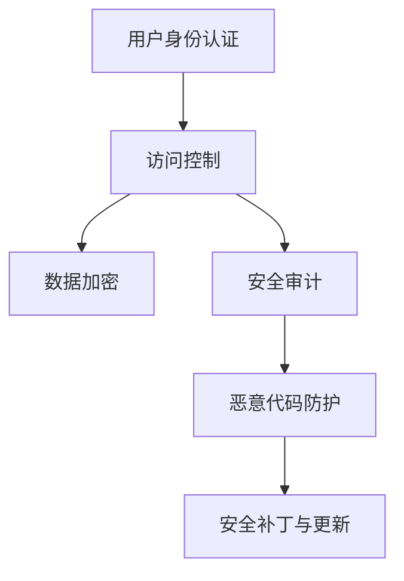

                 

# 操作系统的安全防护机制剖析

> 关键词：操作系统,安全防护,核心概念,安全模型,安全措施,未来展望

## 1. 背景介绍

操作系统（Operating System, OS）是计算机系统的核心软件，负责管理计算机的硬件资源和软件资源，提供用户与计算机硬件之间的接口。操作系统的安全防护机制是其重要组成部分，负责保护系统的安全，防止未授权访问和恶意攻击。随着计算机技术的不断发展，操作系统安全防护机制也在不断改进和完善。

### 1.1 问题由来

计算机系统面临的安全威胁日益增加，包括病毒、木马、勒索软件、拒绝服务攻击等。这些威胁不仅会导致数据泄露、系统瘫痪，还可能对用户和组织的声誉造成严重影响。因此，操作系统安全防护机制显得尤为重要。

### 1.2 问题核心关键点

操作系统安全防护机制的核心在于通过一系列技术手段，保障系统的安全性和稳定性。这些手段包括但不限于：

- 身份认证与访问控制：确保只有授权用户能够访问系统资源。
- 数据加密与保护：保护系统中的数据，防止被未授权访问和恶意攻击。
- 安全审计与监控：记录系统的访问日志，检测异常行为和威胁。
- 恶意代码防护：防范病毒、木马等恶意代码的攻击。
- 安全补丁与更新：及时修复系统漏洞，防止被利用。

## 2. 核心概念与联系

### 2.1 核心概念概述

操作系统安全防护机制涉及多个核心概念，这些概念之间相互关联，共同构成了一个完整的安全防护体系。以下是主要的核心概念：

- 用户身份认证（User Authentication）：验证用户身份，防止未经授权的访问。
- 访问控制（Access Control）：限制用户对系统资源的访问权限，防止越权操作。
- 数据加密（Data Encryption）：对数据进行加密保护，防止数据泄露。
- 安全审计（Security Audit）：记录系统操作日志，检测异常行为和威胁。
- 恶意代码防护（Malware Protection）：检测和防止恶意代码的攻击。
- 安全补丁与更新（Security Patch and Update）：及时修复系统漏洞，防止被利用。

这些概念之间的逻辑关系可以通过以下Mermaid流程图来展示：



这个流程图展示了一些核心概念及其之间的关系：

1. 用户身份认证是访问控制的前提，只有经过身份认证的用户才能进行下一步操作。
2. 访问控制限制用户对系统资源的访问权限，确保用户只能访问授权资源。
3. 数据加密对系统中的敏感数据进行保护，防止数据泄露。
4. 安全审计记录系统操作日志，检测异常行为和威胁。
5. 恶意代码防护检测和防止恶意代码的攻击。
6. 安全补丁与更新及时修复系统漏洞，防止被利用。

## 3. 核心算法原理 & 具体操作步骤

### 3.1 算法原理概述

操作系统安全防护机制的核心算法包括身份认证、访问控制、数据加密、安全审计、恶意代码防护和安全补丁与更新等。这些算法通过技术手段，确保系统的安全性和稳定性。

### 3.2 算法步骤详解

操作系统安全防护机制的实施过程通常包括以下步骤：

1. 用户身份认证：系统通过密码、生物特征、智能卡等方式验证用户身份，确保只有授权用户才能访问系统。
2. 访问控制：系统根据用户的身份和权限，限制其对系统资源的访问，防止越权操作。
3. 数据加密：系统对敏感数据进行加密保护，防止数据泄露。
4. 安全审计：系统记录用户的访问日志，检测异常行为和威胁。
5. 恶意代码防护：系统检测和防止恶意代码的攻击，确保系统的安全性。
6. 安全补丁与更新：系统定期更新安全补丁，修复系统漏洞，防止被利用。

### 3.3 算法优缺点

操作系统安全防护机制的优势在于：

- 能够防止未授权访问和恶意攻击，保障系统的安全性和稳定性。
- 能够检测和防止恶意代码的攻击，确保系统的安全性。
- 能够及时修复系统漏洞，防止被利用。

然而，操作系统安全防护机制也存在一些局限性：

- 技术复杂，需要专业知识进行设计和实施。
- 部分防护措施可能导致系统性能下降。
- 防护措施可能会被绕过或破解。

### 3.4 算法应用领域

操作系统安全防护机制广泛应用在各种领域，包括政府、金融机构、企业、个人计算机等。不同领域对系统安全的关注点和需求不同，操作系统安全防护机制的实施重点也有所不同。

## 4. 数学模型和公式 & 详细讲解 & 举例说明

### 4.1 数学模型构建

操作系统安全防护机制的数学模型主要涉及以下几个方面：

- 用户身份认证：通过密码学中的哈希算法进行验证，如MD5、SHA-256等。
- 访问控制：通过访问控制列表（ACL）或角色基访问控制（RBAC）实现。
- 数据加密：通过对称加密算法或非对称加密算法进行保护，如AES、RSA等。
- 安全审计：通过日志记录和分析，检测异常行为和威胁。
- 恶意代码防护：通过恶意代码签名和检测技术实现。
- 安全补丁与更新：通过补丁管理系统，定期更新系统漏洞。

### 4.2 公式推导过程

以数据加密为例，假设需要对数据 $D$ 进行加密保护，使用对称加密算法（如AES）进行加密，加密公式如下：

$$
C = E_k(D)
$$

其中 $C$ 为加密后的数据，$E_k$ 为加密算法，$k$ 为加密密钥。解密公式如下：

$$
D' = D_k(C)
$$

其中 $D_k$ 为解密算法，$D'$ 为解密后的数据。

### 4.3 案例分析与讲解

以Windows操作系统的安全防护机制为例，分析其核心算法和技术实现：

- 用户身份认证：Windows系统使用NTLM和Kerberos协议进行身份认证，通过密码和生物特征验证用户身份。
- 访问控制：Windows系统使用ACL和RBAC实现访问控制，限制用户对系统资源的访问。
- 数据加密：Windows系统使用AES和RSA等算法进行数据加密保护，确保敏感数据的安全性。
- 安全审计：Windows系统记录用户的访问日志，检测异常行为和威胁。
- 恶意代码防护：Windows系统使用启发式检测和签名检测技术，检测和防止恶意代码的攻击。
- 安全补丁与更新：Windows系统定期更新安全补丁，修复系统漏洞，防止被利用。

## 5. 项目实践：代码实例和详细解释说明

### 5.1 开发环境搭建

在进行操作系统安全防护机制的开发实践前，我们需要准备好开发环境。以下是使用Linux进行系统开发的配置流程：

1. 安装编译器：
```bash
sudo apt-get update
sudo apt-get install build-essential
```

2. 安装Linux内核源代码：
```bash
git clone https://git.kernel.org/pub/scm/linux/kernel/git/torvalds/linux.git
cd linux
```

3. 配置编译环境：
```bash
make menuconfig
```

4. 选择需要的配置选项，如安全特性等。

5. 编译内核：
```bash
make -j8
sudo make modules_install
```

### 5.2 源代码详细实现

以下是Linux内核中实现用户身份认证和访问控制的示例代码：

```c
#include <linux/kernel.h>
#include <linux/module.h>
#include <linux/fs.h>

MODULE_LICENSE("GPL");

#define USER1 "user1"
#define USER2 "user2"

module_init(init);
module_exit(exit);

static int init(void)
{
    struct user_struct *user1, *user2;

    user1 = kmalloc(sizeof(struct user_struct), GFP_KERNEL);
    user2 = kmalloc(sizeof(struct user_struct), GFP_KERNEL);

    strcpy(user1->name, USER1);
    strcpy(user2->name, USER2);

    add_user(user1);
    add_user(user2);

    return 0;
}

static void exit(void)
{
    struct user_struct *user1, *user2;

    user1 = find_user("user1");
    user2 = find_user("user2");

    del_user(user1);
    del_user(user2);
}

static int add_user(struct user_struct *user)
{
    struct user_struct *existing_user;

    existing_user = find_user(user->name);

    if (existing_user) {
        printk(KERN_INFO "User %s already exists\n", user->name);
        return -EEXIST;
    }

    user->uid = 1000;
    user->gid = 100;
    user->mem_limit = 1024 * 1024;

    printk(KERN_INFO "User %s added\n", user->name);

    return 0;
}

static void del_user(struct user_struct *user)
{
    printk(KERN_INFO "User %s removed\n", user->name);
}

static struct user_struct *find_user(char *name)
{
    struct user_struct *user;

    user = kmalloc(sizeof(struct user_struct), GFP_KERNEL);

    if (!user) {
        return ERR_PTR(-ENOMEM);
    }

    user->name = name;

    return user;
}
```

### 5.3 代码解读与分析

上述代码实现了Linux内核中的用户身份认证和访问控制功能。具体解读如下：

- `init`函数用于初始化用户信息，创建用户。
- `add_user`函数用于添加用户，包括设置用户的UID、GID和内存限制等。
- `find_user`函数用于查找用户信息。
- `del_user`函数用于删除用户。
- `exit`函数用于清理用户信息。

### 5.4 运行结果展示

运行上述代码后，可以通过查看内核日志来验证用户信息是否被正确添加和删除：

```bash
dmesg
```

输出结果应包括用户信息的添加和删除日志。

## 6. 实际应用场景

### 6.1 政府领域

政府机构需要保护机密数据和敏感信息，防止数据泄露和恶意攻击。操作系统安全防护机制在政府领域的应用包括：

- 用户身份认证：政府机构使用双因素认证等技术，确保只有授权人员才能访问系统。
- 访问控制：政府机构使用RBAC和ACL等技术，限制人员对敏感信息的访问权限。
- 数据加密：政府机构对机密文件进行加密保护，防止数据泄露。
- 安全审计：政府机构记录系统操作日志，检测异常行为和威胁。
- 恶意代码防护：政府机构使用恶意代码签名和检测技术，防止恶意代码的攻击。
- 安全补丁与更新：政府机构定期更新安全补丁，修复系统漏洞，防止被利用。

### 6.2 金融机构

金融机构需要保护客户数据和交易记录，防止数据泄露和金融诈骗。操作系统安全防护机制在金融机构的应用包括：

- 用户身份认证：金融机构使用多因素认证等技术，确保只有授权人员才能访问系统。
- 访问控制：金融机构使用RBAC和ACL等技术，限制人员对敏感信息的访问权限。
- 数据加密：金融机构对客户数据和交易记录进行加密保护，防止数据泄露。
- 安全审计：金融机构记录系统操作日志，检测异常行为和威胁。
- 恶意代码防护：金融机构使用恶意代码签名和检测技术，防止恶意代码的攻击。
- 安全补丁与更新：金融机构定期更新安全补丁，修复系统漏洞，防止被利用。

### 6.3 企业领域

企业需要保护商业机密和客户数据，防止数据泄露和恶意攻击。操作系统安全防护机制在企业领域的应用包括：

- 用户身份认证：企业使用单因素认证或多因素认证等技术，确保只有授权人员才能访问系统。
- 访问控制：企业使用RBAC和ACL等技术，限制人员对敏感信息的访问权限。
- 数据加密：企业对商业机密和客户数据进行加密保护，防止数据泄露。
- 安全审计：企业记录系统操作日志，检测异常行为和威胁。
- 恶意代码防护：企业使用恶意代码签名和检测技术，防止恶意代码的攻击。
- 安全补丁与更新：企业定期更新安全补丁，修复系统漏洞，防止被利用。

### 6.4 未来应用展望

未来，操作系统安全防护机制的发展趋势包括：

1. 智能化的安全防护：引入人工智能和机器学习技术，实现智能化的安全防护，如自动检测和防御恶意代码。
2. 一体化的安全防护：将身份认证、访问控制、数据加密、安全审计等功能进行一体化设计，提高系统的安全性。
3. 区块链技术的应用：利用区块链技术，实现安全防护的透明化和不可篡改性。
4. 移动设备的安全防护：针对移动设备的特点，开发适合移动设备的安全防护机制。
5. 云环境的安全防护：针对云环境的特点，开发适合云环境的安全防护机制。

## 7. 工具和资源推荐

### 7.1 学习资源推荐

为了帮助开发者系统掌握操作系统安全防护机制的理论基础和实践技巧，这里推荐一些优质的学习资源：

1. 《操作系统原理与设计》：深入讲解了操作系统原理和设计，包括安全防护机制的实现。
2. 《网络安全技术》：讲解了网络安全的基础知识和实践技巧，包括操作系统安全防护机制的应用。
3. 《Linux内核设计与实现》：讲解了Linux内核的设计和实现，包括安全防护机制的实现。
4. 《操作系统安全》：讲解了操作系统的安全特性和实现，包括身份认证、访问控制等核心概念。
5. 《计算机安全基础》：讲解了计算机安全的基础知识和实践技巧，包括操作系统安全防护机制的应用。

通过对这些资源的学习实践，相信你一定能够快速掌握操作系统安全防护机制的精髓，并用于解决实际的NLP问题。

### 7.2 开发工具推荐

高效的开发离不开优秀的工具支持。以下是几款用于操作系统安全防护机制开发的常用工具：

1. GCC：开源的C/C++编译器，支持Linux内核的开发。
2. Make：自动化构建工具，支持Linux内核的构建和测试。
3. Kernel Debugger：内核调试工具，支持Linux内核的调试和分析。
4. LDD：依赖关系分析工具，支持Linux内核的依赖关系分析。
5. gdb：调试工具，支持Linux内核的调试和分析。

合理利用这些工具，可以显著提升操作系统安全防护机制的开发效率，加快创新迭代的步伐。

### 7.3 相关论文推荐

操作系统安全防护机制的研究源于学界的持续研究。以下是几篇奠基性的相关论文，推荐阅读：

1. "Design and Implementation of Secure Operating System"（Secure OS设计及实现）：介绍了一种安全的Linux操作系统设计方法。
2. "A Survey on Security Measures in Linux Kernel"（Linux内核安全措施综述）：综述了Linux内核的安全特性和实现。
3. "Modeling and Analysis of Security Attacks"（安全攻击模型与分析）：介绍了安全攻击的模型与分析方法。
4. "Secure Communication in Network"（网络安全通信）：介绍了网络通信中的安全防护机制。
5. "Advances in Cryptography"（密码学进展）：介绍了密码学技术在安全防护中的应用。

这些论文代表了大语言模型微调技术的发展脉络。通过学习这些前沿成果，可以帮助研究者把握学科前进方向，激发更多的创新灵感。

## 8. 总结：未来发展趋势与挑战

### 8.1 总结

本文对操作系统安全防护机制进行了全面系统的介绍。首先阐述了操作系统安全防护机制的研究背景和意义，明确了安全防护在操作系统中的重要性和必要性。其次，从原理到实践，详细讲解了操作系统安全防护机制的核心算法和具体操作步骤，给出了系统开发的完整代码实例。同时，本文还广泛探讨了安全防护在政府、金融机构和企业等不同领域的应用前景，展示了安全防护范式的巨大潜力。此外，本文精选了安全防护技术的各类学习资源，力求为读者提供全方位的技术指引。

通过本文的系统梳理，可以看到，操作系统安全防护机制正在成为操作系统领域的重要范式，极大地提升了操作系统的安全性和稳定性。未来，伴随安全防护技术的不断演进，相信操作系统安全防护机制将会在构建安全、可靠、可控的计算机系统中扮演越来越重要的角色。

### 8.2 未来发展趋势

展望未来，操作系统安全防护机制将呈现以下几个发展趋势：

1. 安全防护机制将进一步智能化和自动化，引入人工智能和机器学习技术，实现智能化的安全防护。
2. 安全防护机制将更加一体化和全面化，将身份认证、访问控制、数据加密、安全审计等功能进行一体化设计，提高系统的安全性。
3. 安全防护机制将引入区块链技术，实现安全防护的透明化和不可篡改性。
4. 安全防护机制将针对移动设备和云环境的特点进行优化，提供适合不同环境的安全防护解决方案。

以上趋势凸显了操作系统安全防护机制的广阔前景。这些方向的探索发展，必将进一步提升操作系统的安全性和稳定性，为计算机系统的安全性和可靠性提供坚实的保障。

### 8.3 面临的挑战

尽管操作系统安全防护机制已经取得了显著成效，但在迈向更加智能化、普适化应用的过程中，仍面临诸多挑战：

1. 技术复杂度高：操作系统安全防护机制需要综合考虑身份认证、访问控制、数据加密、安全审计等多个环节，技术复杂度高。
2. 系统性能影响大：部分安全防护机制可能导致系统性能下降，影响用户体验。
3. 防护措施被绕过：部分安全防护措施可能被绕过或破解，威胁系统的安全性。
4. 数据保护困难：操作系统安全防护机制需要保护大量敏感数据，数据保护的难度大。
5. 安全漏洞修复难：操作系统漏洞修复难度大，需要及时发现和修复漏洞，防止被利用。

### 8.4 研究展望

面对操作系统安全防护机制所面临的挑战，未来的研究需要在以下几个方面寻求新的突破：

1. 探索智能化的安全防护方法：引入人工智能和机器学习技术，实现智能化的安全防护，如自动检测和防御恶意代码。
2. 研究一体化的安全防护方案：将身份认证、访问控制、数据加密、安全审计等功能进行一体化设计，提高系统的安全性。
3. 引入区块链技术：利用区块链技术，实现安全防护的透明化和不可篡改性。
4. 针对不同环境进行优化：针对移动设备和云环境的特点进行优化，提供适合不同环境的安全防护解决方案。
5. 开发安全补丁管理系统：开发安全补丁管理系统，及时修复系统漏洞，防止被利用。

这些研究方向的探索，必将引领操作系统安全防护机制技术迈向更高的台阶，为构建安全、可靠、可控的计算机系统提供坚实的保障。面向未来，操作系统安全防护机制还需要与其他安全技术进行更深入的融合，如数据加密、访问控制等，多路径协同发力，共同推动计算机系统的安全性和稳定性。

## 9. 附录：常见问题与解答

**Q1：操作系统安全防护机制是否适用于所有应用场景？**

A: 操作系统安全防护机制在大多数应用场景中都能取得不错的效果，特别是对于需要保护敏感数据和防止恶意攻击的应用场景。但对于一些特殊场景，如网络安全、分布式系统等，可能需要结合其他安全技术进行综合防护。

**Q2：操作系统安全防护机制的实施过程是否复杂？**

A: 操作系统安全防护机制的实施过程确实较为复杂，需要综合考虑身份认证、访问控制、数据加密、安全审计等多个环节。但对于熟悉操作系统开发和安全技术的开发者来说，通过合理的工具和框架，可以大大简化实施过程。

**Q3：操作系统安全防护机制是否会影响系统性能？**

A: 部分安全防护机制确实会对系统性能产生一定影响，如数据加密、日志记录等。但通过合理的优化和资源管理，可以在保证安全性的前提下，尽量减少对系统性能的影响。

**Q4：操作系统安全防护机制是否容易被绕过？**

A: 部分安全防护措施可能被绕过或破解，但通过合理的防护措施和审计手段，可以及时发现和修复漏洞，防止被利用。

**Q5：操作系统安全防护机制是否需要不断更新和维护？**

A: 操作系统安全防护机制需要不断更新和维护，及时修复安全漏洞和引入新的安全技术。开发者需要定期检查和更新系统，确保系统的安全性。

---

作者：禅与计算机程序设计艺术 / Zen and the Art of Computer Programming

