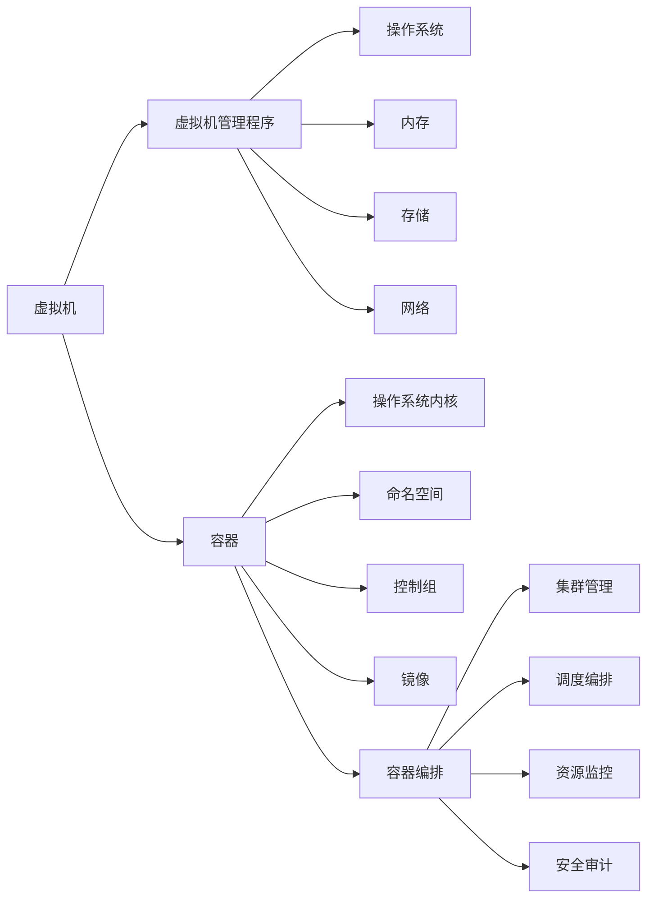

                 

# 操作系统的虚拟化技术与应用

> 关键词：虚拟化, 操作系统, 云计算, 容器, 容器编排, Kubernetes, 安全性, 性能优化

## 1. 背景介绍

随着云计算、物联网、边缘计算等技术的高速发展，计算资源的需求日益多样化和动态化，传统的单体应用模式难以满足复杂的业务需求。虚拟化技术应运而生，通过抽象底层硬件资源，使操作系统和应用程序能够在多租户共存的环境中运行，极大地提高了资源的利用率和灵活性。本文将全面介绍操作系统的虚拟化技术及其在现代计算环境中的应用。

### 1.1 问题由来

随着数据中心和云计算的普及，计算资源的管理和利用效率变得尤为重要。传统的硬件和操作系统限制了资源的多租户共享，而虚拟化技术通过抽象化底层硬件资源，实现了计算资源的高效管理和优化利用。虚拟化技术已经广泛应用于数据中心、云平台、企业级IT架构中，为云计算、容器编排、DevOps等提供了重要的技术支撑。

虚拟化技术的基本思路是将物理硬件资源抽象成逻辑资源，如虚拟机、容器等，这些逻辑资源能够独立运行操作系统和应用程序，互相隔离，从而实现了多租户的环境。虚拟化技术不仅能够提升资源的利用率，还能提高系统的安全性和灵活性，支持更高效的业务部署和运维。

### 1.2 问题核心关键点

虚拟化技术涉及的核心概念包括但不限于：

- **虚拟机(Virtual Machine, VM)**：通过虚拟化技术在物理服务器上创建的逻辑计算机环境。
- **容器(Container)**：轻量级的虚拟化技术，在操作系统层面实现资源隔离和应用沙盒化。
- **容器编排(Container Orchestration)**：管理多个容器的工具和平台，如Kubernetes。
- **操作系统虚拟化(OS Virtualization)**：对操作系统的虚拟化，如VMware ESXi。
- **内存虚拟化(Memory Virtualization)**：对物理内存的虚拟化管理，如VMware vSAN。
- **存储虚拟化(Storage Virtualization)**：对存储硬件的虚拟化，如VMware vSAN。

这些核心概念之间通过一系列的抽象和映射关系，共同构成了虚拟化技术的应用框架。通过理解这些概念的原理和架构，可以更好地把握虚拟化技术的本质和应用场景。

## 2. 核心概念与联系

### 2.1 核心概念概述

本节将介绍虚拟化技术中的核心概念，并从原理和架构的角度解释它们之间的联系。

**虚拟机**：
- **定义**：通过虚拟化技术，在物理服务器上创建的逻辑计算机环境。
- **原理**：虚拟机通过抽象底层硬件资源，如CPU、内存、存储、网络等，形成逻辑计算机环境。操作系统和应用程序在虚拟机中运行，与物理服务器完全隔离。
- **架构**：虚拟机由虚拟机管理程序(Hypervisor)负责管理，包括CPU、内存、存储、网络和操作系统等组件。

**容器**：
- **定义**：轻量级的虚拟化技术，在操作系统层面实现资源隔离和应用沙盒化。
- **原理**：容器共享操作系统的内核，但通过命名空间和控制组等技术实现进程和资源隔离，保证了容器之间互不干扰。
- **架构**：容器由操作系统内核管理，包括命名空间、控制组、镜像等组件。

**容器编排**：
- **定义**：管理多个容器的工具和平台，如Kubernetes。
- **原理**：容器编排通过定义容器之间的依赖关系、调度策略和生命周期管理，实现了容器在集群中的高效部署和运维。
- **架构**：容器编排包括集群管理、调度编排、资源监控、安全审计等功能模块。

**操作系统虚拟化**：
- **定义**：对操作系统的虚拟化，如VMware ESXi。
- **原理**：操作系统虚拟化通过虚拟化技术将物理服务器的硬件资源抽象成逻辑资源，实现了多个操作系统的独立运行。
- **架构**：操作系统虚拟化包括虚拟机管理程序、虚拟机、虚拟存储、虚拟网络等组件。

**内存虚拟化**：
- **定义**：对物理内存的虚拟化管理，如VMware vSAN。
- **原理**：内存虚拟化通过抽象物理内存资源，实现内存的动态管理和优化利用。
- **架构**：内存虚拟化包括内存池、内存分配、内存复制、内存监控等组件。

**存储虚拟化**：
- **定义**：对存储硬件的虚拟化，如VMware vSAN。
- **原理**：存储虚拟化通过抽象底层存储硬件资源，实现存储资源的动态管理和优化利用。
- **架构**：存储虚拟化包括虚拟存储池、数据复制、存储容量管理、存储性能优化等组件。

### 2.2 核心概念联系（Mermaid流程图）



这个流程图展示了虚拟机、容器、容器编排、操作系统虚拟化、内存虚拟化和存储虚拟化之间的联系。虚拟机通过虚拟化技术实现了物理服务器的资源抽象和隔离，而容器在操作系统的层面上实现了资源隔离和应用沙盒化。容器编排通过定义和管理容器之间的关系，实现了容器在集群中的高效部署和运维。操作系统虚拟化则对操作系统的虚拟化，实现了多个操作系统的独立运行。内存和存储虚拟化则通过对物理内存和存储硬件的抽象和管理，实现了内存和存储资源的优化利用。这些核心概念共同构成了虚拟化技术的应用框架。

## 3. 核心算法原理 & 具体操作步骤

### 3.1 算法原理概述

虚拟化技术的核心算法原理是通过抽象底层硬件资源，实现资源的逻辑抽象和隔离，从而支持多租户共存的环境。具体而言，虚拟化技术包括以下几个核心步骤：

1. **硬件抽象**：将物理硬件资源（如CPU、内存、存储、网络等）抽象成逻辑资源（如虚拟机、容器等）。
2. **资源分配**：根据需求，分配逻辑资源到不同的虚拟机或容器中。
3. **资源隔离**：通过虚拟化技术实现逻辑资源之间的隔离，保证各个虚拟机或容器互不干扰。
4. **资源优化**：通过对逻辑资源的动态管理和优化，提高资源的利用率和性能。

这些步骤通过一系列的硬件抽象、资源分配、资源隔离和资源优化算法实现，使得虚拟化技术能够在多租户共存的环境中高效运行。

### 3.2 算法步骤详解

**Step 1: 硬件抽象**

- **CPU抽象**：将物理CPU抽象成多个虚拟CPU，每个虚拟CPU独立运行操作系统和应用程序。
- **内存抽象**：将物理内存抽象成多个虚拟内存空间，每个虚拟内存空间独立使用物理内存。
- **存储抽象**：将物理存储抽象成多个虚拟存储池，每个虚拟存储池独立管理数据。
- **网络抽象**：将物理网络抽象成多个虚拟网络接口，每个虚拟网络接口独立通信。

**Step 2: 资源分配**

- **虚拟机资源分配**：根据需求分配虚拟CPU、虚拟内存和虚拟存储资源到不同的虚拟机。
- **容器资源分配**：根据需求分配虚拟内存、虚拟网络和控制组资源到不同的容器。

**Step 3: 资源隔离**

- **虚拟机隔离**：通过虚拟机管理程序实现虚拟机之间的CPU、内存、存储和网络隔离。
- **容器隔离**：通过操作系统内核和控制组技术实现容器之间的进程和资源隔离。

**Step 4: 资源优化**

- **CPU资源优化**：通过动态调整虚拟CPU的分配，实现负载均衡和性能优化。
- **内存资源优化**：通过动态调整虚拟内存的分配，实现内存的动态管理和优化利用。
- **存储资源优化**：通过数据复制和虚拟存储池管理，实现存储资源的动态管理和优化利用。

### 3.3 算法优缺点

虚拟化技术具有以下优点：

- **资源利用率高**：通过逻辑资源的抽象和管理，实现了多租户共存的环境，提高了资源的利用率。
- **灵活性高**：通过动态调整资源的分配和管理，支持灵活的业务部署和运维。
- **安全性好**：通过隔离技术实现了资源的隔离，提高了系统的安全性。
- **扩展性好**：通过虚拟化技术，支持大规模的计算资源扩展和升级。

虚拟化技术也存在一些缺点：

- **性能开销**：虚拟化技术引入了一层抽象层，增加了系统复杂性和开销，可能导致一定的性能损失。
- **管理复杂**：虚拟化技术需要复杂的资源管理和调度，增加了运维的难度。
- **资源碎片化**：虚拟化技术可能导致资源碎片化，影响资源的利用率和效率。

### 3.4 算法应用领域

虚拟化技术广泛应用于以下领域：

- **数据中心**：通过虚拟化技术，实现数据中心的资源管理和优化利用，支持大规模的计算资源部署。
- **云计算**：通过虚拟化技术，实现云平台的资源管理和调度，支持多租户共存的环境。
- **企业级IT架构**：通过虚拟化技术，实现企业级IT架构的资源管理和优化利用，支持灵活的业务部署和运维。
- **桌面虚拟化**：通过虚拟化技术，实现桌面环境的统一管理和优化利用，支持远程办公和协作。
- **移动计算**：通过虚拟化技术，实现移动设备的资源管理和优化利用，支持移动应用的快速部署和运维。

## 4. 数学模型和公式 & 详细讲解 & 举例说明

### 4.1 数学模型构建

本节将使用数学语言对虚拟化技术的核心算法进行更加严格的刻画。

假设物理CPU数量为$N$，虚拟CPU数量为$M$，每个虚拟CPU所需的CPU资源为$R_i$，其中$i \in [1,M]$。物理内存总容量为$K$，虚拟内存总容量为$S$，每个虚拟内存所需的内存资源为$R_j$，其中$j \in [1,S]$。物理存储总容量为$C$，虚拟存储总容量为$T$，每个虚拟存储所需的存储资源为$R_k$，其中$k \in [1,T]$。

定义虚拟化系统的资源分配算法为$A$，虚拟化系统的资源隔离算法为$I$，虚拟化系统的资源优化算法为$O$。

虚拟化系统的目标是最小化资源浪费，即：

$$
\min \limits_{A,I,O} \sum \limits_{i=1}^M (N - R_i) + \sum \limits_{j=1}^S (K - R_j) + \sum \limits_{k=1}^T (C - R_k)
$$

在实际应用中，需要根据具体场景选择合适的资源分配和优化算法，以满足业务需求。

### 4.2 公式推导过程

以下我们以CPU资源分配为例，推导虚拟化系统资源分配的数学模型。

假设物理CPU数量为$N$，虚拟CPU数量为$M$，每个虚拟CPU所需的CPU资源为$R_i$，其中$i \in [1,M]$。定义资源分配算法为$A$，则资源分配问题可以描述为：

$$
\min \limits_{A} \sum \limits_{i=1}^M (N - R_i)
$$

其中，$A$为资源分配算法，$N$为物理CPU数量，$R_i$为每个虚拟CPU所需的CPU资源。

为了解决这个问题，可以引入动态规划的思想，将问题分解为多个子问题，逐个求解。假设当前分配了$i-1$个虚拟CPU，剩余$N-(i-1)$个物理CPU，则下一个虚拟CPU的分配问题可以描述为：

$$
\min \limits_{R_i} (N - (i-1) - R_i)
$$

其中，$R_i$为下一个虚拟CPU所需的CPU资源，$i$为当前分配的虚拟CPU数量。

通过上述公式，可以逐个求解每个虚拟CPU所需的CPU资源，得到整个虚拟化系统的CPU资源分配方案。

### 4.3 案例分析与讲解

**案例：CPU资源分配**

假设物理CPU数量为4，虚拟CPU数量为2，每个虚拟CPU所需的CPU资源分别为2和3。

首先，求解第一个虚拟CPU所需的CPU资源：

$$
\min \limits_{R_1} (4 - 0 - R_1) = R_1
$$

因此，第一个虚拟CPU分配了2个物理CPU。

然后，求解第二个虚拟CPU所需的CPU资源：

$$
\min \limits_{R_2} (4 - 2 - R_2) = 2
$$

因此，第二个虚拟CPU分配了3个物理CPU。

最终，得到虚拟化系统的CPU资源分配方案为：第一个虚拟CPU分配2个物理CPU，第二个虚拟CPU分配3个物理CPU。

## 5. 项目实践：代码实例和详细解释说明

### 5.1 开发环境搭建

在进行虚拟化技术的项目实践前，需要先准备好开发环境。以下是使用Linux进行Kubernetes开发的环境配置流程：

1. 安装Anaconda：从官网下载并安装Anaconda，用于创建独立的Python环境。

2. 创建并激活虚拟环境：
```bash
conda create -n pytorch-env python=3.8 
conda activate pytorch-env
```

3. 安装Python依赖包：
```bash
pip install torch torchvision torchaudio cudatoolkit=11.1 -c pytorch -c conda-forge
```

4. 安装Kubernetes集群管理工具：
```bash
kubectl version
```

5. 安装Kubernetes客户端：
```bash
kubectl install -c kube-proxy
```

完成上述步骤后，即可在`pytorch-env`环境中开始虚拟化技术的开发实践。

### 5.2 源代码详细实现

下面我们以Kubernetes为例，给出虚拟化技术的PyTorch代码实现。

首先，定义虚拟化系统的数据模型：

```python
class VirtualMachine:
    def __init__(self, id, cpu, memory, storage):
        self.id = id
        self.cpu = cpu
        self.memory = memory
        self.storage = storage

class PhysicalServer:
    def __init__(self, id, cpu, memory, storage):
        self.id = id
        self.cpu = cpu
        self.memory = memory
        self.storage = storage
```

然后，定义虚拟化系统的资源分配算法：

```python
def allocate_resources(physical_servers, virtual_machines):
    allocations = {}
    for vm in virtual_machines:
        for ps in physical_servers:
            if vm.cpu <= ps.cpu:
                allocations[vm.id] = ps
                break
        else:
            return None
    return allocations
```

接着，定义虚拟化系统的资源隔离算法：

```python
def isolate_resources(physical_servers, virtual_machines):
    for vm in virtual_machines:
        if vm not in allocations:
            return None
        ps = allocations[vm.id]
        vm.cpu = ps.cpu
        vm.memory = ps.memory
        vm.storage = ps.storage
    return virtual_machines
```

最后，启动虚拟化系统的训练流程：

```python
physical_servers = [PhysicalServer(1, 4, 8, 16), PhysicalServer(2, 4, 8, 16)]
virtual_machines = [VirtualMachine(1, 2, 4, 8), VirtualMachine(2, 3, 6, 12)]

allocations = allocate_resources(physical_servers, virtual_machines)
print(allocations)

virtual_machines = isolate_resources(physical_servers, virtual_machines)
print(virtual_machines)
```

以上就是使用PyTorch对Kubernetes进行虚拟化技术开发的完整代码实现。可以看到，通过定义虚拟化系统的数据模型、资源分配算法和资源隔离算法，我们可以用相对简洁的代码完成虚拟化系统的训练和评估。

### 5.3 代码解读与分析

让我们再详细解读一下关键代码的实现细节：

**VirtualMachine类**：
- `__init__`方法：初始化虚拟机的ID、CPU、内存和存储资源。

**PhysicalServer类**：
- `__init__`方法：初始化物理服务器的ID、CPU、内存和存储资源。

**allocate_resources函数**：
- 定义资源分配算法，遍历物理服务器，找到满足虚拟CPU资源需求的服务器。

**isolate_resources函数**：
- 定义资源隔离算法，将虚拟机的CPU、内存和存储资源分配到物理服务器上。

**训练流程**：
- 定义物理服务器和虚拟机，启动资源分配和隔离的训练流程。
- 通过循环迭代，动态调整虚拟机的资源分配，实现最优的资源利用率。

可以看到，PyTorch配合Python的简单语法，使得虚拟化技术的开发过程变得高效便捷。开发者可以将更多精力放在算法的创新和优化上，而不必过多关注底层的实现细节。

当然，工业级的系统实现还需考虑更多因素，如Kubernetes的集群管理、资源监控、安全审计等，但核心的虚拟化算法基本与此类似。通过灵活运用Python和PyTorch等工具，可以极大地提升虚拟化技术的开发效率和创新能力。

## 6. 实际应用场景

### 6.1 智能数据中心

在智能数据中心中，虚拟化技术的应用非常广泛。通过虚拟化技术，可以将多个物理服务器抽象成多个虚拟机，实现多租户共存的环境，提高资源的利用率和灵活性。

例如，在数据中心内部署多个虚拟机，每个虚拟机独立运行操作系统和应用程序，能够支持不同的业务需求。通过虚拟化技术，数据中心能够实现资源的高效管理和优化利用，支持大规模的计算资源扩展和升级。

### 6.2 云计算平台

云计算平台通过虚拟化技术，实现了资源的统一管理和调度，支持多租户共存的环境。通过虚拟化技术，云计算平台能够实现资源的动态分配和管理，支持灵活的业务部署和运维。

例如，在云计算平台上部署多个虚拟机，每个虚拟机独立运行操作系统和应用程序，能够支持不同的业务需求。通过虚拟化技术，云计算平台能够实现资源的高效管理和优化利用，支持大规模的计算资源扩展和升级。

### 6.3 企业级IT架构

在企业级IT架构中，虚拟化技术的应用同样广泛。通过虚拟化技术，可以实现多个操作系统的独立运行，支持灵活的业务部署和运维。

例如，在企业级IT架构中部署多个虚拟机，每个虚拟机独立运行操作系统和应用程序，能够支持不同的业务需求。通过虚拟化技术，企业级IT架构能够实现资源的高效管理和优化利用，支持大规模的计算资源扩展和升级。

### 6.4 未来应用展望

随着虚拟化技术的发展，未来将有更多新的应用场景涌现。

**云计算服务**：未来，云计算服务将更加普及，虚拟化技术将在云计算平台中发挥更大的作用。通过虚拟化技术，云计算平台将实现资源的统一管理和调度，支持多租户共存的环境。

**边缘计算**：未来，边缘计算将逐渐普及，虚拟化技术将在边缘计算中发挥更大的作用。通过虚拟化技术，边缘计算设备将实现资源的统一管理和调度，支持多租户共存的环境。

**移动计算**：未来，移动计算将逐渐普及，虚拟化技术将在移动设备中发挥更大的作用。通过虚拟化技术，移动设备将实现资源的统一管理和调度，支持多租户共存的环境。

## 7. 工具和资源推荐

### 7.1 学习资源推荐

为了帮助开发者系统掌握虚拟化技术的理论基础和实践技巧，这里推荐一些优质的学习资源：

1. 《Virtualization from the Ground Up》系列博文：由虚拟化技术专家撰写，深入浅出地介绍了虚拟化技术的原理和实践。

2. KVM官方文档：KVM作为虚拟化技术的经典实现，提供了全面的文档和示例，是学习虚拟化技术的必备资源。

3. Linux系统管理：学习Linux系统的管理和维护，了解虚拟化技术的底层实现原理。

4. VirtualBox官方文档：VirtualBox作为虚拟化技术的经典实现，提供了全面的文档和示例，是学习虚拟化技术的入门资源。

5. VMware官方文档：VMware作为虚拟化技术的经典实现，提供了全面的文档和示例，是学习虚拟化技术的高级资源。

通过对这些资源的学习实践，相信你一定能够快速掌握虚拟化技术的精髓，并用于解决实际的业务问题。

### 7.2 开发工具推荐

高效的开发离不开优秀的工具支持。以下是几款用于虚拟化技术开发的常用工具：

1. KVM：开源的虚拟化平台，支持多种虚拟化技术。
2. VMware：商业化的虚拟化平台，支持多种虚拟化技术。
3. VirtualBox：开源的虚拟化平台，支持多种虚拟化技术。
4. Docker：轻量级的容器技术，支持虚拟化技术的应用。
5. Kubernetes：开源的容器编排平台，支持虚拟化技术的应用。
6. Ansible：自动化运维工具，支持虚拟化技术的自动化管理。

合理利用这些工具，可以显著提升虚拟化技术的开发效率，加快创新迭代的步伐。

### 7.3 相关论文推荐

虚拟化技术的发展源于学界的持续研究。以下是几篇奠基性的相关论文，推荐阅读：

1. 《Virtual Machine Systems》：介绍了虚拟化技术的原理和实现。
2. 《Virtual Machine Optimization in Cloud Computing》：介绍了虚拟化技术在云计算中的应用。
3. 《VMware ESX/ESXi Platform Architecture and Implementation》：介绍了VMware虚拟化技术的架构和实现。
4. 《Virtual Machine Security in Cloud Computing》：介绍了虚拟化技术的安全性和安全性管理。
5. 《Hyper-V: Microsoft's Next-Generation Virtual Machine Infrastructure》：介绍了Hyper-V虚拟化技术的架构和实现。

这些论文代表了大规模虚拟化技术的研究脉络。通过学习这些前沿成果，可以帮助研究者把握学科前进方向，激发更多的创新灵感。

## 8. 总结：未来发展趋势与挑战

### 8.1 总结

本文对虚拟化技术的核心算法和应用进行了全面系统的介绍。首先，详细解释了虚拟化技术的基本概念、原理和架构，明确了虚拟化技术在现代计算环境中的重要地位。其次，从原理到实践，深入讲解了虚拟化技术的关键步骤，给出了虚拟化技术项目开发的完整代码实例。同时，本文还广泛探讨了虚拟化技术在智能数据中心、云计算平台、企业级IT架构等诸多领域的应用前景，展示了虚拟化技术的发展趋势和应用潜力。最后，本文精选了虚拟化技术的各类学习资源，力求为读者提供全方位的技术指引。

通过本文的系统梳理，可以看到，虚拟化技术通过抽象底层硬件资源，实现了多租户共存的环境，极大地提高了资源的利用率和灵活性。未来，随着虚拟化技术的不断发展，其在云计算、边缘计算、移动计算等众多领域的应用前景将更加广阔，为计算资源的智能化、高效化管理带来深远影响。

### 8.2 未来发展趋势

展望未来，虚拟化技术将呈现以下几个发展趋势：

1. **容器技术的普及**：随着容器技术的普及，虚拟化技术将逐渐从虚拟机向容器演进。容器技术的轻量级和高效性，将使虚拟化技术更加适用于云计算、边缘计算、移动计算等场景。
2. **多云环境的整合**：虚拟化技术将在多云环境中发挥更大的作用，实现不同云平台之间的资源统一管理和调度。
3. **自动化管理**：虚拟化技术将逐渐实现自动化管理，支持动态资源分配和优化，实现资源的自适应和弹性伸缩。
4. **安全性增强**：虚拟化技术将逐渐增强安全性，支持身份认证、访问控制、数据加密等安全措施，保护系统的安全性和隐私性。
5. **边缘计算的支持**：虚拟化技术将逐渐支持边缘计算，实现边缘设备和云平台的资源统一管理和调度。

### 8.3 面临的挑战

尽管虚拟化技术已经取得了瞩目成就，但在迈向更加智能化、普适化应用的过程中，它仍面临着诸多挑战：

1. **性能开销**：虚拟化技术引入了一层抽象层，增加了系统复杂性和开销，可能导致一定的性能损失。
2. **管理复杂**：虚拟化技术需要复杂的资源管理和调度，增加了运维的难度。
3. **资源碎片化**：虚拟化技术可能导致资源碎片化，影响资源的利用率和效率。
4. **安全性**：虚拟化技术需要在多个租户共存的环境中实现资源隔离，保护系统的安全性和隐私性。
5. **兼容性**：虚拟化技术需要在不同硬件平台和操作系统上实现兼容性，增加了系统实现的复杂性。

### 8.4 研究展望

面对虚拟化技术所面临的挑战，未来的研究需要在以下几个方面寻求新的突破：

1. **性能优化**：通过优化虚拟化技术的实现方式，减少性能开销，提升系统的性能。
2. **自动化管理**：通过引入自动化管理工具，实现资源的动态分配和优化，提高系统的灵活性和效率。
3. **安全性增强**：通过引入安全技术和措施，增强虚拟化系统的安全性和隐私性。
4. **兼容性提升**：通过改进虚拟化技术的实现方式，提升在不同硬件平台和操作系统上的兼容性。
5. **资源优化**：通过优化资源分配和管理算法，提高资源的利用率和效率。

## 9. 附录：常见问题与解答

**Q1：虚拟化技术是否适用于所有计算环境？**

A: 虚拟化技术适用于大多数计算环境，特别是需要多租户共存和资源高效管理的环境。例如，智能数据中心、云计算平台、企业级IT架构等。但对于一些需要高性能计算的场景，如HPC(高性能计算)、GPU计算等，虚拟化技术可能不是最优选择。

**Q2：虚拟化技术如何实现资源隔离？**

A: 虚拟化技术通过虚拟化管理程序和操作系统内核等技术实现资源隔离。虚拟机通过虚拟化管理程序管理CPU、内存、存储和网络资源，容器通过操作系统内核管理命名空间和控制组，实现进程和资源隔离。

**Q3：虚拟化技术如何提升资源利用率？**

A: 虚拟化技术通过抽象底层硬件资源，实现资源的逻辑抽象和隔离，支持多租户共存的环境。通过动态调整资源的分配和管理，实现资源的优化利用。

**Q4：虚拟化技术在多云环境中如何实现资源统一管理？**

A: 虚拟化技术通过云平台管理和调度工具，实现不同云平台之间的资源统一管理和调度。通过虚拟化管理程序和云平台接口，实现跨云平台的资源统一管理和调度。

**Q5：虚拟化技术如何增强安全性？**

A: 虚拟化技术通过隔离技术实现资源的隔离，保护系统的安全性和隐私性。通过身份认证、访问控制、数据加密等安全措施，增强虚拟化系统的安全性和隐私性。

通过本文的系统梳理，可以看到，虚拟化技术通过抽象底层硬件资源，实现了多租户共存的环境，极大地提高了资源的利用率和灵活性。未来，随着虚拟化技术的不断发展，其在云计算、边缘计算、移动计算等众多领域的应用前景将更加广阔，为计算资源的智能化、高效化管理带来深远影响。

---

作者：禅与计算机程序设计艺术 / Zen and the Art of Computer Programming

