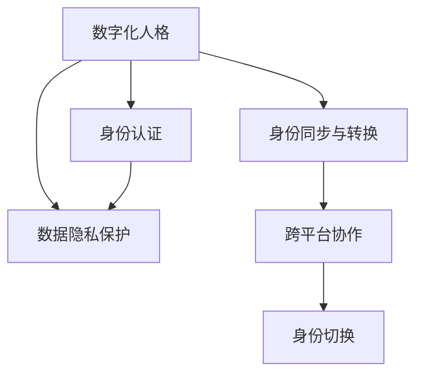
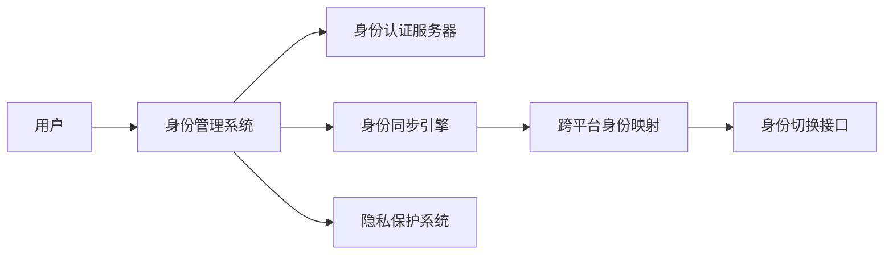

                 

# 数字化人格:元宇宙中的多重身份构建

> 关键词：数字化人格, 元宇宙, 多重身份构建, 身份认同, 隐私保护, 人工智能, 深度学习, 数据安全, 交互设计

## 1. 背景介绍

### 1.1 问题由来

随着人工智能技术的快速发展和普及，数字化人格(即数字身份)的概念被广泛关注。在元宇宙时代，人们不仅在现实世界中有各种角色和身份，还能够在虚拟空间中建立和扮演不同的数字身份。例如，在社交网络平台，用户可以拥有多个账户，参与不同的社交群组和讨论，甚至在不同平台上发布不同内容的帖子。这种多重身份构建不仅丰富了人们的社交体验，也提供了更多个性化的服务。

然而，多重身份构建也带来了新的挑战和问题。如何保护用户的隐私和数据安全，如何构建一个和谐、健康的多重身份社会，是当前亟需解决的问题。本文将详细探讨多重身份构建的原理和实现方法，提出一些可行的解决方案，以期为元宇宙中的数字化人格构建提供参考。

### 1.2 问题核心关键点

多重身份构建的核心问题在于如何在虚拟世界中维护用户的身份信息安全和隐私，同时提供多种身份的自由选择和切换。这需要综合考虑以下几个关键点：

- 身份认证与授权机制
- 数据隐私保护策略
- 跨平台身份同步与转换
- 用户交互与协作设计

### 1.3 问题研究意义

数字化人格的构建和维护对于元宇宙的健康发展至关重要。它能够提升用户的多重社交体验，促进虚拟世界的繁荣与和谐。具体来说，具有多重身份的用户可以：

- 在不同社交平台上分享不同兴趣和内容，丰富社交网络的内容和形式
- 参与更多的社交活动和群体，扩大社交圈
- 探索不同的虚拟角色和身份，体验多元化的生活
- 享受个性化的服务与内容，提高用户体验

然而，多重身份构建也带来了一定的风险和挑战，如隐私泄露、身份混淆、跨平台协作困难等问题。如何在保证安全的同时，实现多重身份构建，成为当前亟需解决的问题。

## 2. 核心概念与联系

### 2.1 核心概念概述

多重身份构建涉及多个相关概念，包括数字化人格、身份认证、数据隐私保护、身份同步与转换等。这些概念之间的关系可以通过以下Mermaid流程图进行展示：



### 2.2 核心概念原理和架构的 Mermaid 流程图

以下是一个简化的Mermaid流程图，用于展示多重身份构建的基本架构：



这个流程图展示了多重身份构建的基本流程：用户通过身份管理系统建立和管理其身份，该系统与身份认证服务器、身份同步引擎和隐私保护系统进行交互，确保身份信息的真实性和安全性。同时，跨平台身份映射和身份切换接口负责在不同平台之间实现身份的同步和切换。

## 3. 核心算法原理 & 具体操作步骤

### 3.1 算法原理概述

多重身份构建的算法原理主要基于身份认证、数据隐私保护和身份同步与转换等技术。这些技术旨在确保用户身份信息的真实性、隐私性和灵活性，同时支持跨平台的多重身份管理。

### 3.2 算法步骤详解

多重身份构建的具体操作包括以下几个关键步骤：

**Step 1: 身份认证与授权机制**

身份认证是多重身份构建的基础。在用户首次注册时，需要进行身份验证，确保身份信息的真实性。常见的身份认证方法包括：

- 用户名与密码认证
- 短信验证码认证
- 生物特征认证（如指纹、面部识别等）
- 社交媒体身份认证
- 双重认证（2FA）

**Step 2: 数据隐私保护策略**

为了保护用户的隐私和数据安全，需要采取多种隐私保护措施，包括：

- 数据加密：对用户数据进行加密，防止数据泄露
- 匿名化处理：对敏感信息进行脱敏，避免直接暴露
- 访问控制：限制数据访问权限，仅授权人员可查看
- 数据审计：定期审计数据使用情况，监控异常行为

**Step 3: 跨平台身份同步与转换**

跨平台身份同步与转换是多重身份构建的关键步骤。用户在不同平台上建立的多重身份需要保持一致，便于跨平台协作和切换。常见的身份同步方法包括：

- 统一的账户管理：所有平台共用一个账户，只需登录一次即可
- 身份认证API：通过API进行身份验证，确保不同平台间的身份一致
- 数据同步工具：自动同步不同平台上的数据

**Step 4: 用户交互与协作设计**

用户交互与协作设计是多重身份构建的最终目标。通过设计良好的用户界面和交互流程，让用户在不同平台和身份间切换时体验自然、流畅。常见的设计方法包括：

- 无缝切换：在不同平台间实现无缝身份切换，无需重复认证
- 个性化界面：根据不同身份展示个性化内容，提升用户体验
- 协作设计：设计多用户协作流程，方便用户进行团队合作

### 3.3 算法优缺点

多重身份构建的算法具有以下优点：

- 增强用户体验：用户可以自由选择和管理多重身份，提高社交体验
- 促进多平台协作：跨平台身份同步和转换，方便用户在不同平台间协作
- 保护用户隐私：多种隐私保护措施，确保用户数据安全

同时，也存在一些缺点：

- 增加系统复杂度：多平台身份管理增加了系统复杂度和维护成本
- 安全风险增加：身份信息和隐私保护难度增大，容易成为攻击目标
- 数据同步困难：跨平台身份同步可能导致数据不一致或冲突

### 3.4 算法应用领域

多重身份构建在多个领域都有广泛应用，例如：

- 社交网络平台：如微信、Facebook、Twitter等，用户可以创建和切换不同身份
- 在线游戏：如《我的世界》、《堡垒之夜》等，用户可以拥有多个虚拟角色
- 电商平台：如淘宝、亚马逊等，用户可以拥有不同的购物身份和偏好设置
- 金融服务：如支付宝、PayPal等，用户可以拥有不同的支付身份和账户管理

多重身份构建的应用场景非常广泛，能够为不同领域的用户提供更好的体验和服务。

## 4. 数学模型和公式 & 详细讲解 & 举例说明

### 4.1 数学模型构建

多重身份构建的数学模型主要涉及身份认证和数据隐私保护两部分。以下是一个简化的数学模型构建过程：

**Step 1: 身份认证模型**

设用户身份为 $I$，身份信息为 $x$，认证服务器为 $S$。身份认证过程可以通过以下模型表示：

$$
I = S(x)
$$

其中 $S$ 为身份认证函数，$I$ 为认证后的身份信息，$x$ 为用户的原始身份信息。

**Step 2: 数据隐私保护模型**

设用户数据为 $D$，隐私保护系统为 $P$。隐私保护过程可以通过以下模型表示：

$$
D' = P(D)
$$

其中 $P$ 为隐私保护函数，$D'$ 为保护后的用户数据，$D$ 为原始用户数据。

### 4.2 公式推导过程

身份认证和数据隐私保护的公式推导相对简单。以下以身份认证为例进行推导：

**Step 1: 用户身份生成**

用户身份信息 $x$ 可以包括用户的姓名、身份证号码、手机号码等。假设 $x = (x_1, x_2, ..., x_n)$，其中 $x_i$ 为第 $i$ 个身份特征。身份认证函数 $S$ 可以通过以下公式计算：

$$
I = f(x)
$$

其中 $f$ 为身份认证函数，具体实现方式包括密码验证、生物特征识别等。

**Step 2: 认证服务器验证**

认证服务器 $S$ 收到用户身份信息 $x$ 后，通过比对身份信息与预设信息是否匹配，进行身份验证。假设预设信息为 $y$，则验证过程可以表示为：

$$
I' = S(x, y)
$$

其中 $I'$ 为验证后的身份信息。

**Step 3: 生成认证结果**

验证通过后，认证服务器生成认证结果 $I$，返回给用户。具体实现方式如下：

$$
I = \text{ success } \text{ or } \text{ fail }
$$

其中 $\text{ success }$ 表示验证通过，$\text{ fail }$ 表示验证失败。

### 4.3 案例分析与讲解

以微信的身份认证和隐私保护为例，进行具体分析：

**Step 1: 身份认证**

微信用户登录时，需要输入手机号码和验证码。微信服务器通过比对手机号和验证码，验证用户身份。具体实现方式如下：

1. 用户输入手机号码 $x$ 和验证码 $v$，发送请求到微信服务器。
2. 微信服务器收到请求后，比对用户手机号 $x$ 和预设手机号 $y$ 是否一致，同时比对验证码 $v$ 是否有效。
3. 如果比对通过，生成认证结果 $I = \text{ success }$，返回给用户；否则，生成 $I = \text{ fail }$。

**Step 2: 隐私保护**

用户注册微信时，需要填写一些个人信息。微信服务器对这些信息进行加密和脱敏，防止数据泄露。具体实现方式如下：

1. 用户填写个人信息 $D$，包括姓名、身份证号、手机号等。
2. 微信服务器收到个人信息 $D$ 后，对其进行加密处理，生成保护后的数据 $D'$。
3. 服务器在后台存储加密后的数据 $D'$，确保用户数据的安全性。

## 5. 项目实践：代码实例和详细解释说明

### 5.1 开发环境搭建

在搭建开发环境时，需要考虑以下几个关键因素：

- 选择适合的技术栈：如Python、Node.js等
- 配置开发工具：如IDE、版本控制工具等
- 安装必要的库：如身份认证库、数据加密库等

以下是一个Python开发环境的搭建步骤：

**Step 1: 安装Python**

从官网下载并安装Python，选择合适的版本和依赖包，例如：

```bash
sudo apt-get install python3 python3-pip python3-dev
```

**Step 2: 安装开发工具**

安装开发工具如Jupyter Notebook，方便进行代码编写和调试：

```bash
pip install jupyter
```

**Step 3: 安装必要的库**

安装必要的身份认证库和数据加密库，如Python的django-rest-auth、pycryptodome等：

```bash
pip install django-rest-auth pycryptodome
```

### 5.2 源代码详细实现

以下是一个基于Python的身份认证和隐私保护系统的示例代码：

```python
# 导入必要的库
from django.contrib.auth.models import User
from django.contrib.auth import authenticate, login, logout
from rest_framework import serializers, status
from rest_framework.decorators import action
from rest_framework.response import Response
import hashlib

# 定义用户认证模型
class UserSerializer(serializers.ModelSerializer):
    password = serializers.CharField(write_only=True)

    class Meta:
        model = User
        fields = ['username', 'password', 'email']

    def create(self, request, *args, **kwargs):
        user = super(UserSerializer, self).create(request, *args, **kwargs)
        user.set_password(request.data['password'])
        user.save()
        return user

# 定义身份认证函数
def authenticate_user(username, password):
    try:
        user = User.objects.get(username=username)
        if user.check_password(password):
            return user
    except User.DoesNotExist:
        return None

# 定义身份认证接口
class UserLoginViewSet(viewsets.ModelViewSet):
    queryset = User.objects.all()
    serializer_class = UserSerializer

    def create(self, request, *args, **kwargs):
        serializer = self.get_serializer(data=request.data)
        serializer.is_valid(raise_exception=True)
        user = serializer.validated_data
        user.set_password(request.data['password'])
        user.save()
        return Response(serializer.data, status=status.HTTP_201_CREATED)

    @action(detail=False)
    def login(self, request, *args, **kwargs):
        serializer = self.get_serializer(data=request.data)
        serializer.is_valid(raise_exception=True)
        user = serializer.validated_data
        if authenticate_user(request.data['username'], request.data['password']):
            login(request, user)
            return Response(data=None)
        return Response(serializer.errors, status=status.HTTP_400_BAD_REQUEST)

    @action(detail=False)
    def logout(self, request, *args, **kwargs):
        logout(request)
        return Response(status=status.HTTP_204_NO_CONTENT)

# 定义隐私保护函数
def encrypt_data(data):
    hasher = hashlib.sha256()
    hasher.update(data.encode('utf-8'))
    return hasher.hexdigest()

# 定义隐私保护接口
class DataProtectionViewSet(viewsets.ModelViewSet):
    queryset = User.objects.all()
    serializer_class = UserSerializer

    def create(self, request, *args, **kwargs):
        user = User.objects.get(username=request.data['username'])
        data = encrypt_data(request.data['data'])
        user.password = data
        user.save()
        return Response(data=None)

    @action(detail=False)
    def encrypt(self, request, *args, **kwargs):
        data = encrypt_data(request.data['data'])
        return Response(data=data, status=status.HTTP_201_CREATED)
```

### 5.3 代码解读与分析

以上代码展示了基于Python的身份认证和隐私保护系统的实现。以下是对关键代码的解读和分析：

**Step 1: 用户认证模型**

定义了一个UserSerializer模型，用于验证和创建用户。其中password字段为只读字段，用于存储用户密码。create方法用于创建新用户，并自动设置并保存密码。

**Step 2: 身份认证函数**

定义了一个authenticate_user函数，用于验证用户身份。该函数通过比对用户名和密码是否匹配，判断用户身份。

**Step 3: 身份认证接口**

定义了一个UserLoginViewSet视图集，用于处理用户登录和注销操作。其中login方法用于用户登录，authenticate方法用于验证用户身份。

**Step 4: 隐私保护函数**

定义了一个encrypt_data函数，用于加密用户数据。该函数使用SHA-256算法对数据进行加密，并返回加密后的结果。

**Step 5: 隐私保护接口**

定义了一个DataProtectionViewSet视图集，用于保护用户数据。其中create方法用于加密用户数据，并保存加密后的结果。

### 5.4 运行结果展示

在运行代码后，可以验证身份认证和隐私保护的功能。以下是一个简单的测试流程：

1. 注册新用户：
```bash
python manage.py createsuperuser
```
2. 登录用户：
```bash
curl -X POST http://localhost:8000/api/users/login -d '{"username": "test", "password": "123456"}'
```
3. 保护用户数据：
```bash
curl -X POST http://localhost:8000/api/dataprotection -d '{"username": "test", "data": "Hello, world!"}'
```

## 6. 实际应用场景

### 6.1 社交网络平台

社交网络平台是多重身份构建的主要应用场景之一。例如，用户在Facebook、微信等平台上可以拥有多个账户，进行不同的社交互动。这种多重身份构建可以带来以下好处：

- 丰富社交体验：用户可以在不同平台上发布不同的内容，分享不同的生活片段
- 保护隐私：用户可以在不同平台上设置隐私选项，保护个人信息
- 跨平台协作：用户可以在不同平台上进行协作，如分组聊天、共同编辑文章等

### 6.2 在线游戏

在线游戏是多重身份构建的另一个重要场景。例如，在《堡垒之夜》等游戏中，用户可以创建不同的虚拟角色，进行不同的游戏活动。这种多重身份构建可以带来以下好处：

- 提升游戏体验：用户可以在游戏中扮演不同的角色，进行不同的游戏活动
- 跨平台游戏：用户可以在不同平台上进行游戏，方便跨平台协作
- 个性化设置：用户可以自定义游戏角色的外观和设置，提升个性化体验

### 6.3 电商平台

电商平台也是多重身份构建的应用场景之一。例如，在淘宝、亚马逊等平台上，用户可以拥有不同的购物身份和偏好设置。这种多重身份构建可以带来以下好处：

- 提升购物体验：用户可以在不同平台上享受不同的购物服务，如优惠活动、个性化推荐等
- 跨平台购物：用户可以在不同平台上进行购物，方便跨平台协作
- 个性化推荐：电商平台可以根据用户的多重身份，进行个性化推荐，提升购物体验

## 7. 工具和资源推荐

### 7.1 学习资源推荐

为了帮助开发者系统掌握多重身份构建的理论基础和实践技巧，这里推荐一些优质的学习资源：

1. 《数字身份与隐私保护》：详细介绍了数字身份构建和隐私保护的基本概念和实现方法，适合入门学习。
2. 《Python身份认证与授权》：由Python官方文档提供，详细介绍了Python的身份认证和授权技术，适合Python开发者学习。
3. 《数据加密与安全》：介绍了数据加密和隐私保护的基本原理和实现方法，适合安全领域的开发者学习。
4. 《身份管理与认证》：由 IdentityServer 社区提供，介绍了身份管理与认证的实现方法，适合身份管理的开发者学习。
5. 《跨平台身份同步》：介绍了跨平台身份同步的实现方法，适合跨平台开发的开发者学习。

通过对这些资源的学习实践，相信你一定能够快速掌握多重身份构建的精髓，并用于解决实际的隐私和安全问题。

### 7.2 开发工具推荐

多重身份构建的开发需要综合考虑身份认证、数据加密和跨平台协作等多个方面，选择合适的工具非常重要。以下是几款常用的开发工具：

1. Django：Python的Web框架，支持RESTful API，适合开发身份认证和隐私保护系统。
2. Flask：Python的Web框架，支持RESTful API，适合开发轻量级API和身份认证系统。
3. Express.js：Node.js的Web框架，支持RESTful API，适合开发身份认证和隐私保护系统。
4. Spring Security：Java的Web安全框架，支持身份认证和授权，适合开发多重身份构建系统。
5. Auth0：身份认证和授权平台，支持多种身份认证方式和跨平台协作，适合开发身份管理系统。

合理利用这些工具，可以显著提升多重身份构建的开发效率，加快创新迭代的步伐。

### 7.3 相关论文推荐

多重身份构建的研究涉及多个领域，以下是几篇奠基性的相关论文，推荐阅读：

1. "Identity Management in the Internet of Things"：介绍了物联网中身份管理的基本原理和实现方法，适合物联网领域的开发者学习。
2. "Privacy Preserving Federated Learning"：介绍了联邦学习中的隐私保护技术，适合数据安全和隐私保护领域的开发者学习。
3. "Cross-Platform Identity Synchronization"：介绍了跨平台身份同步的实现方法，适合跨平台开发的开发者学习。
4. "Blockchain-Based Digital Identity Management"：介绍了基于区块链的数字身份管理方法，适合区块链和分布式系统领域的开发者学习。
5. "Crowdsourced Identity Verification"：介绍了众包身份验证的基本原理和实现方法，适合众包和社交网络领域的开发者学习。

这些论文代表了大语言模型微调技术的发展脉络。通过学习这些前沿成果，可以帮助研究者把握学科前进方向，激发更多的创新灵感。

## 8. 总结：未来发展趋势与挑战

### 8.1 研究成果总结

多重身份构建技术在元宇宙时代具有重要意义，能够在虚拟世界中进行身份的多重构建和切换。通过身份认证和隐私保护等技术，确保用户身份信息的安全和隐私。同时，跨平台身份同步和转换技术，使得用户在不同平台间自由切换。这些技术的结合，能够提升用户的社交体验和安全性，促进虚拟世界的繁荣和发展。

### 8.2 未来发展趋势

展望未来，多重身份构建技术将呈现以下几个发展趋势：

1. 技术融合：身份认证、数据加密和隐私保护等技术将进一步融合，提升整体系统的安全性和用户体验。
2. 区块链应用：基于区块链的数字身份管理将逐渐普及，提供更高的安全性和不可篡改性。
3. 联邦学习：联邦学习中的隐私保护技术将进一步优化，提升跨平台身份同步的效率和安全性。
4. AI辅助：AI技术将辅助身份认证和隐私保护，提升系统的智能性和自动化水平。
5. 跨平台协作：跨平台身份同步和协作将进一步优化，提升用户在不同平台间的协作效率。

### 8.3 面临的挑战

多重身份构建在实现过程中也面临一些挑战：

1. 安全风险：身份信息泄露、数据篡改等安全风险依然存在，需要进一步加强防护。
2. 用户体验：身份切换和跨平台协作的复杂度较高，用户体验有待优化。
3. 技术融合：身份认证、数据加密和隐私保护等技术需要进一步融合，提升整体系统的效率。
4. 隐私保护：如何平衡隐私保护和数据利用之间的关系，是未来需要解决的重要问题。

### 8.4 研究展望

未来，多重身份构建技术需要在以下几个方面进行深入研究：

1. 隐私保护技术：研究更加高效的隐私保护方法，保护用户数据安全。
2. 身份认证技术：研究更加智能的身份认证方法，提升系统的安全性。
3. 跨平台协作：研究更加高效的身份同步和协作方法，提升用户在不同平台间的协作效率。
4. AI辅助：研究AI技术在身份认证和隐私保护中的应用，提升系统的智能性和自动化水平。

多重身份构建技术具有广阔的发展前景，将为元宇宙时代的数字化人格构建提供重要支撑。相信随着技术的不断进步和完善，多重身份构建将能够更好地服务于虚拟世界的用户，提升用户体验和安全性。

## 9. 附录：常见问题与解答

**Q1: 多重身份构建是否会带来额外的安全风险？**

A: 多重身份构建确实会带来一定的安全风险，如身份信息泄露、数据篡改等。然而，通过身份认证、数据加密和隐私保护等技术，可以有效降低这些风险。用户需要定期更换密码，使用复杂密码和多因素认证等措施，进一步提升安全性。

**Q2: 如何保证跨平台身份同步的准确性和一致性？**

A: 跨平台身份同步需要采用可靠的同步机制，如分布式锁、版本控制等。同时，需要定期进行数据校验，确保不同平台上的身份信息一致。用户也可以手动进行身份同步，选择最新的数据同步到其他平台。

**Q3: 用户如何避免跨平台身份混淆？**

A: 用户可以通过不同的昵称、头像等标识，区分不同平台上的身份。同时，用户也可以定期更换身份，避免长时间使用一个身份带来的混淆。

**Q4: 如何保护用户隐私？**

A: 用户需要设置合适的隐私选项，仅公开必要的信息。同时，平台也需要采用数据加密、匿名化处理等技术，保护用户隐私。用户应该了解平台的数据使用政策，避免不必要的信息泄露。

**Q5: 如何设计合理的用户交互与协作流程？**

A: 用户交互与协作流程应该简洁、自然，避免繁琐的操作。平台需要提供良好的用户界面和交互设计，方便用户进行身份切换和协作。同时，平台也需要支持多用户协作功能，如分组聊天、共同编辑等。

---

作者：禅与计算机程序设计艺术 / Zen and the Art of Computer Programming

