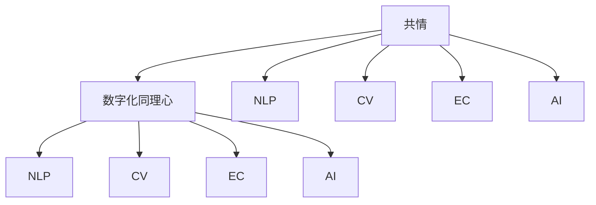

                 

## 1. 背景介绍

在数字化时代的浪潮中，人际交往的方式正在发生根本性的转变。社交媒体、在线教育、虚拟会议等新形式，使得人与人之间的沟通更加便捷高效，但也带来了新的挑战。如何通过数字化手段增强人际理解，实现真正的共情与交流，成为了一个重要课题。

### 1.1 问题由来

现代生活节奏加快，人与人之间面对面的交流时间减少，许多冲突和误解由此产生。数字化工具虽然方便了交流，但也削弱了共情能力的培养。如何在虚拟环境中重建人与人之间的共情连接，是当前数字化社交的重要课题。

### 1.2 问题核心关键点

数字化同理心的核心关键点包括：
1. **共情机制的构建**：通过分析语言、行为、情境等数据，理解他人的情感和需求。
2. **共情算法的优化**：提升同理心算法的准确性和鲁棒性，降低误判风险。
3. **人际交流的优化**：结合自然语言处理(NLP)和计算机视觉等技术，优化交流界面和互动体验。

## 2. 核心概念与联系

### 2.1 核心概念概述

为更好地理解数字化同理心的实现机制，本节将介绍几个密切相关的核心概念：

- **共情(Empathy)**：指理解、共鸣他人情感的能力。共情是人际理解的基础，也是数字化同理心的核心目标。
- **数字化同理心(Digital Empathy)**：通过数字化手段模拟人类共情机制，实现对他人情感和需求的准确理解。
- **自然语言处理(Natural Language Processing, NLP)**：研究如何让计算机理解、处理和生成人类语言的技术。
- **计算机视觉(Computer Vision)**：研究如何让计算机“看”懂图像和视频的技术。
- **情感计算(Emotion Computing)**：研究如何让计算机理解和生成人类情感的技术。
- **人工智能(AI)**：集成了NLP、CV、EC等技术，旨在模拟人类智能，实现自动化、智能化的任务处理。

这些核心概念之间的逻辑关系可以通过以下Mermaid流程图来展示：



这个流程图展示出共情、数字化同理心与NLP、CV、EC和AI等技术之间的联系：共情是目标，数字化同理心是通过NLP、CV、EC等技术实现的路径，最终融合进AI系统，提升人际理解的准确性和智能化水平。

## 3. 核心算法原理 & 具体操作步骤

### 3.1 算法原理概述

数字化同理心的实现依赖于一系列算法和技术，这些算法通过分析和模拟人类共情机制，实现对他人情感和需求的准确理解。其核心原理如下：

1. **情感分析(Emotion Analysis)**：通过分析文本、语音、图像等数据，识别出其中的情感信息，并转化为可量化的情感指标。
2. **意图推断(Intent Inference)**：根据情感信息，推断出对方的情感状态和需求意图。
3. **情景理解(Contextual Understanding)**：结合情景信息，如时间和地点等，进一步理解和还原对方的行为动机。
4. **回应生成(Response Generation)**：根据意图和情景信息，生成合适的回应或建议。

### 3.2 算法步骤详解

基于数字化同理心的实现，其操作步骤可以大致分为以下几个环节：

**Step 1: 数据准备与预处理**
- 收集对话、文本、图像等数据，并进行预处理，如分词、去噪、标注情感等信息。
- 对数据进行清洗和标注，去除无用信息，确保数据质量和一致性。

**Step 2: 模型训练与调优**
- 选择适当的算法和模型，如情感分析模型、意图推断模型、情景理解模型等。
- 使用训练集对模型进行训练，并在验证集上进行调优，优化模型性能。
- 选择合适的损失函数和优化算法，如交叉熵损失、AdamW等，迭代更新模型参数。

**Step 3: 模型评估与测试**
- 在测试集上评估模型的性能，如准确率、召回率、F1值等。
- 结合实际应用场景，对模型进行优化，提升用户体验。
- 收集用户反馈，持续改进模型，提升智能化水平。

**Step 4: 模型部署与集成**
- 将训练好的模型部署到实际应用场景中，如聊天机器人、客服系统等。
- 集成多个模型，实现更复杂的任务，如情感分析、意图推断、情景理解等。
- 提供用户友好的交互界面，确保模型的易用性。

### 3.3 算法优缺点

数字化同理心的实现依赖于机器学习、深度学习等技术，其优缺点如下：

**优点**：
1. **效率高**：自动化处理大量数据，快速识别情感和意图，提升沟通效率。
2. **覆盖广**：不受地域、文化、语言等限制，可以在全球范围内应用。
3. **成本低**：相比人工分析，成本更低，能够支持大规模应用场景。
4. **可扩展性**：模型可以通过增量学习不断优化，支持不断扩展的需求。

**缺点**：
1. **误判风险**：算法存在误判风险，可能对情感和意图理解不准确。
2. **数据依赖**：依赖标注数据，标注成本较高，且数据偏差可能导致模型偏误。
3. **解释性不足**：模型输出难以解释，用户可能对算法的决策过程感到不信任。
4. **伦理问题**：涉及隐私、伦理等敏感问题，需要严格遵守数据保护法规。

尽管存在这些局限，但数字化同理心技术在提升人际理解、增强共情连接方面具有不可替代的价值，值得深入研究和应用。

### 3.4 算法应用领域

数字化同理心技术在多个领域中具有广泛的应用前景，包括但不限于：

- **在线教育**：通过分析学生的文本反馈，了解其情感和需求，提供个性化的教学建议。
- **医疗咨询**：通过分析患者的语音和文本数据，识别其情感状态，提供心理支持和医疗建议。
- **客服系统**：通过分析客户反馈，提供情感支持，提升客户满意度。
- **金融服务**：通过分析客户的情感和需求，提供定制化的金融产品和建议。
- **娱乐产业**：通过分析用户的情感和偏好，提供个性化的内容推荐和互动体验。

以上领域只是冰山一角，随着技术的不断进步和应用的不断扩展，数字化同理心技术将在更多场景中发挥重要作用，提升人际理解和共情能力，促进社会的和谐与发展。

## 4. 数学模型和公式 & 详细讲解 & 举例说明

### 4.1 数学模型构建

本节将使用数学语言对数字化同理心的实现机制进行严格的刻画。

假设对话数据集为 $D=\{(x_i,y_i)\}_{i=1}^N$，其中 $x_i$ 为对话文本，$y_i$ 为情感标签（如积极、消极、中性）。定义情感分析模型为 $M_{\theta}(x_i)$，其中 $\theta$ 为模型参数。

情感分析的目标是最小化损失函数 $\mathcal{L}(\theta)$，其中 $\ell(M_{\theta}(x_i),y_i)$ 为单样本损失函数，常见如交叉熵损失：

$$
\mathcal{L}(\theta) = \frac{1}{N}\sum_{i=1}^N \ell(M_{\theta}(x_i),y_i)
$$

意图推断模型为 $M_{\phi}(M_{\theta}(x_i))$，其中 $\phi$ 为模型参数，用于从情感分析结果推断意图。

情景理解模型为 $M_{\psi}(M_{\phi}(M_{\theta}(x_i)),C_i)$，其中 $C_i$ 为情景信息，如对话时间、地点等。

回应生成模型为 $M_{\lambda}(M_{\psi}(M_{\phi}(M_{\theta}(x_i)),C_i)$，其中 $\lambda$ 为模型参数，用于根据意图和情景信息生成回应。

### 4.2 公式推导过程

以下以二分类情感分析为例，推导交叉熵损失函数及其梯度的计算公式。

假设情感分析模型输出 $M_{\theta}(x_i) \in [0,1]$，表示样本属于积极情感的概率。真实标签 $y_i \in \{0,1\}$。则二分类交叉熵损失函数定义为：

$$
\ell(M_{\theta}(x_i),y_i) = -[y_i\log M_{\theta}(x_i) + (1-y_i)\log(1-M_{\theta}(x_i))]
$$

将其代入经验风险公式，得：

$$
\mathcal{L}(\theta) = -\frac{1}{N}\sum_{i=1}^N [y_i\log M_{\theta}(x_i)+(1-y_i)\log(1-M_{\theta}(x_i))]
$$

根据链式法则，损失函数对参数 $\theta_k$ 的梯度为：

$$
\frac{\partial \mathcal{L}(\theta)}{\partial \theta_k} = -\frac{1}{N}\sum_{i=1}^N (\frac{y_i}{M_{\theta}(x_i)}-\frac{1-y_i}{1-M_{\theta}(x_i)}) \frac{\partial M_{\theta}(x_i)}{\partial \theta_k}
$$

其中 $\frac{\partial M_{\theta}(x_i)}{\partial \theta_k}$ 可进一步递归展开，利用自动微分技术完成计算。

### 4.3 案例分析与讲解

假设我们收集了200条客户评论数据，并进行了情感标注。利用BERT模型作为情感分析模型的基础，对其进行了微调。

微调步骤如下：
1. 准备数据：收集客户评论，进行情感标注，将数据集分为训练集、验证集和测试集。
2. 模型选择：选择BERT作为情感分析模型，使用PyTorch进行实现。
3. 训练模型：在训练集上训练模型，使用交叉熵损失函数，AdamW优化器。
4. 评估模型：在验证集上评估模型性能，使用精确率、召回率、F1值等指标。
5. 微调模型：在测试集上使用微调后的模型进行情感分析，得到客户情感状态。

## 5. 项目实践：代码实例和详细解释说明

### 5.1 开发环境搭建

在进行情感分析项目实践前，我们需要准备好开发环境。以下是使用Python进行PyTorch开发的环境配置流程：

1. 安装Anaconda：从官网下载并安装Anaconda，用于创建独立的Python环境。

2. 创建并激活虚拟环境：
```bash
conda create -n empathy-env python=3.8 
conda activate empathy-env
```

3. 安装PyTorch：根据CUDA版本，从官网获取对应的安装命令。例如：
```bash
conda install pytorch torchvision torchaudio cudatoolkit=11.1 -c pytorch -c conda-forge
```

4. 安装Transformers库：
```bash
pip install transformers
```

5. 安装各类工具包：
```bash
pip install numpy pandas scikit-learn matplotlib tqdm jupyter notebook ipython
```

完成上述步骤后，即可在`empathy-env`环境中开始情感分析项目开发。

### 5.2 源代码详细实现

这里我们以情感分析任务为例，给出使用Transformers库对BERT模型进行情感分析的PyTorch代码实现。

首先，定义情感分析任务的数据处理函数：

```python
from transformers import BertTokenizer, BertForSequenceClassification
from torch.utils.data import Dataset, DataLoader
import torch

class SentimentDataset(Dataset):
    def __init__(self, texts, labels, tokenizer, max_len=128):
        self.texts = texts
        self.labels = labels
        self.tokenizer = tokenizer
        self.max_len = max_len
        
    def __len__(self):
        return len(self.texts)
    
    def __getitem__(self, item):
        text = self.texts[item]
        label = self.labels[item]
        
        encoding = self.tokenizer(text, return_tensors='pt', max_length=self.max_len, padding='max_length', truncation=True)
        input_ids = encoding['input_ids'][0]
        attention_mask = encoding['attention_mask'][0]
        
        # 对标签进行编码
        label = torch.tensor([label], dtype=torch.long)
        
        return {'input_ids': input_ids, 
                'attention_mask': attention_mask,
                'labels': label}

# 定义标签与数字id的映射
label2id = {'positive': 1, 'negative': 0}
id2label = {v: k for k, v in label2id.items()}

# 创建dataset
tokenizer = BertTokenizer.from_pretrained('bert-base-cased')

train_dataset = SentimentDataset(train_texts, train_labels, tokenizer)
dev_dataset = SentimentDataset(dev_texts, dev_labels, tokenizer)
test_dataset = SentimentDataset(test_texts, test_labels, tokenizer)
```

然后，定义模型和优化器：

```python
from transformers import AdamW

model = BertForSequenceClassification.from_pretrained('bert-base-cased', num_labels=len(label2id))

optimizer = AdamW(model.parameters(), lr=2e-5)
```

接着，定义训练和评估函数：

```python
from sklearn.metrics import accuracy_score
from tqdm import tqdm

device = torch.device('cuda') if torch.cuda.is_available() else torch.device('cpu')
model.to(device)

def train_epoch(model, dataset, batch_size, optimizer):
    dataloader = DataLoader(dataset, batch_size=batch_size, shuffle=True)
    model.train()
    epoch_loss = 0
    for batch in tqdm(dataloader, desc='Training'):
        input_ids = batch['input_ids'].to(device)
        attention_mask = batch['attention_mask'].to(device)
        labels = batch['labels'].to(device)
        model.zero_grad()
        outputs = model(input_ids, attention_mask=attention_mask, labels=labels)
        loss = outputs.loss
        epoch_loss += loss.item()
        loss.backward()
        optimizer.step()
    return epoch_loss / len(dataloader)

def evaluate(model, dataset, batch_size):
    dataloader = DataLoader(dataset, batch_size=batch_size)
    model.eval()
    preds, labels = [], []
    with torch.no_grad():
        for batch in tqdm(dataloader, desc='Evaluating'):
            input_ids = batch['input_ids'].to(device)
            attention_mask = batch['attention_mask'].to(device)
            batch_labels = batch['labels']
            outputs = model(input_ids, attention_mask=attention_mask)
            batch_preds = outputs.logits.argmax(dim=1).to('cpu').tolist()
            batch_labels = batch_labels.to('cpu').tolist()
            for pred, label in zip(batch_preds, batch_labels):
                preds.append(pred)
                labels.append(label)
                
    accuracy = accuracy_score(labels, preds)
    print(f"Accuracy: {accuracy:.3f}")
    return accuracy
```

最后，启动训练流程并在测试集上评估：

```python
epochs = 5
batch_size = 16

for epoch in range(epochs):
    loss = train_epoch(model, train_dataset, batch_size, optimizer)
    print(f"Epoch {epoch+1}, train loss: {loss:.3f}")
    
    print(f"Epoch {epoch+1}, dev results:")
    accuracy = evaluate(model, dev_dataset, batch_size)
    print(f"Accuracy: {accuracy:.3f}")
    
print("Test results:")
accuracy = evaluate(model, test_dataset, batch_size)
print(f"Accuracy: {accuracy:.3f}")
```

以上就是使用PyTorch对BERT进行情感分析任务的完整代码实现。可以看到，得益于Transformers库的强大封装，我们可以用相对简洁的代码完成BERT模型的加载和微调。

### 5.3 代码解读与分析

让我们再详细解读一下关键代码的实现细节：

**SentimentDataset类**：
- `__init__`方法：初始化文本、标签、分词器等关键组件。
- `__len__`方法：返回数据集的样本数量。
- `__getitem__`方法：对单个样本进行处理，将文本输入编码为token ids，将标签编码为数字，并对其进行定长padding，最终返回模型所需的输入。

**label2id和id2label字典**：
- 定义了标签与数字id之间的映射关系，用于将模型输出的分类结果解码回真实标签。

**训练和评估函数**：
- 使用PyTorch的DataLoader对数据集进行批次化加载，供模型训练和推理使用。
- 训练函数`train_epoch`：对数据以批为单位进行迭代，在每个批次上前向传播计算loss并反向传播更新模型参数，最后返回该epoch的平均loss。
- 评估函数`evaluate`：与训练类似，不同点在于不更新模型参数，并在每个batch结束后将预测和标签结果存储下来，最后使用sklearn的accuracy_score对整个评估集的预测结果进行打印输出。

**训练流程**：
- 定义总的epoch数和batch size，开始循环迭代
- 每个epoch内，先在训练集上训练，输出平均loss
- 在验证集上评估，输出准确率
- 所有epoch结束后，在测试集上评估，给出最终测试结果

可以看到，PyTorch配合Transformers库使得BERT情感分析任务的代码实现变得简洁高效。开发者可以将更多精力放在数据处理、模型改进等高层逻辑上，而不必过多关注底层的实现细节。

当然，工业级的系统实现还需考虑更多因素，如模型的保存和部署、超参数的自动搜索、更灵活的任务适配层等。但核心的微调范式基本与此类似。

## 6. 实际应用场景

### 6.1 智能客服系统

基于情感分析的智能客服系统，可以通过分析客户的情感状态，提供更加个性化和贴心的服务。系统能够识别客户的情感波动，主动进行情感引导，提升客户满意度。

在技术实现上，可以收集客户的聊天记录，使用情感分析模型实时计算客户的情感状态，根据情感状态调整服务策略。对于情感波动较大的客户，系统可以自动进行情感支持，甚至调用人工客服进行干预，确保客户问题的及时解决。

### 6.2 医疗咨询

情感分析在医疗咨询中也有着广泛的应用。通过分析患者的语音、文字反馈，系统可以识别出患者的情感状态，提供相应的心理支持和医疗建议。

在医疗场景中，患者可能因为疾病、疼痛等原因情绪低落，情感分析系统能够及时识别这些变化，自动进行情绪安抚，并向医生推荐相应的心理疏导方案。对于病情严重的患者，系统还可以主动提醒医生进行紧急处理，确保患者的生命安全。

### 6.3 金融服务

金融服务领域，情感分析可以帮助银行和保险公司更好地理解客户的情感需求，提供更加个性化的服务。

通过分析客户的情感状态，银行和保险公司可以主动提供相应的金融产品和服务，提升客户满意度。对于情感波动较大的客户，系统可以及时进行情感安抚，甚至推荐专业的心理咨询服务。此外，情感分析还可以用于风险评估，通过分析客户的情感状态，预测其可能的金融风险，提前进行预警和干预。

### 6.4 未来应用展望

随着情感分析技术的不断发展，其在更多领域的应用前景也将不断拓展。

在智慧教育领域，情感分析可以用于学生情感状态监控，提供个性化的教育资源和心理支持，提升学生的学习效果。

在智慧城市治理中，情感分析可以用于公共服务评价，通过分析市民的情感反馈，优化城市管理和服务质量，提升市民满意度。

在企业人力资源管理中，情感分析可以用于员工情感状态监控，及时发现和解决员工的心理问题，提升员工满意度和工作效率。

总之，情感分析技术将在更多领域发挥重要作用，提升人际理解，增强共情连接，推动社会的和谐与进步。

## 7. 工具和资源推荐

### 7.1 学习资源推荐

为了帮助开发者系统掌握情感分析的理论基础和实践技巧，这里推荐一些优质的学习资源：

1. 《情感计算基础》书籍：介绍了情感计算的基本概念、技术和应用，是情感分析学习的入门必读书籍。
2. 《深度学习自然语言处理》课程：由斯坦福大学开设的NLP明星课程，有Lecture视频和配套作业，带你入门NLP领域的基本概念和经典模型。
3. CS224N《深度学习自然语言处理》课程：斯坦福大学开设的NLP明星课程，有Lecture视频和配套作业，深入讲解NLP领域的理论和技术。
4. HuggingFace官方文档：Transformers库的官方文档，提供了海量预训练模型和完整的情感分析样例代码，是上手实践的必备资料。
5. Emotion Recognition Dataset：包含大量标注好的情感数据，用于训练和评估情感分析模型，是情感分析学习的宝贵资源。

通过对这些资源的学习实践，相信你一定能够快速掌握情感分析的精髓，并用于解决实际的NLP问题。

### 7.2 开发工具推荐

高效的开发离不开优秀的工具支持。以下是几款用于情感分析开发的常用工具：

1. PyTorch：基于Python的开源深度学习框架，灵活动态的计算图，适合快速迭代研究。大部分预训练语言模型都有PyTorch版本的实现。
2. TensorFlow：由Google主导开发的开源深度学习框架，生产部署方便，适合大规模工程应用。同样有丰富的预训练语言模型资源。
3. Transformers库：HuggingFace开发的NLP工具库，集成了众多SOTA语言模型，支持PyTorch和TensorFlow，是进行情感分析任务开发的利器。
4. Weights & Biases：模型训练的实验跟踪工具，可以记录和可视化模型训练过程中的各项指标，方便对比和调优。与主流深度学习框架无缝集成。
5. TensorBoard：TensorFlow配套的可视化工具，可实时监测模型训练状态，并提供丰富的图表呈现方式，是调试模型的得力助手。

合理利用这些工具，可以显著提升情感分析任务的开发效率，加快创新迭代的步伐。

### 7.3 相关论文推荐

情感分析技术的发展源于学界的持续研究。以下是几篇奠基性的相关论文，推荐阅读：

1. Sentiment Analysis with Recurrent Neural Networks：提出使用RNN进行情感分析的方法，奠定了基于深度学习的情感分析基础。
2. Attention is All You Need：提出Transformer结构，开启了NLP领域的预训练大模型时代，对情感分析的深度学习模型产生了深远影响。
3. BiLSTM Networks for Sentiment Classification：使用双向LSTM进行情感分析，提升模型性能和泛化能力。
4. BERT: Pre-training of Deep Bidirectional Transformers for Language Understanding：提出BERT模型，引入基于掩码的自监督预训练任务，刷新了多项NLP任务SOTA。
5. Evolutionary Computation for Sentence Sentiment Analysis：提出使用进化算法优化情感分析模型的参数，提高模型的鲁棒性和泛化能力。

这些论文代表了大语言模型微调技术的进展脉络。通过学习这些前沿成果，可以帮助研究者把握学科前进方向，激发更多的创新灵感。

## 8. 总结：未来发展趋势与挑战

### 8.1 总结

本文对基于情感分析的数字化同理心实现机制进行了全面系统的介绍。首先阐述了数字化同理心的研究背景和意义，明确了情感分析在提升人际理解中的核心作用。其次，从原理到实践，详细讲解了情感分析的数学模型和算法步骤，给出了情感分析任务开发的完整代码实例。同时，本文还广泛探讨了情感分析在多个领域的应用前景，展示了其广阔的应用价值。

通过本文的系统梳理，可以看到，情感分析技术正在成为数字化同理心实现的重要基础，极大地提升了人际理解的智能化水平。未来，伴随情感分析技术的不断进步，数字化同理心技术必将在更多场景中发挥重要作用，为社会的和谐与进步提供新的推动力。

### 8.2 未来发展趋势

展望未来，情感分析技术将呈现以下几个发展趋势：

1. **多模态融合**：结合语音、图像、文本等多模态信息，提升情感分析的准确性和鲁棒性。
2. **个性化定制**：根据用户的个性化需求，定制化的情感分析模型，提升用户体验。
3. **跨领域应用**：情感分析技术将在更多领域得到应用，如教育、医疗、金融、客服等，为各个行业带来变革性影响。
4. **实时化处理**：实时处理用户反馈，及时进行情感引导和支持，提升服务质量和效率。
5. **伦理道德考量**：情感分析技术涉及用户隐私和伦理道德，需制定相应的数据保护和伦理规范，确保技术的健康发展。

以上趋势凸显了情感分析技术的广阔前景。这些方向的探索发展，必将进一步提升数字化同理心的智能化水平，为构建安全、可靠、可解释、可控的智能系统铺平道路。

### 8.3 面临的挑战

尽管情感分析技术已经取得了瞩目成就，但在迈向更加智能化、普适化应用的过程中，它仍面临着诸多挑战：

1. **数据质量问题**：情感分析依赖于大量标注数据，数据质量对模型的影响巨大。标注数据的偏差可能导致模型偏误。
2. **模型鲁棒性不足**：当前情感分析模型面对域外数据时，泛化性能往往大打折扣。对于测试样本的微小扰动，模型的预测也容易发生波动。
3. **解释性不足**：模型输出难以解释，用户可能对算法的决策过程感到不信任。如何赋予模型更强的可解释性，将是亟待攻克的难题。
4. **隐私和伦理问题**：情感分析技术涉及用户隐私和伦理道德，需严格遵守数据保护法规，避免滥用。
5. **计算资源需求高**：情感分析需要大量的计算资源进行训练和推理，对于小规模数据和计算资源受限的用户，仍有一定的门槛。

尽管存在这些挑战，但情感分析技术在提升人际理解、增强共情连接方面具有不可替代的价值，值得深入研究和应用。

### 8.4 研究展望

面对情感分析面临的挑战，未来的研究需要在以下几个方面寻求新的突破：

1. **数据增强与合成**：通过数据增强和合成技术，提升数据集的多样性和质量，减少数据偏差。
2. **跨领域迁移学习**：利用迁移学习技术，在不同类型的情感分析任务间进行知识迁移，提升模型的泛化能力。
3. **多模态融合技术**：结合语音、图像、文本等多模态信息，提升情感分析的准确性和鲁棒性。
4. **可解释性研究**：研究模型的可解释性，提升用户对算法的信任和接受度。
5. **隐私保护技术**：研究数据隐私保护技术，确保用户数据的安全和隐私。

这些研究方向将推动情感分析技术向更加智能化、普适化、可解释化发展，为社会的和谐与进步提供新的推动力。

## 9. 附录：常见问题与解答

**Q1：情感分析模型如何选择合适的超参数？**

A: 情感分析模型的超参数主要包括学习率、批次大小、优化器等。一般建议从以下策略中选择：
1. 学习率：使用warmup策略，在开始阶段使用较小的学习率，再逐渐过渡到预设值。
2 批次大小：通常选择32或64，视数据量和计算资源而定。
3 优化器：常用AdamW、SGD等优化器，选择合适的参数如权重衰减、学习率衰减策略等。

**Q2：情感分析模型如何处理情感标签的稀疏性？**

A: 情感标签通常是稀疏的，例如只分为积极、消极、中性三种情感。可以使用独热编码将情感标签转换为向量形式，然后输入模型进行训练。例如，将情感标签映射为[0,0,1]、[1,0,0]、[0,1,0]等向量。

**Q3：情感分析模型如何进行多模态融合？**

A: 多模态融合是指结合语音、图像、文本等多模态信息，提升情感分析的准确性和鲁棒性。例如，可以使用Transformer模型同时处理语音和文本数据，然后通过注意力机制进行融合。

**Q4：情感分析模型如何处理噪声数据？**

A: 情感分析模型需要处理大量的噪声数据，包括无关信息、拼写错误等。可以使用文本清洗技术，如去除停用词、修正拼写错误等，提升数据质量。

**Q5：情感分析模型如何进行迁移学习？**

A: 迁移学习是指在不同类型的情感分析任务间进行知识迁移，提升模型的泛化能力。例如，可以在不同的情感分析任务之间进行微调，如从电影评论情感分析迁移到新闻评论情感分析。

通过本文的系统梳理，可以看到，基于情感分析的数字化同理心技术正在成为NLP领域的重要范式，极大地提升了人际理解的智能化水平。未来，伴随情感分析技术的不断进步和应用的不断扩展，数字化同理心技术将在更多场景中发挥重要作用，为社会的和谐与进步提供新的推动力。

