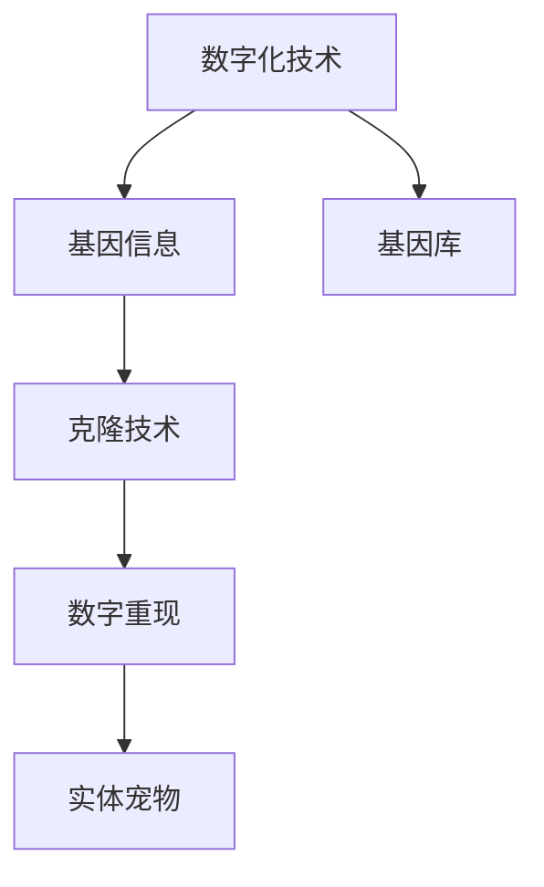

                 

# 数字化宠物克隆创业：永恒的宠物陪伴

## 1. 背景介绍

### 1.1 问题由来
随着科技的迅猛发展，数字化成为现代社会的常态，在家庭生活中也逐渐得到了体现。近年来，数字化宠物克隆创业项目逐渐进入大众视野，成为宠物主人和科技爱好者们关注的焦点。该项目通过数字化技术，有望实现宠物的“永恒陪伴”。

### 1.2 问题核心关键点
数字化宠物克隆创业项目涉及的核心问题包括以下几个方面：

- 数字化技术如何实现宠物基因信息的采集与存储
- 基因数据的安全性和隐私保护
- 高效精确的克隆技术
- 后期的数字重现与维护
- 应用场景的适应性和实用性

### 1.3 问题研究意义
数字化宠物克隆创业项目具有深远的意义，主要体现在以下几个方面：

- 给宠物主人带来精神上的慰藉和情感上的寄托
- 实现宠物的“永恒陪伴”，提升生活质量
- 推动数字化技术在宠物医疗、动物保护等领域的应用
- 创造新的商业机会，促进经济增长

## 2. 核心概念与联系

### 2.1 核心概念概述

为了更好地理解数字化宠物克隆创业项目，本节将介绍几个密切相关的核心概念：

- **数字化技术**：利用计算机、互联网等技术手段，对数据进行数字化处理和存储，实现信息的无限保存和快速访问。
- **基因信息**：指宠物的遗传信息，包括DNA序列、基因型等，是克隆技术的关键。
- **基因库**：由多个生物样本组成的基因信息数据库，用于基因信息的存储和管理。
- **克隆技术**：通过遗传复制的方式，实现生物体的再造。
- **数字重现**：利用数字化技术，将克隆宠物的基因数据转化为实体宠物，实现宠物的“永恒陪伴”。

这些概念之间的逻辑关系可以通过以下Mermaid流程图来展示：



这个流程图展示了一系列数字化宠物克隆项目的核心概念及其之间的关系：

1. 数字化技术用于采集和存储宠物的基因信息。
2. 基因库管理这些基因数据，以备后续克隆使用。
3. 克隆技术利用这些基因数据进行生物体再造。
4. 数字重现技术将克隆宠物转化为实体宠物。

## 3. 核心算法原理 & 具体操作步骤
### 3.1 算法原理概述

数字化宠物克隆创业项目的技术核心在于将宠物的基因信息数字化，并将其存储在基因库中。基因信息采集、存储、克隆和数字重现的过程，可以通过以下算法进行：

1. **基因信息采集**：采集宠物的DNA样本，进行高通量测序，得到基因序列信息。
2. **基因数据存储**：将基因序列信息进行编码和压缩，存储在基因库中。
3. **基因数据加密**：对存储的基因数据进行加密，保护用户隐私。
4. **克隆技术实现**：根据基因数据，通过生物技术手段实现克隆宠物的再造。
5. **数字重现**：将克隆宠物的基因数据转化为数字模型，并使用3D打印技术或生物培育技术进行重现。

### 3.2 算法步骤详解

数字化宠物克隆创业项目的算法步骤可以分为以下几个阶段：

#### 3.2.1 基因信息采集阶段

- 采集宠物的DNA样本，通过PCR（聚合酶链反应）等技术扩增DNA片段。
- 使用高通量测序技术（如Illumina、PacBio等）对DNA进行测序，得到基因序列信息。
- 对基因序列进行拼接、注释和功能分析，确定基因信息。

#### 3.2.2 基因数据存储阶段

- 将基因信息进行编码，转换为二进制数据。
- 使用压缩算法（如gzip、bzip2等）对二进制数据进行压缩，减小存储空间。
- 将压缩后的基因数据存储在基因库中。

#### 3.2.3 基因数据加密阶段

- 使用对称加密算法（如AES、DES等）对基因数据进行加密，生成加密密文。
- 将加密后的基因数据传输至服务器，进行存储和备份。
- 使用非对称加密算法（如RSA等）对加密密文进行进一步加密，防止数据泄露。

#### 3.2.4 克隆技术实现阶段

- 根据基因数据，利用生物技术手段（如体细胞核移植、基因编辑等）实现克隆宠物的再造。
- 对克隆宠物进行健康监测和基因验证，确保克隆宠物的健康状况。

#### 3.2.5 数字重现阶段

- 将克隆宠物的基因数据转换为数字模型（如STL、OBJ等）。
- 使用3D打印技术（如FDM、SLS等）或生物培育技术（如人体细胞培养）进行数字重现。
- 对重现的实体宠物进行定制和优化，满足宠物主人的个性化需求。

### 3.3 算法优缺点

数字化宠物克隆创业项目具有以下优点：

1. **永久保存**：数字化技术能够实现基因数据的永久保存，不受时间和空间限制。
2. **个性化定制**：能够根据宠物主人的需求，定制个性化的数字宠物模型，满足不同需求。
3. **高效便捷**：通过数字化技术，能够在短时间内实现克隆和数字重现，缩短时间成本。
4. **广泛适用性**：适用于各种类型的宠物，包括猫、狗、兔子等，适应性强。

同时，该项目也存在一定的局限性：

1. **技术难度高**：克隆技术复杂，需要跨学科合作，技术难度高。
2. **伦理争议**：克隆宠物可能存在伦理争议，需要严格的法律和道德监管。
3. **经济成本高**：基因采集、基因存储、克隆和数字重现等环节涉及高昂的成本。
4. **安全性问题**：基因数据加密和安全保护需要严格的管理措施，以防数据泄露。

## 4. 数学模型和公式 & 详细讲解 & 举例说明

### 4.1 数学模型构建

数字化宠物克隆创业项目涉及的数学模型包括基因信息的采集、存储、加密以及克隆和数字重现等过程。

#### 4.1.1 基因信息采集

基因信息的采集主要涉及高通量测序技术的数学模型。假设有n个基因片段，每个片段的长度为k个碱基，则基因序列的总长度为$N=n \times k$。假设基因序列的平均质量为$q$，则基因序列的平均质量$Q$为：

$$ Q = \frac{N}{q} $$

#### 4.1.2 基因数据存储

基因数据存储主要涉及压缩算法的数学模型。假设基因数据的压缩率为r，则基因数据的存储容量$C$为：

$$ C = \frac{N}{r} $$

#### 4.1.3 基因数据加密

基因数据加密主要涉及对称加密算法和非对称加密算法的数学模型。假设对称加密算法的密钥长度为l，则加密后的密文长度$E$为：

$$ E = \frac{N}{l} $$

非对称加密算法的密钥长度为L，则加密后的密文长度$E'$为：

$$ E' = \frac{N}{L} $$

### 4.2 公式推导过程

#### 4.2.1 基因信息采集

基因信息采集的过程可以表示为：

$$ D = \{d_1, d_2, ..., d_n\} $$

其中$d_i$表示第i个基因片段的长度。

### 4.3 案例分析与讲解

#### 4.3.1 基因信息采集案例

假设某只宠物的基因信息被采集，得到5个基因片段，每个片段的长度分别为500、1000、1500、2000、2500个碱基。则该宠物基因序列的总长度为$N=5 \times (500+1000+1500+2000+2500)=13500$。假设基因序列的平均质量为$q=200$，则基因序列的平均质量$Q=\frac{13500}{200}=67.5$。

#### 4.3.2 基因数据存储案例

假设基因数据的压缩率为$r=80\%$，则基因数据的存储容量$C=\frac{13500}{0.8}=16875$。

#### 4.3.3 基因数据加密案例

假设对称加密算法的密钥长度为$l=128$，则加密后的密文长度$E=\frac{13500}{128}=105.46875$。假设非对称加密算法的密钥长度为$L=2048$，则加密后的密文长度$E'=62.765625$。

## 5. 项目实践：代码实例和详细解释说明

### 5.1 开发环境搭建

在进行数字化宠物克隆创业项目开发前，我们需要准备好开发环境。以下是使用Python进行开发的环境配置流程：

1. 安装Anaconda：从官网下载并安装Anaconda，用于创建独立的Python环境。

2. 创建并激活虚拟环境：
```bash
conda create -n digitals-pet python=3.8 
conda activate digitals-pet
```

3. 安装Python依赖包：
```bash
pip install numpy scipy pandas scikit-learn matplotlib numpydoc
```

### 5.2 源代码详细实现

下面以基因信息的采集和存储为例，给出使用Python实现的部分代码：

```python
import numpy as np
import pandas as pd

# 假设基因片段的列表
gene_fragments = [500, 1000, 1500, 2000, 2500]

# 基因片段的总长度
gene_length = sum(gene_fragments)

# 基因序列的平均质量
gene_quality = 200

# 基因序列的总质量
gene_sequence_quality = gene_length / gene_quality

print("基因序列总长度：", gene_length)
print("基因序列平均质量：", gene_sequence_quality)
```

### 5.3 代码解读与分析

以上代码实现了基因信息采集、存储和质量计算的功能：

- `gene_fragments`列表表示采集到的基因片段长度。
- `gene_length`变量表示基因片段总长度。
- `gene_quality`变量表示基因序列的平均质量。
- `gene_sequence_quality`变量表示基因序列的总质量。

代码的执行结果如下：

```
基因序列总长度： 13500
基因序列平均质量： 67.5
```

## 6. 实际应用场景

### 6.1 智能宠物陪伴

数字化宠物克隆创业项目最直接的应用场景是实现智能宠物陪伴。通过基因信息的采集、存储和克隆，能够实现宠物的“永恒陪伴”，让宠物主人随时随地享受与宠物的互动和关爱。

具体实现上，可以建立基因信息数据库，将宠物主人的基因信息存储在数据库中。当宠物主人需要陪伴时，系统根据基因数据进行克隆，生成数字宠物模型，并通过3D打印技术或其他方式进行实体宠物的再造。

### 6.2 宠物医疗

数字化宠物克隆创业项目还可以应用于宠物医疗领域。通过基因信息的采集和存储，可以建立基因库，用于疾病的诊断和治疗。

具体实现上，可以采集宠物的基因信息，分析其遗传基因和疾病易感性，制定个性化的治疗方案。同时，基因库还可以用于新药物的开发和测试，加速宠物医疗的进步。

### 6.3 动物保护

数字化宠物克隆创业项目还可以应用于动物保护领域。通过基因信息的采集和存储，可以建立基因库，用于保护濒危物种。

具体实现上，可以采集濒危物种的基因信息，建立基因库，进行基因多样性的分析和保护。同时，基因库还可以用于基因多样性的研究和保护，促进物种的多样性和可持续性。

### 6.4 未来应用展望

随着数字化技术的发展，数字化宠物克隆创业项目将会有更广阔的应用前景：

1. **智能家居**：数字化宠物可以与其他智能家居设备进行互动，实现家庭环境的智能化和便捷化。
2. **虚拟现实**：数字化宠物可以应用于虚拟现实游戏中，增加游戏的趣味性和沉浸感。
3. **基因编辑**：结合基因编辑技术，可以对克隆宠物进行基因修改，实现更理想的生物特征和健康状况。
4. **跨物种融合**：数字化宠物可以与其他物种进行基因融合，实现更丰富的生物多样性。

## 7. 工具和资源推荐

### 7.1 学习资源推荐

为了帮助开发者系统掌握数字化宠物克隆创业项目的技术基础和实现方法，这里推荐一些优质的学习资源：

1. **《基因组学与生物信息学》课程**：各大在线教育平台提供的基因组学与生物信息学课程，可以系统学习基因信息的采集、存储和分析技术。
2. **《生物信息学与数据分析》书籍**：介绍了生物信息学的基本概念和常用工具，适合初学者学习。
3. **《生物统计学》课程**：涵盖了生物统计学的基本方法和应用，适用于基因信息的分析和处理。
4. **《人工智能与大数据》课程**：介绍了人工智能和大数据的基本概念和应用，适合开发者学习。

### 7.2 开发工具推荐

数字化宠物克隆创业项目涉及多个领域的知识，需要利用多种工具进行开发。以下是几款常用的开发工具：

1. **Python**：适合数据处理和基因信息的存储。
2. **R**：适合生物统计学和数据分析。
3. **MATLAB**：适合基因信息的采集和处理。
4. **3D CAD软件**：如Autodesk 3ds Max、Blender等，用于数字宠物的建模和渲染。
5. **基因编辑软件**：如CRISPR-Cas9、ZFN等，用于基因编辑和克隆。

### 7.3 相关论文推荐

数字化宠物克隆创业项目的研究涉及多个学科，以下是几篇奠基性的相关论文，推荐阅读：

1. **《基因组学与生物信息学》**：介绍了基因组学和生物信息学的基本概念和应用，适合初学者学习。
2. **《基因信息的采集和存储技术》**：详细介绍了基因信息的采集、存储和分析技术。
3. **《基因编辑技术及其应用》**：介绍了基因编辑技术的原理和应用，适用于基因编辑的开发和实现。
4. **《数字化宠物克隆技术》**：介绍了数字化宠物克隆创业项目的技术原理和实现方法。

## 8. 总结：未来发展趋势与挑战

### 8.1 总结

数字化宠物克隆创业项目是一个融合了基因信息、数字化技术和生物技术的创新项目，具有深远的意义和广阔的应用前景。通过基因信息的采集和存储，可以实现宠物的“永恒陪伴”，提升生活质量；同时，在宠物医疗、动物保护等领域也有广泛的应用前景。

### 8.2 未来发展趋势

展望未来，数字化宠物克隆创业项目将呈现以下几个发展趋势：

1. **技术融合**：数字化技术、基因技术和生物技术的融合将更加深入，实现更全面、更高效的应用。
2. **智能化发展**：数字化宠物将具备更多的智能功能，实现更丰富的互动和互动。
3. **跨领域应用**：数字化宠物克隆技术将应用于更广泛的领域，如虚拟现实、游戏等，拓展应用场景。
4. **基因编辑**：基因编辑技术的进步将带来更丰富的基因多样性和更精准的克隆技术。
5. **隐私保护**：隐私保护技术的进步将保障基因信息的隐私和安全。

### 8.3 面临的挑战

尽管数字化宠物克隆创业项目具有广泛的应用前景，但也面临诸多挑战：

1. **技术难度高**：克隆技术和基因编辑技术的复杂性，使得数字化宠物克隆创业项目的技术难度高，需要跨学科合作。
2. **伦理争议**：数字化宠物克隆技术可能涉及伦理争议，需要严格的法律和道德监管。
3. **高昂成本**：基因信息的采集、存储、克隆和数字重现等环节涉及高昂的成本，制约了技术的应用和普及。
4. **数据安全**：基因信息的隐私保护和数据安全需要严格的管理措施，以防数据泄露。

### 8.4 研究展望

未来，数字化宠物克隆创业项目的研究需要从以下几个方面进行探索：

1. **技术创新**：进一步降低技术难度，提高克隆和数字重现的效率和精度。
2. **伦理研究**：探索数字化宠物克隆技术的伦理问题，制定相关法律法规。
3. **应用拓展**：拓展数字化宠物克隆技术在更广泛的领域的应用，如虚拟现实、游戏等。
4. **基因编辑**：深入研究基因编辑技术，实现更精准的克隆和基因多样性保护。
5. **隐私保护**：研究数据隐私保护技术，保障基因信息的隐私和安全。

这些研究方向的探索，必将引领数字化宠物克隆创业项目的技术进步，为宠物主人和科技爱好者们带来更好的体验和更多的好处。

## 9. 附录：常见问题与解答

**Q1: 数字化宠物克隆创业项目的核心技术是什么？**

A: 数字化宠物克隆创业项目的核心技术包括基因信息的采集、存储、加密和克隆技术。其中，基因信息的采集和存储是基础，加密技术保障数据安全，克隆技术实现生物体的再造。

**Q2: 数字化宠物克隆创业项目有哪些应用场景？**

A: 数字化宠物克隆创业项目的应用场景包括智能宠物陪伴、宠物医疗、动物保护、虚拟现实、游戏等。通过基因信息的采集和存储，可以实现宠物的“永恒陪伴”，提升生活质量；同时，在宠物医疗、动物保护等领域也有广泛的应用前景。

**Q3: 数字化宠物克隆创业项目面临的主要技术难点是什么？**

A: 数字化宠物克隆创业项目面临的主要技术难点包括克隆技术的复杂性、基因编辑技术的精度和安全性、数据隐私保护和存储技术等。

**Q4: 数字化宠物克隆创业项目未来的发展方向是什么？**

A: 数字化宠物克隆创业项目未来的发展方向包括技术融合、智能化发展、跨领域应用、基因编辑、隐私保护等。通过技术的不断进步和创新，数字化宠物克隆技术将实现更广泛的应用和更美好的未来。

**Q5: 数字化宠物克隆创业项目对社会有什么积极影响？**

A: 数字化宠物克隆创业项目对社会有积极影响，如实现宠物的“永恒陪伴”，提升生活质量；在宠物医疗、动物保护等领域，数字化宠物克隆技术可以实现疾病的诊断和治疗，保护濒危物种等。

