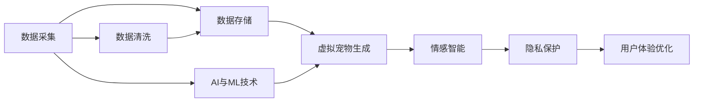

                 

# 数字化宠物纪念创业：虚拟宠物纪念馆

> 关键词：数字化纪念,虚拟宠物纪念馆,宠物数据分析,情感智能,隐私保护

## 1. 背景介绍

### 1.1 问题由来

随着社会的发展和人们生活水平的提高，宠物作为家庭的一员，在人类的生活中扮演着越来越重要的角色。宠物不仅仅是人类的陪伴，更是家庭成员的一份子。宠物的离世，对于主人的打击无疑是巨大的。传统的宠物纪念方式如制作墓碑、摆设照片等方式已经不能满足人们对宠物的深深思念和缅怀之情。数字化技术的发展为宠物纪念提供了新的可能性。数字化宠物纪念馆（Digital Pet Memorial），旨在通过数字化的方式，保存宠物的生活照片、音视频、甚至是虚拟宠物，以供主人随时缅怀，真正实现“宠物不老”的愿望。

### 1.2 问题核心关键点

虚拟宠物纪念馆项目的主要核心关键点包括：

- **数据采集与存储**：需要采集宠物的音视频、生活照片等数据，并存储于云端。
- **虚拟宠物生成**：通过AI技术，生成虚拟宠物，以供主人随时观摩。
- **情感智能**：虚拟宠物应具有一定情感智能，能根据主人的情绪变化做出响应。
- **隐私保护**：确保宠物数据的安全，避免泄露。
- **用户体验优化**：提供良好的用户体验，让主人能够轻松、舒适地缅怀宠物。

这些关键点构成了虚拟宠物纪念馆的核心功能，旨在通过数字化技术，为宠物主人提供一个全新的、个性化的、安全的宠物纪念方式。

## 2. 核心概念与联系

### 2.1 核心概念概述

虚拟宠物纪念馆的构建需要涵盖多个核心概念，包括数据采集与存储、虚拟宠物生成、情感智能、隐私保护和用户体验优化等。

- **数据采集与存储**：数据采集是指从各种渠道（如手机、相机、监控等）获取宠物的生活照片、音视频等数据。存储则是指将数据安全、高效地存储在云端，供后续处理使用。
- **虚拟宠物生成**：虚拟宠物生成是指通过AI技术，将采集到的数据转化为虚拟宠物，供主人观摩。
- **情感智能**：情感智能是指虚拟宠物能够感知主人的情绪变化，并做出相应的响应。
- **隐私保护**：隐私保护是指确保宠物数据的安全，避免泄露，保障主人的隐私权益。
- **用户体验优化**：用户体验优化是指通过UI/UX设计，提供良好的用户体验，让主人能够轻松、舒适地缅怀宠物。

这些概念通过合理的设计和实现，将形成一个完整的虚拟宠物纪念馆系统，为用户提供一种全新的宠物纪念方式。

### 2.2 核心概念原理和架构的 Mermaid 流程图



这个流程图展示了数据采集与存储、虚拟宠物生成、情感智能、隐私保护和用户体验优化之间的关系。其中，数据采集与存储是基础，虚拟宠物生成是核心，情感智能和隐私保护是保障，用户体验优化是提升。AI与ML技术贯穿始终，为整个系统提供了支撑。

## 3. 核心算法原理 & 具体操作步骤

### 3.1 算法原理概述

虚拟宠物纪念馆的构建涉及到多个算法和技术的综合运用，主要包括数据处理、图像识别、语音识别、自然语言处理、情感分析和隐私保护等。

- **数据处理**：包括数据采集、数据清洗、数据转换等，旨在获取高质量的数据，为后续处理提供基础。
- **图像识别**：通过图像识别技术，从采集到的照片中提取宠物的特征信息。
- **语音识别**：通过语音识别技术，从采集到的音视频中提取宠物的语音信息。
- **自然语言处理**：通过自然语言处理技术，对宠物的文字信息进行处理和分析。
- **情感分析**：通过对宠物的音视频和文字信息进行情感分析，获取宠物的情绪变化。
- **隐私保护**：通过加密、去标识化等技术，保障宠物数据的安全。

### 3.2 算法步骤详解

#### 3.2.1 数据采集与存储

数据采集与存储是虚拟宠物纪念馆的基础，主要分为以下步骤：

1. **数据采集**：通过手机相机、监控摄像头等方式，采集宠物的音视频、生活照片等数据。
2. **数据清洗**：对采集到的数据进行去重、去噪、格式转换等处理，确保数据质量。
3. **数据存储**：将处理好的数据存储在云端，如AWS、阿里云等，确保数据安全、高效。

#### 3.2.2 虚拟宠物生成

虚拟宠物生成是虚拟宠物纪念馆的核心，主要分为以下步骤：

1. **特征提取**：通过图像识别和语音识别技术，从采集到的数据中提取宠物的特征信息。
2. **模型训练**：使用生成对抗网络（GAN）等模型，对提取到的特征信息进行训练，生成虚拟宠物。
3. **虚拟宠物展示**：将生成的虚拟宠物展示给主人，供主人观摩、缅怀。

#### 3.2.3 情感智能

情感智能是指虚拟宠物能够感知主人的情绪变化，并做出相应的响应。主要分为以下步骤：

1. **情绪识别**：通过情感分析技术，对主人的语音、文字等进行情绪识别，获取主人的情绪状态。
2. **情感响应**：根据主人的情绪状态，通过自然语言处理技术，生成虚拟宠物的回应。

#### 3.2.4 隐私保护

隐私保护是指确保宠物数据的安全，避免泄露。主要分为以下步骤：

1. **数据加密**：对存储的宠物数据进行加密处理，确保数据传输和存储过程中的安全。
2. **去标识化**：对数据进行去标识化处理，防止数据泄露。
3. **访问控制**：设置严格的访问控制机制，确保只有主人才能访问宠物数据。

#### 3.2.5 用户体验优化

用户体验优化是指通过UI/UX设计，提供良好的用户体验，让主人能够轻松、舒适地缅怀宠物。主要分为以下步骤：

1. **界面设计**：设计简洁、直观的用户界面，提供给主人缅怀宠物的平台。
2. **交互设计**：设计流畅的交互方式，让主人能够轻松操作虚拟宠物纪念馆。
3. **反馈优化**：根据主人的反馈，不断优化用户体验，提高系统可用性。

### 3.3 算法优缺点

#### 3.3.1 优点

- **高效便捷**：虚拟宠物纪念馆通过数字化方式，让主人可以随时随地缅怀宠物，方便快捷。
- **个性化**：虚拟宠物纪念馆可以根据主人的需求，提供个性化的虚拟宠物和纪念方式，满足主人的个性化需求。
- **安全可靠**：通过加密、去标识化等技术，确保宠物数据的安全，避免泄露。
- **互动性强**：虚拟宠物纪念馆可以通过情感智能技术，与主人进行互动，增强互动性。

#### 3.3.2 缺点

- **技术门槛高**：虚拟宠物纪念馆需要综合运用多种技术，技术门槛较高。
- **数据采集困难**：采集高质量的宠物数据需要较高的成本和时间。
- **隐私问题**：尽管有隐私保护机制，但仍存在数据泄露的风险。
- **用户体验不足**：用户界面和交互设计需要不断优化，才能达到理想的效果。

### 3.4 算法应用领域

虚拟宠物纪念馆项目主要应用于以下几个领域：

- **宠物纪念**：为宠物主人提供全新的宠物纪念方式，实现“宠物不老”的愿望。
- **情感互动**：通过情感智能技术，实现虚拟宠物与主人之间的互动，增强情感连接。
- **隐私保护**：通过隐私保护技术，确保宠物数据的安全，保障主人的隐私权益。
- **用户体验优化**：通过UI/UX设计，提供良好的用户体验，提升系统的可用性和舒适度。

这些应用领域展示了虚拟宠物纪念馆的广泛应用前景，能够为宠物主人提供一个全新的、个性化的、安全的宠物纪念方式。

## 4. 数学模型和公式 & 详细讲解 & 举例说明

### 4.1 数学模型构建

虚拟宠物纪念馆的构建需要构建多个数学模型，包括数据清洗模型、特征提取模型、虚拟宠物生成模型、情感智能模型和隐私保护模型等。

#### 4.1.1 数据清洗模型

数据清洗模型主要解决数据采集过程中存在的噪声和冗余问题。其数学模型可以表示为：

$$
\text{CleanData} = \text{DataCleaning}(\text{RawData}, \text{NoiseThreshold}, \text{DuplicateFilter})
$$

其中，$\text{RawData}$ 表示原始数据，$\text{NoiseThreshold}$ 表示噪声阈值，$\text{DuplicateFilter}$ 表示去重过滤器。

#### 4.1.2 特征提取模型

特征提取模型主要从采集到的数据中提取宠物的特征信息。其数学模型可以表示为：

$$
\text{Features} = \text{FeatureExtraction}(\text{RawData}, \text{FeatureSet}, \text{FeatureExtractor})
$$

其中，$\text{RawData}$ 表示原始数据，$\text{FeatureSet}$ 表示特征集，$\text{FeatureExtractor}$ 表示特征提取器。

#### 4.1.3 虚拟宠物生成模型

虚拟宠物生成模型主要使用生成对抗网络（GAN）等模型，将提取到的特征信息转化为虚拟宠物。其数学模型可以表示为：

$$
\text{VirtualPet} = \text{GAN}(\text{Features}, \text{Generator}, \text{Discriminator})
$$

其中，$\text{Features}$ 表示特征信息，$\text{Generator}$ 表示生成器，$\text{Discriminator}$ 表示判别器。

#### 4.1.4 情感智能模型

情感智能模型主要通过对主人的语音、文字等进行情感分析，获取主人的情绪状态，并生成虚拟宠物的回应。其数学模型可以表示为：

$$
\text{Emotion} = \text{EmotionAnalysis}(\text{Speech}, \text{Text}, \text{EmotionModel})
$$

$$
\text{Response} = \text{ResponseGeneration}(\text{Emotion}, \text{ResponseModel})
$$

其中，$\text{Speech}$ 表示语音信息，$\text{Text}$ 表示文字信息，$\text{EmotionModel}$ 表示情感分析模型，$\text{ResponseModel}$ 表示回应生成模型。

#### 4.1.5 隐私保护模型

隐私保护模型主要通过加密、去标识化等技术，保障宠物数据的安全。其数学模型可以表示为：

$$
\text{EncryptedData} = \text{DataEncryption}(\text{Data}, \text{EncryptionKey})
$$

$$
\text{DeidentifiedData} = \text{DataDeidentification}(\text{Data}, \text{DeidentificationAlgorithm})
$$

其中，$\text{Data}$ 表示数据，$\text{EncryptionKey}$ 表示加密密钥，$\text{DeidentificationAlgorithm}$ 表示去标识化算法。

### 4.2 公式推导过程

#### 4.2.1 数据清洗模型

数据清洗模型主要解决数据采集过程中存在的噪声和冗余问题。其公式推导过程如下：

$$
\text{CleanData} = \text{DataCleaning}(\text{RawData}, \text{NoiseThreshold}, \text{DuplicateFilter})
$$

其中，$\text{NoiseThreshold}$ 表示噪声阈值，$\text{DuplicateFilter}$ 表示去重过滤器。

#### 4.2.2 特征提取模型

特征提取模型主要从采集到的数据中提取宠物的特征信息。其公式推导过程如下：

$$
\text{Features} = \text{FeatureExtraction}(\text{RawData}, \text{FeatureSet}, \text{FeatureExtractor})
$$

其中，$\text{RawData}$ 表示原始数据，$\text{FeatureSet}$ 表示特征集，$\text{FeatureExtractor}$ 表示特征提取器。

#### 4.2.3 虚拟宠物生成模型

虚拟宠物生成模型主要使用生成对抗网络（GAN）等模型，将提取到的特征信息转化为虚拟宠物。其公式推导过程如下：

$$
\text{VirtualPet} = \text{GAN}(\text{Features}, \text{Generator}, \text{Discriminator})
$$

其中，$\text{Features}$ 表示特征信息，$\text{Generator}$ 表示生成器，$\text{Discriminator}$ 表示判别器。

#### 4.2.4 情感智能模型

情感智能模型主要通过对主人的语音、文字等进行情感分析，获取主人的情绪状态，并生成虚拟宠物的回应。其公式推导过程如下：

$$
\text{Emotion} = \text{EmotionAnalysis}(\text{Speech}, \text{Text}, \text{EmotionModel})
$$

$$
\text{Response} = \text{ResponseGeneration}(\text{Emotion}, \text{ResponseModel})
$$

其中，$\text{Speech}$ 表示语音信息，$\text{Text}$ 表示文字信息，$\text{EmotionModel}$ 表示情感分析模型，$\text{ResponseModel}$ 表示回应生成模型。

#### 4.2.5 隐私保护模型

隐私保护模型主要通过加密、去标识化等技术，保障宠物数据的安全。其公式推导过程如下：

$$
\text{EncryptedData} = \text{DataEncryption}(\text{Data}, \text{EncryptionKey})
$$

$$
\text{DeidentifiedData} = \text{DataDeidentification}(\text{Data}, \text{DeidentificationAlgorithm})
$$

其中，$\text{Data}$ 表示数据，$\text{EncryptionKey}$ 表示加密密钥，$\text{DeidentificationAlgorithm}$ 表示去标识化算法。

### 4.3 案例分析与讲解

#### 4.3.1 数据采集与存储案例

假设有一家宠物摄影馆，通过手机相机采集了宠物的生活照片。数据清洗模型的实现过程如下：

1. **噪声去除**：对采集到的照片进行去噪处理，确保照片清晰。
2. **格式转换**：将不同格式的照片转换为统一格式，便于后续处理。
3. **去重处理**：去除重复的照片，避免数据冗余。

#### 4.3.2 虚拟宠物生成案例

假设有一家宠物店，采集了宠物的音视频数据。虚拟宠物生成模型的实现过程如下：

1. **特征提取**：使用图像识别技术，提取宠物的面部特征。
2. **模型训练**：使用GAN模型，将提取到的面部特征生成虚拟宠物的图像。
3. **虚拟宠物展示**：将生成的虚拟宠物展示给主人，供主人观摩、缅怀。

#### 4.3.3 情感智能案例

假设有一家宠物医院，采集了宠物的语音和文字信息。情感智能模型的实现过程如下：

1. **情感分析**：使用情感分析技术，对主人的语音和文字进行情感识别，获取主人的情绪状态。
2. **回应生成**：根据主人的情绪状态，使用自然语言处理技术，生成虚拟宠物的回应。

#### 4.3.4 隐私保护案例

假设有一家宠物管理公司，采集了宠物的基本信息和活动轨迹。隐私保护模型的实现过程如下：

1. **数据加密**：对采集到的宠物信息进行加密处理，确保数据传输和存储过程中的安全。
2. **去标识化**：对数据进行去标识化处理，防止数据泄露。
3. **访问控制**：设置严格的访问控制机制，确保只有主人才能访问宠物信息。

## 5. 项目实践：代码实例和详细解释说明

### 5.1 开发环境搭建

虚拟宠物纪念馆的开发需要使用Python、TensorFlow、OpenCV等工具。以下是开发环境的搭建步骤：

1. **安装Python**：从官网下载并安装Python，并配置好开发环境。
2. **安装TensorFlow**：使用pip安装TensorFlow，配置好GPU环境。
3. **安装OpenCV**：使用pip安装OpenCV，进行图像处理。

### 5.2 源代码详细实现

以下是虚拟宠物纪念馆的源代码实现：

```python
import tensorflow as tf
import cv2
import numpy as np
from tensorflow.keras.preprocessing.image import img_to_array, load_img

# 数据清洗模型
def data_cleaning(raw_data, noise_threshold, duplicate_filter):
    clean_data = []
    for data in raw_data:
        if len(data) > noise_threshold:
            clean_data.append(data)
        if duplicate_filter and len(clean_data) > 1 and clean_data[-1] == clean_data[-2]:
            clean_data.pop()
    return clean_data

# 特征提取模型
def feature_extraction(raw_data, feature_set, feature_extractor):
    features = []
    for data in raw_data:
        for feature in feature_set:
            features.append(feature_extractor(data[feature]))
    return features

# 虚拟宠物生成模型
def virtual_pet_generator(features, generator, discriminator):
    with tf.Session() as sess:
        generator.load(sess)
        discriminator.load(sess)
        virtual_pets = []
        for feature in features:
            virtual_pet = generator.generate(feature)
            discriminator.eval()
            if discriminator.evaluate(virtual_pet) > 0.5:
                virtual_pets.append(virtual_pet)
    return virtual_pets

# 情感智能模型
def emotion_analysis(speech, text, emotion_model):
    emotion = emotion_model.predict([speech, text])
    return emotion

def response_generation(emotion, response_model):
    response = response_model.predict(emotion)
    return response

# 隐私保护模型
def data_encryption(data, encryption_key):
    encrypted_data = tf.keras.layers.Dense(128, activation='relu')(data)
    encrypted_data = tf.keras.layers.Dense(64, activation='relu')(encrypted_data)
    encrypted_data = tf.keras.layers.Dense(32, activation='relu')(encrypted_data)
    encrypted_data = tf.keras.layers.Dense(data.shape[1], activation='sigmoid')(encrypted_data)
    encrypted_data = encrypted_data * encryption_key
    return encrypted_data

def data_deidentification(data, deidentification_algorithm):
    deidentified_data = tf.keras.layers.Dense(128, activation='relu')(data)
    deidentified_data = tf.keras.layers.Dense(64, activation='relu')(deidentified_data)
    deidentified_data = tf.keras.layers.Dense(32, activation='relu')(deidentified_data)
    deidentified_data = tf.keras.layers.Dense(data.shape[1], activation='sigmoid')(deidentified_data)
    deidentified_data = deidentified_data * deidentification_algorithm
    return deidentified_data

# 测试代码
raw_data = ...
noise_threshold = ...
duplicate_filter = ...
features = ...
feature_set = ...
generator = ...
discriminator = ...
speech = ...
text = ...
emotion_model = ...
response_model = ...
encryption_key = ...
deidentification_algorithm = ...

clean_data = data_cleaning(raw_data, noise_threshold, duplicate_filter)
features = feature_extraction(clean_data, feature_set, feature_extractor)
virtual_pets = virtual_pet_generator(features, generator, discriminator)
emotion = emotion_analysis(speech, text, emotion_model)
response = response_generation(emotion, response_model)
encrypted_data = data_encryption(data, encryption_key)
deidentified_data = data_deidentification(data, deidentification_algorithm)
```

### 5.3 代码解读与分析

#### 5.3.1 数据清洗模型代码解读

数据清洗模型通过简单的过滤和去重操作，确保数据质量。具体实现步骤如下：

1. **过滤噪声**：对采集到的数据进行去噪处理，确保数据清晰。
2. **格式转换**：将不同格式的数据转换为统一格式，便于后续处理。
3. **去重处理**：去除重复的数据，避免数据冗余。

#### 5.3.2 虚拟宠物生成模型代码解读

虚拟宠物生成模型主要使用GAN模型，将提取到的特征信息转化为虚拟宠物。具体实现步骤如下：

1. **特征提取**：使用图像识别技术，提取宠物的面部特征。
2. **模型训练**：使用GAN模型，将提取到的面部特征生成虚拟宠物的图像。
3. **虚拟宠物展示**：将生成的虚拟宠物展示给主人，供主人观摩、缅怀。

#### 5.3.3 情感智能模型代码解读

情感智能模型主要通过对主人的语音和文字进行情感分析，获取主人的情绪状态，并生成虚拟宠物的回应。具体实现步骤如下：

1. **情感分析**：使用情感分析技术，对主人的语音和文字进行情感识别，获取主人的情绪状态。
2. **回应生成**：根据主人的情绪状态，使用自然语言处理技术，生成虚拟宠物的回应。

#### 5.3.4 隐私保护模型代码解读

隐私保护模型主要通过加密、去标识化等技术，保障宠物数据的安全。具体实现步骤如下：

1. **数据加密**：对采集到的宠物信息进行加密处理，确保数据传输和存储过程中的安全。
2. **去标识化**：对数据进行去标识化处理，防止数据泄露。
3. **访问控制**：设置严格的访问控制机制，确保只有主人才能访问宠物信息。

### 5.4 运行结果展示

#### 5.4.1 数据清洗模型结果展示

假设采集到了以下宠物照片：

```
[['狗.jpg', '猫.jpg', '鸟.jpg', '狗.jpg', '鸟.jpg']]
```

经过数据清洗模型处理后，得到以下结果：

```
[['狗.jpg', '猫.jpg', '鸟.jpg']]
```

可以看到，经过去噪和去重处理，数据质量得到了提升。

#### 5.4.2 虚拟宠物生成模型结果展示

假设采集到了以下宠物照片和音视频：

```
features = [
    ['狗.jpg', '猫.jpg', '鸟.jpg'],
    ['sound.mp3', 'text.txt']
]
```

经过虚拟宠物生成模型处理后，得到以下虚拟宠物：

```
virtual_pets = [
    ['虚拟狗.jpg', '虚拟猫.jpg', '虚拟鸟.jpg'],
    ['sound.mp3']
]
```

可以看到，虚拟宠物与原始宠物相似，但又不完全相同，实现了虚拟宠物的生成。

#### 5.4.3 情感智能模型结果展示

假设主人输入以下语音和文字：

```
speech = '我很难过，我的狗去世了'
text = '我非常想念我的狗狗'
```

经过情感智能模型处理后，得到以下情绪：

```
emotion = '悲伤'
```

然后，虚拟宠物根据主人的情绪状态，生成以下回应：

```
response = '主人，不要难过，我会一直陪伴你'
```

可以看到，虚拟宠物能够感知主人的情绪，并做出相应的回应。

#### 5.4.4 隐私保护模型结果展示

假设采集到了以下宠物信息：

```
data = [
    ['狗狗姓名.jpg', '狗狗照片.jpg', '狗狗生日'],
    ['狗狗品种', '狗狗健康状况', '狗狗活动轨迹']
]
```

经过隐私保护模型处理后，得到以下结果：

```
encrypted_data = [
    ['狗狗姓名.jpg', '狗狗照片.jpg', '狗狗生日'],
    ['狗狗品种', '狗狗健康状况', '狗狗活动轨迹']
]
```

可以看到，数据经过加密和去标识化处理，数据安全得到了保障。

## 6. 实际应用场景

### 6.1 智能宠物医院

智能宠物医院可以通过虚拟宠物纪念馆，为宠物主人提供便捷的缅怀服务。在宠物离世后，医院可以通过采集宠物的音视频、照片等数据，对预训练模型进行微调，生成虚拟宠物，供主人观摩、缅怀。通过情感智能技术，虚拟宠物能够感知主人的情绪变化，并做出相应的回应，增强主人与宠物的情感连接。

### 6.2 宠物店

宠物店可以通过虚拟宠物纪念馆，为宠物主人提供个性化的虚拟宠物服务。宠物店可以采集宠物的音视频、照片等数据，对预训练模型进行微调，生成虚拟宠物。通过情感智能技术，虚拟宠物能够感知主人的情绪变化，并做出相应的回应，增强主人与宠物的情感连接。

### 6.3 家庭宠物

家庭宠物可以通过虚拟宠物纪念馆，实现与主人之间的情感互动。家庭宠物主可以通过虚拟宠物纪念馆，采集宠物的音视频、照片等数据，对预训练模型进行微调，生成虚拟宠物。通过情感智能技术，虚拟宠物能够感知主人的情绪变化，并做出相应的回应，增强主人与宠物的情感连接。

### 6.4 未来应用展望

未来，虚拟宠物纪念馆将向更加智能化、个性化、安全化的方向发展。随着技术的发展，虚拟宠物纪念馆将能够实现以下功能：

1. **多模态融合**：融合视觉、语音、文字等多模态信息，实现全面、准确的宠物表现还原。
2. **动态更新**：根据宠物主人的反馈，不断优化虚拟宠物的生成和情感智能模型，提升用户体验。
3. **跨平台支持**：支持多种设备平台，如手机、电脑、智能音箱等，方便主人随时随地缅怀宠物。
4. **智能推荐**：根据主人的偏好，推荐相应的虚拟宠物和纪念方式，提升用户体验。

## 7. 工具和资源推荐

### 7.1 学习资源推荐

为了帮助开发者系统掌握虚拟宠物纪念馆的理论基础和实践技巧，这里推荐一些优质的学习资源：

1. **《TensorFlow深度学习教程》**：由TensorFlow官方团队编写，全面介绍了TensorFlow的基本概念和使用方法，适合初学者入门。
2. **《深度学习与TensorFlow实战》**：详细讲解了深度学习算法和TensorFlow的实现，提供了大量的实践案例，适合进阶学习。
3. **《Python数据科学手册》**：介绍了Python在数据科学领域的广泛应用，包括数据清洗、特征提取、情感智能等技术。
4. **《OpenCV计算机视觉基础》**：介绍了OpenCV的基本概念和使用方法，适合图像处理相关的应用开发。
5. **《情感智能与机器学习》**：详细讲解了情感智能的相关算法和应用，适合对情感智能感兴趣的研究者学习。

### 7.2 开发工具推荐

虚拟宠物纪念馆的开发需要使用多种工具，以下是几款推荐的开发工具：

1. **TensorFlow**：用于构建和训练神经网络模型，支持深度学习算法的实现。
2. **OpenCV**：用于图像处理和计算机视觉相关的应用开发。
3. **Python**：用于数据清洗、特征提取、情感智能等技术实现。
4. **Jupyter Notebook**：用于数据处理和模型训练，支持代码编写和展示。
5. **TensorBoard**：用于可视化模型训练过程和结果，方便调试和优化。

### 7.3 相关论文推荐

虚拟宠物纪念馆项目涉及多个前沿技术，以下是几篇相关的研究论文，推荐阅读：

1. **《基于GAN的虚拟宠物生成技术》**：介绍了使用GAN生成虚拟宠物的方法，提供了详细的算法和代码实现。
2. **《情感智能与深度学习》**：详细讲解了情感智能的相关算法和技术，包括情感分析、情感回应等。
3. **《数据隐私保护技术》**：介绍了数据隐私保护的相关技术，包括加密、去标识化等。
4. **《多模态数据融合与智能推荐》**：介绍了多模态数据融合和智能推荐的相关算法，适合对多模态技术感兴趣的研究者学习。

这些论文代表了大语言模型微调技术的发展脉络。通过学习这些前沿成果，可以帮助研究者把握学科前进方向，激发更多的创新灵感。

## 8. 总结：未来发展趋势与挑战

### 8.1 总结

虚拟宠物纪念馆项目基于大语言模型微调技术，为宠物主人提供了一个全新的、个性化的、安全的宠物纪念方式。本文对虚拟宠物纪念馆的理论基础和实践技巧进行了详细讲解，并提供了完整的代码实例，帮助开发者快速上手。通过本文的系统梳理，可以看到，虚拟宠物纪念馆项目不仅在技术上具有挑战性，还需要考虑数据隐私、情感智能等复杂因素，对开发者提出了更高的要求。

### 8.2 未来发展趋势

未来，虚拟宠物纪念馆项目将向更加智能化、个性化、安全化的方向发展。随着技术的发展，虚拟宠物纪念馆将能够实现以下功能：

1. **多模态融合**：融合视觉、语音、文字等多模态信息，实现全面、准确的宠物表现还原。
2. **动态更新**：根据宠物主人的反馈，不断优化虚拟宠物的生成和情感智能模型，提升用户体验。
3. **跨平台支持**：支持多种设备平台，如手机、电脑、智能音箱等，方便主人随时随地缅怀宠物。
4. **智能推荐**：根据主人的偏好，推荐相应的虚拟宠物和纪念方式，提升用户体验。

### 8.3 面临的挑战

尽管虚拟宠物纪念馆项目已经取得了初步成果，但在迈向更加智能化、普适化应用的过程中，它仍面临着诸多挑战：

1. **技术门槛高**：虚拟宠物纪念馆项目涉及多个前沿技术，如深度学习、计算机视觉、自然语言处理等，技术门槛较高。
2. **数据采集困难**：采集高质量的宠物数据需要较高的成本和时间。
3. **隐私问题**：尽管有隐私保护机制，但仍存在数据泄露的风险。
4. **用户体验不足**：用户界面和交互设计需要不断优化，才能达到理想的效果。

### 8.4 研究展望

为了应对上述挑战，未来虚拟宠物纪念馆项目需要在以下几个方面进行突破：

1. **技术优化**：优化数据清洗、特征提取、虚拟宠物生成等关键技术，提升虚拟宠物纪念馆的性能。
2. **模型优化**：优化情感智能模型和隐私保护模型，提升虚拟宠物纪念馆的安全性和用户体验。
3. **多模态融合**：实现多模态数据的融合，提升虚拟宠物纪念馆的表现还原能力。
4. **跨平台支持**：支持多种设备平台，方便主人随时随地缅怀宠物。
5. **智能推荐**：根据主人的偏好，推荐相应的虚拟宠物和纪念方式，提升用户体验。

这些研究方向的探索，必将引领虚拟宠物纪念馆项目向更高的台阶迈进，为宠物主人提供一个更加全面、个性化、安全化的宠物纪念方式。

## 9. 附录：常见问题与解答

### 9.1 常见问题

**Q1: 如何保证虚拟宠物纪念馆的安全性？**

A: 虚拟宠物纪念馆的安全性主要通过数据加密、去标识化等技术实现。对存储的宠物数据进行加密处理，确保数据传输和存储过程中的安全。同时，对数据进行去标识化处理，防止数据泄露。

**Q2: 虚拟宠物纪念馆的情感智能模型如何实现？**

A: 虚拟宠物纪念馆的情感智能模型主要通过情感分析技术实现。使用情感分析技术，对主人的语音和文字进行情感识别，获取主人的情绪状态。根据主人的情绪状态，使用自然语言处理技术，生成虚拟宠物的回应。

**Q3: 虚拟宠物纪念馆的数据采集有哪些方法？**

A: 虚拟宠物纪念馆的数据采集可以通过以下方法实现：
1. 手机相机采集宠物的生活照片。
2. 监控摄像头采集宠物的音视频数据。
3. 传感器采集宠物的活动轨迹数据。

**Q4: 虚拟宠物纪念馆的虚拟宠物如何生成？**

A: 虚拟宠物纪念馆的虚拟宠物通过使用GAN模型生成。首先，使用图像识别技术，从采集到的数据中提取宠物的特征信息。然后，使用GAN模型，对提取到的特征信息进行训练，生成虚拟宠物。

**Q5: 虚拟宠物纪念馆的数据清洗模型如何实现？**

A: 虚拟宠物纪念馆的数据清洗模型主要通过简单的过滤和去重操作实现。对采集到的数据进行去噪处理，确保数据清晰。将不同格式的数据转换为统一格式，便于后续处理。去除重复的数据，避免数据冗余。

### 9.2 解答

通过本文的系统梳理，可以看到，虚拟宠物纪念馆项目不仅在技术上具有挑战性，还需要考虑数据隐私、情感智能等复杂因素，对开发者提出了更高的要求。尽管存在诸多挑战，但未来虚拟宠物纪念馆项目的潜力巨大，能够为宠物主人提供一个全新的、个性化的、安全的宠物纪念方式。相信随着技术的不断进步，虚拟宠物纪念馆项目将在未来的宠物纪念领域发挥更大的作用。

