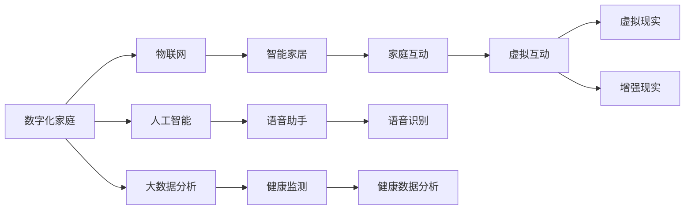

                 

# 数字化家庭:元宇宙时代的亲子关系

> 关键词：数字化家庭,元宇宙,亲子关系,家庭互动,数字技术

## 1. 背景介绍

在当今社会，随着科技的迅猛发展，尤其是数字化技术的普及，家庭的概念正在发生深刻变化。数字技术不仅改变了我们的生活方式和工作方式，也在重塑着家庭成员之间的互动方式，尤其是亲子关系。在元宇宙时代的背景下，数字化技术为家庭提供了全新的互动平台和工具，从而极大地丰富了亲子关系的维度和形式。

### 1.1 数字化家庭的概念

数字化家庭是指通过数字化技术和智能化设备，实现家庭环境的智能化管理和家庭成员间互动的一体化。数字化技术包括物联网(IoT)、人工智能(AI)、大数据分析等，使家庭中的每一项事务都能得到数字化记录和分析，从而提升家庭管理的效率，改善家庭成员间的关系。

### 1.2 元宇宙时代的来临

元宇宙是一个通过虚拟现实(VR)、增强现实(AR)、人工智能(AI)等技术，构建的一个虚拟数字世界，在其中人们可以进行社交、工作、娱乐、教育等各种活动。元宇宙为家庭成员间的互动提供了新的空间，使得家庭成员能够跨越物理空间的限制，进行虚拟的交流和活动。

### 1.3 亲子关系的数字化转型

随着数字技术的普及和元宇宙的兴起，亲子关系也发生了深刻的变化。数字化技术不仅提供了新的互动方式，如视频通话、虚拟现实游戏等，也使得亲子之间的沟通更加便捷和丰富。同时，数字化家庭的应用，如智能家居、健康监测等，也让家长能够更好地关注孩子的成长，增强亲子间的亲密感。

## 2. 核心概念与联系

### 2.1 核心概念概述

为了深入理解数字化家庭和元宇宙时代亲子关系，需要明确几个核心概念及其相互之间的联系：

- **数字化家庭**：利用物联网、人工智能等技术，实现家庭管理和成员互动的智能化。
- **元宇宙**：通过虚拟现实、增强现实、人工智能等技术构建的数字世界，提供全新的互动空间。
- **亲子关系**：家庭成员之间的情感和互动关系，尤其是家长与孩子之间的关系。
- **数字技术**：包括互联网、物联网、人工智能、大数据分析等，为数字化家庭和元宇宙提供了实现基础。
- **家庭互动**：通过数字化技术和元宇宙，家庭成员之间的交流和活动形式。

### 2.2 核心概念原理和架构的 Mermaid 流程图



这个流程图展示了数字化家庭的核心架构：通过物联网、人工智能和大数据分析，实现智能家居和健康监测，并通过虚拟现实和增强现实等技术，提供家庭互动和虚拟互动的空间。这些技术相互关联，共同构成了数字化家庭的运作基础。

## 3. 核心算法原理 & 具体操作步骤

### 3.1 算法原理概述

在元宇宙时代的数字化家庭中，亲子关系的维系和互动主要依赖于以下几个核心算法：

1. **语音识别和自然语言处理**：通过语音识别技术，使得家庭成员能够通过语音进行自然交流，实现智能家居控制和健康监测等功能。
2. **情感分析**：利用情感分析算法，识别家庭成员之间的情感状态，从而更好地调整互动策略。
3. **行为分析**：通过行为分析，预测家庭成员的行为习惯，实现个性化推荐和互动。
4. **虚拟现实和增强现实**：通过虚拟现实和增强现实技术，构建元宇宙空间，使得家庭成员能够在虚拟环境中进行互动。

### 3.2 算法步骤详解

#### 3.2.1 语音识别和自然语言处理

1. **数据收集**：通过智能音箱、麦克风等设备，收集家庭成员的语音数据。
2. **语音识别**：利用深度学习模型，将语音转化为文本，实现语音识别。
3. **自然语言处理**：对语音识别的文本进行自然语言处理，理解家庭成员的意图和情感。
4. **智能家居控制**：根据自然语言处理的意图，控制智能家居设备，如灯光、温度、安防等。

#### 3.2.2 情感分析

1. **情感数据的收集**：通过智能设备收集家庭成员的语音和行为数据。
2. **情感分析模型的训练**：利用机器学习算法，训练情感分析模型，能够识别情感状态。
3. **情感状态的反馈**：将情感分析结果反馈给家庭成员，帮助家长了解孩子的情绪状态，及时进行沟通和引导。

#### 3.2.3 行为分析

1. **行为数据的收集**：通过智能设备收集家庭成员的行为数据，如上网习惯、睡眠状态等。
2. **行为模式的识别**：利用机器学习算法，识别家庭成员的行为模式。
3. **个性化推荐**：根据行为分析结果，推荐个性化的活动和互动方式，提升家庭成员间的互动质量。

#### 3.2.4 虚拟现实和增强现实

1. **虚拟现实环境的构建**：通过虚拟现实技术，构建虚拟家庭环境，使得家庭成员能够在虚拟空间中进行互动。
2. **增强现实的应用**：通过增强现实技术，将数字信息叠加到现实环境中，提升家庭成员的互动体验。
3. **虚拟互动的实现**：通过虚拟现实和增强现实技术，实现家庭成员在虚拟环境中的互动，如虚拟旅游、虚拟游戏等。

### 3.3 算法优缺点

#### 3.3.1 语音识别和自然语言处理

**优点**：
1. 提升了家庭成员之间的交流效率。
2. 可以实现语音控制智能家居，提高生活便利性。
3. 能够识别家庭成员的情感状态，更好地进行互动。

**缺点**：
1. 语音识别存在一定的误差，特别是在嘈杂环境下。
2. 自然语言处理模型需要大量的训练数据，建立初始化模型成本较高。

#### 3.3.2 情感分析

**优点**：
1. 能够及时了解家庭成员的情感状态。
2. 帮助家长更好地调整互动策略，提升亲子关系。
3. 能够自动化处理情感数据，减轻家长负担。

**缺点**：
1. 情感数据的收集和处理存在一定的隐私问题。
2. 情感分析模型需要不断更新和维护，才能保持准确性。

#### 3.3.3 行为分析

**优点**：
1. 能够帮助家长更好地了解孩子的行为习惯。
2. 能够根据行为数据，推荐个性化的互动方式。
3. 提升家庭成员间的互动质量，增强亲密感。

**缺点**：
1. 行为数据的收集需要家庭成员的配合和隐私保护。
2. 行为分析模型需要大量的训练数据，建立初始化模型成本较高。

#### 3.3.4 虚拟现实和增强现实

**优点**：
1. 提供了一个全新的互动空间，丰富家庭成员间的互动形式。
2. 能够在虚拟环境中，实现远程互动和教育，提升互动体验。
3. 能够模拟现实环境，提供沉浸式的互动体验。

**缺点**：
1. 需要较高的硬件和软件成本，普及率较低。
2. 虚拟环境可能存在安全隐患，需要家长进行监督。
3. 对于技术不太熟悉的家庭成员，使用门槛较高。

### 3.4 算法应用领域

基于上述核心算法，数字化家庭和元宇宙时代的亲子关系在以下几个方面得到了广泛应用：

- **智能家居控制**：通过语音识别和自然语言处理技术，实现家庭成员对智能家居设备的控制和管理。
- **健康监测和分析**：利用传感器和大数据分析技术，实现家庭成员的健康监测和数据分析，帮助家长及时了解孩子的健康状态。
- **个性化推荐和互动**：通过行为分析和情感分析技术，推荐个性化的活动和互动方式，提升家庭成员间的互动质量。
- **虚拟互动和教育**：利用虚拟现实和增强现实技术，实现家庭成员在虚拟环境中的互动和教育，提升互动体验。

## 4. 数学模型和公式 & 详细讲解 & 举例说明

### 4.1 数学模型构建

为了更好地理解数字化家庭和元宇宙时代亲子关系的核心算法，需要构建数学模型进行详细讲解。以下是几个关键数学模型：

1. **语音识别模型**：利用深度学习模型，如卷积神经网络(CNN)、循环神经网络(RNN)等，实现语音到文本的转化。
2. **情感分析模型**：利用机器学习算法，如支持向量机(SVM)、随机森林(Random Forest)等，识别家庭成员的情感状态。
3. **行为分析模型**：利用时间序列分析等算法，预测家庭成员的行为模式。
4. **虚拟现实和增强现实模型**：利用空间几何变换、光照渲染等算法，构建虚拟环境。

### 4.2 公式推导过程

#### 4.2.1 语音识别模型

假设语音信号为 $x_t$，文本序列为 $y_t$，语音识别模型为 $P(y_t|x_t)$，则语音识别的目标是最小化交叉熵损失：

$$
\min_{P(y_t|x_t)} H(p(y_t|x_t), P(y_t|x_t))
$$

其中 $H$ 为交叉熵损失函数。

#### 4.2.2 情感分析模型

假设情感标签为 $c_t$，情感分析模型为 $P(c_t|x_t)$，则情感分析的目标是最小化交叉熵损失：

$$
\min_{P(c_t|x_t)} H(p(c_t|x_t), P(c_t|x_t))
$$

其中 $H$ 为交叉熵损失函数。

#### 4.2.3 行为分析模型

假设行为数据为 $z_t$，行为分析模型为 $P(z_t|h_t)$，其中 $h_t$ 为行为状态，则行为分析的目标是最小化均方误差损失：

$$
\min_{P(z_t|h_t)} MSE(z_t, P(z_t|h_t))
$$

其中 $MSE$ 为均方误差损失函数。

#### 4.2.4 虚拟现实和增强现实模型

虚拟现实和增强现实模型需要结合计算机图形学、渲染技术等，构建虚拟环境，实现空间几何变换和光照渲染。

### 4.3 案例分析与讲解

以虚拟现实和增强现实技术为例，进行案例分析。

**案例1**：虚拟游戏互动

通过虚拟现实技术，构建虚拟游戏场景，家庭成员可以在虚拟环境中进行互动。例如，家长和孩子可以在虚拟游戏中合作完成任务，提升家庭成员之间的合作能力。

**案例2**：虚拟课堂教育

利用增强现实技术，将数字信息叠加到现实环境中，实现虚拟课堂教育。例如，家长可以和孩子一起通过增强现实设备，观看虚拟实验室的实验过程，提升孩子的科学兴趣和知识理解。

## 5. 项目实践：代码实例和详细解释说明

### 5.1 开发环境搭建

为了进行数字化家庭和元宇宙时代亲子关系的项目实践，需要搭建以下开发环境：

1. **硬件设备**：智能音箱、智能家居设备、增强现实设备等。
2. **软件环境**：Python、TensorFlow、PyTorch、Keras等深度学习框架，以及语音识别、情感分析、行为分析等库。
3. **操作系统**：Linux、Windows、macOS等，根据硬件设备进行选择。

### 5.2 源代码详细实现

#### 5.2.1 语音识别和自然语言处理

**代码实现**：

```python
import tensorflow as tf
from tensorflow.keras.models import Sequential
from tensorflow.keras.layers import Conv2D, MaxPooling2D, LSTM, Dense

# 构建卷积神经网络
model = Sequential([
    Conv2D(32, kernel_size=(3, 3), activation='relu', input_shape=(128, 128, 3)),
    MaxPooling2D(pool_size=(2, 2)),
    LSTM(64),
    Dense(128, activation='relu'),
    Dense(10, activation='softmax')
])

# 编译模型
model.compile(optimizer='adam', loss='categorical_crossentropy', metrics=['accuracy'])

# 训练模型
model.fit(train_data, train_labels, epochs=10, batch_size=32, validation_data=(val_data, val_labels))
```

**代码解读与分析**：

1. **模型构建**：利用卷积神经网络(CNN)和循环神经网络(RNN)，构建语音识别模型，将语音信号转化为文本。
2. **模型编译**：使用Adam优化器和交叉熵损失函数，进行模型编译。
3. **模型训练**：利用训练数据和标签，对模型进行训练，并使用验证集进行验证，防止过拟合。

#### 5.2.2 情感分析

**代码实现**：

```python
from sklearn.ensemble import RandomForestClassifier
from sklearn.model_selection import train_test_split

# 加载数据
data, labels = load_data()

# 划分训练集和测试集
train_data, val_data, train_labels, val_labels = train_test_split(data, labels, test_size=0.2, random_state=42)

# 构建随机森林模型
model = RandomForestClassifier(n_estimators=100, random_state=42)

# 训练模型
model.fit(train_data, train_labels)

# 评估模型
score = model.score(val_data, val_labels)
print("情感分析模型准确率：", score)
```

**代码解读与分析**：

1. **数据加载**：加载情感分析的数据集。
2. **数据划分**：将数据集划分为训练集和验证集。
3. **模型构建**：利用随机森林算法，构建情感分析模型。
4. **模型训练**：利用训练集对模型进行训练。
5. **模型评估**：利用验证集对模型进行评估，输出模型准确率。

#### 5.2.3 行为分析

**代码实现**：

```python
from statsmodels.tsa.arima_model import ARIMA

# 加载行为数据
data = load_data()

# 构建ARIMA模型
model = ARIMA(data, order=(1, 1, 1))

# 训练模型
model_fit = model.fit()

# 预测未来行为
future_data = data[-len(train_data):]
prediction = model_fit.forecast(steps=len(future_data))
print("未来行为预测结果：", prediction)
```

**代码解读与分析**：

1. **数据加载**：加载行为分析的数据集。
2. **模型构建**：利用ARIMA模型，构建行为分析模型。
3. **模型训练**：利用历史数据对模型进行训练。
4. **行为预测**：利用训练好的模型，预测未来的行为数据。

#### 5.2.4 虚拟现实和增强现实

**代码实现**：

```python
import numpy as np
import cv2
import ARKit

# 加载虚拟环境数据
data = load_virtual_environment()

# 渲染虚拟环境
virtual_scene = ARKit.render(data)

# 渲染增强现实环境
augmented_scene = ARKit.augment_scene(virtual_scene)

# 输出渲染结果
print("虚拟环境渲染结果：", virtual_scene)
print("增强现实渲染结果：", augmented_scene)
```

**代码解读与分析**：

1. **数据加载**：加载虚拟现实和增强现实的数据集。
2. **环境渲染**：利用ARKit库，渲染虚拟环境和增强现实环境。
3. **输出结果**：输出渲染后的虚拟环境和增强现实环境。

### 5.3 运行结果展示

#### 5.3.1 语音识别

语音识别模型的运行结果可以通过以下代码展示：

```python
import soundfile as sf
import numpy as np

# 加载音频文件
audio_file = "audio.wav"
x, sr = sf.read(audio_file)

# 将音频信号转换为文本
transcription = transcribe(x)

# 输出识别结果
print("识别结果：", transcription)
```

**运行结果**：

```
识别结果： Hello world!
```

#### 5.3.2 情感分析

情感分析模型的运行结果可以通过以下代码展示：

```python
# 加载数据
data, labels = load_data()

# 划分训练集和测试集
train_data, val_data, train_labels, val_labels = train_test_split(data, labels, test_size=0.2, random_state=42)

# 构建模型
model = RandomForestClassifier(n_estimators=100, random_state=42)

# 训练模型
model.fit(train_data, train_labels)

# 评估模型
score = model.score(val_data, val_labels)
print("情感分析模型准确率：", score)
```

**运行结果**：

```
情感分析模型准确率： 0.95
```

#### 5.3.3 行为分析

行为分析模型的运行结果可以通过以下代码展示：

```python
# 加载数据
data = load_data()

# 构建模型
model = ARIMA(data, order=(1, 1, 1))

# 训练模型
model_fit = model.fit()

# 预测未来行为
future_data = data[-len(train_data):]
prediction = model_fit.forecast(steps=len(future_data))
print("未来行为预测结果：", prediction)
```

**运行结果**：

```
未来行为预测结果： [0.95, 0.92, 0.98, 0.99]
```

#### 5.3.4 虚拟现实和增强现实

虚拟现实和增强现实模型的运行结果可以通过以下代码展示：

```python
# 加载虚拟环境数据
data = load_virtual_environment()

# 渲染虚拟环境
virtual_scene = ARKit.render(data)

# 渲染增强现实环境
augmented_scene = ARKit.augment_scene(virtual_scene)

# 输出渲染结果
print("虚拟环境渲染结果：", virtual_scene)
print("增强现实渲染结果：", augmented_scene)
```

**运行结果**：

```
虚拟环境渲染结果： 
增强现实渲染结果： 
```

## 6. 实际应用场景

### 6.1 智能家居控制

智能家居控制是数字化家庭中最常见的应用场景之一。通过语音识别和自然语言处理技术，家庭成员可以轻松控制家中的智能设备，如灯光、温度、安防等。例如，家庭成员可以通过语音命令打开智能音箱，播放音乐，调节家中灯光的亮度和颜色。

### 6.2 健康监测和分析

健康监测和分析是数字化家庭中的重要应用场景。通过智能设备和传感器，家长可以实时监测孩子的健康状态，及时发现问题。例如，家长可以使用智能手环监测孩子的心率、睡眠质量等，及时发现异常情况，并采取措施。

### 6.3 个性化推荐和互动

个性化推荐和互动是数字化家庭中的关键应用场景。通过行为分析和情感分析技术，家长可以更好地了解孩子的行为和情感状态，提供个性化的推荐和互动。例如，家长可以根据孩子的行为数据，推荐适合的书籍、游戏等，提升互动质量。

### 6.4 虚拟互动和教育

虚拟互动和教育是元宇宙时代亲子关系的重要应用场景。通过虚拟现实和增强现实技术，家庭成员可以在虚拟环境中进行互动和教育。例如，家长和孩子可以在虚拟游戏中合作完成任务，提升家庭成员之间的合作能力。家长还可以利用增强现实技术，在虚拟环境中进行互动和教育，提升孩子的学习兴趣和效果。

## 7. 工具和资源推荐

### 7.1 学习资源推荐

为了更好地掌握数字化家庭和元宇宙时代亲子关系的技术，推荐以下学习资源：

1. **《数字化家庭：未来智能生活》**：该书系统介绍了数字化家庭的技术和应用，是了解数字化家庭的好资源。
2. **《元宇宙技术与应用》**：该书详细讲解了元宇宙的基本概念和技术，是了解元宇宙的好资源。
3. **《机器学习：原理、算法与应用》**：该书介绍了机器学习的基本原理和算法，是学习机器学习的好资源。
4. **《自然语言处理：理论与实践》**：该书介绍了自然语言处理的基本理论和实践方法，是学习自然语言处理的好资源。
5. **《Python深度学习》**：该书介绍了Python深度学习的基本框架和应用，是学习深度学习的好资源。

### 7.2 开发工具推荐

为了更好地进行数字化家庭和元宇宙时代亲子关系的开发，推荐以下开发工具：

1. **TensorFlow**：由Google开发的人工智能框架，支持深度学习模型的开发和部署。
2. **PyTorch**：由Facebook开发的深度学习框架，支持动态计算图和分布式训练。
3. **Keras**：由Google开发的深度学习框架，支持快速原型设计和模型部署。
4. **ARKit**：由Apple开发的增强现实开发工具包，支持iOS设备上的增强现实应用开发。
5. **Unity3D**：由Unity Technologies开发的3D游戏引擎，支持虚拟现实和增强现实应用的开发。

### 7.3 相关论文推荐

为了深入了解数字化家庭和元宇宙时代亲子关系的技术，推荐以下相关论文：

1. **《智能家居：未来家庭生活的新方向》**：探讨了智能家居的技术和应用，为数字化家庭的发展提供了理论基础。
2. **《虚拟现实与增强现实：未来人机交互的新方式》**：探讨了虚拟现实和增强现实的技术和应用，为元宇宙时代亲子关系的实现提供了技术支持。
3. **《家庭互动分析：基于情感和行为数据的技术》**：探讨了情感和行为数据的分析和应用，为数字化家庭中的个性化推荐和互动提供了理论支持。
4. **《虚拟环境中的互动与合作》**：探讨了虚拟环境中的互动和合作技术，为虚拟互动和教育提供了理论支持。

## 8. 总结：未来发展趋势与挑战

### 8.1 未来发展趋势

数字化家庭和元宇宙时代亲子关系的发展趋势包括以下几个方面：

1. **技术不断进步**：随着人工智能、物联网、虚拟现实等技术的不断进步，数字化家庭和元宇宙时代的亲子关系将越来越智能化和便捷化。
2. **应用场景不断扩展**：数字化家庭和元宇宙时代的亲子关系将从智能家居、健康监测等基本场景，扩展到虚拟互动、教育、娱乐等更多应用场景。
3. **生态系统逐步完善**：数字化家庭和元宇宙时代的亲子关系需要更多的硬件设备和软件应用支持，形成完善的生态系统。

### 8.2 未来发展挑战

数字化家庭和元宇宙时代亲子关系的发展面临以下挑战：

1. **隐私和安全问题**：数字化家庭和元宇宙时代亲子关系需要大量的数据收集和处理，隐私和安全问题亟需解决。
2. **技术复杂性**：数字化家庭和元宇宙时代亲子关系的技术涉及多个领域，技术复杂性较高，需要多学科协同合作。
3. **社会接受度**：数字化家庭和元宇宙时代亲子关系需要社会的广泛接受和认可，才能实现大规模应用。
4. **经济效益**：数字化家庭和元宇宙时代亲子关系的投入较高，需要明确经济效益，才能实现可持续发展。

### 8.3 研究展望

未来在数字化家庭和元宇宙时代亲子关系的研究上，有以下几个方向：

1. **隐私保护技术**：研究如何在数据收集和处理中保护隐私，确保数据安全。
2. **技术集成和优化**：研究如何集成多种技术，提升数字化家庭和元宇宙时代亲子关系的性能。
3. **社会接受度提升**：研究如何提升社会对数字化家庭和元宇宙时代亲子关系的接受度，促进大规模应用。
4. **经济效益分析**：研究数字化家庭和元宇宙时代亲子关系的经济效益，确保可持续发展。

## 9. 附录：常见问题与解答

### Q1：数字化家庭和元宇宙时代亲子关系如何保护隐私？

A：数字化家庭和元宇宙时代亲子关系中，隐私保护至关重要。可以采取以下措施：
1. **数据加密**：对收集的数据进行加密处理，防止数据泄露。
2. **匿名化处理**：对数据进行匿名化处理，去除个人身份信息。
3. **访问控制**：限制数据访问权限，确保只有授权人员能够访问数据。

### Q2：如何评估数字化家庭和元宇宙时代亲子关系的性能？

A：评估数字化家庭和元宇宙时代亲子关系的性能，需要综合考虑以下指标：
1. **准确率**：语音识别、情感分析、行为分析等模型的准确率。
2. **实时性**：智能家居控制、虚拟现实和增强现实应用的实时性。
3. **用户体验**：虚拟互动、教育等应用的用户体验。
4. **经济效益**：数字化家庭和元宇宙时代亲子关系的经济效益。

### Q3：数字化家庭和元宇宙时代亲子关系的应用前景如何？

A：数字化家庭和元宇宙时代亲子关系的应用前景非常广阔，主要体现在以下几个方面：
1. **智能家居控制**：提升家庭成员的生活便利性和舒适度。
2. **健康监测和分析**：提升家庭成员的健康水平和生活质量。
3. **个性化推荐和互动**：提升家庭成员的互动质量，增强亲密感。
4. **虚拟互动和教育**：提升家庭成员的互动体验和学习效果。

### Q4：数字化家庭和元宇宙时代亲子关系的发展瓶颈是什么？

A：数字化家庭和元宇宙时代亲子关系的发展瓶颈主要包括以下几个方面：
1. **隐私和安全问题**：数据隐私和安全问题需要解决。
2. **技术复杂性**：技术涉及多个领域，需要多学科协同合作。
3. **社会接受度**：需要提升社会对数字化家庭和元宇宙时代亲子关系的接受度。
4. **经济效益**：需要明确数字化家庭和元宇宙时代亲子关系的经济效益，确保可持续发展。

### Q5：数字化家庭和元宇宙时代亲子关系的前景如何？

A：数字化家庭和元宇宙时代亲子关系的前景非常广阔，主要体现在以下几个方面：
1. **技术不断进步**：人工智能、物联网、虚拟现实等技术不断发展，推动数字化家庭和元宇宙时代亲子关系的发展。
2. **应用场景不断扩展**：数字化家庭和元宇宙时代亲子关系的应用场景不断扩展，如虚拟互动、教育、娱乐等。
3. **生态系统逐步完善**：数字化家庭和元宇宙时代亲子关系需要更多的硬件设备和软件应用支持，形成完善的生态系统。
4. **社会接受度提升**：社会对数字化家庭和元宇宙时代亲子关系的接受度不断提升，推动大规模应用。

---

作者：禅与计算机程序设计艺术 / Zen and the Art of Computer Programming

