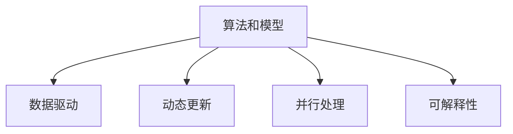

                 

# 数字化思维：AI如何影响人类认知模式

> 关键词：数字化思维,人工智能,认知模式,认知科学,深度学习,神经网络

## 1. 背景介绍

### 1.1 问题由来
随着人工智能技术的飞速发展，数字化思维已经深刻地影响到了人类的认知模式。这一变化不仅仅体现在我们处理信息和决策的方式上，更在于我们思考和解决问题的方式正在悄然发生变化。AI和深度学习技术的普及，让人们开始更加依赖于算法和模型来处理复杂任务，而不是依赖于人类直觉和经验。

### 1.2 问题核心关键点
这一变革的核心关键点在于：
1. **算法依赖**：人类越来越依赖算法和模型来做出决策，而不是依赖直觉和经验。
2. **数据驱动**：决策和思考越来越多地基于数据和模型，而非个人经验和知识。
3. **动态更新**：AI模型能够根据新数据进行动态更新和调整，具有更强的适应性和灵活性。
4. **并行处理**：多任务处理和并行计算让思维模式变得更加快速和高效。
5. **可解释性不足**：AI模型的决策过程往往是"黑盒"的，缺乏可解释性，难以理解和调试。

### 1.3 问题研究意义
研究数字化思维对人类认知模式的影响，对于理解未来AI技术的社会影响、推动技术进步、优化人类认知能力具有重要意义：

1. **理解AI社会影响**：数字化思维将如何影响教育、就业、伦理道德等方面，需要深入探讨。
2. **推动技术进步**：如何更好地利用数字化思维的优点，提升AI模型性能和可解释性。
3. **优化认知能力**：如何将数字化思维融入人类认知过程，提升人类决策和思考的准确性和效率。
4. **保障技术安全**：如何防范数字化思维带来的风险，如算法偏见、数据隐私等问题。

## 2. 核心概念与联系

### 2.1 核心概念概述

数字化思维的本质是利用算法和模型来处理信息和决策，其核心概念包括：

- **算法和模型**：通过数学和统计方法构建的决策规则，用于处理复杂问题。
- **数据驱动**：基于数据而非个人经验进行决策和思考。
- **动态更新**：模型能够根据新数据进行动态调整，适应环境变化。
- **并行处理**：利用多任务处理和并行计算提升思维效率。
- **可解释性**：模型决策过程透明，便于理解和调试。

这些概念之间的逻辑关系可以通过以下Mermaid流程图来展示：



这个流程图展示了大数字化思维的核心概念及其之间的关系：

1. 算法和模型是数字化思维的基础，用于处理复杂任务。
2. 数据驱动是算法的基础，提供决策依据。
3. 动态更新让模型能够不断适应新环境。
4. 并行处理提升思维效率。
5. 可解释性保证决策过程透明，便于理解和调试。

## 3. 核心算法原理 & 具体操作步骤
### 3.1 算法原理概述

数字化思维的核心算法原理包括：

- **监督学习**：利用标注数据训练模型，使其能够预测新数据。
- **无监督学习**：利用未标注数据发现数据的内在结构。
- **强化学习**：通过与环境的交互，使模型学习最优策略。
- **深度学习**：利用多层神经网络进行复杂模式识别。

### 3.2 算法步骤详解

以监督学习为例，数字化思维的应用步骤包括：

1. **数据准备**：收集和预处理数据集，确保数据质量和标注信息完整。
2. **模型选择**：选择合适的算法和模型，如决策树、支持向量机、神经网络等。
3. **模型训练**：利用标注数据训练模型，调整模型参数，使其能够泛化到新数据。
4. **模型评估**：在验证集上评估模型性能，选择合适的超参数和模型结构。
5. **模型应用**：将训练好的模型应用于实际问题，进行预测和决策。

### 3.3 算法优缺点

数字化思维的核心算法具有以下优点：

- **高效性**：能够快速处理大量数据，提升决策效率。
- **可解释性**：模型决策过程透明，便于理解和调试。
- **适应性**：模型能够根据新数据进行动态更新，适应环境变化。

同时，这些算法也存在一定的局限性：

- **数据依赖**：依赖于高质量的标注数据，数据不足可能导致性能下降。
- **复杂性**：模型构建和训练过程复杂，需要专业知识。
- **过拟合风险**：在数据量不足的情况下，模型可能过拟合训练数据，泛化能力不足。

### 3.4 算法应用领域

数字化思维的应用领域广泛，包括但不限于：

- **金融风险评估**：利用算法分析金融市场数据，进行风险预测和投资决策。
- **医疗诊断**：通过图像识别和数据分析，辅助医生进行疾病诊断和治疗。
- **自然语言处理**：利用自然语言处理算法，实现文本分类、情感分析等任务。
- **智能推荐系统**：利用用户行为数据，进行个性化推荐。
- **自动驾驶**：利用传感器和算法，实现车辆自主导航和决策。

## 4. 数学模型和公式 & 详细讲解 & 举例说明

### 4.1 数学模型构建

以线性回归模型为例，构建数学模型：

- **输入数据**：$x_1, x_2, ..., x_n$
- **输出数据**：$y$
- **模型**：$y = \theta_0 + \theta_1 x_1 + \theta_2 x_2 + ... + \theta_n x_n$

### 4.2 公式推导过程

根据最小二乘法，目标是最小化误差平方和：

$$
\sum_{i=1}^n (y_i - \hat{y}_i)^2
$$

其中 $\hat{y}_i = \theta_0 + \theta_1 x_{i1} + \theta_2 x_{i2} + ... + \theta_n x_{in}$。

最小化误差平方和的过程可以通过梯度下降算法实现：

$$
\theta_j = \theta_j - \eta \frac{\partial}{\partial \theta_j} \sum_{i=1}^n (y_i - \hat{y}_i)^2
$$

其中 $\eta$ 为学习率，控制参数更新的速度。

### 4.3 案例分析与讲解

以房价预测为例，利用线性回归模型进行预测：

- **数据准备**：收集历史房价数据，包含房屋面积、地理位置、建筑年代等信息。
- **模型选择**：选择线性回归模型。
- **模型训练**：利用历史数据训练模型，得到参数 $\theta_0, \theta_1, \theta_2, ...$
- **模型评估**：在验证集上评估模型性能，计算均方误差。
- **模型应用**：利用训练好的模型，对新房屋的房价进行预测。

## 5. 项目实践：代码实例和详细解释说明

### 5.1 开发环境搭建

以下是使用Python进行Scikit-learn开发的环境配置流程：

1. 安装Anaconda：从官网下载并安装Anaconda，用于创建独立的Python环境。

2. 创建并激活虚拟环境：
```bash
conda create -n scikit-learn-env python=3.8 
conda activate scikit-learn-env
```

3. 安装Scikit-learn：
```bash
conda install scikit-learn
```

4. 安装各类工具包：
```bash
pip install numpy pandas scikit-learn matplotlib tqdm jupyter notebook ipython
```

完成上述步骤后，即可在`scikit-learn-env`环境中开始项目实践。

### 5.2 源代码详细实现

下面以线性回归模型为例，给出Scikit-learn库中模型的实现：

```python
from sklearn.linear_model import LinearRegression
from sklearn.model_selection import train_test_split
from sklearn.metrics import mean_squared_error
import numpy as np

# 准备数据
X = np.array([[1, 2, 3], [4, 5, 6], [7, 8, 9]])
y = np.array([1, 3, 5])

# 划分数据集
X_train, X_test, y_train, y_test = train_test_split(X, y, test_size=0.2, random_state=42)

# 创建模型
model = LinearRegression()

# 训练模型
model.fit(X_train, y_train)

# 预测
y_pred = model.predict(X_test)

# 评估
mse = mean_squared_error(y_test, y_pred)
print(f"Mean Squared Error: {mse}")
```

### 5.3 代码解读与分析

让我们再详细解读一下关键代码的实现细节：

**数据准备**：
- `X`和`y`变量分别表示特征和标签，其中`X`是一个二维数组，`y`是一个一维数组。

**模型创建**：
- 使用`LinearRegression`类创建线性回归模型对象。

**数据划分**：
- 使用`train_test_split`函数将数据集划分为训练集和测试集，`test_size`参数指定测试集大小，`random_state`参数确保结果可复现。

**模型训练**：
- 调用`fit`方法，使用训练集数据训练模型，得到参数。

**模型应用**：
- 调用`predict`方法，对测试集进行预测，得到预测值。

**模型评估**：
- 计算均方误差，使用`mean_squared_error`函数计算预测值与真实值之间的误差。

可以看到，Scikit-learn库提供了简单易用的API，方便进行模型构建、训练和评估。开发者可以利用这些API，快速实现各种机器学习模型，进行数据处理和特征工程。

## 6. 实际应用场景

### 6.1 金融风控系统

数字化思维在金融风控系统中的应用，主要体现在风险评估和信用评分方面。金融机构可以利用算法分析客户的信用记录、交易行为等数据，进行风险预测和信用评分，从而降低贷款风险。

**具体流程**：
1. **数据收集**：收集客户的信用记录、交易数据、社交媒体信息等。
2. **特征提取**：提取有意义的特征，如信用历史、还款记录、收入水平等。
3. **模型训练**：利用历史数据训练模型，如逻辑回归、决策树等。
4. **风险评估**：对新客户进行风险评估，计算信用评分。
5. **决策支持**：根据模型输出，决定是否批准贷款申请，并制定相应的风险控制措施。

### 6.2 医疗影像分析

数字化思维在医疗影像分析中的应用，主要体现在疾病诊断和辅助治疗方面。利用算法对医学影像进行分析和识别，可以辅助医生进行疾病诊断和治疗决策。

**具体流程**：
1. **数据准备**：收集医学影像数据，如CT、MRI、X光等。
2. **预处理**：对影像数据进行去噪、增强、分割等预处理。
3. **模型训练**：利用医学影像数据训练模型，如卷积神经网络(CNN)。
4. **疾病诊断**：对新影像数据进行分类，识别出病变区域。
5. **治疗建议**：根据诊断结果，提供相应的治疗建议和方案。

### 6.3 智能客服系统

数字化思维在智能客服系统中的应用，主要体现在自动回复和客户服务优化方面。利用算法分析客户历史对话记录，构建知识图谱，实现智能自动回复和客户服务优化。

**具体流程**：
1. **数据收集**：收集客户历史对话记录。
2. **知识图谱构建**：提取对话中的实体、关系和事件，构建知识图谱。
3. **模型训练**：利用对话数据训练模型，如Seq2Seq模型、Transformer模型。
4. **自动回复**：根据客户问题，自动生成回答。
5. **服务优化**：通过监控和分析，优化客户服务流程。

## 7. 工具和资源推荐

### 7.1 学习资源推荐

为了帮助开发者系统掌握数字化思维的理论基础和实践技巧，这里推荐一些优质的学习资源：

1. **《机器学习》书籍**：由Tom Mitchell所著，深入浅出地介绍了机器学习的基本概念和算法，是入门必读书籍。
2. **《深度学习》书籍**：由Ian Goodfellow、Yoshua Bengio、Aaron Courville所著，全面系统地介绍了深度学习的原理和应用。
3. **Coursera和Udacity课程**：由斯坦福大学、Coursera和Udacity等机构提供的机器学习、深度学习和自然语言处理课程，提供丰富的理论知识和实践案例。
4. **GitHub项目**：GitHub上有大量优秀的机器学习和深度学习项目，可以学习项目实现，获取实际经验。
5. **Kaggle竞赛**：Kaggle是一个数据科学竞赛平台，提供丰富的数据集和挑战，可以锻炼实际应用能力。

通过对这些资源的学习实践，相信你一定能够快速掌握数字化思维的核心技术，并应用于解决实际问题。

### 7.2 开发工具推荐

高效的开发离不开优秀的工具支持。以下是几款用于数字化思维开发的常用工具：

1. **Jupyter Notebook**：基于Web的交互式开发环境，方便进行数据探索、模型构建和结果展示。
2. **TensorFlow和PyTorch**：主流的深度学习框架，提供了丰富的API和优化工具，适合大规模模型训练和推理。
3. **Scikit-learn和XGBoost**：优秀的机器学习库，提供了简单易用的API和高效的算法实现。
4. **Anaconda和Conda**：强大的虚拟环境管理工具，方便进行Python开发环境的搭建和维护。
5. **Git和GitHub**：版本控制工具，方便进行代码管理和共享。

合理利用这些工具，可以显著提升数字化思维任务的开发效率，加快创新迭代的步伐。

### 7.3 相关论文推荐

数字化思维的研究源于学界的持续研究。以下是几篇奠基性的相关论文，推荐阅读：

1. **《深度学习》书籍**：深度学习领域的重要著作，介绍了深度学习的原理和应用。
2. **《机器学习》书籍**：机器学习领域的重要著作，介绍了机器学习的基本概念和算法。
3. **《自然语言处理综论》书籍**：自然语言处理领域的重要著作，介绍了自然语言处理的基本概念和算法。
4. **《机器学习》课程**：斯坦福大学开设的机器学习课程，由Andrew Ng主讲，提供了丰富的理论知识和实践案例。
5. **《深度学习》课程**：Coursera提供的深度学习课程，由Ian Goodfellow和Yoshua Bengio主讲，深入浅出地介绍了深度学习的原理和应用。

这些论文代表了大数字化思维的研究进展，通过学习这些前沿成果，可以帮助研究者把握学科前进方向，激发更多的创新灵感。

## 8. 总结：未来发展趋势与挑战

### 8.1 总结

本文对数字化思维的核心算法和实践方法进行了全面系统的介绍。首先阐述了数字化思维的本质和应用场景，明确了算法和模型在处理信息和决策中的重要性。其次，从原理到实践，详细讲解了监督学习、无监督学习、强化学习和深度学习的数学原理和具体步骤，给出了模型构建、训练和评估的完整代码实例。同时，本文还探讨了数字化思维在金融风控、医疗影像、智能客服等实际应用场景中的应用，展示了数字化思维的广泛应用前景。此外，本文精选了数字化思维的各类学习资源，力求为读者提供全方位的技术指引。

通过本文的系统梳理，可以看到，数字化思维已经成为处理复杂任务的重要工具，其应用范围和影响正日益扩大。数字化思维不仅改变了人类处理信息的方式，更在推动技术进步和社会变革中发挥着重要作用。未来，随着AI技术的进一步发展，数字化思维将更加深入地融入人类认知过程，推动社会向更加智能化的方向发展。

### 8.2 未来发展趋势

展望未来，数字化思维将呈现以下几个发展趋势：

1. **自动化程度提高**：数字化思维将在更多领域实现自动化，减少人工干预，提升效率。
2. **数据驱动决策**：数字化思维将更加依赖于数据和模型进行决策，提高决策的准确性和可靠性。
3. **跨领域融合**：数字化思维将与其他技术进行深度融合，如知识图谱、自然语言处理、计算机视觉等，实现更全面的认知功能。
4. **人机协作**：数字化思维将与人类协作，发挥各自优势，提升整体决策能力。
5. **伦理道德规范**：数字化思维的应用将更加注重伦理道德，避免算法偏见和数据隐私等问题。

这些趋势凸显了数字化思维的广阔前景，将推动人类社会向更加智能化和高效化的方向发展。

### 8.3 面临的挑战

尽管数字化思维已经取得了显著进展，但在迈向更加智能化、普适化应用的过程中，仍面临诸多挑战：

1. **数据质量问题**：数据质量不足可能导致模型性能下降，需要更多的数据清洗和预处理工作。
2. **模型复杂性**：大规模模型训练和推理需要大量的计算资源，硬件瓶颈制约了数字化思维的应用。
3. **可解释性不足**：模型决策过程缺乏可解释性，难以理解和调试，需要更多的研究和实践。
4. **伦理道德问题**：数字化思维的应用可能带来算法偏见、数据隐私等问题，需要更多的伦理规范和法律保护。
5. **技术壁垒**：数字化思维涉及复杂的技术实现，需要较高的技术门槛，需要更多的教育和培训。

### 8.4 研究展望

面对数字化思维面临的挑战，未来的研究需要在以下几个方面寻求新的突破：

1. **数据质量提升**：开发更好的数据清洗和预处理方法，提高数据质量。
2. **模型优化**：研究更高效的模型实现方法，降低计算资源消耗。
3. **可解释性增强**：研究更可解释的算法和模型，提升模型透明度。
4. **伦理道德保障**：制定数字化思维应用的伦理规范，保障数据隐私和公平性。
5. **技术普及**：推广数字化思维教育，提高公众的技术素养。

这些研究方向的探索，将引领数字化思维技术迈向更高的台阶，为构建智能、公正、透明的技术系统铺平道路。面向未来，数字化思维将与其他人工智能技术进行更深入的融合，共同推动自然语言理解和智能交互系统的进步，实现更加智能化的未来。

## 9. 附录：常见问题与解答

**Q1：数字化思维是否适用于所有领域？**

A: 数字化思维适用于绝大多数领域，但具体应用时需要根据领域特点进行适当的调整和优化。

**Q2：如何提高数据质量？**

A: 数据质量是数字化思维的重要基础，提高数据质量的方法包括：数据清洗、数据增强、数据标注等。

**Q3：如何提高模型可解释性？**

A: 提高模型可解释性的方法包括：可视化输出、解释模型决策过程、引入可解释算法等。

**Q4：如何防范数字化思维的伦理道德风险？**

A: 防范数字化思维伦理道德风险的方法包括：制定伦理规范、数据隐私保护、算法公平性等。

**Q5：如何推广数字化思维教育？**

A: 推广数字化思维教育的方法包括：开设相关课程、提供在线培训、举办技术讲座等。

---

作者：禅与计算机程序设计艺术 / Zen and the Art of Computer Programming

