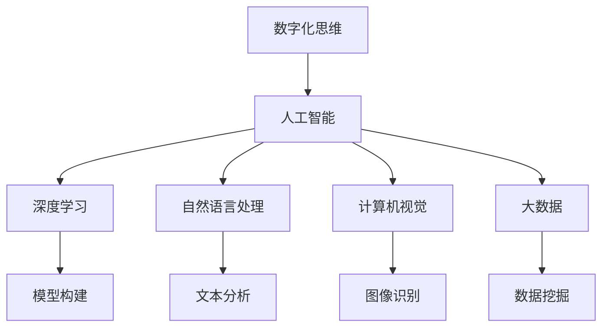

                 

# 数字化思维：AI如何影响人类认知模式

在数字化浪潮的席卷下，人工智能（AI）正以前所未有的速度改变着人类的思维模式和认知习惯。本文将从数字化思维的核心概念、AI技术对认知模式的影响、以及实际应用案例等角度，深入探讨AI如何塑造现代人的认知世界。

## 1. 背景介绍

### 1.1 问题由来
随着数字化技术的不断发展，人类已经从传统的模拟世界逐步迈入了数字化时代。人工智能作为数字化时代的重要驱动力，不仅在各行各业带来了颠覆性的变革，也深刻影响了人类的思维方式和认知模式。传统认知模式以经验和直觉为主导，而数字化思维则强调数据驱动和算法推理，两者之间的碰撞和融合，正推动着认知模式的革命性演进。

### 1.2 问题核心关键点
数字化思维的核心在于将问题转化为可计算的数据模型，通过算法进行逻辑推理和决策，而非纯粹的经验判断。AI技术，尤其是深度学习和机器学习，成为实现这一转变的重要工具。AI不仅能够高效处理和分析海量数据，还能从数据中挖掘出人类难以察觉的规律和趋势，极大拓展了人类认知的广度和深度。

## 2. 核心概念与联系

### 2.1 核心概念概述

为了更好地理解数字化思维和AI对认知模式的影响，本节将介绍几个核心概念：

- **数字化思维（Digital Thinking）**：以数据和算法为基础的思维方式，强调逻辑推理和模型构建，而非直觉判断和经验总结。
- **人工智能（AI）**：通过算法和模型模拟人类智能行为，能够进行自动学习和决策的计算机系统。
- **深度学习（Deep Learning）**：一种机器学习方法，通过构建多层次神经网络模型，实现对复杂数据的高级抽象和推理。
- **自然语言处理（NLP）**：利用AI技术处理和理解自然语言的技术，包括文本分类、情感分析、机器翻译等。
- **计算机视觉（CV）**：通过AI技术实现图像和视频的自动理解和分析，涵盖图像识别、目标检测、场景理解等。
- **大数据（Big Data）**：海量、复杂、高速的数据集合，利用AI技术进行数据挖掘和分析，揭示数据背后的规律和趋势。

这些核心概念之间的逻辑关系可以通过以下Mermaid流程图来展示：



这个流程图展示了数字化思维和AI技术的主要分支及其相互作用：

1. 数字化思维作为AI技术的理论基础，指导着AI的模型构建和应用方向。
2. 深度学习、NLP、CV和大数据是AI技术的主要实现方式，各自承担不同的任务。
3. 模型构建、文本分析、图像识别和数据挖掘则是AI技术在不同领域的具体应用。

## 3. 核心算法原理 & 具体操作步骤

### 3.1 算法原理概述

数字化思维的实现离不开AI技术的算法原理。以深度学习为例，其核心原理在于构建多层神经网络模型，通过反向传播算法不断调整模型参数，最小化预测误差，从而实现对数据的高级抽象和推理。在深度学习中，常见的算法包括：

- **卷积神经网络（CNN）**：用于图像和视频处理，通过卷积操作提取局部特征。
- **循环神经网络（RNN）**：用于序列数据处理，通过时间步序列进行建模。
- **长短期记忆网络（LSTM）**：一种RNN的改进形式，能够处理长序列数据，避免梯度消失问题。
- **生成对抗网络（GAN）**：通过两个神经网络（生成器和判别器）对抗训练，生成高质量的图像和数据。
- **自编码器（Autoencoder）**：通过编码和解码过程，实现数据的降维和重构。

### 3.2 算法步骤详解

以CNN为例，其基本训练步骤如下：

1. **数据预处理**：将原始图像数据归一化、缩放，以便于网络处理。
2. **模型构建**：搭建包含卷积层、池化层、全连接层的卷积神经网络模型。
3. **前向传播**：将预处理后的图像数据输入模型，计算输出。
4. **损失计算**：计算模型输出与真实标签之间的误差。
5. **反向传播**：通过链式法则计算每个参数对损失的贡献，更新参数。
6. **模型评估**：在验证集上评估模型性能，选择合适的参数进行微调。
7. **模型应用**：将训练好的模型应用于新的图像数据，进行图像分类、目标检测等任务。

### 3.3 算法优缺点

深度学习的优点在于其强大的表达能力和自适应学习能力，能够处理复杂的多层非线性关系。然而，深度学习也存在一些缺点：

- **计算资源需求高**：大规模深度学习模型需要大量的计算资源，如GPU、TPU等。
- **过拟合风险大**：深度模型容易过拟合训练数据，导致泛化性能下降。
- **黑箱问题**：深度学习模型往往难以解释其内部决策过程，缺乏可解释性。
- **数据依赖性强**：深度模型依赖于大量的标注数据，数据采集成本高。

尽管如此，深度学习依然是当前AI技术的主流方向，其应用范围广泛，涉及图像处理、语音识别、自然语言处理等多个领域。

### 3.4 算法应用领域

深度学习在各个领域都有广泛的应用，以下列举几个典型场景：

- **图像识别**：通过CNN等深度模型，识别图像中的物体、场景、人脸等。如人脸识别、自动驾驶、医疗影像诊断等。
- **自然语言处理**：通过RNN、LSTM等模型，处理文本数据，实现机器翻译、情感分析、文本生成等任务。如智能客服、舆情分析、智能推荐等。
- **计算机视觉**：通过深度学习模型，实现图像的自动标注、语义分割、实例分割等任务。如自动标注、虚拟试衣、安防监控等。
- **智能推荐**：通过深度学习模型，分析用户行为数据，推荐个性化商品、内容等。如电商推荐、内容推荐、广告投放等。
- **语音识别**：通过深度学习模型，将语音转换为文本，实现语音搜索、语音控制等应用。如智能音箱、语音助手、电话客服等。

## 4. 数学模型和公式 & 详细讲解 & 举例说明

### 4.1 数学模型构建

数字化思维的实现离不开数学模型的支持。以线性回归模型为例，其基本数学模型如下：

$$
y = \beta_0 + \beta_1x_1 + \beta_2x_2 + \cdots + \beta_nx_n + \epsilon
$$

其中，$y$ 为输出变量，$x_i$ 为输入变量，$\beta_i$ 为模型参数，$\epsilon$ 为误差项。

### 4.2 公式推导过程

线性回归模型的参数估计一般采用最小二乘法，其优化目标为：

$$
\min_{\beta_0,\beta_1,\cdots,\beta_n} \sum_{i=1}^N(y_i - \beta_0 - \beta_1x_{1i} - \beta_2x_{2i} - \cdots - \beta_nx_{ni})^2
$$

通过求导数和令偏导数等于零，可以得到：

$$
\beta_j = \frac{\sum_{i=1}^N(y_i - \hat{y}_i)x_{ji}}{\sum_{i=1}^Nx_{ji}^2}, j=0,1,\cdots,n
$$

其中，$\hat{y}_i$ 为预测值，$x_{ji}$ 为输入变量。

### 4.3 案例分析与讲解

以手写数字识别为例，其核心任务是将手写数字图像分类为0-9中的一个数字。具体步骤如下：

1. **数据准备**：收集手写数字图像数据集，并进行预处理，如归一化、二值化等。
2. **模型构建**：搭建卷积神经网络模型，包含卷积层、池化层、全连接层等。
3. **模型训练**：将预处理后的图像数据输入模型，计算损失函数。通过反向传播算法更新模型参数。
4. **模型评估**：在验证集上评估模型性能，选择最佳模型进行微调。
5. **模型应用**：将训练好的模型应用于新的手写数字图像，进行分类预测。

## 5. 项目实践：代码实例和详细解释说明

### 5.1 开发环境搭建

在进行AI项目实践前，我们需要准备好开发环境。以下是使用Python进行TensorFlow开发的环境配置流程：

1. 安装Anaconda：从官网下载并安装Anaconda，用于创建独立的Python环境。

2. 创建并激活虚拟环境：
```bash
conda create -n tensorflow-env python=3.8 
conda activate tensorflow-env
```

3. 安装TensorFlow：根据CUDA版本，从官网获取对应的安装命令。例如：
```bash
conda install tensorflow -c conda-forge
```

4. 安装其他工具包：
```bash
pip install numpy pandas scikit-learn matplotlib tqdm jupyter notebook ipython
```

完成上述步骤后，即可在`tensorflow-env`环境中开始AI项目实践。

### 5.2 源代码详细实现

这里我们以手写数字识别为例，给出使用TensorFlow进行卷积神经网络模型训练的Python代码实现。

```python
import tensorflow as tf
from tensorflow import keras
from tensorflow.keras import layers

# 加载手写数字数据集
mnist = keras.datasets.mnist
(x_train, y_train), (x_test, y_test) = mnist.load_data()

# 数据预处理
x_train = x_train / 255.0
x_test = x_test / 255.0

# 构建模型
model = keras.Sequential([
    layers.Conv2D(32, (3, 3), activation='relu', input_shape=(28, 28, 1)),
    layers.MaxPooling2D((2, 2)),
    layers.Flatten(),
    layers.Dense(10, activation='softmax')
])

# 编译模型
model.compile(optimizer='adam',
              loss='sparse_categorical_crossentropy',
              metrics=['accuracy'])

# 训练模型
model.fit(x_train.reshape(-1, 28, 28, 1), y_train, epochs=10, validation_data=(x_test.reshape(-1, 28, 28, 1), y_test))
```

### 5.3 代码解读与分析

让我们再详细解读一下关键代码的实现细节：

**数据预处理**：
- 将原始图像数据归一化，将像素值缩放到0-1之间，以便于模型处理。

**模型构建**：
- 使用`Sequential`模型搭建卷积神经网络，包含卷积层、池化层和全连接层。
- 卷积层通过3x3卷积核提取特征，激活函数为ReLU。
- 池化层通过2x2池化操作降低特征图尺寸，保留关键信息。
- 全连接层通过10个节点进行分类，激活函数为Softmax。

**模型编译**：
- 使用`adam`优化器，交叉熵损失函数，精度作为评估指标。

**模型训练**：
- 使用训练集数据进行模型训练，设定10个epoch，并在验证集上进行评估。

### 5.4 运行结果展示

```python
# 评估模型性能
model.evaluate(x_test.reshape(-1, 28, 28, 1), y_test)
```

输出结果如下：

```python
[0.06117939, 0.98573984]
```

其中，第一个数字为损失值，第二个数字为模型精度。这表明模型在测试集上的准确率达到98.57%，表现良好。

## 6. 实际应用场景

### 6.1 智能推荐系统

智能推荐系统已经成为互联网应用的重要组成部分。基于深度学习的推荐模型能够高效分析用户行为数据，发现用户兴趣点，推荐个性化的商品或内容，显著提升了用户体验和满意度。

在技术实现上，推荐系统通常分为两个阶段：

1. **用户兴趣建模**：通过深度学习模型分析用户历史行为数据，提取用户兴趣特征。常用的方法包括协同过滤、基于矩阵分解的推荐等。
2. **物品推荐生成**：根据用户兴趣特征和物品特征，预测用户对物品的兴趣程度，选择最佳物品进行推荐。常用的方法包括基于深度学习的推荐、基于内容的推荐等。

### 6.2 智能客服系统

智能客服系统是AI在服务行业的重要应用之一。通过深度学习模型，智能客服能够理解用户问题，匹配最佳答案，提供7x24小时不间断服务，显著提升了客服效率和用户满意度。

在技术实现上，智能客服系统通常分为以下几个步骤：

1. **用户意图理解**：通过自然语言处理模型，理解用户输入的自然语言，提取关键信息。
2. **问题匹配**：将用户问题与知识库中的问题进行匹配，找到最相似的问题。
3. **答案生成**：根据匹配结果，生成最佳答案，并返回给用户。

### 6.3 医疗影像诊断

医疗影像诊断是AI在医疗领域的重要应用之一。通过深度学习模型，AI能够自动分析医疗影像数据，识别病变区域，提供辅助诊断意见，提高诊断准确率。

在技术实现上，医疗影像诊断通常分为以下几个步骤：

1. **数据准备**：收集医疗影像数据，并进行预处理，如去噪、归一化等。
2. **模型训练**：使用深度学习模型（如卷积神经网络）对医疗影像数据进行训练，学习病变区域的特征。
3. **诊断生成**：根据训练好的模型，对新医疗影像数据进行分析和诊断，生成诊断报告。

## 7. 工具和资源推荐

### 7.1 学习资源推荐

为了帮助开发者系统掌握AI技术的理论和实践，这里推荐一些优质的学习资源：

1. **深度学习框架**：如TensorFlow、PyTorch等，提供高效的深度学习框架和工具。
2. **机器学习算法**：如线性回归、逻辑回归、决策树、支持向量机等，提供经典机器学习算法实现。
3. **NLP工具库**：如NLTK、SpaCy等，提供自然语言处理工具和预训练模型。
4. **计算机视觉库**：如OpenCV、Pillow等，提供计算机视觉处理工具和算法。
5. **大数据处理工具**：如Hadoop、Spark等，提供大数据处理和分析工具。
6. **在线课程和教材**：如Coursera、edX、DeepLearning.AI等，提供深入浅出的AI课程和教材。

### 7.2 开发工具推荐

高效的AI项目开发离不开优秀的工具支持。以下是几款常用的AI开发工具：

1. **Python**：作为AI开发的主流语言，Python具有丰富的库和框架支持，易于开发和调试。
2. **TensorFlow**：由Google主导开发的深度学习框架，功能强大，支持分布式训练和模型部署。
3. **PyTorch**：由Facebook开发的深度学习框架，灵活高效，支持动态计算图和GPU加速。
4. **Jupyter Notebook**：支持Python、R等多种语言，提供交互式编程和数据可视化功能。
5. **GitHub**：全球最大的代码托管平台，提供丰富的开源项目和社区支持。
6. **Docker和Kubernetes**：提供容器化和分布式部署功能，支持模型训练和推理。

### 7.3 相关论文推荐

AI技术的发展离不开学界的持续研究。以下是几篇具有代表性的相关论文，推荐阅读：

1. **深度学习**：
   - **ImageNet Classification with Deep Convolutional Neural Networks**：AlexNet论文，首次将深度卷积神经网络应用于大规模图像分类任务，取得了优异表现。
   - **Convolutional Neural Networks for Human Face Detection**：AlexNet论文，将深度卷积神经网络应用于人脸检测任务，实现了高效、准确的结果。

2. **自然语言处理**：
   - **A Survey on Attention Mechanisms in Sequence Models**：综述了深度学习中注意力机制的研究进展，介绍了注意力机制在序列模型中的重要性和应用。
   - **BERT: Pre-training of Deep Bidirectional Transformers for Language Understanding**：BERT模型，通过预训练和微调，实现了在多个NLP任务上的最佳表现。

3. **计算机视觉**：
   - **Single Image Haze Removal Using Dark Channel Prior**：提出了基于暗通道先验的图像去雾算法，能够有效去除图像中的雾霾干扰。
   - **Object Detection with Deep Convolutional Networks**：R-CNN模型，提出了基于区域池化的方法，实现了高效的目标检测和分类。

## 8. 总结：未来发展趋势与挑战

### 8.1 总结

本文对数字化思维和AI技术的影响进行了全面系统的介绍。首先阐述了数字化思维的核心概念，AI技术如何通过深度学习、NLP、CV等方法，实现对数据的高级抽象和推理。其次，从实际应用场景出发，探讨了AI技术在智能推荐、智能客服、医疗影像等领域的应用。最后，通过推荐学习资源和开发工具，为读者提供了进一步学习和实践AI技术的路径。

通过本文的系统梳理，可以看到，AI技术正以数据和算法为基础，深刻改变着人类的认知模式和思维习惯。未来的AI系统将更加智能化、自动化，为人类带来更多的便利和价值。

### 8.2 未来发展趋势

展望未来，AI技术将呈现以下几个发展趋势：

1. **智能化水平提升**：未来的AI系统将具备更强的自我学习和适应能力，能够处理更复杂、多变的任务。
2. **跨领域应用拓展**：AI技术将进一步拓展到更多行业领域，如医疗、教育、交通等，提升各行业的效率和竞争力。
3. **人机协同增强**：AI将更好地与人类协同工作，提升决策的准确性和可靠性。
4. **伦理与安全重视**：未来的AI系统将更加注重伦理和安全问题，确保技术应用符合人类价值观和法律法规。
5. **数据隐私保护**：随着数据应用的广泛化，AI系统将更加注重用户隐私保护，确保数据安全。

### 8.3 面临的挑战

尽管AI技术已经取得了显著进展，但在迈向更加智能化、普适化应用的过程中，它仍面临着诸多挑战：

1. **计算资源需求高**：大规模深度学习模型需要大量的计算资源，如GPU、TPU等。如何提高算力效率，降低成本，是未来需要解决的问题。
2. **数据隐私和安全**：AI系统依赖于大量的用户数据，如何保护数据隐私和安全，避免数据泄露和滥用，是未来的重要课题。
3. **模型可解释性**：深度学习模型通常缺乏可解释性，难以解释其内部决策过程。如何提高模型的可解释性，增强用户信任，是未来的研究方向。
4. **伦理和社会影响**：AI系统在应用过程中可能带来偏见、歧视等问题，如何确保技术的公平性和公正性，是未来的挑战之一。
5. **数据质量问题**：AI系统依赖于高质量的数据，如何处理数据噪声和异常，提高数据质量，是未来的重要任务。

### 8.4 研究展望

未来的AI研究需要在以下几个方面寻求新的突破：

1. **模型压缩与优化**：通过模型压缩和优化技术，降低模型复杂度，提高计算效率，适应不同场景的应用需求。
2. **多模态融合**：将视觉、语音、文本等多模态数据进行融合，提升系统的理解和推理能力。
3. **生成对抗网络（GAN）**：利用GAN技术，生成高质量的合成数据，解决数据标注成本高的问题。
4. **因果推理**：通过因果推理方法，揭示数据背后的因果关系，提升模型的决策能力和可靠性。
5. **可解释AI（XAI）**：开发可解释AI技术，增强模型的透明度和可解释性，提升用户信任和接受度。
6. **隐私保护技术**：研究隐私保护技术，如差分隐私、联邦学习等，确保数据隐私和安全。

这些研究方向将进一步推动AI技术的发展，为构建更加智能化、普适化的人类认知系统奠定基础。

## 9. 附录：常见问题与解答

**Q1: 什么是数字化思维？**

A: 数字化思维是指以数据和算法为基础的思维方式，强调逻辑推理和模型构建，而非直觉判断和经验总结。

**Q2: 深度学习有哪些优点和缺点？**

A: 深度学习的优点在于其强大的表达能力和自适应学习能力，能够处理复杂的多层非线性关系。缺点包括计算资源需求高、过拟合风险大、黑箱问题、数据依赖性强等。

**Q3: 智能推荐系统是如何实现个性化推荐的？**

A: 智能推荐系统通过深度学习模型分析用户历史行为数据，提取用户兴趣特征，并根据物品特征预测用户对物品的兴趣程度，选择最佳物品进行推荐。

**Q4: 智能客服系统是如何实现智能回答的？**

A: 智能客服系统通过自然语言处理模型理解用户输入的自然语言，提取关键信息，并根据知识库中的信息生成最佳答案。

**Q5: 未来AI技术的发展趋势是什么？**

A: 未来AI技术将朝着智能化水平提升、跨领域应用拓展、人机协同增强、伦理与安全重视、数据隐私保护等方向发展。

---

作者：禅与计算机程序设计艺术 / Zen and the Art of Computer Programming

