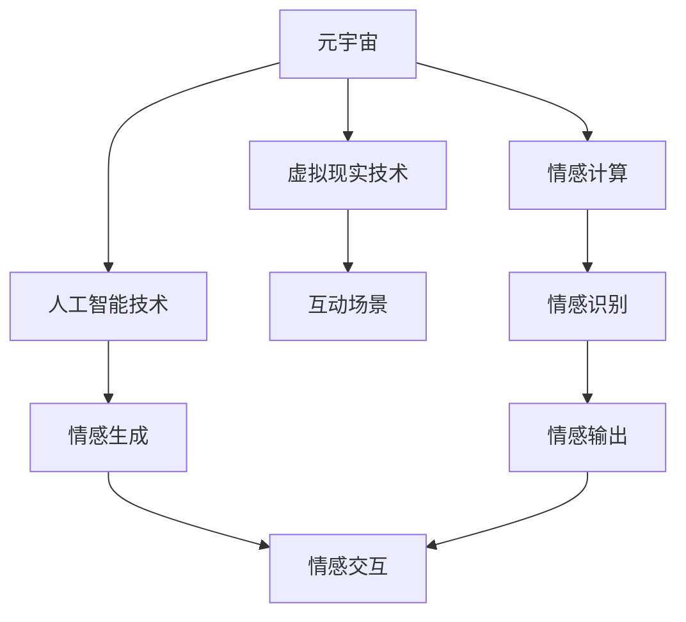

                 

# 数字化情侣:元宇宙中的远程恋爱

## 1. 背景介绍

随着数字技术的迅猛发展，元宇宙（Metaverse）的概念逐渐走入大众视野。作为虚拟现实（VR）和增强现实（AR）技术的进一步扩展，元宇宙构建了一个高度沉浸式、互动性强、连接万物的数字世界，为人类生活提供了全新的空间。在这样一个虚拟的数字空间中，远程恋爱这种传统的恋爱模式被赋予了全新的意义。数字化情侣在这一环境中，通过虚拟世界的互动和陪伴，实现了跨空间、跨时间的爱情维系。本文将探讨数字化情侣在元宇宙中的实现原理、技术架构以及应用前景，并分析其带来的社会影响和潜在挑战。

## 2. 核心概念与联系

### 2.1 核心概念概述

- **元宇宙**：一个由虚拟现实、增强现实、区块链、云计算等多种技术融合而成的虚拟世界，其中包含多个虚拟空间，人们可以在其中进行社交、娱乐、工作等活动。
- **数字化情侣**：指通过人工智能、虚拟现实等技术，构建能够在元宇宙中互动、陪伴的虚拟人物，模拟真实情侣关系。
- **远程恋爱**：指通过数字技术，实现远距离情侣之间的情感交流和陪伴。
- **情感计算**：研究如何通过算法和模型，分析和理解人的情感，以及如何通过机器人、虚拟人物等方式，模拟和传递情感。

这些概念共同构成了数字化情侣在元宇宙中远程恋爱的基础，通过将情感计算与虚拟现实技术相结合，为情侣间的情感互动提供了新的可能。

### 2.2 核心概念原理和架构的 Mermaid 流程图



这个流程图展示了元宇宙、虚拟现实技术、情感计算和人工智能技术之间的关系，以及它们在构建数字化情侣中的作用：

1. 元宇宙作为基础平台，通过虚拟现实技术提供沉浸式的互动场景。
2. 情感计算通过情感识别和生成，实现了情感的模拟和传递。
3. 人工智能技术为情感计算提供模型和算法支持，同时为虚拟人物提供驱动。
4. 情感交互通过虚拟人物在虚拟场景中进行，实现了跨空间、跨时间的情感交流。

## 3. 核心算法原理 & 具体操作步骤

### 3.1 算法原理概述

数字化情侣在元宇宙中的实现，主要依赖于虚拟现实技术、情感计算和人工智能技术的融合。以下是算法原理的概述：

1. **虚拟现实技术**：通过三维建模、虚拟场景渲染、动作捕捉等技术，构建高度沉浸式的虚拟世界。
2. **情感计算**：利用机器学习算法，对用户输入的语音、文字、表情等信息进行情感识别和分析，生成相应的情感回应。
3. **人工智能技术**：通过自然语言处理、语音识别、图像识别等技术，驱动虚拟人物的行为和情感，使其能够自然地与真人进行互动。

### 3.2 算法步骤详解

数字化情侣在元宇宙中的实现步骤分为以下几个环节：

**Step 1: 环境搭建**

- 收集和构建虚拟现实环境，包括虚拟空间、物品、角色模型等。
- 选择适合元宇宙的虚拟现实引擎，如Unity、Unreal Engine等。
- 设置虚拟人物的动作捕捉和骨骼动画，确保其动作流畅自然。

**Step 2: 情感识别与生成**

- 收集和标注情感数据，如语音情感、文字情感、面部表情等。
- 利用机器学习算法，如卷积神经网络（CNN）、循环神经网络（RNN）、长短期记忆网络（LSTM）等，进行情感识别。
- 根据识别结果，使用生成模型如GAN、VAE等，生成虚拟人物的情感回应。

**Step 3: 自然语言处理与情感交互**

- 构建情感对话模型，结合语言模型和情感模型，实现虚拟人物与用户的自然语言交互。
- 利用情感识别结果，调整语言模型输出的情感强度和方向，使其符合用户需求。
- 实现虚拟人物在虚拟世界中的行为和情感表达，通过情感交互保持与用户的互动。

**Step 4: 远程情感交流**

- 使用网络技术，如WebRTC、RTMP等，实现用户与虚拟人物之间的实时通信。
- 通过云计算平台，如AWS、Azure等，提供强大的计算和存储能力，支持大量用户的并发连接。
- 实现情感数据的同步传输，使用户能够实时感受到虚拟人物的情感变化。

### 3.3 算法优缺点

数字化情侣在元宇宙中的应用，有以下优缺点：

**优点**：

- **沉浸式体验**：通过虚拟现实技术，用户可以进入一个高度逼真的虚拟世界，享受沉浸式的互动体验。
- **跨时空交流**：虚拟人物可以不受时间和空间的限制，与用户进行持续的情感交流。
- **灵活性高**：用户可以根据自己的需求和喜好，自由定制虚拟人物的外观和行为。
- **情感共鸣**：虚拟人物通过情感计算模拟情感，能够与用户产生情感共鸣，增强情感连接。

**缺点**：

- **技术门槛高**：实现虚拟现实和情感计算需要较高的技术水平和资源投入。
- **隐私和伦理问题**：虚拟人物的情感数据可能涉及用户隐私，需要严格保护。
- **用户依赖性**：过度依赖虚拟人物可能会削弱用户的社交能力。
- **技术局限性**：目前的虚拟人物在复杂情感识别和生成上还存在局限，难以完全替代真人。

### 3.4 算法应用领域

数字化情侣在元宇宙中的应用领域广泛，包括但不限于以下方面：

- **情感陪伴**：为孤独的老年人、残疾人、孤独症患者等群体提供情感陪伴。
- **远程教育**：通过虚拟情侣，激发学生的情感互动和学习兴趣，提供个性化的学习体验。
- **游戏娱乐**：在虚拟游戏中，通过情感互动提升游戏体验，增强用户粘性。
- **心理健康**：通过情感计算，实时监测和评估用户的心理健康状态，提供情感支持。
- **社交互动**：在社交平台上，通过虚拟情侣，增强用户互动和社交体验。

## 4. 数学模型和公式 & 详细讲解 & 举例说明

### 4.1 数学模型构建

在情感计算中，常用以下数学模型：

- **情感识别模型**：基于卷积神经网络（CNN）、循环神经网络（RNN）、长短期记忆网络（LSTM）等模型，对情感数据进行特征提取和分类。
- **情感生成模型**：基于生成对抗网络（GAN）、变分自编码器（VAE）等模型，生成虚拟人物的情感回应。

### 4.2 公式推导过程

以情感识别模型为例，假设输入为时间序列的语音信号 $x_t$，情感分类结果为 $y_t \in \{1,0\}$（其中1表示正面情感，0表示负面情感）。则情感识别模型的训练目标函数为：

$$
\mathcal{L}(\theta) = \frac{1}{N} \sum_{t=1}^N -y_t \log \hat{y_t} - (1-y_t) \log (1-\hat{y_t})
$$

其中 $\hat{y_t}$ 为模型输出的情感分类结果，$\theta$ 为模型参数。

### 4.3 案例分析与讲解

以一个情感生成模型的案例来说明其具体应用：

假设输入为用户的情感标签 $l \in \{快乐,悲伤,愤怒\}$，输出为虚拟人物的语言回应 $r$。则可以使用以下模型进行训练：

$$
r = \text{G}(l; \omega)
$$

其中 $\text{G}$ 为生成模型，$\omega$ 为模型参数。模型的训练目标函数为：

$$
\mathcal{L}(\omega) = -\sum_{l \in \{快乐,悲伤,愤怒\}} \log \mathbb{P}(r \mid l)
$$

其中 $\mathbb{P}(r \mid l)$ 为生成模型在给定情感标签 $l$ 下的条件概率分布。通过训练，模型可以学习到在不同情感标签下，虚拟人物应如何生成语言回应。

## 5. 项目实践：代码实例和详细解释说明

### 5.1 开发环境搭建

开发环境搭建需要以下步骤：

- 安装虚拟现实引擎，如Unity、Unreal Engine等。
- 设置虚拟现实开发环境，搭建虚拟场景和角色模型。
- 配置网络通信协议，如WebRTC、RTMP等，实现远程通信。
- 选择云服务提供商，如AWS、Azure等，提供计算和存储支持。

### 5.2 源代码详细实现

以下是一个基于Unity3D的数字化情侣实现的代码示例：

```python
# 导入必要的库和模块
import unitypy
from unitypy import UnityClient

# 创建Unity客户端
client = UnityClient("localhost", 5000)

# 创建虚拟角色
def create_character():
    # 创建角色模型和动画
    character = client.scene.AddEntity("Character")
    character.AddComponent(UnityCharacter)
    character.AddComponent(UnityAnimator)

# 创建情感识别模块
def create_emotion_recognition():
    # 加载情感识别模型
    model = unitypy.load_model("emotion_recognition.pkl")
    # 将情感数据输入模型
    emotion = model(input_data)
    # 输出情感分类结果
    print(emotion)

# 创建情感生成模块
def create_emotion_generation():
    # 加载情感生成模型
    model = unitypy.load_model("emotion_generation.pkl")
    # 生成虚拟人物的情感回应
    response = model(input_data)
    # 将情感回应应用到虚拟角色
    character.speak(response)

# 主函数
def main():
    # 创建虚拟角色
    create_character()
    # 设置情感识别和生成模块
    create_emotion_recognition()
    create_emotion_generation()
    # 进入虚拟场景
    client.scene.Play()

# 运行主函数
if __name__ == "__main__":
    main()
```

### 5.3 代码解读与分析

这段代码展示了在Unity3D中创建数字化情侣的流程。首先，创建虚拟角色，并为其设置角色模型和动画。然后，加载情感识别和生成模型，进行情感数据的处理和虚拟人物的情感回应。最后，将虚拟角色置于虚拟场景中，并进行情感交互。

### 5.4 运行结果展示

运行代码后，虚拟角色会在虚拟场景中与用户进行情感交流。用户可以输入语音、文字等情感数据，虚拟角色会根据输入的情感数据，生成相应的情感回应。通过这样的交互，用户可以与虚拟角色进行深层次的情感交流，体验数字化情侣带来的情感陪伴。

## 6. 实际应用场景

数字化情侣在元宇宙中的应用场景丰富多样，以下列出几个典型的应用场景：

### 6.4 未来应用展望

未来，数字化情侣将在元宇宙中发挥更大的作用，其应用场景也将不断扩展和深化。以下是几个可能的未来应用展望：

- **虚拟婚恋**：在元宇宙中，数字化情侣可以完成从相识、相知、相恋到结婚的整个过程，实现虚拟婚礼、虚拟婚房等场景。
- **虚拟健康助手**：为病人提供情感陪伴和心理支持，增强康复效果。
- **虚拟心理咨询师**：在元宇宙中，通过数字化情侣进行心理咨询和情感辅导，帮助用户解决心理问题。
- **虚拟导游**：在虚拟旅游景点中，通过数字化情侣引导用户进行游览，提供个性化的旅游体验。
- **虚拟伴侣**：为单身用户提供情感陪伴和互动，满足用户的情感需求。

## 7. 工具和资源推荐

### 7.1 学习资源推荐

- **《元宇宙原理与技术》**：介绍元宇宙的基本原理和技术架构，适合初学者入门。
- **《虚拟现实编程基础》**：介绍虚拟现实开发的基础知识和技术，适合有一定编程基础的用户学习。
- **《情感计算与人工智能》**：介绍情感计算的基本概念和算法，适合对情感计算感兴趣的用户。
- **《机器学习实战》**：通过实际项目，讲解机器学习的基本流程和技术实现，适合实战练习。

### 7.2 开发工具推荐

- **Unity3D**：强大的虚拟现实开发平台，提供丰富的开发工具和资源。
- **Unreal Engine**：另一款流行的虚拟现实开发平台，提供强大的图形渲染能力和动画系统。
- **WebRTC**：开源的网络通信协议，支持实时音视频传输，适合构建远程情感交流系统。
- **AWS、Azure**：云服务提供商，提供强大的计算和存储能力，支持大规模的虚拟情侣系统部署。

### 7.3 相关论文推荐

- **《虚拟现实技术在情感交互中的应用》**：介绍虚拟现实技术在情感计算中的应用，探讨其优势和挑战。
- **《情感计算在虚拟人物中的应用》**：研究情感计算技术在虚拟人物中的实现，提出新的情感生成方法。
- **《人工智能驱动的情感陪伴机器人》**：介绍情感计算和人工智能技术在情感陪伴机器人的应用，探讨其效果和潜力。

## 8. 总结：未来发展趋势与挑战

### 8.1 研究成果总结

数字化情侣在元宇宙中的应用，通过融合虚拟现实技术、情感计算和人工智能技术，实现了跨空间、跨时间的情感交流。这一技术已经在多个领域取得初步应用，显示出巨大的发展潜力。

### 8.2 未来发展趋势

未来的数字化情侣将在元宇宙中发挥更大的作用，其应用场景也将不断扩展和深化。主要发展趋势包括：

- **技术融合**：随着技术的发展，虚拟现实、情感计算和人工智能将更加紧密地结合，提升数字化情侣的互动体验。
- **个性化定制**：用户可以根据自己的需求和喜好，定制虚拟角色的外观和行为，增强情感互动的个性化。
- **跨平台互通**：不同平台之间的互通，将实现虚拟情侣的跨平台互动，提升用户的粘性。
- **情感分析**：通过更加精细的情感分析，实现对用户情感状态的实时监测和评估，提供更精准的情感支持。

### 8.3 面临的挑战

数字化情侣在元宇宙中的应用，虽然前景广阔，但也面临诸多挑战：

- **技术瓶颈**：当前的虚拟现实和情感计算技术还存在局限，难以满足用户的高要求。
- **伦理问题**：虚拟情侣可能涉及隐私和伦理问题，需要制定相应的法律法规和道德规范。
- **用户接受度**：用户对数字化情侣的接受度不一，需要进一步推广和教育。
- **系统安全性**：数字化情侣系统的安全性需要保障，防止用户数据泄露和系统漏洞攻击。
- **商业模式**：如何构建商业化运营模式，吸引用户和开发者参与，是数字化情侣应用成功的重要因素。

### 8.4 研究展望

未来，数字化情侣将在元宇宙中扮演越来越重要的角色，需要从技术、伦理、商业等多个维度进行深入研究。以下是一些研究展望：

- **情感计算的优化**：通过更加精细的情感识别和生成技术，提升数字化情侣的情感互动质量。
- **多模态情感交互**：结合视觉、听觉、触觉等多种感官，实现更加丰富的情感互动体验。
- **跨领域应用**：探索数字化情侣在教育、医疗、娱乐等更多领域的应用，扩大其应用范围。
- **商业模式创新**：探索数字化情侣的商业化运营模式，如订阅服务、虚拟商品等，实现可持续发展。
- **伦理和安全研究**：建立数字化情侣应用的伦理和安全规范，确保其健康发展。

## 9. 附录：常见问题与解答

### Q1: 数字情侣在元宇宙中如何实现情感识别和生成？

A: 数字情侣在元宇宙中实现情感识别和生成，主要依赖于情感计算技术。通过机器学习算法，如卷积神经网络（CNN）、循环神经网络（RNN）、长短期记忆网络（LSTM）等，对用户输入的语音、文字、表情等信息进行情感识别。然后，使用生成模型如GAN、VAE等，生成虚拟人物的情感回应。具体实现过程中，可以通过搭建情感识别模型和情感生成模型，结合自然语言处理、语音识别、图像识别等技术，驱动虚拟人物的行为和情感，使其能够自然地与真人进行互动。

### Q2: 数字情侣在元宇宙中如何实现跨平台互通？

A: 数字情侣在元宇宙中实现跨平台互通，需要借助网络通信协议，如WebRTC、RTMP等。通过这些协议，可以实现用户与虚拟角色在不同平台之间的实时通信，支持跨平台互动。同时，可以采用云服务提供商，如AWS、Azure等，提供强大的计算和存储能力，支持大规模的虚拟情侣系统部署。通过这样的技术架构，可以实现虚拟情侣在多个平台之间的无缝互通，提升用户的粘性。

### Q3: 数字情侣在元宇宙中如何保护用户隐私和数据安全？

A: 数字情侣在元宇宙中保护用户隐私和数据安全，需要制定相应的法律法规和道德规范，确保用户数据的安全和隐私。具体措施包括：

- **数据加密**：对用户输入的情感数据进行加密处理，防止数据泄露。
- **访问控制**：采用访问鉴权、身份认证等技术，确保只有授权用户才能访问虚拟角色。
- **数据匿名化**：对用户数据进行匿名化处理，保护用户隐私。
- **安全监控**：实时监测系统安全性，设置异常告警阈值，防止系统漏洞攻击。

通过这些措施，可以确保用户数据的安全和隐私，增强用户对数字化情侣系统的信任度。

---

作者：禅与计算机程序设计艺术 / Zen and the Art of Computer Programming

