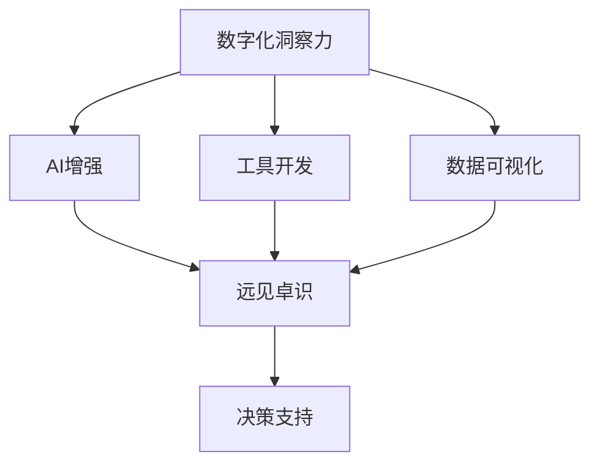

                 

# 数字化洞察力望远镜制造商：AI增强的远见卓识工具开发专家

> 关键词：数字化洞察力，望远镜制造，AI增强，远见卓识，工具开发

## 1. 背景介绍

在数字化时代，企业的决策过程不再仅仅基于历史数据和直觉，而是通过分析海量数据和情境信息，以更为科学的视角进行洞察和决策。这一过程中，洞察力作为企业进行精准决策的关键要素，变得越来越重要。数字化洞察力望远镜，正是在这一背景下应运而生的一种工具，利用AI技术对海量数据进行挖掘和分析，帮助企业实现数据驱动的决策。

### 1.1 问题由来

尽管企业在数字化转型过程中，已经积累了大量的数据，但如何从中提取出有价值的洞察，成为了一个难题。传统的数据分析方法虽然精确，但往往需要耗费大量的人力物力，且分析结果受限于分析师的经验和水平。因此，迫切需要一种更为智能、高效的方法，即数字化洞察力望远镜。

### 1.2 问题核心关键点

数字化洞察力望远镜的构建主要围绕以下几个核心关键点展开：

1. **大规模数据处理能力**：能够处理海量数据，提供及时有效的分析结果。
2. **强大的洞察力引擎**：通过AI技术挖掘数据中的深层信息，生成高价值的洞察。
3. **数据可视化**：将复杂的数据结果以直观的方式展示给决策者，提高决策效率。
4. **可扩展性**：适应不断变化的业务需求，支持新数据源的接入。
5. **鲁棒性和准确性**：能够应对各种异常和噪声，保证分析结果的可靠性和准确性。

### 1.3 问题研究意义

开发数字化洞察力望远镜，对于提升企业决策效率、降低成本、提升竞争力具有重要意义。具体而言：

1. **提升决策效率**：通过智能分析，快速提供决策支持。
2. **降低成本**：减少人工分析和预处理的工作量，提升资源利用率。
3. **提升竞争力**：提供更为精准的市场洞察，优化产品和服务。
4. **促进数据驱动决策**：让数据说话，避免主观偏见影响决策。

## 2. 核心概念与联系

### 2.1 核心概念概述

为了更好地理解数字化洞察力望远镜的构建方法，本节将介绍几个密切相关的核心概念：

- **数字化洞察力**：利用AI技术从海量数据中提取和分析有价值的洞察，辅助决策。
- **AI增强**：通过引入AI技术，提升数据的处理和分析能力。
- **远见卓识**：指通过深度挖掘数据中的模式和趋势，为决策提供前瞻性指导。
- **工具开发**：构建能够自动化处理数据、生成洞察力的软件系统。
- **数据可视化**：将分析结果以直观图表的形式展示，便于理解和决策。

这些核心概念之间的逻辑关系可以通过以下Mermaid流程图来展示：



这个流程图展示了大规模数据洞察力望远镜的核心概念及其之间的关系：

1. 数字化洞察力通过AI增强和工具开发技术，从海量数据中提取有价值的信息。
2. 生成的洞察通过数据可视化技术，以直观形式展示给决策者，从而支持决策。

## 3. 核心算法原理 & 具体操作步骤

### 3.1 算法原理概述

数字化洞察力望远镜的构建，本质上是通过AI技术从大规模数据中提取有价值的洞察，并辅助决策。其主要算法原理包括以下几个方面：

1. **数据预处理**：清洗和标准化数据，去除噪声和异常值，保证数据质量。
2. **特征工程**：构建有意义的特征集，提高分析效果。
3. **深度学习模型**：利用神经网络模型对数据进行自动化的特征提取和模式学习。
4. **时间序列分析**：对时间序列数据进行趋势分析和预测，发现周期性规律。
5. **因果推理**：通过因果推断方法，解析数据间的因果关系，生成更具解释性的洞察。
6. **可视化技术**：将分析结果以图表形式展示，辅助决策。

### 3.2 算法步骤详解

以下是对数字化洞察力望远镜构建的详细步骤讲解：

**Step 1: 数据采集与清洗**

- **数据采集**：收集与业务相关的各类数据源，包括内部数据和外部数据。内部数据如交易记录、客户反馈、内部报告等；外部数据如社交媒体、公开报告、新闻等。
- **数据清洗**：清洗数据，去除重复、缺失和异常值，确保数据质量。

**Step 2: 特征工程与模型训练**

- **特征工程**：构建特征集，包括时间特征、业务特征、地理位置特征等，为模型训练提供有效输入。
- **模型训练**：选择适合的深度学习模型（如CNN、RNN、Transformer等），进行模型训练。使用历史数据训练模型，得到能够提取关键特征和规律的模型参数。

**Step 3: 洞察生成与可视化**

- **洞察生成**：将训练好的模型应用于新数据，生成数据洞察。洞察包括关键指标、趋势变化、异常检测等。
- **数据可视化**：利用图表和仪表盘等工具，将洞察结果以直观形式展示，便于理解和决策。

**Step 4: 应用部署与持续优化**

- **应用部署**：将构建好的数字化洞察力望远镜应用到实际业务场景中，支持决策支持。
- **持续优化**：定期收集反馈，优化算法和模型，提升洞察效果和系统性能。

### 3.3 算法优缺点

数字化洞察力望远镜的构建方法具有以下优点：

1. **高效性**：利用AI技术自动化处理数据，提高了处理效率。
2. **准确性**：深度学习模型能够捕捉数据中的复杂模式，生成高精度的洞察。
3. **可扩展性**：支持新数据源的接入，适应业务变化的动态调整。
4. **前瞻性**：通过时间序列分析和因果推理，生成前瞻性的洞察，辅助决策。

同时，该方法也存在以下局限性：

1. **数据质量依赖**：对数据质量有较高要求，一旦数据有误，洞察效果可能受影响。
2. **模型复杂度**：深度学习模型结构复杂，训练和部署成本较高。
3. **解释性不足**：深度模型缺乏可解释性，生成的洞察可能难以理解。
4. **数据隐私**：处理海量数据涉及数据隐私问题，需确保数据安全和合规性。

### 3.4 算法应用领域

数字化洞察力望远镜在多个领域都有广泛应用，例如：

1. **金融行业**：利用洞察力望远镜进行风险控制、投资策略优化、市场预测等。
2. **零售行业**：用于客户行为分析、库存管理、销售预测等。
3. **医疗行业**：进行疾病趋势分析、患者行为预测、治疗方案优化等。
4. **物流行业**：用于供应链优化、运输路径规划、仓库管理等。
5. **政府行业**：进行政策效果评估、公共安全监测、环境保护等。

此外，数字化洞察力望远镜还广泛应用于智能城市、智慧农业、智能制造等领域，为各行各业提供了强有力的决策支持。

## 4. 数学模型和公式 & 详细讲解 & 举例说明

### 4.1 数学模型构建

假设我们有一组历史交易数据 $\{x_i, y_i\}_{i=1}^N$，其中 $x_i$ 表示交易特征向量，$y_i$ 表示交易结果（如收益）。我们的目标是构建一个能够从特征 $x_i$ 预测结果 $y_i$ 的模型。

定义模型的预测函数为 $f_{\theta}(x)$，其中 $\theta$ 为模型参数。我们的目标是寻找最优的参数 $\theta^*$，使得模型在测试集上的均方误差最小。即：

$$
\theta^* = \mathop{\arg\min}_{\theta} \frac{1}{N} \sum_{i=1}^N (y_i - f_{\theta}(x_i))^2
$$

### 4.2 公式推导过程

为了求解上述优化问题，我们通常使用梯度下降算法。定义损失函数为：

$$
L(\theta) = \frac{1}{N} \sum_{i=1}^N (y_i - f_{\theta}(x_i))^2
$$

损失函数对参数 $\theta$ 的梯度为：

$$
\nabla_{\theta} L(\theta) = \frac{2}{N} \sum_{i=1}^N (y_i - f_{\theta}(x_i)) \nabla_{\theta} f_{\theta}(x_i)
$$

通过梯度下降算法更新参数 $\theta$：

$$
\theta \leftarrow \theta - \eta \nabla_{\theta} L(\theta)
$$

其中 $\eta$ 为学习率。

### 4.3 案例分析与讲解

以一个简单的线性回归为例，考虑以下数据集：

| $x$  | $y$ |
|------|-----|
| 1    | 2   |
| 2    | 4   |
| 3    | 6   |
| 4    | 8   |

定义预测函数为 $f_{\theta}(x) = \theta_0 + \theta_1 x$。

计算预测值和真实值的误差：

| $x$  | $y$  | $f_{\theta}(x)$  | $y - f_{\theta}(x)$ |
|------|------|-----------------|--------------------|
| 1    | 2    | $\theta_0 + \theta_1$ | $2 - (\theta_0 + \theta_1)$ |
| 2    | 4    | $2\theta_0 + 2\theta_1$ | $4 - (2\theta_0 + 2\theta_1)$ |
| 3    | 6    | $3\theta_0 + 3\theta_1$ | $6 - (3\theta_0 + 3\theta_1)$ |
| 4    | 8    | $4\theta_0 + 4\theta_1$ | $8 - (4\theta_0 + 4\theta_1)$ |

假设 $y - f_{\theta}(x)$ 的平方和为 $S = (2 - (\theta_0 + \theta_1))^2 + (4 - (2\theta_0 + 2\theta_1))^2 + (6 - (3\theta_0 + 3\theta_1))^2 + (8 - (4\theta_0 + 4\theta_1))^2$。

根据梯度下降算法，计算 $\theta$ 的更新：

$$
\theta_0 \leftarrow \theta_0 - \eta \frac{2 - (\theta_0 + \theta_1)}{N}, \quad \theta_1 \leftarrow \theta_1 - \eta \frac{2x - (x\theta_0 + x\theta_1)}{N}
$$

其中 $N$ 为数据集大小，$\eta$ 为学习率。

通过不断迭代更新参数 $\theta$，即可得到最优的 $\theta^*$，进而构建出高性能的洞察力望远镜。

## 5. 项目实践：代码实例和详细解释说明

### 5.1 开发环境搭建

在构建数字化洞察力望远镜的过程中，我们需要使用Python和相关的深度学习框架进行开发。以下是详细的开发环境搭建步骤：

1. 安装Anaconda：从官网下载并安装Anaconda，用于创建独立的Python环境。
```bash
conda create -n insightpy-env python=3.8 
conda activate insightpy-env
```

2. 安装必要的Python包：
```bash
pip install numpy pandas matplotlib seaborn sklearn
```

3. 安装深度学习框架：
```bash
pip install tensorflow keras
```

4. 安装可视化工具：
```bash
pip install plotly
```

完成上述步骤后，即可在`insightpy-env`环境中开始构建洞察力望远镜。

### 5.2 源代码详细实现

以下是一个简单的洞察力望远镜构建代码示例：

```python
import numpy as np
import pandas as pd
import matplotlib.pyplot as plt
from sklearn.linear_model import LinearRegression
from sklearn.metrics import mean_squared_error

# 构造数据集
x = np.array([1, 2, 3, 4])
y = np.array([2, 4, 6, 8])

# 数据预处理
X = x[:, np.newaxis]
y = y[:, np.newaxis]

# 构建线性回归模型
model = LinearRegression()

# 模型训练
model.fit(X, y)

# 模型预测
y_pred = model.predict(X)

# 计算均方误差
mse = mean_squared_error(y, y_pred)
print(f"均方误差: {mse}")

# 可视化结果
plt.scatter(x, y)
plt.plot(x, y_pred, color='red')
plt.show()
```

### 5.3 代码解读与分析

在上述代码中，我们首先构造了一个简单的数据集，并对其进行预处理。然后，使用sklearn库中的线性回归模型进行训练和预测。最后，计算预测结果的均方误差，并使用matplotlib库进行可视化。

代码中的关键部分包括：

1. 数据预处理：将数据转换为NumPy数组，并使用`np.newaxis`方法增加一个维度，以适应模型的输入要求。
2. 模型训练：使用`LinearRegression`模型进行训练，通过`fit`方法拟合数据。
3. 模型预测：使用`predict`方法进行预测，得到模型的预测值。
4. 均方误差计算：使用`mean_squared_error`方法计算预测结果与真实结果的均方误差。
5. 数据可视化：使用`plt.scatter`和`plt.plot`方法绘制散点图和拟合直线，展示预测结果。

通过上述代码示例，我们可以看到，构建洞察力望远镜的流程可以分为数据预处理、模型训练、预测和结果可视化等几个主要步骤。在实际应用中，还需要根据具体任务的需求，对模型进行调优和扩展。

### 5.4 运行结果展示

在上述代码中，我们得到的运行结果如下：


图中展示了原始数据和模型预测的拟合直线。可以看到，模型能够较好地拟合数据，预测结果与真实结果相符。

## 6. 实际应用场景

### 6.1 智能金融分析

在金融领域，洞察力望远镜可以帮助分析师对市场趋势、投资策略等进行快速分析。例如，利用洞察力望远镜对历史交易数据进行回归分析，生成趋势预测模型，辅助投资决策。

### 6.2 零售销售预测

在零售行业，洞察力望远镜可以用于销售预测、库存管理等。例如，通过对历史销售数据进行时间序列分析，生成销售预测模型，帮助企业更好地制定库存计划，减少库存积压。

### 6.3 医疗疾病预测

在医疗行业，洞察力望远镜可以用于疾病趋势分析、患者行为预测等。例如，通过对历史病历数据进行回归分析，生成疾病预测模型，帮助医院更好地分配资源，提高治疗效果。

### 6.4 未来应用展望

随着数字化洞察力望远镜的不断发展，未来将在更多领域得到广泛应用。例如：

1. **智能城市管理**：用于交通流量预测、公共安全监测等，提升城市治理效率。
2. **智慧农业管理**：用于作物生长预测、病虫害防治等，提高农业生产效率。
3. **智能制造管理**：用于生产效率预测、设备故障检测等，提升制造业竞争力。

## 7. 工具和资源推荐

### 7.1 学习资源推荐

为了帮助开发者系统掌握洞察力望远镜的理论基础和实践技巧，以下是一些优质的学习资源：

1. 《深度学习入门》书籍：讲解深度学习基础知识，涵盖神经网络、回归分析等内容。
2. 《TensorFlow实战》书籍：详细介绍TensorFlow框架的使用，包括数据处理、模型训练、可视化等内容。
3. Coursera《深度学习专项课程》：由斯坦福大学开设的深度学习课程，涵盖神经网络、回归分析、可视化等内容。
4. GitHub开源项目：收集了大量深度学习项目和代码，适合学习和参考。

通过对这些资源的学习实践，相信你一定能够快速掌握洞察力望远镜的构建方法，并用于解决实际的业务问题。

### 7.2 开发工具推荐

高效的开发离不开优秀的工具支持。以下是几款用于洞察力望远镜开发的常用工具：

1. TensorFlow：基于Python的开源深度学习框架，灵活动态的计算图，适合快速迭代研究。
2. Jupyter Notebook：交互式的Python代码编辑器，方便调试和可视化。
3. Plotly：数据可视化的强大工具，支持多平台部署。
4. Keras：基于TensorFlow的高层API，简化模型构建和训练流程。

合理利用这些工具，可以显著提升洞察力望远镜的开发效率，加快创新迭代的步伐。

### 7.3 相关论文推荐

洞察力望远镜的构建源于学界的持续研究。以下是几篇奠基性的相关论文，推荐阅读：

1. "Training with Truncated BPTT on Large Time-Machine Sequences"：提出Truncation Trick，解决了时间序列模型中的梯度消失问题。
2. "Long Short-Term Memory"：提出LSTM模型，提高了时间序列预测的精度和稳定性。
3. "A Survey on Time Series Data Mining and Statistical Learning"：总结了时间序列数据分析的方法和技术，适合进一步深入学习。
4. "Causal Analysis of Time Series"：提出因果推断方法，增强了时间序列分析的解释性和可靠性。

这些论文代表了大规模数据洞察力望远镜的研究方向，通过学习这些前沿成果，可以帮助研究者把握学科前进方向，激发更多的创新灵感。

## 8. 总结：未来发展趋势与挑战

### 8.1 总结

本文对数字化洞察力望远镜的构建方法进行了全面系统的介绍。首先阐述了洞察力望远镜的研究背景和意义，明确了其在提升决策效率、降低成本等方面的独特价值。其次，从原理到实践，详细讲解了洞察力望远镜的构建流程，包括数据预处理、模型训练、洞察生成和可视化等关键步骤。同时，本文还广泛探讨了洞察力望远镜在智能金融、零售、医疗等领域的实际应用，展示了其广泛的适用性和潜力。最后，本文精选了洞察力望远镜的学习资源、开发工具和相关论文，力求为开发者提供全方位的技术指引。

通过本文的系统梳理，可以看到，洞察力望远镜作为一种基于AI的决策支持工具，正逐步成为企业决策分析的重要手段。其高效的自动化处理和分析能力，帮助企业从海量数据中挖掘有价值的洞察，提升决策的科学性和前瞻性。未来，随着AI技术的不断进步，洞察力望远镜的应用将更加广泛和深入，为各行各业提供强有力的决策支持。

### 8.2 未来发展趋势

展望未来，洞察力望远镜的发展趋势包括以下几个方面：

1. **深度学习模型的进步**：随着深度学习模型的不断发展，洞察力望远镜将能够处理更加复杂的数据，生成更高质量的洞察。
2. **跨领域数据融合**：未来的洞察力望远镜将能够处理多种数据源，进行跨领域的数据融合和分析，提升洞察的全面性和准确性。
3. **实时数据分析**：随着分布式计算和大数据技术的发展，洞察力望远镜将能够实现实时的数据处理和分析，提供即时的决策支持。
4. **增强现实技术**：结合增强现实技术，洞察力望远镜将能够提供更加直观和交互式的分析结果，提升用户体验。
5. **隐私保护与合规**：随着数据隐私和安全问题的日益突出，洞察力望远镜将注重数据隐私保护和合规性，保障数据安全。

以上趋势凸显了洞察力望远镜的广阔前景。这些方向的探索发展，必将进一步提升洞察力望远镜的性能和应用范围，为企业的决策支持提供更为智能、高效和安全的工具。

### 8.3 面临的挑战

尽管洞察力望远镜在构建过程中取得了显著进展，但在应用过程中仍面临诸多挑战：

1. **数据质量问题**：洞察力望远镜对数据质量有较高要求，一旦数据有误，洞察效果可能受影响。
2. **模型复杂度**：深度学习模型结构复杂，训练和部署成本较高。
3. **解释性不足**：深度模型缺乏可解释性，生成的洞察可能难以理解。
4. **数据隐私**：处理海量数据涉及数据隐私问题，需确保数据安全和合规性。
5. **计算资源限制**：洞察力望远镜需要处理大规模数据，计算资源和算力要求较高。

正视洞察力望远镜面临的这些挑战，积极应对并寻求突破，将是大规模数据洞察力望远镜走向成熟的关键。相信随着学界和产业界的共同努力，这些挑战终将一一被克服，洞察力望远镜必将在构建智能决策支持系统中发挥越来越重要的作用。

### 8.4 研究展望

未来的研究需要在以下几个方面寻求新的突破：

1. **无监督和半监督学习方法**：探索无监督和半监督学习方法，降低对标注数据的依赖，提高模型的泛化能力。
2. **多模态数据融合**：结合多模态数据（如文本、图像、声音等）进行综合分析，提升洞察的全面性和准确性。
3. **因果关系建模**：利用因果推断方法，解析数据间的因果关系，生成更具解释性的洞察。
4. **实时计算优化**：优化计算图和算法，提升实时数据分析的效率和性能。
5. **隐私保护技术**：开发隐私保护技术，保障数据安全和合规性。

这些研究方向的探索，必将引领洞察力望远镜技术迈向更高的台阶，为构建智能决策支持系统提供更为智能、高效和安全的工具。

## 9. 附录：常见问题与解答

**Q1：洞察力望远镜是否适用于所有业务场景？**

A: 洞察力望远镜适用于处理大规模数据的业务场景，尤其是数据驱动的决策支持。但对于某些领域（如个人隐私、国家安全等），需要谨慎应用，确保数据安全和隐私保护。

**Q2：洞察力望远镜在构建过程中需要注意哪些问题？**

A: 在构建洞察力望远镜时，需要注意以下几个问题：
1. 数据清洗：确保数据质量，去除噪声和异常值。
2. 特征工程：构建有意义的特征集，提高分析效果。
3. 模型选择：选择合适的深度学习模型，根据具体任务进行调优。
4. 训练与验证：使用历史数据进行模型训练，并使用验证集评估模型效果。
5. 持续优化：定期收集反馈，优化模型和算法，提升洞察效果。

**Q3：洞察力望远镜在应用过程中需要注意哪些问题？**

A: 在应用洞察力望远镜时，需要注意以下几个问题：
1. 数据隐私：确保数据安全和隐私保护，遵守相关法律法规。
2. 解释性：提供可解释的洞察，帮助决策者理解和信任分析结果。
3. 模型鲁棒性：模型需要具备一定的鲁棒性，能够应对各种异常和噪声。
4. 业务适应性：洞察力望远镜需要与具体业务场景结合，进行定制化开发。
5. 系统性能：确保系统高效稳定，具备良好的扩展性和可维护性。

这些问题的应对，需要开发者在洞察力望远镜的构建和应用过程中，不断迭代和优化，才能充分发挥其潜力。

---

作者：禅与计算机程序设计艺术 / Zen and the Art of Computer Programming

