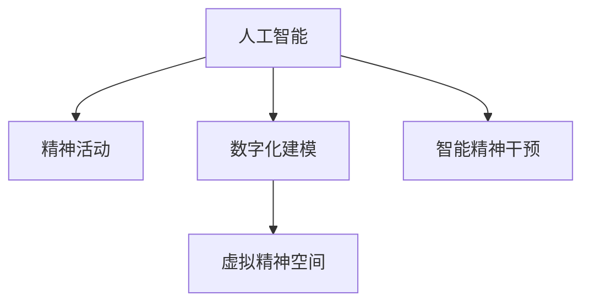

                 

# 数字化灵性：AI辅助的精神探索

## 1. 背景介绍

### 1.1 问题由来

在数字化时代，人类精神生活的变化尤为显著。传统的人际互动、社交活动、休闲娱乐等方式受到数字化、虚拟化、网络化的影响，发生了深刻的变革。人工智能(AI)技术的兴起，更是为精神探索开辟了新的道路，为人类提供了数字化灵性探索的工具。

### 1.2 问题核心关键点

数字化灵性探索是指利用AI技术，结合心理学、神经科学、哲学等学科知识，对人类精神世界进行数字化建模、分析、干预的过程。其核心关键点包括：

- **AI辅助分析**：通过机器学习、深度学习等AI技术，对人类情感、心理、意识等数据进行建模和分析，揭示精神活动的规律。
- **虚拟精神空间**：构建虚拟的数字世界，模拟人类精神活动，为精神探索提供新的空间。
- **智能精神干预**：利用AI算法，设计精神干预方案，帮助个体缓解压力、提升幸福感、促进心理健康。

## 2. 核心概念与联系

### 2.1 核心概念概述

为更好地理解AI辅助精神探索的过程，本节将介绍几个密切相关的核心概念：

- **人工智能(AI)**：通过模拟人类智能行为，使计算机能够自主完成复杂任务的技术体系。
- **精神活动(Spiritual Activity)**：涉及情感、意识、认知、意志等人类内在世界的心理现象。
- **数字化建模(Digital Modeling)**：将复杂、抽象的精神活动映射到数字化模型中，便于计算和分析。
- **虚拟精神空间(Virtual Spiritual Space)**：利用虚拟现实(VR)、增强现实(AR)等技术构建的数字精神世界。
- **智能精神干预(Intelligent Spiritual Intervention)**：通过AI算法设计心理干预方案，帮助个体缓解心理压力、提升幸福感。

这些概念之间的逻辑关系可以通过以下Mermaid流程图来展示：



这个流程图展示了一些核心概念及其之间的关系：

1. 人工智能通过模拟人类智能，对精神活动进行建模和分析。
2. 数字化建模将精神活动转化为可计算的数字形式。
3. 虚拟精神空间利用AI和数字化建模，构建数字化的精神探索环境。
4. 智能精神干预基于AI算法，设计心理干预方案。

## 3. 核心算法原理 & 具体操作步骤

### 3.1 算法原理概述

AI辅助精神探索的过程主要基于以下几个核心算法原理：

- **深度学习**：通过多层神经网络，对人类情感、心理数据进行建模，捕捉复杂的内在模式。
- **自然语言处理(NLP)**：利用语言模型对人类自然语言进行理解和生成，揭示语言背后的情感和认知。
- **生成对抗网络(GAN)**：通过生成模型和判别模型的对抗训练，生成逼真的虚拟精神空间。
- **强化学习**：通过奖励机制，训练智能精神干预算法，优化干预效果。

### 3.2 算法步骤详解

AI辅助精神探索的具体步骤如下：

**Step 1: 数据采集与预处理**
- 采集人类情感、心理、行为等数据，包括脑电波、心率、面部表情、语音、文字等。
- 对采集数据进行清洗、归一化、去噪等预处理操作，以保证数据质量。

**Step 2: 深度学习建模**
- 使用卷积神经网络(CNN)、循环神经网络(RNN)、Transformer等深度学习模型，对人类情感、心理数据进行建模。
- 通过正则化技术，防止过拟合，保证模型的泛化能力。
- 使用迁移学习，利用已有预训练模型，加速建模过程。

**Step 3: 虚拟精神空间构建**
- 使用生成对抗网络(GAN)，生成逼真的虚拟精神空间，包括虚拟环境、虚拟角色、虚拟事件等。
- 通过交互式设计，使虚拟精神空间能够模拟人类精神活动。
- 利用自然语言处理(NLP)技术，对虚拟环境进行自然语言描述，提高用户沉浸感。

**Step 4: 智能精神干预设计**
- 基于深度学习模型，设计智能精神干预算法，对用户进行情感分析、行为预测、心理评估等。
- 使用强化学习，优化干预策略，提升干预效果。
- 引入正则化技术，防止干预算法过拟合。

**Step 5: 实验评估与优化**
- 在实际应用场景中进行小规模实验，评估干预效果。
- 根据实验结果，对模型和算法进行优化，进一步提升干预效果。

### 3.3 算法优缺点

AI辅助精神探索具有以下优点：

- **精准分析**：深度学习、自然语言处理等技术能够精准分析人类情感和心理数据，揭示内在规律。
- **虚拟体验**：通过虚拟精神空间构建，为用户提供沉浸式、虚拟化的精神探索体验。
- **智能干预**：强化学习等技术可以设计智能精神干预方案，提升干预效果。

同时，该方法也存在一些局限性：

- **数据隐私**：采集和使用人类精神数据涉及隐私问题，需要严格的数据保护和隐私管理。
- **模型鲁棒性**：深度学习模型对训练数据和超参数敏感，容易过拟合，需要仔细调参和优化。
- **用户接受度**：虚拟精神空间和智能精神干预需要用户信任和接受，部分用户可能存在抵触情绪。
- **伦理道德**：精神探索涉及伦理道德问题，需要慎重考虑算法和应用的社会影响。

## 4. 数学模型和公式 & 详细讲解 & 举例说明

### 4.1 数学模型构建

我们以情感分析为例，构建深度学习模型。

设训练数据集为 $D=\{(x_i,y_i)\}_{i=1}^N$，其中 $x_i$ 为输入文本， $y_i \in \{1,2,3\}$ 为对应的情感标签。模型目标为预测情感标签，使用交叉熵损失函数：

$$
\mathcal{L} = -\frac{1}{N}\sum_{i=1}^N y_i\log P(y_i|x_i)
$$

其中 $P(y_i|x_i)$ 为模型对 $x_i$ 输出情感标签 $y_i$ 的概率分布。

### 4.2 公式推导过程

对于RNN模型，我们以LSTM单元为例，其结构如下图所示：


模型训练过程如下：

1. 前向传播：对每个时间步 $t$，计算输入 $x_t$ 通过LSTM单元的输出 $h_t$。
2. 损失计算：将输出 $h_t$ 通过softmax层得到情感概率分布 $P(y_i|x_i)$，计算交叉熵损失 $\mathcal{L}$。
3. 反向传播：使用链式法则，计算模型参数的梯度，更新模型权重。

### 4.3 案例分析与讲解

假设我们有一个简单的情感分析模型，输入为一句话 "I love you"，输出为情感标签 3（正面情感）。

1. 输入一句话 "I love you" 进入模型，首先通过嵌入层转换为向量表示。
2. 然后通过LSTM单元进行时间步的动态处理，得到最终输出。
3. 将输出通过softmax层得到情感概率分布，取概率最大的标签作为预测结果。

## 5. 项目实践：代码实例和详细解释说明

### 5.1 开发环境搭建

在进行AI辅助精神探索的实践时，我们需要准备好相应的开发环境。以下是使用Python和PyTorch进行深度学习的开发环境配置流程：

1. 安装Anaconda：从官网下载并安装Anaconda，用于创建独立的Python环境。
2. 创建并激活虚拟环境：
```bash
conda create -n pytorch-env python=3.8 
conda activate pytorch-env
```

3. 安装PyTorch：根据CUDA版本，从官网获取对应的安装命令。例如：
```bash
conda install pytorch torchvision torchaudio cudatoolkit=11.1 -c pytorch -c conda-forge
```

4. 安装深度学习相关的其他工具包：
```bash
pip install numpy pandas scikit-learn matplotlib tqdm jupyter notebook ipython
```

完成上述步骤后，即可在`pytorch-env`环境中开始深度学习的项目实践。

### 5.2 源代码详细实现

我们以情感分析任务为例，给出使用PyTorch进行深度学习的代码实现。

首先，定义数据处理函数：

```python
from torch.utils.data import Dataset
import torch

class SentimentDataset(Dataset):
    def __init__(self, texts, labels):
        self.texts = texts
        self.labels = labels
        
    def __len__(self):
        return len(self.texts)
    
    def __getitem__(self, item):
        text = self.texts[item]
        label = self.labels[item]
        
        # 将文本转换为token ids
        encoding = tokenizer(text, max_length=128, padding='max_length', truncation=True)
        input_ids = encoding['input_ids'][0]
        attention_mask = encoding['attention_mask'][0]
        
        # 将标签转换为one-hot编码
        one_hot_labels = torch.zeros(1, 3)
        one_hot_labels[0, label] = 1
        
        return {'input_ids': input_ids, 
                'attention_mask': attention_mask,
                'labels': one_hot_labels}
```

然后，定义模型和优化器：

```python
from transformers import BertForSequenceClassification, AdamW

model = BertForSequenceClassification.from_pretrained('bert-base-cased', num_labels=3)

optimizer = AdamW(model.parameters(), lr=2e-5)
```

接着，定义训练和评估函数：

```python
from torch.utils.data import DataLoader
from tqdm import tqdm

device = torch.device('cuda') if torch.cuda.is_available() else torch.device('cpu')
model.to(device)

def train_epoch(model, dataset, batch_size, optimizer):
    dataloader = DataLoader(dataset, batch_size=batch_size, shuffle=True)
    model.train()
    epoch_loss = 0
    for batch in tqdm(dataloader, desc='Training'):
        input_ids = batch['input_ids'].to(device)
        attention_mask = batch['attention_mask'].to(device)
        labels = batch['labels'].to(device)
        model.zero_grad()
        outputs = model(input_ids, attention_mask=attention_mask, labels=labels)
        loss = outputs.loss
        epoch_loss += loss.item()
        loss.backward()
        optimizer.step()
    return epoch_loss / len(dataloader)

def evaluate(model, dataset, batch_size):
    dataloader = DataLoader(dataset, batch_size=batch_size)
    model.eval()
    preds, labels = [], []
    with torch.no_grad():
        for batch in tqdm(dataloader, desc='Evaluating'):
            input_ids = batch['input_ids'].to(device)
            attention_mask = batch['attention_mask'].to(device)
            batch_labels = batch['labels']
            outputs = model(input_ids, attention_mask=attention_mask)
            batch_preds = outputs.logits.argmax(dim=2).to('cpu').tolist()
            batch_labels = batch_labels.to('cpu').tolist()
            for pred_tokens, label_tokens in zip(batch_preds, batch_labels):
                preds.append(pred_tokens)
                labels.append(label_tokens)
                
    return classification_report(labels, preds)
```

最后，启动训练流程并在测试集上评估：

```python
epochs = 5
batch_size = 16

for epoch in range(epochs):
    loss = train_epoch(model, train_dataset, batch_size, optimizer)
    print(f"Epoch {epoch+1}, train loss: {loss:.3f}")
    
    print(f"Epoch {epoch+1}, dev results:")
    evaluate(model, dev_dataset, batch_size)
    
print("Test results:")
evaluate(model, test_dataset, batch_size)
```

以上就是使用PyTorch进行情感分析任务的深度学习代码实现。可以看到，借助深度学习库的封装，代码实现相对简洁高效。

### 5.3 代码解读与分析

让我们再详细解读一下关键代码的实现细节：

**SentimentDataset类**：
- `__init__`方法：初始化文本和标签。
- `__len__`方法：返回数据集样本数量。
- `__getitem__`方法：对单个样本进行处理，将文本转换为token ids，将标签转换为one-hot编码，并对其进行定长padding，最终返回模型所需的输入。

**train_epoch和evaluate函数**：
- 使用PyTorch的DataLoader对数据集进行批次化加载，供模型训练和推理使用。
- 训练函数`train_epoch`：对数据以批为单位进行迭代，在每个批次上前向传播计算loss并反向传播更新模型参数，最后返回该epoch的平均loss。
- 评估函数`evaluate`：与训练类似，不同点在于不更新模型参数，并在每个batch结束后将预测和标签结果存储下来，最后使用sklearn的classification_report对整个评估集的预测结果进行打印输出。

**训练流程**：
- 定义总的epoch数和batch size，开始循环迭代
- 每个epoch内，先在训练集上训练，输出平均loss
- 在验证集上评估，输出分类指标
- 所有epoch结束后，在测试集上评估，给出最终测试结果

可以看到，PyTorch配合深度学习库使得情感分析任务的代码实现变得简洁高效。开发者可以将更多精力放在数据处理、模型改进等高层逻辑上，而不必过多关注底层的实现细节。

## 6. 实际应用场景

### 6.1 虚拟精神空间应用

虚拟精神空间技术已经被广泛应用于游戏、教育、娱乐等领域。通过构建逼真的虚拟环境，用户可以在其中进行探索、互动、沉浸式学习等活动，提升精神体验。

在教育领域，虚拟精神空间可以提供沉浸式教学体验，让学生更好地理解和掌握知识。例如，通过VR设备，学生可以进入虚拟课堂，与虚拟教师互动，参与虚拟实验，探索虚拟实验室。这样不仅可以增强学习兴趣，还能激发学生的创造力和探索精神。

在心理健康领域，虚拟精神空间可以提供虚拟心理咨询服务。通过虚拟角色和虚拟环境，用户可以在无压力的环境中表达情感和困惑，接受虚拟心理咨询师的指导。这种虚拟心理咨询不仅降低了成本，还能提供更加个性化和私密的心理支持。

### 6.2 智能精神干预应用

智能精神干预技术已经在多个领域得到应用，如心理健康、社交网络、人力资源等。通过AI算法，设计智能干预方案，帮助用户缓解心理压力、提升幸福感。

在心理健康领域，智能精神干预技术可以用于心理疾病早期筛查和干预。通过深度学习模型，对用户的情绪、行为数据进行建模，预测其心理状态，及时进行干预。例如，利用脑电波、心率等生理信号，检测用户的情绪波动，一旦出现异常，系统自动推送心理健康咨询或心理治疗建议。

在社交网络领域，智能精神干预技术可以用于缓解用户孤独感和社交压力。通过社交数据分析，识别出用户孤立和抑郁的迹象，推荐用户参与社交活动、接受心理咨询等，改善其社交状态。

在人力资源领域，智能精神干预技术可以用于员工心理健康管理。通过分析员工的情绪、工作压力数据，识别出高压力员工，及时提供心理支持和职业发展建议，提升员工幸福感和工作满意度。

### 6.3 未来应用展望

随着AI技术的发展，数字化灵性探索将迎来更多创新和突破。

**虚拟现实技术**：未来，虚拟现实技术将进一步发展，提供更加逼真、沉浸的虚拟精神空间。用户可以在虚拟环境中进行多感官互动，体验更丰富的精神探索场景。

**脑机接口技术**：脑机接口技术将使精神探索更加直接和高效。通过脑电波、脑成像等技术，实时监测和分析用户的精神活动，提供更加个性化的精神干预方案。

**跨领域融合**：数字化灵性探索将与教育、娱乐、艺术、哲学等领域深度融合，提供更多元化的精神探索体验。例如，在艺术领域，用户可以通过虚拟现实技术，进入虚拟艺术馆，与虚拟艺术品互动，提升审美体验。

**伦理道德**：数字化灵性探索涉及伦理道德问题，如数据隐私、算法透明度等。未来，需要制定更严格的伦理规范和隐私保护措施，确保技术应用的安全和可持续。

## 7. 工具和资源推荐

### 7.1 学习资源推荐

为了帮助开发者系统掌握AI辅助精神探索的理论基础和实践技巧，这里推荐一些优质的学习资源：

1. 《深度学习》系列书籍：由深度学习专家撰写，涵盖了深度学习的基本概念和前沿技术，是入门和进阶的重要参考。
2. 《Python深度学习》书籍：详细介绍了深度学习在Python环境下的实现方法，包含深度学习模型的构建和优化等。
3. Coursera《深度学习专项课程》：斯坦福大学开设的深度学习课程，系统介绍了深度学习的原理和应用，适合初学者和进阶者。
4. 《TensorFlow深度学习实战》书籍：介绍TensorFlow深度学习框架的实际应用，适合希望深入研究深度学习技术的开发者。
5. 《人工智能导论》书籍：介绍了人工智能的基本概念、历史和发展趋势，适合对AI有广泛兴趣的读者。

通过对这些资源的学习实践，相信你一定能够快速掌握AI辅助精神探索的精髓，并用于解决实际的AI应用问题。

### 7.2 开发工具推荐

高效的开发离不开优秀的工具支持。以下是几款用于AI辅助精神探索开发的常用工具：

1. PyTorch：基于Python的开源深度学习框架，灵活动态的计算图，适合快速迭代研究。大部分深度学习模型都有PyTorch版本的实现。
2. TensorFlow：由Google主导开发的开源深度学习框架，生产部署方便，适合大规模工程应用。同样有丰富的深度学习模型资源。
3. Keras：高层API，封装了TensorFlow等深度学习框架，提供了简洁的API设计，适合快速开发和原型设计。
4. Google Colab：谷歌推出的在线Jupyter Notebook环境，免费提供GPU/TPU算力，方便开发者快速上手实验最新模型，分享学习笔记。
5. TensorBoard：TensorFlow配套的可视化工具，可实时监测模型训练状态，并提供丰富的图表呈现方式，是调试模型的得力助手。

合理利用这些工具，可以显著提升AI辅助精神探索任务的开发效率，加快创新迭代的步伐。

### 7.3 相关论文推荐

AI辅助精神探索的发展离不开学界的持续研究。以下是几篇奠基性的相关论文，推荐阅读：

1. Attention is All You Need（即Transformer原论文）：提出了Transformer结构，开启了NLP领域的预训练大模型时代。
2. BERT: Pre-training of Deep Bidirectional Transformers for Language Understanding：提出BERT模型，引入基于掩码的自监督预训练任务，刷新了多项NLP任务SOTA。
3. Generating Virtual Worlds for Emotional Expression and Therapy：介绍了使用GAN技术生成虚拟世界的情感表达和心理治疗应用。
4. Human-AI Interaction for Emotional and Social Well-being：探讨了AI与人类互动对情感和社会福祉的影响。
5. Deep Learning for Predicting Psychological Distress in Online Communities：利用深度学习预测在线社区用户的心理压力和幸福感。

这些论文代表了大语言模型微调技术的发展脉络。通过学习这些前沿成果，可以帮助研究者把握学科前进方向，激发更多的创新灵感。

## 8. 总结：未来发展趋势与挑战

### 8.1 总结

本文对AI辅助精神探索方法进行了全面系统的介绍。首先阐述了数字化灵性的研究背景和意义，明确了AI辅助精神探索在拓展人类精神世界、提升心理健康等方面的价值。其次，从原理到实践，详细讲解了AI辅助精神探索的数学模型、算法步骤和代码实现。同时，本文还广泛探讨了AI辅助精神探索在虚拟精神空间、智能精神干预等多个领域的应用前景，展示了AI技术在精神探索中的巨大潜力。此外，本文精选了AI辅助精神探索的各类学习资源，力求为读者提供全方位的技术指引。

通过本文的系统梳理，可以看到，AI辅助精神探索技术正在成为数字化时代的重要范式，极大地拓展了人类精神探索的空间，推动了心理健康和社会福祉的进步。未来，伴随AI技术的不断发展，数字化灵性探索必将在更广泛的领域得到应用，为构建和谐、健康、幸福的人类社会贡献力量。

### 8.2 未来发展趋势

展望未来，AI辅助精神探索技术将呈现以下几个发展趋势：

1. **虚拟现实技术**：未来，虚拟现实技术将进一步发展，提供更加逼真、沉浸的虚拟精神空间，使用户可以在其中进行多感官互动，体验更丰富的精神探索场景。
2. **脑机接口技术**：脑机接口技术将使精神探索更加直接和高效。通过脑电波、脑成像等技术，实时监测和分析用户的精神活动，提供更加个性化的精神干预方案。
3. **跨领域融合**：AI辅助精神探索将与教育、娱乐、艺术、哲学等领域深度融合，提供更多元化的精神探索体验。
4. **伦理道德**：数字化精神探索涉及伦理道德问题，如数据隐私、算法透明度等。未来，需要制定更严格的伦理规范和隐私保护措施，确保技术应用的安全和可持续。
5. **个性化定制**：未来，AI辅助精神探索将更加注重个性化定制，根据用户的具体需求和特征，设计更加精准的精神干预方案。

以上趋势凸显了AI辅助精神探索技术的广阔前景。这些方向的探索发展，必将进一步提升精神探索的深度和广度，为人类精神世界的数字化探索开辟新的道路。

### 8.3 面临的挑战

尽管AI辅助精神探索技术已经取得了瞩目成就，但在迈向更加智能化、普适化应用的过程中，它仍面临着诸多挑战：

1. **数据隐私**：采集和使用人类精神数据涉及隐私问题，需要严格的数据保护和隐私管理。
2. **模型鲁棒性**：深度学习模型对训练数据和超参数敏感，容易过拟合，需要仔细调参和优化。
3. **用户接受度**：虚拟精神空间和智能精神干预需要用户信任和接受，部分用户可能存在抵触情绪。
4. **伦理道德**：精神探索涉及伦理道德问题，如数据隐私、算法透明度等，需要慎重考虑。

## 8.4 研究展望

面对AI辅助精神探索所面临的种种挑战，未来的研究需要在以下几个方面寻求新的突破：

1. **多模态融合**：将语音、视觉、触觉等多模态信息与文本信息进行融合，提供更加全面、深入的精神探索体验。
2. **因果分析**：引入因果分析方法，识别出精神活动的关键特征，增强输出解释的因果性和逻辑性。
3. **伦理设计**：在算法设计和应用过程中，融入伦理道德考量，确保技术应用的合法性、公正性和可解释性。
4. **跨学科合作**：加强AI与心理学、神经科学、哲学等学科的合作，提供更加全面、深入的精神探索解决方案。

这些研究方向的探索，必将引领AI辅助精神探索技术迈向更高的台阶，为构建和谐、健康、幸福的人类社会贡献力量。面向未来，AI辅助精神探索技术还需要与其他人工智能技术进行更深入的融合，如知识表示、因果推理、强化学习等，多路径协同发力，共同推动数字化灵性探索的进步。只有勇于创新、敢于突破，才能不断拓展AI辅助精神探索的边界，让智能技术更好地服务于人类精神世界的探索和发展。

## 9. 附录：常见问题与解答

**Q1：AI辅助精神探索是否适用于所有精神需求？**

A: AI辅助精神探索在一定程度上可以适用于各种精神需求，但也需要结合具体应用场景和用户需求进行定制。例如，对于严重的精神疾病，如精神分裂症、抑郁症等，需要结合专业心理医生的指导和治疗。而对于日常生活中的情感调节和心理健康，AI辅助精神探索可以提供有效的支持和帮助。

**Q2：AI辅助精神探索是否会侵犯用户隐私？**

A: AI辅助精神探索在采集和使用用户数据时，需要严格遵守数据隐私保护法规，如GDPR、CCPA等，确保用户数据的安全和隐私。此外，可以通过匿名化处理、数据脱敏等技术手段，进一步保护用户隐私。

**Q3：AI辅助精神探索是否存在偏见和歧视？**

A: AI辅助精神探索在设计和应用过程中，需要充分考虑算法的公正性和透明性。采用公平性评估和对抗性训练等技术手段，避免算法偏见和歧视。同时，需要在数据采集和模型训练中引入多样性和包容性原则，确保算法的普适性和公平性。

**Q4：AI辅助精神探索是否可靠和可信？**

A: AI辅助精神探索的可靠性和可信度需要经过严格的实验验证和评估。在实际应用中，需要建立用户反馈和评价机制，持续改进算法和模型。同时，需要引入伦理审查和监管机制，确保技术应用的合法性和安全性。

**Q5：AI辅助精神探索是否适合所有年龄段的用户？**

A: AI辅助精神探索可以适用于不同年龄段的用户，但需要根据用户的具体需求和特征进行定制。例如，对于儿童和青少年，需要采用更加温和和安全的干预方式，避免对其精神发展造成负面影响。而对于成人和老年人，则需要结合其心理特点和需求，提供个性化的精神支持和服务。

---

作者：禅与计算机程序设计艺术 / Zen and the Art of Computer Programming

