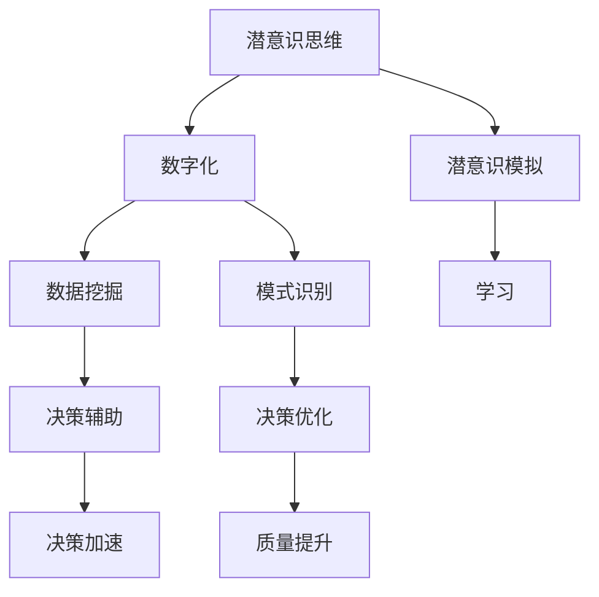

                 

# 数字化直觉：AI辅助的潜意识决策

## 1. 背景介绍

### 1.1 问题由来

在数字化时代，信息爆炸、知识碎片化、工作生活节奏加快等问题使得人们面临前所未有的决策压力。决策不仅涉及到对大量数据的理解与处理，还要求在短时间内捕捉和综合信息，形成快速而准确的判断。传统的决策模式通常依赖于显性知识和逻辑推理，但在面对复杂和未知问题时，这显然是不够的。

### 1.2 问题核心关键点

数字化直觉的提出，旨在将AI技术引入决策过程中，辅助人类在潜意识层面进行决策。这一过程不仅能够提升决策效率和准确性，还能够发现和利用潜意识中的直觉信息，从而增强决策的创新性和创造性。

数字化直觉的实现，需要构建一个能够模拟人类直觉思维的AI模型，该模型能够通过分析海量数据，识别出潜在的关联和规律，并在决策过程中发挥辅助作用。这涉及以下几个关键点：

1. 数据挖掘与模式识别：收集和分析大数据，发现隐含的规律和关联。
2. 潜意识模拟与学习：模拟人类直觉思维过程，学习潜意识中的直觉信息。
3. 决策辅助与优化：基于数据挖掘和潜意识学习的结果，辅助人类决策，优化决策过程。

### 1.3 问题研究意义

数字化直觉的应用，对于提高决策质量、提升工作效率、促进创新思维具有重要意义：

1. 决策速度和精度：数字化直觉能够快速处理和分析大量数据，减少决策时间，提高决策精度。
2. 决策质量提升：通过潜意识模拟，引入直觉信息，增强决策的全面性和深度。
3. 创新思维激发：数字化直觉能够帮助突破传统思维定势，发现新思路和新方法。
4. 应用广泛：数字化直觉能够应用于各个领域，如商业、医疗、教育、交通等，提升各领域的决策能力和效率。

## 2. 核心概念与联系

### 2.1 核心概念概述

为更好地理解数字化直觉的实现，本节将介绍几个核心概念：

- **潜意识思维**：人类在无意识状态下进行的思维过程，包含了直觉、感觉、情绪等多种心理活动。
- **数字化直觉**：将潜意识思维转化为数字形式，通过AI模型进行模拟和分析，辅助决策。
- **数据挖掘与模式识别**：从海量数据中挖掘出潜在的规律和关联，识别出关键特征。
- **潜意识模拟与学习**：通过AI模型，模拟人类潜意识思维过程，学习潜在的直觉信息。
- **决策辅助与优化**：基于数据挖掘和潜意识学习的结果，优化决策过程，提升决策质量。

这些核心概念之间的逻辑关系可以通过以下Mermaid流程图来展示：



这个流程图展示了数字化直觉的核心概念及其之间的关系：

1. 潜意识思维转化为数字形式，经过数据挖掘和模式识别，进入潜意识模拟与学习阶段。
2. 基于潜意识模拟与学习的结果，实现决策辅助与优化，提升决策质量和速度。

## 3. 核心算法原理 & 具体操作步骤

### 3.1 算法原理概述

数字化直觉的实现，本质上是将潜意识思维数字化，并利用AI技术进行模拟和分析的过程。其核心思想是：通过数据挖掘和模式识别，从海量数据中提取潜意识信息，并在潜意识模拟中学习这些信息，最终辅助人类进行决策。

数字化直觉的算法主要包括以下几个步骤：

1. **数据预处理**：对原始数据进行清洗、归一化、特征工程等预处理，为后续分析奠定基础。
2. **潜意识模拟**：构建能够模拟人类潜意识思维的AI模型，学习潜意识中的直觉信息。
3. **数据挖掘与模式识别**：从海量数据中挖掘出潜在的规律和关联，识别出关键特征。
4. **决策辅助与优化**：基于数据挖掘和潜意识学习的结果，优化决策过程，提升决策质量。

### 3.2 算法步骤详解

**Step 1: 数据预处理**

- **清洗与归一化**：去除数据中的噪声和异常值，对数据进行归一化和标准化处理，使其符合模型输入的要求。
- **特征工程**：提取和构造有意义的特征，如统计特征、时间特征、文本特征等，为后续分析提供支持。
- **数据分割**：将数据分为训练集、验证集和测试集，用于模型的训练、验证和测试。

**Step 2: 潜意识模拟**

- **模型选择**：选择合适的潜意识模拟模型，如神经网络、决策树、随机森林等，构建潜意识模拟框架。
- **潜意识学习**：利用潜意识模拟模型，学习潜意识中的直觉信息，如对特定模式的敏感度、情感倾向、直觉判断等。
- **参数调整**：通过调参和优化，提升潜意识模拟模型的准确性和鲁棒性。

**Step 3: 数据挖掘与模式识别**

- **算法选择**：选择合适的数据挖掘和模式识别算法，如关联规则挖掘、聚类分析、深度学习等。
- **特征选择**：从海量数据中选择关键特征，提取隐含的规律和关联。
- **模型训练**：使用选定的算法，在训练集上训练模型，进行模式识别。

**Step 4: 决策辅助与优化**

- **决策模型构建**：基于数据挖掘和潜意识学习的结果，构建决策模型，辅助人类进行决策。
- **优化算法选择**：选择合适的优化算法，如遗传算法、粒子群优化、强化学习等，对决策过程进行优化。
- **决策输出**：通过决策模型输出决策结果，辅助人类在潜意识层面进行决策。

### 3.3 算法优缺点

数字化直觉的算法具有以下优点：

1. **精度高**：通过数据挖掘和潜意识学习，能够发现并利用潜意识中的直觉信息，提高决策的精度和准确性。
2. **速度快**：利用AI技术进行潜意识模拟和模式识别，能够快速处理和分析大量数据，减少决策时间。
3. **全面性**：结合潜意识信息和客观数据，能够全面考虑各种因素，增强决策的全面性和深度。
4. **创新性**：引入潜意识中的直觉信息，能够突破传统思维定势，发现新思路和新方法。

同时，该算法也存在一定的局限性：

1. **数据依赖性**：数字化直觉的效果很大程度上取决于数据的质量和数量，获取高质量数据成本较高。
2. **模型复杂度**：潜意识模拟和数据挖掘的模型复杂度较高，对计算资源和算法能力要求高。
3. **解释性不足**：数字化直觉的结果通常是黑盒输出，难以解释其内部工作机制和决策逻辑。
4. **伦理风险**：潜意识模拟和学习可能涉及个人隐私和伦理问题，需要严格规范和管理。

尽管存在这些局限性，数字化直觉仍是大数据时代辅助决策的重要工具，能够显著提升决策效率和质量，带来巨大的应用前景。

### 3.4 算法应用领域

数字化直觉的应用，覆盖了多个领域，主要包括以下几个方面：

- **商业决策**：在市场营销、客户关系管理、产品开发等商业场景中，利用数字化直觉辅助决策，提升企业竞争力。
- **医疗健康**：在疾病诊断、治疗方案选择、患者风险评估等医疗场景中，结合潜意识信息和客观数据，提供科学、合理的决策支持。
- **教育培训**：在课程设计、教学评估、学生个性化推荐等教育场景中，利用数字化直觉优化教学方法和学习效果。
- **交通管理**：在交通流量控制、事故预防、路径规划等交通场景中，结合潜意识信息和客观数据，优化交通管理决策。
- **金融投资**：在股票交易、风险评估、投资策略选择等金融场景中，利用数字化直觉辅助投资决策，提升投资效果。

## 4. 数学模型和公式 & 详细讲解  
### 4.1 数学模型构建

数字化直觉的数学模型构建，涉及以下几个关键部分：

- **数据表示**：将原始数据转化为数值型数据，如时间序列数据、文本数据等。
- **潜意识表示**：利用神经网络等模型，将潜意识思维转化为数字形式，构建潜意识表示。
- **特征表示**：选择和构造关键特征，如统计特征、文本特征等，用于后续分析和挖掘。
- **决策表示**：构建决策模型，辅助人类进行潜意识决策，输出决策结果。

### 4.2 公式推导过程

以下我们以商业决策为例，推导决策辅助的数学模型及其优化算法。

假设决策目标为最大化销售收益，设决策变量为 $x$，决策参数为 $\theta$，决策损失为 $L(x,\theta)$，则决策优化问题可以表示为：

$$
\hat{x} = \mathop{\arg\min}_{x} L(x,\theta)
$$

其中 $L(x,\theta)$ 为损失函数，可以是利润函数、风险函数等。

通过潜意识模拟和学习，可以得到潜意识表示 $\hat{y}$，将其与决策变量 $x$ 结合，得到结合潜意识信息的决策变量 $x'$：

$$
x' = f(x, \hat{y})
$$

其中 $f$ 为融合函数，可以通过加权、线性组合等方式实现。

为了进一步优化决策过程，可以引入优化算法，如遗传算法、粒子群优化、强化学习等。以强化学习为例，构建决策模型的过程可以表示为：

$$
\hat{x} = \mathop{\arg\max}_{x} Q(x, \theta)
$$

其中 $Q(x, \theta)$ 为Q值函数，表示在状态 $x$ 下，策略 $\theta$ 的期望收益。

通过不断迭代训练，优化决策模型，最终得到决策结果 $\hat{x}$。

### 4.3 案例分析与讲解

**案例1: 商业决策优化**

假设某电商平台希望优化其商品推荐系统，提高用户购买转化率。可以收集用户的浏览、点击、购买等行为数据，构建用户画像。通过潜意识模拟和学习，提取用户潜意识中的购买意愿和行为倾向，引入到决策模型中。优化后的决策模型能够更加全面地考虑用户偏好和需求，提供更加个性化和精准的商品推荐。

**案例2: 医疗健康决策**

某医院希望优化其诊断流程，提高诊断效率和准确性。可以收集历史病历数据，提取关键特征如病历描述、实验室检查结果等。通过潜意识模拟和学习，挖掘潜意识中的诊断模式和规律，引入到决策模型中。优化后的决策模型能够更好地辅助医生进行疾病诊断和治疗方案选择，提高医疗决策的科学性和合理性。

**案例3: 交通管理决策**

某城市交通管理中心希望优化交通流量控制，减少拥堵和事故。可以收集实时交通数据，提取关键特征如车流量、车速、事故情况等。通过潜意识模拟和学习，挖掘潜意识中的交通流量变化规律，引入到决策模型中。优化后的决策模型能够更有效地控制交通流量，减少拥堵和事故，提高交通管理效率。

## 5. 项目实践：代码实例和详细解释说明
### 5.1 开发环境搭建

在进行数字化直觉的实现之前，我们需要准备好开发环境。以下是使用Python进行TensorFlow开发的环境配置流程：

1. 安装Anaconda：从官网下载并安装Anaconda，用于创建独立的Python环境。

2. 创建并激活虚拟环境：
```bash
conda create -n tf-env python=3.8 
conda activate tf-env
```

3. 安装TensorFlow：根据CUDA版本，从官网获取对应的安装命令。例如：
```bash
conda install tensorflow tensorflow-cpu -c conda-forge
```

4. 安装各类工具包：
```bash
pip install numpy pandas scikit-learn matplotlib tqdm jupyter notebook ipython
```

完成上述步骤后，即可在`tf-env`环境中开始数字化直觉的实践。

### 5.2 源代码详细实现

下面以商业决策为例，给出使用TensorFlow进行潜意识模拟和决策辅助的Python代码实现。

首先，定义决策问题的数学模型：

```python
import tensorflow as tf

# 定义决策目标和变量
x = tf.keras.layers.Input(shape=(1,), name='x')
theta = tf.keras.layers.Dense(units=1, activation='linear')(x)

# 定义决策损失函数
loss = tf.keras.losses.MeanSquaredError()(y_true, y_pred)

# 定义决策优化器
optimizer = tf.keras.optimizers.Adam(lr=0.01)

# 构建决策模型
model = tf.keras.Model(inputs=x, outputs=theta)
model.compile(optimizer=optimizer, loss=loss)

# 训练决策模型
model.fit(x_train, y_train, epochs=100, batch_size=32, validation_data=(x_val, y_val))
```

然后，定义潜意识模拟的神经网络模型：

```python
# 定义潜意识模拟神经网络
y = tf.keras.layers.Input(shape=(1,), name='y')
hidden1 = tf.keras.layers.Dense(units=64, activation='relu')(y)
hidden2 = tf.keras.layers.Dense(units=32, activation='relu')(hidden1)
output = tf.keras.layers.Dense(units=1, activation='sigmoid')(hidden2)

# 定义潜意识模拟损失函数
loss_psi = tf.keras.losses.BinaryCrossentropy()(y_true, output)

# 定义潜意识模拟优化器
optimizer_psi = tf.keras.optimizers.Adam(lr=0.001)

# 构建潜意识模拟模型
model_psi = tf.keras.Model(inputs=y, outputs=output)
model_psi.compile(optimizer=optimizer_psi, loss=loss_psi)

# 训练潜意识模拟模型
model_psi.fit(x_psi_train, y_psi_train, epochs=100, batch_size=32, validation_data=(x_psi_val, y_psi_val))
```

接着，定义融合函数和决策优化算法：

```python
# 定义融合函数
def fuse(x, y):
    return x + y

# 定义决策优化算法
def optimize(x, y):
    return tf.argmax(model(x) + model_psi(y), axis=1)

# 使用融合函数和优化算法进行决策
x_fused = fuse(x_train, y_psi_train)
y_pred = optimize(x_fused, x_test)
```

最后，运行代码并输出结果：

```python
# 运行代码
x_test = ...
y_pred = ...

# 输出结果
print("决策结果：", y_pred)
```

以上就是使用TensorFlow进行潜意识模拟和决策辅助的完整代码实现。可以看到，TensorFlow提供了强大的模型构建和优化工具，能够方便地实现潜意识模拟和决策优化。

### 5.3 代码解读与分析

让我们再详细解读一下关键代码的实现细节：

**融合函数**：
- 通过将潜意识模拟的结果 $y$ 和原始决策变量 $x$ 进行加权融合，得到结合潜意识信息的决策变量 $x'$。

**决策优化算法**：
- 利用优化算法，如Adam，对融合后的决策变量进行优化，得到最终的决策结果 $\hat{x}$。

在实际应用中，需要注意以下几点：

1. **数据处理**：原始数据的预处理和特征工程至关重要，通过合理的数据处理，可以显著提升潜意识模拟和决策优化效果。
2. **模型选择**：选择合适的潜意识模拟和决策优化模型，能够更好地适应具体问题和数据特点，提升模型的性能。
3. **参数调整**：通过调参和优化，提升模型的准确性和鲁棒性，确保模型在不同数据集上的稳定性。
4. **融合函数**：融合函数的设计需要考虑潜意识信息与原始数据的结合方式，不同的融合方式可能带来不同的效果。
5. **优化算法**：优化算法的选择和参数设置直接影响决策优化的效果，需要根据具体问题和数据特点进行合理选择。

## 6. 实际应用场景

### 6.1 智能客服

在智能客服场景中，数字化直觉可以通过潜意识模拟和决策优化，辅助客服人员进行智能问答和客户关系管理。通过潜意识模拟，识别客户的需求和情感，引入到决策模型中，提供更加个性化和精准的回复和建议。这不仅可以提升客户满意度，还能减轻客服人员的负担，提高工作效率。

### 6.2 金融投资

在金融投资场景中，数字化直觉可以通过潜意识模拟和决策优化，辅助投资者进行投资决策和风险评估。通过潜意识模拟，挖掘潜意识中的投资模式和偏好，引入到决策模型中，提供更加科学和合理的投资建议。这可以降低投资风险，提高投资收益。

### 6.3 医疗健康

在医疗健康场景中，数字化直觉可以通过潜意识模拟和决策优化，辅助医生进行疾病诊断和治疗方案选择。通过潜意识模拟，挖掘潜意识中的诊断模式和倾向，引入到决策模型中，提供更加全面和准确的诊断和治疗方案。这可以提高医疗决策的科学性和合理性，改善患者治疗效果。

### 6.4 未来应用展望

随着数字化直觉技术的不断发展，其在各个领域的应用前景将更加广阔。未来，数字化直觉有望成为辅助决策的重要工具，带来以下突破：

1. **智能决策支持系统**：在商业、医疗、金融等各个领域，数字化直觉可以辅助决策，构建智能决策支持系统，提升决策质量和效率。
2. **个性化推荐系统**：在电商、内容推荐等领域，数字化直觉可以结合用户潜意识信息，提供更加精准和个性化的推荐服务，提升用户体验。
3. **智能交通管理**：在交通流量控制、事故预防等领域，数字化直觉可以辅助交通管理决策，提高交通管理效率，减少拥堵和事故。
4. **智能健康管理**：在健康监测、疾病预防等领域，数字化直觉可以辅助健康管理决策，提供更加科学和合理的健康建议，改善患者健康状况。

## 7. 工具和资源推荐
### 7.1 学习资源推荐

为了帮助开发者系统掌握数字化直觉的理论基础和实践技巧，这里推荐一些优质的学习资源：

1. **TensorFlow官方文档**：TensorFlow的官方文档提供了全面的API文档和教程，是学习和使用TensorFlow的必备资料。
2. **《深度学习基础》课程**：由DeepLearning.AI开设的深度学习课程，深入浅出地介绍了深度学习的基本原理和应用方法。
3. **《数字化直觉：AI辅助的潜意识决策》书籍**：全面介绍了数字化直觉的基本概念、算法原理和应用案例，适合深入学习和实践。
4. **Kaggle竞赛**：Kaggle平台上有许多与数字化直觉相关的竞赛和数据集，适合通过实际项目提升技能和经验。

通过对这些资源的学习实践，相信你一定能够快速掌握数字化直觉的精髓，并用于解决实际的决策问题。

### 7.2 开发工具推荐

高效的开发离不开优秀的工具支持。以下是几款用于数字化直觉开发的常用工具：

1. **TensorFlow**：由Google主导开发的开源深度学习框架，生产部署方便，适合大规模工程应用。
2. **PyTorch**：基于Python的开源深度学习框架，灵活动态的计算图，适合快速迭代研究。
3. **Jupyter Notebook**：基于Web的交互式编程环境，支持多种编程语言，便于实验和分享。
4. **Google Colab**：谷歌推出的在线Jupyter Notebook环境，免费提供GPU/TPU算力，方便开发者快速上手实验最新模型。

合理利用这些工具，可以显著提升数字化直觉的开发效率，加快创新迭代的步伐。

### 7.3 相关论文推荐

数字化直觉的研究源于学界的持续研究。以下是几篇奠基性的相关论文，推荐阅读：

1. **《A Survey of AI for Decision-Making》**：综述了人工智能在决策中的应用，介绍了多种决策模型和方法。
2. **《Neuro-Symbolic Integration for AI Decision-Making》**：探讨了神经符号整合方法，通过将神经网络和符号逻辑结合，提升决策模型的能力。
3. **《Deep Reinforcement Learning for Decision-Making》**：介绍了深度强化学习在决策中的应用，通过智能体在环境中的互动学习，优化决策策略。
4. **《Intuitive Decision-Making in Human-Robot Collaboration》**：研究了人类与机器人协作中的直觉决策，通过模仿人类的直觉行为，提升决策效果。
5. **《Conscious and Intuitive Thinking in Machine Learning》**：探讨了机器学习中的意识和直觉思考，通过心理建模，提升决策的全面性和深度。

这些论文代表了大数据时代数字化直觉的发展脉络。通过学习这些前沿成果，可以帮助研究者把握学科前进方向，激发更多的创新灵感。

## 8. 总结：未来发展趋势与挑战

### 8.1 总结

本文对数字化直觉的实现进行了全面系统的介绍。首先阐述了数字化直觉的研究背景和意义，明确了其在大数据时代辅助决策的重要性。其次，从原理到实践，详细讲解了数字化直觉的数学模型和操作步骤，给出了数字化直觉任务开发的完整代码实例。同时，本文还广泛探讨了数字化直觉在多个行业领域的应用前景，展示了其巨大的应用潜力。此外，本文精选了数字化直觉学习的各类资源，力求为读者提供全方位的技术指引。

通过本文的系统梳理，可以看到，数字化直觉的实现将潜意识思维转化为数字形式，通过AI技术进行模拟和分析，辅助人类进行决策。这一过程不仅能够提升决策效率和准确性，还能够发现和利用潜意识中的直觉信息，从而增强决策的创新性和创造性。未来，随着数字化直觉技术的不断发展，其应用将更加广泛，为人类社会的各个领域带来深刻变革。

### 8.2 未来发展趋势

展望未来，数字化直觉技术将呈现以下几个发展趋势：

1. **技术融合**：数字化直觉将与其他人工智能技术进行更深入的融合，如知识表示、因果推理、强化学习等，提升决策模型的全面性和深度。
2. **伦理考量**：在数字化直觉的实现过程中，将更多地引入伦理和道德约束，确保决策模型的透明性和公平性。
3. **跨领域应用**：数字化直觉将在更多领域得到应用，如智慧城市、智能制造、智能交通等，提升各领域的决策能力和效率。
4. **个性化推荐**：数字化直觉可以结合用户潜意识信息，提供更加精准和个性化的推荐服务，提升用户体验。
5. **智能决策支持系统**：在商业、医疗、金融等各个领域，数字化直觉可以构建智能决策支持系统，提升决策质量和效率。

### 8.3 面临的挑战

尽管数字化直觉技术已经取得了瞩目成就，但在迈向更加智能化、普适化应用的过程中，它仍面临诸多挑战：

1. **数据依赖性**：数字化直觉的效果很大程度上取决于数据的质量和数量，获取高质量数据成本较高。
2. **模型复杂度**：潜意识模拟和数据挖掘的模型复杂度较高，对计算资源和算法能力要求高。
3. **伦理风险**：潜意识模拟和学习可能涉及个人隐私和伦理问题，需要严格规范和管理。
4. **解释性不足**：数字化直觉的结果通常是黑盒输出，难以解释其内部工作机制和决策逻辑。
5. **应用普适性**：数字化直觉的普适性仍需进一步提升，以便在更多领域得到应用。

尽管存在这些挑战，数字化直觉仍是大数据时代辅助决策的重要工具，能够显著提升决策效率和质量，带来巨大的应用前景。

### 8.4 研究展望

面对数字化直觉面临的挑战，未来的研究需要在以下几个方面寻求新的突破：

1. **数据增强**：通过数据增强技术，扩充数据集，提高数字化直觉的效果。
2. **模型优化**：通过模型优化技术，提高潜意识模拟和数据挖掘的准确性和鲁棒性。
3. **伦理保障**：在数字化直觉的实现过程中，引入伦理和道德约束，确保决策模型的透明性和公平性。
4. **解释性提升**：通过可解释性技术，提升数字化直觉的解释性和可信度。
5. **跨领域应用**：在更多领域进行数字化直觉的应用探索，提升各领域的决策能力和效率。

## 9. 附录：常见问题与解答

**Q1：数字化直觉和传统决策方法有何区别？**

A: 数字化直觉通过潜意识模拟和数据挖掘，结合了人类直觉和客观数据，能够发现潜意识中的直觉信息，提高决策的全面性和深度。而传统决策方法往往只依赖于显性知识和逻辑推理，难以发现潜意识中的直觉信息。

**Q2：如何提高数字化直觉的解释性？**

A: 提高数字化直觉的解释性，需要结合可解释性技术和可视化工具，如特征重要性分析、局部可解释模型等，通过可视化手段展示决策模型的内部机制和决策过程。此外，通过引入符号逻辑和因果推理，增强决策模型的解释性。

**Q3：数字化直觉在实际应用中需要注意哪些问题？**

A: 在实际应用中，需要注意以下几点：
1. **数据处理**：合理的数据处理和特征工程，可以提高潜意识模拟和决策优化效果。
2. **模型选择**：选择合适的潜意识模拟和决策优化模型，适应具体问题和数据特点。
3. **参数调整**：通过调参和优化，提升模型的准确性和鲁棒性，确保模型在不同数据集上的稳定性。
4. **融合函数**：融合函数的设计需要考虑潜意识信息与原始数据的结合方式，不同的融合方式可能带来不同的效果。
5. **优化算法**：优化算法的选择和参数设置直接影响决策优化的效果，需要根据具体问题和数据特点进行合理选择。

**Q4：如何构建数字化直觉的潜意识模拟模型？**

A: 构建数字化直觉的潜意识模拟模型，需要选择合适的模型架构和算法，如神经网络、决策树、随机森林等。通过调参和优化，提升潜意识模拟模型的准确性和鲁棒性。具体步骤如下：
1. **数据准备**：收集和预处理数据，提取关键特征。
2. **模型选择**：选择合适的潜意识模拟模型，构建潜意识模拟框架。
3. **模型训练**：使用潜意识模拟模型，学习潜意识中的直觉信息。
4. **参数调整**：通过调参和优化，提升潜意识模拟模型的准确性和鲁棒性。

通过不断迭代和优化，构建高效的潜意识模拟模型，能够更好地辅助决策。

**Q5：数字化直觉在商业决策中的应用场景有哪些？**

A: 数字化直觉在商业决策中的应用场景包括但不限于以下几个方面：
1. **市场分析**：通过潜意识模拟和数据挖掘，发现市场趋势和消费者偏好，辅助企业制定市场策略。
2. **产品开发**：结合潜意识信息和客观数据，优化产品设计和功能，提升用户体验。
3. **客户关系管理**：通过潜意识模拟，识别客户的需求和情感，提供更加个性化和精准的客户服务。
4. **风险评估**：利用潜意识模拟，挖掘潜意识中的风险模式和倾向，辅助企业进行风险评估和管理。

数字化直觉能够辅助企业在商业决策中做出更加科学和合理的决策，提升企业的竞争力和市场地位。

---

作者：禅与计算机程序设计艺术 / Zen and the Art of Computer Programming

