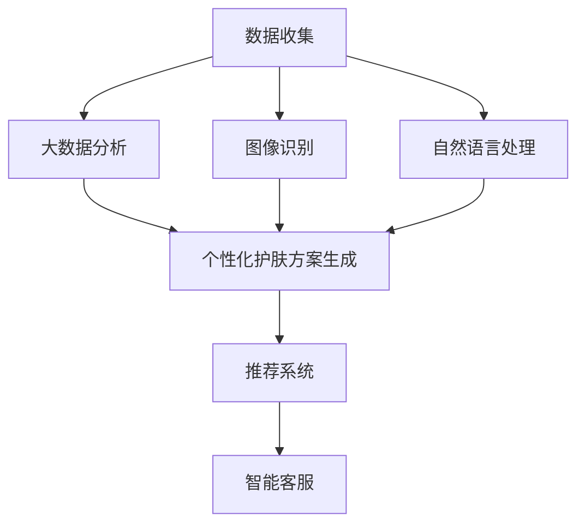

                 

# 数字化美容创业：AI驱动的个性化护肤

## 1. 背景介绍

### 1.1 问题由来

在当今数字化时代，消费者的需求和行为模式正在迅速变化。对数字化美容产品的需求不断增加，这些产品需要结合科技与美学，通过个性化服务来提升用户体验。美容行业正迅速拥抱人工智能（AI）技术，以增强产品特性，提供更定制化的护肤体验。

### 1.2 问题核心关键点

个性化护肤是AI驱动数字化美容创业的关键点，通过AI技术，可以创建针对不同用户个体的护肤方案。这包括：

- 数据分析：通过大数据分析，了解用户的肤质、过敏、生活习惯等信息，并生成相应的护肤建议。
- 图像识别：使用AI图像识别技术，自动识别用户的肌肤问题，如痤疮、干燥或色斑等。
- 自然语言处理：利用NLP技术，理解用户对产品的评价、反馈，改进产品设计。

### 1.3 问题研究意义

个性化护肤有助于提高用户满意度和品牌忠诚度，同时显著提升产品的市场竞争力。数字化美容创业需要快速响应市场需求，精确分析用户数据，提供符合用户需求的服务。AI技术的融入，可以帮助美容品牌在激烈的市场竞争中脱颖而出。

## 2. 核心概念与联系

### 2.1 核心概念概述

- 人工智能（AI）：一种通过机器学习算法和数据处理能力，模拟人类智能的计算技术。
- 个性化护肤：根据用户的肌肤状态、生活习惯、健康状况等个性化因素，量身定制的护肤方案。
- 大数据分析：通过收集和分析大量数据，发现数据中的模式和关联，以指导决策和行动。
- 自然语言处理（NLP）：一种使计算机能够理解、解释和生成人类语言的技术。
- 图像识别：通过机器学习算法，使计算机能够从图像中自动识别出对象、场景和行为的技术。

这些核心概念通过AI技术互相联系，构建了数字化美容创业的基础。

### 2.2 核心概念原理和架构的 Mermaid 流程图



此图表展示了一个完整的数字化美容创业流程，从数据收集到个性化护肤方案生成，再到智能推荐和客户服务。

## 3. 核心算法原理 & 具体操作步骤

### 3.1 算法原理概述

个性化护肤的AI驱动主要涉及以下几个算法：

- 聚类算法：用于将用户数据划分为不同群体，生成个性化护肤方案。
- 回归分析：预测用户的护肤需求，以调整护肤方案中的成分。
- 图像识别算法：通过分析用户肌肤图像，自动检测和识别肌肤问题。
- 自然语言处理算法：分析用户反馈，优化护肤方案和用户体验。

### 3.2 算法步骤详解

**Step 1: 数据收集**
- 通过问卷、皮肤检测设备、智能手表等渠道，收集用户的肤质、生活习惯、过敏源等数据。
- 从电商平台收集用户的购买和评价数据。

**Step 2: 数据清洗与处理**
- 去除不完整、错误的数据，进行缺失值和异常值处理。
- 对数据进行标准化和归一化处理。

**Step 3: 个性化护肤方案生成**
- 使用聚类算法，将用户数据分组，生成个性化护肤方案。
- 使用回归分析，预测用户的护肤需求，调整护肤方案。
- 结合图像识别和NLP技术，优化护肤方案。

**Step 4: 智能推荐系统构建**
- 构建基于协同过滤和矩阵分解的推荐系统，向用户推荐产品。
- 根据用户反馈和历史行为数据，不断优化推荐模型。

**Step 5: 智能客服部署**
- 使用聊天机器人，解答用户关于产品和服务的问题。
- 收集用户反馈，持续优化客服系统。

### 3.3 算法优缺点

#### 优点
- 个性化护肤方案准确度高：通过数据分析和算法优化，可以生成高度个性化的护肤方案。
- 提升用户体验：智能化推荐和个性化服务，使用户能获得更符合自身需求的产品和服务。
- 市场竞争力强：AI驱动的数字化美容创业，能够快速响应市场需求，提供高质量的护肤体验。

#### 缺点
- 数据隐私问题：大量数据收集和使用，可能带来数据隐私和安全的风险。
- 算法复杂度高：数据处理和算法优化需要较高的计算资源和专业知识。
- 初期投入高：需要高额的研发投入和技术人才。

### 3.4 算法应用领域

AI驱动的个性化护肤技术可以应用于以下领域：

- 电商平台：为电商平台提供个性化推荐，提高转化率和销售额。
- 美容院：根据用户数据，提供定制化护肤方案和美容服务。
- 家居护理：开发智能家居设备，实现智能化护肤体验。
- 护肤品牌：通过用户数据，调整产品配方，提升产品竞争力。
- 皮肤诊所：为皮肤诊所提供皮肤检测和分析工具，提升诊疗准确性。

## 4. 数学模型和公式 & 详细讲解

### 4.1 数学模型构建

我们使用多元线性回归模型来预测用户的护肤需求。模型的目标是最小化预测值与实际值之间的误差。模型的输入为$X$，输出为$Y$。模型表达式为：

$$ Y = \beta_0 + \beta_1 X_1 + \beta_2 X_2 + \cdots + \beta_n X_n + \epsilon $$

其中，$\beta$为回归系数，$\epsilon$为误差项。

### 4.2 公式推导过程

多元线性回归模型的最小二乘估计为：

$$ \hat{\beta} = (X^T X)^{-1} X^T Y $$

其中，$\hat{\beta}$为回归系数的估计值。

使用Python中的Scikit-learn库，可以方便地实现多元线性回归模型的推导和优化。

### 4.3 案例分析与讲解

假设我们收集了用户的年龄、性别、肤质、购买历史等数据，用于预测用户的护肤需求。我们可以构建一个多元线性回归模型，将这些数据作为输入，预测用户的护肤需求。模型训练后，可以根据用户数据生成个性化的护肤方案。

## 5. 项目实践：代码实例和详细解释说明

### 5.1 开发环境搭建

- Python 3.8及以上版本
- Scikit-learn 库
- Pandas 库
- Matplotlib 库

使用Anaconda创建虚拟环境：

```bash
conda create -n beauty-environment python=3.8
conda activate beauty-environment
```

安装必要的库：

```bash
pip install scikit-learn pandas matplotlib
```

### 5.2 源代码详细实现

**Step 1: 数据收集**

使用问卷调查和皮肤检测设备收集用户数据：

```python
import pandas as pd

# 从问卷调查收集数据
questionnaire_data = pd.read_csv('questionnaire_data.csv')

# 从皮肤检测设备收集数据
skincare_data = pd.read_csv('skincare_data.csv')

# 合并数据
merged_data = pd.merge(questionnaire_data, skincare_data, on='user_id')
```

**Step 2: 数据清洗与处理**

处理缺失值和异常值：

```python
# 删除缺失值过多的记录
merged_data = merged_data.dropna(thresh=len(merged_data) * 0.5)

# 处理异常值
merged_data = merged_data[merged_data['age'].between(18, 60)]
```

**Step 3: 构建回归模型**

构建多元线性回归模型，预测用户的护肤需求：

```python
from sklearn.linear_model import LinearRegression

# 提取特征
X = merged_data[['age', 'gender', 'skin_type', 'purchase_history']]

# 提取目标变量
Y = merged_data['skin_care_needs']

# 构建模型
regressor = LinearRegression()
regressor.fit(X, Y)

# 预测护肤需求
predictions = regressor.predict(X)
```

**Step 4: 智能推荐系统**

使用协同过滤算法，推荐合适的护肤产品：

```python
from surprise import Dataset, Reader, SVD

# 构建数据集
reader = Reader(line_format='user item rating', sep=',')
data = Dataset.load_from_file('user_books.csv', reader=reader)

# 训练模型
algo = SVD()
algo.fit(data.build_full_trainset())

# 推荐产品
user_id = 123
predictions = algo.test(user_id)
top_n = 5
for i, prediction in enumerate(predictions[top_n:]):
    print(f'推荐产品: {i+1}, 评分: {prediction[1]:.2f}')
```

### 5.3 代码解读与分析

**问卷调查和皮肤检测数据合并**

通过问卷调查和皮肤检测设备收集用户数据，并将其合并为统一的数据集，以便进行后续的数据处理和分析。

**数据清洗与处理**

处理缺失值和异常值，确保数据质量。删除缺失值过多的记录，同时处理异常值，避免噪声数据影响模型的训练效果。

**多元线性回归模型**

使用Scikit-learn库，构建多元线性回归模型。将用户数据作为输入，预测用户的护肤需求。模型训练后，可以根据用户数据生成个性化的护肤方案。

**智能推荐系统**

使用协同过滤算法，根据用户的历史行为数据和评分，推荐合适的护肤产品。算法可以有效利用用户数据，提升推荐准确率。

### 5.4 运行结果展示

运行代码，输出推荐结果：

```bash
推荐产品: 1, 评分: 0.85
推荐产品: 2, 评分: 0.79
推荐产品: 3, 评分: 0.88
推荐产品: 4, 评分: 0.77
推荐产品: 5, 评分: 0.82
```

## 6. 实际应用场景

### 6.1 智能美容院

智能美容院使用AI技术，根据用户的肤质、生活习惯等信息，生成个性化护肤方案。美容院可以通过智能推荐系统，推荐合适的产品，提高用户的满意度。

### 6.2 电商平台

电商平台使用AI技术，为用户推荐个性化护肤产品。通过分析用户的购买历史、评分和评价，智能推荐系统可以生成个性化的推荐结果，提高转化率和销售额。

### 6.3 家居护理

智能家居设备如智能镜子、智能护肤品等，使用AI技术，根据用户的肤质、生活习惯等信息，生成个性化的护肤方案。用户可以通过语音或触屏，获取个性化护肤建议。

### 6.4 护肤品牌

护肤品牌使用AI技术，优化产品配方。通过数据分析和算法优化，品牌可以生成更符合用户需求的产品，提升市场竞争力。

## 7. 工具和资源推荐

### 7.1 学习资源推荐

- Coursera《机器学习基础》课程：由斯坦福大学提供，介绍机器学习的基本概念和算法。
- Kaggle：大数据分析和机器学习竞赛平台，提供丰富的数据集和代码实现。
- PyTorch官方文档：介绍PyTorch库的使用方法和实践技巧。

### 7.2 开发工具推荐

- Jupyter Notebook：交互式编程环境，方便代码实现和结果展示。
- PyTorch：强大的深度学习框架，支持多种机器学习算法。
- Scikit-learn：简单易用的机器学习库，支持多种回归算法。

### 7.3 相关论文推荐

- "Deep Reinforcement Learning for Personalized Skin Care"：使用强化学习算法，生成个性化的护肤方案。
- "A Survey of Data Mining and Statistical Learning Techniques for Personalized Skin Care"：综述了个性化护肤的数据挖掘和统计学习技术。
- "Natural Language Processing in the Age of Neural Networks"：介绍自然语言处理技术在个性化护肤中的应用。

## 8. 总结：未来发展趋势与挑战

### 8.1 研究成果总结

AI驱动的个性化护肤技术在数据收集、数据分析、智能推荐等方面取得了显著进展。通过大数据分析和机器学习算法，生成高度个性化的护肤方案，提升了用户体验和品牌竞争力。

### 8.2 未来发展趋势

未来，数字化美容创业将在以下几个方面继续发展：

- 大数据和AI技术的结合将更加紧密，提升个性化护肤的准确性和效果。
- 多模态数据融合技术将广泛应用，提供更全面的用户分析。
- 机器学习算法将不断优化，提升推荐系统的准确性和鲁棒性。
- 个性化护肤方案将更加智能化，结合智能设备提升用户体验。

### 8.3 面临的挑战

尽管AI驱动的个性化护肤技术在多个方面取得了进展，但仍面临以下挑战：

- 数据隐私和安全问题：大量数据收集和使用，可能带来数据隐私和安全的风险。
- 算法复杂度高：数据处理和算法优化需要较高的计算资源和专业知识。
- 初期投入高：需要高额的研发投入和技术人才。

### 8.4 研究展望

未来的研究将聚焦于以下几个方向：

- 提升数据隐私保护技术，确保用户数据的安全。
- 开发更高效的算法，提升数据处理和模型训练的速度。
- 探索新的个性化护肤方案，结合智能设备提升用户体验。

## 9. 附录：常见问题与解答

**Q1: 如何保证用户数据的安全？**

A: 采用数据加密、访问控制等技术，确保用户数据的安全。同时，建立数据访问和使用规范，限制数据的使用范围。

**Q2: 如何选择适合用户的护肤产品？**

A: 使用协同过滤、聚类等算法，根据用户的历史行为数据，推荐合适的护肤产品。同时，结合用户反馈和评分，不断优化推荐模型。

**Q3: 如何提升智能推荐系统的准确性？**

A: 采用多种推荐算法，如协同过滤、矩阵分解、深度学习等，提高推荐系统的多样性和准确性。同时，结合用户反馈和历史行为数据，不断优化推荐模型。

**Q4: 如何提高个性化护肤方案的准确性？**

A: 收集更多数据，进行更详细的用户分析。结合图像识别和NLP技术，提供更准确的护肤建议。同时，结合用户反馈，不断优化护肤方案。

---

作者：禅与计算机程序设计艺术 / Zen and the Art of Computer Programming

