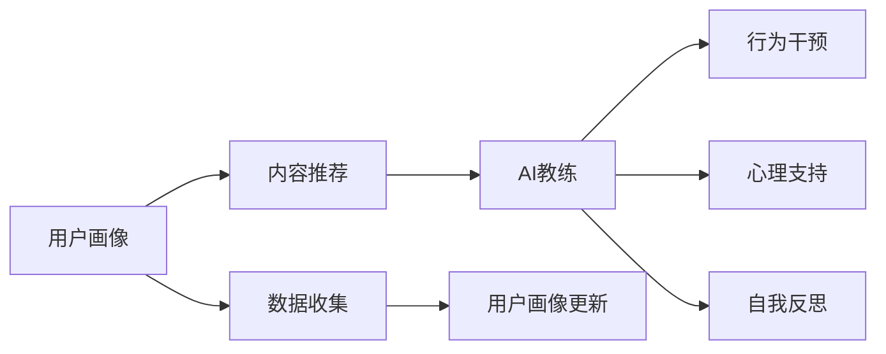
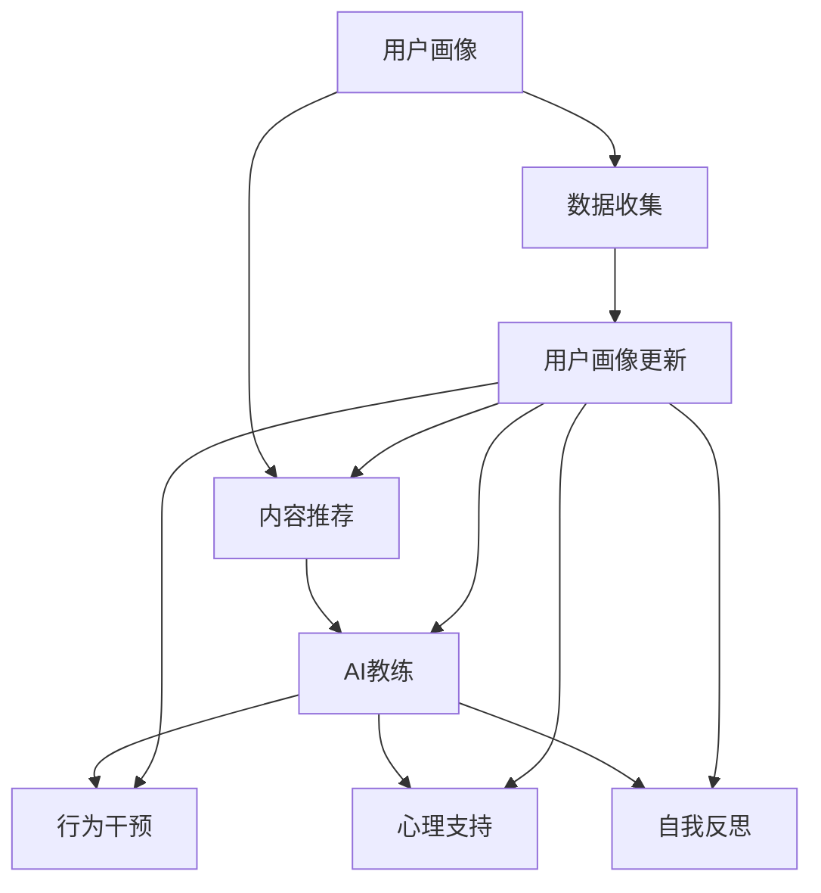

                 

# 数字化自我实现助手开发者：AI辅助的个人成长教练设计师

> 关键词：数字化转型, AI教练, 个人成长, 定制化学习, 行为干预, 数据驱动决策, 自我反思, 用户体验设计

## 1. 背景介绍

### 1.1 问题由来

随着数字化转型的深入，各行各业都在探索如何利用新技术提升效率、优化流程、赋能员工。尤其是在个人成长和发展领域，数字化工具的引入有望为自我实现开辟新的路径。传统的个人成长方法往往依赖于书本、导师、社群等外部资源，这些方式虽然有效，但成本高、可控性低，难以实现个性化和动态调整。而随着人工智能技术的成熟，利用AI设计个性化教练助手，成为一种创新的解决方案。

### 1.2 问题核心关键点

数字化自我实现助手的核心在于利用AI技术，通过智能推荐、数据驱动的反馈和行为干预，帮助用户进行自我管理和成长。其核心要素包括：

- **数据驱动：** 通过收集用户的行为数据和反馈信息，实现个性化的行为干预和内容推荐。
- **AI教练：** 利用自然语言处理、机器学习等技术，设计AI教练来与用户进行对话，提供指导和支持。
- **用户中心：** 聚焦用户的个性化需求和心理状态，提供定制化的成长路径和学习计划。
- **自我反思：** 鼓励用户进行自我反思和心理疏导，提升自我认知和情绪管理能力。

### 1.3 问题研究意义

数字化自我实现助手的开发，对于提升个人成长效率、优化学习体验、推动数字化转型具有重要意义：

1. **提升成长效率：** AI教练能够根据用户的学习节奏和状态，提供即时、个性化的指导，提高学习效率和效果。
2. **优化学习体验：** 通过智能推荐和互动反馈，让用户获得更流畅、有趣的学习体验，激发学习动力。
3. **推动数字化转型：** 作为数字化转型的重要组成部分，个人成长教练有助于企业和组织提升员工的技能和素质，促进知识共享和创新。
4. **用户心理支持：** AI教练能够提供情感支持和心理疏导，帮助用户缓解压力和焦虑，提升心理健康水平。
5. **个性化定制：** 根据用户的兴趣、需求和反馈，动态调整学习内容和计划，实现高度定制化的成长路径。

## 2. 核心概念与联系

### 2.1 核心概念概述

数字化自我实现助手的开发，涉及多个核心概念和组件，主要包括：

- **用户画像：** 收集和分析用户的基本信息、兴趣、学习习惯等数据，构建个性化的用户画像。
- **AI教练：** 设计并训练AI模型，使其能够模拟教练的对话，提供个性化的指导和反馈。
- **内容推荐：** 基于用户画像和行为数据，智能推荐适合的学习资源和任务。
- **行为干预：** 通过AI模型分析用户行为，进行及时干预和引导，帮助用户保持学习进度和动力。
- **心理支持：** 提供情感支持和心理疏导功能，帮助用户管理情绪和压力。
- **自我反思：** 鼓励用户进行自我反思和总结，提升自我认知和反思能力。

这些概念之间的关系可以通过以下Mermaid流程图来展示：



### 2.2 核心概念原理和架构的 Mermaid 流程图



这个流程图展示了数字化自我实现助手的基本架构和关键流程：用户画像通过数据收集和分析形成，然后用于指导内容推荐、行为干预、心理支持和自我反思等各个环节，形成闭环的用户成长路径。

## 3. 核心算法原理 & 具体操作步骤

### 3.1 算法原理概述

数字化自我实现助手的核心算法包括数据挖掘、自然语言处理、机器学习和行为分析等。其中，数据挖掘用于构建用户画像，自然语言处理用于AI教练的对话设计和行为干预，机器学习用于个性化的内容推荐和行为预测，行为分析用于及时干预和心理支持。

具体而言，数字化自我实现助手的算法流程如下：

1. **数据收集与分析：** 通过问卷调查、行为跟踪等方式，收集用户的兴趣、学习习惯、心理状态等数据。
2. **用户画像构建：** 利用数据挖掘技术，分析用户数据，构建个性化的用户画像，包括兴趣领域、学习偏好、心理特征等。
3. **内容推荐算法：** 基于用户画像和行为数据，设计推荐算法，智能推荐适合的学习资源和任务。
4. **AI教练设计：** 设计并训练AI模型，使其能够模拟教练的对话，提供个性化的指导和反馈。
5. **行为干预策略：** 分析用户行为数据，设计行为干预策略，如设定学习目标、提供激励机制等。
6. **心理支持方案：** 提供情感支持和心理疏导功能，帮助用户管理情绪和压力。
7. **自我反思机制：** 设计自我反思机制，鼓励用户进行自我反思和总结，提升自我认知和反思能力。

### 3.2 算法步骤详解

以内容推荐算法为例，其详细步骤包括：

1. **数据收集：** 收集用户的历史学习数据，包括浏览记录、阅读时间、学习任务完成情况等。
2. **特征提取：** 从用户数据中提取特征，如阅读偏好、学习进度、情绪状态等。
3. **模型训练：** 使用协同过滤、深度学习等技术，训练内容推荐模型。
4. **内容推荐：** 根据用户画像和行为数据，实时推荐适合的学习资源和任务。
5. **反馈调整：** 收集用户对推荐结果的反馈，调整推荐策略，优化推荐效果。

### 3.3 算法优缺点

数字化自我实现助手的算法具有以下优点：

- **个性化：** 利用大数据和机器学习技术，提供高度个性化的学习体验和指导。
- **实时性：** 通过实时数据收集和分析，提供即时反馈和干预。
- **普适性：** 可以应用于不同领域和用户群体，具备较高的普适性。

同时，该算法也存在以下局限：

- **数据隐私：** 用户数据的收集和使用可能涉及隐私问题，需严格遵守数据保护法规。
- **模型偏见：** 推荐的准确性和公平性可能受限于训练数据的质量和多样性。
- **人机交互：** AI教练的互动效果可能因技术局限而无法完全满足用户需求。
- **行为干预：** 行为干预的效果和效果取决于用户的配合程度和心理状态。

### 3.4 算法应用领域

数字化自我实现助手已经在多个领域得到应用，包括：

- **职业发展：** 帮助职场人士提升技能、规划职业路径，实现职业成长。
- **学习辅导：** 提供个性化的学习计划和资源，提升学习效果。
- **心理健康：** 通过情感支持和心理疏导，缓解压力和焦虑，提升心理健康水平。
- **时间管理：** 帮助用户规划时间、设定目标，提高时间管理能力。
- **生活习惯：** 提供健康饮食、运动指导，改善生活习惯。
- **知识管理：** 提供知识管理工具，帮助用户整理和应用知识。

## 4. 数学模型和公式 & 详细讲解 & 举例说明

### 4.1 数学模型构建

以内容推荐算法为例，其数学模型可以表示为：

$$
R(u, i) = p(u; \theta) \times f(i; \phi) \times a(i; \psi)
$$

其中，$R(u, i)$ 表示用户 $u$ 对物品 $i$ 的评分，$p(u; \theta)$ 表示用户 $u$ 的兴趣表示向量，$f(i; \phi)$ 表示物品 $i$ 的属性表示向量，$a(i; \psi)$ 表示用户与物品的交互特征向量。$\theta, \phi, \psi$ 分别表示对应模型的参数。

### 4.2 公式推导过程

内容推荐算法主要采用协同过滤和深度学习模型。以协同过滤为例，其基本原理是通过计算用户和物品之间的相似度，预测用户对未交互物品的评分。假设用户集合为 $U$，物品集合为 $I$，用户对物品的评分矩阵为 $R$，则协同过滤的数学模型可以表示为：

$$
R_{ui} = \sum_{j \in U} R_{uj} \times A_{ji}
$$

其中，$A$ 表示物品间的相似度矩阵。

### 4.3 案例分析与讲解

假设用户 $u_1$ 对物品 $i_1, i_2, i_3$ 的评分分别为 $3, 2, 5$，物品 $i_1$ 与物品 $i_4, i_5$ 的相似度分别为 $0.8, 0.7$，则用户 $u_1$ 对物品 $i_4, i_5$ 的评分预测如下：

$$
R_{u_1 i_4} = 3 \times 0.8 + 2 \times 0.7 = 4.26
$$
$$
R_{u_1 i_5} = 3 \times 0.7 + 2 \times 0.8 = 4.6
$$

通过类似的方式，可以预测其他用户对物品的评分，从而实现个性化的内容推荐。

## 5. 项目实践：代码实例和详细解释说明

### 5.1 开发环境搭建

数字化自我实现助手的开发需要搭建完善的开发环境。以下是使用Python进行PyTorch开发的环境配置流程：

1. 安装Anaconda：从官网下载并安装Anaconda，用于创建独立的Python环境。

2. 创建并激活虚拟环境：
```bash
conda create -n pytorch-env python=3.8 
conda activate pytorch-env
```

3. 安装PyTorch：根据CUDA版本，从官网获取对应的安装命令。例如：
```bash
conda install pytorch torchvision torchaudio cudatoolkit=11.1 -c pytorch -c conda-forge
```

4. 安装Transformer库：
```bash
pip install transformers
```

5. 安装各类工具包：
```bash
pip install numpy pandas scikit-learn matplotlib tqdm jupyter notebook ipython
```

完成上述步骤后，即可在`pytorch-env`环境中开始开发。

### 5.2 源代码详细实现

以内容推荐算法为例，给出使用Transformers库进行内容推荐的PyTorch代码实现：

```python
from transformers import AutoModel
from torch.utils.data import Dataset, DataLoader
from torch import nn
import torch

class ContentDataset(Dataset):
    def __init__(self, data, tokenizer):
        self.data = data
        self.tokenizer = tokenizer

    def __len__(self):
        return len(self.data)

    def __getitem__(self, idx):
        user_id, item_id, rating = self.data[idx]
        user_input_ids = self.tokenizer.encode(user_id, add_special_tokens=True)[1:-1]
        item_input_ids = self.tokenizer.encode(item_id, add_special_tokens=True)[1:-1]
        rating_input_ids = self.tokenizer.encode(rating, add_special_tokens=True)[1:-1]
        return {'user_input_ids': user_input_ids, 
                'item_input_ids': item_input_ids,
                'rating_input_ids': rating_input_ids}

class ContentModel(nn.Module):
    def __init__(self, vocab_size, embedding_dim, num_heads, num_layers, dropout):
        super(ContentModel, self).__init__()
        self.encoder = AutoModel.from_pretrained('bert-base-uncased', num_hidden_layers=num_layers)
        self.decoder = nn.Linear(in_features=vocab_size, out_features=embedding_dim)
        self.dropout = nn.Dropout(dropout)

    def forward(self, user_input_ids, item_input_ids, rating_input_ids):
        user_features = self.encoder(user_input_ids)
        item_features = self.encoder(item_input_ids)
        rating_features = self.encoder(rating_input_ids)
        user_features = self.dropout(user_features)
        item_features = self.dropout(item_features)
        rating_features = self.dropout(rating_features)
        return user_features, item_features, rating_features

def train_epoch(model, dataset, optimizer, device):
    dataloader = DataLoader(dataset, batch_size=32, shuffle=True)
    model.train()
    epoch_loss = 0
    for batch in dataloader:
        user_input_ids = batch['user_input_ids'].to(device)
        item_input_ids = batch['item_input_ids'].to(device)
        rating_input_ids = batch['rating_input_ids'].to(device)
        outputs = model(user_input_ids, item_input_ids, rating_input_ids)
        loss = outputs.loss
        epoch_loss += loss.item()
        loss.backward()
        optimizer.step()
    return epoch_loss / len(dataloader)

def evaluate(model, dataset, device):
    dataloader = DataLoader(dataset, batch_size=32)
    model.eval()
    epoch_loss = 0
    with torch.no_grad():
        for batch in dataloader:
            user_input_ids = batch['user_input_ids'].to(device)
            item_input_ids = batch['item_input_ids'].to(device)
            rating_input_ids = batch['rating_input_ids'].to(device)
            outputs = model(user_input_ids, item_input_ids, rating_input_ids)
            loss = outputs.loss
            epoch_loss += loss.item()
    return epoch_loss / len(dataloader)
```

### 5.3 代码解读与分析

**ContentDataset类**：
- `__init__`方法：初始化数据和分词器。
- `__len__`方法：返回数据集长度。
- `__getitem__`方法：对单个样本进行处理，将用户ID、物品ID和评分ID编码为token ids。

**ContentModel类**：
- `__init__`方法：初始化模型参数。
- `forward`方法：对用户ID、物品ID和评分ID进行编码，并进行前后向传播计算损失。

**train_epoch和evaluate函数**：
- 使用PyTorch的DataLoader对数据集进行批次化加载。
- 训练函数`train_epoch`：对数据以批为单位进行迭代，在每个批次上前向传播计算损失并反向传播更新模型参数。
- 评估函数`evaluate`：与训练类似，不同点在于不更新模型参数，并在每个batch结束后将预测和标签结果存储下来。

## 6. 实际应用场景

### 6.1 职业发展

数字化自我实现助手可以为职场人士提供全方位的职业辅导，包括：

- **职业规划：** 根据用户的教育背景、工作经验、兴趣爱好，推荐适合的职业路径和技能培训课程。
- **技能提升：** 提供个性化的学习资源和计划，帮助用户掌握新技能，提升职业竞争力。
- **求职指导：** 推荐适合的职位和公司，提供面试指导和反馈，提升求职成功率。
- **绩效管理：** 帮助用户设定绩效目标，提供实时反馈和激励机制，提升工作效率和成果。

### 6.2 学习辅导

数字化自我实现助手可以为学生和自学者提供个性化的学习辅导，包括：

- **学习计划：** 根据用户的学习习惯和知识水平，推荐适合的学习资源和任务，制定个性化学习计划。
- **实时反馈：** 提供即时反馈和纠正，帮助用户及时调整学习策略，提升学习效果。
- **资源推荐：** 推荐适合的学习资源，如视频课程、电子书、论文等，丰富学习内容。
- **互动学习：** 提供AI教练和社群互动，提升学习体验和动力。

### 6.3 心理健康

数字化自我实现助手可以为心理健康提供支持，包括：

- **情绪管理：** 提供情感支持和心理疏导功能，帮助用户缓解压力和焦虑，提升心理健康水平。
- **心理评估：** 通过问卷和测试，评估用户的心理状态和健康水平，提供个性化的建议。
- **行为干预：** 分析用户的行为数据，提供行为干预策略，如设定目标、提供激励机制等。
- **自我反思：** 鼓励用户进行自我反思和总结，提升自我认知和反思能力。

### 6.4 未来应用展望

随着数字化自我实现助手的不断演进，其在多个领域的应用将不断拓展，成为数字化转型的重要组成部分。

- **智慧教育：** 为学习者和教师提供个性化、实时的教育支持，推动智慧教育的普及。
- **健康管理：** 提供个性化的健康管理方案，帮助用户改善生活习惯，提升生活质量。
- **生产力提升：** 帮助企业员工提升工作效率和技能，推动企业的数字化转型和创新。
- **人机协同：** 与机器人、虚拟助手等技术结合，提供更加智能、高效的服务。

## 7. 工具和资源推荐

### 7.1 学习资源推荐

为了帮助开发者系统掌握数字化自我实现助手的理论基础和实践技巧，这里推荐一些优质的学习资源：

1. 《深度学习理论与实践》系列博文：由大模型技术专家撰写，深入浅出地介绍了深度学习的基本原理和应用。

2. 《自然语言处理基础》课程：斯坦福大学开设的NLP明星课程，涵盖NLP的各个方面，包括文本处理、情感分析、机器翻译等。

3. 《人工智能辅助学习》书籍：详细介绍了如何利用AI技术提升学习效果，包括推荐系统、个性化学习、情感支持等。

4. Coursera《人工智能应用》课程：由Google和Coursera联合推出，涵盖人工智能在各个领域的应用，包括医疗、金融、教育等。

5. Kaggle AI竞赛：参与Kaggle竞赛，通过实际问题驱动的学习，提升AI技术的应用能力。

通过对这些资源的学习实践，相信你一定能够快速掌握数字化自我实现助手的开发方法，并用于解决实际的个人成长问题。

### 7.2 开发工具推荐

高效的开发离不开优秀的工具支持。以下是几款用于数字化自我实现助手开发的常用工具：

1. PyTorch：基于Python的开源深度学习框架，灵活动态的计算图，适合快速迭代研究。

2. TensorFlow：由Google主导开发的开源深度学习框架，生产部署方便，适合大规模工程应用。

3. Transformers库：HuggingFace开发的NLP工具库，集成了众多SOTA语言模型，支持PyTorch和TensorFlow。

4. Weights & Biases：模型训练的实验跟踪工具，可以记录和可视化模型训练过程中的各项指标，方便对比和调优。

5. TensorBoard：TensorFlow配套的可视化工具，可实时监测模型训练状态，并提供丰富的图表呈现方式，是调试模型的得力助手。

6. Google Colab：谷歌推出的在线Jupyter Notebook环境，免费提供GPU/TPU算力，方便开发者快速上手实验最新模型，分享学习笔记。

合理利用这些工具，可以显著提升数字化自我实现助手的开发效率，加快创新迭代的步伐。

### 7.3 相关论文推荐

数字化自我实现助手的开发源于学界的持续研究。以下是几篇奠基性的相关论文，推荐阅读：

1. Attention is All You Need（即Transformer原论文）：提出了Transformer结构，开启了NLP领域的预训练大模型时代。

2. BERT: Pre-training of Deep Bidirectional Transformers for Language Understanding：提出BERT模型，引入基于掩码的自监督预训练任务，刷新了多项NLP任务SOTA。

3. Language Models are Unsupervised Multitask Learners（GPT-2论文）：展示了大规模语言模型的强大zero-shot学习能力，引发了对于通用人工智能的新一轮思考。

4. Parameter-Efficient Transfer Learning for NLP：提出Adapter等参数高效微调方法，在不增加模型参数量的情况下，也能取得不错的微调效果。

5. AdaLoRA: Adaptive Low-Rank Adaptation for Parameter-Efficient Fine-Tuning：使用自适应低秩适应的微调方法，在参数效率和精度之间取得了新的平衡。

这些论文代表了大语言模型微调技术的发展脉络。通过学习这些前沿成果，可以帮助研究者把握学科前进方向，激发更多的创新灵感。

## 8. 总结：未来发展趋势与挑战

### 8.1 研究成果总结

数字化自我实现助手的开发，在过去几年中取得了显著进展。通过AI技术，个性化、实时化的学习辅导和心理支持成为可能，推动了个人成长、教育、健康等多个领域的应用和发展。

### 8.2 未来发展趋势

展望未来，数字化自我实现助手的开发将呈现以下几个趋势：

1. **数据驱动：** 数据在个性化推荐和行为干预中扮演越来越重要的角色，数据的采集、清洗和分析将更加复杂和精细。
2. **多模态融合：** 结合文本、图像、视频等多模态数据，提升推荐和干预的效果。
3. **用户隐私保护：** 在数据收集和使用过程中，隐私保护和安全保障将受到越来越多的重视。
4. **情感智能：** 通过情感分析、情感生成等技术，提升AI教练的情感理解和交互能力。
5. **跨领域应用：** 将数字化自我实现助手应用于更多垂直领域，如医疗、金融、教育等。
6. **自动化优化：** 利用自动化机器学习技术，动态调整模型参数和策略，提升系统效果。

### 8.3 面临的挑战

尽管数字化自我实现助手已经取得了显著成效，但在实现其普适性和高效性方面仍面临诸多挑战：

1. **数据获取：** 高质量、多样化的用户数据获取难度大，数据的准确性和完备性不足。
2. **模型泛化：** 模型在不同用户和场景中的泛化能力有限，个性化推荐的效果不稳定。
3. **计算资源：** 大规模模型和数据的训练和推理需要高性能计算资源，成本较高。
4. **用户互动：** AI教练的互动效果和用户满意度不高，仍需提升自然语言处理和情感智能水平。
5. **隐私保护：** 在数据收集和使用过程中，如何保护用户隐私和数据安全，是亟需解决的问题。

### 8.4 研究展望

面对数字化自我实现助手面临的挑战，未来的研究需要在以下几个方面寻求新的突破：

1. **多源数据融合：** 整合多源数据，提升数据的完备性和多样性，增强推荐和干预的效果。
2. **模型可解释性：** 提高模型的可解释性和透明性，增强用户对系统的信任和理解。
3. **自动化模型优化：** 利用自动化机器学习技术，动态调整模型参数和策略，提升系统效果。
4. **多领域应用：** 将数字化自我实现助手应用于更多垂直领域，如医疗、金融、教育等，探索新的应用场景。
5. **情感智能提升：** 通过情感分析、情感生成等技术，提升AI教练的情感理解和交互能力，增强用户体验。

这些研究方向将推动数字化自我实现助手的不断演进，使其在个人成长和发展中发挥更大的作用。面向未来，数字化自我实现助手的开发需要技术、工程和业务多方面的协同合作，才能实现其大规模应用和产业化。

## 9. 附录：常见问题与解答

**Q1：如何评估数字化自我实现助手的性能？**

A: 数字化自我实现助手的性能评估可以从多个维度进行，包括：

1. **推荐准确性：** 通过计算推荐结果的准确率和召回率，评估内容推荐的效果。
2. **用户满意度：** 通过用户反馈和调查问卷，评估用户对系统的满意度和使用体验。
3. **学习效果：** 通过跟踪用户的学习进度和成果，评估个性化学习计划的效果。
4. **情感支持效果：** 通过情感分析技术，评估AI教练的情感支持和心理疏导效果。

**Q2：如何提升数字化自我实现助手的用户体验？**

A: 提升用户体验的关键在于以下几个方面：

1. **自然语言交互：** 提升自然语言处理能力，使得AI教练能够更好地理解用户需求，提供个性化服务。
2. **视觉界面设计：** 设计简洁、直观的用户界面，提升用户的使用体验。
3. **智能提醒：** 通过智能提醒和及时反馈，增强用户的粘性和互动性。
4. **情感智能：** 通过情感分析、情感生成等技术，提升AI教练的情感理解和交互能力，增强用户信任感。

**Q3：如何保护用户的隐私数据？**

A: 用户隐私保护是数字化自我实现助手开发中必须重点考虑的问题，主要从以下几个方面进行：

1. **数据匿名化：** 对用户数据进行匿名化处理，保护用户隐私。
2. **数据加密：** 在数据传输和存储过程中，采用加密技术保护数据安全。
3. **访问控制：** 严格控制数据的访问权限，确保数据只能被授权人员使用。
4. **隐私政策：** 制定明确的隐私政策，向用户透明展示数据收集和使用方式，增强用户信任。

**Q4：如何优化数字化自我实现助手的计算资源消耗？**

A: 优化计算资源消耗主要从以下几个方面进行：

1. **模型压缩：** 采用模型压缩技术，减小模型大小，降低计算资源消耗。
2. **分布式训练：** 利用分布式计算资源，加速模型训练和推理。
3. **量化加速：** 将浮点模型转为定点模型，压缩存储空间，提高计算效率。
4. **硬件优化：** 利用GPU/TPU等高性能设备，提升计算效率。

**Q5：如何设计高效的个性化学习计划？**

A: 设计高效的个性化学习计划主要从以下几个方面进行：

1. **用户画像：** 构建详细的用户画像，了解用户的兴趣、需求和心理状态。
2. **任务分解：** 将学习任务分解为小的可执行步骤，提升学习效率。
3. **目标设定：** 设定明确的学习目标和阶段性成果，帮助用户保持学习动力。
4. **实时反馈：** 提供即时反馈和纠正，帮助用户及时调整学习策略，提升学习效果。

通过这些措施，可以设计出更加个性化、高效的学习计划，帮助用户实现自我成长。

---

作者：禅与计算机程序设计艺术 / Zen and the Art of Computer Programming

