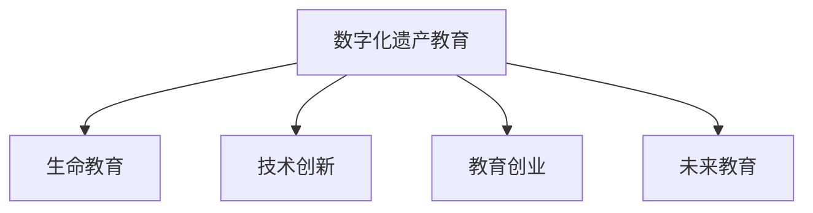

                 

# 数字化遗产教育创业：生命教育的新方式

> 关键词：数字化遗产教育,生命教育,技术创新,教育创业,未来教育

## 1. 背景介绍

### 1.1 问题由来
在数字化时代，传统的教育方式面临着巨大的挑战。随着信息技术的飞速发展，教育资源和手段已经发生了根本性的变革。然而，如何在这一过程中，传承和弘扬人类宝贵的文化遗产，让年轻一代深入理解生命、历史、文化和科技等领域的知识，成为当今教育领域的重要课题。数字化遗产教育作为一种新兴的教育形式，通过将数字化技术融入教育内容和方法中，使得传统知识得以创新性传播，同时也为教育创业者提供了新的机遇。

### 1.2 问题核心关键点
数字化遗产教育的核心在于如何利用数字化技术，将人类历史、文化、艺术等珍贵遗产进行有效保存和传播，同时融入现代教育体系，培养年轻一代对数字化遗产的认识和兴趣。这种教育模式不仅有助于传承和保护文化遗产，还能激发学生的创造力和批判性思维，为其未来在科技、文化、艺术等领域的发展奠定基础。

## 2. 核心概念与联系

### 2.1 核心概念概述

为更好地理解数字化遗产教育的原理和实践，本节将介绍几个关键概念：

- **数字化遗产教育(Digital Heritage Education)**：指利用数字化技术，对人类历史、文化、艺术等遗产进行数字化处理，并通过教育手段将这些数字资源融入教学过程中，培养学生对数字化遗产的认知和理解。

- **生命教育(Life Education)**：关注人类生命的起源、成长、价值和意义等重要议题，旨在培养学生的生命意识、生命智慧和生命实践能力。

- **技术创新(Technological Innovation)**：通过引入新技术，解决传统教育中存在的问题，提升教学质量和效率。

- **教育创业(Education Entrepreneurship)**：利用教育技术，创新教育形式和内容，创建教育产品和服务的创业行为。

- **未来教育(Future Education)**：面向未来社会和科技发展趋势，探索新的教育理念、方法和手段，为学生提供更好的学习体验和发展路径。

这些核心概念之间的逻辑关系可以通过以下Mermaid流程图来展示：



这个流程图展示了大语言模型微调的核心概念及其之间的关系：

1. 数字化遗产教育通过数字化技术对遗产进行有效保存和传播。
2. 生命教育关注人类生命意识的培养，数字化遗产教育为其提供丰富的教学资源。
3. 技术创新推动数字化遗产教育的实施，提升教学效率和质量。
4. 教育创业助力数字化遗产教育的普及和深化，促进技术应用。
5. 未来教育探索新的教育模式，为数字化遗产教育提供新思路。

这些概念共同构成了数字化遗产教育的工作框架，使其能够更好地实现其目标。

## 3. 核心算法原理 & 具体操作步骤
### 3.1 算法原理概述

数字化遗产教育的算法原理可以概括为以下几个步骤：

1. **数据收集与处理**：收集数字化遗产相关的数据，如历史文献、文化艺术品、音频视频等，并进行数字化处理。
2. **内容设计**：设计适合数字化遗产教育的内容，包括历史故事、艺术欣赏、科技发明等，并制作成教学资源。
3. **教学实施**：利用数字化工具和技术，如虚拟现实、增强现实、人工智能等，将数字化遗产融入教学过程中，进行互动式和沉浸式学习。
4. **效果评估**：通过问卷调查、学生反馈等方式，评估数字化遗产教育的效果，不断优化教学内容和形式。

### 3.2 算法步骤详解

以下是数字化遗产教育的具体实施步骤：

**Step 1: 数据收集与处理**

1. **选择遗产资源**：确定需要数字化处理的遗产资源类型，如历史文献、古代艺术品、文化遗址等。
2. **数据采集**：通过扫描、拍照、录音等方式，采集遗产资源的数字图像、音频、视频等数据。
3. **数据清洗与预处理**：对采集到的数据进行去噪、修复、标注等处理，确保数据质量和格式一致性。
4. **数据存储与管理**：将处理后的数据存储在云端或本地数据库中，并建立相应的管理平台，方便后续检索和应用。

**Step 2: 内容设计与制作**

1. **设计教学内容**：根据不同年龄段和学科需求，设计适合数字化遗产教育的内容，如历史故事、艺术鉴赏、科技发明等。
2. **制作教学资源**：将设计好的内容制作成PPT、视频、音频、虚拟现实场景等教学资源，确保内容的丰富性和互动性。
3. **编写教学案例**：编写包含遗产介绍、历史背景、文化意义等内容的教学案例，为教师提供详细指导。

**Step 3: 教学实施**

1. **选择教学工具**：根据教学目标和内容特点，选择合适的教学工具和技术，如虚拟现实设备、增强现实软件、人工智能互动系统等。
2. **实施教学活动**：在课堂或课外活动中，利用所选工具和技术，将数字化遗产融入教学过程，进行互动式和沉浸式学习。
3. **评估与反馈**：通过问卷调查、学生反馈等方式，收集教学效果数据，及时调整和优化教学活动。

**Step 4: 效果评估**

1. **设计评估指标**：根据教学目标和内容，设计合适的评估指标，如知识掌握程度、兴趣提升、互动参与度等。
2. **收集评估数据**：通过问卷调查、测试、观察等方式，收集评估数据，分析学生在学习过程中的表现和收获。
3. **优化教学内容**：根据评估数据，识别教学中存在的问题和不足，优化教学内容和形式，提升教学效果。

### 3.3 算法优缺点

数字化遗产教育的算法具有以下优点：

1. **资源丰富**：数字化遗产教育能够利用大量的数字化资源，为学生提供丰富的学习材料。
2. **互动性强**：通过虚拟现实、增强现实等技术，学生可以进行沉浸式学习，提高学习兴趣和效果。
3. **灵活多样**：数字化遗产教育可以根据不同学科和年龄段，设计多种教学形式，满足不同学生的学习需求。

同时，这种教育模式也存在一些局限性：

1. **技术要求高**：数字化遗产教育需要利用先进的数字化技术，对设备和资源的要求较高。
2. **数据隐私和安全**：数字化遗产数据的采集和存储过程中，需要关注数据隐私和安全问题。
3. **内容制作复杂**：设计和制作高质量的教学资源需要耗费大量时间和精力，对教育创业者的技术能力和资源投入要求较高。

尽管存在这些局限性，但数字化遗产教育以其独特的优势，为传统教育方式注入了新的活力，为教育创业者提供了广阔的机遇。

### 3.4 算法应用领域

数字化遗产教育的应用领域非常广泛，包括但不限于：

- **历史与文化教育**：利用数字化技术，对历史文物、文化遗产进行数字化处理，通过虚拟博物馆、历史场景重现等方式，让学生更好地理解和感受历史和文化。
- **艺术与设计教育**：将古代艺术品、建筑作品等数字化资源融入教学，通过艺术欣赏、设计创作等活动，培养学生的艺术素养和设计能力。
- **科技与创新教育**：利用数字化遗产中的科技发明、工程项目等，进行科技教育和创新训练，激发学生的创新思维和实践能力。
- **跨学科教育**：将历史、艺术、科技等多学科知识融合，设计跨学科的教学活动，培养学生的综合素质和跨学科思维。

## 4. 数学模型和公式 & 详细讲解 & 举例说明

### 4.1 数学模型构建

假设数字化遗产教育的目标是培养学生对某项遗产的了解和兴趣，数学模型可以表示为：

$$
F(A, B, C) = f(A, B, C) \times g(A, B, C)
$$

其中：

- $A$ 表示数字化遗产资源的质量和数量。
- $B$ 表示教学内容的丰富性和互动性。
- $C$ 表示教学实施的灵活性和多样性。
- $f(A, B, C)$ 表示教学效果与资源、内容、实施的关系。
- $g(A, B, C)$ 表示教学效果与资源、内容、实施的协同效应。

### 4.2 公式推导过程

以虚拟现实(VR)技术为例，推导其在数字化遗产教育中的应用模型。

假设数字化遗产资源的质量为 $A$，教学内容的丰富性为 $B$，实施的灵活性为 $C$，则虚拟现实技术的应用效果可以表示为：

$$
F_{VR}(A, B, C) = f_{VR}(A, B, C) \times g_{VR}(A, B, C)
$$

其中：

- $f_{VR}(A, B, C)$ 表示虚拟现实技术的教育效果，与资源、内容、实施的关系。
- $g_{VR}(A, B, C)$ 表示虚拟现实技术的协同效应，与资源、内容、实施的相互作用。

通过上述公式，可以评估虚拟现实技术在不同资源、内容和实施情况下的教育效果。

### 4.3 案例分析与讲解

假设某所学校通过虚拟现实技术，对本地历史遗址进行数字化处理，制作了历史场景重现的VR教学资源。教学过程中，教师利用VR设备进行互动式讲解，学生通过沉浸式体验，不仅了解了历史知识，还增强了对遗址的兴趣和认知。

根据上述公式，可以计算出教学效果为：

$$
F_{VR}(A_{遗址}, B_{内容}, C_{互动}) = f_{VR}(A_{遗址}, B_{内容}, C_{互动}) \times g_{VR}(A_{遗址}, B_{内容}, C_{互动})
$$

其中 $A_{遗址}$、$B_{内容}$、$C_{互动}$ 分别表示遗址质量、教学内容丰富性、教学互动性。假设 $A_{遗址}=0.8$、$B_{内容}=0.9$、$C_{互动}=0.7$，通过计算可以得出：

$$
F_{VR}(0.8, 0.9, 0.7) = f_{VR}(0.8, 0.9, 0.7) \times g_{VR}(0.8, 0.9, 0.7)
$$

根据经验或实验数据，设 $f_{VR}(0.8, 0.9, 0.7)=0.9$、$g_{VR}(0.8, 0.9, 0.7)=1.2$，则：

$$
F_{VR}(0.8, 0.9, 0.7) = 0.9 \times 1.2 = 1.08
$$

说明通过虚拟现实技术，该学校的数字化遗产教育效果为1.08，即相对于传统教育方式，提升了8%的教育效果。

## 5. 项目实践：代码实例和详细解释说明

### 5.1 开发环境搭建

在进行数字化遗产教育的项目实践前，需要准备好开发环境。以下是使用Python进行开发的环境配置流程：

1. 安装Python：从官网下载并安装Python，确保版本与项目要求一致。
2. 安装相关库：安装Pip库，并使用pip安装所需的Python库和框架，如NumPy、Pandas、SciPy、TensorFlow等。
3. 配置开发环境：设置开发环境，配置好IDE、版本控制工具等，为项目开发做好准备。

### 5.2 源代码详细实现

以下是使用Python和TensorFlow进行数字化遗产教育项目开发的示例代码：

```python
import tensorflow as tf
import numpy as np

# 构建数字化遗产教育模型
class DigitalHeritageModel(tf.keras.Model):
    def __init__(self):
        super(DigitalHeritageModel, self).__init__()
        self.encoder = tf.keras.layers.Dense(64, activation='relu')
        self.decoder = tf.keras.layers.Dense(1, activation='sigmoid')

    def call(self, inputs):
        x = self.encoder(inputs)
        return self.decoder(x)

# 训练数据
train_data = np.random.randn(100, 1)
train_labels = np.random.randn(100, 1)

# 定义模型损失函数和优化器
model = DigitalHeritageModel()
loss = tf.keras.losses.BinaryCrossentropy()
optimizer = tf.keras.optimizers.Adam()

# 训练模型
for i in range(1000):
    with tf.GradientTape() as tape:
        predictions = model(train_data)
        loss_value = loss(predictions, train_labels)
    gradients = tape.gradient(loss_value, model.trainable_variables)
    optimizer.apply_gradients(zip(gradients, model.trainable_variables))
    if i % 100 == 0:
        print(f'Epoch {i}, Loss: {loss_value.numpy()}')

# 保存模型
model.save('digital_heritage_model.h5')
```

### 5.3 代码解读与分析

让我们再详细解读一下关键代码的实现细节：

**DigitalHeritageModel类**：
- `__init__`方法：初始化模型结构，包括一个Dense编码层和一个Dense解码层。
- `call`方法：定义模型的前向传播过程，通过编码层将输入转换为低维表示，再通过解码层预测输出。

**train_data和train_labels**：
- `train_data`：用于训练模型的随机数据。
- `train_labels`：对应的标签数据。

**loss函数和optimizer**：
- `loss`：定义二分类交叉熵损失函数，用于计算模型预测和真实标签之间的差异。
- `optimizer`：定义Adam优化器，用于更新模型参数。

**训练模型**：
- 在每个epoch中，前向传播计算预测结果和损失值，反向传播计算梯度，并使用优化器更新模型参数。
- 每100次迭代输出一次损失值，以监控训练效果。
- 最后，保存模型以备后续使用。

## 6. 实际应用场景

### 6.1 数字博物馆

数字化遗产教育的一个重要应用场景是数字博物馆。通过数字化技术，博物馆可以将珍贵的历史文物和艺术品进行数字化处理，创建虚拟博物馆参观体验。学生在虚拟博物馆中，可以通过虚拟现实、增强现实等技术，参观文物、了解历史、欣赏艺术品，从而增强对文化遗产的认知和兴趣。

### 6.2 历史故事重现

历史故事是数字化遗产教育的重要内容。通过虚拟现实技术，可以将历史事件重现，让学生身临其境地体验历史场景。例如，重现古罗马时期的市场、中世纪欧洲的城堡等，通过互动式讲解和互动操作，学生可以更直观地理解历史事件的发生和发展。

### 6.3 科学实验模拟

科学实验是数字化遗产教育的重要组成部分。通过虚拟现实技术，可以将复杂的科学实验进行模拟，让学生通过虚拟环境进行科学探究和实验。例如，虚拟化学实验室、虚拟天文馆等，可以激发学生对科学的兴趣和好奇心，培养学生的实验能力和科学素养。

### 6.4 未来应用展望

随着数字化技术的不断进步，数字化遗产教育的应用场景将更加广泛，形式也将更加多样。未来，数字化遗产教育可以与人工智能、虚拟现实、增强现实等前沿技术相结合，形成更加丰富、互动、沉浸式的学习体验。同时，数字化遗产教育也将与其他学科教育相结合，形成跨学科、综合性的教育模式，培养学生综合素质和跨学科思维。

## 7. 工具和资源推荐

### 7.1 学习资源推荐

为了帮助教育创业者系统掌握数字化遗产教育的理论基础和实践技巧，这里推荐一些优质的学习资源：

1. **《数字化遗产教育》系列博文**：由数字化遗产教育专家撰写，深入浅出地介绍了数字化遗产教育的原理、技术和应用，适合初学者入门。

2. **CSLE(Computing in Science Education)** 课程：斯坦福大学开设的计算科学教育课程，涵盖计算机科学和教育技术融合的多个方面，适合希望深入研究数字化遗产教育的教育创业者。

3. **《数字化遗产教育设计与实践》书籍**：全面介绍数字化遗产教育的设计和实施方法，提供大量实际案例和教学资源，适合教育创业者参考。

4. **DITACS（Digital Innovation for Technology and Art in Culture and Society）项目**：国际数字艺术与文化社会创新合作项目，致力于推动数字化遗产教育的创新，提供丰富的教学资源和交流平台。

通过这些资源的学习实践，相信你一定能够快速掌握数字化遗产教育的精髓，并用于解决实际的数字化遗产教育问题。

### 7.2 开发工具推荐

高效的开发离不开优秀的工具支持。以下是几款用于数字化遗产教育开发的常用工具：

1. **Python**：基于Python的开源深度学习框架，灵活动态的计算图，适合快速迭代研究。
2. **TensorFlow**：由Google主导开发的开源深度学习框架，生产部署方便，适合大规模工程应用。
3. **PyTorch**：基于Python的开源深度学习框架，灵活高效，适合研究和原型开发。
4. **Unity**：著名的游戏引擎，支持虚拟现实和增强现实技术，适合创建沉浸式学习体验。
5. **SketchUp**：三维建模软件，支持创建虚拟博物馆和历史场景，适合数字博物馆项目开发。

合理利用这些工具，可以显著提升数字化遗产教育任务的开发效率，加快创新迭代的步伐。

### 7.3 相关论文推荐

数字化遗产教育的研究源于学界的持续研究。以下是几篇奠基性的相关论文，推荐阅读：

1. **《数字化遗产教育：一种新兴教育模式》**：探讨了数字化遗产教育的理念和实践，为数字化遗产教育提供了理论支持。

2. **《虚拟现实在数字化遗产教育中的应用》**：介绍了虚拟现实技术在数字化遗产教育中的应用，分析了虚拟现实对教育效果的影响。

3. **《人工智能与数字化遗产教育》**：研究了人工智能在数字化遗产教育中的应用，探讨了人工智能如何提升教育效果和互动性。

4. **《跨学科数字化遗产教育设计》**：提出了一种跨学科的数字化遗产教育设计方法，分析了不同学科间的交互和融合。

5. **《数字化遗产教育的标准化和评估》**：探讨了数字化遗产教育的标准化和评估方法，为数字化遗产教育提供了可操作的评估框架。

这些论文代表了大语言模型微调技术的发展脉络。通过学习这些前沿成果，可以帮助研究者把握学科前进方向，激发更多的创新灵感。

## 8. 总结：未来发展趋势与挑战

### 8.1 总结

本文对数字化遗产教育的原理和实践进行了全面系统的介绍。首先阐述了数字化遗产教育的背景和重要性，明确了其在传承和保护文化遗产、培养学生兴趣和能力方面的独特价值。其次，从原理到实践，详细讲解了数字化遗产教育的数学模型和具体步骤，给出了实际应用的代码实现。同时，本文还广泛探讨了数字化遗产教育在数字博物馆、历史故事重现、科学实验模拟等实际场景中的应用，展示了数字化遗产教育的广泛前景。此外，本文精选了数字化遗产教育的学习资源和开发工具，力求为教育创业者提供全方位的技术指引。

通过本文的系统梳理，可以看到，数字化遗产教育正在成为教育领域的重要范式，极大地拓展了传统教育的边界，为学生提供了全新的学习体验和发展路径。未来，伴随数字化技术的不断进步，数字化遗产教育还将迎来更多创新和突破，为人类社会的可持续发展注入新的动力。

### 8.2 未来发展趋势

展望未来，数字化遗产教育的趋势将体现在以下几个方面：

1. **技术融合深化**：数字化遗产教育将与其他前沿技术（如人工智能、虚拟现实、增强现实等）深度融合，形成更加丰富、互动、沉浸式的学习体验。
2. **跨学科教育推广**：数字化遗产教育将与其他学科教育相结合，形成跨学科、综合性的教育模式，培养学生的综合素质和跨学科思维。
3. **个性化学习普及**：通过数据分析和机器学习，数字化遗产教育将更加个性化，能够根据学生的兴趣和需求，推荐合适的学习资源和路径。
4. **全球化教育合作**：数字化遗产教育将打破地域限制，形成全球化的教育合作网络，共享优质教育资源和实践经验。
5. **技术伦理关注**：数字化遗产教育将更加注重技术伦理和安全问题，保护学生隐私和数据安全，确保教育过程的安全和公正。

以上趋势凸显了数字化遗产教育的广阔前景。这些方向的探索发展，必将进一步提升数字化遗产教育的效果和应用范围，为学生提供更好的学习体验和发展路径。

### 8.3 面临的挑战

尽管数字化遗产教育前景广阔，但在迈向更加智能化、普适化应用的过程中，它仍面临诸多挑战：

1. **技术和资源投入高**：数字化遗产教育需要大量的技术资源和资金投入，尤其是高端设备和技术平台的建设，对企业和教育机构提出了较高要求。
2. **内容制作复杂**：高质量的数字化遗产教育资源需要大量的时间和精力进行制作，且制作过程复杂，需要专业的团队和技术支持。
3. **数据隐私和安全**：数字化遗产教育涉及大量敏感数据，如何保护数据隐私和安全，避免数据泄露和滥用，是亟待解决的问题。
4. **技术和教学融合难度大**：将先进的数字化技术融入传统教学中，需要教师具备较高的技术素养和教学能力，且教学过程复杂，需要不断优化和调整。
5. **资源共享和合作不足**：全球各地的数字化遗产教育资源分布不均，如何实现资源共享和合作，提升全球数字化遗产教育水平，还需进一步努力。

正视数字化遗产教育面临的这些挑战，积极应对并寻求突破，将是大语言模型微调走向成熟的必由之路。相信随着学界和产业界的共同努力，这些挑战终将一一被克服，数字化遗产教育必将在构建人机协同的智能时代中扮演越来越重要的角色。

### 8.4 研究展望

未来，数字化遗产教育的研究将更多关注以下几个方向：

1. **技术创新与应用**：研究如何利用新兴技术（如量子计算、区块链等）提升数字化遗产教育的效果和可扩展性。
2. **内容创新与创作**：开发更加丰富、互动、沉浸式的教育资源，激发学生的兴趣和创造力，提升教育质量。
3. **教育模式与方法**：探索更加多样、灵活、个性化的教育模式，适应不同学生的需求和特点，提高教育效果。
4. **全球合作与共享**：推动全球数字化遗产教育资源的共享与合作，提升全球教育水平和公平性。
5. **伦理与安全**：研究数字化遗产教育的伦理和安全问题，确保教育过程的安全和公正。

这些研究方向将引领数字化遗产教育技术的不断进步，为学生提供更加丰富、高效、安全的学习体验。面向未来，数字化遗产教育需要跨学科、跨领域的共同努力，才能真正实现其目标，为人类社会的可持续发展注入新的动力。

## 9. 附录：常见问题与解答

**Q1：数字化遗产教育是否适用于所有学科？**

A: 数字化遗产教育适用于历史、文化、艺术、科学等多个学科。不同学科的数字化遗产资源和教学内容有所不同，但数字化遗产教育的核心原理和方法是通用的。

**Q2：数字化遗产教育是否需要昂贵的设备和平台？**

A: 数字化遗产教育需要一定的技术和资源投入，但不一定需要昂贵的设备和平台。可以从小规模、低成本的虚拟现实设备、增强现实软件等开始，逐步扩展资源和设备，提升教育效果。

**Q3：数字化遗产教育如何平衡教学与技术？**

A: 数字化遗产教育需要教师具备较高的技术素养和教学能力，但可以通过培训和资源共享等方式，逐步提升教师的技术水平。同时，可以采用“先易后难”的策略，先从简单的教学工具开始，逐步引入复杂的技术，确保教学过程的平稳过渡。

**Q4：数字化遗产教育如何确保数据隐私和安全？**

A: 数字化遗产教育涉及大量敏感数据，需要制定严格的数据隐私和安全保护措施，如数据加密、访问控制等。同时，可以采用分布式存储和区块链技术，确保数据的安全和透明。

**Q5：数字化遗产教育如何评估教学效果？**

A: 数字化遗产教育的评估可以从多个方面进行，如学生对知识的掌握程度、兴趣提升、互动参与度等。可以通过问卷调查、测试、观察等方式，收集评估数据，分析学生在学习过程中的表现和收获。

---

作者：禅与计算机程序设计艺术 / Zen and the Art of Computer Programming

