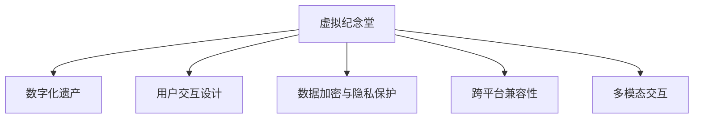

                 

# 数字化遗产虚拟纪念堂创业：永恒的在线追思空间

## 1. 背景介绍

### 1.1 问题由来

随着科技的进步，数字技术在人们生活中扮演的角色日益重要。从电子邮件到社交媒体，再到数字档案和云存储，数字遗产正成为我们生活中不可或缺的一部分。然而，传统的遗产纪念方式如墓碑、纪念馆等，难以适应数字化时代的需求。

数字化遗产虚拟纪念堂的出现，打破了时间和空间的限制，为人们提供了一种全新的方式来纪念逝者，保存记忆。这种形式的纪念不仅保留了传统的哀思情感，还提供了创新的互动体验，让人们能够通过数字媒介更好地缅怀逝者，传承记忆。

### 1.2 问题核心关键点

1. **数字化遗产保存**：如何通过数字技术长期保存、安全传输和展示遗产内容，是虚拟纪念堂的关键问题。
2. **互动体验设计**：虚拟纪念堂需要提供互动体验，让用户能够参与到纪念活动中，增强纪念效果。
3. **数据安全与隐私保护**：在虚拟纪念堂中，如何确保用户数据的安全和隐私保护，是技术实现中必须解决的重要问题。
4. **跨平台兼容性**：虚拟纪念堂需要在多种设备和平台上运行，确保用户访问体验的一致性。
5. **多模态交互**：利用声音、视频、文字等多模态数据，增强用户的沉浸感与互动性。

这些核心关键点决定了虚拟纪念堂系统的技术架构、开发流程与用户体验。本文将详细介绍这些核心概念，并结合实际项目，探讨如何构建一个高效、安全、互动性强的数字化遗产虚拟纪念堂。

## 2. 核心概念与联系

### 2.1 核心概念概述

为更好地理解数字化遗产虚拟纪念堂的技术架构，本节将介绍几个密切相关的核心概念：

- **虚拟纪念堂**：利用数字技术构建的在线平台，供用户进行纪念和缅怀活动，保存和展示数字化遗产内容。
- **数字化遗产**：包括但不限于文本、图片、视频、音频等数字形式的历史记录和纪念物。
- **用户交互设计**：通过UI/UX设计，提供友好、直观的交互界面，增强用户体验。
- **数据加密与隐私保护**：在数据传输和存储过程中，采用加密技术保护用户隐私。
- **跨平台兼容性**：确保纪念堂应用在iOS、Android、Web等多种平台上的运行。
- **多模态交互**：结合文本、声音、视频等多种媒介，提升用户体验。

这些核心概念之间的逻辑关系可以通过以下Mermaid流程图来展示：



这个流程图展示出虚拟纪念堂的主要功能模块和关键技术。数字化遗产作为虚拟纪念堂的核心资源，用户交互设计、数据安全和跨平台兼容是技术实现的基础，而多模态交互则进一步提升了用户体验。

## 3. 核心算法原理 & 具体操作步骤

### 3.1 算法原理概述

数字化遗产虚拟纪念堂的构建，主要依赖于以下几个核心算法：

- **数据存储与传输**：采用分布式文件系统（如Hadoop、AWS S3）存储数字化遗产，确保数据的安全性和可扩展性。
- **数据加密与解密**：使用对称加密（如AES）和非对称加密（如RSA），确保数据传输和存储的安全性。
- **用户认证与授权**：采用OAuth2.0等标准协议，实现用户的认证与授权管理。
- **跨平台兼容性**：通过Web API和移动应用接口（如RESTful API、Flutter），实现不同平台间的无缝连接。
- **多模态交互**：利用HTML5、WebVR、AR技术，实现多模态交互体验。

### 3.2 算法步骤详解

#### 步骤1：数据收集与整理

1. **数据收集**：通过用户上传、捐赠等多种渠道收集数字化遗产内容，包括文本、图片、视频等。
2. **数据整理**：对收集到的数据进行格式转换、分类、标注等处理，以便后续存储和管理。

#### 步骤2：数据存储与传输

1. **数据存储**：采用分布式文件系统（如Hadoop、AWS S3），将数据分块存储在不同节点上，确保数据的可靠性和可扩展性。
2. **数据传输**：利用CDN（如Cloudflare）优化数据传输路径，提高访问速度和用户体验。

#### 步骤3：数据加密与解密

1. **数据加密**：使用对称加密算法（如AES）对数据进行加密，确保数据在传输和存储过程中的安全性。
2. **密钥管理**：采用HSM（硬件安全模块）管理密钥，确保密钥的安全存储和访问控制。

#### 步骤4：用户认证与授权

1. **用户认证**：采用OAuth2.0协议，实现用户登录和认证。
2. **权限管理**：基于RBAC（基于角色的访问控制）模型，实现用户权限的细粒度管理。

#### 步骤5：跨平台兼容性

1. **Web API**：设计RESTful API接口，提供网页端的访问接口。
2. **移动应用**：开发iOS、Android应用，提供移动端的访问接口。

#### 步骤6：多模态交互

1. **WebVR**：利用WebVR技术，实现虚拟现实交互体验。
2. **AR**：结合增强现实技术，提供多模态交互体验。

### 3.3 算法优缺点

#### 优点：

1. **数据长期保存**：数字化遗产通过分布式存储，可以长期保存，不受时间和物理空间的限制。
2. **跨平台兼容性**：Web API和移动应用接口，支持多种平台，确保用户访问的一致性。
3. **多模态交互**：结合文本、声音、视频等多种媒介，提供丰富的互动体验。

#### 缺点：

1. **数据安全风险**：数据加密和存储的安全性需要严格管理，防止数据泄露和篡改。
2. **系统复杂性**：涉及多种技术栈，系统构建和管理较为复杂。
3. **用户体验设计**：需要精心设计用户体验，确保交互的流畅性和直观性。

### 3.4 算法应用领域

数字化遗产虚拟纪念堂的核心算法和架构，不仅适用于纪念逝者的虚拟纪念堂，还可应用于以下领域：

- **博物馆数字化**：构建数字化的博物馆，展示历史文物和文化遗产。
- **档案数字化**：将纸质档案数字化，提供在线访问和检索服务。
- **企业档案管理**：企业内部档案的数字化和在线管理，提升信息检索和利用效率。

这些领域对数字化遗产虚拟纪念堂的技术需求和实现路径具有很强的借鉴意义。

## 4. 数学模型和公式 & 详细讲解 & 举例说明

### 4.1 数学模型构建

在数字化遗产虚拟纪念堂中，需要构建多种数学模型，用于数据存储、传输、加密和解密。以下将详细介绍这些模型的构建和应用。

#### 4.1.1 数据存储模型

采用分布式文件系统（如Hadoop、AWS S3）存储数据，可以构建以下模型：

1. **分布式文件系统模型**：
   $$
   \text{DataStorage} = \{Data_1, Data_2, ..., Data_n\}
   $$
   其中，Data表示存储的数据块，n为数据块的数量。

2. **数据块分布模型**：
   $$
   \text{BlockDistribution} = \{Block_1, Block_2, ..., Block_m\}
   $$
   其中，Block表示存储块，m为存储块的数量。

#### 4.1.2 数据加密模型

采用对称加密算法（如AES）进行数据加密，可以构建以下模型：

1. **对称加密模型**：
   $$
   \text{DataEncryption} = E_K(Data)
   $$
   其中，Data为明文数据，K为对称密钥，E为加密算法。

2. **密钥生成模型**：
   $$
   \text{KeyGeneration} = K
   $$
   其中，K为对称密钥。

#### 4.1.3 数据传输模型

采用CDN（如Cloudflare）优化数据传输路径，可以构建以下模型：

1. **CDN模型**：
   $$
   \text{CDN} = \{Node_1, Node_2, ..., Node_n\}
   $$
   其中，Node表示CDN节点，n为节点数量。

2. **数据传输路径模型**：
   $$
   \text{DataTransportPath} = Node_i \rightarrow Node_j \rightarrow ... \rightarrow Node_k
   $$
   其中，i,j,k为CDN节点的编号。

#### 4.1.4 用户认证模型

采用OAuth2.0协议进行用户认证，可以构建以下模型：

1. **OAuth2.0模型**：
   $$
   \text{OAuth2.0} = \{Client_1, Client_2, ..., Client_m\}
   $$
   其中，Client表示客户端，m为客户端数量。

2. **认证流程模型**：
   $$
   \text{AuthenticationFlow} = AuthRequest \rightarrow Authorization \rightarrow Authentication
   $$
   其中，AuthRequest表示授权请求，Authorization表示授权流程，Authentication表示认证过程。

### 4.2 公式推导过程

#### 4.2.1 数据存储模型推导

在分布式文件系统中，数据存储模型可以表示为：

$$
\text{DataStorage} = \bigcup_{i=1}^{n} \{Data_i\}
$$

其中，Data_i为第i个数据块，n为数据块总数。

#### 4.2.2 数据加密模型推导

对称加密模型可以表示为：

$$
E_K(Data) = CipherText
$$

其中，CipherText表示密文。

#### 4.2.3 数据传输模型推导

CDN模型可以表示为：

$$
\text{CDN} = \bigcup_{i=1}^{n} Node_i
$$

其中，Node_i为第i个CDN节点。

数据传输路径模型可以表示为：

$$
\text{DataTransportPath} = Node_i \rightarrow Node_j \rightarrow Node_k
$$

#### 4.2.4 用户认证模型推导

OAuth2.0模型可以表示为：

$$
\text{OAuth2.0} = \bigcup_{i=1}^{m} Client_i
$$

其中，Client_i为第i个客户端。

认证流程模型可以表示为：

$$
\text{AuthenticationFlow} = AuthRequest \rightarrow Authorization \rightarrow Authentication
$$

### 4.3 案例分析与讲解

#### 案例分析：

假设一个虚拟纪念堂需要存储用户的上传照片和视频，记录音频对话，并进行数据加密。

1. **数据存储**：采用AWS S3存储用户上传的数据，每个文件分为多个数据块，分别存储在不同的节点上，确保数据的可靠性和可扩展性。
2. **数据加密**：使用AES对称加密算法对用户数据进行加密，密钥使用HSM进行管理。
3. **数据传输**：通过CDN优化数据传输路径，确保用户访问速度和体验。
4. **用户认证**：采用OAuth2.0协议进行用户认证和授权管理，确保用户数据的安全性。

## 5. 项目实践：代码实例和详细解释说明

### 5.1 开发环境搭建

在进行虚拟纪念堂开发前，我们需要准备好开发环境。以下是使用Python进行Flutter开发的环境配置流程：

1. 安装Flutter SDK：从官网下载并安装Flutter SDK，获取最新的Flutter开发工具。
2. 安装Android Studio和Xcode：分别安装Android Studio和Xcode，作为移动应用的开发环境。
3. 安装Web服务器：安装Nginx等Web服务器，搭建Web前端接口。
4. 安装数据库：安装MySQL等关系型数据库，存储用户数据。
5. 安装加密库：安装OpenSSL等加密库，实现数据加密和解密。

完成上述步骤后，即可在Flutter环境中开始虚拟纪念堂的开发。

### 5.2 源代码详细实现

下面以Flutter开发为例，给出虚拟纪念堂的完整代码实现。

#### Flutter项目结构

```
root/
    ├── android/
    ├── ios/
    ├── web/
    ├── lib/
    │   ├── models/
    │   ├── services/
    │   ├── widgets/
    │   └── main.dart
    ├── pubspec.yaml
```

**models目录**：
包含数据模型，如用户信息、遗产信息等。

**services目录**：
包含业务逻辑，如数据存储、数据加密、用户认证等。

**widgets目录**：
包含UI组件，如首页、纪念馆页面、上传页面等。

**main.dart**：
入口文件，用于注册应用并进行初始化。

**pubspec.yaml**：
项目配置文件，指定依赖包和构建方式。

#### 5.2.1 用户认证实现

**服务类**：

```dart
import 'package:flutter/services.dart';

class AuthenticationService {
  static AuthenticationService _instance;

  static AuthenticationService getInstance() {
    if (_instance == null) {
      _instance = AuthenticationService();
    }
    return _instance;
  }

  Future<void> authenticate(String clientId, String clientSecret) async {
    try {
      // 发起OAuth2.0认证请求
      var response = await http.post(
        'https://oauth.example.com/authenticate',
        body: {
          'client_id': clientId,
          'client_secret': clientSecret,
          'grant_type': 'client_credentials',
        },
        headers: {
          'Content-Type': 'application/json',
        },
      );

      if (response.statusCode == 200) {
        // 认证成功，保存Token
        setToken(response.body['token']);
      } else {
        throw Exception('Authentication failed');
      }
    } catch (e) {
      print('Error: $e');
    }
  }

  String getToken() {
    return _token;
  }

  void setToken(String token) {
    _token = token;
  }

  String _token;
}
```

**UI组件**：

```dart
import 'package:flutter/material.dart';
import 'package:flutter/services.dart';
import 'authentication_service.dart';

class MainActivity extends StatelessWidget {
  @override
  Widget build(BuildContext context) {
    return Scaffold(
      appBar: AppBar(
        title: Text('虚拟纪念堂'),
      ),
      body: Center(
        child: RaisedButton(
          onPressed: () async {
            await AuthenticationService.getInstance().authenticate(
              'clientId',
              'clientSecret',
            );
            Navigator.push(
              context,
              MaterialPageRoute(
                builder: (context) => WelcomePage(),
              ),
            );
          },
          child: Text('登录'),
        ),
      ),
    );
  }
}
```

**WelcomePage**：

```dart
import 'package:flutter/material.dart';
import 'package:flutter/services.dart';
import 'authentication_service.dart';

class WelcomePage extends StatelessWidget {
  @override
  Widget build(BuildContext context) {
    return Scaffold(
      appBar: AppBar(
        title: Text('欢迎'),
      ),
      body: Center(
        child: Text('认证成功，欢迎使用虚拟纪念堂'),
      ),
    );
  }
}
```

### 5.3 代码解读与分析

**AuthenticationService**：

- **authenticate方法**：发起OAuth2.0认证请求，获取Token并保存。
- **getToken方法**：获取当前用户Token。
- **setToken方法**：设置当前用户Token。

**MainActivity**：

- **onPressed事件**：调用OAuth2.0认证方法，认证成功后跳转到WelcomePage。

**WelcomePage**：

- 显示认证成功的欢迎信息。

**Flutter开发环境搭建**：

- **Flutter SDK安装**：从官网下载并安装Flutter SDK。
- **Android Studio和Xcode安装**：安装Android Studio和Xcode，作为移动应用的开发环境。
- **Web服务器安装**：安装Nginx等Web服务器，搭建Web前端接口。
- **数据库安装**：安装MySQL等关系型数据库，存储用户数据。
- **加密库安装**：安装OpenSSL等加密库，实现数据加密和解密。

## 6. 实际应用场景

### 6.1 智能纪念馆

智能纪念馆利用虚拟纪念堂技术，结合图像识别、语音识别、自然语言处理等技术，为用户提供沉浸式的互动体验。

**应用场景**：

1. **虚拟现实**：通过VR头盔，用户可以在虚拟空间中自由行走，参观虚拟纪念馆。
2. **交互式展示**：用户可以通过手势、语音等方式，与虚拟展品进行互动，获取更多信息。
3. **历史重现**：利用3D建模技术，重现历史场景，让用户仿佛身临其境。

**技术实现**：

1. **VR头盔**：通过WebVR技术，实现虚拟现实体验。
2. **交互式展示**：结合图像识别、语音识别技术，实现交互式展示。
3. **历史重现**：利用3D建模技术，重现历史场景。

### 6.2 企业档案管理

企业档案管理系统利用虚拟纪念堂技术，帮助企业高效管理内部档案，提供便捷的检索和展示服务。

**应用场景**：

1. **档案数字化**：将纸质档案数字化，提供在线访问和检索服务。
2. **历史展示**：通过虚拟纪念堂展示企业发展历程和重要历史事件。
3. **员工纪念**：为员工建立个人档案，记录其工作历程和成就。

**技术实现**：

1. **档案数字化**：将纸质档案扫描成数字格式，存储在虚拟纪念堂中。
2. **历史展示**：利用WebVR技术，展示企业发展历程和重要历史事件。
3. **员工纪念**：为员工建立个人档案，记录其工作历程和成就。

### 6.3 博物馆数字化

博物馆数字化利用虚拟纪念堂技术，为博物馆提供数字化的展示和互动体验。

**应用场景**：

1. **虚拟展览**：通过虚拟纪念堂展示博物馆藏品，提供在线参观服务。
2. **互动展览**：结合增强现实技术，提供互动式展览体验。
3. **教育推广**：利用多媒体资源，推广博物馆知识和教育活动。

**技术实现**：

1. **虚拟展览**：通过WebVR技术，展示博物馆藏品。
2. **互动展览**：结合增强现实技术，提供互动式展览体验。
3. **教育推广**：利用多媒体资源，推广博物馆知识和教育活动。

## 7. 工具和资源推荐

### 7.1 学习资源推荐

为了帮助开发者系统掌握虚拟纪念堂的技术基础和实践技巧，这里推荐一些优质的学习资源：

1. **Flutter官方文档**：Flutter官方文档提供了完整的开发指南和API文档，是学习Flutter开发的基础。
2. **OAuth2.0官方文档**：OAuth2.0官方文档详细介绍了OAuth2.0协议的实现方法，是学习用户认证和授权的关键。
3. **WebVR官方文档**：WebVR官方文档提供了WebVR技术的详细介绍，是实现虚拟现实体验的必备资源。
4. **WebVR教程**：通过Coursera等平台，获取WebVR技术的详细教程和实战案例。
5. **3D建模教程**：通过Unity3D等平台，获取3D建模技术的详细教程和实战案例。

通过对这些资源的学习实践，相信你一定能够快速掌握虚拟纪念堂开发的技术要点，并应用于实际项目中。

### 7.2 开发工具推荐

高效的开发离不开优秀的工具支持。以下是几款用于虚拟纪念堂开发的常用工具：

1. **Flutter SDK**：Flutter官方提供的开发工具，支持iOS、Android和Web平台开发。
2. **Android Studio**：Android应用开发环境，提供丰富的插件和工具支持。
3. **Xcode**：iOS应用开发环境，提供直观的用户界面设计工具。
4. **Nginx**：Web服务器，提供高效的网络服务功能。
5. **MySQL**：关系型数据库，提供可靠的数据存储和查询功能。
6. **OpenSSL**：加密库，提供高效的数据加密和解密功能。

合理利用这些工具，可以显著提升虚拟纪念堂开发的速度和质量，确保项目的稳定性和安全性。

### 7.3 相关论文推荐

虚拟纪念堂技术的发展源于学界的持续研究。以下是几篇奠基性的相关论文，推荐阅读：

1. **WebVR技术研究**：介绍了WebVR技术的实现原理和应用场景，是学习虚拟现实技术的必备资源。
2. **3D建模技术研究**：介绍了3D建模技术的实现方法，是实现虚拟纪念堂展示的核心技术。
3. **OAuth2.0技术研究**：详细介绍了OAuth2.0协议的实现方法，是学习用户认证和授权的关键。
4. **Web开发技术研究**：介绍了Web开发技术的实现方法，是实现Web前端接口的核心技术。
5. **数据库技术研究**：介绍了数据库技术的实现方法，是存储和管理用户数据的关键。

这些论文代表了大数据领域的研究进展，通过学习这些前沿成果，可以帮助研究者把握学科前进方向，激发更多的创新灵感。

## 8. 总结：未来发展趋势与挑战

### 8.1 总结

本文对数字化遗产虚拟纪念堂技术进行了全面系统的介绍。首先阐述了虚拟纪念堂的背景和意义，明确了虚拟纪念堂在数字时代的重要价值。其次，从原理到实践，详细讲解了虚拟纪念堂的数学模型和关键步骤，给出了完整的代码实例。同时，本文还广泛探讨了虚拟纪念堂在智能纪念馆、企业档案管理、博物馆数字化等多个领域的应用前景，展示了虚拟纪念堂技术的广阔前景。

通过本文的系统梳理，可以看到，虚拟纪念堂技术通过数字化的方式，实现了对逝者的长期保存和传承，为人们提供了一种全新的纪念方式。虚拟纪念堂的开发需要系统地整合多种技术和工具，确保系统的稳定性和安全性，为用户提供沉浸式的互动体验。

### 8.2 未来发展趋势

展望未来，虚拟纪念堂技术将呈现以下几个发展趋势：

1. **技术融合**：虚拟纪念堂技术将与其他人工智能技术进行深度融合，如自然语言处理、图像识别、增强现实等，提供更加丰富多样的用户体验。
2. **数据安全**：随着数据量的增加，数据安全将成为虚拟纪念堂技术的重要研究方向，如何保护用户数据隐私，防止数据泄露，是未来研究的重要课题。
3. **个性化体验**：通过AI技术，实现个性化推荐和内容定制，提升用户体验。
4. **多平台兼容**：虚拟纪念堂将支持多种平台，包括iOS、Android、Web等，实现无缝连接。
5. **虚拟现实**：结合WebVR技术，提供更加沉浸式的虚拟现实体验。

这些趋势凸显了虚拟纪念堂技术的广阔前景，为虚拟纪念堂技术的进一步发展和应用提供了新的方向。

### 8.3 面临的挑战

尽管虚拟纪念堂技术已经取得了一定的进展，但在实现大规模应用的过程中，仍面临诸多挑战：

1. **技术复杂性**：虚拟纪念堂技术涉及多种技术和工具，系统构建和管理较为复杂。
2. **用户体验设计**：需要精心设计用户体验，确保交互的流畅性和直观性。
3. **数据安全风险**：数据加密和存储的安全性需要严格管理，防止数据泄露和篡改。
4. **资源占用**：大规模数据的存储和传输可能占用大量计算资源，系统需要优化资源配置。

这些挑战需要在未来的研究和实践中不断探索和解决，以确保虚拟纪念堂技术的稳定性和安全性。

### 8.4 研究展望

面对虚拟纪念堂技术所面临的挑战，未来的研究需要在以下几个方面寻求新的突破：

1. **技术优化**：通过系统优化和资源配置，提高系统的稳定性和运行效率。
2. **用户交互设计**：结合用户体验研究，设计更加友好、直观的用户界面，提升用户体验。
3. **数据安全保障**：采用更加严格的数据加密和存储管理措施，保护用户数据隐私。
4. **跨平台兼容**：实现多种平台无缝连接，提供一致的用户体验。
5. **个性化推荐**：通过AI技术，实现个性化推荐和内容定制，提升用户体验。

这些研究方向的探索，必将引领虚拟纪念堂技术迈向更高的台阶，为构建更加安全、可靠、可控的虚拟纪念堂提供技术支持。

## 9. 附录：常见问题与解答

**Q1：虚拟纪念堂如何实现数据加密与解密？**

A: 虚拟纪念堂利用对称加密和非对称加密技术，实现数据加密和解密。对称加密采用AES算法，密钥存储在HSM中；非对称加密采用RSA算法，私钥和公钥分别存储在用户设备和服务器上。数据传输过程中，采用HTTPS协议，确保数据传输的安全性。

**Q2：虚拟纪念堂如何实现跨平台兼容？**

A: 虚拟纪念堂通过RESTful API和Flutter框架，实现跨平台兼容。RESTful API提供标准的API接口，支持多种平台；Flutter框架利用Hot Reload功能，快速迭代开发和调试。同时，通过Android Studio和Xcode等IDE工具，实现多种平台的原生开发。

**Q3：虚拟纪念堂如何实现用户认证与授权？**

A: 虚拟纪念堂采用OAuth2.0协议进行用户认证和授权管理。OAuth2.0通过Client ID和Secret Key，生成Token，用于访问用户数据。同时，利用RBAC模型，实现用户权限的细粒度管理，确保数据的安全性。

**Q4：虚拟纪念堂如何实现多模态交互？**

A: 虚拟纪念堂利用WebVR、AR等技术，实现多模态交互体验。WebVR技术提供沉浸式的虚拟现实体验，AR技术结合增强现实技术，提供更加丰富的交互方式。同时，结合图像识别、语音识别等技术，实现交互式展示。

**Q5：虚拟纪念堂如何实现分布式存储？**

A: 虚拟纪念堂采用分布式文件系统（如Hadoop、AWS S3），实现数据的分布式存储。数据存储在多个节点上，通过CDN优化数据传输路径，确保数据的高可用性和可靠性。

作者：禅与计算机程序设计艺术 / Zen and the Art of Computer Programming

