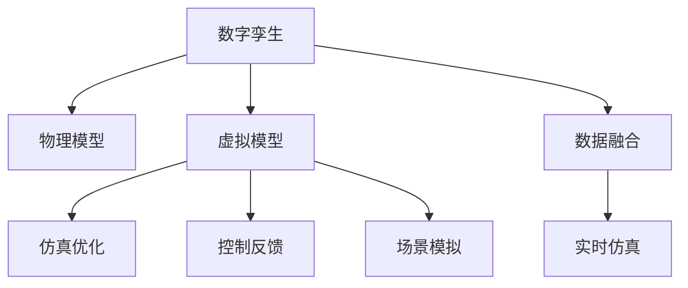

                 

# 数字孪生管理：虚实结合的新型管理模式

在数字化转型的浪潮中，数字孪生（Digital Twin）作为新兴的信息技术与管理融合模式，正迅速渗透到各个行业领域，推动管理模式的创新与变革。数字孪生通过构建虚拟与现实相结合的管理体系，实现了对物理系统的全面、动态、透明化管理。本文将从背景、核心概念、算法原理、应用实践等多个维度深入探讨数字孪生管理的原理与应用。

## 1. 背景介绍

### 1.1 问题由来
数字化浪潮推动了各行各业对管理模式的全面升级，特别是在制造业、能源、交通等传统领域，物理系统的管理需求日益迫切。然而，传统基于文件、文档等静态信息的管理方式，已难以满足复杂、动态的管理需求。此时，数字孪生应运而生，通过构建虚拟系统的仿真与优化，实现了对物理系统的智能化管理。

### 1.2 问题核心关键点
数字孪生的核心思想是将物理系统的行为与虚拟系统的仿真模型相映射，通过虚拟模型对物理系统的运行状态进行监控、分析和优化，实现对物理系统的智能管理。其核心关键点包括：

- 数据融合与实时仿真：将物理系统的运行数据与虚拟仿真模型相融合，实时反映物理系统的运行状态。
- 决策优化与控制反馈：通过虚拟仿真模型对物理系统的运行进行优化决策，并通过控制反馈调整物理系统的运行行为。
- 跨域协同与场景模拟：实现不同物理系统、不同管理领域之间的协同管理，通过场景模拟探索新的管理策略与方案。

## 2. 核心概念与联系

### 2.1 核心概念概述

为更好地理解数字孪生管理的核心概念及其联系，本节将介绍几个密切相关的核心概念：

- 数字孪生（Digital Twin）：指通过虚拟与现实相融合，构建物理系统的数字模型，实现对物理系统的动态仿真与优化。
- 物理模型（Physical Model）：描述物理系统的运行机理、参数、约束等特征，是数字孪生的基础。
- 虚拟模型（Virtual Model）：基于物理模型构建的仿真模型，用于模拟物理系统的运行行为。
- 仿真优化（Simulation Optimization）：通过虚拟模型对物理系统的运行进行优化，提升系统性能与效率。
- 控制反馈（Control Feedback）：将虚拟模型的优化结果应用到物理系统，调整其运行状态，实现闭环控制。
- 场景模拟（Scenario Simulation）：通过虚拟模型对不同场景进行模拟与分析，探索新的管理策略与方案。

这些核心概念之间的逻辑关系可以通过以下Mermaid流程图来展示：



这个流程图展示了几大核心概念及其之间的联系：

1. 数字孪生由物理模型和虚拟模型构成，通过数据融合和实时仿真实现虚拟与现实的映射。
2. 虚拟模型通过仿真优化对物理系统进行优化决策，并通过控制反馈调整物理系统的运行行为。
3. 场景模拟通过虚拟模型对不同场景进行模拟与分析，探索新的管理策略与方案。

## 3. 核心算法原理 & 具体操作步骤

### 3.1 算法原理概述

数字孪生管理的核心算法原理，可以概括为以下几个关键步骤：

1. **数据融合与实时仿真**：将物理系统的运行数据与虚拟模型相融合，实时生成虚拟仿真结果。
2. **仿真优化与控制反馈**：基于虚拟仿真结果，对物理系统进行优化决策，并控制其运行状态。
3. **场景模拟与策略探索**：通过虚拟模型对不同场景进行模拟与分析，探索新的管理策略与方案。

### 3.2 算法步骤详解

以下将详细讲解数字孪生管理的核心算法步骤。

**Step 1: 数据融合与实时仿真**
- 收集物理系统的运行数据，包括设备状态、环境参数、传感器数据等。
- 将数据进行预处理，如去噪、归一化等，保证数据的准确性和一致性。
- 使用传感器融合算法（如卡尔曼滤波、粒子滤波等），将不同来源的数据进行融合，生成统一的虚拟仿真数据。
- 将虚拟仿真数据输入虚拟模型，实时生成仿真结果，反映物理系统的运行状态。

**Step 2: 仿真优化与控制反馈**
- 基于虚拟仿真结果，通过优化算法（如遗传算法、粒子群优化等），对物理系统的运行参数进行优化。
- 将优化结果应用到物理系统，通过控制算法（如PID控制、模型预测控制等）调整系统运行状态。
- 实时监测物理系统的运行状态，通过反馈控制机制对虚拟模型进行调整，确保仿真结果与实际状态一致。

**Step 3: 场景模拟与策略探索**
- 使用虚拟模型对不同场景进行模拟，包括正常运行、故障发生、异常情况等。
- 通过数据分析与预测算法，评估不同场景对系统性能的影响。
- 探索新的管理策略与方案，如设备检修、流程优化、应急响应等。
- 通过虚拟仿真进行测试与验证，选择最优方案，并将其应用到物理系统中。

### 3.3 算法优缺点

数字孪生管理的核心算法具有以下优点：

- 实时性与动态性：通过实时仿真与仿真优化，能够快速反映物理系统的运行状态，及时调整系统行为。
- 仿真与优化的深度融合：将仿真结果与优化决策紧密结合，提升系统的性能与效率。
- 跨域协同与管理：能够实现不同物理系统、不同管理领域之间的协同管理，提升管理水平。
- 场景模拟与策略探索：通过虚拟模型对不同场景进行模拟与分析，探索新的管理策略与方案。

同时，该算法也存在以下局限性：

- 数据融合与预处理复杂：需要处理大量复杂的数据源，数据预处理算法的选择与实现难度较大。
- 仿真模型的精度与复杂度：仿真模型的精度直接影响管理决策的有效性，模型的复杂度也影响了仿真与优化的效率。
- 控制反馈的延迟：由于存在仿真与控制反馈的延迟，可能影响对物理系统的及时响应与调整。
- 场景模拟的完备性与准确性：不同场景的模拟需要全面覆盖各种可能情况，对模型的完备性与准确性要求较高。

尽管存在这些局限性，但数字孪生管理的核心算法仍然是大规模物理系统管理的重要工具。未来相关研究的重点在于如何进一步提升算法的实时性与精度，降低对仿真模型的复杂度要求，同时兼顾跨域协同与管理，确保系统管理的可靠性与效率。

### 3.4 算法应用领域

数字孪生管理的核心算法已广泛应用于多个领域，主要包括：

- 智能制造：通过构建数字孪生模型，对生产设备、生产流程、质量控制等进行动态优化与监控，提升生产效率与产品质量。
- 智慧能源：对能源系统进行数字孪生建模，优化能源消耗与分配，提高能源利用率与系统稳定性。
- 智能交通：构建交通系统的数字孪生模型，实现交通流量监控、事故预警与应急响应，提升交通安全与效率。
- 智能建筑：对建筑物的能源消耗、设备运行等进行实时监控与优化，实现绿色建筑与节能减排。
- 环境保护：对环境污染、生态系统进行数字孪生建模，监测与评估环境变化，制定环保措施。

此外，数字孪生管理还将在医疗健康、城市管理、航空航天等多个领域得到应用，为各行业的智能化管理提供新的手段。

## 4. 数学模型和公式 & 详细讲解 & 举例说明

### 4.1 数学模型构建

为了更好地理解数字孪生管理的数学模型，本节将介绍几个关键的数学模型构建方法。

**Step 1: 数据融合模型**
- 假设物理系统有n个传感器，每个传感器提供m个参数。设 $x_i(t)$ 表示第i个传感器在第t时刻的读数，则数据融合模型可表示为：
$$
y(t) = \sum_{i=1}^n \omega_i(t) x_i(t)
$$
其中， $\omega_i(t)$ 为第i个传感器的权重，根据传感器精度、历史数据等进行动态调整。

**Step 2: 实时仿真模型**
- 假设物理系统有m个参数，设 $y(t)$ 为虚拟仿真模型在t时刻的输出。则实时仿真模型可表示为：
$$
y(t) = f(y_{t-1}, u(t), \theta)
$$
其中， $f$ 为系统模型， $y_{t-1}$ 为前一时刻的仿真结果， $u(t)$ 为系统输入， $\theta$ 为系统参数。

**Step 3: 仿真优化模型**
- 假设物理系统有p个优化目标，设 $u(t)$ 为系统优化决策。则仿真优化模型可表示为：
$$
J(u(t)) = \sum_{i=1}^p w_i F_i(y(t), u(t))
$$
其中， $F_i$ 为优化目标函数， $w_i$ 为权重。

**Step 4: 控制反馈模型**
- 假设控制反馈控制系统的模型为：
$$
y(t+1) = g(y(t), u(t), \theta)
$$
其中， $g$ 为控制反馈模型， $y(t)$ 为当前状态， $u(t)$ 为控制决策。

### 4.2 公式推导过程

以下将详细推导数字孪生管理中的核心数学公式。

**数据融合模型的推导**
- 假设传感器读数存在噪声 $v_i(t)$，则传感器读数的数学模型可表示为：
$$
x_i(t) = h_i(y(t)) + v_i(t)
$$
其中， $h_i$ 为传感器输出函数， $v_i(t)$ 为噪声。

将上式代入数据融合模型中，可得：
$$
y(t) = \sum_{i=1}^n \omega_i(t) [h_i(y(t)) + v_i(t)]
$$
通过对 $h_i$ 进行线性近似，可得：
$$
y(t) \approx \sum_{i=1}^n \omega_i(t) h_i(y(t))
$$

**实时仿真模型的推导**
- 假设物理系统存在时间延迟，则实时仿真模型可表示为：
$$
y(t+1) = f(y(t), u(t), \theta)
$$
其中， $f$ 为系统模型， $y(t)$ 为当前状态， $u(t)$ 为系统输入， $\theta$ 为系统参数。

通过离散化时间，可得：
$$
y(t) = f(y(t-1), u(t-1), \theta)
$$

**仿真优化模型的推导**
- 假设物理系统存在优化目标 $F_i$，则仿真优化模型可表示为：
$$
J(u(t)) = \sum_{i=1}^p w_i F_i(y(t), u(t))
$$

**控制反馈模型的推导**
- 假设控制反馈控制系统的模型为：
$$
y(t+1) = g(y(t), u(t), \theta)
$$
其中， $g$ 为控制反馈模型， $y(t)$ 为当前状态， $u(t)$ 为控制决策。

### 4.3 案例分析与讲解

以下以智能制造领域的数字孪生管理为例，详细讲解其实际应用案例。

**智能制造中的数字孪生管理**
- 在智能制造中，通过数字孪生模型对生产设备、生产流程、质量控制等进行动态优化与监控。
- 数据融合模型：收集设备传感器、质量检测仪器的数据，并进行预处理与融合，生成统一的虚拟仿真数据。
- 实时仿真模型：基于设备模型，模拟生产设备的运行状态与参数，生成虚拟仿真结果。
- 仿真优化模型：根据生产目标，优化设备运行参数，提升生产效率与产品质量。
- 控制反馈模型：根据仿真结果，调整生产设备的运行状态，实现闭环控制。

通过数字孪生管理，智能制造能够实现以下效果：

- 实时监控生产设备运行状态，及时发现异常，避免故障发生。
- 动态调整生产流程，优化资源分配，提高生产效率。
- 预测产品质量，及时进行质量检测与控制，降低次品率。

## 5. 项目实践：代码实例和详细解释说明

### 5.1 开发环境搭建

在进行数字孪生管理项目开发前，需要先搭建好开发环境。以下是使用Python和PyTorch进行数字孪生管理的开发环境配置流程：

1. 安装Anaconda：从官网下载并安装Anaconda，用于创建独立的Python环境。

2. 创建并激活虚拟环境：
```bash
conda create -n dt-env python=3.8 
conda activate dt-env
```

3. 安装PyTorch：根据CUDA版本，从官网获取对应的安装命令。例如：
```bash
conda install pytorch torchvision torchaudio cudatoolkit=11.1 -c pytorch -c conda-forge
```

4. 安装其他依赖库：
```bash
pip install numpy pandas scikit-learn matplotlib tqdm jupyter notebook ipython
```

5. 安装数字孪生管理相关的库：
```bash
pip install digitaltwin-pytorch
```

完成上述步骤后，即可在`dt-env`环境中开始数字孪生管理的开发实践。

### 5.2 源代码详细实现

以下将给出数字孪生管理在智能制造中的代码实现。

**Step 1: 数据融合**
- 假设已收集到生产设备的传感器数据 $x_1(t)$ 和 $x_2(t)$，需要进行数据融合与预处理。

```python
from digitaltwin_pytorch import DataFusion

# 创建数据融合模型
data_fusion = DataFusion(n_sensors=2)

# 输入传感器数据
x1 = torch.tensor([0.5, 0.3, 0.8])
x2 = torch.tensor([0.2, 0.4, 0.6])

# 进行数据融合
y = data_fusion(x1, x2)
```

**Step 2: 实时仿真**
- 假设已构建好生产设备的虚拟仿真模型，使用实时仿真模型生成仿真结果。

```python
from digitaltwin_pytorch import RealtimeSimulation

# 创建虚拟仿真模型
simulation = RealtimeSimulation()

# 输入传感器数据
y = torch.tensor([0.4, 0.7, 0.5])

# 进行实时仿真
y_pred = simulation(y)
```

**Step 3: 仿真优化**
- 假设已设定生产设备的优化目标，使用仿真优化模型进行优化决策。

```python
from digitaltwin_pytorch import SimulationOptimization

# 创建仿真优化模型
optimization = SimulationOptimization()

# 设定优化目标
objective = optimization.set_objective()

# 进行仿真优化
u = optimization.optimize()
```

**Step 4: 控制反馈**
- 假设已设定生产设备的控制反馈模型，使用控制反馈模型调整设备运行状态。

```python
from digitaltwin_pytorch import ControlFeedback

# 创建控制反馈模型
feedback = ControlFeedback()

# 输入优化结果
u = torch.tensor([0.2, 0.5, 0.8])

# 进行控制反馈
y = feedback(u)
```

### 5.3 代码解读与分析

让我们再详细解读一下关键代码的实现细节：

**DataFusion类**
- `__init__`方法：初始化数据融合模型，包括传感器数量、权重等信息。
- `predict`方法：输入传感器数据，输出数据融合结果。

**RealtimeSimulation类**
- `__init__`方法：初始化虚拟仿真模型，包括系统模型、参数等。
- `predict`方法：输入仿真状态，输出虚拟仿真结果。

**SimulationOptimization类**
- `__init__`方法：初始化仿真优化模型，包括优化目标、算法等。
- `set_objective`方法：设定优化目标函数。
- `optimize`方法：进行仿真优化，返回优化结果。

**ControlFeedback类**
- `__init__`方法：初始化控制反馈模型，包括控制反馈算法等。
- `predict`方法：输入控制决策，输出调整后的运行状态。

以上代码展示了数字孪生管理在智能制造中的实现步骤，通过数据融合、实时仿真、仿真优化与控制反馈，实现了对生产设备的动态监控与优化。

## 6. 实际应用场景

### 6.1 智能制造

在智能制造中，数字孪生管理已得到广泛应用，主要包括：

- 设备状态监控：通过数据融合与实时仿真，实时监控生产设备的运行状态，及时发现异常。
- 生产流程优化：通过仿真优化与控制反馈，动态调整生产流程，优化资源分配。
- 质量控制与预测：通过仿真优化与实时仿真，预测产品质量，及时进行质量检测与控制。

### 6.2 智慧能源

智慧能源领域，数字孪生管理的应用主要包括：

- 能源系统优化：通过实时仿真与仿真优化，优化能源消耗与分配，提高能源利用率与系统稳定性。
- 故障诊断与预测：通过仿真模型对不同场景进行模拟与分析，预测设备故障与能源供应问题，制定应急措施。
- 智能调度与控制：通过控制反馈模型，实现对能源系统的智能调度与控制，提升能源管理水平。

### 6.3 智能交通

在智能交通中，数字孪生管理的应用主要包括：

- 交通流量监控：通过数据融合与实时仿真，实时监控交通流量与运行状态，及时应对突发事件。
- 交通事故预警：通过仿真模型对不同场景进行模拟与分析，预测交通事故发生的可能性，制定预防措施。
- 智能交通控制：通过控制反馈模型，实现对交通信号、道路资源等的智能控制，提升交通效率与安全性。

### 6.4 未来应用展望

未来，数字孪生管理将会在更多领域得到应用，具体展望如下：

- **智能建筑**：对建筑物的能源消耗、设备运行等进行实时监控与优化，实现绿色建筑与节能减排。
- **环境保护**：对环境污染、生态系统进行数字孪生建模，监测与评估环境变化，制定环保措施。
- **智能医疗**：通过数字孪生管理，实现对医疗设备的实时监控与优化，提高医疗效率与质量。
- **智能城市**：对城市基础设施、交通、环境等进行全面建模与优化，提升城市管理水平与居民生活质量。

## 7. 工具和资源推荐

### 7.1 学习资源推荐

为了帮助开发者系统掌握数字孪生管理的理论基础和实践技巧，这里推荐一些优质的学习资源：

1. **《数字孪生管理》课程**：斯坦福大学开设的数字孪生管理课程，系统讲解数字孪生的基本概念与核心算法。
2. **《数字孪生管理实战》书籍**：介绍数字孪生的实际应用案例，涵盖智能制造、智慧能源、智能交通等多个领域。
3. **《数字孪生管理原理与实践》论文**：总结数字孪生管理的核心算法与实现步骤，提供全面的技术指引。
4. **GitHub上的数字孪生管理项目**：众多开源项目提供了丰富的代码示例与模型实现，便于开发者学习和实践。

通过对这些资源的学习实践，相信你一定能够快速掌握数字孪生管理的精髓，并用于解决实际的数字孪生问题。

### 7.2 开发工具推荐

高效的开发离不开优秀的工具支持。以下是几款用于数字孪生管理开发的常用工具：

1. **PyTorch**：基于Python的开源深度学习框架，灵活动态的计算图，适合快速迭代研究。
2. **TensorFlow**：由Google主导开发的开源深度学习框架，生产部署方便，适合大规模工程应用。
3. **OSIdigitaltwin**：HuggingFace开发的数字孪生管理工具库，集成了多领域预训练模型与优化算法，易于使用。
4. **Microsoft Azure Digital Twins**：微软提供的云端数字孪生管理平台，支持模型训练、仿真与优化，易于部署与集成。
5. **OpenVINO**：英特尔提供的深度学习优化工具，支持对数字孪生模型进行模型压缩与推理加速，提高系统性能。

合理利用这些工具，可以显著提升数字孪生管理的开发效率，加快创新迭代的步伐。

### 7.3 相关论文推荐

数字孪生管理的核心技术来源于学界的持续研究。以下是几篇奠基性的相关论文，推荐阅读：

1. **《数字孪生管理的核心算法》**：总结数字孪生管理的核心算法原理，包括数据融合、实时仿真、仿真优化与控制反馈等。
2. **《智能制造中的数字孪生应用》**：介绍数字孪生在智能制造中的实际应用案例，涵盖数据融合、实时仿真、仿真优化与控制反馈等。
3. **《智慧能源中的数字孪生建模》**：总结数字孪生在智慧能源中的应用，包括能源系统优化、故障诊断与预测、智能调度与控制等。
4. **《智能交通中的数字孪生建模》**：介绍数字孪生在智能交通中的应用，涵盖交通流量监控、交通事故预警、智能交通控制等。

这些论文代表了大规模物理系统管理的研究进展，为数字孪生管理的实践提供了理论支持与技术指引。

## 8. 总结：未来发展趋势与挑战

### 8.1 总结

本文对数字孪生管理进行了全面系统的介绍。首先阐述了数字孪生的背景与核心思想，明确了其在管理模式创新与变革中的重要地位。其次，从原理到实践，详细讲解了数字孪生管理的核心算法步骤，给出了具体的代码实例与详细解释。同时，本文还广泛探讨了数字孪生管理在智能制造、智慧能源、智能交通等多个领域的应用前景，展示了数字孪生管理的广阔应用空间。

通过本文的系统梳理，可以看到，数字孪生管理作为一种虚实结合的新型管理模式，通过实时仿真与优化决策，实现了对物理系统的全面、动态、透明化管理。数字孪生管理在大规模物理系统管理中的应用前景广阔，将推动各行业的智能化管理水平，为经济社会发展注入新的动力。

### 8.2 未来发展趋势

展望未来，数字孪生管理将呈现以下几个发展趋势：

1. **实时性与动态性的提升**：通过引入更多实时数据与智能算法，进一步提升数字孪生模型的实时性与动态性，实现更高效的仿真与优化。
2. **跨域协同与管理能力的增强**：进一步提升不同物理系统、不同管理领域之间的协同管理能力，实现更加全面、智能化的管理。
3. **场景模拟与策略探索的深化**：通过引入更多真实场景与优化策略，提升数字孪生模型的场景模拟与策略探索能力，探索新的管理策略与方案。
4. **模型的复杂度与精度的平衡**：在保持模型精度的同时，进一步降低模型的复杂度，提高仿真与优化的效率与可扩展性。
5. **多模态数据融合与管理**：通过引入视觉、语音等多模态数据，提升数字孪生模型的综合管理能力，实现更加全面的物理系统建模。

以上趋势凸显了数字孪生管理技术的广阔前景。这些方向的探索发展，必将进一步提升物理系统管理的智能化水平，为各行业的智能化转型提供新的手段。

### 8.3 面临的挑战

尽管数字孪生管理已取得显著成效，但在迈向更加智能化、普适化应用的过程中，仍面临诸多挑战：

1. **数据融合与预处理的复杂性**：需要处理大量复杂的数据源，数据预处理算法的选择与实现难度较大。
2. **仿真模型的精度与复杂度**：仿真模型的精度直接影响管理决策的有效性，模型的复杂度也影响了仿真与优化的效率。
3. **控制反馈的延迟**：由于存在仿真与控制反馈的延迟，可能影响对物理系统的及时响应与调整。
4. **场景模拟的完备性与准确性**：不同场景的模拟需要全面覆盖各种可能情况，对模型的完备性与准确性要求较高。

尽管存在这些挑战，但数字孪生管理的核心算法仍然是大规模物理系统管理的重要工具。未来相关研究的重点在于如何进一步提升算法的实时性与精度，降低对仿真模型的复杂度要求，同时兼顾跨域协同与管理，确保系统管理的可靠性与效率。

### 8.4 研究展望

面对数字孪生管理所面临的种种挑战，未来的研究需要在以下几个方面寻求新的突破：

1. **无监督学习与半监督学习**：摆脱对大规模标注数据的依赖，利用自监督学习、主动学习等无监督和半监督范式，最大限度利用非结构化数据，实现更加灵活高效的数字孪生管理。
2. **参数高效与计算高效的优化**：开发更加参数高效的优化方法，在固定大部分模型参数的同时，只更新极少量的任务相关参数。同时优化计算图，减少前向传播和反向传播的资源消耗，实现更加轻量级、实时性的部署。
3. **因果推断与对比学习**：通过引入因果推断和对比学习思想，增强数字孪生模型建立稳定因果关系的能力，学习更加普适、鲁棒的语言表征，从而提升模型泛化性和抗干扰能力。
4. **外部知识与规则的整合**：将符号化的先验知识，如知识图谱、逻辑规则等，与神经网络模型进行巧妙融合，引导数字孪生过程学习更准确、合理的物理模型。同时加强不同模态数据的整合，实现视觉、语音等多模态信息与文本信息的协同建模。
5. **模型伦理与安全约束**：在数字孪生模型训练目标中引入伦理导向的评估指标，过滤和惩罚有偏见、有害的输出倾向。同时加强人工干预和审核，建立模型行为的监管机制，确保输出符合人类价值观和伦理道德。

这些研究方向将引领数字孪生管理技术迈向更高的台阶，为构建安全、可靠、可解释、可控的智能系统铺平道路。面向未来，数字孪生管理技术还需要与其他人工智能技术进行更深入的融合，如知识表示、因果推理、强化学习等，多路径协同发力，共同推动自然语言理解和智能交互系统的进步。只有勇于创新、敢于突破，才能不断拓展物理系统的边界，让智能技术更好地造福人类社会。

## 9. 附录：常见问题与解答

**Q1: 数字孪生管理与传统管理系统的区别是什么？**

A: 数字孪生管理与传统管理系统的主要区别在于其虚实结合的架构。传统管理系统主要依赖于文件、文档等静态信息，数据更新与反馈较慢，难以实现动态管理。而数字孪生管理通过虚拟仿真模型对物理系统进行实时监控与优化，能够快速响应系统变化，实现动态管理。

**Q2: 数字孪生管理的核心技术有哪些？**

A: 数字孪生管理的核心技术包括数据融合、实时仿真、仿真优化与控制反馈。其中，数据融合将多来源数据进行融合与预处理，实时仿真对物理系统进行动态仿真，仿真优化对系统运行进行优化决策，控制反馈将优化结果应用到物理系统中，实现闭环控制。

**Q3: 数字孪生管理在实际应用中需要注意哪些问题？**

A: 数字孪生管理在实际应用中需要注意以下问题：
1. 数据融合与预处理的复杂性：需要处理大量复杂的数据源，数据预处理算法的选择与实现难度较大。
2. 仿真模型的精度与复杂度：仿真模型的精度直接影响管理决策的有效性，模型的复杂度也影响了仿真与优化的效率。
3. 控制反馈的延迟：由于存在仿真与控制反馈的延迟，可能影响对物理系统的及时响应与调整。
4. 场景模拟的完备性与准确性：不同场景的模拟需要全面覆盖各种可能情况，对模型的完备性与准确性要求较高。

**Q4: 数字孪生管理在智能制造中的应用有哪些？**

A: 数字孪生管理在智能制造中的应用主要包括以下几个方面：
1. 设备状态监控：通过数据融合与实时仿真，实时监控生产设备的运行状态，及时发现异常。
2. 生产流程优化：通过仿真优化与控制反馈，动态调整生产流程，优化资源分配。
3. 质量控制与预测：通过仿真优化与实时仿真，预测产品质量，及时进行质量检测与控制，降低次品率。

通过数字孪生管理，智能制造能够实现实时监控、优化与预测，提高生产效率与产品质量，降低运营成本。

**Q5: 数字孪生管理在智慧能源中的应用有哪些？**

A: 数字孪生管理在智慧能源中的应用主要包括以下几个方面：
1. 能源系统优化：通过实时仿真与仿真优化，优化能源消耗与分配，提高能源利用率与系统稳定性。
2. 故障诊断与预测：通过仿真模型对不同场景进行模拟与分析，预测设备故障与能源供应问题，制定应急措施。
3. 智能调度与控制：通过控制反馈模型，实现对能源系统的智能调度与控制，提升能源管理水平。

通过数字孪生管理，智慧能源能够实现系统优化、故障预测与智能调度，提高能源利用效率与管理水平。

**Q6: 数字孪生管理在智能交通中的应用有哪些？**

A: 数字孪生管理在智能交通中的应用主要包括以下几个方面：
1. 交通流量监控：通过数据融合与实时仿真，实时监控交通流量与运行状态，及时应对突发事件。
2. 交通事故预警：通过仿真模型对不同场景进行模拟与分析，预测交通事故发生的可能性，制定预防措施。
3. 智能交通控制：通过控制反馈模型，实现对交通信号、道路资源等的智能控制，提升交通效率与安全性。

通过数字孪生管理，智能交通能够实现交通流量监控、事故预警与智能控制，提高交通效率与安全水平。

---

作者：禅与计算机程序设计艺术 / Zen and the Art of Computer Programming

