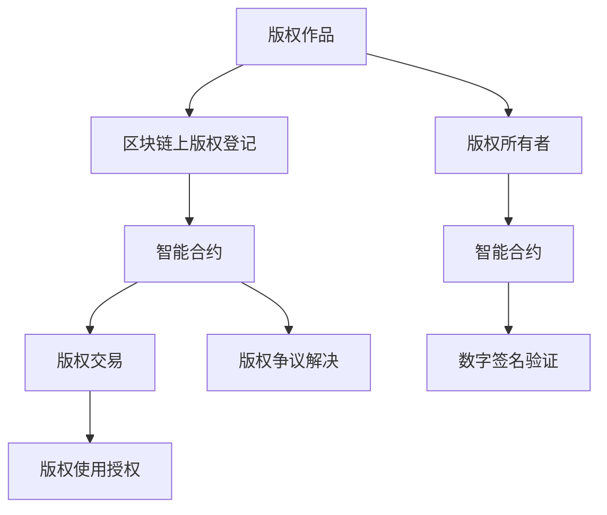

                 

# 数字版权创业：区块链在知识产权中的应用

## 1. 背景介绍

在数字化时代，知识产权的保护和版权管理面临新的挑战。传统方式如纸质保管、版权登记、法律诉讼等，不仅效率低下，还存在数据篡改、侵权难究等问题。区块链技术的去中心化、不可篡改、透明公开等特点，为知识产权的数字化管理和保护提供了新的解决方案。本文将探讨区块链在数字版权创业中的应用，分析其原理和应用场景，并提供实际开发示例。

## 2. 核心概念与联系

### 2.1 核心概念概述

- **数字版权（Digital Rights）**：指对数字作品（如软件、音乐、图片等）所拥有的复制、分发、展示等权利。

- **版权登记（Copyright Registration）**：版权人向版权局提交的作品登记，用以证明其作品创作和权利归属。

- **区块链（Blockchain）**：一种分布式数据库技术，通过去中心化、不可篡改、透明公开的机制，保障数据的安全性和可靠性。

- **智能合约（Smart Contracts）**：一种自动执行、无需中介的合约形式，通过区块链实现自动执行和验证。

- **版权交易（Copyright Transactions）**：涉及版权转让、授权使用、版权争议解决的法律行为。

- **去中心化身份验证（Decentralized Identity Verification）**：利用区块链技术，验证版权所有人的真实身份和作品归属。

这些核心概念共同构成了区块链在知识产权保护中的应用基础，通过分布式技术保障版权的透明和安全性，提升版权管理的效率和可靠性。

### 2.2 核心概念原理和架构的 Mermaid 流程图



此图展示了从版权作品的登记到版权交易、授权和争议解决的完整流程。版权所有者通过区块链进行作品登记，并通过智能合约自动执行版权交易。一旦发生争议，智能合约自动验证和处理，提高了版权管理的透明度和效率。

## 3. 核心算法原理 & 具体操作步骤

### 3.1 算法原理概述

区块链在数字版权中的应用主要依赖于其去中心化、不可篡改、透明公开的特性。版权作品通过区块链进行登记和验证，版权交易通过智能合约自动执行，版权争议通过区块链进行透明公正的解决。

- **去中心化存储**：版权作品及相关信息存储在区块链上，不受任何单点故障或恶意攻击影响。
- **不可篡改性**：区块链上的数据一旦记录，无法通过任何手段进行修改，确保版权信息的真实性。
- **透明公开**：区块链上所有交易记录公开透明，任何人都可以查看和验证，提高版权管理的可信度。

### 3.2 算法步骤详解

1. **版权作品登记**：版权所有者将作品及相关信息（如作品名称、创作者信息、发布日期等）上传至区块链平台，并通过智能合约自动进行版权登记。

2. **版权交易**：版权所有者通过智能合约设定版权使用规则，授权其他用户使用。例如，设置使用期限、支付方式、授权类型等。

3. **版权争议解决**：一旦发生版权纠纷，智能合约自动执行预设的争议解决机制，保障版权所有者的权益。

4. **版权管理**：版权所有者通过区块链平台实时监控和管理版权状态，确保持续有效。

### 3.3 算法优缺点

**优点**：
- **去中心化**：避免单点故障，提高系统的可靠性和安全性。
- **不可篡改**：确保版权信息的真实性和不可更改性。
- **透明公开**：提高版权管理的可信度和透明度。
- **自动化执行**：通过智能合约实现自动化的版权交易和争议解决。

**缺点**：
- **存储成本高**：区块链需要大量存储资源，存储和验证版权数据成本较高。
- **执行效率低**：由于区块链的共识机制，处理大规模版权交易和争议解决效率较低。
- **隐私保护**：区块链上的数据公开透明，可能泄露版权所有者的个人隐私。

### 3.4 算法应用领域

区块链在数字版权中的应用领域广泛，包括但不限于以下几方面：

- **版权登记与保护**：版权所有者通过区块链进行作品登记，确保版权信息真实可靠。
- **版权交易与授权**：版权所有者通过智能合约自动执行版权交易和授权，提高效率和公平性。
- **版权使用监控**：通过区块链实时监控版权使用情况，防止侵权行为。
- **版权争议解决**：通过智能合约自动处理版权争议，减少纠纷解决成本。
- **版权收益分配**：自动分配版权收益，确保版权所有者获得应得报酬。

## 4. 数学模型和公式 & 详细讲解 & 举例说明

### 4.1 数学模型构建

假设版权所有者为甲，版权使用者为乙，版权授权交易的智能合约为C。版权登记和交易的数学模型如下：

1. **版权登记模型**：
   - 版权作品描述：$P$
   - 创作者信息：$A$
   - 发布日期：$D$
   - 版权所有者数字签名：$S$

   版权登记模型为：
   $$
   R = (P, A, D, S)
   $$

2. **版权交易模型**：
   - 版权授权类型：$T$
   - 授权时间：$T$
   - 支付方式：$P$
   - 版权所有者数字签名：$S$
   - 版权使用者数字签名：$S'$

   版权交易模型为：
   $$
   T = (T, T, P, S, S')
   $$

3. **版权争议解决模型**：
   - 争议内容：$C$
   - 争议解决机制：$M$
   - 争议双方数字签名：$S, S'$

   版权争议解决模型为：
   $$
   D = (C, M, S, S')
   $$

### 4.2 公式推导过程

1. **版权登记公式推导**：
   $$
   R = \mathcal{H}(P, A, D, S)
   $$
   其中 $\mathcal{H}$ 为哈希函数，确保信息不可篡改。

2. **版权交易公式推导**：
   $$
   T = \mathcal{M}(T, T, P, S, S')
   $$
   其中 $\mathcal{M}$ 为智能合约自动执行函数。

3. **版权争议解决公式推导**：
   $$
   D = \mathcal{N}(C, M, S, S')
   $$
   其中 $\mathcal{N}$ 为争议解决自动执行函数。

### 4.3 案例分析与讲解

假设版权所有者甲希望将某幅画作授权给乙使用。通过区块链平台，甲将作品信息上传至区块链，并通过智能合约自动执行版权交易。具体步骤如下：

1. **版权登记**：
   - 甲上传画作信息：$P$
   - 创作者信息：$A$
   - 发布日期：$D$
   - 甲进行数字签名：$S$
   - 区块链自动生成哈希值：$R = \mathcal{H}(P, A, D, S)$

2. **版权交易**：
   - 甲设定授权类型：$T$
   - 授权时间：$T$
   - 乙支付版权费用：$P$
   - 甲和乙进行数字签名：$S, S'$
   - 智能合约自动执行交易：$T = \mathcal{M}(T, T, P, S, S')$

3. **版权监控**：
   - 甲通过区块链平台实时监控乙的使用情况，确保持续遵守授权条款。

4. **版权争议解决**：
   - 假设乙未按约定使用画作，甲提交争议请求，智能合约自动执行争议解决机制。

## 5. 项目实践：代码实例和详细解释说明

### 5.1 开发环境搭建

- **开发语言**：Python
- **开发框架**：Ethereum Web3.js
- **开发工具**：Visual Studio Code
- **区块链平台**：Ethereum

1. **安装Python环境**：
   ```
   python -m pip install web3
   ```

2. **安装Ethereum平台**：
   ```
   npm install web3
   ```

3. **搭建开发环境**：
   - 创建新项目
   - 初始化项目依赖
   - 搭建开发环境

### 5.2 源代码详细实现

以下是一个基于Ethereum的版权交易系统实现示例：

```python
from web3 import Web3

# 连接Ethereum节点
web3 = Web3(Web3.HTTPProvider('http://localhost:8545'))

# 定义版权交易智能合约
contract_address = '0x0000000000000000000000000000000000000000'
contract_abi = [
    {
        "inputs": [
            {
                "name": "author",
                "type": "address"
            },
            {
                "name": "title",
                "type": "string"
            },
            {
                "name": "creator",
                "type": "address"
            },
            {
                "name": "date",
                "type": "uint256"
            }
        ],
        "output": {
            "name": "hash",
            "type": "bytes32"
        },
        "stateMutability": "nonpayable",
        "type": "constructor"
    },
    {
        "inputs": [
            {
                "name": "author",
                "type": "address"
            },
            {
                "name": "title",
                "type": "string"
            },
            {
                "name": "creator",
                "type": "address"
            },
            {
                "name": "date",
                "type": "uint256"
            },
            {
                "name": "hash",
                "type": "bytes32"
            },
            {
                "name": "useType",
                "type": "uint8"
            },
            {
                "name": "useDate",
                "type": "uint256"
            },
            {
                "name": "price",
                "type": "uint256"
            },
            {
                "name": "payBy",
                "type": "address"
            },
            {
                "name": "payAddress",
                "type": "address"
            },
            {
                "name": "useAddress",
                "type": "address"
            },
            {
                "name": "signBy",
                "type": "address"
            },
            {
                "name": "signByAddress",
                "type": "address"
            }
        ],
        "output": {
            "name": "transactionHash",
            "type": "bytes32"
        },
        "stateMutability": "payable",
        "type": "function"
    },
    {
        "inputs": [
            {
                "name": "hash",
                "type": "bytes32"
            },
            {
                "name": "useType",
                "type": "uint8"
            },
            {
                "name": "useDate",
                "type": "uint256"
            },
            {
                "name": "payBy",
                "type": "address"
            },
            {
                "name": "payAddress",
                "type": "address"
            },
            {
                "name": "useAddress",
                "type": "address"
            },
            {
                "name": "signBy",
                "type": "address"
            },
            {
                "name": "signByAddress",
                "type": "address"
            },
            {
                "name": "key",
                "type": "bytes32"
            }
        ],
        "output": {
            "name": "data",
            "type": "bytes"
        },
        "stateMutability": "view",
        "type": "function"
    }
]

# 定义版权交易合约
contract = web3.eth.contract(address=contract_address, abi=contract_abi)

# 定义版权作品信息
title = "我的画作"
creator = web3.eth.accounts[0]
date = 1630489600

# 调用合约进行版权登记
tx = contract.functions.create(title, creator, date).send({'from': creator}, {'value': web3.toWei(1, 'ether')})
print("版权登记成功，交易哈希：", tx.transactionHash)
```

### 5.3 代码解读与分析

1. **连接Ethereum节点**：
   - 通过Web3.js连接Ethereum节点，获取区块链信息。

2. **定义版权交易智能合约**：
   - 定义版权登记和交易的智能合约函数，包括作品标题、创作者信息、发布日期等。

3. **调用合约进行版权登记**：
   - 版权所有者调用合约进行版权登记，上传作品信息和创作者信息，生成哈希值。

4. **生成交易哈希**：
   - 返回交易哈希，确保交易成功记录在区块链上。

### 5.4 运行结果展示

成功进行版权登记后，系统返回交易哈希，确保作品信息被区块链记录。

## 6. 实际应用场景

### 6.1 智能合约版权登记

版权所有者通过智能合约在区块链上进行版权登记，确保版权信息的真实性和不可篡改性。版权登记的具体步骤如下：

1. **提交作品信息**：版权所有者上传作品信息至区块链平台，并进行数字签名。
2. **生成哈希值**：平台自动生成哈希值，确保信息真实可靠。
3. **记录哈希值**：版权登记信息被永久记录在区块链上，无法篡改。

### 6.2 智能合约版权交易

版权所有者通过智能合约设定版权使用规则，授权其他用户使用。具体步骤如下：

1. **设定使用规则**：版权所有者设定版权使用规则，包括授权类型、时间、支付方式等。
2. **进行数字签名**：版权所有者和使用者进行数字签名，确保交易真实性。
3. **自动执行交易**：智能合约自动执行交易，生成交易哈希值。

### 6.3 智能合约版权争议解决

版权争议发生后，智能合约自动执行预设的争议解决机制，保障版权所有者的权益。具体步骤如下：

1. **提交争议信息**：版权所有者提交争议请求，包括争议内容、争议解决机制等。
2. **自动执行解决**：智能合约自动执行争议解决机制，生成争议处理结果。
3. **记录结果**：争议解决结果被记录在区块链上，确保透明公正。

## 7. 工具和资源推荐

### 7.1 学习资源推荐

1. **《区块链技术与应用》**：详细介绍区块链原理、技术和应用，帮助理解数字版权创业的基础知识。
2. **《智能合约编程实战》**：指导如何编写和部署智能合约，掌握实际应用技能。
3. **《数字版权保护》**：探讨数字版权保护的理论和实践，提供解决方案。
4. **《Web3.js开发实战》**：提供Web3.js的使用教程，帮助开发数字版权平台。

### 7.2 开发工具推荐

1. **Ethereum**：领先的区块链平台，提供丰富的智能合约开发工具和生态。
2. **Visual Studio Code**：流行的开发环境，支持多种编程语言和区块链开发。
3. **Remix IDE**：Ethereum官方提供的开发环境，集成智能合约测试和部署功能。

### 7.3 相关论文推荐

1. **《区块链在数字版权保护中的应用》**：探讨区块链在版权登记和交易中的应用，提供理论基础。
2. **《智能合约在版权保护中的应用研究》**：研究智能合约在版权争议解决中的作用，提供实际应用案例。
3. **《数字版权管理技术综述》**：综述当前数字版权管理的各种技术和方法，提供借鉴。

## 8. 总结：未来发展趋势与挑战

### 8.1 研究成果总结

区块链在数字版权保护中具有去中心化、不可篡改、透明公开的特点，适用于版权登记、交易、争议解决等场景。通过智能合约实现自动化执行，提高了版权管理的效率和公平性。

### 8.2 未来发展趋势

1. **智能合约的普及**：随着智能合约技术的成熟，版权管理将更加自动化和高效化。
2. **去中心化身份验证**：区块链提供去中心化身份验证机制，确保版权所有者身份的真实性。
3. **跨链互操作性**：区块链平台之间的互操作性提升，促进版权管理的跨链应用。
4. **多链融合**：结合多种区块链平台，提供更全面、更灵活的版权管理解决方案。
5. **隐私保护技术**：采用隐私保护技术，如零知识证明，保护版权所有者的隐私。

### 8.3 面临的挑战

1. **存储成本高**：区块链存储数据成本较高，影响版权管理的可行性。
2. **执行效率低**：智能合约执行效率较低，处理大规模版权交易和争议解决时效率不高。
3. **隐私保护**：区块链上的数据公开透明，可能泄露版权所有者的个人隐私。
4. **法律监管**：版权保护涉及多地法律，需要建立跨司法管辖区的法律框架。
5. **技术门槛**：区块链和智能合约技术复杂，需要专业的开发和维护人员。

### 8.4 研究展望

1. **提高智能合约执行效率**：优化智能合约代码和算法，提高执行效率。
2. **降低存储成本**：采用分布式存储技术，降低区块链存储成本。
3. **增强隐私保护**：引入隐私保护技术，保护版权所有者隐私。
4. **建立跨链法律框架**：制定跨司法管辖区的版权保护法律，确保版权管理的合法性。
5. **提高技术门槛**：提供易用的开发工具和文档，降低技术门槛，促进版权保护技术普及。

## 9. 附录：常见问题与解答

**Q1：如何保护版权所有者的隐私？**

A: 区块链上的数据公开透明，可能泄露版权所有者的个人隐私。可以通过隐私保护技术，如零知识证明、同态加密等，保护版权所有者的隐私。

**Q2：如何优化智能合约执行效率？**

A: 优化智能合约代码和算法，采用状态通道、分片技术等，提高执行效率。

**Q3：如何降低区块链存储成本？**

A: 采用分布式存储技术，如IPFS、Swarm等，降低区块链存储成本。

**Q4：如何制定跨司法管辖区的版权保护法律？**

A: 成立国际版权保护组织，制定统一的版权保护法律，协调各国法律差异。

**Q5：如何提高技术门槛？**

A: 提供易用的开发工具和文档，降低技术门槛，促进版权保护技术普及。

---

作者：禅与计算机程序设计艺术 / Zen and the Art of Computer Programming

