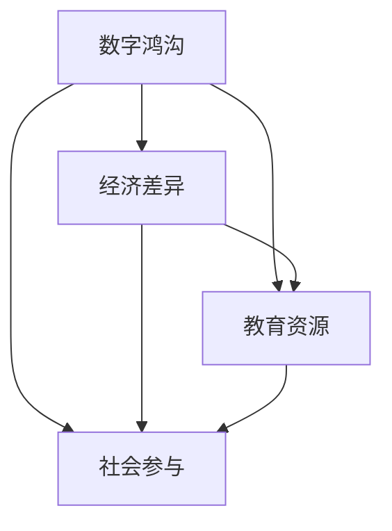
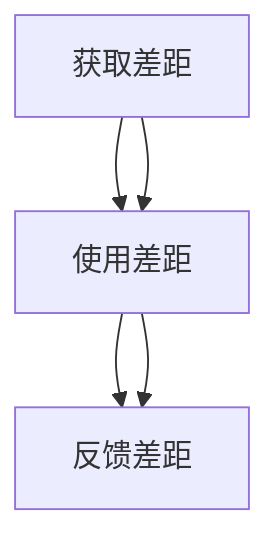

                 

# 数字鸿沟：人类计算中的公平问题

## 1. 背景介绍

在数字化和智能化的飞速发展中，计算技术的普及与应用为社会进步和经济发展注入了强大的动力。然而，技术的背后，也存在着不容忽视的数字鸿沟问题。数字鸿沟不仅体现为不同人群之间在科技获取和应用上的不平衡，也涉及信息获取、教育资源、社会参与等多方面的不平等。这一现象尤其在发展中国家以及低收入群体中更为明显。

本文旨在深入探讨数字鸿沟问题，特别是在计算能力方面的差异，以及如何通过技术手段和政策措施来缩小这一差距，推动社会的公平与包容性。

## 2. 核心概念与联系

### 2.1 核心概念概述

数字鸿沟（Digital Divide）是指不同社会群体在获取和利用信息通信技术（ICT）方面存在的差距。这一概念最早由罗杰斯（Rogers）在20世纪末提出，主要用来描述经济、教育、性别、种族等方面在信息获取和使用上的不平等现象。

核心概念间联系图：

数字鸿沟的成因复杂多样，包括但不限于经济条件、教育水平、性别、种族、地理位置、技术接受度等。在计算能力方面，数字鸿沟通常表现为技术获取渠道的不同、设备资源的不足、知识技能的差异等。

### 2.2 核心概念原理和架构

数字鸿沟的核心原理可以概括为“获取-使用-反馈”循环。具体而言：

1. **获取差距**：由于经济条件、教育水平和地理位置等因素，一些人群无法获取或负担不起必要的计算设备或网络连接。
2. **使用差距**：即使能够获取计算资源，没有相关知识技能的个体仍然难以有效使用这些资源。
3. **反馈差距**：缺乏反馈机制和缺乏实际应用经验的个体，难以从使用中获得技能提升和价值认同。

数字鸿沟的架构可以表示为：

### 2.3 Mermaid流程图

![数字鸿沟模型](https://mermaid.js/examplediagram/?start:1&dagamanaged=1&dagamanaged=1&dagamanaged=1&dagamanaged=1&dagamanaged=1&dagamanaged=1&dagamanaged=1&dagamanaged=1&dagamanaged=1&dagamanaged=1&dagamanaged=1&dagamanaged=1&dagamanaged=1&dagamanaged=1&dagamanaged=1&dagamanaged=1&dagamanaged=1&dagamanaged=1&dagamanaged=1&dagamanaged=1&dagamanaged=1&dagamanaged=1&dagamanaged=1&dagamanaged=1&dagamanaged=1&dagamanaged=1&dagamanaged=1&dagamanaged=1&dagamanaged=1&dagamanaged=1&dagamanaged=1&dagamanaged=1&dagamanaged=1&dagamanaged=1&dagamanaged=1&dagamanaged=1&dagamanaged=1&dagamanaged=1&dagamanaged=1&dagamanaged=1&dagamanaged=1&dagamanaged=1&dagamanaged=1&dagamanaged=1&dagamanaged=1&dagamanaged=1&dagamanaged=1&dagamanaged=1&dagamanaged=1&dagamanaged=1&dagamanaged=1&dagamanaged=1&dagamanaged=1&dagamanaged=1&dagamanaged=1&dagamanaged=1&dagamanaged=1&dagamanaged=1&dagamanaged=1&dagamanaged=1&dagamanaged=1&dagamanaged=1&dagamanaged=1&dagamanaged=1&dagamanaged=1&dagamanaged=1&dagamanaged=1&dagamanaged=1&dagamanaged=1&dagamanaged=1&dagamanaged=1&dagamanaged=1&dagamanaged=1&dagamanaged=1&dagamanaged=1&dagamanaged=1&dagamanaged=1&dagamanaged=1&dagamanaged=1&dagamanaged=1&dagamanaged=1&dagamanaged=1&dagamanaged=1&dagamanaged=1&dagamanaged=1&dagamanaged=1&dagamanaged=1&dagamanaged=1&dagamanaged=1&dagamanaged=1&dagamanaged=1&dagamanaged=1&dagamanaged=1&dagamanaged=1&dagamanaged=1&dagamanaged=1&dagamanaged=1&dagamanaged=1&dagamanaged=1&dagamanaged=1&dagamanaged=1&dagamanaged=1&dagamanaged=1&dagamanaged=1&dagamanaged=1&dagamanaged=1&dagamanaged=1&dagamanaged=1&dagamanaged=1&dagamanaged=1&dagamanaged=1&dagamanaged=1&dagamanaged=1&dagamanaged=1&dagamanaged=1&dagamanaged=1&dagamanaged=1&dagamanaged=1&dagamanaged=1&dagamanaged=1&dagamanaged=1&dagamanaged=1&dagamanaged=1&dagamanaged=1&dagamanaged=1&dagamanaged=1&dagamanaged=1&dagamanaged=1&dagamanaged=1&dagamanaged=1&dagamanaged=1&dagamanaged=1&dagamanaged=1&dagamanaged=1&dagamanaged=1&dagamanaged=1&dagamanaged=1&dagamanaged=1&dagamanaged=1&dagamanaged=1&dagamanaged=1&dagamanaged=1&dagamanaged=1&dagamanaged=1&dagamanaged=1&dagamanaged=1&dagamanaged=1&dagamanaged=1&dagamanaged=1&dagamanaged=1&dagamanaged=1&dagamanaged=1&dagamanaged=1&dagamanaged=1&dagamanaged=1&dagamanaged=1&dagamanaged=1&dagamanaged=1&dagamanaged=1&dagamanaged=1&dagamanaged=1&dagamanaged=1&dagamanaged=1&dagamanaged=1&dagamanaged=1&dagamanaged=1&dagamanaged=1&dagamanaged=1&dagamanaged=1&dagamanaged=1&dagamanaged=1&dagamanaged=1&dagamanaged=1&dagamanaged=1&dagamanaged=1&dagamanaged=1&dagamanaged=1&dagamanaged=1&dagamanaged=1&dagamanaged=1&dagamanaged=1&dagamanaged=1&dagamanaged=1&dagamanaged=1&dagamanaged=1&dagamanaged=1&dagamanaged=1&dagamanaged=1&dagamanaged=1&dagamanaged=1&dagamanaged=1&dagamanaged=1&dagamanaged=1&dagamanaged=1&dagamanaged=1&dagamanaged=1&dagamanaged=1&dagamanaged=1&dagamanaged=1&dagamanaged=1&dagamanaged=1&dagamanaged=1&dagamanaged=1&dagamanaged=1&dagamanaged=1&dagamanaged=1&dagamanaged=1&dagamanaged=1&dagamanaged=1&dagamanaged=1&dagamanaged=1&dagamanaged=1&dagamanaged=1&dagamanaged=1&dagamanaged=1&dagamanaged=1&dagamanaged=1&dagamanaged=1&dagamanaged=1&dagamanaged=1&dagamanaged=1&dagamanaged=1&dagamanaged=1&dagamanaged=1&dagamanaged=1&dagamanaged=1&dagamanaged=1&dagamanaged=1&dagamanaged=1&dagamanaged=1&dagamanaged=1&dagamanaged=1&dagamanaged=1&dagamanaged=1&dagamanaged=1&dagamanaged=1&dagamanaged=1&dagamanaged=1&dagamanaged=1&dagamanaged=1&dagamanaged=1&dagamanaged=1&dagamanaged=1&dagamanaged=1&dagamanaged=1&dagamanaged=1&dagamanaged=1&dagamanaged=1&dagamanaged=1&dagamanaged=1&dagamanaged=1&dagamanaged=1&dagamanaged=1&dagamanaged=1&dagamanaged=1&dagamanaged=1&dagamanaged=1&dagamanaged=1&dagamanaged=1&dagamanaged=1&dagamanaged=1&dagamanaged=1&dagamanaged=1&dagamanaged=1&dagamanaged=1&dagamanaged=1&dagamanaged=1&dagamanaged=1&dagamanaged=1&dagamanaged=1&dagamanaged=1&dagamanaged=1&dagamanaged=1&dagamanaged=1&dagamanaged=1&dagamanaged=1&dagamanaged=1&dagamanaged=1&dagamanaged=1&dagamanaged=1&dagamanaged=1&dagamanaged=1&dagamanaged=1&dagamanaged=1&dagamanaged=1&dagamanaged=1&dagamanaged=1&dagamanaged=1&dagamanaged=1&dagamanaged=1&dagamanaged=1&dagamanaged=1&dagamanaged=1&dagamanaged=1&dagamanaged=1&dagamanaged=1&dagamanaged=1&dagamanaged=1&dagamanaged=1&dagamanaged=1&dagamanaged=1&dagamanaged=1&dagamanaged=1&dagamanaged=1&dagamanaged=1&dagamanaged=1&dagamanaged=1&dagamanaged=1&dagamanaged=1&dagamanaged=1&dagamanaged=1&dagamanaged=1&dagamanaged=1&dagamanaged=1&dagamanaged=1&dagamanaged=1&dagamanaged=1&dagamanaged=1&dagamanaged=1&dagamanaged=1&dagamanaged=1&dagamanaged=1&dagamanaged=1&dagamanaged=1&dagamanaged=1&dagamanaged=1&dagamanaged=1&dagamanaged=1&dagamanaged=1&dagamanaged=1&dagamanaged=1&dagamanaged=1&dagamanaged=1&dagamanaged=1&dagamanaged=1&dagamanaged=1&dagamanaged=1&dagamanaged=1&dagamanaged=1&dagamanaged=1&dagamanaged=1&dagamanaged=1&dagamanaged=1&dagamanaged=1&dagamanaged=1&dagamanaged=1&dagamanaged=1&dagamanaged=1&dagamanaged=1&dagamanaged=1&dagamanaged=1&dagamanaged=1&dagamanaged=1&dagamanaged=1&dagamanaged=1&dagamanaged=1&dagamanaged=1&dagamanaged=1&dagamanaged=1&dagamanaged=1&dagamanaged=1&dagamanaged=1&dagamanaged=1&dagamanaged=1&dagamanaged=1&dagamanaged=1&dagamanaged=1&dagamanaged=1&dagamanaged=1&dagamanaged=1&dagamanaged=1&dagamanaged=1&dagamanaged=1&dagamanaged=1&dagamanaged=1&dagamanaged=1&dagamanaged=1&dagamanaged=1&dagamanaged=1&dagamanaged=1&dagamanaged=1&dagamanaged=1&dagamanaged=1&dagamanaged=1&dagamanaged=1&dagamanaged=1&dagamanaged=1&dagamanaged=1&dagamanaged=1&dagamanaged=1&dagamanaged=1&dagamanaged=1&dagamanaged=1&dagamanaged=1&dagamanaged=1&dagamanaged=1&dagamanaged=1&dagamanaged=1&dagamanaged=1&dagamanaged=1&dagamanaged=1&dagamanaged=1&dagamanaged=1&dagamanaged=1&dagamanaged=1&dagamanaged=1&dagamanaged=1&dagamanaged=1&dagamanaged=1&dagamanaged=1&dagamanaged=1&dagamanaged=1&dagamanaged=1&dagamanaged=1&dagamanaged=1&dagamanaged=1&dagamanaged=1&dagamanaged=1&dagamanaged=1&dagamanaged=1&dagamanaged=1&dagamanaged=1&dagamanaged=1&dagamanaged=1&dagamanaged=1&dagamanaged=1&dagamanaged=1&dagamanaged=1&dagamanaged=1&dagamanaged=1&dagamanaged=1&dagamanaged=1&dagamanaged=1&dagamanaged=1&dagamanaged=1&dagamanaged=1&dagamanaged=1&dagamanaged=1&dagamanaged=1&dagamanaged=1&dagamanaged=1&dagamanaged=1&dagamanaged=1&dagamanaged=1&dagamanaged=1&dagamanaged=1&dagamanaged=1&dagamanaged=1&dagamanaged=1&dagamanaged=1&dagamanaged=1&dagamanaged=1&dagamanaged=1&dagamanaged=1&dagamanaged=1&dagamanaged=1&dagamanaged=1&dagamanaged=1&dagamanaged=1&dagamanaged=1&dagamanaged=1&dagamanaged=1&dagamanaged=1&dagamanaged=1&dagamanaged=1&dagamanaged=1&dagamanaged=1&dagamanaged=1&dagamanaged=1&dagamanaged=1&dagamanaged=1&dagamanaged=1&dagamanaged=1&dagamanaged=1&dagamanaged=1&dagamanaged=1&dagamanaged=1&dagamanaged=1&dagamanaged=1&dagamanaged=1&dagamanaged=1&dagamanaged=1&dagamanaged=1&dagamanaged=1&dagamanaged=1&dagamanaged=1&dagamanaged=1&dagamanaged=1&dagamanaged=1&dagamanaged=1&dagamanaged=1&dagamanaged=1&dagamanaged=1&dagamanaged=1&dagamanaged=1&dagamanaged=1&dagamanaged=1&dagamanaged=1&dagamanaged=1&dagamanaged=1&dagamanaged=1&dagamanaged=1&dagamanaged=1&dagamanaged=1&dagamanaged=1&dagamanaged=1&dagamanaged=1&dagamanaged=1&dagamanaged=1&dagamanaged=1&dagamanaged=1&dagamanaged=1&dagamanaged=1&dagamanaged=1&dagamanaged=1&dagamanaged=1&dagamanaged=1&dagamanaged=1&dagamanaged=1&dagamanaged=1&dagamanaged=1&dagamanaged=1&dagamanaged=1&dagamanaged=1&dagamanaged=1&dagamanaged=1&dagamanaged=1&dagamanaged=1&dagamanaged=1&dagamanaged=1&dagamanaged=1&dagamanaged=1&dagamanaged=1&dagamanaged=1&dagamanaged=1&dagamanaged=1&dagamanaged=1&dagamanaged=1&dagamanaged=1&dagamanaged=1&dagamanaged=1&dagamanaged=1&dagamanaged=1&dagamanaged=1&dagamanaged=1&dagamanaged=1&dagamanaged=1&dagamanaged=1&dagamanaged=1&dagamanaged=1&dagamanaged=1&dagamanaged=1&dagamanaged=1&dagamanaged=1&dagamanaged=1&dagamanaged=1&dagamanaged=1&dagamanaged=1&dagamanaged=1&dagamanaged=1&dagamanaged=1&dagamanaged=1&dagamanaged=1&dagamanaged=1&dagamanaged=1&dagamanaged=1&dagamanaged=1&dagamanaged=1&dagamanaged=1&dagamanaged=1&dagamanaged=1&dagamanaged=1&dagamanaged=1&dagamanaged=1&dagamanaged=1&dagamanaged=1&dagamanaged=1&dagamanaged=1&dagamanaged=1&dagamanaged=1&dagamanaged=1&dagamanaged=1&dagamanaged=1&dagamanaged=1&dagamanaged=1&dagamanaged=1&dagamanaged=1&dagamanaged=1&dagamanaged=1&dagamanaged=1&dagamanaged=1&dagamanaged=1&dagamanaged=1&dagamanaged=1&dagamanaged=1&dagamanaged=1&dagamanaged=1&dagamanaged=1&dagamanaged=1&dagamanaged=1&dagamanaged=1&dagamanaged=1&dagamanaged=1&dagamanaged=1&dagamanaged=1&dagamanaged=1&dagamanaged=1&dagamanaged=1&dagamanaged=1&dagamanaged=1&dagamanaged=1&dagamanaged=1&dagamanaged=1&dagamanaged=1&dagamanaged=1&dagamanaged=1&dagamanaged=1&dagamanaged=1&dagamanaged=1&dagamanaged=1&dagamanaged=1&dagamanaged=1&dagamanaged=1&dagamanaged=1&dagamanaged=1&dagamanaged=1&dagamanaged=1&dagamanaged=1&dagamanaged=1&dagamanaged=1&dagamanaged=1&dagamanaged=1&dagamanaged=1&dagamanaged=1&dagamanaged=1&dagamanaged=1&dagamanaged=1&dagamanaged=1&dagamanaged=1&dagamanaged=1&dagamanaged=1&dagamanaged=1&dagamanaged=1&dagamanaged=1&dagamanaged=1&dagamanaged=1&dagamanaged=1&dagamanaged=1&dagamanaged=1&dagamanaged=1&dagamanaged=1&dagamanaged=1&dagamanaged=1&dagamanaged=1&dagamanaged=1&dagamanaged=1&dagamanaged=1&dagamanaged=1&dagamanaged=1&dagamanaged=1&dagamanaged=1&dagamanaged=1&dagamanaged=1&dagamanaged=1&dagamanaged=1&dagamanaged=1&dagamanaged=1&dagamanaged=1&dagamanaged=1&dagamanaged=1&dagamanaged=1&dagamanaged=1&dagamanaged=1&dagamanaged=1&dagamanaged=1&dagamanaged=1&dagamanaged=1&dagamanaged=1&dagamanaged=1&dagamanaged=1&dagamanaged=1&dagamanaged=1&dagamanaged=1&dagamanaged=1&dagamanaged=1&dagamanaged=1&dagamanaged=1&dagamanaged=1&dagamanaged=1&dagamanaged=1&dagamanaged=1&dagamanaged=1&dagamanaged=1&dagamanaged=1&dagamanaged=1&dagamanaged=1&dagamanaged=1&dagamanaged=1&dagamanaged=1&dagamanaged=1&dagamanaged=1&dagamanaged=1&dagamanaged=1&dagamanaged=1&dagamanaged=1&dagamanaged=1&dagamanaged=1&dagamanaged=1&dagamanaged=1&dagamanaged=1&dagamanaged=1&dagamanaged=1&dagamanaged=1&dagamanaged=1&dagamanaged=1&dagamanaged=1&dagamanaged=1&dagamanaged=1&dagamanaged=1&dagamanaged=1&dagamanaged=1&dagamanaged=1&dagamanaged=1&dagamanaged=1&dagamanaged=1&dagamanaged=1&dagamanaged=1&dagamanaged=1&dagamanaged=1&dagamanaged=1&dagamanaged=1&dagamanaged=1&dagamanaged=1&dagamanaged=1&dagamanaged=1&dagamanaged=1&dagamanaged=1&dagamanaged=1&dagamanaged=1&dagamanaged=1&dagamanaged=1&dagamanaged=1&dagamanaged=1&dagamanaged=1&dagamanaged=1&dagamanaged=1&dagamanaged=1&dagamanaged=1&dagamanaged=1&dagamanaged=1&dagamanaged=1&dagamanaged=1&dagamanaged=1&dagamanaged=1&dagamanaged=1&dagamanaged=1&dagamanaged=1&dagamanaged=1&dagamanaged=1&dagamanaged=1&dagamanaged=1&dagamanaged=1&dagamanaged=1&dagamanaged=1&dagamanaged=1&dagamanaged=1&dagamanaged=1&dagamanaged=1&dagamanaged=1&dagamanaged=1&dagamanaged=1&dagamanaged=1&dagamanaged=1&dagamanaged=1&dagamanaged=1&dagamanaged=1&dagamanaged=1&dagamanaged=1&dagamanaged=1&dagamanaged=1&dagamanaged=1&dagamanaged=1&dagamanaged=1&dagamanaged=1&dagamanaged=1&dagamanaged=1&dagamanaged=1&dagamanaged=1&dagamanaged=1&dagamanaged=1&dagamanaged=1&dagamanaged=1&dagamanaged=1&dagamanaged=1&dagamanaged=1&dagamanaged=1&dagamanaged=1&dagamanaged=1&dagamanaged=1&dagamanaged=1&dagamanaged=1&dagamanaged=1&dagamanaged=1&dagamanaged=1&dagamanaged=1&dagamanaged=1&dagamanaged=1&dagamanaged=1&dagamanaged=1&dagamanaged=1&dagamanaged=1&dagamanaged=1&dagamanaged=1&dagamanaged=1&dagamanaged=1&dagamanaged=1&dagamanaged=1&dagamanaged=1&dagamanaged=1&dagamanaged=1&dagamanaged=1&dagamanaged=1&dagamanaged=1&dagamanaged=1&dagamanaged=1&dagamanaged=1&dagamanaged=1&dagamanaged=1&dagamanaged=1&dagamanaged=1&dagamanaged=1&dagamanaged=1&dagamanaged=1&dagamanaged=1&dagamanaged=1&dagamanaged=1&dagamanaged=1&dagamanaged=1&dagamanaged=1&dagamanaged=1&dagamanaged=1&dagamanaged=1&dagamanaged=1&dagamanaged=1&dagamanaged=1&dagamanaged=1&dagamanaged=1&dagamanaged=1&dagamanaged=1&dagamanaged=1&dagamanaged=1&dagamanaged=1&dagamanaged=1&dagamanaged=1&dagamanaged=1&dagamanaged=1&dagamanaged=1&dagamanaged=1&dagamanaged=1&dagamanaged=1&dagamanaged=1&dagamanaged=1&dagamanaged=1&dagamanaged=1&dagamanaged=1&dagamanaged=1&dagamanaged=1&dagamanaged=1&dagamanaged=1&dagamanaged=1&dagamanaged=1&dagamanaged=1&dagamanaged=1&dagamanaged=1&dagamanaged=1&dagamanaged=1&dagamanaged=1&dagamanaged=1&dagamanaged=1&dagamanaged=1&dagamanaged=1&dagamanaged=1&dagamanaged=1&dagamanaged=1&dagamanaged=1&dagamanaged=1&dagamanaged=1&dagamanaged=1&dagamanaged=1&dagamanaged=1&dagamanaged=1&dagamanaged=1&dagamanaged=1&dagamanaged=1&dagamanaged=1&dagamanaged=1&dagamanaged=1&dagamanaged=1&dagamanaged=1&dagamanaged=1&dagamanaged=1&dagamanaged=1&dagamanaged=1&dagamanaged=1&dagamanaged=1&dagamanaged=1&dagamanaged=1&dagamanaged=1&dagamanaged=1&dagamanaged=1&dagamanaged=1&dagamanaged=1&dagamanaged=1&dagamanaged=1&dagamanaged=1&dagamanaged=1&dagamanaged=1&dagamanaged=1&dagamanaged=1&dagamanaged=1&dagamanaged=1&dagamanaged=1&dagamanaged=1&dagamanaged=1&dagamanaged=1&dagamanaged=1&dagamanaged=1&dagamanaged=1&dagamanaged=1&dagamanaged=1&dagamanaged=1&dagamanaged=1&dagamanaged=1&dagamanaged=1&dagamanaged=1&dagamanaged=1&dagamanaged=1&dagamanaged=1&dagamanaged=1&dagamanaged=1&dagamanaged=1&dagamanaged=1&dagamanaged=1&dagamanaged=1&dagamanaged=1&dagamanaged=1&dagamanaged=1&dagamanaged=1&dagamanaged=1&dagamanaged=1&dagamanaged=1&dagamanaged=1&dagamanaged=1&dagamanaged=1&dagamanaged=1&dagamanaged=1&dagamanaged=1&dagamanaged=1&dagamanaged=1&dagamanaged=1&dagamanaged=1&dagamanaged=1&dagamanaged=1&dagamanaged=1&dagamanaged=1&dagamanaged=1&dagamanaged=1&dagamanaged=1&dagamanaged=1&dagamanaged=1&dagamanaged=1&dagamanaged=1&dagamanaged=1&dagamanaged=1&dagamanaged=1&dagamanaged=1&dagamanaged=1&dagamanaged=1&dagamanaged=1&dagamanaged=1&dagamanaged=1&dagamanaged=1&dagamanaged=1&dagamanaged=1&dagamanaged=1&dagamanaged=1&dagamanaged=1&dagamanaged=1&dagamanaged=1&dagamanaged=1&dagamanaged=1&dagamanaged=1&dagamanaged=1&dagamanaged=1&dagamanaged=1&dagamanaged=1&dagamanaged=1&dagamanaged=1&dagamanaged=1&dagamanaged=1&dagamanaged=1&dagamanaged=1&dagamanaged=1&dagamanaged=1&dagamanaged=1&dagamanaged=1&dagamanaged=1&dagamanaged=1&dagamanaged=1&dagamanaged=1&dagamanaged=1&dagamanaged=1&dagamanaged=1&dagamanaged=1&dagamanaged=1&dagamanaged=1&dagamanaged=1&dagamanaged=1&dagamanaged=1&dagamanaged=1&dagamanaged=1&dagamanaged=1&dagamanaged=1&dagamanaged=1&dagamanaged=1&dagamanaged=1&dagamanaged=1&dagamanaged=1&dagamanaged=1&dagamanaged=1&dagamanaged=1&dagamanaged=1&dagamanaged=1&dagamanaged=1&dagamanaged=1&dagamanaged=1&dagamanaged=1&dagamanaged=1&dagamanaged=1&dagamanaged=1&dagamanaged=1&dagamanaged=1&dagamanaged=1&dagamanaged=1&dagamanaged=1&dagamanaged=1&dagamanaged=1&dagamanaged=1&dagamanaged=1&dagamanaged=1&dagamanaged=1&dagamanaged=1&dagamanaged=1&dagamanaged=1&dagamanaged=1&dagamanaged=1&dagamanaged=1&dagamanaged=1&dagamanaged=1&dagamanaged=1&dagamanaged=1&dagamanaged=1&dagamanaged=1&dagamanaged=1&dagamanaged=1&dagamanaged=1&dagamanaged=1&dagamanaged=1&dagamanaged=1&dagamanaged=1&dagamanaged=1&dagamanaged=1&dagamanaged=1&dagamanaged=1&dagamanaged=1&dagamanaged=1&dagamanaged=1&dagamanaged=1&dagamanaged=1&dagamanaged=1&dagamanaged=1&dagamanaged=1&dagamanaged=1&dagamanaged=1&dagamanaged=1&dagamanaged=1&dagamanaged=1&dagamanaged=1&dagamanaged=1&dagamanaged=1&dagamanaged=1&dagamanaged=1&dagamanaged=1&dagamanaged=1&dagamanaged=1&dagamanaged=1&dagamanaged=1&dagamanaged=1&dagamanaged=1&dagamanaged=1&dagamanaged=1&dagamanaged=1&dagamanaged=1&dagamanaged=1&dagamanaged=1&dagamanaged=1&dagamanaged=1&dagamanaged=1&dagamanaged=1&dagamanaged=1&dagamanaged=1&dagamanaged=1&dagamanaged=1&dagamanaged=1&dagamanaged=1&dagamanaged=1&dagamanaged=1&dagamanaged=1&dagamanaged=1&dagamanaged=1&dagamanaged=1&dagamanaged=1&dagamanaged=1&dagamanaged=1&dagamanaged=1&dagamanaged=1&dagamanaged=1&dagamanaged=1&dagamanaged=1&dagamanaged=1&dagamanaged=1&dagamanaged=1&dagamanaged=1&dagamanaged=1&dagamanaged=1&dagamanaged=1&dagamanaged=1&dagamanaged=1&dagamanaged=1&dagamanaged=1&dagamanaged=1&dagamanaged=1&dagamanaged=1&dagamanaged=1&dagamanaged=1&dagamanaged=1&dagamanaged=1&dagamanaged=1&dagamanaged=1&dagamanaged=1&dagamanaged=1&dagamanaged=1&dagamanaged=1&dagamanaged=1&dagamanaged=1&dagamanaged=1&dagamanaged=1&dagamanaged=1&dagamanaged=1&dagamanaged=1&dagamanaged=1&dagamanaged=1&dagamanaged=1&dagamanaged=1&dagamanaged=1&dagamanaged=1&dagamanaged=1&dagamanaged=1&dagamanaged=1&dagamanaged=1&dagamanaged=1&dagamanaged=1&dagamanaged=1&dagamanaged=1&dagamanaged=1&dagamanaged=1&dagamanaged=1&dagamanaged=1&dagamanaged=1&dagamanaged=1&dagamanaged=1&dagamanaged=1&dagamanaged=1&dagamanaged=1&dagamanaged=1&dagamanaged=1&dagamanaged=1&dagamanaged=1&dagamanaged=1&dagamanaged=1&dagamanaged=1&dagamanaged=1&dagamanaged=1&dagamanaged=1&dagamanaged=1&dagamanaged=1&dagamanaged=1&dagamanaged=1&dagamanaged=1&dagamanaged=1&dagamanaged=1&dagamanaged=1&dagamanaged=1&dagamanaged=1&dagamanaged=1&dagamanaged=1&dagamanaged=1&dagamanaged=1&dagamanaged=1&dagamanaged=1&dagamanaged=1&dagamanaged=1&dagamanaged=1&dagamanaged=1&dagamanaged=1&dagamanaged=1&dagamanaged=1&dagamanaged=1&dagamanaged=1&dagamanaged=1&dagamanaged=1&dagamanaged=1&dagamanaged=1&dagamanaged=1&dagamanaged=1&dagamanaged=1&dagamanaged=1&dagamanaged=1&dagamanaged=1&dagamanaged=1&dagamanaged=1&dagamanaged=1&dagamanaged=1&dagamanaged=1&dagamanaged=1&dagamanaged=1&dagamanaged=1&dagamanaged=1&dagamanaged=1&dagamanaged=1&dagamanaged=1&dagamanaged=1&dagamanaged=1&dagamanaged=1&dagamanaged=1&dagamanaged=1&dagamanaged=1&dagamanaged=1&dagamanaged=1&dagamanaged=1&dagamanaged=1&dagamanaged=1&dagamanaged=1&dagamanaged=1&dagamanaged=1&dagamanaged=1&dagamanaged=1&dagamanaged=1&dagamanaged=1&dagamanaged=1&dagamanaged=1&dagamanaged=1&dagamanaged=1&dagamanaged=1&dagamanaged=1&dagamanaged=1&dagamanaged=1&dagamanaged=1&dagamanaged=1&dagamanaged=1&dagamanaged=1&dagamanaged=1&dagamanaged=1&dagamanaged=1&dagamanaged=1&dagamanaged=1&dagamanaged=1&dagamanaged=1&dagamanaged=1&dagamanaged=1&dagamanaged=1&dagamanaged=1&dagamanaged=1&dagamanaged=1&dagamanaged=1&dagamanaged=1&dagamanaged=1&dagamanaged=1&dagamanaged=1&dagamanaged=1&dagamanaged=1&dagamanaged=1&dagamanaged=1&dagamanaged=1&dagamanaged=1&dagamanaged=1&dagamanaged=1&dagamanaged=1&dagamanaged=1&dagamanaged=1&dagamanaged=1&dagamanaged=1&dagamanaged=1&dagamanaged=1&dagamanaged=1&dagamanaged=1&dagamanaged=1&dagamanaged=1&dagamanaged=1&dagamanaged=1&dagamanaged=1&dagamanaged=1&dagamanaged=1&dagamanaged=1&dagamanaged=1&dagamanaged=1&dagamanaged=1&dagamanaged=1&dagamanaged=1&dagamanaged=1&dagamanaged=1&dagamanaged=1&dagamanaged=1&dagamanaged=1&dagamanaged=1&dagamanaged=1&dagamanaged=1&dagamanaged=1&dagamanaged=1&dagamanaged=1&dagamanaged=1&dagamanaged=1&dagamanaged=1&dagamanaged=1&dagamanaged=1&dagamanaged=1&dagamanaged=1&dagamanaged=1&dagamanaged=1&dagamanaged=1&dagamanaged=1&dagamanaged=1&dagamanaged=1&dagamanaged=1&dagamanaged=1&dagamanaged=1&dagamanaged=1&dagamanaged=1&dagamanaged=1&dagamanaged=1&dagamanaged=1&dagamanaged=1&dagamanaged=1&dagamanaged=1&dagamanaged=1&dagamanaged=1&dagamanaged=1&dagamanaged=1&dagamanaged=1&dagamanaged=1&dagamanaged=1&dagamanaged=1&dagamanaged=1&dagamanaged=1&dagamanaged=1&dagamanaged=1&dagamanaged=1&dagamanaged=1&dagamanaged=1&dagamanaged=1&dagamanaged=1&dagamanaged=1&dagamanaged=1&dagamanaged=1&dagamanaged=1&dagamanaged=1&dagamanaged=1&dagamanaged=1&dagamanaged=1&dagamanaged=1&dagamanaged=1&dagamanaged=1&dagamanaged=1&dagamanaged=1&dagamanaged=1&dagamanaged=1&dagamanaged=1&dagamanaged=1&dagamanaged=1&dagamanaged=1&dagamanaged=1&dagamanaged=1&dagamanaged=1&dagamanaged=1&dagamanaged=1&dagamanaged=1&dagamanaged=1&dagamanaged=1&dagamanaged=1&dagamanaged=1&dagamanaged=1&dagamanaged=1&dagamanaged=1&dagamanaged=1&dagamanaged=1&dagamanaged=1&dagamanaged=1&dagamanaged=1&dagamanaged=1&dagamanaged=1&dagamanaged=1&dagamanaged=1&dagamanaged=1&dagamanaged=1&dagamanaged=1&dagamanaged=1&dagamanaged=1&dagamanaged=1&dagamanaged=1&dagamanaged=1&dagamanaged=1&dagamanaged=1&dagamanaged=1&dagamanaged=1&dagamanaged=1&dagamanaged=1&dagamanaged=1&dagamanaged=1&dagamanaged=1&dagamanaged=1&dagamanaged=1&dagamanaged=1&dagamanaged=1&dagamanaged=1&dagamanaged=1&dagamanaged=1&dagamanaged=1&dagamanaged=1&dagamanaged=1&dagamanaged=1&dagamanaged=1&dagamanaged=1&dagamanaged=1&dagamanaged=1&dagamanaged=1&dagamanaged=1&dagamanaged=1&dagamanaged=1&dagamanaged=1&dagamanaged=1&dagamanaged=1&dagamanaged=1&dagamanaged=1&dagamanaged=1&dagamanaged=1&dagamanaged=1&dagamanaged=1&dagamanaged=1&dagamanaged=1&dagamanaged=1&dagamanaged=1&dagamanaged=1&dagamanaged=1&dag

