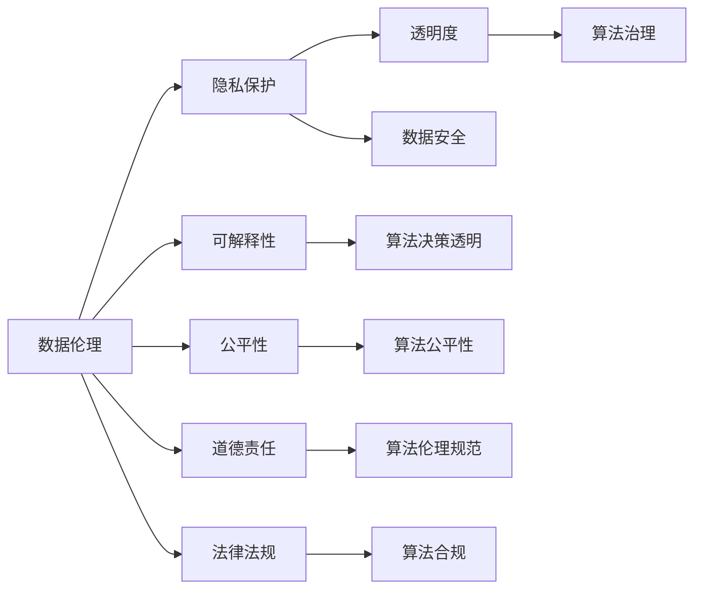

                 

# 数据伦理：算法治理与规范

> 关键词：数据伦理, 算法治理, 规范框架, 隐私保护, 可解释性, 公平性, 透明度, 道德责任, 法律法规

## 1. 背景介绍

在人工智能(AI)技术快速发展的今天，算法在诸多领域已经展现出巨大的应用潜力。从智能推荐、图像识别到自动驾驶、医疗诊断，算法都在发挥着至关重要的作用。然而，随着算法影响力的日益扩大，其在数据伦理、隐私保护、公平性、透明性等方面的问题也逐渐引起人们的关注。

算法作为技术手段，其背后涉及的伦理、法律和伦理责任问题，已成为不可忽视的重要话题。数据伦理是指在数据收集、存储、使用过程中遵循的道德和法律原则，包括但不限于隐私保护、数据安全、数据公平等。在人工智能时代，数据伦理已成为算法治理与规范的重要组成部分。

## 2. 核心概念与联系

### 2.1 核心概念概述

为更好地理解数据伦理在算法治理中的作用，本节将介绍几个关键概念及其之间的联系：

- **数据伦理**：指在数据收集、存储、使用过程中遵循的道德和法律原则，包括但不限于隐私保护、数据安全、数据公平等。
- **算法治理**：指在算法设计、开发、应用过程中遵循的伦理和法律规范，确保算法的公正性、透明性、责任性等。
- **规范框架**：指用于指导算法设计、开发、应用过程中遵循的伦理和法律规范，提供具体的操作指南。
- **隐私保护**：指在数据处理过程中保护个人隐私不被泄露、滥用。
- **可解释性**：指算法应具备可解释的能力，确保用户理解其决策过程。
- **公平性**：指算法应具备对所有用户公平对待的能力，避免偏见和歧视。
- **透明度**：指算法的运作应具备透明度，确保用户了解算法的运作原理和决策依据。
- **道德责任**：指算法开发者和使用者应承担的道德责任，确保算法行为的合理性和伦理性。
- **法律法规**：指国家法律法规对算法治理的相关要求，如数据保护法、反垄断法等。

这些概念之间的联系可以通过以下Mermaid流程图来展示：



这个流程图展示了大数据伦理在算法治理与规范中的核心概念及其相互关系：

1. 数据伦理是算法治理的基础，包含多个子领域如隐私保护、可解释性、公平性等。
2. 隐私保护和数据安全是数据伦理的核心内容之一，确保数据在处理过程中不被滥用和泄露。
3. 可解释性和透明度是算法决策的必要条件，确保用户理解算法的决策过程和依据。
4. 公平性和道德责任是算法治理中的重要原则，确保算法的公正性和伦理性。
5. 法律法规为算法治理提供了法律保障，确保算法符合法律要求。

## 3. 核心算法原理 & 具体操作步骤

### 3.1 算法原理概述

数据伦理在算法治理中的核心作用是确保算法的公正性、透明性和合规性。具体来说，数据伦理在算法治理中的应用包括：

- **隐私保护**：在数据收集、存储和使用过程中，采取有效措施保护个人隐私，避免数据泄露和滥用。
- **可解释性**：确保算法的决策过程透明，用户能够理解算法的行为依据。
- **公平性**：确保算法对所有用户公平对待，避免偏见和歧视。
- **合规性**：确保算法遵守相关法律法规，避免违法违规行为。

### 3.2 算法步骤详解

数据伦理在算法治理中的应用步骤包括：

1. **数据收集**：在数据收集过程中，确保遵守隐私保护和数据安全的要求，如获取用户明确同意、匿名化处理等。
2. **数据处理**：在数据处理过程中，确保数据处理的透明性和公平性，如数据清洗、特征选择等。
3. **算法设计**：在算法设计过程中，确保算法设计的可解释性和公平性，如选择合适的模型、参数调优等。
4. **算法训练**：在算法训练过程中，确保训练数据的多样性和公平性，如数据增强、公平性训练等。
5. **算法评估**：在算法评估过程中，确保评估指标的公正性和透明性，如交叉验证、公平性评估等。
6. **算法部署**：在算法部署过程中，确保算法部署的透明性和合规性，如数据接口、隐私保护措施等。

### 3.3 算法优缺点

数据伦理在算法治理中的应用具有以下优点：

- **提升公信力**：通过遵守数据伦理规范，提升算法在用户和公众中的信任度。
- **避免法律风险**：通过遵守法律法规，避免算法的违法违规风险。
- **保障公平性**：通过确保算法的公平性和透明性，避免算法偏见和歧视。
- **提升用户体验**：通过确保算法的可解释性，提升用户对算法的理解和使用体验。

同时，数据伦理在算法治理中也有一些缺点：

- **复杂性**：数据伦理涉及多方面的伦理和法律要求，操作复杂。
- **成本高**：确保数据伦理需要投入大量时间和资源，成本较高。
- **技术挑战**：数据伦理的应用需要结合具体技术手段，如数据匿名化、公平性训练等，技术挑战较大。

### 3.4 算法应用领域

数据伦理在算法治理中的应用领域广泛，涵盖以下几个方面：

- **医疗**：确保医疗数据的隐私保护和公平性，避免医疗算法的歧视性。
- **金融**：确保金融数据的隐私保护和公平性，避免金融算法的偏见和歧视。
- **就业**：确保就业数据的公平性，避免算法偏见对求职者的歧视。
- **广告**：确保广告数据的隐私保护和公平性，避免广告算法的歧视性。
- **教育**：确保教育数据的隐私保护和公平性，避免教育算法的偏见和歧视。

## 4. 数学模型和公式 & 详细讲解 & 举例说明

### 4.1 数学模型构建

数据伦理在算法治理中的应用涉及多个方面的数学模型和公式。以下是一些关键的数学模型和公式的构建：

- **隐私保护模型**：如差分隐私（Differential Privacy）模型，通过添加噪声保护个体数据隐私。
- **数据公平性模型**：如公平性误差（Fairness Error）模型，通过计算算法对不同群体的误差来评估公平性。
- **数据可解释性模型**：如LIME（Local Interpretable Model-agnostic Explanations）模型，通过生成局部可解释模型来解释复杂算法的决策过程。
- **算法透明性模型**：如可解释AI（Explainable AI）模型，通过模型可视化、规则提取等方法提升算法透明性。

### 4.2 公式推导过程

以下以差分隐私模型为例，推导其计算公式。

差分隐私模型通过在数据中加入噪声，保护个体数据的隐私。假设原始数据集为 $D=\{x_1, x_2, ..., x_n\}$，其中 $x_i$ 表示第 $i$ 个样本。差分隐私模型通过计算 $\epsilon$-差分隐私的噪声 $\delta$，在数据集上施加噪声得到隐私保护的数据集 $D'$。差分隐私的噪声计算公式为：

$$
\delta = \sqrt{2\epsilon} \times \mathcal{N}(0,1)
$$

其中 $\mathcal{N}(0,1)$ 表示标准正态分布。加入噪声后的隐私保护数据集 $D'$ 为：

$$
D' = \{f(x_i + \delta) | x_i \in D\}
$$

其中 $f(x)$ 表示对数据 $x$ 的处理函数。

### 4.3 案例分析与讲解

以医疗数据为例，分析数据伦理在算法治理中的应用。

在医疗数据的使用过程中，隐私保护是关键问题。医疗机构需要对患者数据进行匿名化处理，确保数据在处理过程中不被滥用。同时，需要对算法进行公平性评估，确保算法对所有患者公平对待，避免对某些患者的歧视。

## 5. 项目实践：代码实例和详细解释说明

### 5.1 开发环境搭建

在进行数据伦理和算法治理实践前，我们需要准备好开发环境。以下是使用Python进行开发的环境配置流程：

1. 安装Anaconda：从官网下载并安装Anaconda，用于创建独立的Python环境。

2. 创建并激活虚拟环境：
```bash
conda create -n ethalgo-env python=3.8 
conda activate ethalgo-env
```

3. 安装相关工具包：
```bash
pip install numpy pandas scikit-learn pytorch torchvision torchaudio
```

4. 安装TensorBoard：用于可视化模型训练过程。
```bash
pip install tensorboard
```

完成上述步骤后，即可在`ethalgo-env`环境中开始数据伦理和算法治理实践。

### 5.2 源代码详细实现

下面以差分隐私模型为例，给出使用PyTorch实现差分隐私的代码实现。

```python
import torch
import torch.nn as nn
import torch.optim as optim
from torch.utils.data import DataLoader
from torchvision.datasets import MNIST
from torchvision.transforms import ToTensor

class Flatten(nn.Module):
    def forward(self, x):
        return x.view(x.size(0), -1)

class Model(nn.Module):
    def __init__(self):
        super(Model, self).__init__()
        self.conv1 = nn.Conv2d(1, 10, kernel_size=5)
        self.conv2 = nn.Conv2d(10, 20, kernel_size=5)
        self.flatten = Flatten()
        self.fc1 = nn.Linear(320, 50)
        self.fc2 = nn.Linear(50, 10)
        self.dropout = nn.Dropout(0.2)

    def forward(self, x):
        x = nn.functional.relu(self.conv1(x))
        x = nn.functional.max_pool2d(x, 2)
        x = nn.functional.relu(self.conv2(x))
        x = nn.functional.max_pool2d(x, 2)
        x = self.flatten(x)
        x = nn.functional.relu(self.fc1(x))
        x = nn.functional.dropout(x, training=self.training)
        x = self.fc2(x)
        return nn.functional.log_softmax(x, dim=1)

def train(model, device, train_loader, optimizer, epoch, noise_sigma):
    model.train()
    train_loss = 0
    for batch_idx, (data, target) in enumerate(train_loader):
        data, target = data.to(device), target.to(device)
        optimizer.zero_grad()
        output = model(data)
        loss = nn.functional.nll_loss(output, target)
        loss += (2 * noise_sigma) ** 2 * torch.sum(data ** 2)
        loss.backward()
        optimizer.step()
        train_loss += loss.item()
        if batch_idx % 100 == 0:
            print('Train Epoch: {} [{}/{} ({:.0f}%)]\tLoss: {:.6f}'.format(
                epoch, batch_idx * len(data), len(train_loader.dataset),
                100. * batch_idx / len(train_loader), loss / (batch_idx + 1)))
    return train_loss / len(train_loader)

def test(model, device, test_loader):
    model.eval()
    test_loss = 0
    correct = 0
    with torch.no_grad():
        for data, target in test_loader:
            data, target = data.to(device), target.to(device)
            output = model(data)
            test_loss += nn.functional.nll_loss(output, target, reduction='sum').item()
            pred = output.argmax(dim=1, keepdim=True)
            correct += pred.eq(target.view_as(pred)).sum().item()

    test_loss /= len(test_loader.dataset)
    print('\nTest set: Average loss: {:.4f}, Accuracy: {}/{} ({:.0f}%)\n'.format(
        test_loss, correct, len(test_loader.dataset),
        100. * correct / len(test_loader.dataset)))

def main():
    device = torch.device("cuda" if torch.cuda.is_available() else "cpu")
    model = Model().to(device)
    optimizer = optim.Adam(model.parameters(), lr=0.001)

    train_loader = DataLoader(MNIST(root='./data', train=True, download=True, transform=ToTensor(), batch_size=64), shuffle=True)
    test_loader = DataLoader(MNIST(root='./data', train=False, download=True, transform=ToTensor(), batch_size=64), shuffle=False)

    noise_sigma = 0.5
    for epoch in range(1, 11):
        train_loss = train(model, device, train_loader, optimizer, epoch, noise_sigma)
        test(model, device, test_loader)

if __name__ == '__main__':
    main()
```

### 5.3 代码解读与分析

让我们再详细解读一下关键代码的实现细节：

**Model类**：
- `__init__`方法：定义了模型结构，包括卷积层、全连接层和Dropout层。
- `forward`方法：实现模型的前向传播。

**train函数**：
- 在每个epoch内，对数据进行批处理，计算损失和噪声，并更新模型参数。
- 在每个batch后输出训练进度。

**test函数**：
- 在测试集上评估模型性能，计算平均损失和准确率。

**main函数**：
- 初始化模型和优化器，加载数据集，并设置噪声参数。
- 在每个epoch后输出训练结果。

此代码展示了如何在PyTorch中实现差分隐私模型。需要注意的是，在实际应用中，需要根据具体任务和数据特点进行模型和参数的调整。

## 6. 实际应用场景

### 6.1 金融行业

在金融行业中，数据伦理的应用尤为重要。金融算法涉及到大量用户的敏感数据，如信用卡、贷款、投资等。金融机构需要对这些数据进行严格的隐私保护和公平性评估，避免算法偏见和歧视。

以贷款审批系统为例，金融机构需要对申请人的信用评分进行评估，以决定是否批准贷款。在数据处理过程中，需要对申请人的个人信息进行匿名化处理，确保隐私不被泄露。同时，需要对评分算法进行公平性评估，确保对不同群体的申请人公平对待，避免对某些群体的歧视。

### 6.2 医疗行业

在医疗行业中，数据伦理的应用同样关键。医疗机构需要处理大量患者的敏感数据，如病历、诊断、治疗方案等。医疗算法需要确保数据的隐私保护和公平性，避免算法偏见和歧视。

以电子病历系统为例，医疗机构需要对患者的病历数据进行匿名化处理，确保数据在处理过程中不被滥用。同时，需要对疾病诊断和治疗方案的算法进行公平性评估，确保对所有患者公平对待，避免对某些患者的歧视。

### 6.3 教育行业

在教育行业中，数据伦理的应用也至关重要。教育机构需要处理大量学生的敏感数据，如成绩、学习行为、课外活动等。教育算法需要确保数据的隐私保护和公平性，避免算法偏见和歧视。

以推荐系统为例，教育机构需要对学生的学习行为进行分析和推荐，以提高学习效果。在数据处理过程中，需要对学生的个人信息进行匿名化处理，确保隐私不被泄露。同时，需要对推荐算法进行公平性评估，确保对所有学生公平对待，避免对某些学生的歧视。

## 7. 工具和资源推荐

### 7.1 学习资源推荐

为了帮助开发者系统掌握数据伦理在算法治理中的应用，这里推荐一些优质的学习资源：

1. **《算法伦理学》**：一本系统介绍算法伦理的书籍，涵盖了隐私保护、公平性、透明性等方面的内容。
2. **Coursera的“数据伦理与隐私保护”课程**：由斯坦福大学教授主讲，系统介绍了数据伦理和隐私保护的基本概念和应用。
3. **Kaggle的“数据伦理与公平性”比赛**：通过实际比赛，帮助开发者理解数据伦理和公平性的应用。
4. **IEEE的“数据伦理”专题文章**：IEEE期刊上发表的关于数据伦理的最新研究论文，涵盖了隐私保护、公平性、透明性等方面的内容。

通过对这些资源的学习实践，相信你一定能够快速掌握数据伦理在算法治理中的应用精髓，并用于解决实际的算法问题。

### 7.2 开发工具推荐

高效的开发离不开优秀的工具支持。以下是几款用于数据伦理和算法治理开发的常用工具：

1. **Anaconda**：用于创建独立的Python环境，方便开发者在多个项目间切换。
2. **PyTorch**：用于深度学习开发，支持动态计算图，方便开发者进行模型训练和推理。
3. **TensorBoard**：用于可视化模型训练过程，方便开发者监控训练进度。
4. **Jupyter Notebook**：用于数据探索和模型调试，支持代码块和代码块的组合。
5. **Git**：用于版本控制和团队协作，方便开发者协同开发和管理代码。

合理利用这些工具，可以显著提升数据伦理和算法治理的开发效率，加快创新迭代的步伐。

### 7.3 相关论文推荐

数据伦理和算法治理的研究源于学界的持续研究。以下是几篇奠基性的相关论文，推荐阅读：

1. **《数据隐私保护技术综述》**：总结了当前数据隐私保护技术的最新进展，涵盖差分隐私、同态加密、隐私分组等。
2. **《公平性算法综述》**：总结了当前公平性算法的最新进展，涵盖公平性度量、公平性训练、公平性评估等。
3. **《可解释AI的理论与实践》**：总结了当前可解释AI的最新进展，涵盖LIME、SHAP等可解释方法。
4. **《法律法规与数据隐私保护》**：总结了当前法律法规对数据隐私保护的要求，涵盖GDPR、CCPA等。

这些论文代表了大数据伦理和算法治理的发展脉络。通过学习这些前沿成果，可以帮助研究者把握学科前进方向，激发更多的创新灵感。

## 8. 总结：未来发展趋势与挑战

### 8.1 研究成果总结

本文对数据伦理在算法治理中的应用进行了全面系统的介绍。首先阐述了数据伦理在算法治理中的核心作用，明确了隐私保护、公平性、可解释性、透明度和道德责任等关键概念。其次，从原理到实践，详细讲解了差分隐私、公平性评估、可解释性模型、透明度模型等数学模型和公式，给出了数据伦理和算法治理任务开发的完整代码实例。同时，本文还广泛探讨了数据伦理和算法治理在金融、医疗、教育等多个行业领域的应用前景，展示了数据伦理和算法治理的巨大潜力。

### 8.2 未来发展趋势

展望未来，数据伦理和算法治理技术将呈现以下几个发展趋势：

1. **隐私保护技术升级**：随着数据量的大幅增长和隐私保护需求的提高，隐私保护技术将不断升级，如差分隐私、同态加密、联邦学习等。
2. **公平性算法演进**：公平性算法将不断演进，如公平性训练、公平性度量、公平性评估等，确保算法对所有用户的公平对待。
3. **可解释性方法创新**：可解释性方法将不断创新，如LIME、SHAP等，提升算法的透明性和可理解性。
4. **透明度技术提升**：透明度技术将不断提升，如模型可视化、规则提取等，增强算法的透明性和可解释性。
5. **法律法规完善**：随着数据伦理和算法治理的研究不断深入，法律法规将不断完善，如GDPR、CCPA等，为数据伦理和算法治理提供法律保障。

以上趋势凸显了数据伦理和算法治理技术的广阔前景。这些方向的探索发展，必将进一步提升数据伦理和算法治理技术的性能和应用范围，为构建安全、可靠、可解释、可控的智能系统铺平道路。

### 8.3 面临的挑战

尽管数据伦理和算法治理技术已经取得了一定进展，但在迈向更加智能化、普适化应用的过程中，仍面临诸多挑战：

1. **数据隐私保护**：在大数据时代，如何有效地保护用户隐私，避免数据泄露和滥用，仍然是一个难题。
2. **算法公平性**：在多模态、复杂场景下，如何确保算法对所有用户的公平对待，避免偏见和歧视，是一个挑战。
3. **可解释性**：在复杂的深度学习模型中，如何生成可解释的输出，提升算法的透明性和可理解性，是一个挑战。
4. **法律法规**：如何与不断变化的法律法规保持同步，确保数据伦理和算法治理的合规性，是一个挑战。
5. **技术复杂性**：数据伦理和算法治理的技术实现复杂，需要综合考虑隐私保护、公平性、可解释性等多个方面的问题。

面对这些挑战，未来的研究需要在以下几个方面寻求新的突破：

1. **隐私保护技术优化**：通过改进差分隐私、同态加密等隐私保护技术，提升数据隐私保护的效率和效果。
2. **公平性算法优化**：通过优化公平性训练、公平性度量等算法，确保算法对所有用户的公平对待。
3. **可解释性方法优化**：通过改进可解释性方法，提升算法的透明性和可理解性。
4. **法律法规研究**：通过深入研究法律法规，为数据伦理和算法治理提供法律保障。
5. **跨学科合作**：通过跨学科合作，综合考虑隐私保护、公平性、可解释性等多个方面的问题，推动数据伦理和算法治理技术的发展。

## 9. 附录：常见问题与解答

**Q1: 数据伦理和算法治理的核心思想是什么？**

A: 数据伦理和算法治理的核心思想是在数据收集、存储、使用和算法设计、开发、应用过程中，遵循伦理和法律规范，确保算法的公正性、透明性和合规性。

**Q2: 差分隐私的计算公式是什么？**

A: 差分隐私的噪声计算公式为：$\delta = \sqrt{2\epsilon} \times \mathcal{N}(0,1)$。加入噪声后的隐私保护数据集计算公式为：$D' = \{f(x_i + \delta) | x_i \in D\}$。

**Q3: 数据伦理在金融行业的应用有哪些？**

A: 在金融行业，数据伦理的应用包括隐私保护、公平性评估和透明性保障。隐私保护通过匿名化处理保护用户隐私；公平性评估确保算法对所有用户公平对待；透明性保障确保用户了解算法的决策过程。

**Q4: 数据伦理和算法治理在医疗行业的应用有哪些？**

A: 在医疗行业，数据伦理的应用包括隐私保护、公平性评估和透明性保障。隐私保护通过匿名化处理保护患者隐私；公平性评估确保算法对所有患者公平对待；透明性保障确保患者了解算法的决策过程。

**Q5: 如何提升数据伦理和算法治理技术的发展？**

A: 提升数据伦理和算法治理技术的发展需要在隐私保护、公平性、可解释性、透明度和法律法规等多个方面进行突破。通过改进隐私保护技术、优化公平性算法、创新可解释性方法、提升透明度技术和完善法律法规，推动数据伦理和算法治理技术的发展。

---

作者：禅与计算机程序设计艺术 / Zen and the Art of Computer Programming

