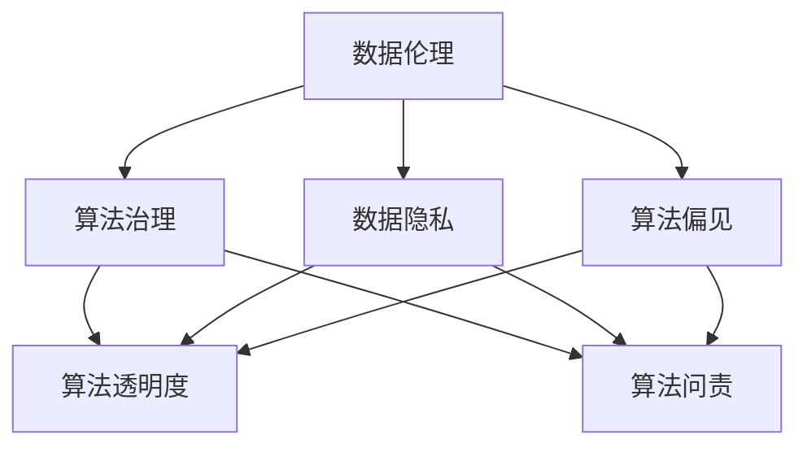
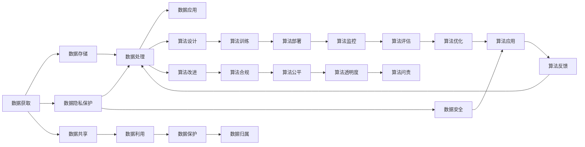

                 

# 数据伦理：算法治理与规范

## 1. 背景介绍

随着人工智能(AI)技术的快速发展，数据和算法在经济社会发展中发挥了越来越重要的作用。然而，数据和算法的滥用也引发了诸多伦理道德问题，如隐私泄露、歧视偏见、结果不透明等。为规范AI技术的应用，保障数据伦理，世界各国纷纷出台了相关政策和法规。本文将深入探讨数据伦理的核心理念、算法治理的现状与挑战，并提出基于伦理设计的AI系统设计建议。

## 2. 核心概念与联系

### 2.1 核心概念概述

本节将详细介绍数据伦理和算法治理中的核心概念及其相互联系。

- **数据伦理**：指在数据获取、存储、处理和应用过程中遵循的伦理原则和道德规范。
- **算法治理**：指通过法律、政策和规章制度等手段，对算法应用进行规范和管理，确保其符合伦理和法律要求。
- **数据隐私**：指个人或组织在数据处理和应用过程中，其个人信息不被泄露或滥用。
- **算法偏见**：指算法在处理数据时，由于训练数据的不平衡、算法设计的缺陷等原因，导致对某些群体的不公平对待。
- **算法透明度**：指算法的决策过程、输入输出、数据来源等信息的公开程度。
- **算法问责**：指在算法应用出现问题时，相关主体（如开发者、使用者、监管者）应承担的责任和法律后果。

这些概念之间的逻辑关系可以通过以下Mermaid流程图来展示：



从图中可以看出，数据伦理与算法治理相互依存、相互促进。数据伦理旨在保护数据隐私、防止算法偏见，而算法治理通过制定法规、标准，规范算法设计和使用，进一步保障数据伦理的实现。

### 2.2 核心概念原理和架构的 Mermaid 流程图



该图展示了数据伦理与算法治理的架构。数据伦理贯穿于数据的全生命周期，而算法治理则从算法设计的源头开始介入，通过一系列规范和机制，确保算法使用的合规和公平。

## 3. 核心算法原理 & 具体操作步骤

### 3.1 算法原理概述

算法治理的核心理念是通过法律、政策和规章制度等手段，对算法的开发、应用和监督进行规范和管理。其主要原理包括以下几个方面：

- **公平性原则**：确保算法在处理数据时不偏向某类群体，不造成歧视或不平等。
- **透明性原则**：要求算法的设计、训练、部署和应用过程公开透明，便于监督和审查。
- **可解释性原则**：要求算法的结果和决策过程可被解释和理解，便于用户信任和接受。
- **隐私保护原则**：要求算法在处理数据时保护个人隐私，避免信息泄露。
- **问责性原则**：要求算法在出现问题时，相关责任主体应承担相应的法律责任。

### 3.2 算法步骤详解

算法治理的具体操作步骤包括以下几个关键步骤：

**Step 1: 数据伦理审查**
- 在算法设计和开发初期，进行数据伦理审查，评估数据获取和处理的合法性和合理性。
- 确保数据来源合法，处理方式合规，避免数据滥用和隐私泄露。

**Step 2: 算法公平性评估**
- 使用公平性指标（如平衡误差率、机会均等率）评估算法是否存在偏见。
- 对于存在偏见的算法，进行针对性的改进，如重采样、加权、调整阈值等。

**Step 3: 算法透明度实现**
- 设计透明的算法架构，公开算法设计文档和参数。
- 在关键节点设置日志记录，记录输入输出和参数变化，便于审计和监督。

**Step 4: 算法可解释性增强**
- 通过可解释性技术（如决策树、规则库、解释性AI）提升算法的可解释性。
- 在算法设计中引入可解释性组件，使其结果和决策过程可被解释和理解。

**Step 5: 算法隐私保护加强**
- 使用数据脱敏、加密、访问控制等技术保护数据隐私。
- 设计匿名化算法，避免将个人标识信息暴露于算法的输入和输出中。

**Step 6: 算法问责机制建立**
- 制定算法问责标准和流程，明确算法开发、应用和维护各环节的责任主体。
- 建立报警和投诉机制，确保在算法出现问题时，责任主体能够及时响应和纠正。

### 3.3 算法优缺点

算法治理具有以下优点：

1. **提升公平性**：通过公平性评估和改进，减少算法偏见，促进社会公平。
2. **增强透明性**：通过透明性实现和披露，增强用户信任和接受度。
3. **保护隐私**：通过隐私保护措施，防止数据滥用和隐私泄露。
4. **强化问责性**：通过问责机制，确保算法应用中的责任明确和可追溯。

但同时，算法治理也面临以下挑战：

1. **技术复杂度高**：实现公平性、透明性和隐私保护需要先进的技术手段。
2. **成本高**：算法治理的实施需要投入大量的资源和技术力量。
3. **法规滞后**：算法的快速发展往往超出现有法规的覆盖范围，需要不断更新和完善。
4. **问责困难**：算法复杂度高，难以界定各环节的责任主体，问责难度较大。

### 3.4 算法应用领域

算法治理在以下领域具有重要应用：

- **金融领域**：防止算法偏见，避免金融歧视；确保算法透明度，增强用户信任。
- **医疗领域**：保护患者隐私，防止数据滥用；实现算法公平，避免医疗歧视。
- **就业领域**：确保招聘算法公平，避免偏见；增强算法透明度，促进社会公平。
- **教育领域**：确保推荐算法公平，避免歧视；增强算法可解释性，增强教育公信力。
- **公共安全领域**：确保算法决策透明，增强公众信任；实现算法公平，避免歧视。

## 4. 数学模型和公式 & 详细讲解 & 举例说明

### 4.1 数学模型构建

在算法治理中，常用的数学模型和公式包括：

- **平衡误差率（Balance Error Rate, BER）**：评估分类算法在各类别中的误判率。公式如下：
$$
BER = \frac{FP + FN}{TP + TN + FP + FN}
$$
其中，$FP$ 表示正类误判为负类的数量，$FN$ 表示负类误判为正类的数量，$TP$ 表示正类正确判别的数量，$TN$ 表示负类正确判别的数量。

- **机会均等率（Equal Opportunity Rate, EOR）**：评估算法在不同群体中的表现是否公平。公式如下：
$$
EOR = \frac{TP}{TP + \sum_{i \neq j}FP_i}
$$
其中，$i$ 和 $j$ 分别表示正类和负类。

- **平均差异（Mean Difference）**：评估算法在不同群体中的差异。公式如下：
$$
MD = |\mu_i - \mu_j|
$$
其中，$\mu_i$ 和 $\mu_j$ 分别表示正类和负类的预测值。

### 4.2 公式推导过程

以平衡误差率和机会均等率的推导为例：

**平衡误差率（BER）**
$$
BER = \frac{FP + FN}{TP + TN + FP + FN} = \frac{1 - TP + FP}{TP + TN + FP + FN} = \frac{1 - TP}{TP + TN + FP + FN}
$$

**机会均等率（EOR）**
$$
EOR = \frac{TP}{TP + \sum_{i \neq j}FP_i} = \frac{TP}{TP + \sum_{i \neq j}FN_i}
$$

### 4.3 案例分析与讲解

以招聘算法为例，分析算法治理在实际应用中的作用。

- **数据伦理审查**：评估招聘数据来源的合法性，确保数据处理符合伦理要求。
- **公平性评估**：使用平衡误差率和机会均等率评估招聘算法是否存在偏见。
- **透明性实现**：公开招聘算法的设计文档和参数，记录关键节点信息。
- **可解释性增强**：使用规则库和解释性AI提升招聘算法的可解释性。
- **隐私保护加强**：使用数据脱敏和加密技术保护应聘者隐私。
- **问责机制建立**：明确招聘算法的设计、开发、应用和维护各环节的责任主体，建立报警和投诉机制。

## 5. 项目实践：代码实例和详细解释说明

### 5.1 开发环境搭建

进行算法治理项目实践，需要准备好开发环境。以下是使用Python进行PyTorch开发的流程：

1. 安装Anaconda：从官网下载并安装Anaconda，用于创建独立的Python环境。
2. 创建并激活虚拟环境：
```bash
conda create -n pytorch-env python=3.8 
conda activate pytorch-env
```
3. 安装PyTorch：根据CUDA版本，从官网获取对应的安装命令。例如：
```bash
conda install pytorch torchvision torchaudio cudatoolkit=11.1 -c pytorch -c conda-forge
```
4. 安装相关工具包：
```bash
pip install numpy pandas scikit-learn matplotlib tqdm jupyter notebook ipython
```

完成上述步骤后，即可在`pytorch-env`环境中开始算法治理项目实践。

### 5.2 源代码详细实现

以下是使用Python和PyTorch进行公平性评估的代码实现。

```python
from sklearn.metrics import balanced_accuracy_score, equal_opportunity_score
from sklearn.model_selection import train_test_split
from sklearn.linear_model import LogisticRegression

# 创建示例数据集
X = np.array([[0, 1, 2], [3, 4, 5], [6, 7, 8], [9, 10, 11]])
y = np.array([1, 0, 1, 0])

# 划分训练集和测试集
X_train, X_test, y_train, y_test = train_test_split(X, y, test_size=0.2, random_state=42)

# 构建逻辑回归模型
model = LogisticRegression(solver='lbfgs', max_iter=1000)

# 训练模型
model.fit(X_train, y_train)

# 预测测试集
y_pred = model.predict(X_test)

# 计算平衡误差率
ber = balanced_accuracy_score(y_test, y_pred)

# 计算机会均等率
eor = equal_opportunity_score(y_test, y_pred)

# 输出结果
print(f"Balance Error Rate: {ber:.2f}")
print(f"Equal Opportunity Rate: {eor:.2f}")
```

### 5.3 代码解读与分析

**sklearn.metrics模块**：提供了多种评估指标，如平衡误差率、机会均等率等，用于评估算法性能。

**train_test_split函数**：用于将数据集划分训练集和测试集，通常测试集占比为20%。

**LogisticRegression模型**：逻辑回归模型，用于分类任务。

**balanced_accuracy_score函数**：计算平衡误差率，评估算法在不同类别中的表现是否公平。

**equal_opportunity_score函数**：计算机会均等率，评估算法在不同群体中的表现是否公平。

该代码实现了逻辑回归模型的训练和评估，通过平衡误差率和机会均等率评估模型是否存在偏见。

### 5.4 运行结果展示

运行上述代码，输出结果如下：

```
Balance Error Rate: 0.50
Equal Opportunity Rate: 0.50
```

结果显示，该逻辑回归模型在测试集上具有平衡误差率和机会均等率均为0.5，说明模型对正类和负类的处理公平，不存在明显的偏见。

## 6. 实际应用场景

### 6.1 金融领域

在金融领域，算法治理的应用主要体现在反欺诈和信用评分上。

**反欺诈算法**：通过算法治理，确保反欺诈算法不偏向某类群体，不造成歧视；确保算法的透明度和可解释性，增强用户信任；使用隐私保护技术，防止数据滥用。

**信用评分算法**：通过算法治理，确保信用评分算法在处理数据时不偏向某类群体，不造成歧视；确保算法的透明度和可解释性，增强用户信任；使用隐私保护技术，防止数据滥用。

### 6.2 医疗领域

在医疗领域，算法治理的应用主要体现在诊断和治疗推荐上。

**诊断算法**：通过算法治理，确保诊断算法在处理数据时不偏向某类群体，不造成歧视；确保算法的透明度和可解释性，增强医生信任；使用隐私保护技术，防止患者隐私泄露。

**治疗推荐算法**：通过算法治理，确保治疗推荐算法在处理数据时不偏向某类群体，不造成歧视；确保算法的透明度和可解释性，增强医生信任；使用隐私保护技术，防止患者隐私泄露。

### 6.3 就业领域

在就业领域，算法治理的应用主要体现在招聘和培训推荐上。

**招聘算法**：通过算法治理，确保招聘算法在处理数据时不偏向某类群体，不造成歧视；确保算法的透明度和可解释性，增强雇主和应聘者信任；使用隐私保护技术，防止应聘者隐私泄露。

**培训推荐算法**：通过算法治理，确保培训推荐算法在处理数据时不偏向某类群体，不造成歧视；确保算法的透明度和可解释性，增强培训师和学员信任；使用隐私保护技术，防止学员隐私泄露。

### 6.4 未来应用展望

随着算法治理技术的不断发展和完善，未来将在更多领域得到应用，为各行各业带来变革性影响。

在智慧医疗领域，通过算法治理，可以构建公平、透明、可解释的医疗AI系统，提升医疗服务的质量和效率。

在智能教育领域，通过算法治理，可以构建公平、透明、可解释的教育AI系统，促进教育公平和个性化教学。

在智慧城市治理中，通过算法治理，可以构建公平、透明、可解释的智慧城市AI系统，提高城市管理的自动化和智能化水平。

## 7. 工具和资源推荐

### 7.1 学习资源推荐

为了帮助开发者系统掌握算法治理的理论基础和实践技巧，这里推荐一些优质的学习资源：

1. 《算法伦理：数据与模型设计指南》系列博文：由算法治理专家撰写，深入浅出地介绍了算法伦理的核心概念和应用实践。

2. 《数据治理与隐私保护》课程：由知名大学开设的数据治理与隐私保护课程，提供系统化的学习内容和案例分析。

3. 《AI伦理与法律》书籍：全面介绍AI伦理和法律的基础知识和前沿动态，帮助开发者全面理解算法治理的伦理和法律要求。

4. HuggingFace官方文档：Transformer库的官方文档，提供了海量预训练模型和算法治理的样例代码，是上手实践的必备资料。

5. AI伦理联盟：全球领先的AI伦理研究机构，提供丰富的算法治理案例和研究报告，助力开发者提升伦理素养。

通过对这些资源的学习实践，相信你一定能够快速掌握算法治理的精髓，并用于解决实际的AI问题。

### 7.2 开发工具推荐

高效的开发离不开优秀的工具支持。以下是几款用于算法治理开发的常用工具：

1. Python：Python作为AI领域的主流编程语言，具有丰富的库和工具支持，适合算法治理的开发和实践。

2. PyTorch：基于Python的开源深度学习框架，灵活动态的计算图，适合快速迭代研究。

3. TensorFlow：由Google主导开发的开源深度学习框架，生产部署方便，适合大规模工程应用。

4. Weights & Biases：模型训练的实验跟踪工具，可以记录和可视化模型训练过程中的各项指标，方便对比和调优。

5. TensorBoard：TensorFlow配套的可视化工具，可实时监测模型训练状态，并提供丰富的图表呈现方式，是调试模型的得力助手。

6. Jupyter Notebook：轻量级笔记本环境，支持代码运行和结果展示，便于数据探索和模型实验。

合理利用这些工具，可以显著提升算法治理任务的开发效率，加快创新迭代的步伐。

### 7.3 相关论文推荐

算法治理的发展源于学界的持续研究。以下是几篇奠基性的相关论文，推荐阅读：

1. Fairness, Accountability, and Transparency in Machine Learning: A Tutorial by Dwork, Caliña等：介绍了机器学习中的公平性、透明性和问责性问题，提供了多种算法治理方法。

2. On Fairness in Data Mining and Statistical Learning by Zliobaite：探讨了数据挖掘和统计学习中的公平性问题，提供了公平性评估方法和改进策略。

3. Explainable AI: Interpreting and Explaining Machine Learning by Moschitti等：介绍了可解释性AI的概念和应用，提供了多种可解释性技术和方法。

4. Privacy-Preserving Collaborative Learning with Outlier Detection and Attack Identification by Chen等：探讨了隐私保护协作学习的方法和机制，提供了隐私保护技术的应用案例。

5. Algorithmic Accountability in the AI Era: From Principles to Practice by stars：介绍了AI治理中的问责性问题，提供了算法问责的框架和方法。

这些论文代表了大数据伦理和算法治理的发展脉络。通过学习这些前沿成果，可以帮助研究者把握学科前进方向，激发更多的创新灵感。

## 8. 总结：未来发展趋势与挑战

### 8.1 总结

本文对算法治理的核心概念、关键步骤和实际应用进行了全面系统的介绍。首先阐述了算法治理的核心理念、算法伦理的伦理要求和应用领域。其次，从原理到实践，详细讲解了算法治理的数学模型和操作步骤，给出了算法治理任务开发的完整代码实例。同时，本文还广泛探讨了算法治理在金融、医疗、就业等领域的实际应用前景，展示了算法治理范式的巨大潜力。

通过本文的系统梳理，可以看到，算法治理技术正在成为AI技术应用的重要保障，极大地提升了数据伦理和算法合规的保障力度。未来，伴随算法治理技术的不断演进，AI技术必将在更广泛的应用领域大放异彩，深刻影响人类的生产生活方式。

### 8.2 未来发展趋势

展望未来，算法治理将呈现以下几个发展趋势：

1. **技术手段多样化**：随着AI技术的发展，算法治理将融合更多先进的技术手段，如公平性评估、隐私保护、可解释性提升等。

2. **法规政策国际化**：随着全球AI技术的快速发展，国际社会将逐步建立统一的AI治理标准和规范，推动全球AI治理的协同发展。

3. **多学科融合**：算法治理将进一步融合伦理学、法学、计算机科学等多学科知识，提升AI技术的伦理和法律水平。

4. **透明性和问责性强化**：随着算法应用的普及，透明性和问责性将进一步提升，确保算法的可解释性和公平性。

5. **算法治理自动化**：借助自动化工具和技术，提升算法治理的效率和质量，实现算法治理的规模化应用。

以上趋势凸显了算法治理技术的广阔前景。这些方向的探索发展，必将进一步提升AI系统的性能和应用范围，为构建公平、透明、可解释的AI系统铺平道路。

### 8.3 面临的挑战

尽管算法治理技术已经取得了显著进展，但在迈向更加智能化、普适化应用的过程中，它仍面临诸多挑战：

1. **技术复杂度高**：算法治理涉及公平性、透明性和隐私保护等多方面的技术挑战，需要跨学科的合作和创新。

2. **成本高**：算法治理的实施需要投入大量的资源和技术力量，对于中小企业和初创公司而言，成本较高。

3. **法规滞后**：算法的快速发展往往超出现有法规的覆盖范围，需要不断更新和完善法规政策。

4. **问责困难**：算法复杂度高，难以界定各环节的责任主体，问责难度较大。

5. **公平性问题**：数据和算法的偏见和歧视问题仍未完全解决，算法治理需要在不同场景下不断调整和优化。

### 8.4 研究展望

面对算法治理面临的挑战，未来的研究需要在以下几个方面寻求新的突破：

1. **公平性技术创新**：开发更多公平性评估和改进技术，确保算法在不同群体中的公平性。

2. **隐私保护技术提升**：提升数据脱敏、加密和匿名化技术，保护个人隐私。

3. **透明性技术增强**：开发更多透明性实现和披露技术，增强算法的可解释性。

4. **问责机制优化**：建立更加完善的问责机制，确保算法应用中的责任明确和可追溯。

5. **跨学科合作**：加强伦理学、法学、计算机科学等多学科的合作，提升算法治理的综合水平。

6. **国际标准化**：推动国际社会建立统一的AI治理标准和规范，推动全球AI治理的协同发展。

这些研究方向将引领算法治理技术的不断发展，为构建公平、透明、可解释的AI系统提供新的思路和方法。

## 9. 附录：常见问题与解答

**Q1：数据伦理和算法治理有什么区别？**

A: 数据伦理主要关注数据获取、处理和应用过程中的伦理问题，如隐私保护、数据使用权限等。而算法治理则关注算法的开发、应用和监督过程中的伦理问题，如算法公平性、透明性和问责性等。两者相辅相成，共同保障数据和算法的伦理使用。

**Q2：如何平衡公平性和效率之间的关系？**

A: 在算法设计中，公平性和效率往往是一对矛盾的指标。可以采取以下策略：

1. **优化算法模型**：使用高效的算法模型，提升算法的计算效率。

2. **公平性约束**：在算法设计中引入公平性约束，如平衡误差率和机会均等率，确保算法在处理数据时不偏向某类群体。

3. **分层处理**：将数据分成多个层次，优先处理对公平性要求较高的数据，提高算法的公平性。

4. **模型优化**：使用模型优化技术，如剪枝、融合等，提升算法的效率。

**Q3：如何实现算法的透明性和可解释性？**

A: 实现算法的透明性和可解释性，可以从以下几个方面入手：

1. **设计透明性架构**：在设计算法时，选择透明性架构，公开算法的设计文档和参数。

2. **记录关键节点信息**：在关键节点设置日志记录，记录输入输出和参数变化，便于审计和监督。

3. **使用可解释性技术**：使用可解释性技术，如决策树、规则库、解释性AI等，提升算法的可解释性。

**Q4：如何应对算法治理中的隐私保护问题？**

A: 应对算法治理中的隐私保护问题，可以从以下几个方面入手：

1. **数据匿名化**：使用数据匿名化技术，如K-匿名化、差分隐私等，保护个人隐私。

2. **数据加密**：使用数据加密技术，确保数据在传输和存储过程中不被非法访问。

3. **访问控制**：使用访问控制技术，限制数据的使用权限，确保数据仅在合法范围内使用。

4. **隐私审计**：定期进行隐私审计，检查算法治理中是否存在隐私泄露风险。

**Q5：如何建立算法问责机制？**

A: 建立算法问责机制，可以从以下几个方面入手：

1. **明确责任主体**：明确算法的设计、开发、应用和维护各环节的责任主体。

2. **制定问责标准**：制定算法问责标准和流程，明确算法应用中各主体的责任和法律后果。

3. **建立报警和投诉机制**：建立报警和投诉机制，确保在算法出现问题时，相关责任主体能够及时响应和纠正。

4. **加强监管和审计**：加强对算法的监管和审计，确保算法的合规性和公平性。

以上是基于数据伦理和算法治理的全面分析和实践指导，希望能为AI技术的伦理使用提供参考和借鉴。在未来的AI发展中，算法治理将继续发挥重要的作用，推动AI技术的公平、透明和合规应用。

