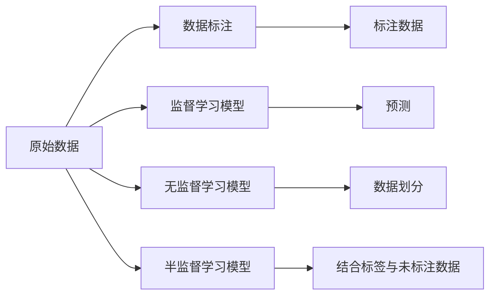

                 

# 数据标注：人工智能发展背后的幕后英雄

> 关键词：数据标注,人工智能,机器学习,深度学习,监督学习,无监督学习,标注成本,数据集,众包标注,自动化标注,质量控制,标注工具,标注标准

## 1. 背景介绍

在人工智能(AI)的快速发展中，数据标注（Data Annotation）充当着不可或缺的幕后英雄角色。无论是在监督学习还是无监督学习中，高质量的数据标注都是获得理想模型性能的关键因素。数据标注不仅是机器学习模型的“粮食”，也是深度学习模型能够不断优化和提升的基石。

在深度学习时代，人工智能技术在图像识别、自然语言处理、语音识别等多个领域都取得了举世瞩目的进展，背后都有数据标注的巨大贡献。然而，尽管数据标注在AI发展中扮演着如此重要的角色，其重要性却常常被公众所忽视。本文将深入探讨数据标注的核心概念、原理和实际操作，全面分析其应用领域、现状与挑战，以及未来的发展趋势。

## 2. 核心概念与联系

### 2.1 核心概念概述

数据标注是人工智能领域的一项基础工作，指将原始未标注数据（Raw Unlabeled Data）转化为可用的标注数据（Annotated Data）的过程。标注数据包含了数据集中的标签信息，是机器学习算法能够进行训练和预测的基础。

在深度学习中，数据标注被广泛应用于监督学习模型中。监督学习的目标是训练模型以识别输入数据的正确标签。通过标注数据，模型能够在已知的输入输出对上进行训练，从而学习出能够对新数据进行准确预测的规则。

此外，数据标注还应用于无监督学习中，例如在聚类算法中，标签可以帮助模型区分不同的数据簇，从而更准确地进行数据划分。

### 2.2 核心概念原理和架构的 Mermaid 流程图



这个流程图展示了数据标注在深度学习中的基本流程。原始数据通过标注过程转化为标注数据，然后被监督学习模型、无监督学习模型和半监督学习模型使用，以进行预测和数据划分。

## 3. 核心算法原理 & 具体操作步骤

### 3.1 算法原理概述

数据标注的核心原理是通过人工或自动化的方式，为数据集添加标签，从而使得原始未标注数据能够被模型学习使用。数据标注的标签可以是二值的（如分类任务），也可以是多值的（如标注多个类别），甚至可以是连续值的（如回归任务）。

数据标注的原理是通过机器学习算法，利用已标注的数据集训练出模型，并用该模型对未标注数据进行预测，从而得到其标签。在标注过程中，数据标注人员会根据模型的预测结果，对未标注数据的标签进行调整，以提高标注数据的准确性。

### 3.2 算法步骤详解

数据标注的一般步骤如下：

1. **数据收集**：收集需要标注的数据。数据可以是图片、文本、音频等不同类型。
2. **数据预处理**：对数据进行清洗和预处理，确保数据的质量和格式一致。
3. **设计标注规则**：根据任务需求，设计标注规则，明确标注的标准和要求。
4. **标注人员培训**：对标注人员进行培训，确保其理解标注规则并能准确标注数据。
5. **标注数据**：根据标注规则，对数据进行标注，得到标注数据集。
6. **质量控制**：对标注数据进行质量控制，确保标注的准确性和一致性。
7. **模型训练**：使用标注数据集训练监督学习模型，进行预测和优化。
8. **迭代优化**：根据模型的预测结果，进行人工调整和优化标注数据，再次训练模型。

### 3.3 算法优缺点

数据标注的优点包括：

- **数据质量高**：标注数据经过人工审查，通常质量较高，误差较小。
- **灵活性高**：可以根据任务需求灵活设计标注规则，适应各种不同类型的数据。
- **可解释性强**：标注过程可以解释标注数据的具体依据，有利于模型的理解和优化。

数据标注的缺点包括：

- **成本高**：标注数据需要大量的人工参与，成本较高。
- **效率低**：手动标注数据速度较慢，尤其是标注数据量较大的情况下。
- **主观性**：标注人员的主观判断可能影响标注结果的一致性和准确性。

### 3.4 算法应用领域

数据标注广泛应用于以下几个领域：

1. **计算机视觉**：如图像分类、目标检测、人脸识别等任务。
2. **自然语言处理**：如文本分类、命名实体识别、情感分析等任务。
3. **语音识别**：如语音转文字、语音情感分析等任务。
4. **医疗影像**：如病灶识别、病理分析等任务。
5. **自动驾驶**：如道路标志识别、车辆检测等任务。

## 4. 数学模型和公式 & 详细讲解 & 举例说明

### 4.1 数学模型构建

在监督学习中，数据标注通常用于构建标注数据集 $D=\{(x_i, y_i)\}_{i=1}^N$，其中 $x_i$ 是输入数据，$y_i$ 是对应的标签。常用的标注任务包括分类、回归、序列标注等。

以图像分类任务为例，假设输入数据为 $x \in \mathbb{R}^d$，标签 $y \in \{1,2,...,C\}$，目标是从训练集 $D$ 中学习出分类器 $f(x; \theta)$，使得对于任意输入数据 $x$，有 $f(x; \theta) = y$。

### 4.2 公式推导过程

以二分类任务为例，假设模型使用 sigmoid 函数进行预测，即 $f(x; \theta) = \sigma(Wx + b)$，其中 $\sigma(z) = \frac{1}{1 + e^{-z}}$ 为 sigmoid 函数。

标签 $y$ 和预测值 $f(x; \theta)$ 之间的关系为：

$$
P(y=1|x; \theta) = \sigma(Wx + b)
$$

模型的损失函数为交叉熵损失函数：

$$
L(D; \theta) = -\frac{1}{N} \sum_{i=1}^N [y_i\log f(x_i; \theta) + (1-y_i)\log (1-f(x_i; \theta))]
$$

在训练过程中，模型的目标是最小化损失函数：

$$
\theta^* = \mathop{\arg\min}_{\theta} L(D; \theta)
$$

通过梯度下降等优化算法，逐步更新模型参数 $\theta$，使得模型在训练集 $D$ 上的预测结果与真实标签尽可能接近。

### 4.3 案例分析与讲解

以ImageNet数据集为例，该数据集包含1000个类别的图像，共约1.2百万张图像。数据标注人员对每张图像进行了详细的标注，包括图片类别和具体的标签位置。

通过对ImageNet数据集进行标注，训练出的深度学习模型在图像分类任务上取得了显著的提升，成为多个深度学习算法的基础数据集。

## 5. 项目实践：代码实例和详细解释说明

### 5.1 开发环境搭建

在项目实践中，首先需要搭建好开发环境。以Python和PyTorch为例，以下是一个基本的开发环境搭建流程：

1. 安装Python：确保Python 3.6及以上版本已安装。
2. 安装PyTorch：
```
pip install torch torchvision torchaudio
```
3. 安装Pillow：
```
pip install Pillow
```
4. 安装Pandas：
```
pip install pandas
```
5. 安装Matplotlib：
```
pip install matplotlib
```

### 5.2 源代码详细实现

以下是一个简单的图像分类项目，使用PyTorch和Pillow库实现数据标注和模型训练。

```python
import torch
from torch.utils.data import DataLoader, Dataset
from torchvision import transforms
from PIL import Image

class ImageDataset(Dataset):
    def __init__(self, data_dir, transform=None):
        self.data_dir = data_dir
        self.transform = transform
        self.image_list = [f for f in os.listdir(data_dir) if f.endswith('.jpg')]

    def __len__(self):
        return len(self.image_list)

    def __getitem__(self, idx):
        img_path = os.path.join(self.data_dir, self.image_list[idx])
        img = Image.open(img_path)
        if self.transform:
            img = self.transform(img)
        return img

# 定义数据增强
transform = transforms.Compose([
    transforms.RandomResizedCrop(224),
    transforms.RandomHorizontalFlip(),
    transforms.ToTensor(),
    transforms.Normalize(mean=[0.485, 0.456, 0.406], std=[0.229, 0.224, 0.225])
])

# 加载数据集
data_dir = 'path/to/dataset'
dataset = ImageDataset(data_dir, transform)

# 加载数据集
dataloader = DataLoader(dataset, batch_size=4, shuffle=True)

# 定义模型
model = torchvision.models.resnet18(pretrained=False)
model.fc = torch.nn.Linear(512, 1000)

# 定义损失函数
criterion = torch.nn.CrossEntropyLoss()

# 定义优化器
optimizer = torch.optim.SGD(model.parameters(), lr=0.001, momentum=0.9)

# 训练模型
for epoch in range(10):
    for i, (inputs, labels) in enumerate(dataloader):
        optimizer.zero_grad()
        outputs = model(inputs)
        loss = criterion(outputs, labels)
        loss.backward()
        optimizer.step()
```

### 5.3 代码解读与分析

在上述代码中，我们定义了一个简单的图像分类模型，并使用数据增强技术对数据进行了预处理。具体步骤如下：

1. 定义数据集类 `ImageDataset`，加载图像数据并应用数据增强。
2. 定义模型 `model`，使用预训练的ResNet-18作为特征提取器，并添加全连接层进行分类。
3. 定义损失函数 `criterion`，使用交叉熵损失函数。
4. 定义优化器 `optimizer`，使用随机梯度下降优化算法。
5. 通过循环训练模型，更新模型参数，最小化损失函数。

通过以上代码示例，可以看出数据标注和模型训练的基本流程。在实际项目中，还需要进一步优化模型的训练过程，如引入正则化、学习率调整等技术，以提高模型的泛化能力和训练效率。

### 5.4 运行结果展示

训练结束后，可以使用测试集对模型进行评估，计算准确率、精确率、召回率等指标。

```python
from sklearn.metrics import accuracy_score

# 加载测试集
test_dataset = ImageDataset(test_data_dir, transform)

# 加载测试集数据
test_dataloader = DataLoader(test_dataset, batch_size=4, shuffle=False)

# 计算模型在测试集上的准确率
test_acc = 0
for i, (inputs, labels) in enumerate(test_dataloader):
    with torch.no_grad():
        outputs = model(inputs)
        test_acc += accuracy_score(labels, outputs.argmax(dim=1))

print(f'Test Accuracy: {test_acc / len(test_dataloader)}')
```

通过测试集评估，可以获得模型的准确率等指标，从而评估模型性能。

## 6. 实际应用场景

### 6.1 智能安防

在智能安防领域，数据标注被广泛应用于人脸识别、行为识别等任务。通过对安防摄像头拍摄的视频进行标注，可以训练出更加准确的人脸识别模型，实时监测并识别异常行为。

### 6.2 金融风控

在金融风控领域，数据标注被用于信用评分、欺诈检测等任务。通过对客户历史交易数据进行标注，可以训练出更加准确的信用评分模型，提前识别潜在欺诈行为，保障金融安全。

### 6.3 自动驾驶

在自动驾驶领域，数据标注被用于道路标志识别、车辆检测等任务。通过对自动驾驶车辆采集的视频进行标注，可以训练出更加准确的图像分类模型，辅助车辆进行智能驾驶决策。

## 7. 工具和资源推荐

### 7.1 学习资源推荐

以下是几个推荐的学习资源，可以帮助开发者深入理解数据标注的原理和实践：

1. 《机器学习实战》（Pattern Recognition and Machine Learning）：吴恩达（Andrew Ng）著，是机器学习领域的经典教材，详细介绍了数据标注在监督学习中的重要性和应用。
2. 《深度学习》（Deep Learning）：Goodfellow等著，涵盖了深度学习的基本概念和算法，包括数据标注和模型训练。
3. Kaggle：全球最大的数据科学竞赛平台，提供大量的数据集和标注资源，适合实践数据标注项目。

### 7.2 开发工具推荐

以下是几个推荐的数据标注和模型训练工具：

1. LabelImg：一个基于Python的图像标注工具，支持快速标注图像数据集。
2. RectLabel：一个基于Qt的图像标注工具，支持多标签标注。
3. Annoyoi：一个基于Web的图像标注平台，支持远程协作标注。

### 7.3 相关论文推荐

以下是几篇推荐的相关论文，可以帮助开发者深入了解数据标注的最新研究和应用：

1. "Data Annotation in Machine Learning"（机器学习中的数据标注）：Pang等著，详细介绍了数据标注在机器学习中的重要性和应用。
2. "Data Augmentation: A Survey"（数据增强：综述）：Dou et al. 著，综述了数据增强技术在图像处理中的应用。
3. "Semantic Annotation in Computer Vision"（计算机视觉中的语义标注）：Bourdelle et al. 著，综述了计算机视觉中的语义标注技术。

## 8. 总结：未来发展趋势与挑战

### 8.1 研究成果总结

数据标注在人工智能领域的发展经历了从手工标注到自动化标注的历程。传统的手动标注成本高、效率低，容易引入人为错误，但可以提供高质量的数据集。自动化标注则依赖于标注工具和算法，可以大幅降低成本和提高效率，但标注数据的质量难以保证。

### 8.2 未来发展趋势

未来，数据标注将向着以下几个方向发展：

1. **自动化标注**：随着深度学习技术的进步，自动标注算法将越来越准确，能够替代部分手工标注工作。
2. **众包标注**：众包平台将广泛应用，标注工作将通过互联网平台进行分布式处理，提高标注效率。
3. **生成式标注**：基于生成对抗网络（GAN）等技术，能够自动生成标注数据，减少标注工作量。
4. **数据增强**：通过数据增强技术，能够生成更多的训练数据，提高模型的泛化能力。
5. **元标注**：利用元学习技术，通过对标注数据进行优化，提高标注质量和效率。

### 8.3 面临的挑战

数据标注面临的挑战包括：

1. **数据质量控制**：如何保证标注数据的准确性和一致性，减少标注误差。
2. **标注成本**：如何降低标注成本，提高标注效率。
3. **标注工具自动化**：如何设计高效的标注工具，提高标注速度。
4. **标注标准统一**：如何制定统一的标注标准，确保标注数据的可比性。
5. **标注数据保护**：如何保护标注数据的隐私和安全，防止数据泄露。

### 8.4 研究展望

未来的研究将在以下几个方面展开：

1. **深度学习与标注**：研究深度学习在自动标注中的应用，提高标注效率和质量。
2. **元学习与标注**：研究元学习在标注数据优化中的应用，提高标注数据的质量和一致性。
3. **语义理解与标注**：研究语义理解在标注中的应用，提高标注数据的可解释性和可理解性。
4. **跨模态标注**：研究跨模态标注技术，提高标注数据的丰富性和多样性。

通过不断探索和优化数据标注技术，可以更好地支持人工智能模型的训练和优化，推动人工智能技术的发展和应用。

## 9. 附录：常见问题与解答

**Q1：数据标注对模型性能有何影响？**

A: 数据标注是机器学习模型的基础，标注数据的质量直接影响模型的性能。高质量的标注数据能够提供更准确的训练信号，提高模型的泛化能力和预测精度。

**Q2：数据标注的效率如何提高？**

A: 数据标注效率的提高可以通过以下方式实现：

1. **自动化标注**：利用标注工具和算法，自动化标注部分数据，减少手动标注工作量。
2. **众包标注**：利用互联网平台，将标注任务分发给多个标注人员，提高标注速度。
3. **数据增强**：通过数据增强技术，生成更多的训练数据，提高模型的泛化能力。
4. **元标注**：通过对标注数据进行优化，提高标注质量和效率。

**Q3：数据标注的质量如何保证？**

A: 数据标注质量的控制可以通过以下方式实现：

1. **标注人员培训**：对标注人员进行培训，确保其理解标注规则并能准确标注数据。
2. **标注质量审查**：定期对标注数据进行质量审查，发现标注错误并进行修正。
3. **标注标准统一**：制定统一的标注标准，确保标注数据的可比性。

**Q4：数据标注对隐私保护有何影响？**

A: 数据标注对隐私保护的影响主要体现在标注数据的保护上。标注数据的隐私保护可以通过以下方式实现：

1. **数据脱敏**：对标注数据进行脱敏处理，防止敏感信息泄露。
2. **访问控制**：对标注数据进行访问控制，限制数据的访问权限。
3. **数据加密**：对标注数据进行加密处理，防止数据泄露。

**Q5：数据标注的未来发展趋势是什么？**

A: 数据标注的未来发展趋势包括：

1. **自动化标注**：利用深度学习技术，自动标注部分数据，减少手动标注工作量。
2. **众包标注**：利用互联网平台，将标注任务分发给多个标注人员，提高标注速度。
3. **数据增强**：通过数据增强技术，生成更多的训练数据，提高模型的泛化能力。
4. **元标注**：通过对标注数据进行优化，提高标注质量和效率。
5. **跨模态标注**：研究跨模态标注技术，提高标注数据的丰富性和多样性。

通过不断探索和优化数据标注技术，可以更好地支持人工智能模型的训练和优化，推动人工智能技术的发展和应用。

---

作者：禅与计算机程序设计艺术 / Zen and the Art of Computer Programming

