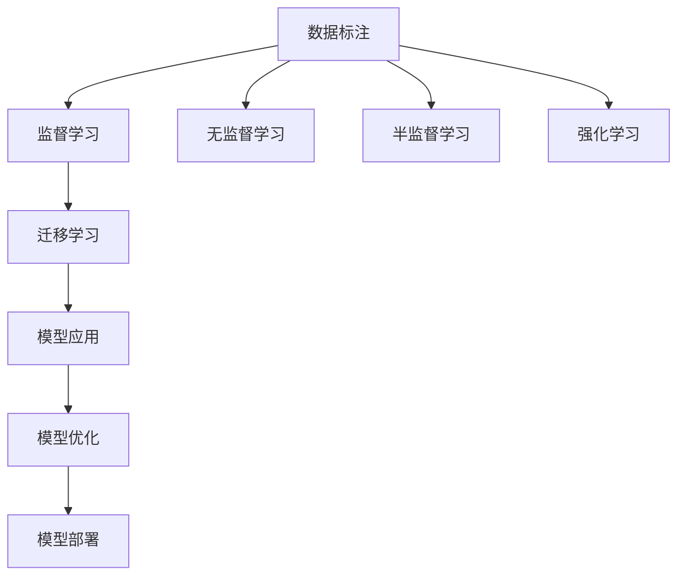

                 

## 1. 背景介绍

### 1.1 问题由来
人工智能（AI）的发展离不开大规模数据标注，这是机器学习模型的基础。然而，数据标注这项任务虽然重要，却往往被视为AI发展背后的“无名英雄”，公众对其的关注度远不如模型训练、算法优化等热门领域。但实际上，数据标注的质量、效率、成本等因素，直接影响了AI模型训练的效果和应用场景的可行性。

### 1.2 问题核心关键点
数据标注的核心问题主要包括：
1. **数据标注的质量**：标注数据需要准确、全面，以确保模型训练的准确性和泛化能力。
2. **标注的效率**：大量高质量的标注数据需要耗费大量时间和人力，如何快速高效地完成标注工作是一个关键问题。
3. **标注的成本**：高精度的标注数据往往需要专业人员的介入，成本较高，如何降低标注成本也是标注技术发展的重点。
4. **标注的可解释性**：标注数据需要具备可解释性，以便于模型评估和进一步优化。
5. **标注的持续性**：标注工作需要随时间不断更新，以适应数据分布的变化。

这些问题在各个AI应用领域中都有体现，如自然语言处理、计算机视觉、医疗诊断等。数据标注的优化和自动化，对于提升AI模型的性能和推动AI技术的落地应用具有重要意义。

## 2. 核心概念与联系

### 2.1 核心概念概述

为更好地理解数据标注的重要性，本节将介绍几个密切相关的核心概念：

- **数据标注（Data Annotation）**：是指对原始数据进行加工处理，为模型训练提供标注信息的过程。数据标注通常包括图像、文本、音频等多种类型。

- **监督学习（Supervised Learning）**：一种机器学习范式，模型通过带有标签的训练数据学习输入和输出之间的映射关系。数据标注是监督学习的核心步骤。

- **无监督学习（Unsupervised Learning）**：模型在未标注数据上学习，通过数据内在的结构或模式进行训练。

- **半监督学习（Semi-supervised Learning）**：结合少量有标签数据和大量无标签数据进行训练，利用未标注数据的优势提高模型性能。

- **强化学习（Reinforcement Learning）**：模型通过与环境交互，根据奖励信号进行学习。

- **迁移学习（Transfer Learning）**：将一个领域学到的知识迁移到另一个领域，以提升在新任务上的性能。

这些概念之间的逻辑关系可以通过以下Mermaid流程图来展示：



这个流程图展示的数据标注与机器学习的关系：

1. 数据标注是监督学习的核心步骤。
2. 无监督学习不依赖标注数据，但需更多的数据和计算资源。
3. 半监督学习结合少量标注数据和大量无标注数据。
4. 强化学习通过与环境的交互学习，无需标注数据。
5. 迁移学习将一个领域学到的知识应用到另一个领域。
6. 模型应用、优化和部署需要标注数据来验证和优化。

## 3. 核心算法原理 & 具体操作步骤
### 3.1 算法原理概述

数据标注的核心算法原理是，通过将原始数据与人工标注的标签相结合，训练出能够识别并预测新数据标签的模型。其基本流程包括：

1. **数据采集**：收集与任务相关的数据集。
2. **数据预处理**：对数据进行清洗、归一化等预处理。
3. **标注生成**：人工或半自动地生成数据标注。
4. **模型训练**：使用带有标注的数据集训练监督学习模型。
5. **模型评估**：使用测试集评估模型性能，调整参数和标注策略。
6. **模型部署**：将训练好的模型应用于实际场景。

### 3.2 算法步骤详解

数据标注的具体步骤可以分为以下几个关键环节：

**Step 1: 数据采集与预处理**
- 数据采集：根据任务需求，从各种数据源（如网络、传感器、数据库等）中收集数据。
- 数据预处理：清洗数据中的噪声、缺失值，进行格式转换、归一化等操作，确保数据质量。

**Step 2: 标注生成**
- 数据标注：对每个数据样本进行人工标注，生成对应的标签信息。标注方式包括文本标注、图像边界框、像素级标记等。
- 标注质量控制：通过专家审核或人工复核，确保标注的准确性和一致性。

**Step 3: 模型训练**
- 选择适当的模型架构，如卷积神经网络（CNN）、循环神经网络（RNN）、Transformer等。
- 使用带有标注的数据集训练模型，调整超参数，优化模型性能。

**Step 4: 模型评估与优化**
- 使用测试集评估模型性能，计算准确率、召回率、F1分数等指标。
- 根据评估结果，调整模型参数和标注策略，进行模型优化。

**Step 5: 模型部署与应用**
- 将训练好的模型部署到实际应用场景，进行实时预测。
- 收集反馈数据，持续优化模型性能。

### 3.3 算法优缺点

数据标注方法具有以下优点：
1. 提升模型性能：标注数据为模型提供了准确的训练信号，有助于提高模型的准确性和泛化能力。
2. 促进新领域应用：标注数据有助于将模型应用于新领域，推动技术落地应用。
3. 引导模型优化：标注数据提供了模型评估和优化的依据。

同时，也存在一些缺点：
1. 标注成本高：大量高质量标注数据需要耗费大量人力和时间，成本较高。
2. 标注质量不稳定：标注质量受标注人员水平和标注标准的影响较大。
3. 数据标注存在偏差：标注数据可能存在人类偏见，影响模型公平性和鲁棒性。
4. 数据隐私问题：标注过程中可能涉及个人隐私数据，数据保护和安全问题需重视。

尽管存在这些局限性，但数据标注仍是当前AI模型训练和优化的重要手段。未来，研究重点应放在如何降低标注成本、提高标注效率和质量上。

### 3.4 算法应用领域

数据标注技术在多个领域得到了广泛应用，以下是几个典型应用：

**自然语言处理（NLP）**
- 文本分类：标注任务为给文本分类，如情感分析、主题分类等。
- 命名实体识别（NER）：标注任务为识别文本中的实体，如人名、地名、组织机构名等。
- 问答系统：标注任务为给问答对打上标签，如正确答案、不相关答案等。

**计算机视觉（CV）**
- 图像分类：标注任务为给图像打上标签，如猫、狗、车等。
- 目标检测：标注任务为标注图像中的目标位置，如边界框、像素级标记等。
- 图像分割：标注任务为将图像分割成不同的区域，如语义分割、实例分割等。

**医疗诊断**
- 医学影像标注：标注任务为标注医学影像中的病变区域，如肿瘤、结节等。
- 电子病历标注：标注任务为标注电子病历中的关键信息，如疾病类型、诊断结果等。

**自动驾驶**
- 道路标注：标注任务为标注道路上的障碍物、交通信号等。
- 场景分类：标注任务为将道路场景分类，如白天、夜晚、雨天等。

这些应用展示了数据标注在AI技术中的重要作用，也证明了标注技术在实际应用中的广泛需求。

## 4. 数学模型和公式 & 详细讲解 & 举例说明

### 4.1 数学模型构建

假设数据标注的任务是给每个数据样本 $x$ 打上标签 $y$，数据标注模型 $f$ 的任务是预测标签 $y$。标注数据集 $D$ 为 $(x_i, y_i)$，其中 $x_i$ 为输入数据，$y_i$ 为对应的标注标签。

目标是通过训练模型 $f$，使得其能够准确地预测新数据的标签。数学上，可以将标注任务建模为以下最小化问题：

$$
\min_{f} \sum_{i=1}^{N} \ell(f(x_i), y_i)
$$

其中，$\ell$ 为损失函数，通常使用交叉熵损失、均方误差损失等。

### 4.2 公式推导过程

以交叉熵损失函数为例，其推导过程如下：

设模型 $f(x)$ 对输入 $x$ 的输出为 $\hat{y}$，真实标签为 $y$。交叉熵损失函数定义为：

$$
\ell(f(x), y) = -y\log \hat{y} - (1-y)\log(1-\hat{y})
$$

最小化损失函数等价于最大化似然函数：

$$
\max_{f} \prod_{i=1}^{N} \frac{\hat{y_i}}{y_i} = \max_{f} \sum_{i=1}^{N} \log \frac{\hat{y_i}}{y_i}
$$

引入最大似然函数，并使用对数函数将乘法转化为加法：

$$
\max_{f} \sum_{i=1}^{N} \log \hat{y_i} - \sum_{i=1}^{N} y_i \log(1-\hat{y_i})
$$

简化得到：

$$
\max_{f} -\frac{1}{N}\sum_{i=1}^{N} (\hat{y_i}\log(1-\hat{y_i}) + (1-y_i)\log \hat{y_i})
$$

即为交叉熵损失函数。

### 4.3 案例分析与讲解

**文本分类**
假设有一个二分类任务，给定训练集 $D=\{(x_i, y_i)\}_{i=1}^N$，其中 $x_i$ 为文本，$y_i \in \{0, 1\}$ 为分类标签。

模型 $f$ 为卷积神经网络，其架构如下：

```python
import torch.nn as nn

class CNN(nn.Module):
    def __init__(self, vocab_size, embedding_dim, hidden_dim):
        super(CNN, self).__init__()
        self.embedding = nn.Embedding(vocab_size, embedding_dim)
        self.conv1 = nn.Conv1d(embedding_dim, hidden_dim, kernel_size=3, padding=1)
        self.relu = nn.ReLU()
        self.max_pool = nn.MaxPool1d(kernel_size=2)
        self.fc = nn.Linear(hidden_dim, 1)

    def forward(self, x):
        x = self.embedding(x)
        x = self.conv1(x)
        x = self.relu(x)
        x = self.max_pool(x)
        x = self.fc(x)
        return x
```

使用带有标注的文本数据集 $D$ 训练模型 $f$：

```python
import torch

device = torch.device('cuda' if torch.cuda.is_available() else 'cpu')
model = CNN(vocab_size, embedding_dim, hidden_dim).to(device)
criterion = nn.BCEWithLogitsLoss()
optimizer = torch.optim.Adam(model.parameters(), lr=0.001)

for epoch in range(num_epochs):
    for i, (x, y) in enumerate(train_loader):
        x = x.to(device)
        y = y.to(device)
        model.zero_grad()
        output = model(x)
        loss = criterion(output, y)
        loss.backward()
        optimizer.step()
```

训练完成后，使用测试集评估模型性能：

```python
test_loss = 0
correct = 0
total = 0
with torch.no_grad():
    for x, y in test_loader:
        x = x.to(device)
        y = y.to(device)
        output = model(x)
        test_loss += criterion(output, y).item()
        _, predicted = torch.max(output.data, 1)
        total += y.size(0)
        correct += (predicted == y).sum().item()

print('Test Loss: {:.4f}\nAccuracy: {:.2f}%'.format(test_loss/len(test_loader), 100 * correct / total))
```

## 5. 项目实践：代码实例和详细解释说明
### 5.1 开发环境搭建

在进行数据标注的实践前，我们需要准备好开发环境。以下是使用Python进行PyTorch开发的环境配置流程：

1. 安装Anaconda：从官网下载并安装Anaconda，用于创建独立的Python环境。

2. 创建并激活虚拟环境：
```bash
conda create -n pytorch-env python=3.8 
conda activate pytorch-env
```

3. 安装PyTorch：根据CUDA版本，从官网获取对应的安装命令。例如：
```bash
conda install pytorch torchvision torchaudio cudatoolkit=11.1 -c pytorch -c conda-forge
```

4. 安装各类工具包：
```bash
pip install numpy pandas scikit-learn matplotlib tqdm jupyter notebook ipython
```

完成上述步骤后，即可在`pytorch-env`环境中开始数据标注实践。

### 5.2 源代码详细实现

这里我们以文本分类任务为例，给出使用Transformers库对BERT模型进行数据标注的PyTorch代码实现。

首先，定义文本分类任务的数据处理函数：

```python
from transformers import BertTokenizer
from torch.utils.data import Dataset
import torch

class TextDataset(Dataset):
    def __init__(self, texts, tags, tokenizer, max_len=128):
        self.texts = texts
        self.tags = tags
        self.tokenizer = tokenizer
        self.max_len = max_len
        
    def __len__(self):
        return len(self.texts)
    
    def __getitem__(self, item):
        text = self.texts[item]
        tag = self.tags[item]
        
        encoding = self.tokenizer(text, return_tensors='pt', max_length=self.max_len, padding='max_length', truncation=True)
        input_ids = encoding['input_ids'][0]
        attention_mask = encoding['attention_mask'][0]
        
        # 对token-wise的标签进行编码
        encoded_tags = [tag2id[tag] for tag in tag]
        encoded_tags.extend([tag2id['O']] * (self.max_len - len(encoded_tags)))
        labels = torch.tensor(encoded_tags, dtype=torch.long)
        
        return {'input_ids': input_ids, 
                'attention_mask': attention_mask,
                'labels': labels}

# 标签与id的映射
tag2id = {'O': 0, 'POSITIVE': 1, 'NEGATIVE': 2}
id2tag = {v: k for k, v in tag2id.items()}

# 创建dataset
tokenizer = BertTokenizer.from_pretrained('bert-base-cased')

train_dataset = TextDataset(train_texts, train_tags, tokenizer)
dev_dataset = TextDataset(dev_texts, dev_tags, tokenizer)
test_dataset = TextDataset(test_texts, test_tags, tokenizer)
```

然后，定义模型和优化器：

```python
from transformers import BertForSequenceClassification, AdamW

model = BertForSequenceClassification.from_pretrained('bert-base-cased', num_labels=len(tag2id))

optimizer = AdamW(model.parameters(), lr=2e-5)
```

接着，定义训练和评估函数：

```python
from torch.utils.data import DataLoader
from tqdm import tqdm
from sklearn.metrics import classification_report

device = torch.device('cuda') if torch.cuda.is_available() else torch.device('cpu')
model.to(device)

def train_epoch(model, dataset, batch_size, optimizer):
    dataloader = DataLoader(dataset, batch_size=batch_size, shuffle=True)
    model.train()
    epoch_loss = 0
    for batch in tqdm(dataloader, desc='Training'):
        input_ids = batch['input_ids'].to(device)
        attention_mask = batch['attention_mask'].to(device)
        labels = batch['labels'].to(device)
        model.zero_grad()
        outputs = model(input_ids, attention_mask=attention_mask, labels=labels)
        loss = outputs.loss
        epoch_loss += loss.item()
        loss.backward()
        optimizer.step()
    return epoch_loss / len(dataloader)

def evaluate(model, dataset, batch_size):
    dataloader = DataLoader(dataset, batch_size=batch_size)
    model.eval()
    preds, labels = [], []
    with torch.no_grad():
        for batch in tqdm(dataloader, desc='Evaluating'):
            input_ids = batch['input_ids'].to(device)
            attention_mask = batch['attention_mask'].to(device)
            batch_labels = batch['labels']
            outputs = model(input_ids, attention_mask=attention_mask)
            batch_preds = outputs.logits.argmax(dim=2).to('cpu').tolist()
            batch_labels = batch_labels.to('cpu').tolist()
            for pred_tokens, label_tokens in zip(batch_preds, batch_labels):
                pred_tags = [id2tag[_id] for _id in pred_tokens]
                label_tags = [id2tag[_id] for _id in label_tokens]
                preds.append(pred_tags[:len(label_tokens)])
                labels.append(label_tags)
                
    print(classification_report(labels, preds))
```

最后，启动训练流程并在测试集上评估：

```python
epochs = 5
batch_size = 16

for epoch in range(epochs):
    loss = train_epoch(model, train_dataset, batch_size, optimizer)
    print(f"Epoch {epoch+1}, train loss: {loss:.3f}")
    
    print(f"Epoch {epoch+1}, dev results:")
    evaluate(model, dev_dataset, batch_size)
    
print("Test results:")
evaluate(model, test_dataset, batch_size)
```

以上就是使用PyTorch对BERT进行文本分类任务数据标注的完整代码实现。可以看到，得益于Transformers库的强大封装，我们可以用相对简洁的代码完成BERT模型的加载和训练。

### 5.3 代码解读与分析

让我们再详细解读一下关键代码的实现细节：

**TextDataset类**：
- `__init__`方法：初始化文本、标签、分词器等关键组件。
- `__len__`方法：返回数据集的样本数量。
- `__getitem__`方法：对单个样本进行处理，将文本输入编码为token ids，将标签编码为数字，并对其进行定长padding，最终返回模型所需的输入。

**tag2id和id2tag字典**：
- 定义了标签与数字id之间的映射关系，用于将token-wise的预测结果解码回真实的标签。

**训练和评估函数**：
- 使用PyTorch的DataLoader对数据集进行批次化加载，供模型训练和推理使用。
- 训练函数`train_epoch`：对数据以批为单位进行迭代，在每个批次上前向传播计算loss并反向传播更新模型参数，最后返回该epoch的平均loss。
- 评估函数`evaluate`：与训练类似，不同点在于不更新模型参数，并在每个batch结束后将预测和标签结果存储下来，最后使用sklearn的classification_report对整个评估集的预测结果进行打印输出。

**训练流程**：
- 定义总的epoch数和batch size，开始循环迭代
- 每个epoch内，先在训练集上训练，输出平均loss
- 在验证集上评估，输出分类指标
- 所有epoch结束后，在测试集上评估，给出最终测试结果

可以看到，PyTorch配合Transformers库使得BERT数据标注的代码实现变得简洁高效。开发者可以将更多精力放在数据处理、模型改进等高层逻辑上，而不必过多关注底层的实现细节。

当然，工业级的系统实现还需考虑更多因素，如模型的保存和部署、超参数的自动搜索、更灵活的任务适配层等。但核心的数据标注范式基本与此类似。

## 6. 实际应用场景
### 6.1 智能客服系统

基于数据标注的智能客服系统，可以广泛应用于智能客服系统的构建。传统客服往往需要配备大量人力，高峰期响应缓慢，且一致性和专业性难以保证。而使用标注后的文本数据，构建的智能客服系统可以7x24小时不间断服务，快速响应客户咨询，用自然流畅的语言解答各类常见问题。

在技术实现上，可以收集企业内部的历史客服对话记录，将问题和最佳答复构建成标注数据，在此基础上对预训练模型进行数据标注。标注后的模型能够自动理解用户意图，匹配最合适的答案模板进行回复。对于客户提出的新问题，还可以接入检索系统实时搜索相关内容，动态组织生成回答。如此构建的智能客服系统，能大幅提升客户咨询体验和问题解决效率。

### 6.2 医疗影像标注

数据标注在医疗影像标注中的应用广泛，如医学影像标注。标注任务为标注医学影像中的病变区域，如肿瘤、结节等。医疗影像标注需要专业的医学知识，标注质量直接影响后续医疗诊断的准确性。使用标注后的医学影像数据，可以帮助医生快速、准确地识别和诊断疾病，提升医疗服务水平。

### 6.3 图像分类

数据标注在计算机视觉领域的应用也非常广泛。如图像分类任务，标注任务为给图像打上标签，如猫、狗、车等。标注后的图像数据可以用于训练分类模型，提升模型在分类任务上的性能。

### 6.4 未来应用展望

随着数据标注技术的发展，其在AI模型训练和优化中的作用将更加凸显。未来，数据标注技术将在更多领域得到应用，为传统行业带来变革性影响。

在智慧医疗领域，基于数据标注的医疗问答、病历分析、药物研发等应用将提升医疗服务的智能化水平，辅助医生诊疗，加速新药开发进程。

在智能教育领域，数据标注技术可应用于作业批改、学情分析、知识推荐等方面，因材施教，促进教育公平，提高教学质量。

在智慧城市治理中，数据标注技术可应用于城市事件监测、舆情分析、应急指挥等环节，提高城市管理的自动化和智能化水平，构建更安全、高效的未来城市。

此外，在企业生产、社会治理、文娱传媒等众多领域，数据标注技术也将不断涌现，为传统行业数字化转型升级提供新的技术路径。相信随着技术的日益成熟，数据标注技术将成为AI落地应用的重要手段，推动AI技术的产业化进程。

## 7. 工具和资源推荐
### 7.1 学习资源推荐

为了帮助开发者系统掌握数据标注的理论基础和实践技巧，这里推荐一些优质的学习资源：

1. 《深度学习基础》课程：斯坦福大学开设的深度学习课程，涵盖深度学习的基本概念、算法和应用，适合入门学习。

2. CS224N《自然语言处理与深度学习》课程：斯坦福大学开设的NLP明星课程，涵盖自然语言处理的基本原理和深度学习方法，有Lecture视频和配套作业。

3. 《自然语言处理综论》书籍：斯坦福大学推出的自然语言处理教材，系统介绍了NLP的理论基础和实际应用。

4. Kaggle平台：全球最大的数据科学竞赛平台，提供大量标注数据集和竞赛项目，适合实践数据标注和模型训练。

5. GitHub：全球最大的开源社区，提供大量数据标注工具和开源项目，适合学习和参考。

通过对这些资源的学习实践，相信你一定能够快速掌握数据标注的精髓，并用于解决实际的AI问题。
###  7.2 开发工具推荐

高效的开发离不开优秀的工具支持。以下是几款用于数据标注开发的常用工具：

1. Labelbox：一个开源的数据标注平台，支持标注多类型数据，包括文本、图像、视频等，具备完善的标注管理功能。

2. VGG Image Annotator (VIA)：一个基于GUI的工具，支持图像和视频数据的标注，支持多种标注模式，如边界框、区域分割等。

3. RectLabel：一个轻量级的数据标注工具，支持图像、视频和点云数据的标注，简单易用。

4. LabelImg：一个基于Python的开源图像标注工具，支持单标签、多标签和边界框等标注模式。

5. RectLabel：一个轻量级的数据标注工具，支持图像、视频和点云数据的标注，简单易用。

6. GAN Database：一个开源的数据标注平台，支持图像、视频和点云数据的标注，具备完善的标注管理功能。

合理利用这些工具，可以显著提升数据标注工作的效率，加快AI模型的训练和优化。

### 7.3 相关论文推荐

数据标注技术的发展离不开学界的持续研究。以下是几篇奠基性的相关论文，推荐阅读：

1. "Labelbox: A User-Friendly Platform for Image Annotation and AI Model Training"：介绍了Labelbox平台在数据标注中的应用。

2. "Globally-and-Locally Consistent Annotation: When Supervision is Unreliable"：讨论了数据标注中的不一致性问题，提出了解决方案。

3. "VGG Image Annotator: A New Tool for Visual Object Recognition Research"：介绍了VIA工具在图像标注中的应用。

4. "Super-Efficient Online Image Annotation"：提出了一种高效在线图像标注方法，减少标注成本。

5. "HOG-ACT: A Hierarchical Action Annotation Tool"：介绍了一种基于层次结构的动作标注工具。

这些论文代表了数据标注技术的最新进展，通过学习这些前沿成果，可以帮助研究者把握学科前进方向，激发更多的创新灵感。

## 8. 总结：未来发展趋势与挑战

### 8.1 总结

本文对数据标注的重要性进行了全面系统的介绍。首先阐述了数据标注在AI模型训练中的关键作用，明确了数据标注在AI发展中的重要地位。其次，从原理到实践，详细讲解了数据标注的数学模型和核心步骤，给出了数据标注任务开发的完整代码实例。同时，本文还广泛探讨了数据标注技术在多个行业领域的应用前景，展示了数据标注技术的重要价值。最后，本文精选了数据标注技术的各类学习资源，力求为读者提供全方位的技术指引。

通过本文的系统梳理，可以看到，数据标注在AI模型训练和优化中发挥着不可替代的作用，是AI技术落地应用的重要基础。未来，研究重点应放在如何降低标注成本、提高标注效率和质量上，以进一步推动AI技术的广泛应用。

### 8.2 未来发展趋势

展望未来，数据标注技术将呈现以下几个发展趋势：

1. **自动化标注**：通过AI辅助或无监督学习，减少人工标注工作量，提高标注效率。
2. **分布式标注**：利用云计算和分布式计算技术，实现大规模数据标注。
3. **多模态标注**：结合文本、图像、语音等多种数据类型，进行综合标注。
4. **自监督学习**：利用数据内在的结构或模式进行自标注，减少对人工标注的依赖。
5. **在线标注平台**：利用云端平台进行实时标注，方便数据收集和管理。
6. **标准和规范**：制定数据标注的标准和规范，提高数据标注的可靠性和一致性。

这些趋势将进一步推动数据标注技术的发展，使其更加高效、可靠、灵活。

### 8.3 面临的挑战

尽管数据标注技术在AI模型训练中具有重要意义，但在实际应用中仍面临一些挑战：

1. **标注质量不稳定**：标注数据质量受标注人员水平和标注标准的影响较大，如何保证标注质量是关键问题。
2. **标注成本高**：大量高质量标注数据需要耗费大量人力和时间，成本较高。
3. **标注数据隐私**：标注过程中可能涉及个人隐私数据，数据保护和安全问题需重视。
4. **标注工具易用性**：现有标注工具存在使用复杂、易出错等问题，需进一步提升用户友好性。

尽管存在这些挑战，但通过不断技术创新和优化，数据标注技术的潜力仍将得到充分发挥，为AI技术的发展提供坚实的基础。

### 8.4 研究展望

面对数据标注技术所面临的挑战，未来的研究需要在以下几个方面寻求新的突破：

1. **自动化标注算法**：开发更加高效、准确的自动化标注算法，减少人工标注工作量。
2. **无监督和半监督标注**：利用无监督和半监督学习，减少对大量标注数据的依赖，提高标注效率。
3. **多模态标注技术**：结合文本、图像、语音等多种数据类型，进行综合标注，提升标注效果。
4. **标注数据隐私保护**：利用数据加密和隐私保护技术，确保标注数据的安全性。
5. **标注工具优化**：提升标注工具的用户友好性，降低标注工作难度。

这些研究方向的探索，必将引领数据标注技术迈向更高的台阶，为AI技术的广泛应用提供坚实的基础。面向未来，数据标注技术需要在技术创新和应用落地之间取得平衡，以更好地支撑AI技术的产业化进程。

## 9. 附录：常见问题与解答

**Q1：数据标注的质量对模型训练有何影响？**

A: 数据标注的质量直接影响模型的训练效果。标注数据需要准确、全面，以确保模型学习到正确的输入和输出关系。高质量的标注数据有助于提升模型的准确性和泛化能力，而低质量的标注数据可能导致模型性能下降。

**Q2：如何保证数据标注的准确性和一致性？**

A: 保证数据标注的准确性和一致性需要多方协作。标注过程需要制定明确的标注标准和流程，对标注人员进行培训和审核。同时，使用机器辅助标注和重复标注等方式，可以提高标注质量。

**Q3：数据标注的成本如何控制？**

A: 控制数据标注的成本可以从以下几个方面入手：
1. 使用自动化标注工具，减少人工标注工作量。
2. 利用众包平台，分发标注任务给多个标注人员，减少标注成本。
3. 优化标注流程，提高标注效率。
4. 结合无监督和半监督学习，减少对大量标注数据的依赖。

**Q4：数据标注过程中如何保护用户隐私？**

A: 保护用户隐私是数据标注过程中的重要问题。可以采用数据加密、匿名化、去标识化等技术，确保标注数据的安全性。同时，明确标注数据的使用范围和权限，防止数据泄露和滥用。

**Q5：数据标注工具如何提升用户友好性？**

A: 提升数据标注工具的用户友好性可以从以下几个方面入手：
1. 设计简洁易用的用户界面，降低标注操作难度。
2. 提供丰富的标注模式和格式，满足不同类型数据的标注需求。
3. 自动化标注工具，减少人工标注工作量。
4. 提供实时反馈和纠错机制，提高标注质量。

这些问题的解答展示了数据标注在AI技术中的重要性和面临的挑战，同时也提出了一些解决策略。希望本文的内容能够帮助读者更好地理解数据标注的重要性，并在实际应用中发挥其作用。

---

作者：禅与计算机程序设计艺术 / Zen and the Art of Computer Programming

