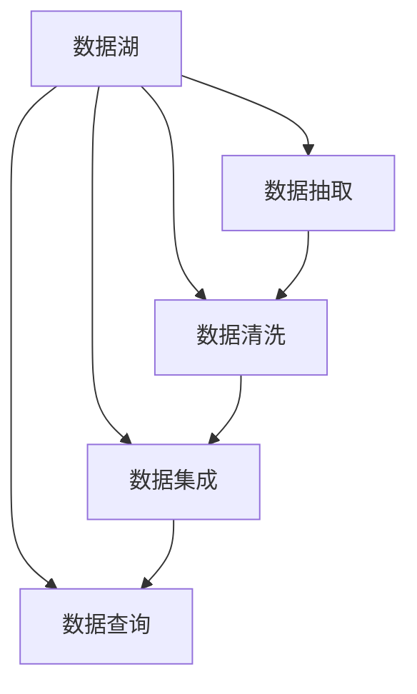

                 

# 数据湖架构：大规模数据存储和分析

> 关键词：数据湖,大数据,数据存储,数据湖架构,数据管道,数据查询,ETL,数据质量

## 1. 背景介绍

### 1.1 问题由来

随着数据技术的迅猛发展和数据价值认知的不断深入，大数据已经逐渐成为各行各业数字化转型的基石。企业越来越依赖数据驱动决策，希望借助大数据分析提升运营效率、优化产品设计、提高客户体验。数据湖作为一种新型的数据存储与管理方式，成为了处理大规模数据的有效手段。

然而，数据湖的构建与维护并不是一件容易的事情。数据湖架构复杂、数据量大、多样性高，数据湖管理团队需要具备强大的数据处理能力，才能有效应对。因此，如何构建高效、稳定、易用的数据湖架构，成为了各大企业面临的共同挑战。

### 1.2 问题核心关键点

数据湖的构建涉及数据存储、数据抽取、数据清洗、数据集成、数据查询等多个环节。这些环节互相依赖，任何一个环节出现问题，都可能导致数据湖的整体性能下降。因此，构建高效的数据湖架构，必须从整体上优化各个环节，提升数据湖的稳定性和易用性。

数据湖架构的核心关键点包括：
- **数据存储**：选择合适的数据存储方式，保证数据的高效存储和快速访问。
- **数据抽取**：建立可靠的数据抽取流程，从不同来源高效获取数据。
- **数据清洗**：设计有效的数据清洗策略，去除冗余、错误数据，提高数据质量。
- **数据集成**：构建完整的数据集成管道，将数据高效合并、融合。
- **数据查询**：实现灵活的数据查询接口，便于业务团队快速分析数据。

## 2. 核心概念与联系

### 2.1 核心概念概述

为更好地理解数据湖架构，本节将介绍几个密切相关的核心概念：

- **数据湖(Data Lake)**：一种新型的数据存储与管理方式，以松散结构存储海量数据，支持多种数据类型和格式。与数据仓库相比，数据湖更灵活、易扩展，能处理海量多源数据，具有更好的数据回溯能力。

- **数据管道(Data Pipeline)**：用于自动传输和处理数据流的流程，通常包含数据抽取、数据清洗、数据集成、数据存储等多个环节。数据管道通过编排多个组件，实现数据的连续处理，确保数据一致性和完整性。

- **ETL(Extract, Transform, Load)**：数据抽取、转换、加载的缩写，是数据管道的重要组成部分。ETL过程将源数据抽取出来，经过数据清洗和转换后，加载到目标存储系统。ETL是数据湖构建的基础环节，直接影响数据质量和数据可用性。

- **数据质量(Data Quality)**：描述数据完整性、准确性、一致性、一致性、安全性等特性的指标。良好的数据质量是数据湖分析的基础，能够提升业务洞察和决策支持。

- **数据治理(Data Governance)**：通过制定和实施数据管理政策，保证数据湖的安全性、合规性和有效性。数据治理关注数据的创建、维护、使用和销毁全生命周期，确保数据资产的最大化利用。

这些核心概念之间的逻辑关系可以通过以下Mermaid流程图来展示：



这个流程图展示了大湖架构的核心组件及其之间的关系：

1. 数据湖通过数据管道接收来自不同源的数据。
2. 数据抽取环节将数据从不同源抽取出来，并清洗冗余、错误数据。
3. 数据集成环节将数据合并、融合，形成统一的数据集。
4. 数据查询环节提供灵活的数据接口，支持业务团队进行数据分析和决策。

## 3. 核心算法原理 & 具体操作步骤
### 3.1 算法原理概述

数据湖架构的核心在于通过数据管道高效地处理和存储数据，同时通过ETL和数据治理环节提升数据质量，保障数据湖的稳定性和易用性。

### 3.2 算法步骤详解

数据湖的构建通常包括以下几个关键步骤：

**Step 1: 数据存储**

选择合适的数据存储方式，如Hadoop、S3、AWS Glacier等。根据数据的访问频率和存储成本，确定数据的存储位置。

**Step 2: 数据抽取**

设计数据抽取组件，从不同数据源（如数据库、API、文件系统等）抽取数据。通常使用ETL工具（如Apache Nifi、Talend等）进行数据抽取和清洗。

**Step 3: 数据清洗**

设计数据清洗策略，去除冗余、错误数据，确保数据的完整性和一致性。数据清洗环节可以通过正则表达式、数据类型转换、去重等操作进行。

**Step 4: 数据集成**

将清洗后的数据集成到数据湖中，通常使用ETL工具进行数据合并和转换。在此过程中，需要注意数据冲突和数据冗余问题，确保数据的一致性。

**Step 5: 数据查询**

设计数据查询接口，支持灵活的数据分析。通常使用SQL、NoSQL数据库等技术进行数据查询。

**Step 6: 数据治理**

制定和实施数据管理政策，确保数据的安全性、合规性和有效性。数据治理环节包括数据权限管理、数据质量监控、数据审计等。

### 3.3 算法优缺点

数据湖架构具有以下优点：
1. 灵活性高。数据湖支持多种数据类型和格式，能处理大规模多源数据。
2. 易于扩展。数据湖的扩展性和伸缩性较好，支持动态增加节点和资源。
3. 数据回溯。数据湖支持长期数据存储，便于数据回溯和历史数据分析。

同时，数据湖架构也存在一定的局限性：
1. 数据管理复杂。数据湖管理需要高水平的数据处理能力，成本较高。
2. 数据质量难以保障。数据湖的数据来源复杂，难以保证数据质量。
3. 数据查询性能较低。数据湖的数据访问速度较慢，需要优化数据查询性能。

尽管存在这些局限性，但数据湖架构仍然是处理大规模数据的重要手段，广泛应用于大数据分析、数据科学、人工智能等领域。

### 3.4 算法应用领域

数据湖架构在以下几个领域得到了广泛应用：

- **大数据分析**：利用数据湖存储和处理大规模数据，支持离线批处理和实时流处理，提供丰富的数据查询接口，便于业务团队进行数据分析和决策。

- **数据科学**：数据湖存储了丰富的数据集，便于数据科学家进行模型训练和验证，支持机器学习和深度学习等数据分析技术。

- **人工智能**：数据湖提供了海量的数据样本，便于训练和优化人工智能模型，支持大规模分布式训练。

- **企业决策支持**：数据湖存储了企业内部和外部的多源数据，支持跨部门、跨领域的数据整合，提升决策支持能力。

- **物联网(IoT)**：数据湖存储了大量的传感器数据，支持数据回溯和实时分析，提升物联网应用的价值。

除了上述这些应用领域，数据湖架构还被广泛应用于金融、医疗、制造、零售等多个行业，为企业的数字化转型提供了强大的数据支持。

## 4. 数学模型和公式 & 详细讲解  
### 4.1 数学模型构建

本节将使用数学语言对数据湖架构进行更加严格的刻画。

假设数据湖中的数据源数量为 $N$，数据源 $i$ 的抽取速度为 $r_i$，数据清洗和转换的延迟为 $\delta_i$，数据存储的延迟为 $\sigma_i$，数据查询的延迟为 $\tau_i$。数据湖的数据量大小为 $D$，单位为TB。

设数据湖的总体处理能力为 $C$，单位为TB/s，则数据湖的总体处理能力满足：

$$
C = \sum_{i=1}^N \frac{D}{r_i+\delta_i+\sigma_i+\tau_i}
$$

### 4.2 公式推导过程

以上公式展示了数据湖的总体处理能力如何通过各个环节的处理速度进行计算。具体推导如下：

假设数据湖中存在 $N$ 个数据源，数据源 $i$ 的日均生成数据量为 $d_i$，单位为TB。则每个数据源的日均数据量为 $d_i = r_i \times T$，其中 $T$ 为数据源的日工作时长。

数据湖中的日均数据量为：

$$
D = \sum_{i=1}^N d_i = \sum_{i=1}^N r_i \times T
$$

每个数据源的数据处理过程包括数据抽取、数据清洗、数据集成和数据存储四个环节。每个环节的处理时间分别为：

- 数据抽取时间：$T_a = \frac{d_i}{r_i}$
- 数据清洗时间：$T_c = \delta_i \times d_i$
- 数据集成时间：$T_i = \sigma_i \times d_i$
- 数据存储时间：$T_s = \tau_i \times d_i$

数据湖的总体处理时间为：

$$
T_{total} = \sum_{i=1}^N (T_a + T_c + T_i + T_s)
$$

数据湖的总体处理能力 $C$ 为单位时间内处理的数据量，即：

$$
C = \frac{D}{T_{total}}
$$

将 $D$ 和 $T_{total}$ 的表达式代入 $C$ 的公式中，得到：

$$
C = \frac{\sum_{i=1}^N d_i}{\sum_{i=1}^N (T_a + T_c + T_i + T_s)}
$$

将 $d_i$ 和 $T_a, T_c, T_i, T_s$ 的表达式代入 $C$ 的公式中，得到：

$$
C = \frac{\sum_{i=1}^N \frac{d_i}{T}}{\sum_{i=1}^N (\frac{d_i}{r_i} + \delta_i \times d_i + \sigma_i \times d_i + \tau_i \times d_i)}
$$

### 4.3 案例分析与讲解

假设企业有10个数据源，每个数据源的日均生成数据量为1TB。数据源1的日工作时长为24小时，数据源2的日工作时长为16小时。数据源1的抽取速度为1GB/s，数据源2的抽取速度为0.5GB/s。数据清洗和转换的延迟为5ms，数据存储的延迟为1ms，数据查询的延迟为10ms。

根据以上假设，可以计算数据湖的总体处理能力：

$$
C = \frac{\sum_{i=1}^N \frac{d_i}{T}}{\sum_{i=1}^N (\frac{d_i}{r_i} + \delta_i \times d_i + \sigma_i \times d_i + \tau_i \times d_i)}
$$

$$
C = \frac{10 \times \frac{1}{24} + 10 \times \frac{1}{16}}{\sum_{i=1}^N (\frac{1}{1} + 5 \times 10^{-3} + 1 \times 10^{-3} + 10 \times 10^{-3})}
$$

$$
C \approx 1.05 TB/s
$$

可以看出，在数据源1和2的处理速度不匹配的情况下，数据湖的总体处理能力会受到瓶颈数据源的影响。如果瓶颈数据源的处理速度较慢，则数据湖的总体处理能力也会下降。

## 5. 项目实践：代码实例和详细解释说明
### 5.1 开发环境搭建

在进行数据湖项目开发前，我们需要准备好开发环境。以下是使用Python进行Apache Nifi开发的环境配置流程：

1. 安装Apache Nifi：从官网下载并安装Apache Nifi，用于构建数据管道。

2. 创建并激活虚拟环境：
```bash
conda create -n nifi-env python=3.8 
conda activate nifi-env
```

3. 安装Nifi-Python：
```bash
pip install nifi-python
```

4. 安装各类工具包：
```bash
pip install pandas numpy scikit-learn matplotlib
```

完成上述步骤后，即可在`nifi-env`环境中开始数据湖项目开发。

### 5.2 源代码详细实现

这里我们以构建数据湖的数据抽取和清洗流程为例，给出使用Apache Nifi进行数据管道开发的PyTorch代码实现。

首先，定义数据源和数据格式：

```python
from nifi_python.client import NiFiRestApi
from nifi_python.client.proxies import ControllerServiceClient
from nifi_python.client import types

def create_flow(name, source_conn, target_conn, flow=None):
    # 创建流程
    flow_rest = NiFiRestApi('http://localhost:18080/nifi-api', None)
    flow = flow_rest.create_flow(name)
    flow.set_attributes(name)

    # 创建处理器
    processor = flow.create_processor(name='DataFilter', type='org.apache.nifi.processors.standard.DataFilter')
    processor.set_attributes(name=name)

    # 连接输入端口
    source_conn_id = source_conn.get_id()
    source_connection = flow.create_connection(flow_id=flow.get_id(), source_id=source_conn_id, target_id=processor.get_id())

    # 连接输出端口
    target_conn_id = target_conn.get_id()
    target_connection = flow.create_connection(flow_id=flow.get_id(), source_id=processor.get_id(), target_id=target_conn_id)

    # 设置处理器属性
    data_filter_rest = ControllerServiceClient('http://localhost:18080/nifi-api', None)
    data_filter = data_filter_rest.create_data_filter(name=name, filter_expression='${data:NOT_LATENCY|data:*}')

    # 获取输入和输出端口
    input_port = flow.get_input_port(source_conn.get_id())
    output_port = flow.get_output_port(target_conn.get_id())

    # 连接输入和输出端口
    flow.add_input_edge(flow_id=flow.get_id(), source_port=input_port.get_id(), target_port=source_connection.get_id())
    flow.add_output_edge(flow_id=flow.get_id(), source_port=processor.get_id(), target_port=output_port.get_id())

    return flow
```

然后，定义数据源和数据目标：

```python
def create_datasource(name, url, type='http'):
    datasource_rest = NiFiRestApi('http://localhost:18080/nifi-api', None)
    datasource = datasource_rest.create_datasource(name=name, type=type, url=url)
    return datasource

def create_datatarget(name, type='HDFS'):
    datatarget_rest = NiFiRestApi('http://localhost:18080/nifi-api', None)
    datatarget = datatarget_rest.create_datatarget(name=name, type=type)
    return datatarget
```

最后，启动数据湖构建流程：

```python
# 创建数据源和数据目标
source_datasource = create_datasource('Source Datasource', 'http://data-source-url')
target_datatarget = create_datatarget('Target Data Target', 'HDFS')

# 创建数据抽取流程
flow = create_flow('Data Lake Flow', source_datasource, target_datatarget)

# 启动数据湖构建流程
flow_rest.start_flow(flow.get_id())
```

以上就是使用Apache Nifi构建数据湖的完整代码实现。可以看到，Apache Nifi提供了强大的流程编排能力，可以轻松搭建复杂的数据管道，满足数据湖构建的多种需求。

### 5.3 代码解读与分析

让我们再详细解读一下关键代码的实现细节：

**create_flow方法**：
- 创建流程对象
- 创建处理器对象
- 创建连接对象，连接输入和输出端口
- 设置处理器属性
- 连接输入和输出端口

**create_datasource方法**：
- 创建数据源对象
- 创建数据源连接

**create_datatarget方法**：
- 创建数据目标对象
- 创建数据目标连接

**start_flow方法**：
- 启动流程

通过以上代码实现，我们完成了数据湖的构建流程。在实际应用中，还需要考虑更多的数据源、数据目标和处理流程，确保数据湖的稳定性和易用性。

## 6. 实际应用场景
### 6.1 智能制造

在智能制造领域，数据湖可以存储和管理企业的生产数据、设备数据、质量数据等，支持企业进行全面的数据分析和决策。例如，利用数据湖存储的生产数据，可以进行设备运行状态监测、故障预测、生产流程优化等，提升生产效率和质量。

### 6.2 金融风控

在金融风控领域，数据湖可以存储和管理用户的交易数据、行为数据、信用数据等，支持企业进行风险评估和决策。例如，利用数据湖存储的交易数据，可以进行用户行为分析、信用评估、欺诈检测等，提升金融风控能力。

### 6.3 电商推荐

在电商推荐领域，数据湖可以存储和管理用户的浏览数据、购买数据、评价数据等，支持企业进行个性化推荐。例如，利用数据湖存储的电商数据，可以进行用户行为分析、产品推荐、价格优化等，提升电商推荐效果。

### 6.4 未来应用展望

随着数据湖技术的不断成熟，未来数据湖将在更多领域得到应用，为各行各业带来变革性影响。

在智慧城市治理中，数据湖可以存储和管理城市运行数据、环境数据、交通数据等，支持城市管理的全面分析和决策。例如，利用数据湖存储的城市数据，可以进行城市交通优化、能源管理、环境监测等，提升城市治理水平。

在医疗健康领域，数据湖可以存储和管理患者的医疗数据、健康数据、基因数据等，支持医疗机构的全面分析和决策。例如，利用数据湖存储的医疗数据，可以进行疾病预测、基因分析、药物研发等，提升医疗健康水平。

在智能交通领域，数据湖可以存储和管理交通流量数据、交通设施数据、交通事件数据等，支持交通管理的全面分析和决策。例如，利用数据湖存储的交通数据，可以进行交通流量优化、事故预警、路径规划等，提升交通管理水平。

## 7. 工具和资源推荐
### 7.1 学习资源推荐

为了帮助开发者系统掌握数据湖架构的理论基础和实践技巧，这里推荐一些优质的学习资源：

1. **《大数据技术与应用》**：这是一本经典的数据库教材，详细介绍了大数据技术的原理、架构和应用，是入门大数据领域的必备读物。

2. **《数据湖技术与应用》**：这是一本系统介绍数据湖技术的书籍，涵盖了数据湖的构建、管理和分析等各个方面，适合数据湖从业者阅读。

3. **Apache Hadoop官方文档**：Apache Hadoop作为数据湖的基础架构，其官方文档提供了丰富的技术细节和实践经验，是学习数据湖的重要参考。

4. **Apache Nifi官方文档**：Apache Nifi作为数据湖的数据管道工具，其官方文档提供了详细的教程和示例代码，适合初学者学习。

5. **《数据湖设计与实践》**：这是一本实践导向的书籍，介绍了数据湖的实际构建过程和最佳实践，适合数据湖从业者阅读。

通过对这些资源的学习实践，相信你一定能够快速掌握数据湖架构的精髓，并用于解决实际的大数据问题。

### 7.2 开发工具推荐

高效的开发离不开优秀的工具支持。以下是几款用于数据湖开发常用的工具：

1. Apache Hadoop：Hadoop生态系统的核心组件，提供了大规模数据存储和处理的能力。

2. Apache Spark：Hadoop生态系统的数据处理引擎，支持分布式计算和流处理，适合大数据分析任务。

3. Apache Nifi：开源数据集成工具，支持数据抽取、转换和加载，适合构建复杂的数据管道。

4. Apache Kafka：开源流处理平台，支持大规模数据流处理，适合实时数据处理任务。

5. Apache Cassandra：分布式数据库，支持高可用性和高扩展性，适合海量数据的存储和管理。

6. Apache Hive：基于Hadoop的SQL查询引擎，支持大规模数据集的SQL查询和分析。

合理利用这些工具，可以显著提升数据湖的构建效率，加快创新迭代的步伐。

### 7.3 相关论文推荐

数据湖技术的发展源于学界的持续研究。以下是几篇奠基性的相关论文，推荐阅读：

1. **《大数据技术架构》**：详细介绍了大数据技术架构和应用，提出了多种数据湖构建方案。

2. **《数据湖的实现与优化》**：介绍了数据湖的实现过程和优化策略，提出了多种数据湖管理方案。

3. **《数据湖中的数据治理》**：讨论了数据湖中的数据治理问题，提出了多种数据治理方案。

4. **《数据湖中的数据质量管理》**：讨论了数据湖中的数据质量问题，提出了多种数据质量管理方案。

5. **《数据湖中的数据安全性》**：讨论了数据湖中的数据安全问题，提出了多种数据安全方案。

这些论文代表了大湖技术的发展脉络。通过学习这些前沿成果，可以帮助研究者把握学科前进方向，激发更多的创新灵感。

## 8. 总结：未来发展趋势与挑战

### 8.1 总结

本文对数据湖架构进行了全面系统的介绍。首先阐述了数据湖构建的背景和意义，明确了数据湖架构在处理大规模数据、提升数据分析能力方面的独特价值。其次，从原理到实践，详细讲解了数据湖架构的数学模型和核心算法，给出了数据湖构建的完整代码实例。同时，本文还广泛探讨了数据湖架构在智能制造、金融风控、电商推荐等众多行业领域的应用前景，展示了数据湖架构的广阔应用场景。最后，本文精选了数据湖架构的学习资源，力求为读者提供全方位的技术指引。

通过本文的系统梳理，可以看到，数据湖架构是大数据处理的重要手段，通过数据管道和ETL等环节，能够有效提升数据的处理和存储能力，支持大规模数据分析和决策。未来，伴随数据湖技术的不断演进，数据湖将在更多领域得到应用，为各行各业带来变革性影响。

### 8.2 未来发展趋势

展望未来，数据湖架构将呈现以下几个发展趋势：

1. 数据湖的扩展性将进一步提升。随着技术的发展，数据湖的扩展性和伸缩性将更加完善，支持更大规模的数据处理。

2. 数据湖的实时处理能力将进一步提升。未来的数据湖将支持实时数据处理和流处理，满足数据湖的实时分析需求。

3. 数据湖的自动化和智能化将进一步提升。未来的数据湖将引入更多的自动化和智能化技术，如自动数据清洗、自动数据标注、自动数据治理等，提升数据湖的自动化水平。

4. 数据湖的多模态处理能力将进一步提升。未来的数据湖将支持更多数据类型的处理，如文本、图像、视频、语音等，提升数据湖的多模态处理能力。

5. 数据湖的协同计算能力将进一步提升。未来的数据湖将支持更多的协同计算方式，如分布式计算、联邦计算、边缘计算等，提升数据湖的计算能力。

以上趋势凸显了数据湖架构的广阔前景。这些方向的探索发展，必将进一步提升数据湖的性能和应用范围，为大数据分析提供更加强大的技术支撑。

### 8.3 面临的挑战

尽管数据湖架构已经取得了瞩目成就，但在迈向更加智能化、普适化应用的过程中，它仍面临着诸多挑战：

1. 数据治理复杂。数据湖的治理需要高水平的数据管理能力，成本较高，且治理效果与业务需求不完全匹配。

2. 数据质量难以保障。数据湖的数据来源复杂，难以保证数据质量，需要不断进行数据清洗和数据标注。

3. 数据存储和查询性能较低。数据湖的存储和查询性能较低，需要不断进行优化。

4. 数据安全和隐私问题。数据湖存储了大量敏感数据，需要严格控制数据的访问权限和隐私保护。

5. 数据湖的扩展和维护成本较高。数据湖的扩展和维护需要高水平的技术能力，成本较高。

尽管存在这些挑战，但随着技术的不断发展和完善，数据湖架构必将在更多领域得到应用，为各行各业带来变革性影响。

### 8.4 研究展望

面对数据湖架构所面临的挑战，未来的研究需要在以下几个方面寻求新的突破：

1. 引入更多的数据治理工具。引入数据治理工具，如元数据管理、数据分类、数据治理自动化等，提升数据湖的治理能力。

2. 引入更多数据质量提升技术。引入数据清洗、数据标注、数据验证等技术，提升数据湖的数据质量。

3. 引入更多的实时处理技术。引入实时处理技术，如流处理、微批处理等，提升数据湖的实时处理能力。

4. 引入更多的自动化和智能化技术。引入自动化和智能化技术，如自动数据清洗、自动数据标注、自动数据治理等，提升数据湖的自动化水平。

5. 引入更多的数据安全和隐私技术。引入数据安全和隐私技术，如数据加密、数据脱敏、数据审计等，保障数据湖的数据安全和隐私。

6. 引入更多的多模态数据处理技术。引入多模态数据处理技术，如文本、图像、视频、语音等多模态数据的协同处理，提升数据湖的多模态处理能力。

这些研究方向的探索，必将引领数据湖架构迈向更高的台阶，为构建安全、可靠、可解释、可控的数据湖提供新的技术支撑。面向未来，数据湖架构还需要与其他人工智能技术进行更深入的融合，如知识表示、因果推理、强化学习等，多路径协同发力，共同推动数据湖架构的发展和应用。

## 9. 附录：常见问题与解答

**Q1：数据湖与数据仓库的区别是什么？**

A: 数据湖与数据仓库的主要区别在于数据存储方式、数据处理方式和数据应用场景。

- 数据存储方式：数据湖以松散结构存储海量数据，支持多种数据类型和格式，而数据仓库通常采用严格的表结构存储数据。

- 数据处理方式：数据湖支持离线批处理和实时流处理，而数据仓库通常只支持离线批处理。

- 数据应用场景：数据湖适用于大数据分析和数据科学，而数据仓库适用于结构化数据的在线查询和分析。

**Q2：数据湖的扩展性和伸缩性如何保证？**

A: 数据湖的扩展性和伸缩性主要通过以下几个方面保证：

1. 分布式存储：数据湖通常采用分布式存储系统，如Hadoop、S3等，支持大规模数据的存储和管理。

2. 分布式计算：数据湖通常采用分布式计算系统，如Apache Spark、Flink等，支持大规模数据的计算和分析。

3. 高可用性和容错性：数据湖通常采用高可用性和容错性较高的系统架构，如HA集群、多副本等，确保系统的稳定性和可靠性。

4. 自动扩展：数据湖通常支持自动扩展机制，根据数据量和负载情况，动态增加节点和资源。

5. 混合云架构：数据湖通常采用混合云架构，支持跨云数据迁移和计算，提升系统的灵活性和扩展性。

**Q3：数据湖中的数据清洗和数据标注如何实现？**

A: 数据湖中的数据清洗和数据标注主要通过以下方式实现：

1. 数据清洗：利用ETL工具和编程语言，对数据进行去重、去噪、规范化等操作，去除冗余、错误数据，提升数据质量。

2. 数据标注：利用机器学习模型、人工标注等方法，对数据进行标注，为后续数据分析和模型训练提供基础数据。

3. 数据验证：利用数据验证工具，对标注结果进行验证和校对，确保数据标注的正确性和一致性。

4. 数据标注自动化：引入自动标注技术，如自然语言处理、计算机视觉等，提升数据标注的效率和准确性。

5. 数据标注协同：引入协同标注工具，支持多个人同时对同一数据进行标注，确保数据标注的一致性。

通过以上方式，可以高效实现数据湖中的数据清洗和数据标注，提升数据湖的数据质量。

**Q4：数据湖中的数据安全和隐私问题如何处理？**

A: 数据湖中的数据安全和隐私问题主要通过以下方式处理：

1. 数据加密：对敏感数据进行加密存储和传输，防止数据泄露和攻击。

2. 数据脱敏：对敏感数据进行脱敏处理，如去标识化、伪匿名化等，降低数据泄露的风险。

3. 数据权限管理：对数据访问进行严格的权限控制，确保数据只能被授权用户访问。

4. 数据审计和监控：对数据访问和操作进行审计和监控，记录和分析数据操作行为，防止数据滥用。

5. 数据合规性管理：确保数据湖的数据处理符合相关法律法规和行业标准，如GDPR、HIPAA等。

通过以上方式，可以确保数据湖的数据安全和隐私保护，提升数据湖的可靠性和可信度。

**Q5：数据湖中的数据治理如何实现？**

A: 数据湖中的数据治理主要通过以下方式实现：

1. 数据元管理：对数据湖中的数据进行元数据管理，包括数据来源、数据结构、数据关系等。

2. 数据分类：对数据湖中的数据进行分类，如结构化数据、非结构化数据、实时数据等，提升数据湖的数据管理效率。

3. 数据质量管理：对数据湖中的数据进行质量管理，包括数据完整性、准确性、一致性、安全性等，提升数据湖的数据质量。

4. 数据资产管理：对数据湖中的数据进行资产管理，包括数据的所有者、数据的使用者、数据的访问权限等，提升数据湖的数据治理效率。

5. 数据治理自动化：引入自动化工具，对数据湖中的数据进行自动治理，如自动数据清洗、自动数据标注、自动数据治理等，提升数据湖的数据治理效率。

通过以上方式，可以高效实现数据湖中的数据治理，提升数据湖的数据质量和治理效率。

---

作者：禅与计算机程序设计艺术 / Zen and the Art of Computer Programming

