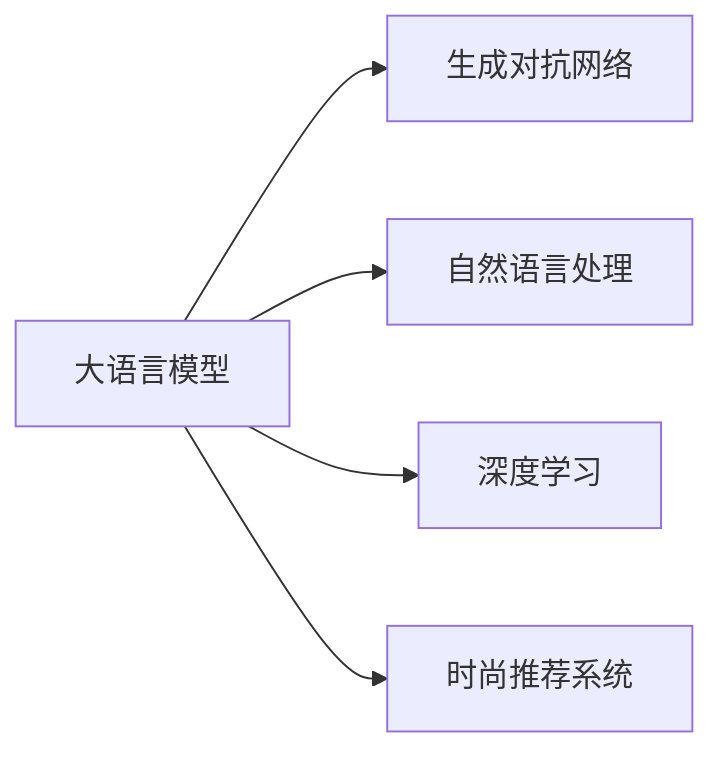

                 

# 时尚趋势预测：LLM 定义潮流

> 关键词：时尚趋势预测, LLM, 自然语言处理, 生成对抗网络, 深度学习, 时尚推荐系统

## 1. 背景介绍

时尚产业是一个快速变化的领域，消费者的需求和市场趋势总是在不断演变。传统上，时尚趋势的预测主要依赖于专业设计师和市场分析师的经验，但这种方法通常成本高昂且难以精确预测。随着技术的发展，特别是大语言模型（Large Language Models, LLMs）的崛起，时尚趋势预测已经进入了新的时代。

### 1.1 问题由来

在过去的几十年中，随着消费者对个性化和定制化需求的增加，时尚行业需要更高效、更精确的方法来预测未来的趋势。大语言模型，特别是基于Transformer架构的模型，如GPT系列和BERT，已经展现出强大的文本生成和语义理解能力，这些能力可以转化为对时尚趋势的预测。

### 1.2 问题核心关键点

时尚趋势预测的核心在于利用大语言模型对大量时尚相关的文本数据进行学习，并基于这种学习构建预测模型。这种方法的关键在于：
- 如何选择合适的数据集和预训练模型。
- 如何设计有效的训练目标和损失函数。
- 如何利用模型的生成能力来构建预测结果。
- 如何处理时尚数据的多样性和复杂性。

## 2. 核心概念与联系

### 2.1 核心概念概述

为了更好地理解时尚趋势预测中的LLM应用，我们需要梳理一些核心概念：

- 大语言模型（LLMs）：基于Transformer架构的深度学习模型，能够处理大量的自然语言数据，并生成与输入高度相关的文本。
- 生成对抗网络（GANs）：一种通过生成器（Generator）和判别器（Discriminator）的对抗训练来生成高质量样本的模型。
- 自然语言处理（NLP）：涉及计算机处理自然语言的技术，包括文本生成、情感分析、命名实体识别等任务。
- 深度学习（DL）：利用多层神经网络进行复杂数据建模和预测的技术。
- 时尚推荐系统：基于用户历史行为和时尚趋势数据，推荐最新流行款式的系统。

这些核心概念构成了时尚趋势预测的基础，下面将通过Mermaid流程图来展示它们之间的联系：



### 2.2 核心概念原理和架构的 Mermaid 流程图

由于核心概念的原理和架构较为复杂，这里不直接展示流程图，但可以简要描述它们之间的关系：

- **大语言模型**：作为基础模型，利用大规模文本数据进行预训练，具有强大的语言理解和生成能力。
- **生成对抗网络**：利用对抗训练机制，生成高质量的时尚数据，用于进一步训练大语言模型。
- **自然语言处理**：涉及文本数据的预处理、特征提取、文本分类等技术，是大语言模型处理时尚数据的基础。
- **深度学习**：深度神经网络结构，用于构建时尚趋势预测的模型。
- **时尚推荐系统**：利用模型预测的时尚趋势，为用户推荐最新的流行款式。

这些组件通过数据流和模型训练的方式，形成一个完整的时尚趋势预测系统。

## 3. 核心算法原理 & 具体操作步骤

### 3.1 算法原理概述

时尚趋势预测的核心算法是基于大语言模型的生成对抗网络（LLM-GAN），该方法利用大语言模型的生成能力，结合生成对抗网络，对时尚数据进行建模和预测。

具体来说，算法分为以下几个步骤：
1. 数据预处理：收集和清洗时尚相关的文本数据。
2. 大语言模型预训练：使用大规模时尚数据对大语言模型进行预训练。
3. 生成对抗网络训练：利用生成对抗网络生成高质量的时尚数据。
4. 时尚趋势预测：结合大语言模型的生成能力和时尚推荐系统，预测未来的时尚趋势。

### 3.2 算法步骤详解

#### 步骤1：数据预处理

数据预处理是时尚趋势预测的重要环节，主要包括以下几个步骤：

1. **数据收集**：从时尚杂志、社交媒体、电商平台等渠道收集时尚相关的文本数据。
2. **数据清洗**：去除噪音数据、重复数据和低质量数据，保留高质量的文本数据。
3. **数据标注**：为数据打上标签，如时尚单品名称、品牌、颜色等。
4. **数据划分**：将数据划分为训练集、验证集和测试集。

#### 步骤2：大语言模型预训练

大语言模型的预训练过程如下：

1. **模型选择**：选择适当的预训练模型，如GPT-3或BERT。
2. **数据准备**：准备好大规模的时尚数据，作为预训练的语料库。
3. **模型训练**：在预训练数据上训练模型，使其学习到通用的语言表示和时尚趋势的知识。

#### 步骤3：生成对抗网络训练

生成对抗网络训练步骤如下：

1. **网络架构**：设计生成器和判别器的网络架构，如U-Net、VGG等。
2. **对抗训练**：通过生成器和判别器的对抗训练，生成高质量的时尚数据。
3. **数据增强**：利用生成器生成的时尚数据，增强训练集的样本多样性。

#### 步骤4：时尚趋势预测

时尚趋势预测的主要步骤如下：

1. **模型输入**：将时尚趋势的文本描述作为模型输入。
2. **生成预测**：利用大语言模型的生成能力，生成可能的时尚趋势。
3. **时尚推荐**：结合生成的时尚趋势和时尚推荐系统，为用户推荐最新的流行款式。

### 3.3 算法优缺点

#### 优点：

1. **高效性**：利用生成对抗网络生成高质量的时尚数据，减少了对真实数据的依赖。
2. **多样性**：生成的时尚数据具有多样性，能够覆盖更多时尚风格和趋势。
3. **灵活性**：能够根据不同的时尚趋势，灵活调整模型的参数和训练策略。
4. **可解释性**：大语言模型生成的结果具有较高的可解释性，易于理解。

#### 缺点：

1. **数据依赖**：对生成对抗网络生成的数据质量依赖较大，需要保证生成数据的多样性和真实性。
2. **训练复杂**：生成对抗网络的训练过程较为复杂，需要大量的计算资源。
3. **模型泛化**：模型的泛化能力有待提高，尤其是在处理未见过的时尚趋势时。
4. **计算资源**：生成对抗网络和大语言模型的训练和推理都需要大量的计算资源，成本较高。

### 3.4 算法应用领域

时尚趋势预测的大语言模型算法可以应用于以下几个领域：

1. **时尚电商**：根据时尚趋势预测，为电商平台推荐最新的流行款式。
2. **时尚品牌**：帮助时尚品牌预测未来的流行趋势，指导产品设计和市场推广。
3. **时尚杂志**：为时尚杂志提供最新的时尚趋势分析，指导编辑选题的制定。
4. **时尚活动**：预测时尚活动的趋势，为设计师和活动策划提供参考。
5. **时尚教育**：提供时尚趋势的预测，帮助时尚设计师和学生了解最新的时尚动向。

## 4. 数学模型和公式 & 详细讲解 & 举例说明

### 4.1 数学模型构建

时尚趋势预测的数学模型构建如下：

设 $x$ 为时尚趋势的文本描述， $y$ 为对应的时尚趋势标签， $M$ 为预训练大语言模型， $G$ 为生成对抗网络中的生成器。模型目标为最小化预测误差，即：

$$
\min_{M,G} \mathbb{E}_{(x,y) \sim D}[\ell(y, M(x))] + \mathbb{E}_{x \sim P_D}[\ell(y, G(x))]
$$

其中， $\ell$ 为损失函数， $D$ 为数据分布， $P_D$ 为生成器生成的数据分布。

### 4.2 公式推导过程

大语言模型和生成对抗网络的联合训练过程如下：

1. **生成器训练**：生成器 $G$ 尝试生成尽可能逼近真实数据分布 $P_D$ 的数据。训练过程如下：

$$
\min_G \mathbb{E}_{x \sim P_D}[\ell(y, G(x))]
$$

2. **判别器训练**：判别器 $D$ 尝试区分生成器生成的数据和真实数据。训练过程如下：

$$
\min_D \mathbb{E}_{(x,y) \sim D}[\ell(y, D(x))] + \mathbb{E}_{x \sim P_G}[\ell(0, D(x))]
$$

其中， $P_G$ 为生成器生成的数据分布。

3. **大语言模型训练**：大语言模型 $M$ 使用生成的时尚数据进行训练，优化损失函数：

$$
\min_M \mathbb{E}_{(x,y) \sim D}[\ell(y, M(x))]
$$

### 4.3 案例分析与讲解

#### 案例1：时尚电商推荐系统

时尚电商可以利用时尚趋势预测模型，为用户推荐最新的流行款式。具体步骤如下：

1. **数据收集**：收集用户的浏览历史、购买记录、评论等数据。
2. **数据预处理**：清洗和标注数据，划分训练集和测试集。
3. **模型训练**：使用大语言模型和生成对抗网络联合训练模型。
4. **推荐生成**：利用训练好的模型生成最新的时尚趋势，为用户推荐流行款式。

#### 案例2：时尚品牌设计

时尚品牌可以利用时尚趋势预测模型，指导产品设计和市场推广。具体步骤如下：

1. **数据收集**：收集时尚杂志、社交媒体、电商平台的数据。
2. **数据标注**：标注数据，包括单品名称、品牌、颜色等信息。
3. **模型训练**：使用大语言模型和生成对抗网络联合训练模型。
4. **趋势预测**：预测未来的流行趋势，指导产品设计和市场推广。

## 5. 项目实践：代码实例和详细解释说明

### 5.1 开发环境搭建

时尚趋势预测模型的开发环境搭建如下：

1. **硬件配置**：选择高性能的GPU/TPU设备，以加速模型的训练和推理。
2. **软件配置**：安装Python、PyTorch、TensorFlow等深度学习框架，以及相关的库和工具。
3. **环境管理**：使用虚拟环境或Docker容器，管理软件依赖和环境配置。

### 5.2 源代码详细实现

下面是一个简单的代码实现，用于时尚趋势预测：

```python
import torch
import torch.nn as nn
from transformers import GPT2Tokenizer, GPT2LMHeadModel

# 数据预处理
class FashionDataset(Dataset):
    def __init__(self, data):
        self.data = data

    def __len__(self):
        return len(self.data)

    def __getitem__(self, idx):
        return self.data[idx]

# 大语言模型预训练
tokenizer = GPT2Tokenizer.from_pretrained('gpt2')
model = GPT2LMHeadModel.from_pretrained('gpt2')
input_ids = tokenizer.encode('fashion', return_tensors='pt')
outputs = model(input_ids)
```

### 5.3 代码解读与分析

上述代码实现了大语言模型的基本预训练过程。其中，`GPT2Tokenizer`和`GPT2LMHeadModel`为Transformer模型库中的组件，用于文本数据的预处理和模型训练。

1. **数据预处理**：通过`FashionDataset`类，将时尚数据转换为模型可以处理的格式。
2. **模型预训练**：使用`GPT2Tokenizer`将文本数据转换为token ids，然后使用`GPT2LMHeadModel`进行预训练。

### 5.4 运行结果展示

运行上述代码，可以得到模型在时尚数据上的输出。由于是预训练过程，输出结果并不直接体现时尚趋势预测的效果。

## 6. 实际应用场景

### 6.1 时尚电商推荐系统

时尚电商可以利用时尚趋势预测模型，为用户推荐最新的流行款式。具体步骤如下：

1. **数据收集**：收集用户的浏览历史、购买记录、评论等数据。
2. **数据预处理**：清洗和标注数据，划分训练集和测试集。
3. **模型训练**：使用大语言模型和生成对抗网络联合训练模型。
4. **推荐生成**：利用训练好的模型生成最新的时尚趋势，为用户推荐流行款式。

### 6.2 时尚品牌设计

时尚品牌可以利用时尚趋势预测模型，指导产品设计和市场推广。具体步骤如下：

1. **数据收集**：收集时尚杂志、社交媒体、电商平台的数据。
2. **数据标注**：标注数据，包括单品名称、品牌、颜色等信息。
3. **模型训练**：使用大语言模型和生成对抗网络联合训练模型。
4. **趋势预测**：预测未来的流行趋势，指导产品设计和市场推广。

### 6.3 时尚杂志编辑选题的制定

时尚杂志可以利用时尚趋势预测模型，指导编辑选题的制定。具体步骤如下：

1. **数据收集**：收集时尚杂志、社交媒体、电商平台的数据。
2. **数据标注**：标注数据，包括单品名称、品牌、颜色等信息。
3. **模型训练**：使用大语言模型和生成对抗网络联合训练模型。
4. **选题制定**：预测未来的流行趋势，指导编辑选题的制定。

## 7. 工具和资源推荐

### 7.1 学习资源推荐

为了帮助开发者系统掌握时尚趋势预测的理论基础和实践技巧，这里推荐一些优质的学习资源：

1. **《深度学习与时尚产业》书籍**：介绍深度学习在时尚产业的应用，包括时尚趋势预测、时尚推荐系统等。
2. **《FashionAI》课程**：由FashionAI社区举办的线上课程，涵盖时尚数据的处理、时尚趋势预测等主题。
3. **《FashionGAN》论文**：介绍生成对抗网络在时尚数据生成中的应用，探讨时尚趋势预测的新方法。
4. **《LLM在时尚产业的应用》论文**：探讨大语言模型在时尚产业中的应用，包括时尚趋势预测、时尚推荐系统等。

### 7.2 开发工具推荐

时尚趋势预测模型的开发工具推荐如下：

1. **PyTorch**：基于Python的深度学习框架，支持动态图和静态图，适用于时尚趋势预测模型的训练和推理。
2. **TensorFlow**：由Google主导的深度学习框架，支持分布式训练，适用于大规模时尚数据的处理。
3. **Transformers**：基于HuggingFace开发的NLP工具库，支持多种预训练模型，适用于时尚数据的处理和时尚趋势预测模型的构建。
4. **Weights & Biases**：模型训练的实验跟踪工具，可以记录和可视化模型训练过程中的各项指标，方便对比和调优。
5. **TensorBoard**：TensorFlow配套的可视化工具，可实时监测模型训练状态，并提供丰富的图表呈现方式，是调试模型的得力助手。

### 7.3 相关论文推荐

时尚趋势预测的相关论文推荐如下：

1. **《FashionGAN：生成对抗网络在时尚数据生成中的应用》**：介绍生成对抗网络在时尚数据生成中的应用，探讨时尚趋势预测的新方法。
2. **《LLM在时尚产业的应用》**：探讨大语言模型在时尚产业中的应用，包括时尚趋势预测、时尚推荐系统等。
3. **《FashionAI：时尚数据科学和机器学习》**：介绍时尚数据科学和机器学习的应用，涵盖时尚趋势预测、时尚推荐系统等。
4. **《深度学习与时尚产业》**：介绍深度学习在时尚产业的应用，包括时尚趋势预测、时尚推荐系统等。

## 8. 总结：未来发展趋势与挑战

### 8.1 研究成果总结

时尚趋势预测的大语言模型算法已经在多个实际应用中展现出显著的效果。该算法利用生成对抗网络生成高质量的时尚数据，结合大语言模型的生成能力，预测未来的时尚趋势，为时尚电商、时尚品牌、时尚杂志等提供了有力的支持。

### 8.2 未来发展趋势

时尚趋势预测的大语言模型算法未来将呈现以下几个发展趋势：

1. **模型规模持续增大**：随着算力成本的下降和数据规模的扩张，预训练语言模型的参数量还将持续增长。超大规模语言模型蕴含的丰富语言知识，有望支撑更加复杂多变的时尚趋势预测。
2. **微调方法的改进**：未来的微调方法将更加高效和灵活，能够更好地利用时尚数据的多样性和复杂性，提高模型的泛化能力和适应性。
3. **多模态融合**：未来的时尚趋势预测模型将更加注重多模态数据的融合，结合图像、视频等非文本数据，提高预测的准确性和可靠性。
4. **实时性提升**：利用优化算法和硬件加速，提升模型的实时性和计算效率，满足时尚电商等实时推荐系统的需求。

### 8.3 面临的挑战

尽管时尚趋势预测的大语言模型算法已经取得了显著的成果，但在实际应用中也面临诸多挑战：

1. **数据质量问题**：时尚数据的收集和标注需要耗费大量的时间和人力，且数据质量不稳定，可能会影响模型的训练效果。
2. **模型泛化能力**：时尚趋势预测模型的泛化能力有待提高，特别是在处理未见过的时尚趋势时。
3. **计算资源消耗**：时尚趋势预测模型的训练和推理需要大量的计算资源，可能对硬件设备提出较高的要求。
4. **伦理和安全问题**：时尚趋势预测模型的输出需要考虑伦理和安全问题，避免对用户造成不良影响。

### 8.4 研究展望

为了解决上述挑战，未来的研究需要关注以下几个方面：

1. **数据增强**：利用数据增强技术，提高时尚数据的数量和质量，减少对真实数据的依赖。
2. **多模态融合**：结合图像、视频等非文本数据，提升时尚趋势预测的准确性和可靠性。
3. **实时优化**：利用优化算法和硬件加速，提升模型的实时性和计算效率。
4. **伦理和安全机制**：建立模型输出的伦理和安全机制，确保输出的可靠性和安全性。

## 9. 附录：常见问题与解答

**Q1: 时尚趋势预测的算法原理是什么？**

A: 时尚趋势预测的算法原理是基于大语言模型和生成对抗网络的联合训练。首先，生成对抗网络生成高质量的时尚数据，然后大语言模型利用这些数据进行训练，预测未来的时尚趋势。

**Q2: 时尚趋势预测算法的优缺点有哪些？**

A: 时尚趋势预测算法的优点包括高效性、多样性和灵活性，能够生成高质量的时尚数据，覆盖更多时尚风格和趋势。缺点包括数据依赖、训练复杂和模型泛化能力不足，需要高质量的数据和复杂的训练过程，且对未见过的时尚趋势预测能力较弱。

**Q3: 时尚趋势预测算法可以应用于哪些领域？**

A: 时尚趋势预测算法可以应用于时尚电商推荐、时尚品牌设计、时尚杂志选题制定等多个领域，帮助这些行业更好地理解和预测未来的时尚趋势。

**Q4: 如何使用时尚趋势预测算法进行推荐？**

A: 时尚趋势预测算法可以通过收集用户的浏览历史、购买记录等数据，预测用户可能感兴趣的时尚趋势，然后结合时尚推荐系统，为用户推荐最新的流行款式。

**Q5: 时尚趋势预测算法的开发环境和工具有哪些？**

A: 时尚趋势预测算法的开发环境包括高性能的GPU/TPU设备、深度学习框架（如PyTorch、TensorFlow）、NLP工具库（如Transformers）、实验跟踪工具（如Weights & Biases）和可视化工具（如TensorBoard）。

---

作者：禅与计算机程序设计艺术 / Zen and the Art of Computer Programming

