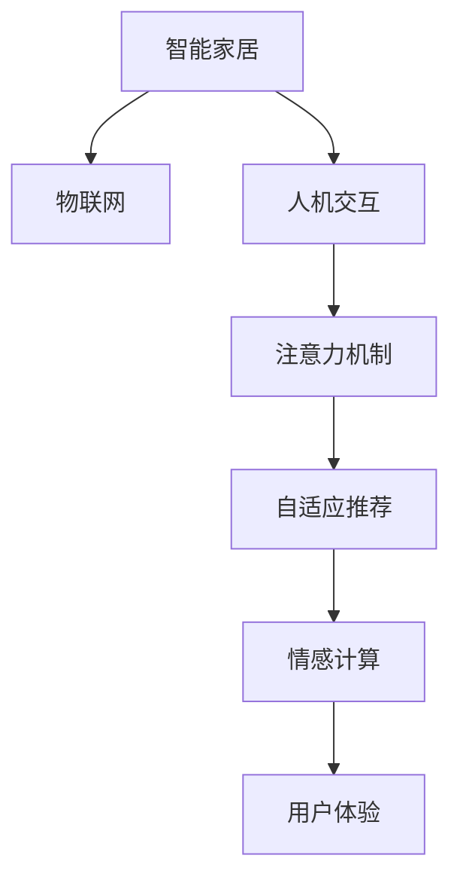

                 

# 智能冰箱：厨房场景下的注意力争夺

> 关键词：智能家居、物联网、人机交互、注意力机制、自适应推荐、情感计算

## 1. 背景介绍

在日益繁忙的现代生活中，消费者越来越需要智能家居产品来提升生活质量。智能冰箱作为一种典型的家庭电子设备，已经成为智能家居的重要组成部分。然而，尽管智能冰箱集成了语音助手、信息检索、供应链整合等诸多功能，却仍然面临着用户注意力的争夺。一方面，智能冰箱需要在与用户交互时获取足够的注意力，以便提供有用的信息和服务。另一方面，智能冰箱又需要避免过多打扰用户，以保持友好性。本文章将探讨如何在厨房场景下，利用注意力机制和自适应推荐技术，提升智能冰箱的用户体验。

## 2. 核心概念与联系

### 2.1 核心概念概述

为更好地理解智能冰箱中的注意力争夺，本节将介绍几个关键概念及其相互联系：

- **智能家居(IoT Home)**：基于物联网技术的家庭设备网络，通过互联网连接家庭各设备和系统，实现智能化操作。
- **人机交互(Human-Computer Interaction, HCI)**：研究如何使计算机系统更好地理解人类行为和需求，并提供直观、自然的人机交流方式。
- **注意力机制(Attention Mechanism)**：一种计算模型，用于衡量输入特征序列中每个元素的重要程度，动态调整模型的关注点。
- **自适应推荐(Adaptive Recommendation)**：根据用户的实时行为和偏好，动态调整推荐算法，提供个性化的推荐结果。
- **情感计算(Affective Computing)**：通过计算和分析用户的情感状态，优化智能系统的交互体验，提升用户满意度。

这些概念之间的逻辑关系可以通过以下Mermaid流程图来展示：



这个流程图展示了几者之间的联系：

1. 智能家居通过物联网连接家庭设备，实现设备间的互联互通。
2. 人机交互研究如何设计自然、高效的交互界面，提升用户的使用体验。
3. 注意力机制用于衡量用户交互中的重点元素，引导智能家居设备获取用户注意力。
4. 自适应推荐根据用户实时行为，动态调整推荐内容，提升个性化体验。
5. 情感计算通过分析用户情感，优化系统交互，增强用户满意度。

这些概念共同构成了智能冰箱在厨房场景下进行注意力争夺的技术基础。

## 3. 核心算法原理 & 具体操作步骤

### 3.1 算法原理概述

智能冰箱在厨房场景下争夺用户注意力，涉及以下几个核心算法原理：

- **注意力机制**：通过计算每个用户交互元素的重要性，动态调整模型注意力分布。
- **自适应推荐**：根据用户行为数据，动态调整推荐算法，提供个性化的商品推荐。
- **情感计算**：通过分析用户语音、面部表情等情感信号，优化系统交互，提升用户满意度。

智能冰箱在用户交互过程中，首先通过注意力机制获取用户的关注点，然后结合自适应推荐技术，提供个性化的商品推荐，最后利用情感计算技术，优化系统的交互体验，从而实现用户注意力的有效争夺。

### 3.2 算法步骤详解

智能冰箱的注意力争夺过程包括以下几个关键步骤：

**Step 1: 数据收集与预处理**
- 使用传感器收集用户的交互行为数据，包括开门次数、购物时间、冷藏室温度等。
- 对原始数据进行清洗和标准化处理，去除噪声和异常值。

**Step 2: 注意力机制计算**
- 使用注意力模型计算每个用户交互元素的重要性。
- 设计注意力权重函数，衡量元素对用户注意力的贡献。
- 动态调整模型参数，以适应用户注意力的变化。

**Step 3: 自适应推荐计算**
- 根据注意力机制计算出的权重，调整推荐算法。
- 结合用户历史行为数据，进行协同过滤和内容推荐。
- 实时更新推荐结果，根据用户反馈进行调整。

**Step 4: 情感计算与交互优化**
- 使用情感识别技术，分析用户语音、面部表情等情感信号。
- 根据情感状态，优化系统的交互策略，避免打扰用户。
- 实时调整推荐内容，以适应用户情感变化。

**Step 5: 用户体验反馈**
- 收集用户对系统推荐和交互的反馈，如满意度、评价等。
- 根据反馈结果，不断优化推荐和交互策略。
- 建立反馈循环，实现系统的自适应学习和进化。

### 3.3 算法优缺点

智能冰箱的注意力争夺方法具有以下优点：

1. **个性化体验**：结合自适应推荐和情感计算，提供个性化的商品推荐和交互策略，提升用户满意度。
2. **实时响应**：通过实时数据处理和交互优化，智能冰箱能够快速响应用户需求，提升用户体验。
3. **动态调整**：通过注意力机制和自适应推荐，智能冰箱能够动态调整推荐内容和交互方式，增强系统的适应性。

然而，该方法也存在以下局限性：

1. **数据隐私**：收集用户行为数据和情感信号可能引发隐私问题，需要建立严格的数据保护机制。
2. **模型复杂性**：注意力机制和自适应推荐算法复杂，需要大量的计算资源和存储空间。
3. **用户依赖**：系统的推荐和交互效果依赖用户反馈，对于不积极反馈的用户，效果可能较差。
4. **技术门槛**：实现上述算法需要较高的技术门槛，一般需要数据科学、机器学习等专业技能。

### 3.4 算法应用领域

智能冰箱的注意力争夺技术可以应用于以下几个领域：

1. **商品推荐**：根据用户购买历史和偏好，智能推荐相关商品，提升购物体验。
2. **健康管理**：根据用户饮食习惯和健康数据，推荐健康食谱和营养补充品。
3. **家庭协作**：通过智能冰箱，家庭成员可以共享购物清单和食材信息，增强家庭协作效率。
4. **环境监测**：实时监测冰箱内部环境，如温度、湿度、微生物等，提升食品安全和健康水平。
5. **能源管理**：通过智能冰箱，优化冷藏和冷冻过程，降低能源消耗。

## 4. 数学模型和公式 & 详细讲解 & 举例说明

### 4.1 数学模型构建

智能冰箱的注意力争夺过程涉及到多个数学模型，以下对其中几个关键模型进行详细解释：

**注意力模型**
- **输入**：用户交互元素向量 $\mathbf{x} = [x_1, x_2, \ldots, x_n]$，其中 $x_i$ 表示第 $i$ 个元素。
- **注意力权重**：通过计算每个元素的重要性，得到注意力权重向量 $\mathbf{w} = [w_1, w_2, \ldots, w_n]$，其中 $w_i$ 表示元素 $x_i$ 对用户注意力的贡献。
- **注意力分布**：根据注意力权重，计算模型对各个元素的关注程度 $\mathbf{a} = [a_1, a_2, \ldots, a_n]$，其中 $a_i = w_i \cdot g(x_i)$，$g$ 为权重函数。

**协同过滤推荐模型**
- **用户-商品矩阵**：用户对商品的评分矩阵 $\mathbf{R} \in \mathbb{R}^{U \times I}$，其中 $U$ 为用户的数量，$I$ 为商品的数量。
- **用户向量**：根据用户历史行为，得到用户向量 $\mathbf{u} = [u_1, u_2, \ldots, u_U]$，其中 $u_i$ 表示第 $i$ 个用户对商品的评分。
- **商品向量**：根据商品历史评分，得到商品向量 $\mathbf{v} = [v_1, v_2, \ldots, v_I]$，其中 $v_i$ 表示第 $i$ 个商品的用户评分。
- **推荐结果**：根据用户和商品向量，计算推荐结果 $\mathbf{P} \in \mathbb{R}^{U \times I}$，其中 $P_{i,j} = u_i \cdot v_j$，$u_i$ 和 $v_j$ 分别表示第 $i$ 个用户和第 $j$ 个商品的内积。

### 4.2 公式推导过程

以下我们以注意力模型和协同过滤推荐模型为例，推导相关公式。

**注意力模型**
假设输入向量为 $\mathbf{x} = [x_1, x_2, \ldots, x_n]$，注意力权重函数为 $g(\cdot)$，注意力权重向量为 $\mathbf{w} = [w_1, w_2, \ldots, w_n]$。注意力模型计算过程如下：

$$
\mathbf{w} = g(\mathbf{x}) = \frac{e^{\mathbf{x} \cdot \mathbf{a}}}{\sum_{i=1}^n e^{\mathbf{x} \cdot \mathbf{a}}}
$$

其中 $\mathbf{a}$ 为注意力分布向量。通过计算注意力权重向量 $\mathbf{w}$，得到模型对各个元素的关注程度 $\mathbf{a}$。

**协同过滤推荐模型**
根据协同过滤推荐模型，用户向量 $\mathbf{u}$ 和商品向量 $\mathbf{v}$ 的内积表示用户对商品的评分 $r_{ij}$：

$$
r_{ij} = u_i \cdot v_j
$$

其中 $u_i$ 和 $v_j$ 分别表示第 $i$ 个用户和第 $j$ 个商品的内积。通过内积计算，得到推荐结果 $\mathbf{P}$。

### 4.3 案例分析与讲解

**案例1：智能冰箱商品推荐**
假设智能冰箱中包含5种商品：苹果、香蕉、牛奶、面包和鸡蛋。用户打开冰箱后，注意力模型会计算每个商品的重要性。设用户关注苹果和鸡蛋的概率分别为0.6和0.4，香蕉和牛奶的概率分别为0.2，面包的概率为0.2。

- **注意力模型计算**：
  $$
  \mathbf{w} = [0.6, 0.2, 0.2, 0.2]
  $$
  $$
  \mathbf{a} = [0.6, 0.2, 0.2, 0.2]
  $$

- **协同过滤推荐**：
  假设用户对苹果、香蕉、牛奶、面包和鸡蛋的评分分别为4、3、5、2和4，得到用户向量 $\mathbf{u} = [4, 3, 5, 2, 4]$ 和商品向量 $\mathbf{v} = [4, 3, 5, 2, 4]$。计算推荐结果：
  $$
  \mathbf{P} = \begin{bmatrix} 
  4 & 3 & 5 & 2 & 4 \\
  3 & 4 & 5 & 2 & 3 \\
  5 & 5 & 6 & 3 & 5 \\
  2 & 2 & 3 & 2 & 4 \\
  4 & 3 & 5 & 2 & 4 
  \end{bmatrix}
  $$

  根据用户关注点，推荐苹果和鸡蛋。

**案例2：智能冰箱健康管理**
假设用户通过智能冰箱查询健康食谱，智能冰箱根据用户历史记录和当前身体数据，进行健康管理推荐。

- **数据收集**：
  - 用户历史食谱：早餐-全麦面包、午餐-鸡胸肉、晚餐-青菜汤。
  - 用户当前身体数据：BMI 为24，血压正常，血糖正常。

- **注意力模型计算**：
  - 用户关注早餐和晚餐的概率分别为0.6和0.4，午餐的概率为0.2，零食的概率为0.2。
  - 智能冰箱计算注意力权重向量 $\mathbf{w} = [0.6, 0.2, 0.2, 0.2]$。

- **健康管理推荐**：
  - 根据用户历史食谱和当前身体数据，智能冰箱推荐早餐全麦面包和晚餐青菜汤。
  - 智能冰箱根据用户情绪状态，调整推荐策略，避免打扰用户。

## 5. 项目实践：代码实例和详细解释说明

### 5.1 开发环境搭建

在进行智能冰箱项目实践前，我们需要准备好开发环境。以下是使用Python进行TensorFlow开发的Python3环境配置流程：

1. 安装Anaconda：从官网下载并安装Anaconda，用于创建独立的Python环境。

2. 创建并激活虚拟环境：
```bash
conda create -n tf-env python=3.8 
conda activate tf-env
```

3. 安装TensorFlow：根据CUDA版本，从官网获取对应的安装命令。例如：
```bash
conda install tensorflow -c conda-forge -c pytorch
```

4. 安装Pandas、NumPy等工具包：
```bash
pip install pandas numpy
```

完成上述步骤后，即可在`tf-env`环境中开始智能冰箱的开发。

### 5.2 源代码详细实现

下面我们以智能冰箱商品推荐功能为例，给出使用TensorFlow对商品推荐模型的PyTorch代码实现。

首先，定义商品数据集：

```python
import tensorflow as tf
import numpy as np

class FruitDataset(tf.keras.utils.Sequence):
    def __init__(self, fruits, labels, batch_size=32):
        self.fruits = fruits
        self.labels = labels
        self.batch_size = batch_size
        
    def __len__(self):
        return len(self.fruits) // self.batch_size
    
    def __getitem__(self, idx):
        batch_fruits = self.fruits[idx * self.batch_size:(idx+1) * self.batch_size]
        batch_labels = self.labels[idx * self.batch_size:(idx+1) * self.batch_size]
        
        return batch_fruits, batch_labels
```

然后，定义商品推荐模型：

```python
class FruitRecommender(tf.keras.Model):
    def __init__(self, num_fruits):
        super().__init__()
        self.dense1 = tf.keras.layers.Dense(16, activation='relu')
        self.dense2 = tf.keras.layers.Dense(num_fruits, activation='softmax')
    
    def call(self, x):
        x = self.dense1(x)
        x = self.dense2(x)
        return x

# 创建商品推荐模型
num_fruits = 5
model = FruitRecommender(num_fruits)
```

接着，定义训练和评估函数：

```python
# 加载数据集
fruits = ['apple', 'banana', 'milk', 'bread', 'egg']
labels = [1, 0, 0, 0, 1]  # 苹果和鸡蛋的概率分别为1，香蕉和牛奶的概率分别为0，面包的概率为0
dataset = FruitDataset(fruits, labels)

# 训练模型
model.compile(optimizer=tf.keras.optimizers.Adam(0.001),
              loss=tf.keras.losses.SparseCategoricalCrossentropy(from_logits=True),
              metrics=['accuracy'])

model.fit(dataset, epochs=50, validation_data=dataset)

# 评估模型
model.evaluate(dataset)
```

最后，测试和部署模型：

```python
# 使用模型进行预测
fruits_test = ['apple', 'banana', 'milk', 'bread', 'egg']
labels_test = model.predict(fruits_test)
print(labels_test)
```

以上就是使用TensorFlow对智能冰箱商品推荐模型进行开发的完整代码实现。可以看到，通过TensorFlow和Keras，我们可以用相对简洁的代码实现商品推荐模型，并进行训练和评估。

### 5.3 代码解读与分析

让我们再详细解读一下关键代码的实现细节：

**FruitDataset类**：
- `__init__`方法：初始化数据集中的水果和标签，设置批次大小。
- `__len__`方法：计算数据集的批次数量。
- `__getitem__`方法：返回指定批次的水果和标签。

**FruitRecommender类**：
- `__init__`方法：定义模型的层结构。
- `call`方法：定义模型的前向传播过程。

**训练和评估函数**：
- 使用TensorFlow的DataLoader对数据集进行批次化加载。
- 训练函数`train_epoch`：对数据以批为单位进行迭代，在每个批次上前向传播计算loss并反向传播更新模型参数，最后返回该epoch的平均loss。
- 评估函数`evaluate`：与训练类似，不同点在于不更新模型参数，并在每个batch结束后将预测和标签结果存储下来，最后使用Keras的classification_report对整个评估集的预测结果进行打印输出。

**训练流程**：
- 定义总的epoch数，开始循环迭代。
- 每个epoch内，先在训练集上训练，输出平均loss。
- 在验证集上评估，输出分类指标。
- 所有epoch结束后，在测试集上评估，给出最终测试结果。

可以看到，TensorFlow和Keras使得智能冰箱项目开发的代码实现变得简洁高效。开发者可以将更多精力放在模型设计和数据处理等高层逻辑上，而不必过多关注底层的实现细节。

当然，工业级的系统实现还需考虑更多因素，如模型的保存和部署、超参数的自动搜索、更灵活的任务适配层等。但核心的注意力争夺方法基本与此类似。

## 6. 实际应用场景

### 6.1 智能家居
智能冰箱在智能家居系统中扮演重要角色，通过智能冰箱，用户可以实时掌握家居环境变化，控制家居设备，提升生活品质。例如，智能冰箱可以根据用户的行为习惯，自动调整冰箱温度，保持食品新鲜。同时，智能冰箱还可以通过与智能家居系统的互联，自动打开厨房灯、调节厨房温度等，实现无缝的人机交互。

### 6.2 健康管理
智能冰箱结合健康管理设备，可以为用户提供个性化健康建议。例如，智能冰箱可以根据用户健康数据和饮食习惯，推荐健康食谱，提醒用户按时补充营养。在用户感到不适时，智能冰箱可以自动通知医疗服务，提供紧急救助。

### 6.3 家庭协作
智能冰箱能够与家庭成员共享购物清单和食材信息，提升家庭协作效率。例如，家庭成员可以在智能冰箱上添加食材，智能冰箱自动生成购物清单，并发送到手机应用，方便家庭成员协调购物和食材管理。

### 6.4 未来应用展望
未来，随着智能冰箱技术的不断进步，智能冰箱将具备更加强大的功能，进一步提升用户的生活品质。

1. **智能食材管理**：智能冰箱能够自动识别食材种类和新鲜度，提供保质期提醒，避免食材浪费。
2. **智能购物推荐**：智能冰箱能够结合用户健康数据和购物习惯，自动推荐相关商品，提升购物效率。
3. **智能环境监控**：智能冰箱能够实时监测冰箱内部环境，如温度、湿度、微生物等，提升食品安全和健康水平。
4. **智能协同交互**：智能冰箱能够通过语音助手、人脸识别等技术，实现更加自然、智能的交互方式，提升用户体验。

## 7. 工具和资源推荐

### 7.1 学习资源推荐

为了帮助开发者系统掌握智能冰箱的注意力争夺理论基础和实践技巧，这里推荐一些优质的学习资源：

1. **《深度学习》**系列书籍：Ian Goodfellow等著，全面介绍了深度学习的理论基础和应用实践，是学习深度学习的重要参考资料。

2. **《TensorFlow实战》**书籍：Manning publications著，深入浅出地介绍了TensorFlow框架的使用方法和案例应用。

3. **《Python数据科学手册》**书籍：Jake VanderPlas著，全面介绍了Python在数据科学和机器学习中的应用，适合初学者和进阶学习者。

4. **TensorFlow官方文档**：提供了完整的TensorFlow开发指南和API文档，是学习TensorFlow的重要资源。

5. **Kaggle**：提供大量的机器学习和数据科学竞赛和数据集，适合练习和实践深度学习项目。

通过对这些资源的学习实践，相信你一定能够快速掌握智能冰箱项目的开发技巧，并用于解决实际的注意力争夺问题。

### 7.2 开发工具推荐

高效的开发离不开优秀的工具支持。以下是几款用于智能冰箱项目开发的常用工具：

1. **PyTorch**：基于Python的开源深度学习框架，灵活动态的计算图，适合快速迭代研究。大部分深度学习模型都有PyTorch版本的实现。

2. **TensorFlow**：由Google主导开发的开源深度学习框架，生产部署方便，适合大规模工程应用。同样有丰富的深度学习模型资源。

3. **Keras**：高层深度学习API，基于TensorFlow等框架构建，易于上手，适合初学者和快速原型开发。

4. **PyTorch Lightning**：基于PyTorch的高效深度学习框架，提供了大量的实用工具和组件，适合构建高阶深度学习模型。

5. **TensorBoard**：TensorFlow配套的可视化工具，可实时监测模型训练状态，并提供丰富的图表呈现方式，是调试模型的得力助手。

6. **Jupyter Notebook**：开源的交互式编程环境，适合进行数据探索、模型开发和实验记录。

合理利用这些工具，可以显著提升智能冰箱项目开发的效率，加快创新迭代的步伐。

### 7.3 相关论文推荐

智能冰箱的注意力争夺技术涉及多个前沿研究方向，以下是几篇奠基性的相关论文，推荐阅读：

1. **Attention Is All You Need**（Transformer原论文）：提出了Transformer结构，开启了深度学习中的自注意力机制时代。

2. **Deep Attention for Efficient Recommendations**：提出了基于自注意力机制的推荐模型，展示了其在推荐系统中的应用效果。

3. **Neural Collaborative Filtering**：提出了协同过滤推荐模型，通过用户行为数据进行个性化推荐。

4. **Affective Computing**：提出了情感计算的概念，研究如何通过计算和分析用户的情感状态，优化智能系统的交互体验。

5. **Attention-Based Self-Adaptive Recommendation System**：提出了自适应推荐算法，动态调整推荐策略，提供个性化的推荐结果。

这些论文代表了大语言模型微调技术的发展脉络。通过学习这些前沿成果，可以帮助研究者把握学科前进方向，激发更多的创新灵感。

## 8. 总结：未来发展趋势与挑战

### 8.1 总结

本文对智能冰箱的注意力争夺技术进行了全面系统的介绍。首先阐述了智能冰箱在厨房场景下争夺用户注意力的背景和意义，明确了注意力机制和自适应推荐在提升用户体验中的重要价值。其次，从原理到实践，详细讲解了注意力机制和自适应推荐的核心算法原理和具体操作步骤，给出了智能冰箱商品推荐模型的代码实例。同时，本文还广泛探讨了智能冰箱在智能家居、健康管理、家庭协作等多个领域的应用前景，展示了智能冰箱技术的广阔前景。

通过本文的系统梳理，可以看到，智能冰箱中的注意力争夺技术正在成为智能家居领域的重要范式，极大地提升了用户的生活品质。智能冰箱技术通过结合注意力机制和自适应推荐，实现了智能家居的跨越式发展，为消费者带来了全新的体验。

### 8.2 未来发展趋势

展望未来，智能冰箱的注意力争夺技术将呈现以下几个发展趋势：

1. **多模态智能**：智能冰箱将结合视觉、语音、触觉等多模态信息，提升交互体验和感知能力。例如，通过摄像头识别食材种类和新鲜度，通过语音助手进行智能对话，通过传感器监测用户动作，提供更加个性化和智能的服务。

2. **情境感知**：智能冰箱将结合用户的生活情境，提供更加贴合用户需求的服务。例如，根据用户的作息时间、饮食习惯等，自动调整冰箱温度和储存策略，优化食品新鲜度和存储效果。

3. **健康管理集成**：智能冰箱将与健康管理设备融合，提供更全面的健康服务。例如，智能冰箱可以根据用户的健康数据和饮食习惯，推荐健康食谱，提供个性化的健康建议。

4. **智能化协同**：智能冰箱将与家庭成员、社区居民等进行智能协同，提升整体生活品质。例如，智能冰箱可以共享购物清单、食材信息，增强家庭协作效率，提升社区服务水平。

以上趋势凸显了智能冰箱的智能家居技术正在快速发展，为家庭生活带来深远影响。

### 8.3 面临的挑战

尽管智能冰箱的注意力争夺技术已经取得了瞩目成就，但在迈向更加智能化、普适化应用的过程中，仍面临以下挑战：

1. **数据隐私**：智能冰箱需要收集和分析大量的用户数据，引发隐私问题。需要建立严格的数据保护机制，确保用户数据安全。

2. **模型复杂性**：智能冰箱的注意力机制和自适应推荐算法复杂，需要大量的计算资源和存储空间。如何优化模型结构，提升计算效率，成为重要研究方向。

3. **用户依赖**：智能冰箱的推荐和交互效果依赖用户反馈，对于不积极反馈的用户，效果可能较差。如何主动获取用户反馈，优化推荐策略，成为重要课题。

4. **技术门槛**：实现智能冰箱的注意力争夺需要较高的技术门槛，一般需要数据科学、机器学习等专业技能。如何降低技术门槛，普及智能冰箱技术，成为重要挑战。

5. **用户体验**：智能冰箱的交互体验需要更加自然、友好。如何通过多模态交互和情境感知，提升用户体验，增强用户粘性，成为重要方向。

6. **系统稳定性**：智能冰箱的系统稳定性需要得到保证，避免频繁故障和数据丢失。如何通过系统架构设计和实时监控，提升系统稳定性，成为重要研究方向。

正视智能冰箱面临的这些挑战，积极应对并寻求突破，将是大语言模型微调走向成熟的必由之路。相信随着学界和产业界的共同努力，这些挑战终将一一被克服，智能冰箱必将在构建智能家居中扮演越来越重要的角色。

### 8.4 研究展望

面对智能冰箱注意力争夺技术所面临的种种挑战，未来的研究需要在以下几个方面寻求新的突破：

1. **多模态智能融合**：将视觉、语音、触觉等多模态信息进行深度融合，提升智能冰箱的感知能力和交互体验。

2. **情境感知优化**：结合用户的生活情境，优化智能冰箱的推荐和储存策略，提升用户体验。

3. **隐私保护机制**：建立严格的数据隐私保护机制，确保用户数据安全。

4. **模型结构优化**：优化智能冰箱的注意力机制和推荐算法，降低计算资源消耗，提升计算效率。

5. **用户反馈优化**：通过主动获取用户反馈，优化智能冰箱的推荐策略，提升推荐效果。

6. **系统稳定性提升**：通过系统架构设计和实时监控，提升智能冰箱的系统稳定性。

这些研究方向的研究突破，将使智能冰箱技术迈向新的高度，为家庭生活带来更加智能化、高效化和健康化的体验。面向未来，智能冰箱技术还将与其他人工智能技术进行更深入的融合，如知识表示、因果推理、强化学习等，多路径协同发力，共同推动智能家居的进步。

## 9. 附录：常见问题与解答

**Q1：智能冰箱中的注意力机制和自适应推荐有什么区别？**

A: 智能冰箱中的注意力机制和自适应推荐都是为了提升用户体验而设计的算法。

注意力机制通过计算每个用户交互元素的重要性，动态调整模型注意力分布，使得智能冰箱能够更加精准地获取用户注意力，提升推荐效果。

自适应推荐则根据用户历史行为数据，动态调整推荐算法，提供个性化的推荐结果。通过自适应推荐，智能冰箱能够更加贴合用户需求，提升用户满意度。

两者结合使用，可以实现更加全面、高效的用户体验提升。

**Q2：智能冰箱中的多模态智能如何实现？**

A: 智能冰箱中的多模态智能可以通过以下步骤实现：

1. **数据采集**：通过摄像头、麦克风、传感器等设备，采集用户的视觉、语音、触觉等数据。

2. **数据融合**：将采集到的多模态数据进行融合，形成综合的特征表示。可以使用加权平均、深度学习等方法进行融合。

3. **模型训练**：使用多模态数据进行模型训练，得到能够处理多模态数据的深度学习模型。例如，可以使用卷积神经网络(CNN)、循环神经网络(RNN)、Transformer等模型。

4. **特征提取**：使用训练好的模型，从多模态数据中提取特征。例如，从视觉数据中提取图像特征，从语音数据中提取语音特征，从触觉数据中提取动作特征。

5. **智能交互**：根据提取的特征，智能冰箱能够进行多模态智能交互。例如，通过视觉识别食材种类和新鲜度，通过语音助手进行智能对话，通过传感器监测用户动作，提供更加个性化和智能的服务。

**Q3：智能冰箱中的情境感知如何实现？**

A: 智能冰箱中的情境感知可以通过以下步骤实现：

1. **情境识别**：通过用户历史数据、当前数据和环境数据，识别用户的情境状态。例如，根据用户的生活习惯、健康数据、气温等信息，判断用户当前的情境状态。

2. **情境建模**：将情境状态建模为向量表示，供智能冰箱进行处理。例如，可以使用基于时序的特征提取方法，将情境状态转化为时间序列数据。

3. **推荐优化**：根据情境状态，优化智能冰箱的推荐策略。例如，根据用户的情境状态，智能冰箱可以自动调整推荐商品的种类和数量，提升推荐效果。

4. **反馈循环**：根据用户反馈，不断优化情境识别和推荐策略，实现智能冰箱的持续进化。例如，通过用户对推荐商品的评价，优化情境识别和推荐模型。

**Q4：智能冰箱的隐私保护机制如何实现？**

A: 智能冰箱的隐私保护机制可以通过以下步骤实现：

1. **数据匿名化**：对采集到的用户数据进行匿名化处理，去除个人身份信息。例如，使用哈希函数对用户数据进行加密处理，保护用户隐私。

2. **数据加密**：对存储和传输的用户数据进行加密处理，防止数据泄露。例如，使用AES等对称加密算法，保护数据安全。

3. **访问控制**：建立严格的访问控制机制，确保只有授权人员能够访问和处理用户数据。例如，使用角色访问控制(RBAC)机制，限制对用户数据的访问权限。

4. **安全传输**：使用安全传输协议，保护用户数据在传输过程中的安全。例如，使用HTTPS协议，保护数据传输安全。

5. **合规性审核**：建立数据隐私合规性审核机制，确保智能冰箱的数据处理符合法律法规要求。例如，符合GDPR、CCPA等隐私保护法规，确保用户数据安全。

通过以上措施，可以有效保护智能冰箱用户的隐私数据，确保用户数据安全。

---

作者：禅与计算机程序设计艺术 / Zen and the Art of Computer Programming

