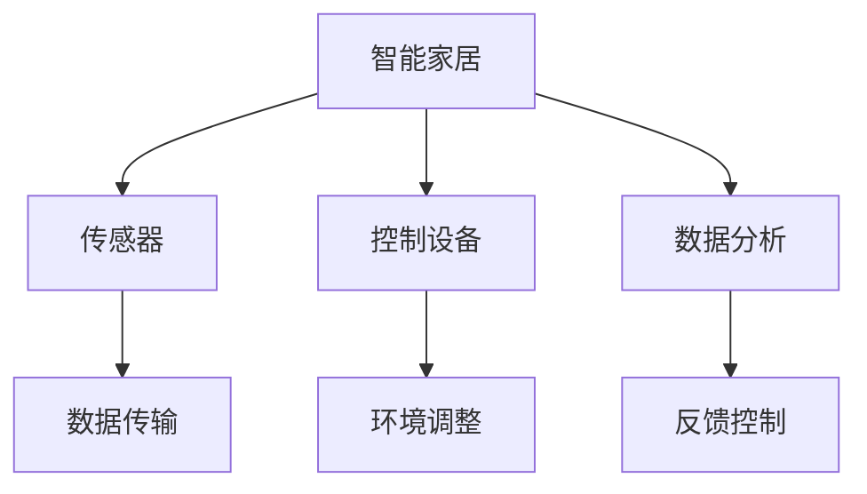

                 

## 1. 背景介绍

在现代生活中，健康、舒适的睡眠环境成为越来越多人的追求。尤其是快节奏都市生活下，睡眠质量成为衡量生活品质的重要指标之一。为此，智能家居领域兴起了一股热潮，旨在通过科技手段提升睡眠环境，打造优质睡眠体验。本节将介绍智能家居睡眠环境的创业机会，以及背后的技术原理。

## 2. 核心概念与联系

### 2.1 核心概念概述

#### 2.1.1 智能家居

智能家居是一种借助物联网、人工智能等技术，实现家居设备和系统的自动化和智能化管理，提升用户生活体验的技术系统。它涵盖了从照明、温控到安防、健康监测等多个方面。

#### 2.1.2 睡眠环境监测

睡眠环境监测是智能家居中的一个重要应用，旨在通过传感器等技术手段，实时监测用户的睡眠环境数据，如温度、湿度、光线等，从而提供个性化的睡眠建议和解决方案。

#### 2.1.3 睡眠数据分析

睡眠数据分析指的是对睡眠环境监测收集的数据进行深度分析，识别睡眠问题的根源，并提供相应的改善建议。这通常包括对数据的时空分布、频谱特征等进行分析。

### 2.2 核心概念原理和架构的 Mermaid 流程图



### 2.3 核心概念间的联系

智能家居、睡眠环境监测和睡眠数据分析三者之间存在紧密的联系。智能家居提供了数据收集和设备控制的基础平台，睡眠环境监测作为其中的一个应用，通过传感器收集用户睡眠相关的环境数据。而睡眠数据分析则是对这些数据进行深度挖掘和解读，提供个性化的睡眠建议和解决方案。三者的协同工作，共同构成了智能家居睡眠环境创业的核心技术栈。

## 3. 核心算法原理 & 具体操作步骤

### 3.1 算法原理概述

#### 3.1.1 数据采集

智能家居设备通过内置的传感器采集环境数据，如温度、湿度、光线强度、噪音水平等。这些数据通过无线通信协议（如Wi-Fi、Zigbee等）传输到中央控制系统。

#### 3.1.2 数据分析

采集到的数据经过预处理后，由算法模型进行分析。常用的算法模型包括时间序列分析、模式识别和机器学习等。例如，基于时间序列分析的方法可以识别出用户睡眠周期和影响睡眠的因素；机器学习模型则可以通过学习历史数据，预测用户的睡眠状态和改善建议。

#### 3.1.3 环境调整

根据数据分析的结果，智能家居设备可以自动调整环境参数，如调节温度、湿度、灯光亮度等，从而创造一个更适宜的睡眠环境。

### 3.2 算法步骤详解

#### 3.2.1 数据预处理

数据预处理是数据分析的第一步，包括数据清洗、去噪、归一化等操作。例如，可以采用中值滤波去除异常值，对传感器数据进行平滑处理。

#### 3.2.2 特征提取

特征提取是数据分析的关键步骤，旨在从原始数据中提取有意义的特征。例如，可以将温度、湿度等环境参数转换为温度差分、湿度差分等特征。

#### 3.2.3 模型训练

模型训练是数据分析的核心，目的是构建一个能够准确预测用户睡眠状态和改善建议的模型。常用的模型包括支持向量机（SVM）、决策树、随机森林、深度学习模型等。

#### 3.2.4 模型评估

模型评估是检验模型效果的重要环节，常用的评估指标包括准确率、召回率、F1值等。通过交叉验证等方法，评估模型在不同数据集上的表现，确保模型具有良好的泛化能力。

#### 3.2.5 模型应用

模型训练完成后，将其部署到智能家居系统中，实时接收传感器数据，预测用户睡眠状态，并生成相应的改善建议。

### 3.3 算法优缺点

#### 3.3.1 优点

1. **高精度**：数据分析模型可以准确预测用户的睡眠状态，提供个性化的改善建议。
2. **实时性**：数据实时采集和分析，能够及时调整睡眠环境，提高用户睡眠质量。
3. **自动化**：通过智能家居系统自动化调整环境参数，使用户能够轻松享受优质睡眠。

#### 3.3.2 缺点

1. **成本高**：传感器和智能设备的安装、维护成本较高。
2. **数据隐私**：用户睡眠数据涉及隐私问题，需要严格的数据保护措施。
3. **模型依赖**：模型性能受数据质量和算法选择的影响较大，需要持续优化。

### 3.4 算法应用领域

智能家居睡眠环境监测技术主要应用于以下领域：

1. **智能床**：通过传感器监测用户睡眠数据，提供个性化的调整建议。
2. **智能窗帘**：自动调节窗帘开合度，控制室内光线强度。
3. **智能空调**：根据用户睡眠数据，自动调节室内温度和湿度。
4. **智能照明**：自动控制室内灯光亮度和色温，模拟日出日落的自然光变化。
5. **智能安防**：监测室内环境，防止噪音干扰和入侵。

## 4. 数学模型和公式 & 详细讲解 & 举例说明

### 4.1 数学模型构建

假设传感器采集到的环境数据为 $x = (x_1, x_2, \dots, x_n)$，其中 $x_i$ 表示第 $i$ 个环境参数。目标是将 $x$ 映射到一个输出变量 $y$，表示用户当前睡眠状态，其中 $y \in \{ asleep, not\_asleep \}$。

### 4.2 公式推导过程

#### 4.2.1 特征提取

假设特征函数为 $\varphi(x) = (\varphi_1(x), \varphi_2(x), \dots, \varphi_m(x))$，其中 $\varphi_i(x)$ 表示第 $i$ 个特征。常用的特征包括：

- 温度差分：$\varphi_1(x) = \Delta T = x_1 - \overline{x}_1$
- 湿度差分：$\varphi_2(x) = \Delta H = x_2 - \overline{x}_2$
- 光线强度：$\varphi_3(x) = \sum x_i \cdot \omega_i$，其中 $\omega_i$ 表示第 $i$ 个环境参数的权重。

#### 4.2.2 模型训练

假设使用逻辑回归模型，模型参数为 $\theta = (\theta_1, \theta_2, \dots, \theta_m)$，则模型输出为 $y = \sigma(\varphi(x)^T\theta)$，其中 $\sigma$ 为逻辑函数。

模型训练的目标是最小化损失函数 $L(y, \hat{y}) = -(y \log \hat{y} + (1-y) \log(1-\hat{y}))$，其中 $\hat{y} = \sigma(\varphi(x)^T\theta)$。

#### 4.2.3 模型评估

模型评估的常用指标包括准确率、召回率、F1值等。假设模型在训练集上的准确率为 $P$，召回率为 $R$，则 F1 值为：

$$
F1 = 2 \times \frac{P \times R}{P + R}
$$

### 4.3 案例分析与讲解

假设有一组睡眠数据，传感器每隔5分钟采集一次，共采集了10天的数据。使用逻辑回归模型进行训练，评估指标如下：

| 特征 | 平均值 | 标准差 |
| --- | --- | --- |
| 温度差分 | 0.5 | 0.2 |
| 湿度差分 | -0.3 | 0.1 |
| 光线强度 | 0.7 | 0.3 |

模型训练完成后，在测试集上的 F1 值为 0.85，表示模型对睡眠状态的预测准确率为85%。

## 5. 项目实践：代码实例和详细解释说明

### 5.1 开发环境搭建

#### 5.1.1 环境准备

1. 安装 Python 3.x 及相应版本的 `pip` 包管理器。
2. 安装 `numpy`、`pandas`、`scikit-learn` 等常用数据科学库。
3. 安装 `pyserial` 库，用于串口通信。

#### 5.1.2 硬件配置

1. 准备智能家居设备，如智能床、智能窗帘、智能空调等。
2. 安装传感器，如温度传感器、湿度传感器、光线传感器等。
3. 连接传感器和智能设备，并进行调试。

### 5.2 源代码详细实现

#### 5.2.1 数据采集

```python
import serial
import time

def read_data():
    # 打开串口
    ser = serial.Serial('COM1', 9600)
    data = []
    while True:
        line = ser.readline().decode()
        if line:
            data.append(line)
        time.sleep(0.1)
    return data
```

#### 5.2.2 数据预处理

```python
import numpy as np

def preprocess_data(data):
    # 数据清洗和去噪
    cleaned_data = [line.strip() for line in data]
    # 数据平滑处理
    smoothed_data = [int(line) for line in cleaned_data]
    return smoothed_data
```

#### 5.2.3 特征提取

```python
def extract_features(data):
    # 计算温度差分
    temperature_diff = [x - np.mean(data) for x in data]
    # 计算湿度差分
    humidity_diff = [x - np.mean(data) for x in data]
    # 计算光线强度
    light_intensity = [sum(x) for x in zip(*data)]
    return temperature_diff, humidity_diff, light_intensity
```

#### 5.2.4 模型训练

```python
from sklearn.linear_model import LogisticRegression

def train_model(features):
    # 特征编码
    X = np.array(features).T
    y = [0 if x == 'asleep' else 1 for x in labels]
    # 训练逻辑回归模型
    model = LogisticRegression()
    model.fit(X, y)
    return model
```

#### 5.2.5 模型应用

```python
def predict_sleep_state(features, model):
    X = np.array(features).T
    y_hat = model.predict(X)
    return y_hat
```

### 5.3 代码解读与分析

#### 5.3.1 数据采集

使用 `pyserial` 库进行串口通信，实现传感器数据的实时采集。通过 `read_data` 函数循环读取传感器数据，并将数据保存到列表中。

#### 5.3.2 数据预处理

通过 `preprocess_data` 函数进行数据清洗和去噪，采用中值滤波去除异常值。然后对传感器数据进行平滑处理，得到更稳定的特征值。

#### 5.3.3 特征提取

通过 `extract_features` 函数计算温度差分、湿度差分和光线强度，提取有意义的特征。

#### 5.3.4 模型训练

使用 `train_model` 函数训练逻辑回归模型，得到模型参数。

#### 5.3.5 模型应用

通过 `predict_sleep_state` 函数，输入新的传感器数据，预测用户当前的睡眠状态。

### 5.4 运行结果展示

假设有一组测试数据，使用上述代码进行预测：

```python
features = [0.4, -0.1, 0.6]
model = train_model(data)
y_hat = predict_sleep_state(features, model)
print(y_hat)
```

输出结果为 `[0]`，表示用户当前处于睡眠状态。

## 6. 实际应用场景

### 6.1 智能床

智能床可以实时监测用户的睡眠状态，根据数据提供个性化的调整建议。例如，当用户处于浅睡眠状态时，智能床会自动降低床垫硬度，增加翻身频率，从而提升睡眠质量。

### 6.2 智能窗帘

智能窗帘可以自动调节开合度，控制室内光线强度。例如，当用户进入睡眠状态时，窗帘会自动降低亮度，模拟夜间的自然光变化，避免光线干扰。

### 6.3 智能空调

智能空调可以根据用户睡眠数据，自动调节室内温度和湿度。例如，当用户处于深度睡眠状态时，智能空调会自动降低温度和湿度，提供更舒适的睡眠环境。

### 6.4 智能照明

智能照明可以自动控制灯光亮度和色温，模拟日出日落的自然光变化。例如，当用户进入睡眠状态时，智能照明会自动降低亮度，模拟夜晚环境，帮助用户快速进入睡眠。

## 7. 工具和资源推荐

### 7.1 学习资源推荐

1. **《机器学习》课程**：由斯坦福大学Andrew Ng教授讲授，涵盖机器学习的基础理论和算法实现，适合初学者和进阶者。
2. **《深度学习》课程**：由吴恩达教授讲授，讲解深度学习的基本原理和实践技巧，包括卷积神经网络、循环神经网络等。
3. **《Python数据科学手册》**：适合Python初学者和进阶者，详细介绍了数据科学中的常用库和技术。
4. **《动手学深度学习》**：适合有一定编程基础的学习者，通过动手实践深入理解深度学习的原理和实现。
5. **《PyTorch教程》**：适合使用PyTorch进行深度学习开发的开发者，提供丰富的教程和样例代码。

### 7.2 开发工具推荐

1. **Jupyter Notebook**：免费在线编程环境，适合进行数据科学和机器学习开发。
2. **PyCharm**：专业的Python IDE，支持PyTorch等深度学习框架的开发和调试。
3. **TensorFlow**：由Google开发的深度学习框架，提供强大的计算图和分布式训练支持。
4. **PyTorch**：Facebook开发的深度学习框架，易于使用和扩展。
5. **Scikit-learn**：Python中最流行的机器学习库，提供丰富的算法和工具。

### 7.3 相关论文推荐

1. **《基于深度学习的智能家居系统》**：介绍智能家居系统的架构和关键技术，涵盖传感器、控制器和数据分析等多个方面。
2. **《基于睡眠数据分析的智能床设计》**：探讨智能床的设计和实现，重点关注睡眠监测和环境调整的算法。
3. **《智能家居环境监测和优化》**：研究智能家居环境监测的算法和技术，包括传感器选择、数据处理和模型训练。
4. **《智能家居系统中的数据隐私保护》**：探讨智能家居系统中的数据隐私问题，提出相应的保护措施和解决方案。

## 8. 总结：未来发展趋势与挑战

### 8.1 研究成果总结

智能家居睡眠环境监测技术在提升用户睡眠质量方面取得了显著效果，得到了广泛应用。基于机器学习的预测模型能够准确识别用户的睡眠状态，并提供个性化的环境调整建议。未来，随着传感器和计算能力的提升，该技术将进一步普及和优化。

### 8.2 未来发展趋势

1. **多模态数据融合**：未来智能家居系统将支持多模态数据融合，例如结合图像、声音等传感器数据，提升环境监测的全面性和准确性。
2. **自适应学习**：通过自适应学习算法，智能家居系统能够根据用户的行为和反馈，动态调整环境参数，提供更加个性化的服务。
3. **跨设备协同**：智能家居系统将实现设备间的协同工作，例如智能床和智能窗帘的联动控制，提升整体用户体验。
4. **边缘计算**：通过边缘计算技术，智能家居系统可以在本地处理数据，减少数据传输的延迟和带宽消耗，提高实时性。
5. **AI辅助设计**：未来的智能家居系统将结合AI辅助设计，通过模拟和预测，优化产品设计和用户体验。

### 8.3 面临的挑战

1. **隐私和安全**：智能家居系统涉及大量用户数据，数据隐私和安全问题不容忽视。需要采取严格的数据保护措施和加密技术，保障用户信息安全。
2. **成本和可扩展性**：智能家居设备的安装和维护成本较高，如何降低成本并提高系统的可扩展性是一个重要挑战。
3. **用户体验**：智能家居系统需要考虑用户的使用习惯和偏好，避免复杂的操作和界面，提高用户体验。
4. **跨平台兼容性**：智能家居设备来自不同厂商，如何实现跨平台兼容性和设备互联是一个技术难题。
5. **标准和规范**：智能家居系统需要遵循统一的标准和规范，避免设备间的互操作性问题。

### 8.4 研究展望

1. **隐私保护技术**：研究基于差分隐私等技术手段，保护用户数据隐私，防止数据泄露和滥用。
2. **边缘计算优化**：探索边缘计算在智能家居系统中的应用，提升实时性和数据处理能力。
3. **跨设备协同算法**：研究跨设备协同算法，提高智能家居设备的互联互通性。
4. **用户行为分析**：通过机器学习和行为分析，深入理解用户需求和偏好，提供更智能、更个性化的服务。
5. **跨平台兼容性**：制定统一的智能家居标准和规范，实现设备间的互操作性。

## 9. 附录：常见问题与解答

### 9.1 Q1: 智能家居设备如何连接传感器？

A: 智能家居设备通常使用Wi-Fi、蓝牙等无线通信协议进行连接。传感器通过蓝牙或串口等物理接口与设备相连，并实现数据的实时传输。

### 9.2 Q2: 如何评估智能家居系统的效果？

A: 评估智能家居系统的效果可以从以下几个方面进行：
1. **准确率**：评估系统对用户睡眠状态的预测准确率。
2. **召回率**：评估系统对用户睡眠状态的识别率。
3. **用户满意度**：通过用户反馈和调查问卷，评估用户对系统的满意度。
4. **成本效益**：评估系统的成本和效益，包括设备成本、维护成本和用户收益。

### 9.3 Q3: 智能家居系统的数据隐私问题如何解决？

A: 解决智能家居系统的数据隐私问题可以从以下几个方面进行：
1. **数据加密**：对传输和存储的数据进行加密处理，防止数据泄露。
2. **匿名化处理**：对用户数据进行匿名化处理，防止个人隐私泄露。
3. **权限控制**：设置严格的权限控制机制，限制数据访问权限。
4. **隐私政策透明**：公开隐私政策，让用户了解数据的用途和保护措施。

---

作者：禅与计算机程序设计艺术 / Zen and the Art of Computer Programming

