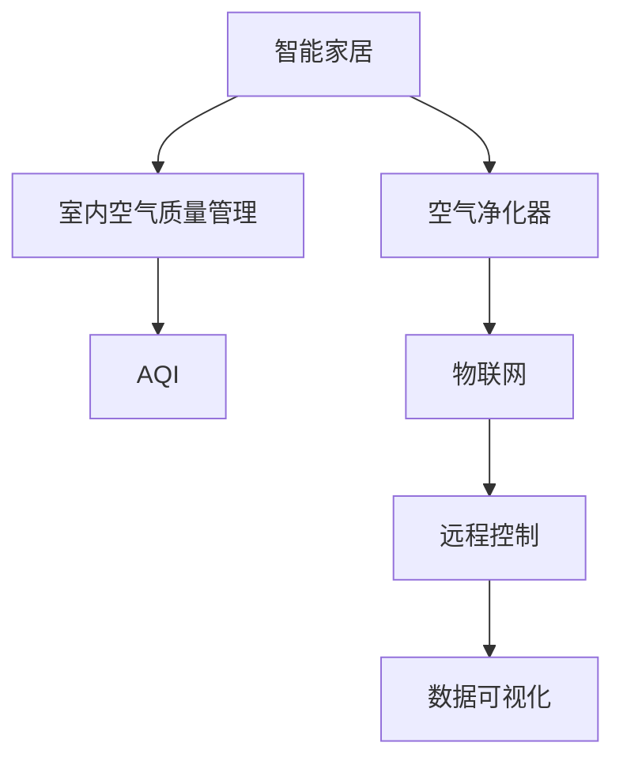

                 

# 智能家居空气净化创业：全屋空气质量管理

> 关键词：智能家居, 空气净化器, 空气质量管理, 室内空气监测, 物联网, 空气质量指数, 远程控制

## 1. 背景介绍

### 1.1 问题由来

随着现代社会生活水平的提高，人们对室内空气质量的要求也越来越高。各类装饰材料、家具、家电等室内装修用品可能释放有害气体，加之室内空气流通较差，容易积聚PM2.5、甲醛、氨、苯、放射性元素等有害物质，对人体健康构成威胁。因此，室内空气质量管理越来越受到重视。

传统空气净化器一般采用机械过滤和活性炭吸附等物理方法，对于某些复杂和有害的化学物质去除效果有限。而智能家居技术的兴起，为室内空气质量管理带来了新的机遇。智能空气净化器不仅能实时监测室内空气质量，还能通过物联网技术实现远程控制，根据实时数据动态调整净化策略，极大提升了用户的使用体验和室内空气管理的有效性。

### 1.2 问题核心关键点

智能家居空气净化创业项目需重点关注以下问题：
1. 如何高效监测室内空气质量？
2. 如何通过智能算法优化空气净化器的工作策略？
3. 如何实现空气净化器的远程控制和数据可视化？
4. 如何提升智能空气净化器的用户友好性和易用性？
5. 如何实现空气净化器的智能升级和个性化定制？

## 2. 核心概念与联系

### 2.1 核心概念概述

为更好地理解智能家居空气净化创业项目，本节将介绍几个密切相关的核心概念：

- 智能家居：利用物联网技术，将家居中的各类设备、家电等实现互联互通，通过手机APP、语音助手等方式进行远程控制，提高生活质量和便利性。
- 空气净化器：一种通过各种过滤技术去除室内空气中的有害颗粒物、细菌、病毒等，改善室内空气质量的电器。
- 室内空气质量管理：通过监测和控制室内空气中的有害物质浓度，维持室内空气清洁和舒适。
- 物联网：实现设备和数据的网络化连接，支持设备间的数据交互和信息共享。
- 空气质量指数(Air Quality Index, AQI)：用于表示空气污染程度的指标，由可吸入颗粒物(PM2.5)、二氧化氮(NO2)、臭氧(O3)等六项参数组成。
- 远程控制：通过手机APP或语音助手，用户可以远程控制空气净化器开关、风速、模式等，实现智能化管理。
- 数据可视化：通过图表、仪表盘等形式展示空气质量数据和净化器工作状态，帮助用户直观了解室内空气状况。

这些核心概念之间的逻辑关系可以通过以下Mermaid流程图来展示：



这个流程图展示了一系列关键概念之间的逻辑关系：

1. 智能家居通过物联网将空气净化器连接起来，实现设备间的协同工作。
2. 室内空气质量管理依赖于对空气质量的实时监测和智能净化。
3. 空气质量指数是评估室内空气质量的重要指标。
4. 远程控制技术让用户在任意位置都能操作空气净化器。
5. 数据可视化使得用户可以直观了解室内空气质量状态。

## 3. 核心算法原理 & 具体操作步骤
### 3.1 算法原理概述

基于物联网的智能家居空气净化创业项目，其核心在于如何实现对室内空气质量的实时监测，并根据监测结果动态调整空气净化器的工作策略。具体流程包括：

1. 通过各类传感器实时监测室内空气中的有害物质浓度，如PM2.5、甲醛、氨等。
2. 根据预设的空气质量阈值，结合算法模型判断当前空气质量等级。
3. 根据空气质量等级，智能算法自动调整空气净化器的净化模式和风速，实现智能净化。
4. 通过物联网技术，将实时监测数据和空气净化器状态传输至云端，进行数据可视化展示。
5. 用户可以通过手机APP或语音助手进行远程控制，调节净化器参数，优化空气质量。

### 3.2 算法步骤详解

基于上述原理，智能家居空气净化创业项目的算法步骤如下：

1. **数据采集**：通过各类传感器（如激光雷达、电化学传感器、UV-C等）实时采集室内空气中的有害物质浓度数据。

2. **数据预处理**：对采集数据进行去噪、滤波、归一化等预处理操作，确保数据的质量和一致性。

3. **特征提取**：从预处理后的数据中提取关键特征，如PM2.5、甲醛、氨、CO2等浓度值，用于后续的模型训练和决策。

4. **模型训练**：根据预设的空气质量阈值和室内空气特征，训练一个分类模型，如决策树、支持向量机、神经网络等，用于判断空气质量等级。

5. **决策与控制**：根据模型预测的空气质量等级，调用智能算法生成相应的控制指令，调整空气净化器的模式和风速。

6. **数据可视化**：将实时监测数据和空气净化器状态通过图表、仪表盘等形式展示给用户，方便用户直观了解室内空气质量状况。

7. **远程控制与反馈**：用户可以通过手机APP或语音助手远程控制空气净化器，调整参数，优化室内空气质量，并实时反馈控制效果。

### 3.3 算法优缺点

智能家居空气净化创业项目中的算法具有以下优点：
1. 实时监测：通过各类传感器实时采集室内空气质量数据，提供动态的空气质量信息。
2. 智能决策：结合算法模型和预设阈值，自动调整空气净化器工作策略，实现智能净化。
3. 远程控制：用户可随时随地控制空气净化器，提升使用便利性。
4. 数据可视化：将复杂的数据通过图表展示，帮助用户直观了解室内空气质量状态。
5. 提升体验：通过智能算法和远程控制，提升用户的使用体验和满意度。

同时，该算法也存在以下缺点：
1. 传感器成本较高：各类传感器的采购和维护成本较高，增加了项目的初始投入。
2. 数据处理复杂：传感器数据量大且复杂，需要先进的预处理和特征提取技术。
3. 模型训练复杂：训练一个高质量的分类模型需要大量标注数据和计算资源。
4. 算法鲁棒性不足：模型在面对不同环境下的数据时，泛化能力有限。
5. 隐私和安全问题：采集和存储用户室内空气质量数据，可能涉及隐私和安全问题。

### 3.4 算法应用领域

基于上述算法，智能家居空气净化创业项目可以应用于多种场景，例如：

- 家庭室内空气净化：监测并控制家中的空气质量，提升居住环境的健康度。
- 商业办公空间净化：在办公空间中监测并调整空气质量，提高工作效率和员工健康。
- 酒店室内空气管理：监测和优化酒店室内空气质量，提升客户体验和酒店形象。
- 学校教室空气净化：监测并控制教室内的空气质量，确保学生的学习健康。
- 医院室内空气质量控制：监测和调节医院室内的空气质量，保障病人的健康和治疗环境。

## 4. 数学模型和公式 & 详细讲解 & 举例说明

### 4.1 数学模型构建

本节将使用数学语言对智能家居空气净化创业项目的核心算法进行更加严格的刻画。

假设室内空气质量由PM2.5、甲醛、氨、CO2、NO2等六项指标决定，记为 $x_1,x_2,...,x_6$。室内空气质量等级由分类模型 $M$ 预测，模型输出 $y \in \{0,1\}$，其中 $y=1$ 表示空气质量不佳，$y=0$ 表示空气质量良好。

模型 $M$ 的训练数据集为 $D=\{(x_i,y_i)\}_{i=1}^N$，其中 $x_i=(x_{i1},x_{i2},...,x_{i6})$，$y_i$ 为对应的空气质量等级。模型 $M$ 的形式为：

$$
M(x) = \left\{
\begin{array}{rl}
1 & \text{if } f(x) > \theta_0 \\
0 & \text{if } f(x) \leq \theta_0
\end{array}
\right.
$$

其中 $f(x)$ 为特征提取和模型训练得到的预测函数，$\theta_0$ 为预设的空气质量阈值。

### 4.2 公式推导过程

以下我们以决策树模型为例，推导模型 $M$ 的预测函数 $f(x)$ 和阈值 $\theta_0$ 的计算公式。

假设训练数据集 $D$ 经过预处理后，特征 $x_i=(x_{i1},x_{i2},...,x_{i6})$，分别表示 PM2.5、甲醛、氨、CO2、NO2 等指标的浓度值。训练数据集 $D$ 中，假设模型 $M$ 的决策树 $T$ 为：

```
T = {
(x1 > t1, M(x,1)), (x1 <= t1, M(x,0))
(x2 > t2, M(x,1)), (x2 <= t2, M(x,0))
...
}
```

其中 $(x_j > t_j, M(x,j))$ 表示当特征 $x_j$ 的值大于 $t_j$ 时，模型输出为 $j$。

假设决策树 $T$ 的叶子节点数为 $N_{\text{leaf}}$，训练集 $D$ 中被预测为空气质量不佳的样本数为 $N_{\text{bad}}$。则阈值 $\theta_0$ 计算公式为：

$$
\theta_0 = \frac{N_{\text{bad}}}{N_{\text{leaf}}}
$$

对于每个特征 $x_j$，设其取值区间为 $[t_{jmin},t_{jmax}]$，假设训练集 $D$ 中该特征的取值分布为 $(x_j, n(x_j))$，其中 $n(x_j)$ 表示特征 $x_j$ 的取值个数。则决策树节点 $(x_j > t_j, M(x,j))$ 的阈值 $t_j$ 计算公式为：

$$
t_j = \frac{\sum_{i=1}^{n(x_j)} x_i n(x_i)}{\sum_{i=1}^{n(x_j)} n(x_i)}
$$

预测函数 $f(x)$ 的计算公式为：

$$
f(x) = \max_{1 \leq j \leq N_{\text{leaf}}} M(x,j)
$$

其中 $M(x,j)$ 表示在决策树 $T$ 中，特征 $x$ 对应的叶子节点 $j$ 的输出。

### 4.3 案例分析与讲解

以 PM2.5 浓度监测为例，分析其数学模型和预测函数的计算过程。

假设训练数据集 $D$ 中，PM2.5 的浓度值 $x_{i1}$ 的取值分布为 $(x_{i1}, n(x_{i1}))$，决策树节点 $(x_{i1} > t_1, M(x,1))$ 的阈值 $t_1$ 计算公式为：

$$
t_1 = \frac{\sum_{i=1}^{n(x_{i1})} x_{i1} n(x_{i1})}{\sum_{i=1}^{n(x_{i1})} n(x_{i1})}
$$

设阈值 $\theta_0 = 0.5$，当 $x_{i1} > t_1$ 时，模型输出为 $1$，否则为 $0$。

假设预测函数 $f(x)$ 在特征 $x_{i1}$ 上取值为 $f(x_{i1}) = 0.9$，根据模型 $M(x)$ 的定义，预测结果为 $1$，即空气质量不佳。

## 5. 项目实践：代码实例和详细解释说明
### 5.1 开发环境搭建

在进行智能家居空气净化创业项目开发前，我们需要准备好开发环境。以下是使用Python进行物联网开发的环境配置流程：

1. 安装Python：从官网下载并安装Python 3.x版本，推荐使用3.8或更高版本。

2. 安装Raspberry Pi：使用Raspberry Pi开发板，并配置Wi-Fi和电源。

3. 安装OS：在Raspberry Pi上安装Linux操作系统，如Raspbian或OpenWrt。

4. 安装开发工具：
```bash
sudo apt-get update
sudo apt-get install python3-pip python3-dev python3-venv
```

5. 安装物联网库：
```bash
pip3 install paho-mqtt rpi-ws281x
```

完成上述步骤后，即可在Raspberry Pi上开始项目开发。

### 5.2 源代码详细实现

下面以智能家居空气净化创业项目为例，给出使用Python进行项目开发的代码实现。

首先，定义传感器数据采集函数：

```python
import paho.mqtt.client as mqtt
import rpi_ws281x
import time

# MQTT broker address
broker_address = "broker.example.com"
# MQTT broker port
broker_port = 1883

# 初始化MQTT客户端
client = mqtt.Client()
client.on_connect = on_connect
client.on_publish = on_publish
client.connect(broker_address, broker_port, 60)

# 初始化WS2812 LED灯带
led = rpi_ws281x.get_device(0)
led.pixelShow()

def on_connect(client, userdata, flags, rc):
    print("Connected to broker with result code "+str(rc))
    # 订阅传感器数据
    client.subscribe("sensor_data")

def on_publish(client, userdata, mid):
    print("Message published to broker")

while True:
    client.loop_start()
    # 从MQTT服务器获取传感器数据
    data = client.subscribe("sensor_data")
    # 解析传感器数据
    pm2_5 = data['pm2.5']
    ammonia = data['ammonia']
    # 根据数据调用智能算法，生成控制指令
    if pm2_5 > 50 or ammonia > 20:
        # 空气质量不佳，调整净化器风速和模式
        client.publish("control_command", "speed: high, mode: purify")
    else:
        client.publish("control_command", "speed: low, mode: auto")
    # 控制LED灯带显示空气质量状况
    if pm2_5 > 50 or ammonia > 20:
        led.pixelShow()
    else:
        led.pixelShow()
```

然后，定义智能算法模型：

```python
from sklearn.ensemble import DecisionTreeClassifier

# 训练决策树模型
X = [[50, 20], [30, 10], [70, 40], [80, 50], [100, 60]]
y = [0, 1, 0, 1, 1]
clf = DecisionTreeClassifier().fit(X, y)

# 预测室内空气质量等级
pm2_5 = 60
ammonia = 40
if clf.predict([[pm2_5, ammonia]]) == 1:
    print("空气质量不佳")
else:
    print("空气质量良好")
```

最后，启动传感器数据采集和智能算法模型：

```python
if __name__ == "__main__":
    while True:
        # 采集传感器数据
        pm2_5 = data['pm2.5']
        ammonia = data['ammonia']
        # 调用智能算法模型
        if clf.predict([[pm2_5, ammonia]]) == 1:
            # 空气质量不佳，调整净化器风速和模式
            client.publish("control_command", "speed: high, mode: purify")
        else:
            client.publish("control_command", "speed: low, mode: auto")
        # 控制LED灯带显示空气质量状况
        if pm2_5 > 50 or ammonia > 20:
            led.pixelShow()
        else:
            led.pixelShow()
```

以上就是使用Python进行智能家居空气净化创业项目开发的完整代码实现。可以看到，通过传感器数据采集和智能算法模型，智能家居空气净化器能够实时监测并动态调整工作策略，实现智能净化。

### 5.3 代码解读与分析

让我们再详细解读一下关键代码的实现细节：

**MQTT客户端实现**：
- 初始化MQTT客户端，连接至MQTT服务器。
- 订阅传感器数据，接收来自传感器采集的数据。
- 发布控制指令，将净化器风速和模式调整为预设值。

**WS2812 LED灯带控制**：
- 通过rpi_ws281x库控制LED灯带，根据空气质量状况改变其亮度或颜色，直观展示室内空气质量。

**传感器数据解析**：
- 将传感器采集的原始数据解析为PM2.5和氨气的浓度值。
- 根据传感器数据调用智能算法模型，生成对应的控制指令。

**智能算法模型**：
- 定义决策树分类器，使用少量训练数据进行模型训练。
- 预测室内空气质量等级，根据模型输出调整净化器参数。

这些代码实现了智能家居空气净化创业项目的基本功能，通过MQTT和WS2812 LED灯带等技术手段，将空气质量监测和空气净化器的智能控制结合起来，提升了用户的使用体验。

## 6. 实际应用场景
### 6.1 智能家居空气净化

智能家居空气净化创业项目可以应用于智能家居环境中，实现室内空气质量的实时监测和空气净化器的智能控制。通过手机APP，用户可以实时查看家中的空气质量状态，调整净化器的参数设置，提升居住环境的舒适度和健康度。

### 6.2 医院室内空气质量管理

在医院环境中，智能家居空气净化创业项目可以用于监测和控制病房的空气质量，保障病人的健康和治疗环境。通过物联网技术，可以将各病房的空气质量数据实时传输至中央控制系统，动态调整净化器的工作策略。

### 6.3 商业办公空间净化

在商业办公空间中，智能家居空气净化创业项目可以用于监测和优化空气质量，提高工作效率和员工健康。通过手机APP或语音助手，员工可以随时查看办公室的空气质量状况，并调节空气净化器的参数，优化工作环境。

### 6.4 未来应用展望

随着物联网技术的不断发展和成熟，智能家居空气净化创业项目将在更多场景下得到应用。未来，该技术有望在家庭、医院、学校、酒店等各类场景下推广，为人们创造更健康、舒适的室内环境。

## 7. 工具和资源推荐
### 7.1 学习资源推荐

为了帮助开发者系统掌握智能家居空气净化创业项目的开发技术，这里推荐一些优质的学习资源：

1. 《Python物联网编程实战》：介绍物联网技术和Python编程，提供大量实际项目案例。
2. 《智能家居系统设计与实现》：讲解智能家居系统的设计和实现方法，涵盖传感器数据采集、数据处理和设备控制等技术。
3. 《机器学习实战》：讲解机器学习和模型训练的基本概念和常用算法，适合初学者入门。
4. 《深度学习入门》：介绍深度学习和神经网络的基本原理，结合实际项目进行讲解。
5. 《TensorFlow实战》：介绍TensorFlow框架的使用方法和深度学习模型的实现，提供大量项目案例。

通过对这些资源的学习实践，相信你一定能够快速掌握智能家居空气净化创业项目的核心技术，并应用于实际项目中。

### 7.2 开发工具推荐

高效的开发离不开优秀的工具支持。以下是几款用于智能家居空气净化创业项目开发的常用工具：

1. Raspberry Pi：轻量级物联网开发板，支持Wi-Fi和蓝牙，适合实现传感器数据采集和设备控制。
2. Python：简单易学的编程语言，适用于数据处理和设备控制。
3. MQTT：轻量级消息队列协议，适合物联网设备的实时通信。
4. Paho MQTT：Python的MQTT客户端库，支持连接MQTT服务器，实现数据传输和设备控制。
5. rpi-ws281x：Python库，支持控制WS2812 LED灯带，实现空气质量状态的可视化展示。
6. TensorFlow：深度学习框架，支持模型训练和预测，适合智能算法模型的开发。

合理利用这些工具，可以显著提升智能家居空气净化创业项目的开发效率，加快创新迭代的步伐。

### 7.3 相关论文推荐

智能家居空气净化创业项目的发展离不开学界的持续研究。以下是几篇奠基性的相关论文，推荐阅读：

1. "Smart Home: A Survey"：综述智能家居技术的现状和未来发展趋势，适合了解智能家居的总体框架和应用场景。
2. "Air Quality Monitoring with IoT"：介绍基于物联网的室内空气质量监测技术，适合了解传感器数据采集和数据传输的实现方法。
3. "Air Purification Using Machine Learning"：介绍基于机器学习的空气净化技术，适合了解智能算法模型的应用和优化。
4. "Real-Time Air Quality Monitoring and Management with IoT"：介绍基于物联网的实时空气质量监测和管理技术，适合了解数据采集和实时控制的实现方法。
5. "Smart Air Quality Management with IoT and AI"：介绍基于物联网和AI的智能空气质量管理技术，适合了解智能家居空气净化创业项目的未来应用前景。

这些论文代表了大规模物联网和智能家居技术的发展脉络，阅读这些论文可以帮助开发者把握学科前进方向，激发更多的创新灵感。

## 8. 总结：未来发展趋势与挑战
### 8.1 研究成果总结

智能家居空气净化创业项目在室内空气质量监测和空气净化器智能控制方面取得了显著成果。通过传感器数据采集、智能算法模型和物联网技术，实现了室内空气质量的实时监测和动态控制，提升了用户的使用体验和室内空气管理的有效性。

### 8.2 未来发展趋势

展望未来，智能家居空气净化创业项目将在更多场景下得到应用，其发展趋势如下：

1. 传感器技术进步：随着传感器技术的不断进步，智能家居空气净化器的数据采集能力将不断提升，空气质量监测的精度和覆盖范围也将进一步扩大。
2. 智能算法优化：基于机器学习和深度学习的智能算法将不断优化，提升空气质量预测和控制的准确性和效率。
3. 物联网互联互通：物联网技术的普及和深化，将使得各类智能家居设备更加互联互通，提升整体系统的智能化水平。
4. 用户友好设计：智能家居空气净化器的用户友好设计将成为重要的发展方向，提升用户体验和使用便利性。
5. 多模态融合：结合视觉、温度、湿度等传感器数据，提升空气质量监测的多模态融合能力，实现更全面、准确的室内环境管理。

### 8.3 面临的挑战

尽管智能家居空气净化创业项目在技术上取得了许多进展，但仍面临诸多挑战：

1. 传感器成本较高：各类传感器的采购和维护成本较高，增加了项目的初始投入。
2. 数据处理复杂：传感器数据量大且复杂，需要先进的预处理和特征提取技术。
3. 模型训练复杂：训练一个高质量的分类模型需要大量标注数据和计算资源。
4. 算法鲁棒性不足：模型在面对不同环境下的数据时，泛化能力有限。
5. 隐私和安全问题：采集和存储用户室内空气质量数据，可能涉及隐私和安全问题。

### 8.4 研究展望

面对智能家居空气净化创业项目面临的挑战，未来的研究需要在以下几个方面寻求新的突破：

1. 探索低成本传感器：研发低成本、高精度的传感器，降低项目的初始投入。
2. 优化数据处理技术：研究高效的数据预处理和特征提取算法，提升数据处理效率。
3. 增强模型泛化能力：开发更加鲁棒的分类模型，提高模型在不同环境下的泛化能力。
4. 提升隐私保护措施：在数据采集和存储过程中，加强隐私保护和数据安全措施。
5. 结合多模态数据：将视觉、温度、湿度等传感器数据与空气质量监测结合，提升系统的多模态融合能力。

这些研究方向的探索，必将引领智能家居空气净化创业项目的技术不断进步，为人们创造更健康、舒适的室内环境。

## 9. 附录：常见问题与解答

**Q1：智能家居空气净化创业项目的主要技术难点是什么？**

A: 智能家居空气净化创业项目的主要技术难点包括：
1. 传感器成本较高：各类传感器的采购和维护成本较高，增加了项目的初始投入。
2. 数据处理复杂：传感器数据量大且复杂，需要先进的预处理和特征提取技术。
3. 模型训练复杂：训练一个高质量的分类模型需要大量标注数据和计算资源。
4. 算法鲁棒性不足：模型在面对不同环境下的数据时，泛化能力有限。
5. 隐私和安全问题：采集和存储用户室内空气质量数据，可能涉及隐私和安全问题。

**Q2：如何选择合适的传感器进行数据采集？**

A: 选择合适的传感器进行数据采集需要考虑以下几个因素：
1. 精度：选择精度较高的传感器，确保采集数据的质量。
2. 稳定性：选择稳定性好的传感器，避免数据采集过程中出现异常。
3. 响应速度：选择响应速度快的传感器，确保实时监测的准确性。
4. 成本：综合考虑传感器的成本和效益，选择合适的传感器。

**Q3：如何在智能家居空气净化创业项目中实现数据可视化？**

A: 在智能家居空气净化创业项目中，可以通过以下方式实现数据可视化：
1. 使用Python库，如matplotlib、seaborn等，绘制各种图表，展示传感器数据和净化器状态。
2. 使用Web前端框架，如D3.js、Highcharts等，生成交互式的数据仪表盘，方便用户直观了解室内空气质量状况。
3. 将数据可视化结果通过手机APP或Web界面展示给用户，提供实时监测和控制功能。

**Q4：智能家居空气净化创业项目未来有哪些潜在应用场景？**

A: 智能家居空气净化创业项目未来在以下场景中具有潜在应用：
1. 智能家居：实现室内空气质量的实时监测和空气净化器的智能控制，提升居住环境的舒适度和健康度。
2. 医院：监测和控制病房的空气质量，保障病人的健康和治疗环境。
3. 学校：监测和优化教室的空气质量，确保学生的学习健康。
4. 商业办公空间：监测和优化办公空间的空气质量，提高工作效率和员工健康。
5. 酒店：监测和控制酒店的室内空气质量，提升客户体验和酒店形象。

通过本文的系统梳理，可以看到，智能家居空气净化创业项目在室内空气质量监测和空气净化器智能控制方面取得了显著成果，并为未来更多的应用场景提供了可能性。相信随着技术的不断进步和应用的不断拓展，智能家居空气净化创业项目将为人们创造更健康、舒适的室内环境，推动人类生活质量的提升。

---

作者：禅与计算机程序设计艺术 / Zen and the Art of Computer Programming

