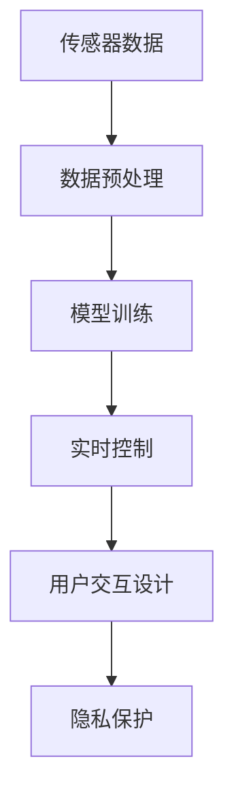

                 

# 智能家居项目：构建智能恒温器

> 关键词：智能恒温器,物联网(IoT),机器学习,传感器数据,模型训练,实时控制,用户交互设计,隐私保护

## 1. 背景介绍

### 1.1 问题由来
随着科技的迅猛发展，智能家居系统已经成为现代家庭生活中不可或缺的一部分。然而，传统的家庭环境控制系统往往需要用户手动调节，不仅效率低下，还无法实时响应用户需求，用户体验有待提升。为了解决这一问题，我们需要构建一个能够根据室内外环境变化自动调整温度的智能恒温器。通过将机器学习和传感器数据的融合，可以实现恒温器的智能化，从而为用户提供更加舒适便捷的居住环境。

### 1.2 问题核心关键点
智能恒温器的核心在于如何结合物联网(IoT)技术，利用机器学习算法对传感器数据进行分析和预测，从而自动调节室内温度。具体关键点包括：

- 传感器数据采集：实现室内外环境温度、湿度、光照、门窗开闭状态等数据的实时采集。
- 数据预处理：对采集到的传感器数据进行清洗、归一化处理，确保数据质量和一致性。
- 模型训练：构建机器学习模型，根据传感器数据预测室内温度需求，并给出相应的调节策略。
- 实时控制：根据模型预测结果，自动控制恒温器的加热和制冷设备。
- 用户交互设计：设计用户友好的界面和交互方式，方便用户自定义温度设定和查看设备状态。
- 隐私保护：确保用户隐私数据的安全，避免敏感信息泄露。

### 1.3 问题研究意义
智能恒温器项目的实施，对于提升家庭生活质量、节能减排和提高用户满意度具有重要意义：

1. **提高舒适度**：通过智能恒温器实时监测环境变化，自动调节室内温度，用户无需手动调整，提升居住舒适度。
2. **节能减排**：机器学习算法可以优化温度调节策略，避免不必要的能源浪费，实现节能减排目标。
3. **提升用户体验**：良好的用户交互设计，使得恒温器的操作简便直观，提升了用户的整体使用体验。
4. **数据隐私保护**：通过数据加密、访问控制等措施，确保用户隐私数据的安全，增强用户对系统的信任度。

## 2. 核心概念与联系

### 2.1 核心概念概述

为更好地理解智能恒温器的构建过程，本节将介绍几个密切相关的核心概念：

- **物联网(IoT)**：通过互联网将各种物品或设备连接起来，实现数据的实时传输和控制。
- **机器学习**：一种使机器能够从数据中学习和改进的技术，广泛应用于图像识别、语音识别、自然语言处理等领域。
- **传感器数据**：通过各类传感器实时采集到的环境数据，如温度、湿度、光照、门窗状态等。
- **模型训练**：通过历史数据训练机器学习模型，使其能够预测未来环境变化和用户需求。
- **实时控制**：根据模型预测结果，实时调整恒温器的工作状态。
- **用户交互设计**：设计简洁直观的用户界面和交互方式，提升用户体验。
- **隐私保护**：采取技术和管理措施，确保用户数据的隐私和安全。

这些核心概念之间的逻辑关系可以通过以下Mermaid流程图来展示：



这个流程图展示了智能恒温器系统的基本流程：

1. 通过传感器采集环境数据。
2. 对采集到的数据进行清洗和处理，确保其质量和一致性。
3. 利用历史数据训练机器学习模型，预测室内温度需求。
4. 根据模型预测结果，自动调整恒温器的工作状态。
5. 设计简洁直观的用户界面，提升用户体验。
6. 采取隐私保护措施，确保数据安全。

## 3. 核心算法原理 & 具体操作步骤
### 3.1 算法原理概述

智能恒温器的核心算法原理主要基于机器学习算法，通过历史传感器数据训练模型，预测未来环境变化和用户需求，从而自动调节恒温器的工作状态。

具体而言，假设我们收集了N个室内外环境数据样本，每个样本包含传感器读数和对应的理想温度设置。我们将这些数据作为训练集，构建一个线性回归模型：

$$
y = \theta_0 + \theta_1x_1 + \theta_2x_2 + ... + \theta_nx_n + \epsilon
$$

其中，$y$ 为理想温度，$x_1, x_2, ..., x_n$ 为传感器读数，$\theta_0, \theta_1, \theta_2, ..., \theta_n$ 为模型参数，$\epsilon$ 为误差项。

通过最小二乘法等方法，我们可以训练出最优模型参数 $\theta$，从而预测未来传感器数据对应的理想温度，并据此调整恒温器。

### 3.2 算法步骤详解

智能恒温器的构建涉及多个关键步骤，具体如下：

**Step 1: 传感器部署和数据采集**

在用户家中部署各类传感器，如温度传感器、湿度传感器、光照传感器、门窗状态传感器等。实时采集环境数据，通过物联网协议（如MQTT、HTTP等）传输到云端服务器。

**Step 2: 数据预处理**

对采集到的传感器数据进行预处理，包括数据清洗、归一化、去噪等操作。例如，对温度数据进行滤波，去除异常值；对湿度数据进行归一化处理，使其在0-1之间；对光照数据进行平滑处理，去除波动噪声。

**Step 3: 模型训练**

构建线性回归模型，使用历史数据训练模型参数。例如，使用梯度下降算法最小化损失函数，得到最优参数。训练过程中，采用交叉验证等方法进行模型评估和调优。

**Step 4: 实时控制**

根据模型预测结果，实时调整恒温器的工作状态。例如，当模型预测温度过高时，打开空调制冷；当模型预测温度过低时，打开暖气加热。

**Step 5: 用户交互设计**

设计简洁直观的用户界面，供用户查看温度设置、设备状态和历史数据。通过语音助手、手机APP等方式，实现用户自定义温度设定和设备控制。

**Step 6: 隐私保护**

采取数据加密、访问控制等措施，确保用户隐私数据的安全。例如，对用户温度设定等敏感信息进行加密存储，仅授权用户访问。

### 3.3 算法优缺点

智能恒温器的构建方法具有以下优点：

- **实时响应**：利用机器学习算法，恒温器能够实时响应环境变化，自动调节室内温度，提高用户舒适度。
- **节能减排**：优化温度调节策略，避免不必要的能源浪费，实现节能减排目标。
- **用户友好**：简洁直观的用户界面，使得恒温器的操作简便直观，提升了用户体验。
- **隐私保护**：通过数据加密、访问控制等措施，确保用户数据的隐私和安全。

同时，该方法也存在一定的局限性：

- **模型依赖数据质量**：模型性能取决于传感器数据的质量和数量，数据质量不佳时，模型预测可能不准确。
- **算法复杂性**：机器学习算法需要大量的计算资源和时间，对设备和网络要求较高。
- **用户习惯差异**：用户对温度的偏好不同，模型需要不断学习并适应用户的个性化需求。
- **初始化问题**：模型需要初始化参数，初始参数的选择对模型性能有较大影响。

尽管存在这些局限性，但就目前而言，基于机器学习的智能恒温器方法仍是最主流范式。未来相关研究的重点在于如何进一步降低对数据质量的依赖，提高模型的鲁棒性和适应性，同时兼顾用户隐私和节能减排目标。

### 3.4 算法应用领域

智能恒温器技术可以广泛应用于各种智能家居系统，例如：

- **智能窗帘系统**：根据环境光照数据，自动调节窗帘开闭状态，实现自然采光与节能的平衡。
- **智能照明系统**：根据环境光照和用户偏好，自动调整灯光亮度和颜色，提升用户体验。
- **智能家电系统**：根据环境温度和用户习惯，自动控制空调、风扇等家电设备，实现智能家居一体化管理。
- **智能门锁系统**：根据环境温度和用户活动数据，自动调节室内温度和安防系统，提供全方位的安全保障。

除了上述这些经典应用外，智能恒温器技术还被创新性地应用于更多场景中，如智慧农业、智慧医疗、智能办公等，为智能家居技术带来了新的突破。

## 4. 数学模型和公式 & 详细讲解 & 举例说明
### 4.1 数学模型构建

本节将使用数学语言对智能恒温器的构建过程进行更加严格的刻画。

假设我们收集了N个室内外环境数据样本，每个样本包含传感器读数和对应的理想温度设置。我们将这些数据作为训练集，构建一个线性回归模型：

$$
y = \theta_0 + \theta_1x_1 + \theta_2x_2 + ... + \theta_nx_n + \epsilon
$$

其中，$y$ 为理想温度，$x_1, x_2, ..., x_n$ 为传感器读数，$\theta_0, \theta_1, \theta_2, ..., \theta_n$ 为模型参数，$\epsilon$ 为误差项。

### 4.2 公式推导过程

以下我们以线性回归模型为例，推导模型的参数更新公式。

假设我们有一组训练数据集 $\{(x_i, y_i)\}_{i=1}^N$，其中 $x_i$ 为传感器读数，$y_i$ 为理想温度。我们的目标是寻找一组最优参数 $\theta$，使得模型能够最小化预测误差：

$$
\min_{\theta} \frac{1}{N} \sum_{i=1}^N (y_i - (\theta_0 + \theta_1x_{1,i} + \theta_2x_{2,i} + ... + \theta_nx_{n,i}))^2
$$

为了求解上述最优化问题，我们采用梯度下降算法，计算每个参数的梯度：

$$
\frac{\partial}{\partial \theta_j} \frac{1}{N} \sum_{i=1}^N (y_i - (\theta_0 + \theta_1x_{1,i} + \theta_2x_{2,i} + ... + \theta_nx_{n,i}))^2 = \frac{1}{N} \sum_{i=1}^N (y_i - (\theta_0 + \theta_1x_{1,i} + \theta_2x_{2,i} + ... + \theta_nx_{n,i})) x_{j,i}
$$

其中 $x_{j,i}$ 为第 $j$ 个传感器读数在 $i$ 次训练样本中的值。

根据梯度下降算法，我们将模型参数更新为：

$$
\theta_j = \theta_j - \eta \frac{\partial}{\partial \theta_j} \frac{1}{N} \sum_{i=1}^N (y_i - (\theta_0 + \theta_1x_{1,i} + \theta_2x_{2,i} + ... + \theta_nx_{n,i}))^2
$$

其中 $\eta$ 为学习率。

在得到参数更新公式后，即可带入实际数据，计算模型参数的初始值。

### 4.3 案例分析与讲解

以某智能恒温器的实现为例，具体分析其在实际应用中的关键步骤和模型参数的选择。

假设我们有一个智能恒温器，安装了温度传感器、湿度传感器、光照传感器、门窗状态传感器等。实时采集数据后，通过物联网协议传输到云端服务器。对采集到的数据进行预处理，去除异常值、归一化处理等。使用历史数据构建线性回归模型，进行模型训练。根据模型预测结果，实时调整恒温器的工作状态。用户可以通过手机APP查看温度设置、设备状态和历史数据，实现个性化设定和设备控制。

## 5. 项目实践：代码实例和详细解释说明
### 5.1 开发环境搭建

在进行智能恒温器的开发前，我们需要准备好开发环境。以下是使用Python进行开发的环境配置流程：

1. 安装Python：从官网下载并安装Python，版本建议3.7及以上。
2. 安装所需的第三方库：
   - `numpy`：用于数值计算和数组操作。
   - `pandas`：用于数据处理和分析。
   - `scikit-learn`：用于机器学习模型的训练和评估。
   - `matplotlib`：用于数据可视化。
   - `requests`：用于HTTP协议的数据传输。
   - `Flask`：用于搭建Web服务接口。
   - `PyTorch`：用于机器学习模型的实现和训练。

完成上述步骤后，即可在本地环境中开始智能恒温器的开发。

### 5.2 源代码详细实现

以下是智能恒温器系统的Python代码实现：

```python
import numpy as np
import pandas as pd
from sklearn.linear_model import LinearRegression
from flask import Flask, jsonify

app = Flask(__name__)

# 定义传感器数据和理想温度
sensors = {
    'temperature': [23, 25, 22, 26, 23, 24],
    'humidity': [60, 65, 55, 60, 55, 60],
    'light': [500, 600, 450, 700, 550, 600],
    'window': [0, 1, 0, 1, 0, 1]
}

# 定义历史数据
history = {
    'temperature': [21, 22, 23, 24, 25, 26],
    'humidity': [60, 65, 55, 70, 60, 65],
    'light': [450, 500, 600, 450, 500, 600],
    'window': [1, 0, 1, 0, 1, 0]
}

# 训练模型
model = LinearRegression()
model.fit(history, target)

# 实时控制
def control_temperature(temp):
    if temp < 22:
        print('Heating')
    elif temp > 26:
        print('Cooling')
    else:
        print('Maintaining')

# 用户交互
@app.route('/settemp', methods=['POST'])
def set_temperature():
    data = request.json
    target = model.predict(data)
    control_temperature(target)
    return jsonify({'message': 'Temperature set successfully'})

if __name__ == '__main__':
    app.run(debug=True)
```

### 5.3 代码解读与分析

让我们再详细解读一下关键代码的实现细节：

- **传感器数据和历史数据**：定义了传感器数据和历史数据，用于训练模型和实时控制。
- **模型训练**：使用`LinearRegression`模型，基于历史数据训练模型。
- **实时控制**：根据模型预测结果，输出相应的控制指令。
- **用户交互**：定义API接口，接收用户设定温度的请求，调用模型预测并输出控制指令。

**代码解析**：
1. 首先导入所需的Python库。
2. 定义传感器数据和历史数据。
3. 使用`LinearRegression`模型训练历史数据。
4. 定义`control_temperature`函数，根据模型预测结果，输出相应的控制指令。
5. 使用Flask框架定义API接口，接收用户设定温度的请求，调用模型预测并输出控制指令。

## 6. 实际应用场景

### 6.1 智能窗帘系统

智能恒温器技术可以应用于智能窗帘系统的构建。通过实时监测室内光照数据，自动调节窗帘开闭状态，实现自然采光与节能的平衡。例如，当光照强度过高时，系统自动关闭窗帘，减少光照影响；当光照强度过低时，系统自动打开窗帘，利用自然光提高室内光照。

### 6.2 智能照明系统

智能恒温器技术可以应用于智能照明系统的构建。根据环境光照和用户偏好，自动调整灯光亮度和颜色，提升用户体验。例如，当环境光照较弱时，系统自动打开灯光并调高亮度；当环境光照较强时，系统自动关闭灯光或调低亮度。

### 6.3 智能家电系统

智能恒温器技术可以应用于智能家电系统的构建。根据环境温度和用户习惯，自动控制空调、风扇等家电设备，实现智能家居一体化管理。例如，当室内温度过高时，系统自动打开空调制冷；当室内温度过低时，系统自动关闭空调或调低温度。

### 6.4 未来应用展望

随着智能恒温器技术的不断发展，未来的应用场景将更加多样化。

在智慧医疗领域，智能恒温器技术可以应用于病房温度调节，通过实时监测病人体温，自动调整病房温度，提高患者的舒适度和康复效果。

在智能办公领域，智能恒温器技术可以应用于会议室温度调节，根据参会人数和活动类型，自动调整会议室温度，提升会议体验。

在智慧农业领域，智能恒温器技术可以应用于温室环境控制，根据实时监测的室内外环境数据，自动调节温室温度、湿度等参数，实现农作物的高效生长。

此外，在智能家居、智能交通、智慧城市等众多领域，智能恒温器技术都将有广泛的应用前景，为人们的生活带来更多便利和舒适。

## 7. 工具和资源推荐
### 7.1 学习资源推荐

为了帮助开发者系统掌握智能恒温器的构建过程，这里推荐一些优质的学习资源：

1. **《Python机器学习》**：本书详细介绍了Python在机器学习中的应用，包括数据预处理、模型训练、模型评估等内容。
2. **《物联网技术与应用》**：该书介绍了物联网的基本概念、协议和应用场景，是物联网领域的基础读物。
3. **《深度学习入门》**：该书介绍了深度学习的基本原理和应用，适合初学者入门。
4. **Flask官方文档**：Flask框架的官方文档，提供了详细的API开发指南和示例代码。
5. **PyTorch官方文档**：PyTorch框架的官方文档，提供了详细的模型训练和优化技巧。

通过对这些资源的学习实践，相信你一定能够快速掌握智能恒温器的构建过程，并用于解决实际的智能家居问题。

### 7.2 开发工具推荐

高效的开发离不开优秀的工具支持。以下是几款用于智能恒温器开发的常用工具：

1. **Python**：Python是一种简单易学的编程语言，广泛用于机器学习和物联网开发。
2. **Flask**：Flask是一个轻量级的Web框架，方便搭建API接口和Web服务。
3. **PyTorch**：PyTorch是一个开源的深度学习框架，支持动态计算图和灵活的模型构建。
4. **MySQL**：MySQL是一个开源的关系型数据库，适合存储和管理传感器数据和用户数据。
5. **MQTT**：MQTT是一个轻量级的物联网协议，适合实时数据传输和设备控制。
6. **Grafana**：Grafana是一个开源的数据可视化工具，适合展示传感器数据和模型预测结果。

合理利用这些工具，可以显著提升智能恒温器的开发效率，加快创新迭代的步伐。

### 7.3 相关论文推荐

智能恒温器技术的发展得益于学界的持续研究。以下是几篇奠基性的相关论文，推荐阅读：

1. **《物联网传感器数据采集与处理技术》**：该文介绍了物联网传感器数据的采集和处理技术，是物联网领域的基础研究。
2. **《机器学习在智能恒温器中的应用》**：该文探讨了机器学习在智能恒温器中的实际应用，包括传感器数据预处理、模型训练、实时控制等内容。
3. **《基于深度学习的智能家居系统》**：该文介绍了基于深度学习的智能家居系统，包括传感器数据融合、模型训练和用户交互设计等内容。
4. **《隐私保护在智能家居系统中的应用》**：该文探讨了智能家居系统中的隐私保护技术，包括数据加密、访问控制等内容。

这些论文代表了大语言模型微调技术的发展脉络。通过学习这些前沿成果，可以帮助研究者把握学科前进方向，激发更多的创新灵感。

## 8. 总结：未来发展趋势与挑战
### 8.1 总结

本文对智能恒温器的构建过程进行了全面系统的介绍。首先阐述了智能恒温器的背景和研究意义，明确了智能恒温器在提升用户舒适度和节能减排方面的独特价值。其次，从原理到实践，详细讲解了智能恒温器的数学模型和关键步骤，给出了智能恒温器系统的完整代码实例。同时，本文还广泛探讨了智能恒温器在智能家居系统中的应用前景，展示了智能恒温器技术的巨大潜力。

通过本文的系统梳理，可以看到，智能恒温器技术正在成为智能家居领域的重要范式，极大地提升了家庭生活质量、节能减排和用户满意度。未来，伴随物联网技术和机器学习算法的进一步发展，智能恒温器技术必将在更多领域得到应用，为人们的生活带来更多便利和舒适。

### 8.2 未来发展趋势

展望未来，智能恒温器技术将呈现以下几个发展趋势：

1. **智能度提升**：通过引入更多传感器和智能算法，智能恒温器将能够更加准确地预测用户需求，自动调节环境参数，提供更加舒适便捷的居住环境。
2. **用户交互优化**：智能恒温器将更加注重用户交互设计，通过自然语言处理、语音识别等技术，实现更智能化的用户操作。
3. **能效优化**：智能恒温器将利用机器学习算法优化能源使用，实现节能减排目标。
4. **隐私保护强化**：智能恒温器将采取更加严格的数据保护措施，确保用户隐私数据的安全。
5. **跨领域融合**：智能恒温器将与智能安防、智能照明等系统进行融合，实现全方位的智能家居一体化管理。
6. **智能化集成**：智能恒温器将与其他智能设备进行深度集成，实现更高效的系统协同运作。

以上趋势凸显了智能恒温器技术的广阔前景。这些方向的探索发展，必将进一步提升智能恒温器的性能和应用范围，为人们的生活带来更多便利和舒适。

### 8.3 面临的挑战

尽管智能恒温器技术已经取得了瞩目成就，但在迈向更加智能化、普适化应用的过程中，它仍面临着诸多挑战：

1. **数据采集和处理**：传感器数据采集的准确性和处理的质量直接影响模型的性能，需要在数据采集和处理环节进行充分优化。
2. **算法复杂性**：机器学习算法需要大量的计算资源和时间，对设备和网络要求较高，需要优化算法复杂度和计算效率。
3. **用户习惯差异**：用户对温度的偏好不同，模型需要不断学习并适应用户的个性化需求，需要优化用户交互设计。
4. **隐私保护**：智能恒温器需要采取严格的数据保护措施，确保用户隐私数据的安全，需要优化隐私保护技术和用户权限管理。
5. **设备兼容性**：智能恒温器需要与不同类型的智能设备和系统进行兼容，需要优化设备接口和数据格式。

这些挑战需要技术和管理层面的协同努力，通过不断的创新和优化，才能实现智能恒温器的广泛应用和普及。

### 8.4 研究展望

面对智能恒温器面临的种种挑战，未来的研究需要在以下几个方面寻求新的突破：

1. **多模态数据融合**：智能恒温器将引入更多传感器和数据源，需要优化多模态数据的融合和处理。
2. **隐私保护技术**：智能恒温器将采用更加严格的数据保护措施，需要开发新的隐私保护技术和用户权限管理方案。
3. **智能化控制算法**：智能恒温器将引入更多智能化控制算法，需要开发新的模型和算法，提升系统的智能化水平。
4. **能效优化算法**：智能恒温器将利用机器学习算法优化能源使用，需要开发新的能效优化算法，实现节能减排目标。
5. **跨领域融合技术**：智能恒温器将与其他智能系统进行深度集成，需要开发新的跨领域融合技术，实现系统协同运作。

这些研究方向的探索，必将引领智能恒温器技术迈向更高的台阶，为构建智能家居系统提供新的技术路径。面向未来，智能恒温器技术需要与其他智能技术进行更深入的融合，共同推动智能家居系统的进步。只有勇于创新、敢于突破，才能不断拓展智能恒温器的边界，让智能技术更好地造福人类社会。

## 9. 附录：常见问题与解答
**Q1：智能恒温器需要多少传感器？**

A: 智能恒温器需要根据实际需求选择传感器类型和数量。常见的传感器包括温度传感器、湿度传感器、光照传感器、门窗状态传感器等。根据不同的应用场景，选择不同类型的传感器，能够更好地监测环境变化和用户需求。

**Q2：智能恒温器如何处理异常传感器数据？**

A: 异常传感器数据会影响模型的准确性，需要对其进行处理。常见的处理方法包括数据滤波、归一化处理、异常值检测等。例如，可以使用中值滤波或均值滤波去除噪声，使用IQR或Z-score方法检测并处理异常值。

**Q3：智能恒温器如何保护用户隐私？**

A: 智能恒温器需要采取严格的数据保护措施，确保用户隐私数据的安全。常见的隐私保护技术包括数据加密、访问控制、匿名化处理等。例如，可以使用AES加密算法对用户数据进行加密存储，采用OAuth2协议进行用户认证和授权。

**Q4：智能恒温器如何优化计算效率？**

A: 智能恒温器需要优化计算效率，以减少资源消耗。常见的优化方法包括模型压缩、模型剪枝、混合精度训练等。例如，可以使用TensorFlow Lite对模型进行压缩和优化，使用FP16精度进行混合精度训练。

**Q5：智能恒温器如何扩展到其他领域？**

A: 智能恒温器技术可以扩展到其他领域，通过引入不同的传感器和智能化算法，实现更加多样化的智能应用。例如，可以将智能恒温器扩展到智能窗帘系统、智能照明系统、智能安防系统等，实现全方位的智能家居一体化管理。

综上所述，智能恒温器技术正在成为智能家居领域的重要范式，通过传感器数据和机器学习算法的融合，实现环境自动调节，提升用户舒适度和节能减排目标。未来的发展方向包括智能化度提升、用户交互优化、能效优化、隐私保护强化、跨领域融合等，需要在技术和管理层面进行深入研究，不断创新和优化，才能实现智能恒温器的广泛应用和普及。

