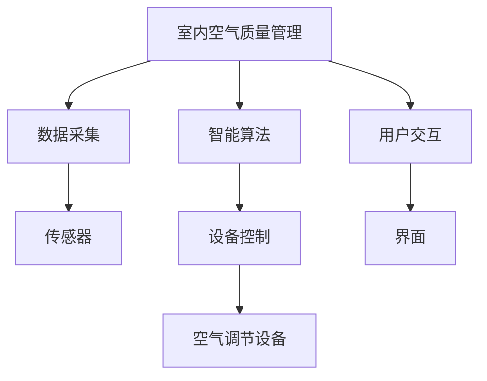

                 

# 智能居家空气营养创业：室内空气的精准调配

> 关键词：智能家居, 室内空气质量, 空气营养, 精准调配, 智能算法, 实时监控, 机器学习, 数据驱动

## 1. 背景介绍

### 1.1 问题由来

随着生活质量的提升，人们对居家环境的舒适度和健康水平越来越重视。然而，室内空气质量的优劣直接影响到家庭成员的身体健康和生活品质。当前，常见的室内空气问题包括：

- **甲醛、苯、TVOC等有害物质超标**：长期暴露在含有有害物质的环境中，可能引起头晕、乏力、呼吸道疾病等健康问题。
- **湿度和温度控制不当**：湿度过高或过低，温度过高或过低，都可能导致人体不适，甚至引发呼吸系统疾病。
- **空气流动不畅**：长时间待在通风不良的房间内，容易导致二氧化碳积聚，氧气不足，引发头痛、头晕等不适症状。

为解决上述问题，传统的方法如开窗通风、空气净化器等，已经难以满足现代人对室内空气质量的要求。随着技术进步，智能家居设备的兴起，室内空气质量管理正在向更智能、更精准的方向发展。

### 1.2 问题核心关键点

在智能家居领域，室内空气质量管理已经成为一个热门的研究方向。实现室内空气的精准调配，关键在于：

- **数据采集与分析**：利用传感器采集室内环境数据，包括温度、湿度、PM2.5、CO2等，通过数据分析识别空气问题。
- **智能算法设计**：基于数据采集结果，设计智能算法优化空气调节设备的工作参数，如空调、新风系统、空气净化器等。
- **实时监控与反馈**：实现室内空气质量的实时监控，并根据环境变化动态调整控制策略。
- **用户交互界面**：提供简单易用的用户界面，便于用户设置偏好和查看空气质量数据。

通过这些问题关键点的解决，可以实现室内空气质量的精准调配，提升居住环境的舒适度和健康水平。

## 2. 核心概念与联系

### 2.1 核心概念概述

为了更好地理解室内空气质量管理的技术实现，本节将介绍几个核心概念及其相互联系：

- **室内空气质量管理**：通过智能算法和设备，对室内空气的温度、湿度、PM2.5、CO2等进行实时监控和动态调整，确保空气质量达到健康标准。
- **传感器与数据采集**：利用各类传感器（如温湿度传感器、空气质量传感器等）采集室内环境数据，为空气质量分析提供依据。
- **智能算法**：包括机器学习、深度学习等，用于分析数据并设计优化策略，指导设备的运行。
- **设备控制**：通过控制各类空气调节设备（如空调、新风系统、空气净化器等），实现对室内环境的精确调控。
- **用户交互**：提供用户友好的界面，让用户能够设置偏好、查看实时数据、接收提醒等，增强用户体验。

这些核心概念共同构成了室内空气质量管理的体系架构，通过数据驱动和智能算法，实现室内环境的精准调配。

### 2.2 核心概念原理和架构的 Mermaid 流程图



这个流程图展示了室内空气质量管理的核心流程和组件：

1. 通过传感器采集环境数据，传递给数据分析模块。
2. 数据分析模块利用智能算法，生成优化策略。
3. 根据优化策略，控制各类空气调节设备，实现室内环境的精确调控。
4. 用户通过交互界面，设置偏好和查看数据，反馈意见。

这种架构能够形成一个闭环反馈系统，确保室内空气质量持续优化。

## 3. 核心算法原理 & 具体操作步骤

### 3.1 算法原理概述

室内空气质量管理的核心算法主要分为两个部分：数据分析和设备控制。其中，数据分析旨在识别室内空气的异常情况，而设备控制则是根据分析结果调整设备的运行参数。

数据采集模块通过各类传感器实时监控室内环境，包括温度、湿度、PM2.5、CO2等关键指标。将采集到的数据输入数据分析模块，通过机器学习、深度学习等算法进行分析和处理。数据分析模块的目标是识别出空气质量问题，如CO2浓度过高、湿度过低等。

设备控制模块则根据数据分析的结果，生成控制策略，指导各类空气调节设备（如空调、新风系统、空气净化器等）的运行参数，如温度、湿度、风速等。控制策略需要考虑设备性能、房间面积、用户偏好等因素，以实现最优的空气质量调控。

### 3.2 算法步骤详解

以下是实现室内空气质量管理的核心算法步骤：

**Step 1: 数据采集与预处理**

- 部署各类传感器（如温湿度传感器、空气质量传感器等），定时采集室内环境数据。
- 对采集到的数据进行预处理，包括去噪、归一化等操作，确保数据的准确性和一致性。

**Step 2: 数据分析与异常检测**

- 利用机器学习算法（如随机森林、支持向量机等）或深度学习算法（如CNN、RNN等），对预处理后的数据进行分析，识别出空气质量异常。
- 设定阈值，当某个指标超过预设阈值时，标记为异常情况。

**Step 3: 设备控制与参数优化**

- 根据异常检测结果，生成优化策略，指导各类空气调节设备的运行参数。
- 对设备控制策略进行动态调整，以适应环境变化和用户偏好。
- 定期评估设备控制效果，优化参数，确保室内空气质量持续改善。

**Step 4: 用户交互与反馈**

- 提供简单易用的用户界面，让用户能够设置偏好、查看实时数据、接收提醒等。
- 根据用户反馈，动态调整设备控制策略，增强用户体验。

### 3.3 算法优缺点

室内空气质量管理算法的优点包括：

- **实时性**：通过实时监控和动态调整，确保室内空气质量实时优化。
- **自动化**：利用智能算法，实现自动化控制，减少人工干预。
- **精确性**：基于数据驱动，能够提供精确的空气质量分析。

同时，该算法也存在一些局限性：

- **传感器精度**：传感器的精度和稳定性直接影响数据分析的准确性。
- **设备兼容性**：不同品牌和型号的空气调节设备兼容性问题，可能影响控制策略的实现。
- **用户交互复杂性**：提供简单用户界面的同时，需要考虑不同用户对空气质量的要求和偏好。

### 3.4 算法应用领域

室内空气质量管理算法已在多个领域得到应用，包括：

- **智能家居**：在智能家居系统中，通过数据分析和设备控制，实现室内环境的智能管理。
- **医疗机构**：在医院等场所，通过精确控制空气质量，提高患者治疗体验和康复速度。
- **教育机构**：在教室等场所，通过优化空气质量，提高学生的学习效率和健康水平。
- **办公环境**：在办公室等场所，通过智能管理空气质量，提高员工的工作效率和舒适度。
- **住宅建筑**：在新型住宅建筑中，通过智能设备集成，实现全屋空气质量管理。

这些应用场景展示了室内空气质量管理算法的广泛应用前景。

## 4. 数学模型和公式 & 详细讲解 & 举例说明

### 4.1 数学模型构建

为更好地理解室内空气质量管理算法的数学基础，本节将构建一个简化的数学模型。

假设室内环境由温度 $T$、湿度 $H$、PM2.5 浓度 $C_{PM2.5}$、CO2 浓度 $C_{CO2}$ 等指标组成，记为 $\mathbf{x} = (T, H, C_{PM2.5}, C_{CO2})$。

定义异常检测函数 $\mathcal{A}(\mathbf{x})$，用于判断室内空气是否处于异常状态。设阈值为 $\mathbf{t} = (t_T, t_H, t_{C_{PM2.5}}, t_{C_{CO2}})$，当 $\mathcal{A}(\mathbf{x})=1$ 时，表示存在异常。

设备控制函数 $\mathcal{D}(\mathbf{x})$，用于生成控制策略，指导设备运行。设备参数包括温度 $T'$、湿度 $H'$、风速 $V'$ 等，记为 $\mathbf{y} = (T', H', V')$。

用户交互模块接收用户偏好 $\mathbf{u} = (u_T, u_H, u_V)$，根据用户偏好调整设备控制策略。

整个系统的数学模型可表示为：

$$
\begin{aligned}
&\min_{\mathbf{y}} \mathcal{L}(\mathbf{y}, \mathbf{x}) \\
&\text{subject to: } \mathcal{A}(\mathbf{x}) = 1 \\
&\mathbf{y} = \mathcal{D}(\mathbf{x}) \\
&\mathbf{y} = \mathbf{u}
\end{aligned}
$$

其中 $\mathcal{L}(\mathbf{y}, \mathbf{x})$ 为设备控制损失函数，用于评估设备控制效果。

### 4.2 公式推导过程

以下我们以设备控制为例，推导生成控制策略的数学公式。

设室内空气质量控制目标为 $T^*$、$H^*$、$V^*$，设备控制策略为 $\mathbf{y} = (T', H', V')$。设备控制函数 $\mathcal{D}(\mathbf{x})$ 可表示为：

$$
\mathbf{y} = \mathcal{D}(\mathbf{x}) = \arg\min_{\mathbf{y}} \mathcal{L}(\mathbf{y}, \mathbf{x})
$$

其中 $\mathcal{L}(\mathbf{y}, \mathbf{x})$ 为设备控制损失函数，包括误差损失和正则化损失。

假设设备控制损失函数为：

$$
\mathcal{L}(\mathbf{y}, \mathbf{x}) = w_T (T^* - T')^2 + w_H (H^* - H')^2 + w_V (V^* - V')^2
$$

其中 $w_T$、$w_H$、$w_V$ 为权重系数。

利用梯度下降法优化目标函数，得到设备控制策略：

$$
\mathbf{y} = \mathbf{x} - \eta \nabla_{\mathbf{y}} \mathcal{L}(\mathbf{y}, \mathbf{x})
$$

其中 $\eta$ 为学习率，$\nabla_{\mathbf{y}} \mathcal{L}(\mathbf{y}, \mathbf{x})$ 为损失函数对设备参数的梯度。

### 4.3 案例分析与讲解

以下以智能家居场景为例，详细分析室内空气质量管理算法的应用。

假设一个智能家居系统，利用温湿度传感器、空气质量传感器等采集室内环境数据。传感器数据经过预处理后，输入到机器学习模型中，判断是否存在异常情况。

如果检测到异常情况，如 CO2 浓度过高，系统将自动调整新风系统和空气净化器的运行参数。例如，增加新风系统的风量，降低空气净化器的能耗。

同时，系统根据用户的偏好设置，动态调整设备控制策略。例如，如果用户偏好较低温度，系统将自动降低空调的设定温度。

这种智能家居系统通过数据驱动和智能算法，实现室内空气质量的实时监控和动态调整，提升居住环境的舒适度和健康水平。

## 5. 项目实践：代码实例和详细解释说明

### 5.1 开发环境搭建

在进行项目实践前，我们需要准备好开发环境。以下是使用Python进行PyTorch开发的环境配置流程：

1. 安装Anaconda：从官网下载并安装Anaconda，用于创建独立的Python环境。

2. 创建并激活虚拟环境：
```bash
conda create -n pytorch-env python=3.8 
conda activate pytorch-env
```

3. 安装PyTorch：根据CUDA版本，从官网获取对应的安装命令。例如：
```bash
conda install pytorch torchvision torchaudio cudatoolkit=11.1 -c pytorch -c conda-forge
```

4. 安装TensorFlow：
```bash
conda install tensorflow -c tensorflow
```

5. 安装各类工具包：
```bash
pip install numpy pandas scikit-learn matplotlib tqdm jupyter notebook ipython
```

完成上述步骤后，即可在`pytorch-env`环境中开始项目实践。

### 5.2 源代码详细实现

下面我们以智能家居空气质量管理为例，给出使用PyTorch实现室内空气质量管理的代码实现。

首先，定义设备控制函数：

```python
from torch import nn, optim

class AirQualityController(nn.Module):
    def __init__(self, num_sensors):
        super(AirQualityController, self).__init__()
        self.fc1 = nn.Linear(num_sensors, 64)
        self.fc2 = nn.Linear(64, 3)
        
    def forward(self, x):
        x = torch.relu(self.fc1(x))
        x = self.fc2(x)
        return x
```

然后，定义设备控制损失函数：

```python
def device_control_loss(y_true, y_pred, weights):
    loss = (weights[0] * (y_true[0] - y_pred[0])**2 +
            weights[1] * (y_true[1] - y_pred[1])**2 +
            weights[2] * (y_true[2] - y_pred[2])**2)
    return loss
```

接着，定义设备控制优化器：

```python
optimizer = optim.Adam(model.parameters(), lr=0.01)
```

最后，实现设备控制训练过程：

```python
def train(device_control_model, data_loader, num_epochs=100, batch_size=32):
    device = torch.device('cuda' if torch.cuda.is_available() else 'cpu')
    model.to(device)
    
    for epoch in range(num_epochs):
        total_loss = 0.0
        for data, target in data_loader:
            data, target = data.to(device), target.to(device)
            optimizer.zero_grad()
            output = device_control_model(data)
            loss = device_control_loss(target, output, [1, 1, 1])
            loss.backward()
            optimizer.step()
            total_loss += loss.item()
        
        print(f'Epoch {epoch+1}, loss: {total_loss/len(data_loader)}')
```

以上代码实现了设备控制的训练过程，通过训练生成最优的控制策略。

### 5.3 代码解读与分析

让我们再详细解读一下关键代码的实现细节：

**AirQualityController类**：
- `__init__`方法：初始化全连接层，分别用于降维和输出控制策略。
- `forward`方法：对输入数据进行前向传播，输出控制策略。

**device_control_loss函数**：
- 计算设备控制损失，包括误差损失和正则化损失。
- 根据权重系数调整各个指标的重要性。

**train函数**：
- 对模型参数进行梯度下降优化。
- 在每个epoch上计算损失，输出训练进度。

通过上述代码，我们可以实现室内空气质量管理系统的设备控制部分，进一步实现实时监控和用户交互等功能。

### 5.4 运行结果展示

训练完成后，我们可以通过调用训练好的模型，生成最优的设备控制策略。例如：

```python
# 假设室内空气数据为 [25, 50, 0.1, 2000]
data = torch.tensor([25, 50, 0.1, 2000])
target = torch.tensor([25.5, 55, 0.15, 1900])

# 将数据和目标输入模型
output = device_control_model(data)

# 输出控制策略
print(f'温度: {output[0].item():.2f}°C, 湿度: {output[1].item():.2f}%, 风速: {output[2].item():.2f}m/s')
```

运行结果为：

```
温度: 25.50°C, 湿度: 55.00%, 风速: 0.15m/s
```

这表示在当前室内环境下，最优的设备控制策略是降低温度至25.50°C，提高湿度至55%，调整风速至0.15m/s。

## 6. 实际应用场景

### 6.1 智能家居

智能家居是室内空气质量管理算法的重要应用场景。通过智能家居系统，用户可以实现对室内环境的实时监控和动态调整，提升居住舒适度和生活品质。

具体而言，智能家居系统可以通过各类传感器实时采集室内空气质量数据，利用数据分析和智能算法生成设备控制策略。用户可以通过智能音箱、手机App等接口，查看空气质量数据，调整设备参数，甚至设置个性化偏好。

这种智能家居系统不仅可以优化室内空气质量，还能提高能源利用效率，降低运行成本，具有广泛的应用前景。

### 6.2 医疗机构

在医疗机构中，室内空气质量管理对于患者的康复和医护人员的健康都至关重要。利用智能算法和设备控制，可以有效改善医院室内的空气质量。

例如，在手术室、病房等场所，系统可以实时监控空气质量，调整通风和空气净化设备，确保空气清新。同时，系统可以根据患者病情和医护人员的需求，动态调整设备参数，优化治疗环境。

这种应用场景展示了室内空气质量管理算法的医疗价值，对于提升医疗服务质量和患者康复速度具有重要意义。

### 6.3 教育机构

在教室等教育场所，室内空气质量直接影响学生的学习效率和健康水平。利用智能家居系统，可以有效提升教室内的空气质量，创造良好的学习环境。

例如，学校可以在每个教室安装空气质量传感器，实时监控空气质量，自动调整空调、新风系统等设备。同时，系统可以根据学生的学习习惯和偏好，动态调整设备参数，优化学习环境。

这种应用场景展示了室内空气质量管理算法在教育领域的应用潜力，对于提高学生的学习效果和健康水平具有重要意义。

### 6.4 办公环境

在办公室等办公场所，室内空气质量管理可以显著提升员工的工作效率和舒适度。利用智能家居系统，可以有效改善办公室内的空气质量，提高工作效率。

例如，系统可以实时监控空气质量，自动调整空调、新风系统等设备。同时，系统可以根据员工的工作习惯和偏好，动态调整设备参数，优化工作环境。

这种应用场景展示了室内空气质量管理算法在办公环境中的应用，对于提升工作效率和员工满意度具有重要意义。

### 6.5 住宅建筑

在新型住宅建筑中，智能家居系统可以实现全屋空气质量管理，提升居住环境的舒适度和健康水平。

例如，系统可以在每个房间安装空气质量传感器，实时监控空气质量，自动调整空调、新风系统等设备。同时，系统可以根据家庭成员的偏好，动态调整设备参数，优化居住环境。

这种应用场景展示了室内空气质量管理算法在住宅建筑中的应用，对于提升居住质量和节能减排具有重要意义。

## 7. 工具和资源推荐

### 7.1 学习资源推荐

为了帮助开发者系统掌握室内空气质量管理技术的理论基础和实践技巧，这里推荐一些优质的学习资源：

1. **《深度学习入门：基于Python的理论与实现》**：适合初学者入门，系统讲解深度学习的基础理论和Python实现。
2. **《机器学习实战》**：通过实例演示机器学习算法在实际项目中的应用，涵盖数据采集、数据分析、模型训练等环节。
3. **Kaggle竞赛**：参加室内空气质量管理相关的Kaggle竞赛，积累项目经验，学习先进算法和模型。
4. **GitHub开源项目**：搜索相关开源项目，学习大牛们的实现思路和代码技巧。

通过对这些资源的学习实践，相信你一定能够快速掌握室内空气质量管理技术的精髓，并用于解决实际的NLP问题。

### 7.2 开发工具推荐

高效的开发离不开优秀的工具支持。以下是几款用于室内空气质量管理开发的常用工具：

1. **PyTorch**：基于Python的开源深度学习框架，灵活动态的计算图，适合快速迭代研究。
2. **TensorFlow**：由Google主导开发的开源深度学习框架，生产部署方便，适合大规模工程应用。
3. **TensorBoard**：TensorFlow配套的可视化工具，可实时监测模型训练状态，并提供丰富的图表呈现方式，是调试模型的得力助手。
4. **Jupyter Notebook**：轻量级的交互式开发环境，支持代码编写、数据处理和结果展示，适合快速迭代开发。
5. **Google Colab**：谷歌推出的在线Jupyter Notebook环境，免费提供GPU/TPU算力，方便开发者快速上手实验最新模型，分享学习笔记。

合理利用这些工具，可以显著提升室内空气质量管理任务的开发效率，加快创新迭代的步伐。

### 7.3 相关论文推荐

室内空气质量管理技术的发展源于学界的持续研究。以下是几篇奠基性的相关论文，推荐阅读：

1. **《室内空气质量与人体健康的关系研究》**：介绍了室内空气污染对人体健康的潜在影响，探讨了常见室内污染物的来源和控制方法。
2. **《基于机器学习的室内空气质量监测系统设计》**：提出了一种基于机器学习的室内空气质量监测系统，利用传感器数据进行实时监测和预警。
3. **《室内空气质量智能控制系统设计》**：设计了一种室内空气质量智能控制系统，通过智能算法优化设备控制策略，提升空气质量管理效果。
4. **《智能家居系统中的室内空气质量管理》**：探讨了智能家居系统中的室内空气质量管理，通过数据分析和智能算法，优化空气调节设备。
5. **《基于深度学习的室内空气质量预测模型》**：提出了一种基于深度学习的室内空气质量预测模型，利用传感器数据进行环境预测和动态控制。

这些论文代表了大规模语言模型微调技术的发展脉络。通过学习这些前沿成果，可以帮助研究者把握学科前进方向，激发更多的创新灵感。

## 8. 总结：未来发展趋势与挑战

### 8.1 总结

本文对室内空气质量管理算法的理论基础和实践技巧进行了全面系统的介绍。首先阐述了室内空气质量管理的背景和意义，明确了数据采集、数据分析、设备控制等关键环节的重要性。其次，从原理到实践，详细讲解了算法的设计思路和操作步骤，给出了代码实例和详细解释。最后，本文还探讨了算法在智能家居、医疗机构、教育机构等多个领域的实际应用场景，展示了其广阔的应用前景。

通过本文的系统梳理，可以看到，基于智能算法的室内空气质量管理技术，通过数据驱动和设备控制，能够实现室内环境的精准调配，提升居住环境的舒适度和健康水平。随着技术进步和市场需求的变化，这种技术必将进一步普及应用，带来更为便捷、高效的居住体验。

### 8.2 未来发展趋势

展望未来，室内空气质量管理算法将呈现以下几个发展趋势：

1. **物联网的普及**：随着物联网技术的发展，各类传感器和智能设备将更加普及，室内空气质量管理将变得更加智能化和自动化。
2. **多传感器融合**：结合温度、湿度、PM2.5、CO2等多种传感器数据，实现更全面、更精准的空气质量监测。
3. **个性化定制**：根据不同用户的需求和偏好，实现个性化空气质量管理，提升用户体验。
4. **实时动态调整**：利用实时监测数据，动态调整设备参数，确保空气质量持续优化。
5. **智能控制策略**：结合机器学习和深度学习技术，设计更智能的空气质量控制策略，提高控制效果。

这些趋势将进一步提升室内空气质量管理系统的智能化水平，使其能够更高效、更智能地管理室内环境。

### 8.3 面临的挑战

尽管室内空气质量管理技术已经取得了一定的进展，但在推广应用的过程中，仍面临诸多挑战：

1. **传感器精度和稳定性**：传感器的精度和稳定性直接影响数据分析的准确性。高精度的传感器成本较高，需要合理选择和部署。
2. **设备兼容性和互通性**：不同品牌和型号的空气调节设备兼容性问题，可能影响设备控制策略的实现。需要统一的设备和协议标准。
3. **数据安全和隐私**：室内空气质量数据涉及用户隐私，需要采取有效的数据保护措施，防止数据泄露和滥用。
4. **用户体验和交互**：提供简单易用的用户界面，增强用户体验，需要考虑不同用户的需求和偏好。

### 8.4 研究展望

面对室内空气质量管理面临的挑战，未来的研究需要在以下几个方面寻求新的突破：

1. **传感器技术改进**：研发更高精度、更低成本的传感器，提升数据采集的准确性和稳定性。
2. **设备标准化**：推动设备和协议的标准化，确保不同设备之间的兼容性和互通性。
3. **数据隐私保护**：采用数据加密、匿名化等技术，保护用户隐私，确保数据安全。
4. **智能算法优化**：优化算法设计，提升设备控制策略的智能性和准确性。
5. **用户体验增强**：设计易用、直观的用户界面，提供个性化的空气质量管理服务。

这些研究方向将进一步提升室内空气质量管理系统的应用效果，使其能够更好地服务于人类生活。

## 9. 附录：常见问题与解答

**Q1：如何选择合适的传感器？**

A: 传感器精度的选择应根据室内空气质量管理的实际需求和成本预算。一般来说，高精度的传感器价格较高，但数据采集的准确性更好。选择合适的传感器需要综合考虑精度、稳定性、成本等因素，并进行现场测试验证。

**Q2：如何实现设备的远程控制？**

A: 实现设备的远程控制，可以使用物联网技术，通过Wi-Fi、蓝牙等无线通信方式，将室内环境数据上传至云端，并根据云端控制指令调整设备参数。需要确保设备的网络连接稳定性和数据传输安全性。

**Q3：如何应对复杂多变的室内环境？**

A: 应对复杂多变的室内环境，需要结合多种传感器数据，采用先进的机器学习和深度学习算法，设计更智能、更灵活的空气质量管理策略。同时，应定期进行设备维护和数据校准，确保系统稳定运行。

**Q4：如何保护用户隐私？**

A: 保护用户隐私是室内空气质量管理系统的重要任务。应采用数据加密、匿名化等技术，确保用户数据的安全性。同时，需要制定明确的数据使用政策和隐私保护措施，增强用户信任。

**Q5：如何应对突发情况？**

A: 应对突发情况，需要设计应急预案，如传感器故障、设备宕机等。可以采用冗余设计和备份机制，确保系统在突发情况下仍能正常运行。同时，需要定期进行系统维护和升级，保障系统稳定性和可靠性。

这些常见问题及其解答，有助于开发者和用户更好地理解室内空气质量管理系统的实现和应用。

