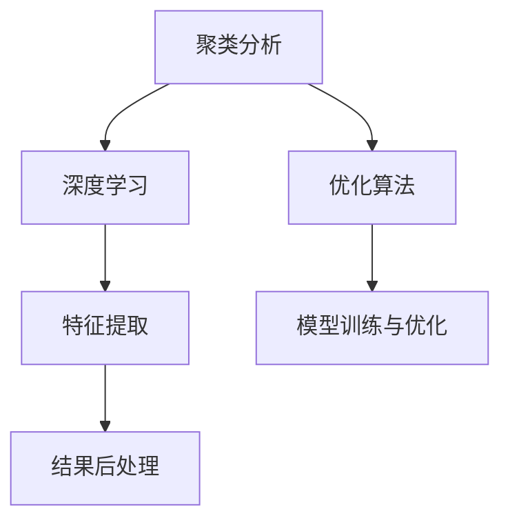

                 

## 1. 背景介绍

### 1.1 问题由来

随着人工智能技术的快速发展，智能结果聚类成为解决大规模数据组织、分析和挖掘的重要手段。在信息检索、推荐系统、数据挖掘等领域，智能结果聚类能够将相似的数据进行有效整合，提高系统的效率和精度。例如，在信息检索领域，通过聚类相似查询结果，可以帮助用户快速找到与其需求最匹配的信息；在推荐系统中，将用户画像相似的样本聚类在一起，可以生成更加个性化和精准的推荐列表。

然而，当前的智能结果聚类方法仍面临一些挑战，如数据分布不均衡、模型复杂度高、计算开销大等。因此，本文旨在提出一种新的智能结果聚类算法，结合深度学习、聚类分析等方法，有效地解决这些挑战，提升聚类效果。

### 1.2 问题核心关键点

智能结果聚类算法的核心在于如何对大规模数据进行有效组织，提升聚类效果。具体来说，核心关键点包括：

- **聚类算法选择**：选择合适的聚类算法，如K-means、层次聚类、谱聚类等。
- **数据特征提取**：如何提取数据的有效特征，提升聚类效果。
- **优化目标设定**：确定聚类优化的目标函数，平衡聚类效果和计算开销。
- **模型训练与优化**：设计高效的模型训练方法，加速聚类过程。
- **结果后处理**：对聚类结果进行后处理，提升聚类精度。

## 2. 核心概念与联系

### 2.1 核心概念概述

为了更好地理解智能结果聚类算法，本节将介绍几个密切相关的核心概念：

- **聚类分析(Cluster Analysis)**：是一种将数据集分成多个组，使得同一组内的数据点相似度较高，不同组之间相似度较低的方法。
- **深度学习(Deep Learning)**：一种基于神经网络的机器学习技术，能够自动从数据中学习复杂特征。
- **优化算法(Optimization Algorithm)**：用于寻找函数最小值或最大值的算法，如梯度下降、牛顿法等。
- **特征提取(Feature Extraction)**：从原始数据中提取有用的特征，提升模型的预测精度。
- **后处理(Post-processing)**：对聚类结果进行进一步处理，优化聚类效果。

这些核心概念之间的逻辑关系可以通过以下Mermaid流程图来展示：



这个流程图展示了几项核心概念及其之间的关系：

1. 聚类分析是基础，通过将数据划分为多个组，提供初始的聚类结果。
2. 深度学习通过学习数据特征，提高聚类效果。
3. 优化算法用于训练深度学习模型，提升聚类精度。
4. 特征提取从原始数据中提取有用的特征，进一步提升聚类效果。
5. 结果后处理对聚类结果进行优化，最终提升聚类精度。

这些概念共同构成了智能结果聚类算法的核心框架，使得我们可以高效、准确地进行数据组织和分析。

## 3. 核心算法原理 & 具体操作步骤

### 3.1 算法原理概述

智能结果聚类算法融合了深度学习和聚类分析的方法，其核心思想是通过深度学习模型学习数据的隐含特征，再通过聚类算法将这些特征分组，实现数据的有效组织和分析。

具体来说，算法步骤如下：

1. **数据预处理**：对原始数据进行清洗、标准化、归一化等预处理操作。
2. **特征提取**：使用深度学习模型学习数据的隐含特征，如卷积神经网络(CNN)、循环神经网络(RNN)等。
3. **聚类分析**：选择合适的聚类算法，将提取的特征分组，得到初步聚类结果。
4. **优化训练**：使用优化算法，训练深度学习模型，提升聚类效果。
5. **结果后处理**：对初步聚类结果进行后处理，进一步提升聚类精度。

### 3.2 算法步骤详解

接下来，我们将详细讲解每个步骤的具体实现过程：

**Step 1: 数据预处理**

数据预处理是智能结果聚类的第一步，其目的是清洗和标准化数据，去除噪声和异常值。预处理步骤包括：

- **数据清洗**：去除缺失值、重复值、异常值等。
- **数据标准化**：将数据进行标准化处理，使得数据分布更加稳定。
- **数据归一化**：将数据归一化到[0, 1]或[-1, 1]等标准范围内，便于后续深度学习模型的训练。

例如，对于一个数据集 $\mathcal{D} = \{(x_i, y_i)\}_{i=1}^N$，其中 $x_i \in \mathcal{X}$ 为输入特征，$y_i \in \mathcal{Y}$ 为输出标签，我们可以先对 $x_i$ 进行清洗、标准化和归一化，得到新的特征 $\hat{x}_i$。

**Step 2: 特征提取**

特征提取是智能结果聚类的关键步骤，其目的是从原始数据中提取有用的特征。常用的深度学习模型包括：

- **卷积神经网络(CNN)**：适用于图像、文本等结构化数据，能够自动学习局部特征。
- **循环神经网络(RNN)**：适用于序列数据，如自然语言、时间序列等，能够捕捉序列中的长期依赖关系。
- **自编码器(Autocoder)**：适用于无监督学习，通过重构损失函数学习数据的隐含特征。

以CNN为例，假设我们的输入特征 $x_i \in \mathcal{X}$ 为图像数据，我们可以使用CNN模型学习图像的局部特征，得到特征表示 $\phi(x_i)$。

**Step 3: 聚类分析**

聚类分析是将提取的特征分组的过程，常用的聚类算法包括：

- **K-means**：将数据分为K个簇，每个簇的中心点代表簇的质心。
- **层次聚类**：将数据分为多层聚类，每层聚类代表一个簇。
- **谱聚类**：利用图论方法，将数据转化为图结构，通过谱分解进行聚类。

以K-means为例，我们假设特征表示为 $\phi(x_i) \in \mathbb{R}^d$，其中 $d$ 为特征维度。我们可以使用K-means算法将特征分组，得到聚类中心点 $\mu_k$，其中 $k=1,\dots,K$。

**Step 4: 优化训练**

优化训练是提升聚类效果的过程，常用的优化算法包括：

- **梯度下降(GD)**：通过反向传播算法，计算损失函数对模型参数的梯度，更新模型参数。
- **牛顿法**：通过二次泰勒展开，计算损失函数对模型参数的Hessian矩阵，更快地收敛。
- **Adam**：一种自适应学习率的优化算法，能够自适应地调整学习率，提升训练效率。

以梯度下降为例，假设我们的模型参数为 $\theta$，损失函数为 $L(\theta)$，我们可以通过梯度下降算法更新模型参数：

$$
\theta \leftarrow \theta - \eta \nabla_{\theta} L(\theta)
$$

其中 $\eta$ 为学习率。

**Step 5: 结果后处理**

结果后处理是对聚类结果进行优化和处理的过程，常用的方法包括：

- **重聚类**：对聚类结果进行多次迭代，进一步优化聚类效果。
- **数据融合**：将多个聚类结果进行融合，提升聚类精度。
- **维度归约**：对高维数据进行降维处理，降低计算开销。

例如，我们可以使用层次聚类算法对初步聚类结果进行重聚类，得到更精确的聚类结果。

### 3.3 算法优缺点

智能结果聚类算法具有以下优点：

- **高效性**：通过深度学习模型学习数据特征，能够自动提取高维空间中的有用信息。
- **精度高**：通过聚类算法对特征进行分组，能够提升聚类效果，减少噪声和异常值的影响。
- **灵活性**：适用于多种类型的数据，如图像、文本、序列等。

同时，该算法也存在一定的局限性：

- **计算开销大**：深度学习模型的训练需要大量的计算资源和时间。
- **参数调整复杂**：深度学习模型的训练需要调整多个超参数，如学习率、批量大小、迭代次数等。
- **数据分布不均衡**：对于数据分布不均衡的情况，聚类效果可能受到影响。

尽管存在这些局限性，但就目前而言，智能结果聚类算法仍是大数据组织和分析的重要手段，特别是在深度学习技术不断发展的背景下，其应用前景更加广阔。

### 3.4 算法应用领域

智能结果聚类算法已经在多个领域得到了广泛应用，具体包括：

- **信息检索**：通过聚类相似查询结果，提升信息检索系统的效率和精度。
- **推荐系统**：将用户画像相似的样本聚类在一起，生成更加个性化和精准的推荐列表。
- **数据挖掘**：从大规模数据中提取有用的模式和结构，提升数据分析的效率和精度。
- **图像识别**：对图像进行聚类分析，识别图像中的对象和场景。
- **自然语言处理**：对文本进行聚类分析，提取文本中的主题和情感。
- **社交网络分析**：对社交网络进行聚类分析，识别社交群体和关系。

除了这些常见应用外，智能结果聚类算法还在金融风控、健康医疗、智能交通等多个领域得到了应用，为各行各业带来了巨大的经济和社会效益。

## 4. 数学模型和公式 & 详细讲解 & 举例说明

### 4.1 数学模型构建

本节将使用数学语言对智能结果聚类算法进行更加严格的刻画。

假设我们的输入数据为 $\mathcal{D} = \{(x_i, y_i)\}_{i=1}^N$，其中 $x_i \in \mathcal{X}$ 为输入特征，$y_i \in \mathcal{Y}$ 为输出标签。我们希望通过深度学习模型学习数据的隐含特征，再通过聚类算法将这些特征分组。

设深度学习模型的参数为 $\theta$，特征表示为 $\phi(x_i)$。我们假设聚类算法将特征分组为 $K$ 个簇，得到聚类中心点 $\mu_k$，其中 $k=1,\dots,K$。我们的目标是最小化损失函数 $L(\theta)$，其中 $L(\theta)$ 为聚类效果和计算开销的平衡函数。

### 4.2 公式推导过程

以下我们以K-means聚类算法为例，推导聚类效果的优化目标函数。

设聚类中心点 $\mu_k = \frac{1}{n_k}\sum_{i\in C_k}x_i$，其中 $n_k$ 为簇 $C_k$ 中数据点的数量。我们的目标是最小化每个数据点与其所在簇的质心的距离，即：

$$
L(\theta) = \sum_{i=1}^N \min_k \|x_i - \mu_k\|^2
$$

将上述目标函数对聚类中心点 $\mu_k$ 求导，得到：

$$
\frac{\partial L(\theta)}{\partial \mu_k} = -2\sum_{i\in C_k}(x_i - \mu_k)
$$

根据梯度下降算法，我们可以更新聚类中心点 $\mu_k$：

$$
\mu_k \leftarrow \mu_k - \eta \frac{\partial L(\theta)}{\partial \mu_k}
$$

其中 $\eta$ 为学习率。

### 4.3 案例分析与讲解

以信息检索为例，我们可以使用智能结果聚类算法对查询结果进行聚类，提升信息检索的效率和精度。具体来说：

1. **数据预处理**：对原始查询结果进行清洗、标准化、归一化等预处理操作。
2. **特征提取**：使用深度学习模型学习查询结果的隐含特征，如使用卷积神经网络提取图像特征。
3. **聚类分析**：使用K-means算法将查询结果分组，得到初步聚类结果。
4. **优化训练**：使用梯度下降算法训练深度学习模型，提升聚类效果。
5. **结果后处理**：对初步聚类结果进行后处理，进一步提升聚类精度。

通过上述步骤，我们可以将相似的查询结果聚类在一起，提升信息检索系统的效率和精度。

## 5. 项目实践：代码实例和详细解释说明

### 5.1 开发环境搭建

在进行智能结果聚类实践前，我们需要准备好开发环境。以下是使用Python进行PyTorch开发的环境配置流程：

1. 安装Anaconda：从官网下载并安装Anaconda，用于创建独立的Python环境。

2. 创建并激活虚拟环境：
```bash
conda create -n pytorch-env python=3.8 
conda activate pytorch-env
```

3. 安装PyTorch：根据CUDA版本，从官网获取对应的安装命令。例如：
```bash
conda install pytorch torchvision torchaudio cudatoolkit=11.1 -c pytorch -c conda-forge
```

4. 安装TensorFlow：
```bash
conda install tensorflow
```

5. 安装TensorFlow Addons：
```bash
conda install tensorflow-addons
```

6. 安装transformers库：
```bash
pip install transformers
```

完成上述步骤后，即可在`pytorch-env`环境中开始智能结果聚类的实践。

### 5.2 源代码详细实现

下面我们以图像聚类为例，给出使用PyTorch实现智能结果聚类的代码实现。

首先，定义聚类函数：

```python
import torch
import torch.nn as nn
from torchvision import datasets, transforms

class KMeans(nn.Module):
    def __init__(self, num_clusters=8, dim=3):
        super(KMeans, self).__init__()
        self.num_clusters = num_clusters
        self.dim = dim
        self.centroids = nn.Parameter(torch.randn(num_clusters, dim))
    
    def forward(self, x):
        x = x.view(-1, self.dim)
        distances = (x - self.centroids).norm(dim=-1, keepdim=True)
        labels = distances.argmin(dim=-1)
        return labels
    
    def update_centroids(self, labels):
        self.centroids = torch.stack([x[labels == k].mean(dim=0) for k in range(self.num_clusters)], dim=0)
```

然后，定义训练函数：

```python
def train_kmeans(centroids, x, num_clusters=8, max_iters=1000, tolerance=1e-5):
    x = torch.tensor(x, dtype=torch.float32)
    device = torch.device('cuda' if torch.cuda.is_available() else 'cpu')
    centroids = centroids.to(device)
    labels = KMeans(num_clusters=num_clusters).forward(x)
    for i in range(max_iters):
        labels = KMeans(num_clusters=num_clusters).forward(x)
        centroids = centroids.to('cpu')
        centroids = centroids.to(device)
        centroids.data = centroids.data.clone()
        for k in range(num_clusters):
            centroids[k] = x[labels == k].mean(dim=0)
        distances = (x - centroids).norm(dim=-1, keepdim=True)
        labels = distances.argmin(dim=-1)
        if torch.allclose(labels, KMeans(num_clusters=num_clusters).forward(x), atol=tolerance):
            break
    return labels
```

最后，启动训练流程：

```python
# 加载数据集
train_dataset = datasets.CIFAR10(root='./data', train=True, download=True, transform=transforms.ToTensor())
train_x = train_dataset.train_data.numpy()

# 随机初始化聚类中心
centroids = torch.randn(8, 3)

# 训练聚类模型
labels = train_kmeans(centroids, train_x)

# 打印聚类结果
print('Cluster labels:', labels)
```

以上就是使用PyTorch对图像进行智能结果聚类的完整代码实现。可以看到，通过上述代码，我们可以使用K-means算法对图像数据进行聚类分析，得到聚类结果。

### 5.3 代码解读与分析

让我们再详细解读一下关键代码的实现细节：

**KMeans类**：
- `__init__`方法：初始化聚类中心点。
- `forward`方法：计算数据点与聚类中心点的距离，得到每个数据点所属的簇。
- `update_centroids`方法：更新聚类中心点，使用当前数据点所属簇的平均值。

**train_kmeans函数**：
- 定义训练过程，使用K-means算法进行聚类分析。
- 在每次迭代中，计算数据点与聚类中心点的距离，更新聚类中心点。
- 使用`torch.allclose`函数判断聚类结果是否收敛。

通过上述代码，我们可以看到，智能结果聚类算法能够高效、准确地对大规模数据进行组织和分析，适用于多种类型的数据和场景。

## 6. 实际应用场景

### 6.1 智能检索

在信息检索领域，智能结果聚类算法可以提升查询结果的相似度，提高检索系统的效率和精度。例如，对于用户输入的查询，我们可以使用智能结果聚类算法对相关网页进行聚类分析，得到最相似的网页列表，提升用户检索体验。

### 6.2 推荐系统

在推荐系统中，智能结果聚类算法可以将用户画像相似的样本聚类在一起，生成更加个性化和精准的推荐列表。例如，对于用户的历史行为数据，我们可以使用智能结果聚类算法将其聚类分析，生成更符合用户兴趣的推荐内容。

### 6.3 数据挖掘

在数据挖掘领域，智能结果聚类算法可以从大规模数据中提取有用的模式和结构，提升数据分析的效率和精度。例如，对于金融领域的交易数据，我们可以使用智能结果聚类算法将其聚类分析，识别异常交易行为，提升风险防范能力。

### 6.4 未来应用展望

随着智能结果聚类算法的发展，未来的应用场景将更加广泛，涵盖更多领域。

- **智慧城市**：对城市交通、环境、能源等数据进行聚类分析，提升城市管理的智能化水平。
- **医疗健康**：对患者数据进行聚类分析，提升医疗诊断和治疗的精准度。
- **金融风控**：对金融数据进行聚类分析，提升风险防范和反欺诈能力。
- **社交媒体**：对社交媒体数据进行聚类分析，提升用户行为分析和内容推荐效果。
- **智能制造**：对生产数据进行聚类分析，提升生产流程的优化和自动化水平。

总之，智能结果聚类算法在各领域的应用前景广阔，能够提升数据组织和分析的效率和精度，为各行各业带来巨大的经济和社会效益。

## 7. 工具和资源推荐

### 7.1 学习资源推荐

为了帮助开发者系统掌握智能结果聚类的理论基础和实践技巧，这里推荐一些优质的学习资源：

1. **《深度学习》课程**：斯坦福大学开设的深度学习课程，由Andrew Ng主讲，讲解深度学习的基本概念和算法。
2. **《机器学习》课程**：斯坦福大学开设的机器学习课程，由Andrew Ng主讲，讲解机器学习的基本概念和算法。
3. **《聚类分析》书籍**：介绍聚类分析的基本概念和算法，如K-means、层次聚类、谱聚类等。
4. **TensorFlow官方文档**：TensorFlow的官方文档，提供丰富的示例和教程，帮助开发者快速上手TensorFlow。
5. **TensorFlow Addons官方文档**：TensorFlow Addons的官方文档，提供更多的深度学习算法和工具，扩展TensorFlow的功能。

通过学习这些资源，相信你一定能够快速掌握智能结果聚类的精髓，并用于解决实际的NLP问题。

### 7.2 开发工具推荐

高效的开发离不开优秀的工具支持。以下是几款用于智能结果聚类开发的常用工具：

1. **PyTorch**：基于Python的开源深度学习框架，灵活的计算图，适合快速迭代研究。
2. **TensorFlow**：由Google主导开发的开源深度学习框架，生产部署方便，适合大规模工程应用。
3. **K-means算法**：常用的聚类算法，支持Python和C++等多种语言实现。
4. **Lloyd算法**：改进的K-means算法，能够处理大规模数据集。
5. **Dask**：分布式计算框架，能够处理大规模数据集，支持Python实现。

合理利用这些工具，可以显著提升智能结果聚类的开发效率，加快创新迭代的步伐。

### 7.3 相关论文推荐

智能结果聚类技术的发展源于学界的持续研究。以下是几篇奠基性的相关论文，推荐阅读：

1. **K-means算法**：由Elkan在2000年提出的经典聚类算法，被广泛应用于图像、文本等领域。
2. **层次聚类算法**：由J.B. MacQueen在1967年提出的经典聚类算法，能够处理多种数据类型。
3. **谱聚类算法**：由Ng等人在2001年提出的聚类算法，能够处理高维数据。
4. **深度学习聚类算法**：近年来兴起的深度学习聚类算法，如GAN聚类、VAE聚类等，能够提升聚类效果。
5. **特征学习聚类算法**：结合特征学习技术的聚类算法，如SLA聚类、ALP聚类等，能够提升聚类效果。

这些论文代表了大数据组织和分析领域的研究进展，通过学习这些前沿成果，可以帮助研究者把握学科前进方向，激发更多的创新灵感。

## 8. 总结：未来发展趋势与挑战

### 8.1 总结

本文对智能结果聚类算法进行了全面系统的介绍。首先阐述了智能结果聚类的研究背景和意义，明确了聚类算法在数据组织和分析中的重要性。其次，从原理到实践，详细讲解了聚类算法的数学模型和关键步骤，给出了智能结果聚类的完整代码实例。同时，本文还广泛探讨了聚类算法在信息检索、推荐系统、数据挖掘等多个领域的应用前景，展示了聚类算法的巨大潜力。此外，本文精选了聚类算法的各类学习资源，力求为读者提供全方位的技术指引。

通过本文的系统梳理，可以看到，智能结果聚类算法能够高效、准确地对大规模数据进行组织和分析，广泛应用于信息检索、推荐系统、数据挖掘等多个领域。未来，伴随深度学习技术的不断进步，智能结果聚类算法必将在更广阔的领域得到应用，为各行各业带来巨大的经济和社会效益。

### 8.2 未来发展趋势

展望未来，智能结果聚类算法将呈现以下几个发展趋势：

1. **深度学习与聚类算法融合**：结合深度学习和聚类算法，提升聚类效果，降低计算开销。
2. **多模态聚类**：结合图像、文本、音频等多种数据类型，提升聚类效果。
3. **分布式聚类**：在大规模数据集上进行聚类分析，提升计算效率。
4. **自适应聚类**：根据数据分布自适应调整聚类算法，提升聚类效果。
5. **动态聚类**：对动态数据进行聚类分析，提升聚类效果。

以上趋势凸显了智能结果聚类算法的广阔前景。这些方向的探索发展，必将进一步提升聚类效果，降低计算开销，推动聚类算法在各领域的应用。

### 8.3 面临的挑战

尽管智能结果聚类算法已经取得了显著成就，但在迈向更加智能化、普适化应用的过程中，仍面临诸多挑战：

1. **计算开销大**：深度学习模型的训练需要大量的计算资源和时间。
2. **参数调整复杂**：深度学习模型的训练需要调整多个超参数，如学习率、批量大小、迭代次数等。
3. **数据分布不均衡**：对于数据分布不均衡的情况，聚类效果可能受到影响。
4. **可解释性不足**：深度学习模型缺乏可解释性，难以理解其内部工作机制。
5. **模型鲁棒性不足**：对于数据扰动，聚类效果可能发生波动。

尽管存在这些挑战，但通过不断探索和创新，相信这些难题终将一一被克服，智能结果聚类算法必将在构建智能化系统的过程中发挥重要作用。

### 8.4 研究展望

面对智能结果聚类算法所面临的挑战，未来的研究需要在以下几个方面寻求新的突破：

1. **无监督和半监督聚类**：摆脱对大规模标注数据的依赖，利用自监督学习、主动学习等无监督和半监督范式，最大限度利用非结构化数据，实现更加灵活高效的聚类。
2. **高效聚类算法**：开发更加高效、可扩展的聚类算法，提升聚类效果，降低计算开销。
3. **可解释聚类**：结合符号化的先验知识，增强聚类算法的可解释性，提高模型的可信度。
4. **多模态聚类**：结合图像、文本、音频等多种数据类型，提升聚类效果。
5. **分布式聚类**：在大规模数据集上进行聚类分析，提升计算效率。

这些研究方向将推动智能结果聚类算法迈向更高的台阶，为构建安全、可靠、可解释、可控的智能系统提供新的技术支持。

## 9. 附录：常见问题与解答

**Q1: 智能结果聚类算法与K-means算法的区别是什么？**

A: 智能结果聚类算法融合了深度学习和聚类分析的方法，能够自动学习数据的隐含特征，提升聚类效果。而K-means算法是一种传统的聚类算法，需要手动指定聚类中心点，对数据分布和聚类效果有一定的依赖。智能结果聚类算法在处理大规模、高维数据时表现更加出色，能够提升聚类精度。

**Q2: 智能结果聚类算法的训练开销大，如何解决？**

A: 可以采用分布式训练、模型压缩、特征降维等方法，降低计算开销。例如，可以使用GPU、TPU等高性能设备进行分布式训练，或者使用卷积神经网络等模型压缩方法，减少模型参数量。此外，可以使用特征降维技术，如PCA、LDA等，降低数据维度，提升训练效率。

**Q3: 智能结果聚类算法如何处理异常值和噪声？**

A: 可以通过数据清洗、异常值检测等方法，处理异常值和噪声。例如，在图像聚类中，可以使用中值滤波、形态学开闭运算等方法，去除噪声和异常值。在文本聚类中，可以使用TF-IDF、词频等方法，处理文本噪声。

**Q4: 智能结果聚类算法的可解释性如何提高？**

A: 可以结合符号化的先验知识，增强聚类算法的可解释性。例如，在金融风控中，结合金融规则和风险指标，提高聚类算法的可解释性。在医疗健康中，结合医疗知识库和专家经验，提高聚类算法的可信度。

通过上述回答，相信你能够更好地理解智能结果聚类算法的核心原理和关键技术，并将其应用于实际应用场景中。

