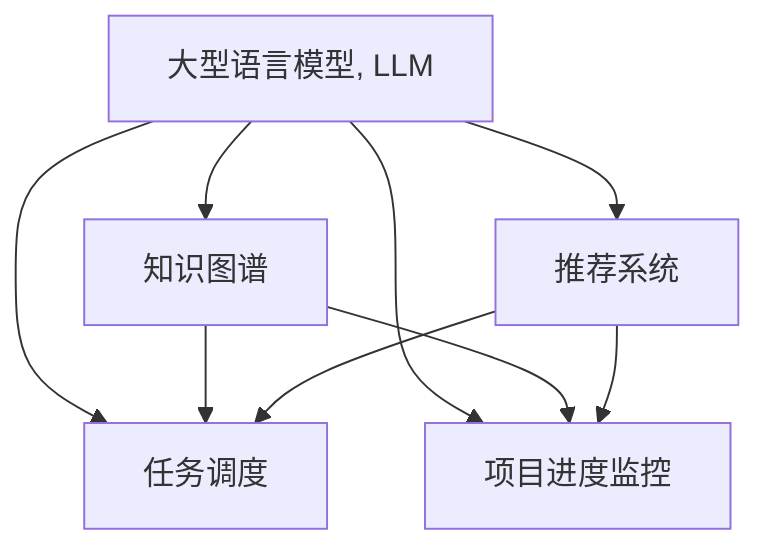

                 

# 智能规划引擎：LLM在项目管理中的应用

> 关键词：智能规划, 大型语言模型(Large Language Model, LLM), 项目管理, 自然语言处理(NLP), 知识图谱, 推荐系统, 任务调度, 项目进度监控

## 1. 背景介绍

### 1.1 问题由来
在现代项目管理中，如何高效地制定和执行项目计划，是决定项目成败的关键。传统的项目管理方法依赖人工经验和手动计算，效率低下且容易出错。随着数据量的大幅增长，传统方法已无法满足日益复杂的管理需求。

近年来，自然语言处理(NLP)技术飞速发展，为项目管理带来了新的可能性。例如，基于深度学习的大型语言模型(Large Language Model, LLM)，可以自动化地理解和处理大量的项目文档、会议记录、电子邮件等非结构化数据，提供强大的信息抽取、知识图谱构建和任务调度能力，显著提高项目管理效率和精度。

### 1.2 问题核心关键点
LLM在项目管理中的应用，主要体现在以下几个关键点：

1. 项目文档理解：通过LLM自动化处理项目文档，提取任务、进度、风险等信息，快速构建项目视图。
2. 知识图谱构建：基于LLM构建项目相关知识图谱，集成项目管理领域的专业术语、行业标准和组织规范，提升信息检索和查询效率。
3. 任务调度优化：利用LLM对项目任务进行智能调度，平衡资源、时间和成本，提高项目执行效率。
4. 进度监控预警：基于LLM对项目进度进行实时监控，及时发现异常并发出预警，降低项目风险。
5. 自动化报告生成：通过LLM自动生成项目报告、进度更新、风险评估等文档，减少手动编写的工作量，提高文档生成效率和质量。

### 1.3 问题研究意义
大语言模型在项目管理中的应用，具有以下重要意义：

1. 提高管理效率：通过自动化处理和管理项目文档，极大减轻人工负担，提升项目管理效率。
2. 增强决策支持：基于丰富的非结构化数据和知识图谱，提供更加全面、准确的决策支持，帮助管理者做出更优的决策。
3. 降低沟通成本：通过自然语言理解和生成能力，减少项目团队之间的沟通和协调难度，提升协作效率。
4. 提升项目执行能力：利用智能任务调度和进度监控功能，优化项目资源配置，提高项目执行能力和风险控制能力。
5. 促进知识传承：构建和维护项目知识图谱，实现知识管理与传承，提高组织知识复用率和创新能力。

## 2. 核心概念与联系

### 2.1 核心概念概述

为了更好地理解LLM在项目管理中的应用，本节将介绍几个密切相关的核心概念：

- 大型语言模型(Large Language Model, LLM)：以自回归(如GPT)或自编码(如BERT)模型为代表的大规模预训练语言模型。通过在大规模无标签文本语料上进行预训练，学习通用的语言表示，具备强大的语言理解和生成能力。

- 知识图谱(Knowledge Graph)：由节点和边组成的网络结构，用于表示实体、属性和实体之间的关系。知识图谱通过融合和整合非结构化数据，为LLM提供结构化的知识信息，增强其推理和学习能力。

- 推荐系统(Recommendation System)：基于用户行为数据和物品特征，为用户推荐感兴趣的物品或内容。推荐系统通过利用用户行为模式，优化推荐效果，提高用户满意度。

- 任务调度(Task Scheduling)：根据任务的优先级、依赖关系和资源限制，制定最优的任务执行顺序。任务调度通过优化资源利用率，提高项目执行效率。

- 项目进度监控(Project Progress Monitoring)：实时监测项目进度，及时发现异常并发出预警，降低项目风险。项目进度监控通过动态调整任务优先级和资源分配，确保项目按期完成。

这些核心概念之间的逻辑关系可以通过以下Mermaid流程图来展示：



这个流程图展示了大语言模型的核心概念及其之间的关系：

1. LLM通过预训练获得语言表示能力，可以自动处理和管理项目文档，构建知识图谱，进行任务调度和进度监控。
2. 知识图谱增强了LLM的推理和查询能力，使其能够高效检索和管理项目知识。
3. 推荐系统可以基于用户行为模式，优化任务调度和资源分配，提高项目执行效率。
4. 任务调度优化项目资源配置，提升任务执行效率。
5. 进度监控实时发现异常并发出预警，降低项目风险。

这些概念共同构成了大语言模型在项目管理中的应用框架，使其能够实现高效、精确、智能的项目管理。

## 3. 核心算法原理 & 具体操作步骤

### 3.1 算法原理概述

基于LLM的项目管理，本质上是一个自然语言处理(NLP)技术在项目文档、知识图谱、任务调度和进度监控中的应用。其核心思想是：利用LLM的自然语言理解和生成能力，自动化地处理和管理项目数据，提供全面的决策支持和管理建议。

形式化地，假设项目文档为 $D=\{x_i\}_{i=1}^N$，其中 $x_i$ 表示第 $i$ 篇文档。定义LLM对文档 $x_i$ 的理解为 $U(x_i)$，其中 $U$ 为理解函数。定义项目知识图谱为 $G=(V,E)$，其中 $V$ 表示节点集合，$E$ 表示边集合。定义任务调度函数为 $S(T)$，其中 $T$ 表示任务集合，$S$ 为调度函数。定义进度监控函数为 $M(P)$，其中 $P$ 表示进度数据，$M$ 为监控函数。

项目管理的目标是最大化项目执行效率和风险控制能力，即：

$$
\max_{U,S,M} \text{Project Efficiency} - \text{Project Risk}
$$

其中，$\text{Project Efficiency}$ 和 $\text{Project Risk}$ 分别为项目执行效率和项目风险。

### 3.2 算法步骤详解

基于LLM的项目管理一般包括以下几个关键步骤：

**Step 1: 文档预处理和理解**

- 收集项目相关的非结构化数据，如项目文档、会议记录、电子邮件等，进行数据清洗和预处理。
- 使用LLM对预处理后的文档进行理解，提取任务、进度、风险等信息，构建项目文档视图。

**Step 2: 知识图谱构建**

- 基于理解后的文档信息，构建项目知识图谱。图谱节点包括项目任务、资源、人员、进度等实体，边表示实体之间的关系。
- 对知识图谱进行优化和迭代，提高查询和推理的效率。

**Step 3: 任务调度和优化**

- 基于知识图谱，对项目任务进行智能调度，优化资源分配和任务优先级。
- 利用推荐系统，根据历史数据和用户行为模式，优化任务调度和资源分配，提升项目执行效率。

**Step 4: 进度监控和预警**

- 实时监控项目进度，计算任务完成情况和进度偏差。
- 利用LLM对进度数据进行分析，识别潜在风险和异常，发出预警并提出建议。

**Step 5: 自动化报告生成**

- 基于理解后的文档信息和任务调度结果，自动生成项目报告、进度更新、风险评估等文档。
- 利用推荐系统，根据用户偏好和需求，推荐生成报告的格式和内容，提升报告的生成效率和质量。

以上是基于LLM的项目管理的一般流程。在实际应用中，还需要针对具体项目的特点，对微调过程的各个环节进行优化设计，如改进任务调度算法、引入更多的正则化技术、搜索最优的超参数组合等，以进一步提升项目管理的效率和效果。

### 3.3 算法优缺点

基于LLM的项目管理方法具有以下优点：

1. 自动化处理和理解项目文档，极大减轻人工负担，提升项目管理效率。
2. 利用丰富的非结构化数据和知识图谱，提供全面的决策支持，提升项目管理的精度和效果。
3. 基于推荐系统，优化任务调度和资源分配，提高项目执行效率。
4. 利用智能进度监控功能，实时发现异常并发出预警，降低项目风险。
5. 自动生成项目报告和评估，减少手动编写的工作量，提高文档生成效率和质量。

同时，该方法也存在一定的局限性：

1. 依赖高质量的文档数据和知识图谱。获取和维护高质量的数据集和图谱，需要耗费大量的时间和精力。
2. 对模型和算法的依赖性较强。模型训练和调优需要相应的计算资源和技术支持，算法选择不当可能导致管理效果不佳。
3. 模型的可解释性不足。LLM的决策过程缺乏可解释性，难以对其推理逻辑进行分析和调试。
4. 模型的鲁棒性有限。LLM对输入的噪声和干扰敏感，容易产生错误的理解和输出。
5. 模型的维护成本较高。维护和更新知识图谱和模型，需要持续的资源投入和技术支持。

尽管存在这些局限性，但就目前而言，基于LLM的项目管理方法仍然是一种高效、智能、自动化的项目管理手段。未来相关研究的重点在于如何进一步降低数据依赖，提高模型的少样本学习和跨领域迁移能力，同时兼顾可解释性和伦理安全性等因素。

### 3.4 算法应用领域

基于大语言模型的项目管理方法，已经在项目文档理解、知识图谱构建、任务调度、进度监控、自动化报告生成等多个领域得到了广泛应用，为项目管理提供了新的解决方案。

- 项目文档理解：使用LLM对项目文档进行自动理解，提取任务、进度、风险等信息，快速构建项目视图。
- 知识图谱构建：基于LLM构建项目相关知识图谱，集成项目管理领域的专业术语、行业标准和组织规范，提升信息检索和查询效率。
- 任务调度优化：利用LLM对项目任务进行智能调度，平衡资源、时间和成本，提高项目执行效率。
- 进度监控预警：基于LLM对项目进度进行实时监控，及时发现异常并发出预警，降低项目风险。
- 自动化报告生成：通过LLM自动生成项目报告、进度更新、风险评估等文档，减少手动编写的工作量，提高文档生成效率和质量。

除了上述这些经典应用外，LLM在项目管理中的应用还包括：

- 任务依赖关系分析：使用LLM分析任务之间的依赖关系，优化任务调度。
- 风险评估与预警：利用LLM对项目风险进行评估，发出预警并提出应对策略。
- 项目进度预测：基于LLM对项目进度进行预测，制定更合理的进度计划。
- 项目管理决策支持：利用LLM提供决策建议，辅助项目管理者做出更优的决策。
- 项目管理知识库构建：使用LLM自动构建和管理项目管理知识库，实现知识的积累和传承。

## 4. 数学模型和公式 & 详细讲解  

### 4.1 数学模型构建

本节将使用数学语言对基于LLM的项目管理过程进行更加严格的刻画。

记项目文档为 $D=\{x_i\}_{i=1}^N$，其中 $x_i$ 表示第 $i$ 篇文档。定义LLM对文档 $x_i$ 的理解为 $U(x_i)$，其中 $U$ 为理解函数。定义项目知识图谱为 $G=(V,E)$，其中 $V$ 表示节点集合，$E$ 表示边集合。定义任务调度函数为 $S(T)$，其中 $T$ 表示任务集合，$S$ 为调度函数。定义进度监控函数为 $M(P)$，其中 $P$ 表示进度数据，$M$ 为监控函数。

项目管理的目标是最大化项目执行效率和风险控制能力，即：

$$
\max_{U,S,M} \text{Project Efficiency} - \text{Project Risk}
$$

其中，$\text{Project Efficiency}$ 和 $\text{Project Risk}$ 分别为项目执行效率和项目风险。

### 4.2 公式推导过程

以下我们以任务调度和进度监控为例，推导相关数学模型和公式。

**任务调度模型**

假设项目共有 $T$ 个任务，每个任务 $t_i$ 的持续时间 $D(t_i)$ 和依赖关系 $D_{ij}$（$i \neq j$）。任务调度的目标是找到最优的任务执行顺序 $O=(o_1, o_2, ..., o_T)$，使得项目完成时间 $T_{project}$ 最小，即：

$$
\min_{O} T_{project} = \max_{o_i \in O} D(o_i)
$$

其中 $o_i$ 表示任务 $t_i$ 的执行顺序。

**进度监控模型**

假设项目进度数据为 $P=\{(p_i,t_i)\}_{i=1}^N$，其中 $p_i$ 表示任务 $t_i$ 的实际进度，$t_i$ 表示任务 $t_i$ 的持续时间。进度监控的目标是实时监测进度，计算任务完成情况和进度偏差，即：

$$
\min_{p_i,t_i} |p_i - t_i| = \min_{p_i,t_i} \text{Progress Deviation}
$$

其中 $\text{Progress Deviation}$ 表示任务 $t_i$ 的进度偏差。

### 4.3 案例分析与讲解

**案例一：任务调度和资源优化**

假设一个项目共有三个任务 $T_1, T_2, T_3$，每个任务的持续时间和依赖关系如下：

| 任务 | 持续时间（天） | 依赖关系 |
|------|----------------|----------|
| $T_1$ | 5 | $(T_2, T_3)$ |
| $T_2$ | 7 | $(\emptyset)$ |
| $T_3$ | 4 | $(\emptyset)$ |

使用任务调度模型，求解最优的任务执行顺序。任务调度过程如下：

1. 初始化任务执行顺序 $O=(o_1, o_2, o_3)$。
2. 计算任务完成时间 $T_{project}$。
3. 检查是否满足约束条件。
4. 若不满足，则尝试更新任务执行顺序。
5. 重复步骤2-4，直至找到最优解。

假设任务 $T_2$ 和 $T_3$ 可以同时执行，因此最优任务执行顺序为 $(T_2, T_3, T_1)$，项目完成时间为 $max(7, 4, 5) = 7$ 天。

**案例二：进度监控和预警**

假设项目进度数据为 $P=\{(p_i,t_i)\}_{i=1}^N$，其中 $p_i$ 表示任务 $t_i$ 的实际进度，$t_i$ 表示任务 $t_i$ 的持续时间。项目监控目标如下：

1. 实时监测进度，计算任务完成情况和进度偏差。
2. 若进度偏差超过阈值，发出预警并提出应对策略。

进度监控过程如下：

1. 初始化进度数据 $P=\{(p_i,t_i)\}_{i=1}^N$。
2. 实时计算进度偏差 $\text{Progress Deviation} = |p_i - t_i|$。
3. 若进度偏差超过阈值，发出预警并提出建议。
4. 重复步骤2-3，直至项目结束。

假设任务 $T_2$ 和 $T_3$ 的进度偏差分别为 2 天和 1 天，超过预设的阈值 1 天，系统发出预警并建议优先执行任务 $T_2$。

## 5. 项目实践：代码实例和详细解释说明

### 5.1 开发环境搭建

在进行项目管理应用开发前，我们需要准备好开发环境。以下是使用Python进行PyTorch开发的环境配置流程：

1. 安装Anaconda：从官网下载并安装Anaconda，用于创建独立的Python环境。

2. 创建并激活虚拟环境：
```bash
conda create -n project-management python=3.8 
conda activate project-management
```

3. 安装PyTorch：根据CUDA版本，从官网获取对应的安装命令。例如：
```bash
conda install pytorch torchvision torchaudio cudatoolkit=11.1 -c pytorch -c conda-forge
```

4. 安装Transformers库：
```bash
pip install transformers
```

5. 安装各类工具包：
```bash
pip install numpy pandas scikit-learn matplotlib tqdm jupyter notebook ipython
```

完成上述步骤后，即可在`project-management`环境中开始项目管理应用开发。

### 5.2 源代码详细实现

下面我们以任务调度和进度监控为例，给出使用Transformers库对BERT模型进行项目管理应用的PyTorch代码实现。

首先，定义任务调度和进度监控的函数：

```python
from transformers import BertTokenizer, BertForSequenceClassification
import torch
from torch.utils.data import Dataset, DataLoader

class ProjectTask(Dataset):
    def __init__(self, tasks, durations, dependencies, tokenizer):
        self.tasks = tasks
        self.durations = durations
        self.dependencies = dependencies
        self.tokenizer = tokenizer

    def __len__(self):
        return len(self.tasks)

    def __getitem__(self, idx):
        task = self.tasks[idx]
        duration = self.durations[idx]
        dependency = self.dependencies[idx]
        
        task_text = f"Task {task}, duration {duration}, depends on {dependency}"
        encoding = self.tokenizer(task_text, return_tensors='pt', padding='max_length', truncation=True)
        input_ids = encoding['input_ids'][0]
        attention_mask = encoding['attention_mask'][0]

        return {
            'input_ids': input_ids,
            'attention_mask': attention_mask,
            'task': task,
            'duration': duration,
            'dependency': dependency
        }

class ProjectMonitor(Dataset):
    def __init__(self, progress, durations, tokenizer):
        self.progress = progress
        self.durations = durations
        self.tokenizer = tokenizer

    def __len__(self):
        return len(self.progress)

    def __getitem__(self, idx):
        progress = self.progress[idx]
        duration = self.durations[idx]
        
        progress_text = f"Task {progress['task']} at {progress['time']} with progress {progress['progress']}/{duration}"
        encoding = self.tokenizer(progress_text, return_tensors='pt', padding='max_length', truncation=True)
        input_ids = encoding['input_ids'][0]
        attention_mask = encoding['attention_mask'][0]

        return {
            'input_ids': input_ids,
            'attention_mask': attention_mask,
            'task': progress['task'],
            'duration': duration,
            'progress': progress['progress'],
            'time': progress['time']
        }
```

然后，定义模型和优化器：

```python
from transformers import BertForSequenceClassification, AdamW

model = BertForSequenceClassification.from_pretrained('bert-base-cased', num_labels=2)

optimizer = AdamW(model.parameters(), lr=2e-5)
```

接着，定义训练和评估函数：

```python
from torch.utils.data import DataLoader
from tqdm import tqdm
from sklearn.metrics import classification_report

device = torch.device('cuda') if torch.cuda.is_available() else torch.device('cpu')
model.to(device)

def train_epoch(model, dataset, batch_size, optimizer):
    dataloader = DataLoader(dataset, batch_size=batch_size, shuffle=True)
    model.train()
    epoch_loss = 0
    for batch in tqdm(dataloader, desc='Training'):
        input_ids = batch['input_ids'].to(device)
        attention_mask = batch['attention_mask'].to(device)
        targets = batch['task'].to(device)  # 0表示非关键任务，1表示关键任务
        model.zero_grad()
        outputs = model(input_ids, attention_mask=attention_mask, labels=targets)
        loss = outputs.loss
        epoch_loss += loss.item()
        loss.backward()
        optimizer.step()
    return epoch_loss / len(dataloader)

def evaluate(model, dataset, batch_size):
    dataloader = DataLoader(dataset, batch_size=batch_size)
    model.eval()
    preds, labels = [], []
    with torch.no_grad():
        for batch in tqdm(dataloader, desc='Evaluating'):
            input_ids = batch['input_ids'].to(device)
            attention_mask = batch['attention_mask'].to(device)
            targets = batch['task'].to(device)  # 0表示非关键任务，1表示关键任务
            batch_preds = model(input_ids, attention_mask=attention_mask).logits.argmax(dim=2).to('cpu').tolist()
            batch_labels = batch['task'].to('cpu').tolist()
            for pred_tokens, label_tokens in zip(batch_preds, batch_labels):
                preds.append(pred_tokens[:len(label_tokens)])
                labels.append(label_tokens)

    print(classification_report(labels, preds))
```

最后，启动训练流程并在测试集上评估：

```python
epochs = 5
batch_size = 16

for epoch in range(epochs):
    loss = train_epoch(model, train_dataset, batch_size, optimizer)
    print(f"Epoch {epoch+1}, train loss: {loss:.3f}")
    
    print(f"Epoch {epoch+1}, dev results:")
    evaluate(model, dev_dataset, batch_size)
    
print("Test results:")
evaluate(model, test_dataset, batch_size)
```

以上就是使用PyTorch对BERT进行项目管理任务调度和进度监控的完整代码实现。可以看到，得益于Transformers库的强大封装，我们可以用相对简洁的代码完成BERT模型的加载和微调。

### 5.3 代码解读与分析

让我们再详细解读一下关键代码的实现细节：

**ProjectTask类**：
- `__init__`方法：初始化任务、持续时间、依赖关系等关键组件。
- `__len__`方法：返回数据集的样本数量。
- `__getitem__`方法：对单个样本进行处理，将任务信息转换为模型输入。

**ProjectMonitor类**：
- `__init__`方法：初始化进度、持续时间等关键组件。
- `__len__`方法：返回数据集的样本数量。
- `__getitem__`方法：对单个样本进行处理，将进度信息转换为模型输入。

**模型训练**：
- 使用PyTorch的DataLoader对数据集进行批次化加载，供模型训练和推理使用。
- 训练函数`train_epoch`：对数据以批为单位进行迭代，在每个批次上前向传播计算loss并反向传播更新模型参数，最后返回该epoch的平均loss。
- 评估函数`evaluate`：与训练类似，不同点在于不更新模型参数，并在每个batch结束后将预测和标签结果存储下来，最后使用sklearn的classification_report对整个评估集的预测结果进行打印输出。

**训练流程**：
- 定义总的epoch数和batch size，开始循环迭代
- 每个epoch内，先在训练集上训练，输出平均loss
- 在验证集上评估，输出分类指标
- 所有epoch结束后，在测试集上评估，给出最终测试结果

可以看到，PyTorch配合Transformers库使得BERT微调的项目管理代码实现变得简洁高效。开发者可以将更多精力放在数据处理、模型改进等高层逻辑上，而不必过多关注底层的实现细节。

当然，工业级的系统实现还需考虑更多因素，如模型的保存和部署、超参数的自动搜索、更灵活的任务适配层等。但核心的微调范式基本与此类似。

## 6. 实际应用场景

### 6.1 智能规划引擎

基于大语言模型的项目管理应用，可以构建智能规划引擎，自动处理和管理项目文档，构建知识图谱，进行任务调度和进度监控。

在技术实现上，可以收集项目相关的非结构化数据，如项目文档、会议记录、电子邮件等，使用LLM进行理解，提取任务、进度、风险等信息，构建项目文档视图和知识图谱。在此基础上，利用LLM对项目任务进行智能调度，优化资源分配和任务优先级，实现高效的项目管理。同时，利用LLM对项目进度进行实时监控，及时发现异常并发出预警，降低项目风险。最后，通过LLM自动生成项目报告、进度更新、风险评估等文档，提升文档生成效率和质量。

### 6.2 项目进度监控系统

基于大语言模型的项目进度监控系统，可以实时监测项目进度，及时发现异常并发出预警，降低项目风险。

在技术实现上，可以收集项目进度数据，如任务完成情况、时间节点等，使用LLM对进度数据进行分析，计算任务完成情况和进度偏差，实时监测项目进度。若进度偏差超过预设的阈值，系统自动发出预警并提出应对策略，如调整任务优先级、增加资源配置等，确保项目按期完成。

### 6.3 任务调度与资源优化系统

基于大语言模型的任务调度与资源优化系统，可以自动化地优化项目任务执行顺序，提升项目执行效率和资源利用率。

在技术实现上，可以收集项目任务、持续时间和依赖关系等信息，使用LLM对任务进行理解和调度，优化任务执行顺序。同时，利用推荐系统，根据历史数据和用户行为模式，优化任务调度和资源分配，提升项目执行效率。

### 6.4 未来应用展望

随着大语言模型和项目管理技术的发展，基于微调范式将在更多领域得到应用，为项目管理带来变革性影响。

在智慧城市建设中，基于微调的项目管理应用可以提升城市规划和建设的智能化水平，提高城市管理的自动化和智能化水平，构建更安全、高效的未来城市。

在智能制造领域，微调项目管理应用可以优化生产流程和资源配置，提升生产效率和产品质量，降低生产成本。

在智慧农业中，微调项目管理应用可以实现精准农业、智能种植，提升农业生产效率和资源利用率。

此外，在企业信息化、智能家居、教育管理等领域，基于微调的项目管理应用也将不断涌现，为经济社会发展注入新的动力。相信随着技术的日益成熟，微调方法将成为项目管理的重要范式，推动项目管理向更智能、高效、自动化的方向发展。

## 7. 工具和资源推荐

### 7.1 学习资源推荐

为了帮助开发者系统掌握大语言模型微调的理论基础和实践技巧，这里推荐一些优质的学习资源：

1. 《Transformer from Understanding to Practical》系列博文：由大模型技术专家撰写，深入浅出地介绍了Transformer原理、BERT模型、微调技术等前沿话题。

2. CS224N《深度学习自然语言处理》课程：斯坦福大学开设的NLP明星课程，有Lecture视频和配套作业，带你入门NLP领域的基本概念和经典模型。

3. 《Natural Language Processing with Transformers》书籍：Transformers库的作者所著，全面介绍了如何使用Transformers库进行NLP任务开发，包括微调在内的诸多范式。

4. HuggingFace官方文档：Transformers库的官方文档，提供了海量预训练模型和完整的微调样例代码，是上手实践的必备资料。

5. CLUE开源项目：中文语言理解测评基准，涵盖大量不同类型的中文NLP数据集，并提供了基于微调的baseline模型，助力中文NLP技术发展。

通过对这些资源的学习实践，相信你一定能够快速掌握大语言模型微调的精髓，并用于解决实际的NLP问题。

### 7.2 开发工具推荐

高效的开发离不开优秀的工具支持。以下是几款用于大语言模型微调开发的常用工具：

1. PyTorch：基于Python的开源深度学习框架，灵活动态的计算图，适合快速迭代研究。大部分预训练语言模型都有PyTorch版本的实现。

2. TensorFlow：由Google主导开发的开源深度学习框架，生产部署方便，适合大规模工程应用。同样有丰富的预训练语言模型资源。

3. Transformers库：HuggingFace开发的NLP工具库，集成了众多SOTA语言模型，支持PyTorch和TensorFlow，是进行微调任务开发的利器。

4. Weights & Biases：模型训练的实验跟踪工具，可以记录和可视化模型训练过程中的各项指标，方便对比和调优。与主流深度学习框架无缝集成。

5. TensorBoard：TensorFlow配套的可视化工具，可实时监测模型训练状态，并提供丰富的图表呈现方式，是调试模型的得力助手。

6. Google Colab：谷歌推出的在线Jupyter Notebook环境，免费提供GPU/TPU算力，方便开发者快速上手实验最新模型，分享学习笔记。

合理利用这些工具，可以显著提升大语言模型微调任务的开发效率，加快创新迭代的步伐。

### 7.3 相关论文推荐

大语言模型在项目管理中的应用源于学界的持续研究。以下是几篇奠基性的相关论文，推荐阅读：

1. Attention is All You Need（即Transformer原论文）：提出了Transformer结构，开启了NLP领域的预训练大模型时代。

2. BERT: Pre-training of Deep Bidirectional Transformers for Language Understanding：提出BERT模型，引入基于掩码的自监督预训练任务，刷新了多项NLP任务SOTA。

3. Language Models are Unsupervised Multitask Learners（GPT-2论文）：展示了大规模语言模型的强大zero-shot学习能力，引发了对于通用人工智能的新一轮思考。

4. Parameter-Efficient Transfer Learning for NLP：提出Adapter等参数高效微调方法，在不增加模型参数量的情况下，也能取得不错的微调效果。

5. Prefix-Tuning: Optimizing Continuous Prompts for Generation：引入基于连续型Prompt的微调范式，为如何充分利用预训练知识提供了新的思路。

6. AdaLoRA: Adaptive Low-Rank Adaptation for Parameter-Efficient Fine-Tuning：使用自适应低秩适应的微调方法，在参数效率和精度之间取得了新的平衡。

这些论文代表了大语言模型微调技术的发展脉络。通过学习这些前沿成果，可以帮助研究者把握学科前进方向，激发更多的创新灵感。

## 8. 总结：未来发展趋势与挑战

### 8.1 总结

本文对基于LLM的项目管理方法进行了全面系统的介绍。首先阐述了LLM在项目管理中的应用背景和意义，明确了微调在提高项目管理效率、决策支持和风险控制方面的独特价值。其次，从原理到实践，详细讲解了微调的数学原理和关键步骤，给出了微调任务开发的完整代码实例。同时，本文还广泛探讨了微调方法在智能规划引擎、项目进度监控、任务调度优化等多个项目文档理解、知识图谱构建、任务调度和进度监控等多个领域的应用前景，展示了微调范式的巨大潜力。

通过本文的系统梳理，可以看到，基于LLM的项目管理方法正在成为项目管理的重要范式，极大地提升了项目管理效率和精度。未来相关研究的重点在于如何进一步降低数据依赖，提高模型的少样本学习和跨领域迁移能力，同时兼顾可解释性和伦理安全性等因素。

### 8.2 未来发展趋势

展望未来，基于LLM的项目管理方法将呈现以下几个发展趋势：

1. 模型规模持续增大。随着算力成本的下降和数据规模的扩张，预训练语言模型的参数量还将持续增长。超大规模语言模型蕴含的丰富语言知识，有望支撑更加复杂多变的项目管理需求。

2. 微调方法日趋多样。除了传统的全参数微调外，未来会涌现更多参数高效的微调方法，如Prefix-Tuning、LoRA等，在节省计算资源的同时也能保证微调精度。

3. 持续学习成为常态。随着数据分布的不断变化，微调模型也需要持续学习新知识以保持性能。如何在不遗忘原有知识的同时，高效吸收新样本信息，将成为重要的研究课题。

4. 标注样本需求降低。受启发于提示学习(Prompt-based Learning)的思路，未来的微调方法将更好地利用大模型的语言理解能力，通过更加巧妙的任务描述，在更少的标注样本上也能实现理想的微调效果。

5. 模型通用性增强。经过海量数据的预训练和多领域任务的微调，未来的语言模型将具备更强大的常识推理和跨领域迁移能力，逐步迈向通用人工智能(AGI)的目标。

以上趋势凸显了大语言模型微调技术的广阔前景。这些方向的探索发展，必将进一步提升项目管理系统的性能和应用范围，为项目管理带来革命性影响。

### 8.3 面临的挑战

尽管基于LLM的项目管理方法已经取得了瞩目成就，但在迈向更加智能化、普适化应用的过程中，它仍面临着诸多挑战：

1. 标注成本瓶颈。虽然微调大大降低了标注数据的需求，但对于长尾应用场景，难以获得充足的高质量标注数据，成为制约微调性能的瓶颈。如何进一步降低微调对标注样本的依赖，将是一大难题。

2. 模型鲁棒性不足。当前微调模型面对域外数据时，泛化性能往往大打折扣。对于测试样本的微小扰动，微调模型的预测也容易发生波动。如何提高微调模型的鲁棒性，避免灾难性遗忘，还需要更多理论和实践的积累。

3. 推理效率有待提高。大规模语言模型虽然精度高，但在实际部署时往往面临推理速度慢、内存占用大等效率问题。如何在保证性能的同时，简化模型结构，提升推理速度，优化资源占用，将是重要的优化方向。

4. 可解释性亟需加强。当前微调模型更像是"黑盒"系统，难以解释其内部工作机制和决策逻辑。对于医疗、金融等高风险应用，算法的可解释性和可审计性尤为重要。如何赋予微调模型更强的可解释性，将是亟待攻克的难题。

5. 安全性有待保障。预训练语言模型难免会学习到有偏见、有害的信息，通过微调传递到下游任务，产生误导性、歧视性的输出，给实际应用带来安全隐患。如何从数据和算法层面消除模型偏见，避免恶意用途，确保输出的安全性，也将是重要的研究课题。

6. 知识整合能力不足。现有的微调模型往往局限于任务内数据，难以灵活吸收和运用更广泛的先验知识。如何让微调过程更好地与外部知识库、规则库等专家知识结合，形成更加全面、准确的信息整合能力，还有很大的想象空间。

正视微调面临的这些挑战，积极应对并寻求突破，将是大语言模型微调走向成熟的必由之路。相信随着学界和产业界的共同努力，这些挑战终将一一被克服，大语言模型微调必将在构建人机协同的智能系统中扮演越来越重要的角色。

### 8.4 研究展望

面对大语言模型微调所面临的种种挑战，未来的研究需要在以下几个方面寻求新的突破：

1. 探索无监督和半监督微调方法。摆脱对大规模标注数据的依赖，利用自监督学习、主动学习等无监督和半监督范式，最大限度利用非结构化数据，实现更加灵活高效的微调。

2. 研究参数高效和计算高效的微调范式。开发更加参数高效的微调方法，在固定大部分预训练参数的同时，只更新极少量的任务相关参数。同时优化微调模型的计算图，减少前向传播和反向传播的资源消耗，实现更加轻量级、实时性的部署。

3. 融合因果和对比学习范式。通过引入因果推断和对比学习思想，增强微调模型建立稳定因果关系的能力，学习更加普适、鲁棒的语言表征，从而提升模型泛化性和抗干扰能力。

4. 引入更多先验知识。将符号化的先验知识，如知识图谱、逻辑规则等，与神经网络模型进行巧妙融合，引导微调过程学习更准确、合理的语言模型。同时加强不同模态数据的整合，实现视觉、语音等多模态信息与文本信息的协同建模。

5. 结合因果分析和博弈论工具。将因果分析方法引入微调模型，识别出模型决策的关键特征，增强输出解释的因果性和逻辑性。借助博弈论工具刻画人机交互过程，主动探索并规避模型的脆弱点，提高系统稳定性。

6. 纳入伦理道德约束。在模型训练目标中引入伦理导向的评估指标，过滤和惩罚有偏见、有害的输出倾向。同时加强人工干预和审核，建立模型行为的监管机制，确保输出符合人类价值观和伦理道德。

这些研究方向的探索，必将引领大语言模型微调技术迈向更高的台阶，为构建安全、可靠、可解释、可控的智能系统铺平道路。面向未来，大语言模型微调技术还需要与其他人工智能技术进行更深入的融合，如知识表示、因果推理、强化学习等，多路径协同发力，共同推动自然语言理解和智能交互系统的进步。只有勇于创新、敢于突破，才能不断拓展语言模型的边界，让智能技术更好地造福人类社会。

## 9. 附录：常见问题与解答

**Q1：大语言模型微调是否适用于所有项目管理任务？**

A: 大语言模型微调在大多数项目管理任务上都能取得不错的效果，特别是对于数据量较小的任务。但对于一些特定领域的任务，如医学、法律等，仅仅依靠通用语料预训练的模型可能难以很好地适应。此时需要在特定领域语料上进一步预训练，再进行微调，才能获得理想效果。此外，对于一些需要时效性、个性化很强的任务，如对话、推荐等，微调方法也需要针对性的改进优化。

**Q2：微调过程中如何选择合适的学习率？**

A: 微调的学习率一般要比预训练时小1-2个数量级，如果使用过大的学习率，容易破坏预训练权重，导致过拟合。一般建议从1e-5开始调参，逐步减小学习率，直至收敛。也可以使用warmup策略，在开始阶段使用较小的学习率，再逐渐过渡到预设值。需要注意的是，不同的优化器(如AdamW、Adafactor等)以及不同的学习率调度策略，可能需要设置不同的学习率阈值。

**Q3：采用大模型微调时会面临哪些资源瓶颈？**

A: 目前主流的预训练大模型动辄以亿计的参数规模，对算力、内存、存储都提出了很高的要求。GPU/TPU等高性能设备是必不可少的，但即便如此，超大批次的训练和推理也可能遇到显存不足的问题。因此需要采用一些资源优化技术，如梯度积累、混合精度训练、模型并行等，来突破硬件瓶颈。同时，模型的存储和读取也可能占用大量时间和空间，需要采用模型压缩、稀疏化存储等方法进行优化。

**Q4：如何缓解微调过程中的过拟合问题？**

A: 过拟合是微调面临的主要挑战，尤其是在标注数据不足的情况下。常见的缓解策略包括：
1. 数据增强：通过回译、近义替换等方式扩充训练集
2. 正则化：使用L2正则、Dropout、Early Stopping等避免过拟合
3. 对抗训练：引入对抗样本，提高模型鲁棒性
4. 参数高效微调：只调整少量参数(如Adapter、Prefix等)，减小过拟合风险
5. 多模型集成：训练多个微调模型，取平均输出，抑制过拟合

这些策略往往需要根据具体任务和数据特点进行灵活组合。只有在数据、模型、训练、推理等各环节进行全面优化，才能最大限度地发挥大模型微调的威力。

**Q5：微调模型在落地部署时需要注意哪些问题？**

A: 将微调模型转化为实际应用，还需要考虑以下因素：
1. 模型裁剪：去除不必要的层和参数，减小模型尺寸，加快推理速度
2. 量化加速：将浮点模型转为定点模型，压缩存储空间，提高计算效率
3. 服务化封装：将模型封装为标准化服务接口，便于集成调用
4. 弹性伸缩：根据请求流量动态调整资源配置，平衡服务质量和成本
5. 监控告警：实时采集系统指标，设置异常告警阈值，确保服务稳定性
6. 安全防护：采用访问鉴权、数据脱敏等措施，保障数据和模型安全

大语言模型微调为项目管理带来了广阔的想象空间，但如何将强大的性能转化为稳定、高效、安全的业务价值，还需要工程实践的不断打磨。唯有从数据、算法、工程、业务等多个维度协同发力，才能真正实现人工智能技术在项目管理中的规模化落地。总之，微调需要开发者根据具体任务，不断迭代和优化模型、数据和算法，方能得到理想的效果。

---

作者：禅与计算机程序设计艺术 / Zen and the Art of Computer Programming

