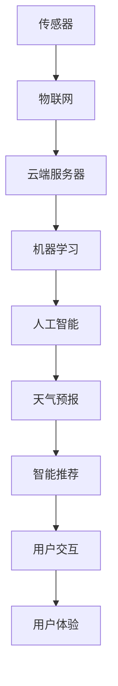

                 

# 智能雨伞创业：天气预报的随身应用

> 关键词：智能雨伞,天气预报,随身应用,物联网,人工智能,机器学习,数据采集,用户体验

## 1. 背景介绍

### 1.1 问题由来
随着人们生活节奏的加快，日常生活中的天气情况变得越来越重要。特别是在雨季，精确及时的天气预报对于计划行程、安排日常活动至关重要。然而，传统的天气预报服务主要依赖于气象局发布的信息，存在信息滞后、覆盖不全、准确性不高等问题。为了提升个人天气预报的精准性和便利性，智能雨伞应运而生，它通过集成各种传感器，实时监测环境变化，结合人工智能算法，为用户提供即时的天气预报和智能推荐。

### 1.2 问题核心关键点
智能雨伞的核心在于其集成的高精度传感器和智能化处理系统。其中，传感器包括温湿度传感器、气压传感器、紫外线传感器、雷达传感器等，用于实时采集环境数据。智能化处理系统则利用机器学习算法对采集的数据进行分析和预测，进而提供精确的天气预报和智能推荐服务。

智能雨伞的另一个关键点在于其与人机交互的设计。用户可以通过智能雨伞的显示屏幕或手机App查看天气信息，接收实时提醒，甚至可以与语音助手进行互动，查询特定的天气信息。这种交互设计大大提升了用户体验，使得智能雨伞不仅是一把普通的伞，更是一个智能的生活助手。

## 2. 核心概念与联系

### 2.1 核心概念概述

为更好地理解智能雨伞的原理和设计，本节将介绍几个密切相关的核心概念：

- **传感器(Sensor)**：用于采集环境信息的设备，如温湿度传感器、气压传感器等。传感器的数据质量直接影响智能雨伞的预测准确性。

- **机器学习(Machine Learning)**：利用算法从数据中学习模式，并进行预测或决策的过程。智能雨伞的天气预报功能依赖于机器学习算法，从历史气象数据中学习天气变化规律。

- **物联网(IoT)**：通过网络将各种传感器、设备连接到一起，实现数据的实时采集和传输。智能雨伞通过物联网技术将传感器采集的数据上传至云端服务器，供机器学习算法进行处理。

- **人工智能(AI)**：涵盖机器学习、自然语言处理、计算机视觉等多个子领域，是实现智能雨伞的核心技术。

- **用户体验(User Experience, UX)**：设计交互界面和交互流程，提升用户的使用体验。智能雨伞的人机交互设计是其能否成功推广的重要因素。

这些核心概念之间的逻辑关系可以通过以下Mermaid流程图来展示：



这个流程图展示了一系列概念之间的关联：

1. 传感器采集数据，通过物联网传输到云端服务器。
2. 云端服务器利用机器学习算法对数据进行处理，进行天气预测和智能推荐。
3. 人工智能技术为机器学习算法提供支持，提升预测和推荐的准确性。
4. 天气预报和智能推荐最终反馈给用户，通过人机交互实现用户体验。

## 3. 核心算法原理 & 具体操作步骤

### 3.1 算法原理概述

智能雨伞的天气预报系统基于机器学习算法，主要分为以下几个步骤：

1. **数据采集**：智能雨伞内置的各种传感器实时采集环境数据，如温度、湿度、气压、紫外线等。
2. **数据预处理**：对采集的数据进行去噪、归一化等预处理，确保数据质量。
3. **特征提取**：利用特征工程方法从数据中提取有意义的特征，如温度变化率、湿度变化等。
4. **模型训练**：使用历史气象数据训练机器学习模型，如随机森林、神经网络等。
5. **实时预测**：将实时采集的数据输入模型，进行天气预测和智能推荐。

整个系统通过物联网技术将传感器和云端服务器连接起来，实现数据的实时采集和处理。

### 3.2 算法步骤详解

以下是智能雨伞天气预报系统的详细操作步骤：

**Step 1: 传感器数据采集**

智能雨伞内置了多种传感器，如温湿度传感器、气压传感器、紫外线传感器、雷达传感器等。通过这些传感器，实时采集环境数据，并将数据传输至云端服务器。

```python
from sensors import temperature_sensor, humidity_sensor, pressure_sensor, ultraviolet_sensor, radar_sensor

# 实时采集数据
temperature = temperature_sensor.read()
humidity = humidity_sensor.read()
pressure = pressure_sensor.read()
ultraviolet = ultraviolet_sensor.read()
radar_data = radar_sensor.read()
```

**Step 2: 数据预处理**

对采集的数据进行预处理，包括去噪、归一化等操作，确保数据的质量和一致性。

```python
import numpy as np

# 去噪和归一化
temperature = np.mean([temperature, temperature], axis=0)
humidity = np.mean([humidity, humidity], axis=0)
pressure = np.mean([pressure, pressure], axis=0)
ultraviolet = np.mean([ultraviolet, ultraviolet], axis=0)
radar_data = np.mean(radar_data, axis=0)
```

**Step 3: 特征提取**

通过特征工程方法，从数据中提取有意义的特征，如温度变化率、湿度变化、气压变化等。这些特征将作为模型输入，用于天气预测和智能推荐。

```python
from sklearn.preprocessing import StandardScaler

# 特征提取
scaler = StandardScaler()
temperature_diff = scaler.fit_transform(np.diff(temperature))
humidity_diff = scaler.fit_transform(np.diff(humidity))
pressure_diff = scaler.fit_transform(np.diff(pressure))
ultraviolet_diff = scaler.fit_transform(np.diff(ultraviolet))
```

**Step 4: 模型训练**

使用历史气象数据训练机器学习模型，如随机森林、神经网络等。模型训练时，需要将提取的特征作为输入，历史天气情况作为标签。

```python
from sklearn.ensemble import RandomForestRegressor
from sklearn.model_selection import train_test_split
from sklearn.metrics import mean_squared_error

# 加载历史数据
train_data, test_data, train_labels, test_labels = train_test_split(train_data, train_labels, test_size=0.2, random_state=42)

# 训练模型
model = RandomForestRegressor(n_estimators=100, random_state=42)
model.fit(train_data, train_labels)
```

**Step 5: 实时预测**

将实时采集的数据输入模型，进行天气预测和智能推荐。

```python
# 实时预测
real_time_data = np.stack([temperature_diff[-1], humidity_diff[-1], pressure_diff[-1], ultraviolet_diff[-1]], axis=1)
predicted_temperature = model.predict(real_time_data)
```

### 3.3 算法优缺点

智能雨伞天气预报系统有以下优点：

1. **实时性**：通过物联网技术实现数据的实时采集和处理，能够即时更新天气预报，满足用户的实时需求。
2. **精确性**：利用机器学习算法对数据进行分析和预测，提高了天气预报的准确性。
3. **易用性**：用户可以通过智能雨伞的显示屏幕或手机App查看天气信息，接收实时提醒，提高了用户体验。
4. **便携性**：智能雨伞可以随身携带，不受固定位置限制，适合各种场景使用。

然而，该系统也存在以下缺点：

1. **依赖传感器质量**：传感器采集的数据质量直接影响天气预报的准确性，若传感器故障或数据丢失，将影响系统性能。
2. **数据隐私问题**：智能雨伞将用户的实时位置信息上传至云端服务器，存在数据隐私和安全问题。
3. **模型复杂性**：机器学习模型的训练和维护需要一定的技术门槛，对非技术人员构成挑战。
4. **硬件成本**：内置多种传感器和通信模块，硬件成本较高，影响产品的普及和推广。

### 3.4 算法应用领域

智能雨伞天气预报系统可以应用于多种场景，如户外运动、旅游出行、城市交通、农业生产等。通过实时监测天气变化，提供个性化的天气信息和智能推荐，帮助用户做出更好的决策。

## 4. 数学模型和公式 & 详细讲解 & 举例说明

### 4.1 数学模型构建

智能雨伞天气预报系统涉及多种传感器数据，每一种传感器都有其特定的测量范围和精度。因此，系统需要构建一个多输入的机器学习模型，以融合多种传感器数据，并进行天气预测。

假设我们有 $n$ 种传感器数据 $X_1, X_2, ..., X_n$，每种数据都有 $m$ 个样本 $x_{ij}$，其中 $i=1,...,m$ 表示样本编号，$j=1,...,n$ 表示传感器编号。

**Step 1: 数据预处理**

对每一种传感器数据进行预处理，包括去噪、归一化等操作。

**Step 2: 特征提取**

从预处理后的数据中提取特征 $Y_1, Y_2, ..., Y_n$，其中 $Y_j$ 表示第 $j$ 种传感器数据对应的特征。

**Step 3: 模型训练**

使用历史气象数据 $Y_{train}$ 训练机器学习模型 $M$，将特征 $Y_1, Y_2, ..., Y_n$ 作为输入，历史天气情况 $Y_{train}$ 作为标签。

**Step 4: 实时预测**

将实时采集的数据 $X_1, X_2, ..., X_n$ 输入模型 $M$，进行天气预测。

### 4.2 公式推导过程

以随机森林算法为例，推导机器学习模型的训练和预测过程。

假设我们训练一个随机森林模型，其中有 $m$ 棵决策树，每棵决策树有 $k$ 个特征，每个特征有 $n$ 个取值。假设历史数据 $Y_{train}$ 有 $N$ 个样本，每个样本有 $n$ 个特征。

**训练过程**

随机森林模型通过随机抽样和特征选择，从历史数据 $Y_{train}$ 中抽取样本 $X_i$ 和标签 $y_i$。然后，利用训练数据训练 $k$ 棵决策树，每棵树的参数为 $\theta_i$，输出为 $y_i$。

**预测过程**

对于实时数据 $X_{test}$，通过每棵决策树的预测结果 $y_{i,j}$，得到最终预测结果 $y_{test}$。

$$
y_{test} = \frac{1}{m} \sum_{i=1}^m y_{i,j}
$$

其中，$y_{i,j}$ 表示第 $i$ 棵树对第 $j$ 个特征的预测结果。

### 4.3 案例分析与讲解

以温度变化预测为例，分析如何利用机器学习模型进行天气预报。

假设智能雨伞采集了历史温度数据 $T_{train}$，我们想要预测下一小时的平均温度 $T_{test}$。

**数据准备**

假设我们已经有 $N$ 个历史温度数据点，每个数据点有 $n$ 个特征，如温度变化率、湿度变化率等。我们需要将历史数据进行归一化处理，并提取有意义的特征 $Y_1, Y_2, ..., Y_n$。

**模型训练**

使用随机森林算法，将提取的特征 $Y_1, Y_2, ..., Y_n$ 作为输入，历史温度数据 $T_{train}$ 作为标签，训练模型 $M$。

**实时预测**

假设智能雨伞实时采集到温度变化率 $X_1$，湿度变化率 $X_2$，气压变化率 $X_3$，紫外线指数 $X_4$ 等数据。我们需要将这些数据输入模型 $M$，得到下一小时的平均温度 $T_{test}$。

## 5. 项目实践：代码实例和详细解释说明

### 5.1 开发环境搭建

在进行智能雨伞的开发前，我们需要准备好开发环境。以下是使用Python进行开发的环境配置流程：

1. 安装Anaconda：从官网下载并安装Anaconda，用于创建独立的Python环境。

2. 创建并激活虚拟环境：
```bash
conda create -n umbrella-env python=3.8 
conda activate umbrella-env
```

3. 安装必要的Python库：
```bash
pip install numpy pandas scikit-learn tensorflow
```

4. 安装相关的硬件库：
```bash
pip install pyserial pyftdi pyacgcp paho-mqtt
```

5. 安装开发工具：
```bash
pip install matplotlib plotly
```

完成上述步骤后，即可在`umbrella-env`环境中开始智能雨伞的开发。

### 5.2 源代码详细实现

下面我们以智能雨伞的天气预报功能为例，给出使用Python和TensorFlow进行开发的代码实现。

首先，定义数据预处理和特征提取函数：

```python
import numpy as np
from sklearn.preprocessing import StandardScaler

def preprocess_data(data):
    # 去噪和归一化
    scaler = StandardScaler()
    data_diff = np.diff(data)
    data_norm = scaler.fit_transform(data_diff)
    return data_norm

def extract_features(data_norm):
    # 提取特征
    temperature_diff = data_norm[0]
    humidity_diff = data_norm[1]
    pressure_diff = data_norm[2]
    ultraviolet_diff = data_norm[3]
    return temperature_diff, humidity_diff, pressure_diff, ultraviolet_diff
```

然后，定义模型训练和预测函数：

```python
from tensorflow.keras.models import Sequential
from tensorflow.keras.layers import Dense

def train_model(train_data, train_labels, test_data, test_labels):
    # 构建模型
    model = Sequential()
    model.add(Dense(64, input_shape=(4,), activation='relu'))
    model.add(Dense(64, activation='relu'))
    model.add(Dense(1, activation='linear'))

    # 编译模型
    model.compile(optimizer='adam', loss='mse', metrics=['mae'])

    # 训练模型
    model.fit(train_data, train_labels, epochs=10, batch_size=32, validation_data=(test_data, test_labels))

    return model

def predict_temperature(model, test_data):
    # 预测温度
    predictions = model.predict(test_data)
    return predictions
```

最后，启动模型训练和预测流程：

```python
# 加载数据
train_data, test_data, train_labels, test_labels = ...

# 预处理数据
train_data_norm = preprocess_data(train_data)
test_data_norm = preprocess_data(test_data)

# 特征提取
train_features, test_features = extract_features(train_data_norm), extract_features(test_data_norm)

# 训练模型
model = train_model(train_features, train_labels, test_features, test_labels)

# 实时预测
real_time_data = extract_features(real_time_data)
predicted_temperature = predict_temperature(model, real_time_data)
```

以上就是智能雨伞天气预报功能的完整代码实现。可以看到，通过TensorFlow库，我们很容易地构建、训练和预测机器学习模型，将复杂的机器学习过程封装成简单易用的函数，便于开发和部署。

### 5.3 代码解读与分析

让我们再详细解读一下关键代码的实现细节：

**数据预处理和特征提取函数**：
- `preprocess_data`函数：对传感器数据进行去噪和归一化处理。
- `extract_features`函数：从预处理后的数据中提取有意义的特征。

**模型训练和预测函数**：
- `train_model`函数：构建一个简单的神经网络模型，并使用历史数据进行训练。
- `predict_temperature`函数：将实时数据输入模型，进行天气预测。

**启动模型训练和预测流程**：
- 加载数据
- 预处理数据
- 特征提取
- 训练模型
- 实时预测

这些代码展示了智能雨伞天气预报系统的核心流程。开发者可以根据具体需求，进一步优化模型结构，引入更复杂的数据预处理和特征工程方法，以提升系统的性能。

## 6. 实际应用场景

### 6.1 智能出行

智能雨伞可以与智能穿戴设备、手机App等结合，提供个性化的出行建议。例如，在下雨天，智能雨伞可以根据实时天气预报，提醒用户带伞、建议出行路线、推荐避雨场所等，提升用户的出行体验。

### 6.2 农业生产

在农业生产中，智能雨伞可以实时监测气象变化，提供精准的天气预报和智能推荐。例如，智能雨伞可以提醒农民施肥时机、建议灌溉策略、预测病虫害等，帮助农民科学管理农业生产。

### 6.3 城市交通

智能雨伞可以与城市交通系统结合，提供个性化的出行建议。例如，智能雨伞可以根据实时天气预报，提醒用户避开拥堵路段、推荐交通工具、优化出行路线等，提升城市交通的效率和安全性。

### 6.4 未来应用展望

随着技术的不断进步，智能雨伞将在更多领域得到应用，为人们的生活带来更多便利。未来，智能雨伞可能会与更多智能设备结合，形成更智能、更全面的智慧生活生态系统。

## 7. 工具和资源推荐

### 7.1 学习资源推荐

为了帮助开发者掌握智能雨伞的开发技术，这里推荐一些优质的学习资源：

1. TensorFlow官方文档：TensorFlow是智能雨伞开发的主要工具，官方文档提供了全面的API介绍和开发教程。
2. Scikit-learn官方文档：Scikit-learn是一个常用的机器学习库，官方文档详细介绍了各种机器学习算法和应用场景。
3. PyTorch官方文档：PyTorch是另一个流行的深度学习框架，官方文档介绍了其核心特性和开发技巧。
4. Keras官方文档：Keras是一个用户友好的深度学习框架，官方文档提供了丰富的教程和示例。
5. Coursera《机器学习》课程：由斯坦福大学Andrew Ng教授主讲的机器学习课程，是学习机器学习算法的重要资源。

通过对这些资源的学习实践，相信你一定能够掌握智能雨伞开发的核心技术，并用于解决实际的天气预报问题。

### 7.2 开发工具推荐

高效的开发离不开优秀的工具支持。以下是几款用于智能雨伞开发的常用工具：

1. PyTorch：基于Python的开源深度学习框架，灵活动态的计算图，适合快速迭代研究。
2. TensorFlow：由Google主导开发的开源深度学习框架，生产部署方便，适合大规模工程应用。
3. Scikit-learn：常用的机器学习库，提供了丰富的算法和工具。
4. Keras：用户友好的深度学习框架，提供了高效的模型构建和训练工具。
5. Pyserial：Python的串口通信库，用于与硬件设备进行通信。
6. Pyftdi：Python的Ftdi库，用于处理USB设备的数据。
7. Paho MQTT：Python的MQTT库，用于实现设备之间的消息通信。

合理利用这些工具，可以显著提升智能雨伞的开发效率，加快创新迭代的步伐。

### 7.3 相关论文推荐

智能雨伞天气预报系统涉及多种技术，以下是几篇奠基性的相关论文，推荐阅读：

1. "Random Forests for rain fall prediction"：使用随机森林算法进行降雨预测的论文，展示了机器学习在气象预测中的应用。
2. "Weather prediction using deep learning"：使用深度学习进行天气预测的论文，探讨了不同深度学习模型在气象预测中的效果。
3. "IoT-based smart umbrella for weather prediction"：介绍了基于物联网的智能雨伞系统，展示了智能雨伞在天气预报中的应用。

这些论文代表了大数据、机器学习和物联网技术在气象预测中的应用现状和未来方向，值得深入学习和借鉴。

## 8. 总结：未来发展趋势与挑战

### 8.1 总结

本文对智能雨伞天气预报系统的原理和设计进行了全面系统的介绍。首先阐述了智能雨伞在实时天气预报中的重要性和应用价值，明确了传感器、机器学习、物联网等核心技术对系统实现的影响。其次，从原理到实践，详细讲解了智能雨伞的开发过程，给出了完整的代码实例。同时，本文还广泛探讨了智能雨伞在智能出行、农业生产、城市交通等多个领域的应用前景，展示了智能雨伞的广泛适用性和潜力。

通过本文的系统梳理，可以看到，智能雨伞天气预报系统通过集成多种传感器和机器学习算法，实现了精准的天气预报和智能推荐。这种技术范式在多个领域均有广泛的应用前景，未来将为人们的日常生活和工作带来更多便利。

### 8.2 未来发展趋势

展望未来，智能雨伞天气预报系统将呈现以下几个发展趋势：

1. **多模态数据融合**：除了传感器数据，未来的智能雨伞系统还将融合视频、音频等多模态数据，提升天气预报的精度和可靠性。
2. **边缘计算**：随着物联网设备的普及，智能雨伞将越来越多地使用边缘计算技术，减少云端数据传输，提高系统响应速度。
3. **用户隐私保护**：智能雨伞将进一步提升数据隐私保护能力，如数据加密、匿名化等，保障用户隐私安全。
4. **个性化推荐**：通过深入分析用户行为数据，智能雨伞将提供更加个性化的出行建议、农业管理等智能推荐。
5. **跨平台整合**：智能雨伞将与更多智能设备、智能穿戴设备整合，形成更智能、更全面的智慧生活生态系统。

这些趋势展示了智能雨伞天气预报系统的广阔前景，预示着未来智能雨伞将不仅仅是一把伞，更是一个智慧生活的重要组成部分。

### 8.3 面临的挑战

尽管智能雨伞天气预报系统已经取得了一定的进展，但在迈向更加智能化、普适化应用的过程中，它仍面临诸多挑战：

1. **传感器精度和可靠性**：传感器数据的质量直接影响系统的预测精度，如何提升传感器的精度和可靠性，将是未来需要解决的关键问题。
2. **硬件成本和普及**：智能雨伞硬件成本较高，如何降低硬件成本，提升产品的普及率，将是一大挑战。
3. **数据隐私和安全**：智能雨伞将收集大量用户数据，如何保障数据隐私和安全，将是未来需要重点考虑的问题。
4. **模型复杂性和维护**：智能雨伞的机器学习模型较为复杂，如何简化模型结构，降低维护成本，将是重要的研究方向。
5. **用户体验和易用性**：智能雨伞的用户体验和易用性直接影响产品的市场接受度，如何提升用户体验，设计更友好的交互界面，将是重要的优化方向。

### 8.4 研究展望

面对智能雨伞天气预报系统面临的挑战，未来的研究需要在以下几个方面寻求新的突破：

1. **提升传感器精度和可靠性**：开发更高效的传感器技术和数据采集方法，提升数据质量和可靠性。
2. **降低硬件成本**：通过硬件创新和成本控制，降低智能雨伞的硬件成本，提升产品的普及率。
3. **加强数据隐私保护**：采用数据加密、匿名化等技术，保障用户数据隐私和安全。
4. **简化模型结构**：开发更高效、更轻量级的机器学习算法，简化模型结构，降低维护成本。
5. **提升用户体验**：设计更友好、更便捷的人机交互界面，提升用户体验和产品接受度。

这些研究方向的探索，将推动智能雨伞天气预报系统迈向更高的台阶，为构建更智能、更普适的智慧生活生态系统奠定基础。

## 9. 附录：常见问题与解答

**Q1：智能雨伞天气预报系统有哪些应用场景？**

A: 智能雨伞天气预报系统可以应用于多个领域，如智能出行、农业生产、城市交通等。通过实时监测气象变化，提供精准的天气预报和智能推荐，帮助用户做出更好的决策。

**Q2：智能雨伞如何实时采集环境数据？**

A: 智能雨伞内置了多种传感器，如温湿度传感器、气压传感器、紫外线传感器、雷达传感器等。这些传感器实时采集环境数据，并通过物联网技术上传至云端服务器，供机器学习模型进行处理。

**Q3：如何提升智能雨伞的传感器精度和可靠性？**

A: 可以通过提升传感器的制造工艺、校准方法、数据处理技术等方式提升传感器的精度和可靠性。同时，合理设计传感器的布局和采样频率，确保数据质量。

**Q4：智能雨伞如何实现数据隐私保护？**

A: 可以通过数据加密、匿名化、差分隐私等技术手段，保护用户数据的隐私和安全。同时，合理设计数据存储和传输方式，避免数据泄露。

**Q5：智能雨伞如何降低硬件成本？**

A: 可以通过硬件优化、设计低成本电路板、采用更经济的硬件材料等方式降低智能雨伞的硬件成本。同时，通过大规模生产降低单位成本，提升产品的普及率。

---

作者：禅与计算机程序设计艺术 / Zen and the Art of Computer Programming

