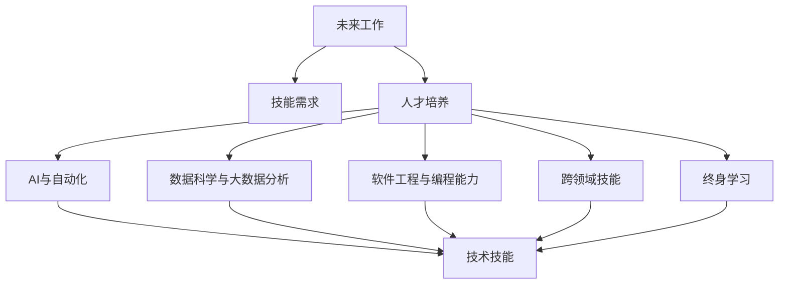

                 

# 未来工作：技能需求与培养

> 关键词：未来工作，技能需求，人才培养，人工智能，机器学习，数据科学，软件工程，跨领域技能

## 1. 背景介绍

### 1.1 问题由来

随着科技的快速发展，特别是人工智能(AI)、大数据、云计算等技术的兴起，未来工作的技能需求正在发生巨大的变化。传统的以手工操作为主的岗位逐渐被自动化和智能系统取代，而新的AI、数据科学等岗位不断涌现。这对劳动者的技能结构提出了新的要求，也给教育体系带来了挑战。

### 1.2 问题核心关键点

- **AI与自动化技术**：机器学习和自动化技术正在改变各行各业的工作方式，对劳动者提出了新的技能要求。
- **数据科学与大数据分析**：数据驱动的决策和分析能力成为企业竞争的关键。
- **软件工程与编程能力**：编程能力、软件工程知识在各类岗位上需求增加。
- **跨领域技能**：人工智能与各行业的融合，要求劳动者具备跨学科的复合能力。
- **终身学习**：技能更新速度快，劳动者需要具备持续学习的能力。

### 1.3 问题研究意义

研究未来工作的技能需求与培养，对于构建适应新经济形态的教育体系，提升劳动者的竞争力，推动社会经济结构的转型，具有重要的意义：

- **教育改革**：明确未来工作所需的技能，推动教育体系的改革，培养出符合未来需求的劳动者。
- **职业规划**：为劳动者提供明确的职业发展路径，帮助其规划学习内容和职业路径。
- **企业培训**：帮助企业识别并培养适应未来需求的员工，提升企业竞争力。
- **政策制定**：为政策制定者提供依据，制定更加符合未来发展趋势的教育和就业政策。

## 2. 核心概念与联系

### 2.1 核心概念概述

为了更好地理解未来工作的技能需求与培养，本节将介绍几个关键概念：

- **未来工作**：指利用新技术和新方法完成的工作，通常包括自动化、AI、数据科学、软件工程等领域的岗位。
- **技能需求**：指未来工作中所需的技能集合，包括技术技能、软技能、跨领域技能等。
- **人才培养**：指通过教育、培训等方式，使劳动者具备未来工作所需的技能和知识。
- **AI与自动化**：指使用机器学习、自然语言处理、计算机视觉等技术，实现工作自动化和智能化。
- **数据科学与大数据分析**：指使用数据驱动的方法，进行数据分析、数据挖掘、机器学习等。
- **软件工程与编程能力**：指编程、软件开发、系统设计等技能，是构建智能系统和软件的基础。
- **跨领域技能**：指不同学科和领域的知识、技能的融合，如AI与医疗、金融、教育等行业的结合。
- **终身学习**：指在职业生涯中持续学习新技能，保持知识和技能的更新。

这些核心概念之间的逻辑关系可以通过以下Mermaid流程图来展示：



这个流程图展示了一系列核心概念及其相互关系：

1. 未来工作定义了劳动力市场的新需求。
2. 技能需求是对未来工作的具体技能要求。
3. 人才培养是满足未来工作需求的教育和培训过程。
4. AI与自动化、数据科学与大数据分析、软件工程与编程能力等技术技能，是未来工作的重要组成部分。
5. 跨领域技能和终身学习则是提升劳动者适应能力的关键。

这些概念共同构成了未来工作的框架，帮助我们理解技能需求和人才培养的方向。

## 3. 核心算法原理 & 具体操作步骤
### 3.1 算法原理概述

未来工作技能需求的确定，通常依赖于对当前及未来经济和技术趋势的分析，以及对劳动市场变化的研究。具体步骤包括：

- **数据收集与分析**：收集当前及未来经济数据、技术发展趋势、劳动市场变化等，分析未来工作岗位的需求和技能要求。
- **技能映射**：将未来工作所需的技能映射到现有的教育体系中，确定哪些技能需要增加或更新。
- **人才培养策略制定**：根据技能映射结果，制定人才培养策略，包括课程设计、培训计划、职业指导等。
- **政策支持**：政府和企业提供政策支持，推动教育体系改革，支持终身学习，提供职业发展机会。

### 3.2 算法步骤详解

基于以上原理，未来工作的技能需求与培养可以分为以下几个关键步骤：

**Step 1: 数据收集与分析**
- 收集当前和未来的经济数据、技术发展趋势、劳动市场需求等，进行全面分析。
- 分析未来工作岗位的增长和变化，预测未来岗位需求。
- 分析未来工作的技能需求，确定关键技能和知识。

**Step 2: 技能映射**
- 将未来工作的关键技能与现有教育体系中的课程和培训项目进行映射。
- 识别教育体系中缺失或需要更新的技能和知识。
- 根据技能映射结果，调整课程内容和培训计划。

**Step 3: 人才培养策略制定**
- 制定适应未来工作需求的课程设计，如引入AI、数据科学、软件工程等课程。
- 设计针对不同岗位的培训计划，提升劳动者技能。
- 制定职业指导和职业发展规划，帮助劳动者明确职业路径。

**Step 4: 政策支持**
- 政府和企业提供政策支持，推动教育体系改革，提升教育质量和资源。
- 提供终身学习机会，如在线课程、职业培训、技能认证等。
- 建立职业发展平台，支持劳动者不断学习新技能，适应未来工作。

### 3.3 算法优缺点

未来工作技能需求与培养的方法具有以下优点：

1. **系统性**：通过数据收集和分析，系统地识别未来工作的技能需求，避免主观判断偏差。
2. **前瞻性**：提前识别未来工作的变化趋势，为教育体系和人才培养提供方向。
3. **灵活性**：能够快速响应技术变化，及时调整课程内容和培训计划。

同时，也存在一些局限性：

1. **数据质量**：分析结果依赖于数据的质量和全面性，存在数据偏差和遗漏的风险。
2. **政策挑战**：需要政府和企业的广泛合作，才能提供有效的政策支持。
3. **学习负担**：终身学习需要投入大量时间和资源，对劳动者提出高要求。
4. **跨学科挑战**：跨领域技能的培养涉及多个学科的融合，需要更复杂的教育资源和师资力量。

尽管存在这些局限性，但总体而言，基于数据驱动的方法是识别和培养未来工作技能需求的有力手段。

### 3.4 算法应用领域

未来工作技能需求与培养的方法在多个领域得到了应用，例如：

- **教育系统**：推动教育体系改革，引入新技术课程，提升学生技能。
- **企业培训**：帮助企业识别和培养未来需求的技能，提升员工竞争力。
- **政府政策制定**：制定针对未来工作的教育政策，推动技能人才培养。
- **职业指导**：为劳动者提供职业发展规划，帮助其选择适合未来工作的岗位。

此外，这些方法也在社会培训、终身学习、跨学科教育等领域发挥了重要作用。

## 4. 数学模型和公式 & 详细讲解 & 举例说明

### 4.1 数学模型构建

为了更好地理解和应用未来工作技能需求与培养的方法，本节将使用数学语言对关键过程进行建模。

假设当前和未来的经济数据为 $X$，技术发展趋势为 $Y$，劳动市场需求为 $D$，技能需求为 $S$。则未来工作技能需求与培养的数学模型可以表示为：

$$
S = f(X, Y, D)
$$

其中 $f$ 为映射函数，将输入数据映射为技能需求。

### 4.2 公式推导过程

以数据驱动的技能映射为例，推导其数学模型。

设当前和未来的经济数据为 $X_i$，技术发展趋势为 $Y_j$，劳动市场需求为 $D_k$，技能需求为 $S_{ijk}$。则数据驱动的技能映射模型可以表示为：

$$
S_{ijk} = w_{ijk} \cdot X_i + b_{ijk} + \epsilon_{ijk}
$$

其中 $w_{ijk}$ 为权重，$b_{ijk}$ 为偏置，$\epsilon_{ijk}$ 为误差项。

通过对大量数据进行训练，可以拟合出 $w_{ijk}$ 和 $b_{ijk}$，从而预测未来工作的技能需求 $S_{ijk}$。

### 4.3 案例分析与讲解

以AI与自动化技术为例，分析其技能需求与人才培养。

- **技能需求分析**：通过数据分析，确定AI与自动化技术的技能需求，如编程语言、机器学习算法、自动化工具等。
- **技能映射**：将技能需求映射到现有教育体系中的课程和培训项目中，识别缺失或需要更新的技能。
- **人才培养策略**：制定适应AI与自动化技术需求的课程设计，如引入Python、TensorFlow等课程，提供相关的实习和项目经验。
- **政策支持**：政府和企业提供政策支持，推动AI与自动化技术的教育和培训发展。

## 5. 项目实践：代码实例和详细解释说明
### 5.1 开发环境搭建

在进行未来工作技能需求与培养的实践前，我们需要准备好开发环境。以下是使用Python进行数据分析和建模的环境配置流程：

1. 安装Anaconda：从官网下载并安装Anaconda，用于创建独立的Python环境。

2. 创建并激活虚拟环境：
```bash
conda create -n py3k python=3.8 
conda activate py3k
```

3. 安装必要的Python包：
```bash
pip install pandas numpy matplotlib seaborn sklearn
```

4. 安装Jupyter Notebook：
```bash
pip install jupyterlab
```

完成上述步骤后，即可在`py3k`环境中开始数据分析和建模实践。

### 5.2 源代码详细实现

下面以数据驱动的技能映射为例，给出使用Python和Scikit-learn库进行建模的代码实现。

首先，准备数据：

```python
import pandas as pd

# 准备数据
data = pd.read_csv('skill_data.csv')

# 数据预处理
data.dropna(inplace=True)
data.fillna(method='ffill', inplace=True)
```

然后，构建模型：

```python
from sklearn.linear_model import LinearRegression
from sklearn.metrics import mean_squared_error

# 训练模型
X = data[['X1', 'X2', 'X3']]
y = data['Y']
model = LinearRegression()
model.fit(X, y)

# 预测技能需求
new_data = pd.read_csv('new_skill_data.csv')
X_new = new_data[['X1', 'X2', 'X3']]
predictions = model.predict(X_new)

# 评估模型
mse = mean_squared_error(y, predictions)
print(f'Mean Squared Error: {mse}')
```

在以上代码中，我们使用了线性回归模型来预测技能需求，并使用均方误差评估模型的预测效果。通过这样的代码实现，可以动态地调整模型参数，优化预测效果。

### 5.3 代码解读与分析

让我们再详细解读一下关键代码的实现细节：

**数据准备与预处理**：
- `data.dropna()`：删除含有缺失值的行。
- `data.fillna(method='ffill')`：用前一行的值填充缺失值。

**模型构建与训练**：
- `LinearRegression()`：使用线性回归模型。
- `model.fit(X, y)`：训练模型，将特征 `X` 映射到目标变量 `y`。

**预测与评估**：
- `predictions = model.predict(X_new)`：使用模型进行预测。
- `mean_squared_error(y, predictions)`：计算预测值与真实值之间的均方误差。

通过以上代码实现，可以看出使用Python和Scikit-learn进行数据分析和建模的便捷性。开发者可以根据具体需求，进一步扩展模型的应用场景和复杂度。

## 6. 实际应用场景

### 6.1 教育系统

未来工作技能需求与培养的方法在教育系统中有着广泛的应用。传统教育体系往往难以跟上技术发展的步伐，导致毕业生技能与市场需求不匹配。通过引入数据驱动的技能映射，教育系统可以更好地适应技术变化，培养出符合未来工作需求的毕业生。

具体措施包括：

- **课程更新**：根据技能需求，及时更新和引入新的课程内容，如AI、数据科学、软件工程等。
- **实践项目**：提供实际的实践项目，增强学生的动手能力和项目经验。
- **职业指导**：提供职业发展指导，帮助学生明确职业路径，选择适合的职业方向。

### 6.2 企业培训

企业作为技术应用的直接受益者，也面临着未来工作技能需求与培养的挑战。通过引入技能映射和人才培养策略，企业可以更好地培养员工的未来工作能力，提升整体竞争力。

具体措施包括：

- **技能培训**：根据未来工作需求，设计针对性的技能培训计划，提升员工技能。
- **职业发展规划**：为员工提供职业发展规划，帮助其明确职业路径，制定学习计划。
- **终身学习支持**：提供终身学习机会，如在线课程、职业培训等，鼓励员工持续学习。

### 6.3 政府政策制定

政府在推动技能人才培养中扮演着重要角色。通过制定适应未来工作的教育政策，政府可以有效提升劳动者的技能水平，促进经济社会发展。

具体措施包括：

- **政策引导**：制定相关政策，引导教育体系和培训市场的发展方向。
- **资金支持**：提供资金支持，推动教育改革和技能培训。
- **公共服务**：提供公共培训服务，支持劳动者的技能提升。

## 7. 工具和资源推荐

### 7.1 学习资源推荐

为了帮助开发者系统掌握未来工作技能需求与培养的理论基础和实践技巧，这里推荐一些优质的学习资源：

1. **Coursera《未来工作技能》课程**：由知名学者和专家开设，涵盖未来工作所需的关键技能，如AI、数据科学、软件工程等。
2. **edX《大数据与分析》课程**：提供大数据和数据分析的深入学习，帮助理解数据驱动的方法。
3. **Kaggle《机器学习与数据科学》竞赛**：通过实际数据竞赛，提升技能和项目经验。
4. **Udacity《人工智能工程》纳米学位**：提供系统的AI教育，涵盖AI和机器学习的应用。
5. **MIT OpenCourseWare《计算机科学与数据科学》课程**：提供高质量的计算机科学和数据科学课程，帮助理解基础理论和实践方法。

通过对这些资源的学习实践，相信你一定能够系统地掌握未来工作的技能需求与培养的方法，为未来的职业发展奠定坚实的基础。

### 7.2 开发工具推荐

高效的开发离不开优秀的工具支持。以下是几款用于未来工作技能需求与培养开发的常用工具：

1. **Jupyter Notebook**：开源的交互式编程环境，支持Python等多种编程语言，便于数据可视化、代码调试和文档记录。
2. **R语言**：广泛用于数据分析和统计建模，提供丰富的数据处理和可视化库。
3. **Tableau**：数据可视化工具，支持快速生成图表和报告。
4. **TensorFlow和PyTorch**：用于机器学习和深度学习的开源框架，支持高效的数据处理和模型训练。
5. **Git和GitHub**：版本控制和代码托管平台，便于团队协作和代码管理。

合理利用这些工具，可以显著提升未来工作技能需求与培养的开发效率，加快技能培养的步伐。

### 7.3 相关论文推荐

未来工作技能需求与培养的研究涉及多个领域，以下是几篇奠基性的相关论文，推荐阅读：

1. **"Deep Learning for AI and Business" by Ian Goodfellow**：探讨深度学习在AI和商业应用中的关键作用，提供理论基础和实践指导。
2. **"Future of Work: Trends and Technology Implications" by Deloitte**：分析未来工作趋势，提出技术驱动的解决方案。
3. **"Human-Centered Data Science" by Ross Müller**：强调数据科学的人文关怀，探讨如何提升技能培训的适应性。
4. **"Artificial Intelligence and the Future of Work" by McKinsey Global Institute**：分析AI对未来工作的影响，提出技能培养的建议。
5. **"Skills and Jobs in the Digital Economy" by WEF**：研究数字经济中的技能需求，提出教育体系改革的策略。

这些论文代表了大工作技能需求与培养的研究方向，通过学习这些前沿成果，可以帮助研究者把握学科前进方向，激发更多的创新灵感。

## 8. 总结：未来发展趋势与挑战

### 8.1 总结

本文对未来工作的技能需求与培养进行了全面系统的介绍。首先阐述了未来工作的技能需求，明确了教育体系改革的方向。其次，从原理到实践，详细讲解了技能映射、人才培养策略制定等关键步骤，给出了技能需求与培养的代码实例。同时，本文还广泛探讨了未来工作在教育系统、企业培训、政府政策等多个领域的应用前景，展示了未来工作的广阔前景。此外，本文精选了技能需求与培养的学习资源，力求为读者提供全方位的技术指引。

通过本文的系统梳理，可以看到，未来工作的技能需求与培养正成为教育体系和人才培养的重要课题。这些方向的研究和实践，将对劳动者的就业和发展产生深远影响，也将推动社会经济的持续发展。

### 8.2 未来发展趋势

展望未来，未来工作的技能需求与培养将呈现以下几个发展趋势：

1. **技术融合加速**：AI、数据科学、软件工程等技术将深度融合，形成新的技能需求。
2. **终身学习普及**：终身学习成为常态，终身教育体系不断完善。
3. **跨学科技能需求增加**：跨学科技能的需求将显著增加，如AI与医疗、金融等行业的结合。
4. **政策支持加强**：政府和企业将加大对未来工作技能培养的支持力度。
5. **个性化培养发展**：个性化学习路径和职业指导将更加普及。
6. **全球化合作深化**：国际合作和经验交流将推动技能培养的标准化。

以上趋势凸显了未来工作技能需求与培养的广阔前景。这些方向的探索发展，将进一步提升教育体系和培训市场的适应性，为劳动者提供更好的职业发展机会。

### 8.3 面临的挑战

尽管未来工作技能需求与培养的研究取得了不少进展，但仍面临诸多挑战：

1. **数据质量问题**：数据收集和分析依赖于高质量的数据，存在数据偏差和遗漏的风险。
2. **教育资源不均**：不同地区和学校的教育资源存在差异，难以实现统一的技能培养标准。
3. **师资力量不足**：跨学科技能培养需要更多具备交叉学科知识的教师，师资力量不足。
4. **技能更新速度快**：技术更新迭代快，技能需求变化快，劳动者需要持续学习以跟上新趋势。
5. **政策支持力度有限**：政府和企业对技能培养的支持力度有限，难以全面实施。

尽管存在这些挑战，但通过多方协同努力，未来工作技能需求与培养仍有很大的发展空间。

### 8.4 研究展望

面向未来，未来工作技能需求与培养的研究需要在以下几个方面寻求新的突破：

1. **数据驱动分析**：进一步提升数据收集和分析的准确性和全面性，为技能映射提供更可靠的基础。
2. **个性化学习路径**：开发智能学习平台，提供个性化的学习路径和职业指导，提升学习效果。
3. **跨学科教学方法**：开发跨学科的教学方法和教材，提升学生的综合能力。
4. **政策制定创新**：创新政策支持方式，推动教育体系和培训市场的改革。
5. **全球化合作**：加强国际合作，分享经验和技术，提升全球技能培养的标准化水平。

这些研究方向的探索，必将推动未来工作技能需求与培养的进一步发展，为构建人机协同的智能时代提供坚实的基础。

## 9. 附录：常见问题与解答

**Q1：如何应对未来工作技能需求的变化？**

A: 持续监测技术发展趋势和市场变化，及时更新技能培训内容。引入终身学习机制，鼓励劳动者持续学习新技能。

**Q2：技能需求预测的准确性如何提升？**

A: 增加数据收集的全面性和多样性，提升数据的代表性和真实性。引入多模型融合和 ensemble 方法，提高预测的准确性。

**Q3：数据驱动的技能映射如何克服数据偏差？**

A: 采用多种数据来源，增加数据的代表性。进行数据清洗和预处理，减少数据偏差。使用多种模型进行验证和比较，提高预测的鲁棒性。

**Q4：如何提高教育资源的均衡性？**

A: 政府和企业共同投入，推动教育资源的均衡配置。采用远程教育和在线课程，弥补资源不足的问题。

**Q5：未来工作技能需求与培养的实施难度如何降低？**

A: 制定明确的实施方案和步骤，确保各环节的协调和配合。引入技术工具，提高技能培养的效率和效果。

---

作者：禅与计算机程序设计艺术 / Zen and the Art of Computer Programming

