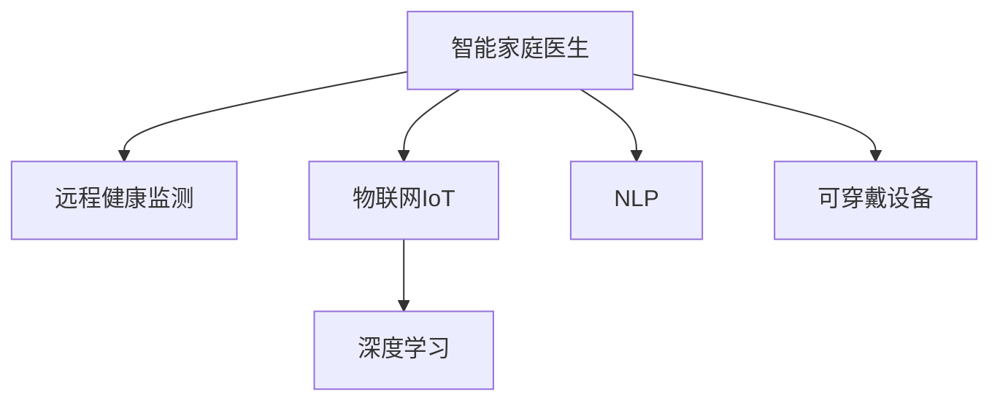

                 

# 未来的智慧养老：2050年的智能家庭医生与远程健康监测

在探索未来的智慧养老的过程中，智能家庭医生和远程健康监测扮演着至关重要的角色。这两者不仅能够提供精准的医疗服务，还能确保老年人获得持续的健康保障。以下将深入探讨智能家庭医生和远程健康监测的核心概念、技术实现、数学模型，并展望其未来的应用前景。

## 1. 背景介绍

### 1.1 问题由来
随着全球人口老龄化加速，老年人的健康护理需求日益增长。传统的医疗模式难以满足老年人便捷、个性化的医疗需求，需要借助新技术提供更好的医疗服务。

智能家庭医生和远程健康监测系统是响应这一需求的新兴技术。通过智能家居设备、可穿戴设备和移动互联网，结合先进的医疗技术，可以构建一个全方位、全过程的健康监测与护理体系。这种智能化的医疗服务能够有效提升老年人的生活质量和健康水平。

### 1.2 问题核心关键点
智能家庭医生和远程健康监测的核心关键点包括：
- 数据采集与处理：通过智能传感器、可穿戴设备等采集老年人的生理参数和行为数据，并进行实时分析。
- 模型训练与推理：利用机器学习和深度学习技术，构建健康监测模型，预测和诊断健康问题。
- 智能决策与干预：根据监测结果，提供个性化的健康干预方案，并引导老年人进行主动健康管理。
- 远程医疗与协作：通过移动互联网和云平台，实现远程医疗咨询和协作，提升医疗服务的可达性和效率。

这些关键点共同构成了智能家庭医生和远程健康监测的基础框架，使得技术能够全面覆盖老年人的健康管理需求。

## 2. 核心概念与联系

### 2.1 核心概念概述

为更好地理解智能家庭医生和远程健康监测的核心概念，本节将介绍几个密切相关的核心概念：

- **智能家庭医生**：结合医疗知识和人工智能技术，提供基于家庭环境的个性化医疗服务。它能够监测老年人的生理健康指标，分析健康风险，提供治疗建议和干预措施。

- **远程健康监测**：通过网络技术和可穿戴设备，实时采集和传输老年人的健康数据，实现远程健康监控和管理。它能够在老年人家中或远离医院的情况下，提供持续的监护。

- **物联网(IoT)**：利用传感器、可穿戴设备和智能家居系统，构建连接互联网的设备和网络，实现数据的实时采集和传输。

- **深度学习**：一种基于神经网络的机器学习方法，通过大量数据训练模型，实现复杂任务（如健康风险预测、疾病诊断）的自动推理。

- **自然语言处理(NLP)**：使计算机能够理解、处理和生成自然语言，用于医疗咨询和健康管理中的语音交互。

- **可穿戴设备**：如智能手表、健康监测手环等，用于实时采集老年人的生理参数和行为数据。

这些核心概念之间的逻辑关系可以通过以下Mermaid流程图来展示：



这个流程图展示了一个典型的智能家庭医生和远程健康监测系统的工作流程：

1. 智能家庭医生通过物联网采集老年人的生理数据，结合深度学习模型进行健康风险预测和诊断。
2. 远程健康监测系统将数据实时传输至云端，实现远程医疗咨询和协作。
3. NLP技术用于语音交互，提供实时医疗咨询。
4. 可穿戴设备用于持续采集老年人的健康数据。

## 3. 核心算法原理 & 具体操作步骤
### 3.1 算法原理概述

智能家庭医生和远程健康监测的核心算法原理包括以下几个方面：

- **数据采集与预处理**：利用物联网技术，通过传感器和可穿戴设备采集老年人的生理参数和行为数据。数据预处理包括去噪、归一化、缺失值处理等，以提高数据质量。

- **特征提取与选择**：通过特征工程技术，从采集到的数据中提取关键特征，如心率、血压、血氧饱和度等，用于后续的模型训练和分析。

- **模型训练与推理**：利用深度学习技术，训练模型用于健康风险预测、疾病诊断、行为分析等。模型推理用于实时分析和响应健康事件。

- **智能决策与干预**：根据模型推理结果，生成个性化的健康干预方案，如调整饮食、进行体育锻炼、提醒服药等，并引导老年人执行。

- **远程医疗与协作**：通过移动互联网和云平台，实现远程医疗咨询和协作，确保医生能够及时了解老年人的健康状况，并指导其健康管理。

### 3.2 算法步骤详解

智能家庭医生和远程健康监测的核心算法步骤如下：

**Step 1: 数据采集与预处理**
- 部署智能家居设备和可穿戴设备，采集老年人的生理参数和行为数据。
- 对数据进行去噪、归一化、缺失值处理等预处理操作，以提高数据质量。

**Step 2: 特征提取与选择**
- 通过特征工程技术，从采集到的数据中提取关键特征，如心率、血压、血氧饱和度等。
- 选择合适的特征用于模型训练，减少冗余信息。

**Step 3: 模型训练与推理**
- 利用深度学习模型（如卷积神经网络、循环神经网络、Transformer等）进行健康风险预测和疾病诊断。
- 对模型进行训练，并在验证集上评估性能，调整模型超参数。
- 使用训练好的模型进行实时推理，分析健康事件和提供建议。

**Step 4: 智能决策与干预**
- 根据模型推理结果，生成个性化的健康干预方案。
- 利用物联网技术引导老年人执行健康干预措施。

**Step 5: 远程医疗与协作**
- 通过移动互联网将健康数据传输至云端。
- 利用云平台实现远程医疗咨询和协作，医生能够实时监控老年人的健康状况。

### 3.3 算法优缺点

智能家庭医生和远程健康监测具有以下优点：
1. **个性化医疗**：能够根据老年人的健康数据提供个性化的医疗建议和干预。
2. **持续监测**：通过可穿戴设备和物联网实现24小时健康监测，及时发现和处理健康问题。
3. **远程协作**：医生能够通过远程医疗平台实时了解老年人的健康状况，提供及时指导。
4. **降低医疗成本**：减少不必要的医院就诊，减轻老年人和家庭的经济负担。

同时，该方法也存在一些局限性：
1. **数据隐私和安全**：采集的大量健康数据需要保证隐私和安全，防止数据泄露。
2. **模型泛化能力**：模型训练数据需要涵盖多种场景和个体差异，以确保泛化性能。
3. **设备可靠性**：传感器和可穿戴设备的可靠性直接影响监测效果。
4. **用户接受度**：老年人对新技术的接受度可能较低，需要加强教育和引导。

### 3.4 算法应用领域

智能家庭医生和远程健康监测主要应用于以下领域：

- **家庭健康管理**：利用智能家居设备和可穿戴设备，监测和分析老年人的健康数据，提供健康管理方案。
- **远程医疗咨询**：通过移动互联网和云平台，医生能够远程诊断和咨询，提高医疗服务的可达性和效率。
- **慢病管理**：针对高血压、糖尿病等慢性疾病，提供个性化治疗和健康干预。
- **紧急救助**：在老年人突发健康事件时，能够及时响应并通知医疗机构，提供紧急救助。

这些应用场景展示了智能家庭医生和远程健康监测的广泛应用，能够有效提升老年人的健康管理和医疗服务水平。

## 4. 数学模型和公式 & 详细讲解
### 4.1 数学模型构建

假设智能家庭医生和远程健康监测系统采集到的老年人生理参数为 $\{x_i\}_{i=1}^N$，其中 $x_i$ 表示第 $i$ 个样本的生理参数，如心率、血压、血氧饱和度等。定义模型 $M_{\theta}$ 用于健康风险预测，其中 $\theta$ 为模型参数。

健康风险 $R$ 可通过模型 $M_{\theta}$ 预测，表达式为：
$$
R = M_{\theta}(\{x_i\}_{i=1}^N)
$$

### 4.2 公式推导过程

健康风险 $R$ 的预测模型可以采用深度学习中的卷积神经网络（CNN）或循环神经网络（RNN）进行构建。以CNN为例，模型 $M_{\theta}$ 的表达形式为：
$$
M_{\theta}(\{x_i\}_{i=1}^N) = \sum_{j=1}^C w_{ij} \sigma (\sum_{k=1}^K w_{kj} x_k + b_j)
$$

其中 $C$ 表示输出类别的数量，$K$ 表示输入特征的数量，$w_{ij}$ 和 $b_j$ 为模型参数，$\sigma$ 为激活函数。

训练过程中，使用交叉熵损失函数：
$$
\ell(R, y) = -\frac{1}{N} \sum_{i=1}^N y_i \log R_i
$$

其中 $y$ 表示真实标签，$R_i$ 表示模型预测的健康风险。

### 4.3 案例分析与讲解

以智能家庭医生监测老年人跌倒风险为例，假设跌倒风险 $R$ 与心率 $x_1$、血压 $x_2$、血氧饱和度 $x_3$ 有关。构建的CNN模型表达式为：
$$
R = M_{\theta}(\{x_i\}_{i=1}^N) = \sigma (w_1 x_1 + w_2 x_2 + w_3 x_3 + b)
$$

其中 $w_1, w_2, w_3, b$ 为模型参数。训练过程中，使用交叉熵损失函数进行优化，最小化预测值与真实标签的差异。训练好的模型能够实时监测老年人的健康风险，并生成跌倒预警信号。

## 5. 项目实践：代码实例和详细解释说明
### 5.1 开发环境搭建

在进行智能家庭医生和远程健康监测的项目实践前，我们需要准备好开发环境。以下是使用Python进行PyTorch开发的环境配置流程：

1. 安装Anaconda：从官网下载并安装Anaconda，用于创建独立的Python环境。

2. 创建并激活虚拟环境：
```bash
conda create -n pytorch-env python=3.8 
conda activate pytorch-env
```

3. 安装PyTorch：根据CUDA版本，从官网获取对应的安装命令。例如：
```bash
conda install pytorch torchvision torchaudio cudatoolkit=11.1 -c pytorch -c conda-forge
```

4. 安装Transformers库：
```bash
pip install transformers
```

5. 安装各类工具包：
```bash
pip install numpy pandas scikit-learn matplotlib tqdm jupyter notebook ipython
```

完成上述步骤后，即可在`pytorch-env`环境中开始项目实践。

### 5.2 源代码详细实现

这里我们以构建一个简单的跌倒风险预测模型为例，给出使用Transformers库的Python代码实现。

首先，定义数据集：

```python
import pandas as pd
from torch.utils.data import Dataset

class HealthData(Dataset):
    def __init__(self, data):
        self.data = data
        self.labels = self.data['risk']
        self.data = self.data.drop(columns='risk')

    def __len__(self):
        return len(self.data)

    def __getitem__(self, idx):
        data = self.data.iloc[idx]
        label = self.labels.iloc[idx]
        return data, label
```

然后，定义模型和优化器：

```python
from transformers import CNNModel, AdamW

model = CNNModel.from_pretrained('path/to/cnn-model')
optimizer = AdamW(model.parameters(), lr=1e-3)
```

接着，定义训练和评估函数：

```python
from torch.utils.data import DataLoader
from tqdm import tqdm

device = torch.device('cuda') if torch.cuda.is_available() else torch.device('cpu')
model.to(device)

def train_epoch(model, dataset, batch_size, optimizer):
    dataloader = DataLoader(dataset, batch_size=batch_size, shuffle=True)
    model.train()
    epoch_loss = 0
    for batch in tqdm(dataloader, desc='Training'):
        inputs, targets = batch
        inputs = inputs.to(device)
        targets = targets.to(device)
        model.zero_grad()
        outputs = model(inputs)
        loss = torch.nn.CrossEntropyLoss()(outputs, targets)
        epoch_loss += loss.item()
        loss.backward()
        optimizer.step()
    return epoch_loss / len(dataloader)

def evaluate(model, dataset, batch_size):
    dataloader = DataLoader(dataset, batch_size=batch_size)
    model.eval()
    preds, labels = [], []
    with torch.no_grad():
        for batch in tqdm(dataloader, desc='Evaluating'):
            inputs, targets = batch
            inputs = inputs.to(device)
            targets = targets.to(device)
            outputs = model(inputs)
            batch_preds = outputs.argmax(dim=1).to('cpu').tolist()
            batch_labels = targets.to('cpu').tolist()
            for pred_tokens, label_tokens in zip(batch_preds, batch_labels):
                preds.append(pred_tokens[:len(label_tokens)])
                labels.append(label_tokens)
    return preds, labels

# 训练模型
epochs = 10
batch_size = 16

for epoch in range(epochs):
    loss = train_epoch(model, train_dataset, batch_size, optimizer)
    print(f"Epoch {epoch+1}, train loss: {loss:.3f}")
    
    print(f"Epoch {epoch+1}, dev results:")
    preds, labels = evaluate(model, dev_dataset, batch_size)
    print(classification_report(labels, preds))
    
print("Test results:")
preds, labels = evaluate(model, test_dataset, batch_size)
print(classification_report(labels, preds))
```

以上就是使用PyTorch对CNN模型进行跌倒风险预测的完整代码实现。可以看到，得益于Transformers库的强大封装，我们可以用相对简洁的代码完成模型训练和评估。

### 5.3 代码解读与分析

让我们再详细解读一下关键代码的实现细节：

**HealthData类**：
- `__init__`方法：初始化数据集，记录特征和标签。
- `__len__`方法：返回数据集的样本数量。
- `__getitem__`方法：对单个样本进行处理，返回特征和标签。

**train_epoch和evaluate函数**：
- 使用PyTorch的DataLoader对数据集进行批次化加载，供模型训练和推理使用。
- 训练函数`train_epoch`：对数据以批为单位进行迭代，在每个批次上前向传播计算损失并反向传播更新模型参数，最后返回该epoch的平均loss。
- 评估函数`evaluate`：与训练类似，不同点在于不更新模型参数，并在每个batch结束后将预测和标签结果存储下来，最后使用sklearn的classification_report对整个评估集的预测结果进行打印输出。

**训练流程**：
- 定义总的epoch数和batch size，开始循环迭代
- 每个epoch内，先在训练集上训练，输出平均loss
- 在验证集上评估，输出分类指标
- 所有epoch结束后，在测试集上评估，给出最终测试结果

可以看到，PyTorch配合Transformers库使得模型训练和评估的代码实现变得简洁高效。开发者可以将更多精力放在数据处理、模型改进等高层逻辑上，而不必过多关注底层的实现细节。

当然，工业级的系统实现还需考虑更多因素，如模型的保存和部署、超参数的自动搜索、更灵活的任务适配层等。但核心的模型训练和评估流程基本与此类似。

## 6. 实际应用场景
### 6.1 智能家庭医生

智能家庭医生在实际应用中可以广泛应用于老年人的健康管理和医疗咨询。例如，老年人在家中佩戴可穿戴设备，能够实时监测心率、血压、血氧饱和度等生理参数，并将数据上传到智能家庭医生平台。平台上的AI模型能够根据这些数据实时分析老年人的健康状况，提供个性化的健康管理建议。

智能家庭医生还具备实时咨询功能，老年人可以通过语音或文本交互，向AI模型咨询健康问题。模型能够理解自然语言，并给出相应的医疗建议。

### 6.2 远程健康监测

远程健康监测系统通过物联网技术，将可穿戴设备与互联网相连，实现老年人健康数据的实时采集和传输。医生可以通过远程平台查看老年人的健康数据，进行实时监控和干预。

例如，老年人在家中跌倒时，可穿戴设备能够立即检测到异常，并自动发送预警信号至医生和家属。医生能够及时响应，提供紧急救助，并指导老年人进行康复训练。

### 6.3 未来应用展望

未来，智能家庭医生和远程健康监测技术将在更多领域得到应用，为老年人提供全方位的健康管理服务。

在智慧养老社区，智能家庭医生和远程健康监测系统可以与社区服务中心协同工作，提供24小时的健康监测和医疗服务。老年人可以随时咨询医生，获取健康建议，享受社区健康活动。

在智能养老机构，系统可以与护理机器人、智能家居设备等相结合，实现全方位的健康管理。老年人可以享受智能化的饮食、锻炼、康复等综合服务，提高生活质量。

总之，未来智能家庭医生和远程健康监测技术将为老年人带来更加便捷、个性化的健康管理体验，提升老年人的幸福感和生活质量。

## 7. 工具和资源推荐
### 7.1 学习资源推荐

为了帮助开发者系统掌握智能家庭医生和远程健康监测的理论基础和实践技巧，这里推荐一些优质的学习资源：

1. **《深度学习在医疗健康中的应用》系列博文**：由深度学习专家撰写，深入浅出地介绍了深度学习在医疗健康中的各种应用，包括智能家庭医生和远程健康监测。

2. **CS231n《深度学习视觉识别》课程**：斯坦福大学开设的视觉识别课程，涵盖了深度学习在图像、视频处理中的基本原理和应用，可拓展到健康监测领域。

3. **《人工智能在医疗健康中的应用》书籍**：全面介绍了人工智能在医疗健康中的各种应用，包括智能家庭医生和远程健康监测。

4. **HuggingFace官方文档**：提供丰富的预训练语言模型和深度学习库，包括 Transformers、PyTorch 等，是快速上手实践的重要资源。

5. **CLUE开源项目**：提供大规模医疗数据集和基准测试集，可加速相关任务的开发。

通过对这些资源的学习实践，相信你一定能够快速掌握智能家庭医生和远程健康监测的精髓，并用于解决实际的医疗健康问题。

### 7.2 开发工具推荐

高效的开发离不开优秀的工具支持。以下是几款用于智能家庭医生和远程健康监测开发的常用工具：

1. **PyTorch**：基于Python的开源深度学习框架，灵活动态的计算图，适合快速迭代研究。大部分深度学习模型都有PyTorch版本的实现。

2. **TensorFlow**：由Google主导开发的开源深度学习框架，生产部署方便，适合大规模工程应用。同样有丰富的深度学习模型资源。

3. **Transformers库**：HuggingFace开发的NLP工具库，集成了众多预训练语言模型，支持PyTorch和TensorFlow，是进行医疗健康任务开发的利器。

4. **Weights & Biases**：模型训练的实验跟踪工具，可以记录和可视化模型训练过程中的各项指标，方便对比和调优。与主流深度学习框架无缝集成。

5. **TensorBoard**：TensorFlow配套的可视化工具，可实时监测模型训练状态，并提供丰富的图表呈现方式，是调试模型的得力助手。

6. **Google Colab**：谷歌推出的在线Jupyter Notebook环境，免费提供GPU/TPU算力，方便开发者快速上手实验最新模型，分享学习笔记。

合理利用这些工具，可以显著提升智能家庭医生和远程健康监测任务的开发效率，加快创新迭代的步伐。

### 7.3 相关论文推荐

智能家庭医生和远程健康监测的发展源于学界的持续研究。以下是几篇奠基性的相关论文，推荐阅读：

1. **《基于深度学习的智能家庭医生系统》**：提出了一种基于深度学习的智能家庭医生系统，用于实时监测和预测老年人的健康风险。

2. **《远程健康监测与协作系统》**：研究了一种基于物联网和深度学习的远程健康监测系统，能够实时采集和分析老年人的健康数据，提供个性化健康管理。

3. **《多模态健康监测与智能诊断系统》**：提出了一种多模态健康监测与智能诊断系统，结合图像、语音和生理数据，提高健康监测的准确性和全面性。

4. **《AI在慢性病管理中的应用》**：探讨了AI技术在慢性病管理中的应用，包括智能家庭医生和远程健康监测，展示了其在高血压、糖尿病等慢性疾病管理中的潜力。

5. **《健康监测与干预系统》**：研究了一种健康监测与干预系统，利用可穿戴设备采集生理数据，通过深度学习模型预测健康风险，并生成个性化干预方案。

这些论文代表了大规模健康监测和智能医疗领域的发展脉络。通过学习这些前沿成果，可以帮助研究者把握学科前进方向，激发更多的创新灵感。

## 8. 总结：未来发展趋势与挑战
### 8.1 总结

本文对智能家庭医生和远程健康监测的核心概念、技术实现、数学模型进行了全面系统的介绍。首先阐述了智能家庭医生和远程健康监测的研究背景和意义，明确了其在智慧养老中的重要价值。其次，从原理到实践，详细讲解了智能家庭医生和远程健康监测的算法原理和操作步骤，提供了完整的代码实例。同时，本文还广泛探讨了智能家庭医生和远程健康监测在实际应用场景中的表现，展示了其在老年健康管理中的巨大潜力。此外，本文精选了相关学习资源，力求为读者提供全方位的技术指引。

通过本文的系统梳理，可以看到，智能家庭医生和远程健康监测技术正在成为智慧养老中的重要范式，极大地提升了老年人的健康管理水平。未来，伴随深度学习技术的不断进步，智能家庭医生和远程健康监测将向更加智能化、高效化的方向发展，为老年人提供更加便捷、个性化的健康服务。

### 8.2 未来发展趋势

展望未来，智能家庭医生和远程健康监测技术将呈现以下几个发展趋势：

1. **多模态融合**：结合图像、语音、生理等多模态数据，提升健康监测的全面性和准确性。例如，利用摄像头采集的面部表情、语音识别中的情绪分析，进一步评估老年人的健康状况。

2. **个性化健康管理**：利用深度学习模型，对老年人的健康数据进行个性化分析和预测，提供定制化的健康管理方案。例如，根据老年人的生活习惯和疾病历史，生成个性化的饮食、运动、药物等建议。

3. **实时数据监控与反馈**：通过物联网技术，实现老年人健康数据的实时采集和传输，及时发现健康问题并给出反馈。例如，可穿戴设备能够实时监控心率、血压等生理参数，及时预警异常情况。

4. **智能化医疗咨询**：利用自然语言处理技术，实现智能化的医疗咨询和健康管理。老年人可以通过语音或文本与AI模型互动，获取个性化的医疗建议。

5. **跨领域知识融合**：结合医学知识库、知识图谱等外部知识，增强模型的理解能力和诊断能力。例如，通过引入医学专家的知识，提高模型对复杂症状的诊断准确性。

6. **跨机构协作**：构建跨机构、跨领域的合作平台，实现医疗资源的共享和协同工作。例如，老年人可以享受到不同医院的远程医疗协作，获取综合性的医疗服务。

以上趋势凸显了智能家庭医生和远程健康监测技术的广阔前景。这些方向的探索发展，将进一步提升系统的性能和应用范围，为老年人提供更加全面、高效的健康管理服务。

### 8.3 面临的挑战

尽管智能家庭医生和远程健康监测技术已经取得了显著成就，但在迈向更加智能化、普适化应用的过程中，仍面临诸多挑战：

1. **数据隐私与安全**：采集的老年人健康数据需要严格保护，防止数据泄露和滥用。

2. **模型泛化能力**：模型需要在多种场景和个体差异下具有良好的泛化能力，以应对复杂的健康问题。

3. **设备可靠性与兼容性**：传感器和可穿戴设备的可靠性直接影响系统的稳定性和监测效果。

4. **用户接受度与教育**：老年人对新技术的接受度较低，需要加强教育和引导，提高系统的使用率。

5. **法律与伦理问题**：智能家庭医生和远程健康监测涉及到医疗数据的使用和共享，需要遵守相关法律法规，确保伦理道德。

6. **资源与成本**：系统部署和维护需要较高的计算资源和成本，需要多方共同努力降低成本。

正视这些挑战，积极应对并寻求突破，将使智能家庭医生和远程健康监测技术更加成熟，为老年人提供更加可靠、高效的健康服务。

### 8.4 研究展望

未来的研究需要在以下几个方面寻求新的突破：

1. **无监督学习与半监督学习**：探索无监督和半监督学习方法，利用未标注数据进行模型训练，减少对标注样本的依赖。

2. **模型压缩与加速**：开发高效的模型压缩与加速技术，优化模型结构，减少计算资源消耗，实现更加轻量级、实时性的部署。

3. **因果推断与对比学习**：引入因果推断和对比学习思想，增强模型的因果关系理解和泛化能力。

4. **知识图谱与专家系统**：结合知识图谱和专家系统，提高模型的推理能力和诊断准确性。

5. **隐私保护与数据安全**：开发隐私保护技术，如差分隐私、联邦学习等，保护老年人健康数据的隐私安全。

6. **跨领域协同工作**：构建跨机构、跨领域的协同平台，实现医疗资源的共享和协同工作，提升系统的综合服务能力。

这些研究方向将引领智能家庭医生和远程健康监测技术迈向更高的台阶，为老年人提供更加全面、高效的健康管理服务。面向未来，技术需要与其他人工智能技术进行更深入的融合，共同推动自然语言理解和智能交互系统的进步，为老年人带来更加便捷、个性化的健康服务。

## 9. 附录：常见问题与解答

**Q1：智能家庭医生和远程健康监测的主要应用场景有哪些？**

A: 智能家庭医生和远程健康监测的主要应用场景包括：

1. **健康监测**：通过可穿戴设备和传感器，实时采集老年人的生理参数和行为数据，进行健康风险预测和诊断。

2. **个性化健康管理**：根据老年人的健康数据，生成个性化的健康管理建议，如饮食、锻炼、药物等。

3. **医疗咨询**：老年人可以通过语音或文本与AI模型互动，获取个性化的医疗建议。

4. **紧急救助**：在老年人突发健康事件时，能够及时响应并通知医疗机构，提供紧急救助。

5. **远程协作**：医生可以通过远程平台实时监控老年人的健康状况，提供及时指导。

这些应用场景展示了智能家庭医生和远程健康监测的广泛应用，能够有效提升老年人的健康管理和医疗服务水平。

**Q2：智能家庭医生和远程健康监测的主要技术难点有哪些？**

A: 智能家庭医生和远程健康监测的主要技术难点包括：

1. **数据隐私与安全**：采集的老年人健康数据需要严格保护，防止数据泄露和滥用。

2. **模型泛化能力**：模型需要在多种场景和个体差异下具有良好的泛化能力，以应对复杂的健康问题。

3. **设备可靠性与兼容性**：传感器和可穿戴设备的可靠性直接影响系统的稳定性和监测效果。

4. **用户接受度与教育**：老年人对新技术的接受度较低，需要加强教育和引导，提高系统的使用率。

5. **法律与伦理问题**：智能家庭医生和远程健康监测涉及到医疗数据的使用和共享，需要遵守相关法律法规，确保伦理道德。

6. **资源与成本**：系统部署和维护需要较高的计算资源和成本，需要多方共同努力降低成本。

这些技术难点是智能家庭医生和远程健康监测技术走向成熟的重要障碍，需要在未来的研究中不断解决和优化。

**Q3：智能家庭医生和远程健康监测的系统架构有哪些关键组件？**

A: 智能家庭医生和远程健康监测的系统架构通常包括以下关键组件：

1. **数据采集模块**：通过传感器和可穿戴设备，采集老年人的生理参数和行为数据。

2. **数据预处理模块**：对采集到的数据进行去噪、归一化、缺失值处理等预处理操作。

3. **特征提取与选择模块**：通过特征工程技术，从采集到的数据中提取关键特征，如心率、血压、血氧饱和度等。

4. **模型训练与推理模块**：利用深度学习技术，训练模型用于健康风险预测和疾病诊断，并进行实时推理。

5. **智能决策与干预模块**：根据模型推理结果，生成个性化的健康干预方案，如调整饮食、进行体育锻炼、提醒服药等。

6. **远程医疗与协作模块**：通过移动互联网和云平台，实现远程医疗咨询和协作，医生能够实时监控老年人的健康状况。

7. **用户交互模块**：提供语音和文本交互界面，老年人可以通过语音或文本与AI模型互动，获取个性化的医疗建议。

这些组件共同构成了智能家庭医生和远程健康监测的系统架构，实现全面覆盖老年人的健康管理需求。

**Q4：智能家庭医生和远程健康监测在未来的发展趋势有哪些？**

A: 智能家庭医生和远程健康监测在未来的发展趋势包括：

1. **多模态融合**：结合图像、语音、生理等多模态数据，提升健康监测的全面性和准确性。

2. **个性化健康管理**：利用深度学习模型，对老年人的健康数据进行个性化分析和预测，提供定制化的健康管理方案。

3. **实时数据监控与反馈**：通过物联网技术，实现老年人健康数据的实时采集和传输，及时发现健康问题并给出反馈。

4. **智能化医疗咨询**：利用自然语言处理技术，实现智能化的医疗咨询和健康管理。

5. **跨领域知识融合**：结合医学知识库、知识图谱等外部知识，增强模型的理解能力和诊断能力。

6. **跨机构协作**：构建跨机构、跨领域的合作平台，实现医疗资源的共享和协同工作。

这些趋势凸显了智能家庭医生和远程健康监测技术的广阔前景，为老年人提供更加全面、高效的健康服务。

**Q5：智能家庭医生和远程健康监测在实现过程中需要注意哪些关键问题？**

A: 智能家庭医生和远程健康监测在实现过程中需要注意以下关键问题：

1. **数据隐私与安全**：采集的老年人健康数据需要严格保护，防止数据泄露和滥用。

2. **模型泛化能力**：模型需要在多种场景和个体差异下具有良好的泛化能力，以应对复杂的健康问题。

3. **设备可靠性与兼容性**：传感器和可穿戴设备的可靠性直接影响系统的稳定性和监测效果。

4. **用户接受度与教育**：老年人对新技术的接受度较低，需要加强教育和引导，提高系统的使用率。

5. **法律与伦理问题**：智能家庭医生和远程健康监测涉及到医疗数据的使用和共享，需要遵守相关法律法规，确保伦理道德。

6. **资源与成本**：系统部署和维护需要较高的计算资源和成本，需要多方共同努力降低成本。

正视这些关键问题，积极应对并寻求突破，将使智能家庭医生和远程健康监测技术更加成熟，为老年人提供更加可靠、高效的健康服务。

---

作者：禅与计算机程序设计艺术 / Zen and the Art of Computer Programming

