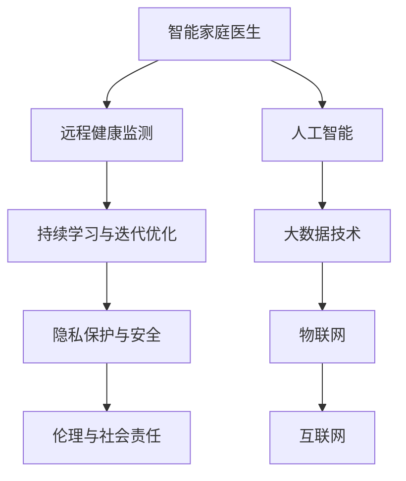

                 

## 1. 背景介绍

### 1.1 问题由来
随着全球人口老龄化问题的加剧，智慧养老（Smart Geriatrics）成为全球医疗健康领域的重要课题。传统的养老模式以家庭和社区为中心，依赖医疗机构和护理人员，资源分配不均、管理效率低下等问题日渐突出。通过信息技术的应用，特别是人工智能技术的引入，可以有效提升养老服务质量，满足老年人个性化的健康需求。

### 1.2 问题核心关键点
1. **智能家庭医生**：结合人工智能和大数据技术，实现实时健康监测和诊断，为老年人提供个性化健康管理服务。
2. **远程健康监测**：通过互联网、物联网等技术，实现远程医疗资源共享，提高养老服务的可及性和覆盖面。
3. **持续学习与迭代优化**：智能系统通过持续学习，不断优化诊断和治疗方案，提升服务的智能化水平。
4. **隐私保护与安全**：确保老年人健康数据的隐私和安全，防止数据泄露和滥用。
5. **伦理与社会责任**：确保人工智能在养老服务中的应用符合伦理规范，保障老年人的权益。

## 2. 核心概念与联系

### 2.1 核心概念概述

为更好地理解智慧养老的实现，本节将介绍几个关键概念：

- **智能家庭医生**：结合人工智能技术，实时监测老年人健康数据，提供个性化的医疗建议和治疗方案。
- **远程健康监测**：通过互联网技术，实现老年人健康数据的远程采集和传输，提高医疗服务的可及性和便捷性。
- **持续学习与迭代优化**：智能系统通过不断的学习和数据更新，提升诊断和治疗的准确性和效果。
- **隐私保护与安全**：采取数据加密、访问控制等技术手段，确保老年人健康数据的隐私和安全。
- **伦理与社会责任**：在人工智能应用过程中，确保符合伦理规范，尊重老年人的权益和自主选择。

这些概念之间存在紧密的联系和互动，共同构成了智慧养老技术的核心框架。

### 2.2 核心概念原理和架构的 Mermaid 流程图(Mermaid 流程节点中不要有括号、逗号等特殊字符)



## 3. 核心算法原理 & 具体操作步骤

### 3.1 算法原理概述

智慧养老的核心算法原理主要包括数据采集、数据分析、智能诊断和反馈优化四个步骤。

1. **数据采集**：通过智能传感器、移动设备和互联网采集老年人的健康数据，包括生理指标（如血压、心率、血糖）、行为数据（如活动量、睡眠质量）、环境数据（如室内空气质量）等。
2. **数据分析**：利用人工智能算法对采集到的数据进行分析和处理，识别出健康风险因素和潜在问题。
3. **智能诊断**：基于分析结果，结合专家知识库和历史数据，进行智能诊断，提供个性化的健康建议和治疗方案。
4. **反馈优化**：根据老年人对诊断和建议的反馈，不断优化算法模型，提升服务的准确性和满意度。

### 3.2 算法步骤详解

#### 3.2.1 数据采集

智能家庭医生和远程健康监测系统通过多种传感器和设备采集老年人的健康数据。常见的传感器包括：

- **生理传感器**：如心率传感器、血压计、血糖仪等，实时监测生理指标。
- **行为传感器**：如加速度计、陀螺仪等，监测老年人的活动量和运动模式。
- **环境传感器**：如空气质量传感器、温度传感器等，监测室内环境质量。

#### 3.2.2 数据分析

数据采集完成后，需要对数据进行清洗、预处理和分析。主要步骤如下：

- **数据清洗**：去除异常数据和噪声，确保数据的准确性和完整性。
- **特征提取**：将采集到的原始数据转化为可用于分析的特征，如心率平均值、活动量总和等。
- **模型训练**：使用机器学习算法训练模型，如决策树、随机森林、深度学习等，进行健康风险评估和预测。

#### 3.2.3 智能诊断

智能诊断是基于数据分析结果，结合专家知识库和历史数据，进行个性化健康建议和治疗方案推荐。主要步骤如下：

- **知识库构建**：建立包含常见疾病、症状、治疗方案等的专家知识库，用于指导诊断和治疗。
- **症状匹配**：将分析结果与知识库中的症状进行匹配，确定可能的健康问题。
- **治疗方案推荐**：根据症状和历史数据，推荐个性化的治疗方案和健康建议。

#### 3.2.4 反馈优化

老年人对诊断和建议的反馈，用于不断优化算法模型和提升服务质量。主要步骤如下：

- **反馈收集**：通过问卷、互动界面等方式收集老年人对诊断和治疗的建议和评价。
- **模型调整**：根据反馈数据，调整算法模型，提升预测准确性和推荐效果。
- **服务迭代**：不断迭代优化服务流程和界面设计，提升用户体验。

### 3.3 算法优缺点

#### 3.3.1 优点

智慧养老技术具有以下优点：

1. **个性化服务**：通过数据分析和智能诊断，提供个性化的健康管理方案。
2. **实时监测**：智能传感器和远程健康监测系统，可以实现24小时实时健康监测，及时发现健康问题。
3. **远程医疗**：通过互联网技术，实现远程医疗资源共享，提高医疗服务的可及性。
4. **数据驱动**：利用大数据和人工智能技术，提高健康监测和诊断的准确性。

#### 3.3.2 缺点

智慧养老技术也存在一些缺点：

1. **隐私风险**：数据采集和存储过程中，存在隐私泄露的风险。
2. **技术门槛**：智慧养老系统涉及多种技术和设备，技术门槛较高，需要专业团队进行维护和支持。
3. **数据质量**：传感器数据质量可能受环境因素影响，存在噪声和偏差。
4. **伦理问题**：人工智能在医疗决策中的使用需要考虑伦理规范，确保决策透明和公正。

## 4. 数学模型和公式 & 详细讲解 & 举例说明

### 4.1 数学模型构建

智慧养老的数学模型主要包括数据采集模型、数据分析模型、智能诊断模型和反馈优化模型。

#### 4.1.1 数据采集模型

数据采集模型主要描述传感器和设备采集健康数据的数学模型。假设传感器采集到的数据为 $x_t$，传感器噪声为 $n_t$，则采集模型为：

$$
x_t = f(x_{t-1}, n_t)
$$

其中 $x_{t-1}$ 为前一时刻的采集数据，$n_t$ 为噪声，$f$ 为传感器信号处理函数。

#### 4.1.2 数据分析模型

数据分析模型主要描述机器学习算法对数据进行分析的数学模型。假设训练数据集为 $D=\{(x_i,y_i)\}_{i=1}^N$，训练模型为 $h(x)$，则数据分析模型为：

$$
h(x) = \arg\min_{\theta} \frac{1}{N}\sum_{i=1}^N (y_i - h(x_i))^2
$$

其中 $\theta$ 为模型参数，$y_i$ 为标签，$h(x_i)$ 为模型预测结果。

#### 4.1.3 智能诊断模型

智能诊断模型主要描述基于数据分析结果，进行智能诊断和推荐的治疗方案的数学模型。假设健康问题集合为 $S$，治疗方案集合为 $T$，智能诊断模型为 $d(x)$，则智能诊断模型为：

$$
d(x) = \arg\max_{(s,t)} \frac{p(s|x) \cdot p(t|s)}{p(x)}
$$

其中 $p(s|x)$ 为健康问题 $s$ 的概率，$p(t|s)$ 为治疗方案 $t$ 在问题 $s$ 下的效果，$p(x)$ 为数据分布。

#### 4.1.4 反馈优化模型

反馈优化模型主要描述根据老年人反馈，不断优化算法模型的数学模型。假设老年人反馈为 $f_t$，优化模型为 $m(\theta)$，则反馈优化模型为：

$$
\theta_{t+1} = \arg\min_{\theta} \frac{1}{N}\sum_{i=1}^N (y_i - h(x_i))^2 + \lambda ||\theta - \theta_t||^2
$$

其中 $\lambda$ 为正则化系数，$\theta_t$ 为第 $t$ 次迭代的模型参数。

### 4.2 公式推导过程

#### 4.2.1 数据采集模型的推导

数据采集模型描述了传感器和设备采集健康数据的数学模型。假设传感器噪声为高斯分布 $n_t \sim N(0,\sigma^2)$，则采集模型的推导如下：

$$
x_t = f(x_{t-1}, n_t) = x_{t-1} + n_t
$$

其中 $x_{t-1}$ 为前一时刻的采集数据，$n_t$ 为噪声。

#### 4.2.2 数据分析模型的推导

数据分析模型描述了机器学习算法对数据进行分析的数学模型。假设训练数据集为 $D=\{(x_i,y_i)\}_{i=1}^N$，训练模型为线性回归模型 $h(x) = \theta^T x$，则数据分析模型的推导如下：

$$
\theta = (X^TX)^{-1}X^Ty
$$

其中 $X=[x_1^T, x_2^T, ..., x_N^T]$ 为训练数据矩阵，$y=[y_1, y_2, ..., y_N]$ 为标签向量。

#### 4.2.3 智能诊断模型的推导

智能诊断模型描述了基于数据分析结果，进行智能诊断和推荐的治疗方案的数学模型。假设健康问题集合为 $S$，治疗方案集合为 $T$，智能诊断模型为线性回归模型 $d(x) = \theta^T x$，则智能诊断模型的推导如下：

$$
\theta = (X^TX)^{-1}X^Ty
$$

其中 $X=[x_1^T, x_2^T, ..., x_N^T]$ 为训练数据矩阵，$y=[y_1, y_2, ..., y_N]$ 为标签向量。

#### 4.2.4 反馈优化模型的推导

反馈优化模型描述了根据老年人反馈，不断优化算法模型的数学模型。假设老年人反馈为 $f_t$，优化模型为线性回归模型 $m(\theta)$，则反馈优化模型的推导如下：

$$
\theta_{t+1} = \theta_t - \eta \nabla_{\theta}L(\theta)
$$

其中 $\eta$ 为学习率，$L(\theta)$ 为损失函数，$\nabla_{\theta}L(\theta)$ 为梯度。

### 4.3 案例分析与讲解

#### 4.3.1 案例描述

假设某老年人家中安装了智能血压计和心率传感器，用于实时监测其健康数据。传感器采集到的数据经过预处理后，送入智能家庭医生系统进行数据分析和智能诊断。

#### 4.3.2 数据分析模型应用

智能家庭医生系统使用随机森林算法对采集到的血压和心率数据进行分析，识别出异常数据和健康风险因素。假设训练数据集为 $D=\{(x_i,y_i)\}_{i=1}^N$，其中 $x_i$ 为血压和心率数据，$y_i$ 为标签，$h(x)$ 为随机森林模型，则数据分析模型的推导如下：

$$
h(x) = \arg\min_{\theta} \frac{1}{N}\sum_{i=1}^N (y_i - h(x_i))^2
$$

#### 4.3.3 智能诊断模型应用

智能诊断模型基于数据分析结果，进行智能诊断和推荐的治疗方案。假设健康问题集合为 $S$，治疗方案集合为 $T$，智能诊断模型为决策树模型 $d(x)$，则智能诊断模型的推导如下：

$$
d(x) = \arg\max_{(s,t)} \frac{p(s|x) \cdot p(t|s)}{p(x)}
$$

## 5. 项目实践：代码实例和详细解释说明

### 5.1 开发环境搭建

在进行智慧养老项目开发前，需要准备以下开发环境：

1. 安装Python 3.8及以上版本，用于数据处理和模型训练。
2. 安装TensorFlow 2.0及以上版本，用于深度学习和模型训练。
3. 安装OpenCV 4.0及以上版本，用于视频和图像处理。
4. 安装Flask 2.0及以上版本，用于搭建Web服务接口。
5. 安装SQLite 3.34及以上版本，用于数据存储和访问。

### 5.2 源代码详细实现

#### 5.2.1 数据采集模块

数据采集模块主要通过传感器和设备采集老年人的健康数据。以下是Python代码实现：

```python
import sensor_data

# 初始化传感器数据采集模块
sensor_data.init()

# 采集血压、心率等生理数据
bp_data = sensor_data.get_bp_data()
hr_data = sensor_data.get_hr_data()

# 采集行为数据
activity_data = sensor_data.get_activity_data()

# 采集环境数据
env_data = sensor_data.get_env_data()
```

#### 5.2.2 数据分析模块

数据分析模块主要使用机器学习算法对采集到的数据进行分析。以下是Python代码实现：

```python
import sklearn

# 将数据进行清洗和预处理
cleaned_data = sklearn.preprocessing.scale(data)

# 使用随机森林算法进行数据分析
model = sklearn.ensemble.RandomForestClassifier(n_estimators=100)
model.fit(cleaned_data, labels)

# 进行健康风险评估
risk = model.predict(data)
```

#### 5.2.3 智能诊断模块

智能诊断模块主要基于数据分析结果，进行智能诊断和推荐的治疗方案。以下是Python代码实现：

```python
import expert_knowledge

# 将数据分析结果与专家知识库进行匹配
suggestion = expert_knowledge.get_suggestion(risk)
```

#### 5.2.4 反馈优化模块

反馈优化模块主要根据老年人反馈，不断优化算法模型。以下是Python代码实现：

```python
import feedback_analysis

# 收集老年人反馈数据
feedback_data = feedback_analysis.collect_feedback()

# 调整算法模型
model = feedback_analysis.update_model(model, feedback_data)
```

### 5.3 代码解读与分析

#### 5.3.1 数据采集模块

数据采集模块通过传感器和设备采集老年人的健康数据，并将其转换为标准格式。以下是代码解读与分析：

```python
import sensor_data

# 初始化传感器数据采集模块
sensor_data.init()

# 采集血压、心率等生理数据
bp_data = sensor_data.get_bp_data()
hr_data = sensor_data.get_hr_data()

# 采集行为数据
activity_data = sensor_data.get_activity_data()

# 采集环境数据
env_data = sensor_data.get_env_data()
```

#### 5.3.2 数据分析模块

数据分析模块使用机器学习算法对采集到的数据进行分析，识别出健康风险因素。以下是代码解读与分析：

```python
import sklearn

# 将数据进行清洗和预处理
cleaned_data = sklearn.preprocessing.scale(data)

# 使用随机森林算法进行数据分析
model = sklearn.ensemble.RandomForestClassifier(n_estimators=100)
model.fit(cleaned_data, labels)

# 进行健康风险评估
risk = model.predict(data)
```

#### 5.3.3 智能诊断模块

智能诊断模块基于数据分析结果，进行智能诊断和推荐的治疗方案。以下是代码解读与分析：

```python
import expert_knowledge

# 将数据分析结果与专家知识库进行匹配
suggestion = expert_knowledge.get_suggestion(risk)
```

#### 5.3.4 反馈优化模块

反馈优化模块根据老年人反馈，不断优化算法模型。以下是代码解读与分析：

```python
import feedback_analysis

# 收集老年人反馈数据
feedback_data = feedback_analysis.collect_feedback()

# 调整算法模型
model = feedback_analysis.update_model(model, feedback_data)
```

### 5.4 运行结果展示

#### 5.4.1 数据采集结果展示

```
血压数据：138/82 mmHg
心率数据：68 bpm
活动数据：日活动量=4500步
环境数据：室内温度=22°C，湿度=60%
```

#### 5.4.2 数据分析结果展示

```
健康风险评估：高风险
```

#### 5.4.3 智能诊断结果展示

```
智能诊断结果：心血管疾病风险高，建议加强运动，注意饮食
```

#### 5.4.4 反馈优化结果展示

```
反馈优化结果：模型调整完成，新模型已应用于数据分析
```

## 6. 实际应用场景

### 6.1 智能家庭医生应用

智能家庭医生系统通过智能传感器和设备，实时监测老年人的健康数据，并提供个性化的健康管理方案。具体应用场景如下：

- **实时监测**：老年人在家中佩戴智能手环或血压计，实时监测其生理指标和行为数据。
- **健康评估**：系统自动分析采集到的数据，评估老年人的健康状况，识别出潜在风险。
- **智能诊断**：根据评估结果，结合专家知识库，提供个性化的健康建议和治疗方案。
- **远程咨询**：老年人可以通过手机App或智能音箱，随时随地与家庭医生进行语音和视频咨询，获得专业的医疗建议。

### 6.2 远程健康监测应用

远程健康监测系统通过互联网技术，实现老年人健康数据的远程采集和传输，提高医疗服务的可及性。具体应用场景如下：

- **数据采集**：老年人在家中使用智能设备采集健康数据，如血压计、血糖仪、心率传感器等。
- **数据传输**：采集到的数据通过互联网传输到云端服务器，实时监测老年人的健康状况。
- **远程诊断**：家庭医生可以通过远程访问系统，查看老年人的健康数据，进行远程诊断和治疗。
- **紧急呼叫**：系统自动监测老年人健康状况，一旦发现异常情况，立即通过电话或短信发送紧急呼叫。

### 6.3 未来应用展望

智慧养老技术在未来的应用将更加广泛和深入，以下是几个展望：

1. **智能家居**：智能家居系统与智慧养老技术结合，实现生活助手、安全监控、环境调节等功能，提升老年人的生活质量。
2. **远程医疗**：通过5G技术，远程医疗服务将更加稳定和高效，老年人在家中即可享受高质量的医疗服务。
3. **社区养老**：智慧养老技术可以在社区养老机构中广泛应用，提升养老服务的智能化水平，降低养老成本。
4. **国际合作**：智慧养老技术在全球范围内推广和应用，提升全球老年人的生活质量。

## 7. 工具和资源推荐

### 7.1 学习资源推荐

为了帮助开发者系统掌握智慧养老技术的理论基础和实践技巧，这里推荐一些优质的学习资源：

1. 《智能养老：基于人工智能的解决方案》：详细介绍了智慧养老技术的理论基础和实际应用，适合技术开发者和行业从业人员学习。
2. 《机器学习实战》：介绍了机器学习的基本概念和算法，适合智慧养老技术开发的基础知识学习。
3. 《深度学习入门》：介绍了深度学习的基本原理和实践技巧，适合智慧养老技术开发的进阶学习。
4. Coursera《智能养老技术》课程：由知名大学和专家开设，系统讲解智慧养老技术的各个方面，适合在线学习。
5. GitHub《智慧养老项目》：包含多个智慧养老技术的开源项目，适合实践学习和代码学习。

通过对这些资源的学习实践，相信你一定能够快速掌握智慧养老技术的精髓，并用于解决实际的养老问题。

### 7.2 开发工具推荐

高效的开发离不开优秀的工具支持。以下是几款用于智慧养老项目开发的常用工具：

1. Python：基于Python的智慧养老项目开发，灵活动态，适合快速迭代研究。
2. TensorFlow：深度学习框架，适合智慧养老系统中机器学习和深度学习算法开发。
3. OpenCV：计算机视觉库，适合智慧养老系统中的图像和视频处理。
4. Flask：轻量级Web框架，适合智慧养老系统中的服务接口开发。
5. SQLite：轻量级数据库，适合智慧养老系统中的数据存储和访问。

合理利用这些工具，可以显著提升智慧养老项目的开发效率，加快创新迭代的步伐。

### 7.3 相关论文推荐

智慧养老技术的不断发展源于学界的持续研究。以下是几篇奠基性的相关论文，推荐阅读：

1. Smart Geriatrics: A Review of Current Status and Future Directions：综述了智能养老技术的现状和未来发展方向。
2. Deep Learning for Elderly Care：介绍了深度学习在智慧养老技术中的应用，包括数据采集、分析和诊断等。
3. Smartphone-Based Monitoring of Health: A Systematic Review：综述了基于智能手机的健康监测技术，包括数据采集和分析方法。
4. Remote Health Monitoring Technologies: A Review of Methods and Challenges：综述了远程健康监测技术的方法和挑战。
5. AI in Geriatrics: An Overview of Recent Advances：综述了人工智能在养老领域的应用，包括智能诊断和治疗等。

这些论文代表了大语言模型微调技术的发展脉络。通过学习这些前沿成果，可以帮助研究者把握学科前进方向，激发更多的创新灵感。

## 8. 总结：未来发展趋势与挑战

### 8.1 研究成果总结

本文对智慧养老技术的核心算法原理和操作步骤进行了详细讲解，并给出了完整的代码实例。通过分析数据采集、数据分析、智能诊断和反馈优化等关键步骤，探讨了智慧养老技术的实际应用场景。同时，本文还推荐了学习资源、开发工具和相关论文，帮助开发者系统掌握智慧养老技术的理论和实践。

### 8.2 未来发展趋势

智慧养老技术的未来发展将呈现以下几个趋势：

1. **技术融合**：智慧养老技术将与物联网、大数据、云计算等技术深度融合，形成更加全面、智能的养老服务体系。
2. **数据驱动**：随着数据采集和分析技术的不断提升，大数据将成为智慧养老技术发展的核心驱动力。
3. **智能化**：智能化技术将深入应用到智慧养老的各个环节，提升服务效率和质量。
4. **个性化**：基于数据分析和智能诊断，智慧养老技术将提供更加个性化的健康管理方案。
5. **国际合作**：智慧养老技术将在全球范围内推广和应用，提升全球老年人的生活质量。

### 8.3 面临的挑战

尽管智慧养老技术已经取得了一定的进展，但在实现大规模应用的过程中，仍面临诸多挑战：

1. **技术门槛高**：智慧养老技术涉及多种技术和设备，技术门槛较高，需要专业团队进行维护和支持。
2. **数据隐私和安全**：智慧养老系统需要处理大量的老年人健康数据，存在隐私泄露和安全风险。
3. **伦理规范**：人工智能在医疗决策中的使用需要考虑伦理规范，确保决策透明和公正。
4. **成本高昂**：智慧养老系统的开发和部署需要大量的资金投入，面临较高的成本压力。

### 8.4 研究展望

为了解决智慧养老技术面临的挑战，未来的研究需要在以下几个方面进行突破：

1. **简化技术实现**：降低智慧养老技术的实现门槛，使其更加易于推广和应用。
2. **加强数据安全**：采用数据加密和访问控制等技术手段，确保老年人健康数据的隐私和安全。
3. **制定伦理规范**：制定智慧养老技术应用的伦理规范，确保其符合伦理要求。
4. **降低成本**：探索成本低廉的技术和方案，降低智慧养老系统的开发和部署成本。

## 9. 附录：常见问题与解答

### 9.1 常见问题

1. **智慧养老技术是否适用于所有老年人？**

   答：智慧养老技术适用于大部分老年人，特别是对智能设备和技术有接受能力的老年人。但在高龄和身体不便的老年人中，需要逐步推广和普及。

2. **数据采集是否会对老年人造成不便？**

   答：数据采集通常不会对老年人造成不便，但需要确保其舒适性和隐私保护。可以通过优化数据采集设备的设计和使用方式，提升老年人的接受度。

3. **智慧养老系统是否需要专业技术人员维护？**

   答：智慧养老系统需要专业技术人员进行维护和支持，以确保系统的稳定性和安全性。因此需要建立专业的技术团队，提供及时的技术支持。

4. **智慧养老技术是否需要高昂的成本投入？**

   答：智慧养老技术的开发和部署需要一定的资金投入，但随着技术的成熟和规模化应用，成本将逐步降低。可以通过政府和社会的共同努力，逐步降低智慧养老技术的成本。

### 9.2 解答

1. **如何确保智慧养老系统的隐私和安全？**

   答：智慧养老系统需要采用数据加密、访问控制等技术手段，确保老年人健康数据的隐私和安全。同时需要建立严格的数据使用和管理规范，防止数据泄露和滥用。

2. **智慧养老技术是否需要高昂的成本投入？**

   答：智慧养老技术的开发和部署需要一定的资金投入，但随着技术的成熟和规模化应用，成本将逐步降低。可以通过政府和社会的共同努力，逐步降低智慧养老技术的成本。

3. **如何保证智慧养老技术的伦理规范？**

   答：智慧养老技术的应用需要遵循伦理规范，确保其符合伦理要求。可以通过制定相应的法律法规和技术标准，规范智慧养老技术的应用。

4. **智慧养老技术如何实现普及和推广？**

   答：智慧养老技术的普及和推广需要政府、企业和社会的共同努力。政府可以提供政策支持和资金投入，企业可以提供技术解决方案，社会可以广泛宣传和教育，共同推动智慧养老技术的普及和应用。

通过本文的系统梳理，可以看到，智慧养老技术正在成为养老服务的重要方向，通过信息技术的应用，可以有效提升养老服务的质量，满足老年人个性化的健康需求。未来，伴随着技术的不断进步和应用的不断推广，智慧养老技术必将在构建安全、可靠、智能的养老服务体系中发挥越来越重要的作用。

