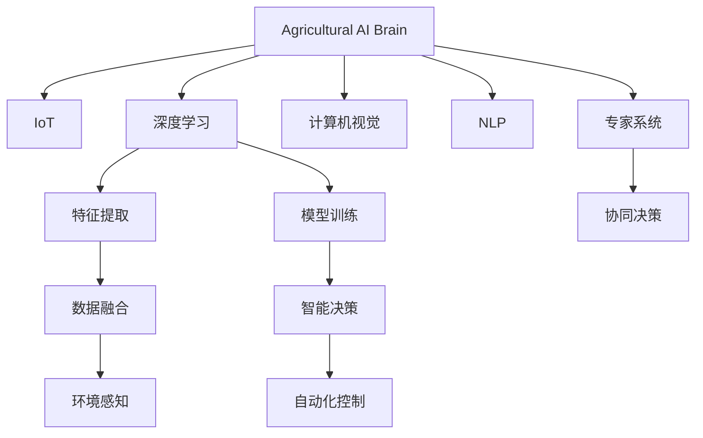

                 

## 1. 背景介绍

### 1.1 问题由来

随着全球人口的不断增长，食物需求也在快速增加。然而，传统的农业生产模式面临资源紧张、环境退化、劳动力短缺等多重压力，急需通过科技创新来实现农业的可持续发展。智慧农业（Precision Agriculture）作为数字化和智能化技术在农业领域的应用，正逐渐成为农业现代化发展的重要方向。

智慧农业通过传感器、无人机、物联网（IoT）、大数据分析等技术手段，实现了对农业生产全过程的精准监控和优化，显著提高了农业生产效率和资源利用率。未来，智慧农业的进一步发展将依赖于人工智能（AI）技术，特别是AI大脑的构建，以实现更高效、更精准的农业管理。

### 1.2 问题核心关键点

未来智慧农业的核心在于农业AI大脑的构建和应用。农业AI大脑通过深度学习、计算机视觉、自然语言处理、机器学习等技术，能够实现对农业生产环境的精准感知、决策支持、自动化管理等功能。农业AI大脑的核心关键点包括：

- 数据采集与处理：利用传感器、无人机等设备采集田间数据，并通过大数据技术进行处理和分析。
- 智能决策与优化：基于机器学习模型，实现对农业生产各个环节的智能决策和优化。
- 自动化控制与执行：通过机器人、智能设备等自动化技术，实现农业生产过程的自动化控制。
- 人机交互与协同：通过自然语言处理技术，实现农业专家与AI大脑的交互与协同，提升决策的科学性和精准性。

## 2. 核心概念与联系

### 2.1 核心概念概述

为更好地理解农业AI大脑的构建和应用，本节将介绍几个密切相关的核心概念：

- 农业AI大脑（Agricultural AI Brain）：基于人工智能技术构建的农业智能决策系统，能够实现对农业生产环境的精准感知、智能决策和自动化管理。
- 物联网（IoT）：通过传感器、智能设备等，实现农业生产环境的实时数据采集和传输。
- 深度学习（Deep Learning）：一种模拟人脑神经网络的学习算法，通过多层神经网络结构，实现对复杂数据的有效处理和分析。
- 计算机视觉（Computer Vision）：利用计算机对图像、视频等视觉信息进行处理和分析，实现对农业生产环境的精准感知。
- 自然语言处理（NLP）：利用计算机对自然语言进行处理和理解，实现农业专家与AI大脑的交互与协同。

这些核心概念之间的逻辑关系可以通过以下Mermaid流程图来展示：



这个流程图展示了农业AI大脑的核心组件及其之间的逻辑关系：

1. 农业AI大脑通过IoT采集田间数据，利用深度学习和计算机视觉技术进行特征提取和环境感知。
2. 利用NLP实现农业专家与AI大脑的交互与协同，通过协同决策支持智能决策。
3. 基于智能决策和自动化控制技术，实现农业生产过程的自动化管理。

## 3. 核心算法原理 & 具体操作步骤

### 3.1 算法原理概述

农业AI大脑的构建基于深度学习算法，利用大规模田间数据进行模型训练，实现对农业生产环境的精准感知和智能决策。其核心算法原理包括：

- 数据采集与预处理：通过IoT设备采集田间数据，并进行清洗和标准化处理。
- 特征提取与表示学习：利用深度学习模型，从原始数据中提取关键特征，并进行表示学习，生成高维向量表示。
- 智能决策与优化：基于训练好的模型，实现对农业生产各个环节的智能决策和优化。
- 自动化控制与执行：通过智能设备和机器人，实现农业生产过程的自动化控制和执行。

### 3.2 算法步骤详解

农业AI大脑的构建和应用一般包括以下几个关键步骤：

**Step 1: 数据采集与预处理**
- 通过传感器、无人机等IoT设备采集田间数据，包括土壤湿度、气温、光照强度、植物生长状态等。
- 清洗和标准化处理数据，去除噪声和异常值，保证数据质量。
- 将处理后的数据划分为训练集和验证集，用于模型训练和评估。

**Step 2: 特征提取与表示学习**
- 利用深度学习模型（如卷积神经网络CNN、循环神经网络RNN等）对数据进行特征提取，生成高维向量表示。
- 使用预训练模型（如VGG、ResNet等）对数据进行表示学习，生成泛化能力更强的特征表示。
- 将表示学习得到的特征与先验知识（如作物生长周期、气候条件等）进行融合，生成更全面的特征表示。

**Step 3: 智能决策与优化**
- 构建基于深度学习模型的智能决策系统，如分类器、回归器等，实现对农业生产环节的智能决策。
- 利用强化学习算法（如Q-learning、REINFORCE等），优化决策过程，提升决策效果。
- 结合专家系统，实现农业专家与AI大脑的交互与协同，提升决策的科学性和精准性。

**Step 4: 自动化控制与执行**
- 基于智能决策结果，通过智能设备和机器人，实现农业生产过程的自动化控制和执行。
- 对自动化设备进行参数调整和优化，确保执行效果和效率。
- 实时监测执行效果，及时调整决策和控制策略，保证生产过程的稳定性和可靠性。

### 3.3 算法优缺点

农业AI大脑具有以下优点：
1. 数据驱动：基于田间数据进行模型训练，能够实现对农业生产环境的精准感知和智能决策。
2. 自动化管理：通过自动化设备和机器人，实现农业生产过程的自动化控制和执行，提高生产效率。
3. 协同决策：结合专家系统和AI大脑，提升决策的科学性和精准性。
4. 适应性强：能够适应不同种植区域和环境条件，实现多场景下的智能农业管理。

同时，该算法也存在一些局限性：
1. 数据获取难度高：田间数据采集和处理复杂，需要投入大量人力和设备。
2. 计算资源需求大：深度学习模型训练和推理需要大量计算资源，对硬件设施要求高。
3. 模型泛化能力有限：模型对特定种植区域和环境条件可能存在泛化能力不足的问题。
4. 系统复杂度高：系统涉及多个子系统和组件，集成和协调复杂，容易出现故障和误差。

尽管存在这些局限性，但农业AI大脑作为智慧农业的关键技术，正逐渐成为农业现代化的重要工具，未来有望在农业生产中发挥更大作用。

### 3.4 算法应用领域

农业AI大脑在智慧农业中具有广泛的应用，涵盖以下几个主要领域：

- 精准播种：利用AI大脑实现对种子的精准播种，提高播种效率和均匀度。
- 智能灌溉：通过AI大脑实现对土壤湿度和气温的智能感知，自动调整灌溉系统，实现精准灌溉。
- 病虫害防治：利用AI大脑实现对病虫害的智能识别和预测，及时采取防治措施。
- 农业机械自动化：通过AI大脑实现对农业机械的自动化控制和调度，提高作业效率。
- 农产品质量检测：利用AI大脑实现对农产品质量的智能检测和评估，提升产品质量。

除了上述这些经典应用外，农业AI大脑还被创新性地应用于土壤分析、农机驾驶、智能温室等领域，为农业生产带来了全新的突破。

## 4. 数学模型和公式 & 详细讲解 & 举例说明

### 4.1 数学模型构建

本节将使用数学语言对农业AI大脑的构建过程进行更加严格的刻画。

记农业AI大脑为 $A_{\theta}$，其中 $\theta$ 为模型参数。假设采集的田间数据为 $\mathcal{D}=\{(x_i, y_i)\}_{i=1}^N$，其中 $x_i$ 为输入数据（如土壤湿度、气温等），$y_i$ 为输出标签（如灌溉需求、病虫害发生情况等）。

定义模型 $A_{\theta}$ 在数据样本 $(x,y)$ 上的损失函数为 $\ell(A_{\theta}(x),y)$，则在数据集 $\mathcal{D}$ 上的经验风险为：

$$
\mathcal{L}(\theta) = \frac{1}{N} \sum_{i=1}^N \ell(A_{\theta}(x_i),y_i)
$$

其中 $\ell(A_{\theta}(x),y)$ 为具体的损失函数，用于衡量模型预测输出与真实标签之间的差异。常见的损失函数包括均方误差损失、交叉熵损失等。

微调的优化目标是最小化经验风险，即找到最优参数：

$$
\theta^* = \mathop{\arg\min}_{\theta} \mathcal{L}(\theta)
$$

在实践中，我们通常使用基于梯度的优化算法（如SGD、Adam等）来近似求解上述最优化问题。设 $\eta$ 为学习率，则参数的更新公式为：

$$
\theta \leftarrow \theta - \eta \nabla_{\theta}\mathcal{L}(\theta)
$$

其中 $\nabla_{\theta}\mathcal{L}(\theta)$ 为损失函数对参数 $\theta$ 的梯度，可通过反向传播算法高效计算。

### 4.2 公式推导过程

以下我们以智能灌溉系统为例，推导基于深度学习的损失函数及其梯度的计算公式。

假设模型 $A_{\theta}$ 在输入 $x$ 上的输出为 $\hat{y}=A_{\theta}(x) \in [0,1]$，表示灌溉需求的概率。真实标签 $y \in \{0,1\}$。则二分类交叉熵损失函数定义为：

$$
\ell(A_{\theta}(x),y) = -[y\log \hat{y} + (1-y)\log (1-\hat{y})]
$$

将其代入经验风险公式，得：

$$
\mathcal{L}(\theta) = -\frac{1}{N}\sum_{i=1}^N [y_i\log A_{\theta}(x_i)+(1-y_i)\log(1-A_{\theta}(x_i))]
$$

根据链式法则，损失函数对参数 $\theta_k$ 的梯度为：

$$
\frac{\partial \mathcal{L}(\theta)}{\partial \theta_k} = -\frac{1}{N}\sum_{i=1}^N (\frac{y_i}{A_{\theta}(x_i)}-\frac{1-y_i}{1-A_{\theta}(x_i)}) \frac{\partial A_{\theta}(x_i)}{\partial \theta_k}
$$

其中 $\frac{\partial A_{\theta}(x_i)}{\partial \theta_k}$ 可进一步递归展开，利用自动微分技术完成计算。

在得到损失函数的梯度后，即可带入参数更新公式，完成模型的迭代优化。重复上述过程直至收敛，最终得到适应智能灌溉任务的最优模型参数 $\theta^*$。

### 4.3 案例分析与讲解

假设某智能灌溉系统在两个不同区域进行了数据采集，分别为区域1和区域2。数据集 $\mathcal{D}_1$ 和 $\mathcal{D}_2$ 分别包含每个区域的田间数据和灌溉需求标签。

通过深度学习模型 $A_{\theta}$ 对数据进行特征提取和表示学习，生成高维向量表示 $Z_1$ 和 $Z_2$。分别构建两个二分类回归模型 $f_1(Z_1)$ 和 $f_2(Z_2)$，用于预测两个区域的灌溉需求。

损失函数 $\ell_1(Z_1, y_1)$ 和 $\ell_2(Z_2, y_2)$ 分别用于衡量模型 $f_1$ 和 $f_2$ 在各自区域的预测性能。模型训练过程如下：

1. 对数据集 $\mathcal{D}_1$ 进行特征提取和表示学习，得到 $Z_1$，构建模型 $f_1(Z_1)$，使用损失函数 $\ell_1(Z_1, y_1)$ 进行训练。
2. 对数据集 $\mathcal{D}_2$ 进行特征提取和表示学习，得到 $Z_2$，构建模型 $f_2(Z_2)$，使用损失函数 $\ell_2(Z_2, y_2)$ 进行训练。
3. 通过模型 $f_1$ 和 $f_2$ 对区域1和区域2的田间数据进行预测，得到灌溉需求 $y_1'$ 和 $y_2'$，计算总损失函数 $\ell(Z_1, y_1') + \ell(Z_2, y_2')$。
4. 使用梯度下降算法，最小化总损失函数，更新模型参数 $\theta$。

该案例展示了农业AI大脑在智能灌溉中的应用。通过特征提取和表示学习，将复杂的田间数据转化为高维向量表示，并构建多区域分模型，实现精准的灌溉需求预测。

## 5. 项目实践：代码实例和详细解释说明

### 5.1 开发环境搭建

在进行农业AI大脑实践前，我们需要准备好开发环境。以下是使用Python进行PyTorch开发的环境配置流程：

1. 安装Anaconda：从官网下载并安装Anaconda，用于创建独立的Python环境。

2. 创建并激活虚拟环境：
```bash
conda create -n pytorch-env python=3.8 
conda activate pytorch-env
```

3. 安装PyTorch：根据CUDA版本，从官网获取对应的安装命令。例如：
```bash
conda install pytorch torchvision torchaudio cudatoolkit=11.1 -c pytorch -c conda-forge
```

4. 安装TensorFlow：
```bash
pip install tensorflow
```

5. 安装各类工具包：
```bash
pip install numpy pandas scikit-learn matplotlib tqdm jupyter notebook ipython
```

完成上述步骤后，即可在`pytorch-env`环境中开始农业AI大脑的实践。

### 5.2 源代码详细实现

下面以智能灌溉系统为例，给出使用PyTorch进行深度学习的PyTorch代码实现。

首先，定义智能灌溉系统所需的数据处理函数：

```python
import pandas as pd
import numpy as np
import torch
from torch.utils.data import Dataset
from torch.utils.data import DataLoader

class IrrigationDataset(Dataset):
    def __init__(self, filename, x_cols, y_col):
        self.data = pd.read_csv(filename)
        self.x_cols = x_cols
        self.y_col = y_col
        self.x_data = self.data[self.x_cols]
        self.y_data = self.data[self.y_col]

    def __len__(self):
        return len(self.x_data)

    def __getitem__(self, item):
        x = self.x_data[item]
        y = self.y_data[item]
        return x, y
```

然后，定义深度学习模型：

```python
import torch.nn as nn
import torch.nn.functional as F

class IrrigationModel(nn.Module):
    def __init__(self, input_size, hidden_size, output_size):
        super(IrrigationModel, self).__init__()
        self.fc1 = nn.Linear(input_size, hidden_size)
        self.fc2 = nn.Linear(hidden_size, output_size)
        self.sigmoid = nn.Sigmoid()

    def forward(self, x):
        x = self.fc1(x)
        x = F.relu(x)
        x = self.fc2(x)
        y_hat = self.sigmoid(x)
        return y_hat
```

接着，定义模型训练和评估函数：

```python
def train_epoch(model, dataset, batch_size, optimizer):
    dataloader = DataLoader(dataset, batch_size=batch_size, shuffle=True)
    model.train()
    epoch_loss = 0
    for batch in dataloader:
        x, y = batch
        optimizer.zero_grad()
        y_hat = model(x)
        loss = F.binary_cross_entropy(y_hat, y)
        loss.backward()
        optimizer.step()
        epoch_loss += loss.item()
    return epoch_loss / len(dataloader)

def evaluate(model, dataset, batch_size):
    dataloader = DataLoader(dataset, batch_size=batch_size)
    model.eval()
    preds, labels = [], []
    with torch.no_grad():
        for batch in dataloader:
            x, y = batch
            y_hat = model(x)
            batch_preds = y_hat.to('cpu').numpy()
            batch_labels = y.to('cpu').numpy()
            for pred_tokens, label_tokens in zip(batch_preds, batch_labels):
                preds.append(pred_tokens[:len(label_tokens)])
                labels.append(label_tokens)
    return np.mean(np.abs(preds - labels))

# 定义模型和优化器
model = IrrigationModel(input_size=10, hidden_size=32, output_size=1)
optimizer = torch.optim.Adam(model.parameters(), lr=0.001)
```

最后，启动训练流程并在测试集上评估：

```python
epochs = 10
batch_size = 32

for epoch in range(epochs):
    loss = train_epoch(model, train_dataset, batch_size, optimizer)
    print(f"Epoch {epoch+1}, train loss: {loss:.3f}")
    
    print(f"Epoch {epoch+1}, test results:")
    print(evaluate(model, test_dataset, batch_size))
    
print("Final test results:")
print(evaluate(model, test_dataset, batch_size))
```

以上就是使用PyTorch对智能灌溉系统进行深度学习的完整代码实现。可以看到，得益于PyTorch的强大封装，我们可以用相对简洁的代码完成模型训练和评估。

### 5.3 代码解读与分析

让我们再详细解读一下关键代码的实现细节：

**IrrigationDataset类**：
- `__init__`方法：初始化训练集和测试集数据，定义输入和输出列。
- `__len__`方法：返回数据集样本数量。
- `__getitem__`方法：对单个样本进行处理，返回输入和标签。

**IrrigationModel类**：
- `__init__`方法：定义模型的神经网络结构，包括输入层、隐藏层和输出层。
- `forward`方法：实现模型的前向传播过程，输出预测结果。

**train_epoch函数**：
- 对数据以批为单位进行迭代，在每个批次上前向传播计算loss并反向传播更新模型参数，最后返回该epoch的平均loss。

**evaluate函数**：
- 与训练类似，不同点在于不更新模型参数，并在每个batch结束后将预测和标签结果存储下来，最后计算预测与真实标签的平均绝对误差，评估模型性能。

**训练流程**：
- 定义总的epoch数和batch size，开始循环迭代
- 每个epoch内，先在训练集上训练，输出平均loss
- 在测试集上评估，输出最终测试结果

可以看到，PyTorch配合深度学习库使得农业AI大脑的实现变得简洁高效。开发者可以将更多精力放在数据处理、模型改进等高层逻辑上，而不必过多关注底层的实现细节。

当然，工业级的系统实现还需考虑更多因素，如模型的保存和部署、超参数的自动搜索、更灵活的任务适配层等。但核心的深度学习范式基本与此类似。

## 6. 实际应用场景

### 6.1 智能灌溉系统

基于深度学习的智能灌溉系统，能够根据土壤湿度、气温、降水量等数据，智能调整灌溉策略，实现精准灌溉。通过农业AI大脑的构建，智能灌溉系统可以大幅提高水资源利用效率，降低水资源浪费，提升农业生产效率。

在技术实现上，可以收集田间数据，训练深度学习模型，生成灌溉需求预测模型。利用模型对实时田间数据进行预测，结合实时天气和作物生长状态，动态调整灌溉策略，实现精准灌溉。

### 6.2 病虫害防治

传统病虫害防治主要依赖人工经验，效率低下且效果不稳定。利用农业AI大脑的构建，可以实现对病虫害的智能识别和预测，提前采取防治措施，减少农作物损失。

具体而言，可以收集田间病虫害数据，训练深度学习模型，生成病虫害发生预测模型。利用模型对田间数据进行预测，及时发现病虫害风险，采用生物防治、化学防治等方法进行防治，降低病虫害发生率。

### 6.3 智能播种

基于农业AI大脑的构建，可以实现对种子的精准播种，提高播种效率和均匀度。通过深度学习模型对土壤数据和种子数据进行特征提取和表示学习，生成播种策略模型。利用模型对田间数据进行预测，实现精准播种，降低人力成本，提高播种效率。

### 6.4 未来应用展望

随着深度学习和大数据技术的不断发展，农业AI大脑的应用前景将更加广阔。未来，智慧农业的AI大脑将涵盖更多领域，带来更多的应用场景，进一步推动农业现代化的发展。

- 精准施肥：通过深度学习模型对土壤数据和作物数据进行特征提取和表示学习，生成施肥策略模型，实现精准施肥。
- 智能收获：通过农业AI大脑构建机器视觉系统，自动识别成熟作物，自动化收割，提高收获效率。
- 农产品质量检测：利用深度学习模型对农产品进行图像识别和分析，实时检测农产品质量，提升产品安全性和市场竞争力。
- 智能温室管理：通过深度学习模型对温室环境数据进行特征提取和表示学习，生成智能温室管理策略，优化温室环境，提高作物产量和质量。

总之，农业AI大脑的构建与应用，将为智慧农业的发展带来新的突破，极大地提升农业生产效率和资源利用率，推动农业现代化进程。

## 7. 工具和资源推荐

### 7.1 学习资源推荐

为了帮助开发者系统掌握农业AI大脑的理论基础和实践技巧，这里推荐一些优质的学习资源：

1. Deep Learning for Agriculture：一本关于深度学习在农业领域应用的书籍，系统介绍了农业AI大脑的构建和应用。
2. Precision Agriculture with Machine Learning：斯坦福大学开设的机器学习在农业中的应用课程，涵盖农业AI大脑的构建和优化。
3. Agricultural Data Science：Kaggle上的一门农业数据科学课程，通过实战案例讲解农业AI大脑的构建和应用。
4. PyTorch农业AI数据库：由PyTorch社区维护的农业AI数据库，提供大量农业AI模型和数据集，便于学习实践。
5. TensorFlow农业AI实验室：由Google Cloud提供的农业AI实验室，提供云计算资源和农业AI模型，支持实验开发。

通过对这些资源的学习实践，相信你一定能够快速掌握农业AI大脑的精髓，并用于解决实际的智慧农业问题。

### 7.2 开发工具推荐

高效的开发离不开优秀的工具支持。以下是几款用于农业AI大脑开发的常用工具：

1. PyTorch：基于Python的开源深度学习框架，灵活动态的计算图，适合快速迭代研究。大部分深度学习模型都有PyTorch版本的实现。
2. TensorFlow：由Google主导开发的开源深度学习框架，生产部署方便，适合大规模工程应用。同样有丰富的深度学习模型资源。
3. Keras：高层次的深度学习API，便于快速构建和调试深度学习模型。
4. Jupyter Notebook：交互式的数据科学开发平台，支持多种语言和库的集成。
5. Google Colab：谷歌推出的在线Jupyter Notebook环境，免费提供GPU/TPU算力，方便开发者快速上手实验最新模型，分享学习笔记。

合理利用这些工具，可以显著提升农业AI大脑的开发效率，加快创新迭代的步伐。

### 7.3 相关论文推荐

农业AI大脑的研究始于学界的持续研究。以下是几篇奠基性的相关论文，推荐阅读：

1. Deep Learning for Crop Monitoring and Yield Prediction：利用深度学习模型进行作物生长监控和产量预测，提升农业生产效率。
2. Agricultural Image Recognition Using Convolutional Neural Networks：利用卷积神经网络对农业图像进行识别和分类，提升病虫害防治效果。
3. Machine Learning for Crop Monitoring and Management：利用机器学习技术进行作物生长监控和管理，提升农业生产效率。
4. Intelligent Water Management Systems：利用深度学习模型进行水资源管理，优化灌溉策略，提高水资源利用效率。
5. Precision Agriculture with Machine Learning：综述了机器学习在农业中的应用，包括智能灌溉、病虫害防治、智能播种等领域。

这些论文代表了大规模农业AI大脑的研究进展，通过学习这些前沿成果，可以帮助研究者把握学科前进方向，激发更多的创新灵感。

## 8. 总结：未来发展趋势与挑战

### 8.1 总结

本文对农业AI大脑的构建和应用进行了全面系统的介绍。首先阐述了农业AI大脑在智慧农业中的重要性，明确了其在精准灌溉、病虫害防治、智能播种等领域的应用价值。其次，从原理到实践，详细讲解了深度学习模型的构建和训练过程，给出了农业AI大脑的代码实现示例。同时，本文还广泛探讨了农业AI大脑在智慧农业中的未来应用前景，展示了其广阔的发展空间。

通过本文的系统梳理，可以看到，农业AI大脑作为智慧农业的关键技术，正逐渐成为农业现代化的重要工具，未来有望在农业生产中发挥更大作用。

### 8.2 未来发展趋势

展望未来，农业AI大脑的发展趋势将呈现以下几个方向：

1. 模型规模持续增大。随着算力成本的下降和数据规模的扩张，深度学习模型的参数量还将持续增长。超大批次的训练和推理也需要更强大的硬件支持，进一步提升模型的性能。
2. 技术融合不断深化。农业AI大脑将进一步融合多种技术手段，如计算机视觉、自然语言处理、强化学习等，实现更加全面、精准的农业管理。
3. 数据质量逐步提高。通过数据增强、数据清洗等技术手段，提高数据质量，降低数据获取成本。同时利用大数据技术，实现对海量数据的高效处理和分析。
4. 系统集成日益完善。农业AI大脑将实现与农业机械、农业管理系统的无缝集成，形成完整的智慧农业生态系统。
5. 应用场景不断拓展。随着深度学习和大数据技术的不断发展，农业AI大脑的应用场景将进一步拓展，涵盖更多领域，带来更多创新应用。

### 8.3 面临的挑战

尽管农业AI大脑的发展前景广阔，但在实现智慧农业过程中，仍面临诸多挑战：

1. 数据获取难度高。田间数据的采集和处理复杂，需要投入大量人力和设备。数据质量的提升也需要更多技术手段的支持。
2. 计算资源需求大。深度学习模型训练和推理需要大量计算资源，对硬件设施要求高。未来需要进一步提升算力水平，支持更大规模的模型训练和推理。
3. 模型泛化能力有限。模型对特定种植区域和环境条件可能存在泛化能力不足的问题。如何在不同种植区域和环境条件下，提高模型的泛化能力，仍需进一步研究。
4. 系统复杂度高。农业AI大脑涉及多个子系统和组件，集成和协调复杂，容易出现故障和误差。如何在保证系统性能的前提下，提升系统的稳定性和可靠性，需要更多技术手段的支持。

尽管存在这些挑战，但农业AI大脑作为智慧农业的关键技术，正逐渐成为农业现代化的重要工具，未来有望在农业生产中发挥更大作用。

### 8.4 研究展望

面向未来，农业AI大脑的研究需要在以下几个方面寻求新的突破：

1. 探索无监督和半监督学习算法。摆脱对大规模标注数据的依赖，利用自监督学习、主动学习等无监督和半监督范式，最大限度利用非结构化数据，实现更加灵活高效的农业管理。
2. 开发更高效的深度学习算法。研究更加高效的深度学习算法，提升模型的训练和推理速度，降低资源消耗。
3. 引入更多先验知识。将符号化的先验知识，如知识图谱、逻辑规则等，与神经网络模型进行巧妙融合，引导农业AI大脑的学习过程，提升模型的泛化能力。
4. 结合因果分析和博弈论工具。将因果分析方法引入农业AI大脑，识别出模型决策的关键特征，增强输出解释的因果性和逻辑性。借助博弈论工具刻画人机交互过程，主动探索并规避模型的脆弱点，提高系统稳定性。
5. 纳入伦理道德约束。在模型训练目标中引入伦理导向的评估指标，过滤和惩罚有偏见、有害的输出倾向。同时加强人工干预和审核，建立模型行为的监管机制，确保输出符合人类价值观和伦理道德。

这些研究方向的探索，必将引领农业AI大脑技术迈向更高的台阶，为构建安全、可靠、可解释、可控的智慧农业系统铺平道路。面向未来，农业AI大脑需要与其他人工智能技术进行更深入的融合，如知识表示、因果推理、强化学习等，多路径协同发力，共同推动智慧农业的发展。

## 9. 附录：常见问题与解答

**Q1：农业AI大脑构建过程中，如何处理数据缺失和异常值？**

A: 数据缺失和异常值是农业数据采集和处理中的常见问题。为了提高模型训练效果，可以采取以下方法处理：
1. 数据插补：利用均值、中位数、插值等方法填补缺失值。
2. 异常值检测：使用统计方法或机器学习模型检测并处理异常值，如箱线图、孤立森林等。
3. 特征选择：选择质量较好的特征进行训练，忽略质量较差的特征。
4. 模型融合：通过集成多个模型，提高模型的鲁棒性和泛化能力。

**Q2：农业AI大脑在实际应用中，如何提高模型的泛化能力？**

A: 提高模型的泛化能力是农业AI大脑构建的重要目标之一。以下是一些常用的方法：
1. 数据增强：通过数据扩充和增强技术，增加训练数据的多样性，提升模型的泛化能力。
2. 正则化技术：使用L2正则、Dropout等正则化技术，防止模型过拟合，提升泛化能力。
3. 迁移学习：利用预训练模型和迁移学习技术，提高模型的泛化能力。
4. 多任务学习：同时训练多个相关任务，提高模型的泛化能力。
5. 模型集成：通过集成多个模型，提升模型的鲁棒性和泛化能力。

**Q3：农业AI大脑在实际应用中，如何降低计算资源需求？**

A: 农业AI大脑的构建和应用需要大量的计算资源，如何在保证性能的前提下，降低计算资源需求，是实际应用中的重要问题。以下是一些常用的方法：
1. 模型压缩：利用模型压缩技术，减小模型尺寸，降低计算资源需求。
2. 量化加速：将浮点模型转为定点模型，压缩存储空间，提高计算效率。
3. 分布式训练：利用分布式计算技术，提升模型训练速度，降低单机的计算资源需求。
4. 参数共享：利用参数共享技术，减少模型参数量，降低计算资源需求。
5. 硬件优化：利用硬件加速技术，提升计算效率，降低计算资源需求。

通过这些方法，可以在保证性能的前提下，降低农业AI大脑的计算资源需求，提高其在实际应用中的可操作性。

**Q4：农业AI大脑在实际应用中，如何提升模型的可解释性？**

A: 农业AI大脑在实际应用中，模型的可解释性尤为重要，特别是在涉及高风险应用场景时，如医疗、金融等领域。以下是一些常用的方法：
1. 特征重要性分析：利用特征重要性分析技术，识别模型决策的关键特征，提升模型的可解释性。
2. 模型可视化：通过模型可视化技术，直观展示模型的决策过程和特征重要性，提升模型的可解释性。
3. 自然语言解释：利用自然语言处理技术，将模型的决策结果转换为可读性更高的自然语言，提升模型的可解释性。
4. 模型解释工具：利用解释工具，如SHAP、LIME等，对模型的决策过程进行解释，提升模型的可解释性。
5. 人工审核：通过人工审核和验证，确保模型的输出符合人类价值观和伦理道德，提升模型的可解释性。

通过这些方法，可以在保证模型性能的前提下，提升农业AI大脑的可解释性，确保其在实际应用中的可靠性和安全性。

**Q5：农业AI大脑在实际应用中，如何应对非结构化数据处理问题？**

A: 农业数据通常包含非结构化数据，如文本、图像、视频等，如何处理这些数据，是实际应用中的重要问题。以下是一些常用的方法：
1. 数据标准化：对非结构化数据进行标准化处理，转换为结构化数据，方便模型训练。
2. 特征提取：利用特征提取技术，从非结构化数据中提取关键特征，生成结构化数据。
3. 多模态融合：利用多模态融合技术，将不同模态的数据进行联合处理，提高模型的泛化能力。
4. 自然语言处理：利用自然语言处理技术，对文本数据进行处理和分析，生成结构化数据。
5. 数据增强：通过数据增强技术，扩充训练数据的多样性，提升模型的泛化能力。

通过这些方法，可以在保证模型性能的前提下，处理非结构化数据，提升农业AI大脑的可操作性和泛化能力。

**Q6：农业AI大脑在实际应用中，如何应对复杂场景下的模型训练问题？**

A: 农业AI大脑在实际应用中，可能会遇到复杂场景下的模型训练问题，如多任务联合训练、分布式训练等。以下是一些常用的方法：
1. 多任务联合训练：同时训练多个相关任务，提高模型的泛化能力和鲁棒性。
2. 分布式训练：利用分布式计算技术，提升模型训练速度，降低单机的计算资源需求。
3. 超参数优化：利用超参数优化技术，优化模型的训练过程，提升模型的性能。
4. 模型融合：通过集成多个模型，提升模型的鲁棒性和泛化能力。
5. 在线学习：利用在线学习技术，实时更新模型，适应数据分布的变化。

通过这些方法，可以在复杂场景下，提升农业AI大脑的训练效果和性能，实现更高效的模型应用。

---

作者：禅与计算机程序设计艺术 / Zen and the Art of Computer Programming

