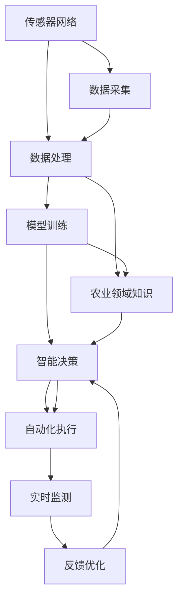

                 

# 未来的智慧农业：2050年的农业AI大脑与精准农业

## 1. 背景介绍

### 1.1 问题由来

在过去的一百年间，人类社会取得了前所未有的发展，生活水平、科技水平均获得了巨大的提升。然而，随着人口的持续增长和工业化的不断加深，资源环境压力越来越大，特别是农业领域面临严峻挑战。传统农业依赖大量人力物力投入，且难以应对气候变化和疾病流行等不确定性因素，亟需变革。

人工智能技术，特别是深度学习和数据驱动技术，为农业领域的转型升级提供了新契机。从20世纪末到21世纪，AI在农业中的应用不断深入，从精准农业到智慧农业，再到未来的农业AI大脑，AI在农业领域的发展展现出了巨大的潜力。

### 1.2 问题核心关键点

未来农业AI大脑的实现，需要依赖以下几个核心关键点：

- 数据采集与处理：精准农业需要大量现场数据，包括土壤、气象、农作物生长状态等，因此需要完善的传感器网络和数据处理系统。
- 模型训练与优化：基于海量数据训练深度学习模型，需要高效的算法和计算资源。
- 农业领域知识融合：将领域知识与AI技术结合，提升模型的解释性和鲁棒性。
- 模型部署与应用：在实际农业场景中应用AI模型，实现智能化决策和自动化执行。
- 持续优化与迭代：不断优化模型，提升预测精度和应对新情况的能力。

通过深入研究这些关键点，本文将探讨未来农业AI大脑的实现路径和应用场景，以及当前所面临的挑战和未来发展趋势。

## 2. 核心概念与联系

### 2.1 核心概念概述

在构建未来的农业AI大脑时，涉及到多个关键概念和技术，以下将对其中几个进行概述：

- **精准农业(Precision Agriculture)**：利用现代信息技术，以数据为驱动，实现对农作物生长环境的精细控制和管理，从而提高产量和质量。
- **智慧农业(Intelligent Agriculture)**：在精准农业的基础上，引入人工智能技术，实现农业生产过程的智能化决策和优化。
- **农业AI大脑(Agriculture AI Brain)**：将AI技术与农业领域的知识、规则、经验相结合，构建自适应、自学习的智能农业系统，实现精准农业、智慧农业的高级形态。
- **农业物联网(Agricultural Internet of Things, AIoT)**：利用物联网技术，实现对农业生产环境的实时监测和控制，为精准农业和智慧农业提供数据基础。

### 2.2 核心概念原理和架构的 Mermaid 流程图



这个流程图展示了农业AI大脑的实现架构，从数据采集、处理、模型训练到智能决策和自动化执行，再到实时监测和反馈优化，各环节相互配合，构成了一个闭环的智能农业系统。

## 3. 核心算法原理 & 具体操作步骤

### 3.1 算法原理概述

未来农业AI大脑的实现，主要依赖于深度学习和数据驱动技术。通过在大规模农业数据上训练深度学习模型，提取农作物生长环境的特征，预测其生长状态，实现智能决策和自动化执行。

算法原理上，基于监督学习的深度神经网络模型（如卷积神经网络CNN、递归神经网络RNN、Transformer等）广泛应用于农业图像识别、气象预测、农作物病害诊断等任务中，取得了显著的效果。

### 3.2 算法步骤详解

**Step 1: 数据采集与处理**

1. 部署传感器网络：在农田、温室等环境中，部署土壤湿度、温度、光照、二氧化碳浓度等传感器，实时采集农业环境数据。
2. 数据清洗与预处理：对采集的数据进行清洗、滤波、归一化等预处理，去除异常值和噪声。
3. 特征提取：利用深度学习模型提取数据的特征，如光谱数据特征、时间序列特征等。

**Step 2: 模型训练与优化**

1. 选择合适的深度学习模型：如CNN、RNN、Transformer等，设计网络架构和超参数。
2. 数据分割与划分：将数据集划分为训练集、验证集和测试集。
3. 模型训练：在训练集上训练模型，通过反向传播算法更新网络参数。
4. 模型评估与优化：在验证集上评估模型性能，调整模型参数，提高模型泛化能力。
5. 模型微调与迁移学习：在特定农业场景下微调模型，或利用迁移学习利用预训练模型，加速模型训练。

**Step 3: 智能决策与执行**

1. 智能决策：将训练好的模型应用于实时数据，输出农作物生长状态、病虫害预测等信息。
2. 决策可视化：将模型决策结果进行可视化展示，帮助农民进行决策。
3. 自动化执行：根据智能决策结果，自动化调整灌溉、施肥、病虫害防治等农业生产操作。

**Step 4: 实时监测与反馈优化**

1. 实时监测：利用传感器网络实时监测农业生产环境，将监测数据反馈到AI大脑系统中。
2. 反馈优化：根据实时数据调整模型参数，优化预测结果。
3. 持续学习：利用反馈数据持续优化模型，提升预测精度。

### 3.3 算法优缺点

农业AI大脑的优点在于：
- 提升农业生产效率：通过智能决策和自动化执行，大幅提高农业生产效率和产量。
- 优化资源利用：根据作物生长状态，智能调整资源投入，降低浪费。
- 适应气候变化：通过实时监测和反馈优化，更好地应对气候变化和自然灾害。

缺点在于：
- 数据获取难度大：农业环境数据复杂多样，传感器部署和数据采集难度较大。
- 模型复杂度高：深度学习模型结构复杂，训练和优化难度较大。
- 成本高：传感器部署、模型训练等成本较高，需要大量资金投入。

### 3.4 算法应用领域

农业AI大脑在以下几个领域具有广泛应用前景：

- 精准农业：利用传感器网络，实时监测土壤、气象、水分等数据，实现精准施肥、灌溉、病虫害防治等。
- 智慧温室：利用AI大脑，实现温室环境自动控制和优化，提高温室生产效率和产品质量。
- 农作物病害诊断：通过深度学习模型，实时诊断农作物病虫害，提供科学的防治建议。
- 农业机器人：利用AI大脑，实现农业机器人自主导航、精准操作等功能，提升作业效率和质量。
- 农产品质量检测：利用AI大脑，实现对农产品质量的自动检测和分类，保障食品安全。

## 4. 数学模型和公式 & 详细讲解 & 举例说明

### 4.1 数学模型构建

未来农业AI大脑的实现，通常依赖于以下数学模型：

1. **卷积神经网络(CNN)**：用于提取图像和光谱数据的特征，广泛应用于农作物病虫害诊断、作物识别等任务。
2. **递归神经网络(RNN)**：用于处理时间序列数据，如气象数据、作物生长周期等，适用于预测天气变化、作物生长状态等。
3. **Transformer模型**：在图像处理、文本处理等领域有广泛应用，通过自注意力机制实现跨模态特征提取和关联。

### 4.2 公式推导过程

以卷积神经网络（CNN）为例，其核心公式如下：

$$
\begin{aligned}
& h^{(l)} = \sigma(\mathcal{F}^{(l)}(z^{(l)})) \\
& \mathcal{F}^{(l)}(z^{(l)}) = \mathcal{G}^{(l)}(D^{(l)} \cdot z^{(l-1)}) \\
& D^{(l)} = \begin{bmatrix}
W^{(l)} & b^{(l)}
\end{bmatrix} \in \mathbb{R}^{d\times d}, z^{(l)} \in \mathbb{R}^d
\end{aligned}
$$

其中，$h^{(l)}$ 为卷积层输出的特征图，$z^{(l)}$ 为前一层输入的特征向量，$\sigma$ 为激活函数，$\mathcal{F}^{(l)}$ 为卷积运算，$W^{(l)}$ 为卷积核权重矩阵，$b^{(l)}$ 为偏置向量。

### 4.3 案例分析与讲解

以农作物病虫害预测为例，步骤如下：

1. 数据收集：从田间采集病虫害图像和相应的气象、土壤数据。
2. 数据预处理：对图像进行归一化、增强、滤波等预处理，提取其特征向量。
3. 模型训练：使用深度学习模型（如CNN）在标注数据上训练，提取病虫害特征。
4. 模型测试：在测试集上评估模型性能，调整模型参数。
5. 实际应用：将训练好的模型应用于实时图像数据，预测病虫害发生概率。

## 5. 项目实践：代码实例和详细解释说明

### 5.1 开发环境搭建

开发农业AI大脑需要搭建完善的开发环境，以下是搭建步骤：

1. 安装Python：在服务器上安装Python 3.8，建议使用Anaconda环境管理。
2. 安装深度学习框架：使用pip安装TensorFlow或PyTorch等深度学习框架，适用于不同任务。
3. 安装农业领域数据集：从公共数据集平台下载并导入数据集，如Pineapple Dataset、Corn Dataset等。
4. 搭建服务器：使用Kubernetes容器化部署，提高系统的稳定性和可扩展性。

### 5.2 源代码详细实现

以下以TensorFlow为例，展示农业病虫害预测的代码实现：

```python
import tensorflow as tf
import numpy as np
from tensorflow.keras import layers

# 定义模型
model = tf.keras.Sequential([
    layers.Conv2D(32, (3, 3), activation='relu', input_shape=(64, 64, 3)),
    layers.MaxPooling2D((2, 2)),
    layers.Conv2D(64, (3, 3), activation='relu'),
    layers.MaxPooling2D((2, 2)),
    layers.Conv2D(128, (3, 3), activation='relu'),
    layers.MaxPooling2D((2, 2)),
    layers.Flatten(),
    layers.Dense(128, activation='relu'),
    layers.Dense(1, activation='sigmoid')
])

# 编译模型
model.compile(optimizer='adam', loss='binary_crossentropy', metrics=['accuracy'])

# 训练模型
model.fit(train_images, train_labels, epochs=10, validation_data=(val_images, val_labels))

# 模型评估
test_loss, test_acc = model.evaluate(test_images, test_labels)
print('Test accuracy:', test_acc)
```

### 5.3 代码解读与分析

**代码解析**：
1. 使用TensorFlow搭建卷积神经网络模型，包括卷积层、池化层、全连接层等。
2. 编译模型，设置优化器和损失函数。
3. 在训练集上训练模型，调整参数。
4. 在测试集上评估模型性能。

**性能分析**：
1. 数据预处理：对图像进行归一化和增强，提高模型鲁棒性。
2. 模型结构：卷积层和池化层提取特征，全连接层进行分类。
3. 模型训练：设置适当的训练轮数，避免过拟合。
4. 模型评估：使用测试集评估模型性能，选择最优参数。

**优化策略**：
1. 数据增强：对训练数据进行随机裁剪、旋转、缩放等增强操作。
2. 超参数调优：调整学习率、批量大小、激活函数等超参数，提升模型效果。
3. 正则化：引入Dropout、L2正则化等技术，防止过拟合。

## 6. 实际应用场景

### 6.1 智慧农业系统

智慧农业系统是未来农业AI大脑的重要应用场景之一，通过AI大脑实现对农业生产环境的全面监测和优化。智慧农业系统包括以下几个关键模块：

1. **数据采集与处理**：通过传感器网络实时采集土壤湿度、温度、光照等数据，并进行预处理。
2. **智能决策**：利用深度学习模型，预测作物生长状态、病虫害发生概率等，提供智能化决策建议。
3. **自动化执行**：根据智能决策结果，自动化调整灌溉、施肥、病虫害防治等操作。
4. **实时监测与反馈优化**：利用传感器网络实时监测生产环境，根据实时数据调整模型参数，优化预测结果。

### 6.2 精准农业

精准农业是未来农业AI大脑的重要应用方向，通过AI大脑实现对农业生产环境的精细控制和管理。精准农业包括以下几个关键技术：

1. **精准施肥**：通过AI大脑预测土壤养分含量，精准调整施肥量，提高肥料利用率。
2. **精准灌溉**：利用AI大脑预测土壤湿度，精准调整灌溉量，减少水资源浪费。
3. **病虫害防治**：通过AI大脑预测病虫害发生概率，提前采取防治措施，减少损失。
4. **农产品质量检测**：利用AI大脑对农产品质量进行自动检测和分类，确保食品安全。

### 6.3 农业机器人

农业机器人在未来农业AI大脑中的应用前景广阔，通过AI大脑实现自主导航、精准操作等功能。农业机器人包括以下几个关键技术：

1. **自主导航**：通过AI大脑实现机器人自主导航，避开障碍物，精确到达目标位置。
2. **精准作业**：利用AI大脑控制机器人进行精准施肥、灌溉、病虫害防治等操作。
3. **实时监测与反馈优化**：利用传感器网络实时监测机器人状态，根据实时数据调整控制参数，优化作业效果。

### 6.4 未来应用展望

未来农业AI大脑的发展将带来以下几方面的变革：

1. **全场景覆盖**：农业AI大脑将覆盖从农田、温室到仓库、加工厂等全场景，实现全流程智能化。
2. **自适应学习**：AI大脑将具备自适应学习能力，根据环境变化和用户需求，自动调整模型参数和操作策略。
3. **跨领域融合**：农业AI大脑将与物联网、大数据、云计算等技术深度融合，构建更加智能的农业生态系统。
4. **数据驱动决策**：通过大规模数据驱动决策，实现精准农业、智慧农业的高级形态，提升农业生产效率和质量。

## 7. 工具和资源推荐

### 7.1 学习资源推荐

为了帮助开发者系统掌握农业AI大脑的理论基础和实践技巧，这里推荐一些优质的学习资源：

1. **《Deep Learning in Agriculture》一书**：详细介绍了深度学习在农业中的应用，包括数据采集、模型训练、智能决策等方面。
2. **CSAAG（Computing for Sustainable Agriculture and Globalization）课程**：斯坦福大学开设的农业数据科学课程，涵盖农业数据采集、深度学习模型训练等关键技术。
3. **Kaggle农业数据集竞赛**：Kaggle平台上的农业数据集竞赛，可以参与实际项目，积累经验和技能。
4. **OpenAI农业研究实验室**：OpenAI旗下的农业AI研究实验室，发布最新研究成果和技术报告，提供丰富的学习资源。
5. **农业AI社区论坛**：农业AI领域的专业社区论坛，提供技术交流、知识分享、项目合作等资源。

### 7.2 开发工具推荐

农业AI大脑的实现离不开高效的开发工具，以下是推荐的工具：

1. **TensorFlow**：深度学习框架，适用于各种模型训练和优化任务。
2. **PyTorch**：深度学习框架，具有动态图、易用性等优势，适用于科研和工程开发。
3. **TensorBoard**：可视化工具，用于监测模型训练状态和结果。
4. **Weights & Biases**：实验跟踪工具，用于记录和分析模型训练过程中的各项指标。
5. **Kubeflow**：Kubernetes集成机器学习平台，支持模型训练、部署、监控等全流程管理。

### 7.3 相关论文推荐

农业AI大脑的研究已经取得了丰硕成果，以下是几篇经典论文：

1. **Deep Learning for Precision Agriculture**：论文探讨了深度学习在精准农业中的应用，介绍了数据采集、模型训练、智能决策等关键技术。
2. **A Survey on Deep Learning for Agriculture**：综述论文，总结了深度学习在农业领域的最新进展和应用案例。
3. **Intelligent Agriculture with Deep Learning**：研究论文，探讨了深度学习在智慧农业中的应用，包括数据处理、模型训练、智能决策等关键技术。
4. **FarmRobotics: The Future of Agriculture**：综述论文，讨论了农业机器人在农业生产中的应用前景和技术挑战。
5. **A Survey of AI-Based Irrigation Management**：综述论文，总结了AI在灌溉管理中的应用，介绍了模型训练、智能决策等关键技术。

## 8. 总结：未来发展趋势与挑战

### 8.1 研究成果总结

本文系统介绍了未来农业AI大脑的实现路径和应用场景，探讨了农业AI大脑在精准农业、智慧农业、农业机器人等领域的应用前景。通过深度学习模型，实现了对农业生产环境的全面监测和优化，提升了农业生产效率和质量。

### 8.2 未来发展趋势

未来农业AI大脑的发展将呈现以下几个趋势：

1. **数据驱动决策**：通过大规模数据驱动决策，实现精准农业、智慧农业的高级形态，提升农业生产效率和质量。
2. **跨领域融合**：与物联网、大数据、云计算等技术深度融合，构建更加智能的农业生态系统。
3. **自适应学习**：具备自适应学习能力，根据环境变化和用户需求，自动调整模型参数和操作策略。
4. **全场景覆盖**：覆盖从农田、温室到仓库、加工厂等全场景，实现全流程智能化。

### 8.3 面临的挑战

农业AI大脑在发展过程中还面临以下挑战：

1. **数据获取难度大**：农业环境数据复杂多样，传感器部署和数据采集难度较大。
2. **模型复杂度高**：深度学习模型结构复杂，训练和优化难度较大。
3. **成本高**：传感器部署、模型训练等成本较高，需要大量资金投入。
4. **数据隐私和安全**：大规模数据采集和使用过程中，数据隐私和安全问题需引起重视。

### 8.4 研究展望

未来的农业AI大脑研究需重点关注以下几个方向：

1. **数据采集与处理**：研发新型传感器，提高数据采集的精度和可靠性。
2. **模型训练与优化**：优化深度学习模型，降低训练和推理成本，提升模型效率。
3. **跨领域融合**：结合物联网、大数据、云计算等技术，构建更加智能的农业生态系统。
4. **数据隐私与安全**：研究数据隐私保护和安全防护技术，保障数据安全。

## 9. 附录：常见问题与解答

**Q1：农业AI大脑与传统农业有什么不同？**

A: 农业AI大脑与传统农业的最大不同在于其智能化和自动化。传统农业主要依赖人工经验和劳动力的投入，而农业AI大脑通过深度学习模型，实现对农业生产环境的全面监测和优化，大幅提升生产效率和质量。

**Q2：农业AI大脑的实际应用效果如何？**

A: 目前农业AI大脑已经在精准农业、智慧农业、农业机器人等领域取得了显著的效果。例如，通过AI大脑实现精准施肥、灌溉、病虫害防治等，大幅提高农业生产效率和产量。

**Q3：农业AI大脑的训练数据从何而来？**

A: 农业AI大脑的训练数据主要来源于农业生产过程中的传感器数据、专家知识和实验室数据等。例如，通过传感器网络实时采集土壤湿度、温度、光照等数据，并进行预处理和标注。

**Q4：农业AI大脑的应用前景如何？**

A: 农业AI大脑具有广阔的应用前景，包括精准农业、智慧农业、农业机器人等领域。通过智能化决策和自动化执行，将大幅提升农业生产效率和质量，助力农业可持续发展。

**Q5：农业AI大脑的实现难点在哪里？**

A: 农业AI大脑的实现难点在于数据采集和处理、模型训练与优化、跨领域融合等方面。这些难点需要结合农业领域特点和实际需求，进行深入研究和优化。

---

作者：禅与计算机程序设计艺术 / Zen and the Art of Computer Programming

