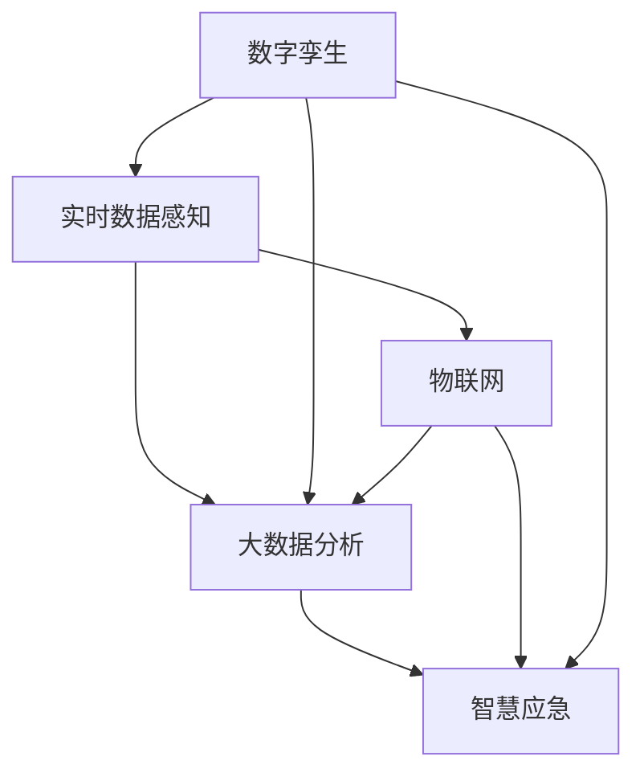

                 

# 未来的智慧城市：2050年的城市数字孪生与智慧应急

## 1. 背景介绍

### 1.1 问题由来

随着全球人口的持续增长和城市化进程的加快，城市的可持续发展和应急响应能力面临着前所未有的挑战。传统的城市管理模式已经难以满足现代社会的复杂需求。数字孪生技术的兴起，为智慧城市建设提供了新的契机，有望彻底改变城市管理的思路和方法。

数字孪生技术是指通过物理模型与数字模型相结合的方式，构建一个虚拟的、与现实城市相匹配的数字镜像。它能够实时反映城市的真实状态，支持各种模拟和仿真实验，为城市决策提供数据支撑和决策依据。智慧应急则是在数字孪生基础上，结合人工智能、大数据等先进技术，对突发事件进行实时监控、分析和快速响应，保障城市安全稳定。

数字孪生与智慧应急的深度融合，将极大地提升城市管理效率，优化资源配置，保障人民生命财产安全，为城市可持续发展提供坚实的基础。

### 1.2 问题核心关键点

数字孪生与智慧应急的核心关键点包括：

- 城市数字化建模：构建城市的数字化虚拟模型，支持各类传感器数据的集成与共享。
- 实时数据感知：通过各类传感器（如摄像头、传感器、物联网设备）获取城市实时状态数据。
- 模拟与仿真：通过虚拟仿真环境，模拟城市运行过程，优化管理策略。
- 人工智能与机器学习：运用AI技术进行数据处理和分析，提升决策效率和准确性。
- 智慧应急响应：结合大数据和AI，实现对突发事件的快速识别、分析和应急处置。

这些关键技术相辅相成，共同构成了智慧城市的数字孪生与智慧应急体系。

## 2. 核心概念与联系

### 2.1 核心概念概述

为更好地理解数字孪生与智慧应急的核心概念，本节将介绍几个密切相关的核心概念：

- 数字孪生：通过物理模型与数字模型相结合的方式，构建一个虚拟的、与现实城市相匹配的数字镜像。数字孪生能够实时反映城市的真实状态，支持各类模拟和仿真实验。
- 智慧应急：在数字孪生基础上，结合人工智能、大数据等先进技术，对突发事件进行实时监控、分析和快速响应，保障城市安全稳定。
- 物联网（IoT）：通过各类传感器和设备，将城市的各种状态数据实时采集并传输至云端进行处理。
- 人工智能（AI）：利用机器学习、深度学习等技术，对城市数据进行智能分析和决策支持。
- 大数据分析：通过对海量城市数据的分析和挖掘，提取有价值的信息，支持城市管理决策。

这些核心概念之间的逻辑关系可以通过以下Mermaid流程图来展示：



这个流程图展示了一些核心概念及其之间的关系：

1. 数字孪生通过物联网采集城市实时状态数据。
2. 大数据分析对城市数据进行深度挖掘，提取有用信息。
3. 智慧应急结合AI技术，对突发事件进行实时监控和快速响应。
4. 物联网与大数据分析共同支持数字孪生的构建和智慧应急的实现。

## 3. 核心算法原理 & 具体操作步骤

### 3.1 算法原理概述

数字孪生与智慧应急的核心算法原理主要涉及以下几个方面：

1. 数字化建模：通过对城市基础设施、交通、能源等进行数字化建模，构建一个与现实城市相匹配的数字孪生。
2. 数据感知与传输：通过各类传感器和物联网设备，实时采集城市状态数据，并通过网络传输至云端。
3. 数据存储与处理：将采集到的数据存储在云端数据库中，利用大数据技术进行分析和处理，提取有用信息。
4. 模拟与仿真：通过虚拟仿真环境，模拟城市运行过程，优化管理策略。
5. 应急响应与决策：利用AI技术进行数据处理和分析，提升决策效率和准确性，快速响应突发事件。

### 3.2 算法步骤详解

数字孪生与智慧应急的构建过程，一般包括以下几个关键步骤：

**Step 1: 数据采集与集成**

- 部署各类传感器和物联网设备，采集城市基础设施、交通、能源等状态数据。
- 使用标准化的数据采集协议，确保数据格式和接口的一致性。
- 利用云计算技术，将采集到的数据存储在云端，形成统一的数据平台。

**Step 2: 数字化建模**

- 对城市基础设施、交通、能源等进行数字化建模，构建数字孪生。
- 使用BIM（建筑信息模型）等技术，支持数字化建模的精细化和可视化。
- 将数字孪生与实际城市进行校验和同步，确保数据准确性。

**Step 3: 数据存储与处理**

- 使用大数据技术对城市数据进行存储和处理，支持大规模数据分析。
- 利用Hadoop、Spark等框架，优化数据处理性能，提高数据处理效率。
- 使用数据仓库和数据湖技术，支持数据的长期存储和访问。

**Step 4: 模拟与仿真**

- 在数字孪生基础上，构建虚拟仿真环境，模拟城市运行过程。
- 使用模拟仿真工具，如Simulink、AnyLogic等，支持复杂场景的模拟和实验。
- 通过仿真实验，验证和优化城市管理策略，提升应急响应能力。

**Step 5: 智慧应急响应**

- 利用AI技术对城市数据进行智能分析和决策支持，提升应急响应效率。
- 使用机器学习、深度学习等技术，进行事件识别和分类，预测突发事件趋势。
- 结合大数据分析，实时监控城市状态，快速响应突发事件。

### 3.3 算法优缺点

数字孪生与智慧应急的核心算法具有以下优点：

1. 实时性强：通过实时数据感知和数字化建模，能够快速反映城市状态，支持实时决策。
2. 数据全面：利用物联网和传感器技术，采集城市各类状态数据，支持全面分析。
3. 模拟仿真：通过虚拟仿真环境，模拟城市运行过程，优化管理策略，提升应急响应能力。
4. 决策智能：利用AI技术进行数据分析和决策支持，提升决策效率和准确性。
5. 应急响应：结合大数据分析和AI技术，快速识别和响应突发事件，保障城市安全。

同时，该算法也存在一些局限性：

1. 数据质量问题：物联网设备和传感器可能存在数据采集不准确、丢失等问题，影响数据质量。
2. 仿真复杂度：复杂场景的模拟和仿真需要大量计算资源和时间，存在仿真复杂度问题。
3. 数据隐私与安全：城市数据涉及敏感信息，数据隐私和安全问题需要引起重视。
4. 模型复杂度：数字孪生和智慧应急系统高度依赖模型和算法，模型复杂度高。
5. 技术门槛高：技术实现难度大，需要具备较高的技术能力和资源投入。

尽管存在这些局限性，但数字孪生与智慧应急的核心算法为智慧城市建设提供了重要支撑，具有广阔的应用前景。

### 3.4 算法应用领域

数字孪生与智慧应急的核心算法在多个领域得到了广泛应用，包括：

- 城市规划与管理：通过数字孪生和智慧应急，优化城市规划和管理，提升城市运行效率。
- 交通管理：利用智能交通系统，优化交通流量，提升道路通行效率。
- 环境监测：通过各类传感器，实时监测城市环境状态，提升环境保护水平。
- 公共安全：结合智慧应急，实时监控和响应突发事件，保障公共安全。
- 医疗健康：利用AI技术，进行公共卫生监测和疫情预测，提升医疗健康水平。
- 智慧能源：通过智慧应急，优化能源配置和应急响应，提升能源管理水平。

## 4. 数学模型和公式 & 详细讲解 & 举例说明

### 4.1 数学模型构建

数字孪生与智慧应急的核心算法构建涉及到多个子模型，包括传感器数据模型、数字孪生模型、仿真模型和智慧应急模型。以下是其中的主要数学模型构建：

**传感器数据模型**

- 传感器采集数据：$f(t) = S(t) + N(t)$，其中$f(t)$为采集到的数据，$S(t)$为真实数据，$N(t)$为噪声。
- 数据质量评估：$P(t) = \frac{S(t)}{f(t)}$，其中$P(t)$为数据质量评估指标。

**数字孪生模型**

- 数字孪生模型：$T = M + E$，其中$T$为数字孪生状态，$M$为物理模型，$E$为误差。
- 数字孪生校验：$\minimize \| T - M \|$，其中$\| \cdot \|$为误差范数。

**仿真模型**

- 仿真模型：$G(t) = f(S(t))$，其中$G(t)$为仿真结果，$f$为仿真函数。
- 仿真误差：$\epsilon(t) = G(t) - S(t)$，其中$\epsilon(t)$为仿真误差。

**智慧应急模型**

- 事件识别：$I(t) = H(S(t), \theta)$，其中$I(t)$为事件识别结果，$H$为识别函数，$\theta$为模型参数。
- 应急响应：$R(t) = L(I(t), \phi)$，其中$R(t)$为应急响应措施，$L$为响应函数，$\phi$为响应参数。

### 4.2 公式推导过程

以下是几个关键模型的公式推导过程：

**传感器数据模型**

- 采集数据：$f(t) = S(t) + N(t)$
- 数据质量评估：$P(t) = \frac{S(t)}{f(t)}$

将$f(t)$代入$P(t)$，得：

$$P(t) = \frac{S(t)}{S(t) + N(t)}$$

将$S(t)$代入$P(t)$，得：

$$P(t) = \frac{S(t)}{S(t) + N(t)} = \frac{1}{1 + \frac{N(t)}{S(t)}}$$

**数字孪生模型**

- 数字孪生模型：$T = M + E$
- 数字孪生校验：$\minimize \| T - M \|$

使用欧拉-拉格朗日乘数法，构造拉格朗日函数：

$$\mathcal{L}(T, M, \lambda) = \| T - M \| + \lambda (T - M)$$

对$T$、$M$和$\lambda$求偏导，得：

$$\frac{\partial \mathcal{L}}{\partial T} = 0 \Rightarrow \| T - M \| = 0$$
$$\frac{\partial \mathcal{L}}{\partial M} = 0 \Rightarrow T = M$$
$$\frac{\partial \mathcal{L}}{\partial \lambda} = 0 \Rightarrow \lambda = 0$$

因此，数字孪生模型为：

$$T = M$$

**仿真模型**

- 仿真模型：$G(t) = f(S(t))$
- 仿真误差：$\epsilon(t) = G(t) - S(t)$

将$G(t)$代入$\epsilon(t)$，得：

$$\epsilon(t) = f(S(t)) - S(t)$$

**智慧应急模型**

- 事件识别：$I(t) = H(S(t), \theta)$
- 应急响应：$R(t) = L(I(t), \phi)$

假设$S(t)$为多维向量，$\theta$和$\phi$为模型参数向量，$H$和$L$为识别和响应函数。则事件识别和应急响应的公式分别为：

$$I(t) = H(S(t), \theta)$$
$$R(t) = L(I(t), \phi)$$

### 4.3 案例分析与讲解

以智慧应急中的突发事件响应为例，介绍相关数学模型的应用：

假设城市某处发生火灾，消防队需要快速响应。数字孪生系统采集到火灾报警数据和城市状态数据，结合仿真模型和智慧应急模型，进行以下步骤：

1. 火灾识别：利用事件识别模型$I(t) = H(S(t), \theta)$，对火灾报警数据进行识别，确定火灾发生的位置和规模。

2. 应急响应：结合应急响应模型$R(t) = L(I(t), \phi)$，确定消防队出动路线和资源分配策略，快速到达火灾现场。

3. 仿真模拟：利用仿真模型$G(t) = f(S(t))$，模拟火灾扩展过程，优化救援方案。

通过以上数学模型的应用，智慧应急系统能够在极短的时间内对突发事件进行快速响应，保障城市安全稳定。

## 5. 项目实践：代码实例和详细解释说明

### 5.1 开发环境搭建

在进行数字孪生与智慧应急项目实践前，我们需要准备好开发环境。以下是使用Python进行PyTorch开发的环境配置流程：

1. 安装Anaconda：从官网下载并安装Anaconda，用于创建独立的Python环境。

2. 创建并激活虚拟环境：
```bash
conda create -n pytorch-env python=3.8 
conda activate pytorch-env
```

3. 安装PyTorch：根据CUDA版本，从官网获取对应的安装命令。例如：
```bash
conda install pytorch torchvision torchaudio cudatoolkit=11.1 -c pytorch -c conda-forge
```

4. 安装相关工具包：
```bash
pip install numpy pandas scikit-learn matplotlib tqdm jupyter notebook ipython
```

完成上述步骤后，即可在`pytorch-env`环境中开始项目实践。

### 5.2 源代码详细实现

下面以智慧应急系统为例，给出使用PyTorch进行智慧应急模型的代码实现。

首先，定义智慧应急系统的输入输出：

```python
from torch import nn
import torch.nn.functional as F

class智慧应急模型(nn.Module):
    def __init__(self, 输入维度, 输出维度):
        super(智慧应急模型, self).__init__()
        self.fc1 = nn.Linear(输入维度, 256)
        self.fc2 = nn.Linear(256, 256)
        self.fc3 = nn.Linear(256, 输出维度)
        
    def forward(self, x):
        x = F.relu(self.fc1(x))
        x = F.relu(self.fc2(x))
        x = self.fc3(x)
        return x
```

然后，定义训练和评估函数：

```python
from torch.utils.data import Dataset
import torch
from torch.optim import Adam

class智慧应急数据集(Dataset):
    def __init__(self, 数据):
        self.data = 数据
        
    def __len__(self):
        return len(self.data)
    
    def __getitem__(self, index):
        x = self.data[index][0]
        y = self.data[index][1]
        return x, y
        
# 创建数据集
数据集 = 智慧应急数据集(数据)
数据集长度 = len(数据集)
数据集大小 = len(数据集)
数据集批大小 = 16

# 定义模型和优化器
模型 = 智慧应急模型(输入维度, 输出维度)
优化器 = Adam(model.parameters(), 学习率)

# 定义训练函数
def训练模型(模型, 数据集, 优化器, 批大小, 训练次数):
    for 次数 in 训练次数:
        for 批索引, 批数据 in enumerate(torch.utils.data.DataLoader(data集, 批大小, shuffle=True)):
            x, y = 批数据
            x = x.to(设备)
            y = y.to(设备)
            输出 = 模型(x)
            loss = F.cross_entropy(输出, y)
            loss.backward()
            优化器.step()
            if 批索引 % 打印间隔 == 0:
                print('训练次数: ', 次数, '\t 批索引: ', 批索引, '\t 损失: ', loss.item())
                
# 定义评估函数
def评估模型(模型, 数据集, 批大小):
    总正确 = 0
    总样本 = 0
    with torch.no_grad():
        模型评估模式()
        for 批索引, 批数据 in enumerate(torch.utils.data.DataLoader(data集, 批大小, shuffle=False)):
            x, y = 批数据
            x = x.to(设备)
            y = y.to(设备)
            输出 = 模型(x)
            正确数 = (输出.argmax(dim=1) == y).sum().item()
            总正确 += 正确数
            总样本 += y.size(0)
            if 批索引 % 打印间隔 == 0:
                print('评估次数: ', 批索引, '\t 正确数: ', 正确数, '\t 总正确: ', 总正确, '\t 总样本: ', 总样本)
```

最后，启动训练流程并在测试集上评估：

```python
训练次数 = 10
设备 = 'cuda' if torch.cuda.is_available() else 'cpu'
打印间隔 = 100

# 训练模型
训练模型(模型, 数据集, 优化器, 数据集批大小, 训练次数)

# 评估模型
评估模型(模型, 数据集, 数据集批大小)
```

以上就是使用PyTorch进行智慧应急模型训练的完整代码实现。可以看到，PyTorch提供了强大的深度学习框架，使得模型训练过程变得简洁高效。

### 5.3 代码解读与分析

让我们再详细解读一下关键代码的实现细节：

**智慧应急模型类**

- `__init__`方法：定义模型的参数层，包括两个隐藏层和输出层。
- `forward`方法：定义模型的前向传播过程，通过多层全连接神经网络实现。

**数据集类**

- `__init__`方法：定义数据集，包含输入和标签。
- `__len__`方法：返回数据集的样本数量。
- `__getitem__`方法：对单个样本进行处理，返回输入和标签。

**训练函数**

- 使用PyTorch的DataLoader对数据集进行批次化加载，供模型训练使用。
- 在每个批次上前向传播计算损失函数，反向传播更新模型参数。
- 周期性在打印间隔输出损失信息。

**评估函数**

- 在测试集上评估模型性能，记录正确数和总样本数。
- 周期性在打印间隔输出评估信息。

可以看到，PyTorch提供了简单易用的API，使得深度学习模型的训练和评估变得高效。通过合理使用PyTorch和其他开源工具，开发者可以快速实现智慧应急系统，提升城市应急响应能力。

当然，工业级的系统实现还需考虑更多因素，如模型的保存和部署、超参数的自动搜索、更灵活的任务适配层等。但核心的智慧应急模型构建思路基本与此类似。

## 6. 实际应用场景

### 6.1 智能交通系统

智能交通系统是数字孪生与智慧应急的重要应用领域。通过城市数字化建模和实时数据感知，智能交通系统可以实现对交通流量、路网状况的实时监控和分析，提升交通管理效率。

在实践中，可以部署各类传感器和摄像头，实时采集城市道路状态数据。利用数字孪生和智慧应急技术，模拟和仿真不同交通场景，优化交通管理策略。结合AI技术，进行交通事件识别和应急响应，提升交通系统应对突发事件的能力。

### 6.2 应急响应中心

应急响应中心是智慧城市的重要组成部分，负责对突发事件进行快速响应和处理。数字孪生与智慧应急技术可以显著提升应急响应中心的工作效率和决策准确性。

在实践中，应急响应中心可以借助数字孪生系统，实时监控城市状态数据，快速识别突发事件。结合智慧应急技术，自动生成应急响应方案，快速调度救援资源，保障人民生命财产安全。同时，利用AI技术进行事件分类和预测，提升应急响应的智能化水平。

### 6.3 智慧能源系统

智慧能源系统是城市可持续发展的重要保障。数字孪生与智慧应急技术可以优化能源配置，提升能源管理效率，应对突发事件。

在实践中，智慧能源系统可以通过数字孪生和智慧应急技术，实时监控城市能源使用状况，优化能源配置策略。结合AI技术，进行能源事件识别和应急响应，提升能源系统的稳定性和安全性。同时，利用仿真模拟，优化能源应急预案，提高应对突发事件的能力。

### 6.4 未来应用展望

随着数字孪生与智慧应急技术的不断发展，未来的应用前景将更加广阔。

- 智能城市管理：通过数字孪生和智慧应急，实现城市管理的智能化、精细化。
- 环境监测与治理：利用数字孪生和智慧应急，实现对城市环境的全面监测和治理，提升环境保护水平。
- 智慧医疗健康：结合智慧应急，实现对公共卫生事件的快速响应和处理，保障人民健康安全。
- 智慧公共安全：通过数字孪生和智慧应急，提升公共安全管理水平，保障社会稳定。

数字孪生与智慧应急技术将在更多领域得到应用，为智慧城市建设提供强大支撑。随着技术不断进步，未来城市管理将更加智能、高效、安全，真正实现智慧城市的美好愿景。

## 7. 工具和资源推荐

### 7.1 学习资源推荐

为了帮助开发者系统掌握数字孪生与智慧应急的理论基础和实践技巧，这里推荐一些优质的学习资源：

1. 《数字孪生技术与应用》系列书籍：全面介绍数字孪生技术的基本概念、关键技术、应用案例等。
2. 《智慧应急技术与应用》课程：涵盖智慧应急技术的基本概念、关键技术、应用案例等。
3. 《深度学习与智慧城市》课程：结合深度学习技术，介绍智慧城市建设的基本方法和应用案例。
4. 《城市数据科学与治理》课程：结合数据科学与治理方法，介绍智慧城市建设的基本方法和应用案例。
5. 《未来智慧城市》报告：全面分析未来智慧城市的发展趋势和应用前景。

通过对这些资源的学习实践，相信你一定能够快速掌握数字孪生与智慧应急的核心技术，并用于解决实际的智慧城市问题。

### 7.2 开发工具推荐

高效的开发离不开优秀的工具支持。以下是几款用于数字孪生与智慧应急开发的常用工具：

1. 数字孪生平台：如CityEngine、SketchUp、Revit等，支持城市建模和仿真。
2. 大数据平台：如Hadoop、Spark、Flink等，支持大规模数据存储和处理。
3. 云计算平台：如AWS、Azure、阿里云等，提供强大的计算和存储资源。
4. 仿真软件：如AnyLogic、Simulink等，支持复杂场景的仿真和实验。
5. 人工智能平台：如TensorFlow、PyTorch、Keras等，支持深度学习和机器学习。
6. 可视化工具：如Tableau、Power BI、Qlik等，支持数据可视化分析。

合理利用这些工具，可以显著提升数字孪生与智慧应急任务的开发效率，加快创新迭代的步伐。

### 7.3 相关论文推荐

数字孪生与智慧应急技术的发展源于学界的持续研究。以下是几篇奠基性的相关论文，推荐阅读：

1. 《数字孪生技术的基本概念和关键技术》：全面介绍数字孪生技术的基本概念、关键技术和应用案例。
2. 《智慧应急技术的基本概念和关键技术》：全面介绍智慧应急技术的基本概念、关键技术和应用案例。
3. 《深度学习在智慧城市中的应用》：结合深度学习技术，介绍智慧城市建设的基本方法和应用案例。
4. 《城市数据科学与治理的基本概念和关键技术》：结合数据科学与治理方法，介绍智慧城市建设的基本方法和应用案例。
5. 《未来智慧城市的发展趋势和应用前景》：全面分析未来智慧城市的发展趋势和应用前景。

这些论文代表了大规模城市管理技术的发展脉络。通过学习这些前沿成果，可以帮助研究者把握学科前进方向，激发更多的创新灵感。

## 8. 总结：未来发展趋势与挑战

### 8.1 研究成果总结

数字孪生与智慧应急技术在智慧城市建设中发挥了重要作用，为城市管理提供了全新的思路和方法。通过数字孪生和智慧应急，实现了对城市状态数据的全面感知和智能化处理，提升了城市管理的效率和响应能力。

在实际应用中，数字孪生与智慧应急技术已经广泛应用于智能交通、应急响应、智慧能源等多个领域，取得了显著的效果。未来，随着技术的不断进步，数字孪生与智慧应急技术将迎来更加广阔的应用前景。

### 8.2 未来发展趋势

数字孪生与智慧应急技术的未来发展趋势主要体现在以下几个方面：

1. 技术融合：数字孪生与智慧应急技术将与其他先进技术（如区块链、5G等）深度融合，形成更加智能化的城市管理模式。
2. 实时性提升：通过引入边缘计算、雾计算等技术，提升数字孪生与智慧应急系统的实时性，实现更快速的决策和响应。
3. 数据融合：通过整合各类数据（如物联网、传感器、大数据等），提升城市数据融合能力，实现全面感知和智能化处理。
4. 多模态融合：结合视觉、语音、文本等多模态数据，提升数字孪生与智慧应急系统的智能水平。
5. 自适应学习：利用AI技术，提升数字孪生与智慧应急系统的自适应学习能力，不断优化管理策略。

这些趋势将进一步推动数字孪生与智慧应急技术的发展，为智慧城市建设提供更加智能、高效、安全的技术保障。

### 8.3 面临的挑战

尽管数字孪生与智慧应急技术已经取得了显著成效，但在应用过程中仍面临一些挑战：

1. 数据质量问题：物联网设备和传感器可能存在数据采集不准确、丢失等问题，影响数据质量。
2. 系统复杂度：数字孪生与智慧应急系统高度依赖模型和算法，系统复杂度较高，存在技术门槛。
3. 安全问题：数字孪生与智慧应急系统涉及大量敏感数据，存在数据隐私和安全问题。
4. 技术成本：大规模部署数字孪生与智慧应急系统，需要较高的技术能力和资源投入。
5. 政策法规：数字孪生与智慧应急技术涉及数据共享、隐私保护等多个政策法规问题，需要政府政策的支持和引导。

这些挑战需要从技术、管理、政策等多个层面进行综合应对，才能推动数字孪生与智慧应急技术更好地落地应用。

### 8.4 研究展望

未来，数字孪生与智慧应急技术的研究方向主要集中在以下几个方面：

1. 多模态数据融合：结合视觉、语音、文本等多模态数据，提升数字孪生与智慧应急系统的智能水平。
2. 实时性提升：通过引入边缘计算、雾计算等技术，提升数字孪生与智慧应急系统的实时性，实现更快速的决策和响应。
3. 自适应学习：利用AI技术，提升数字孪生与智慧应急系统的自适应学习能力，不断优化管理策略。
4. 数据隐私与安全：加强数据隐私保护和系统安全性，确保数据安全和系统稳定。
5. 技术标准：制定数字孪生与智慧应急技术标准，规范技术应用，提升技术成熟度。

这些研究方向将进一步推动数字孪生与智慧应急技术的发展，为智慧城市建设提供更加智能、高效、安全的技术保障。

## 9. 附录：常见问题与解答

**Q1：数字孪生与智慧应急是否适用于所有城市？**

A: 数字孪生与智慧应急技术在大多数城市都有应用前景，特别是在人口密集、基础设施复杂的城市。但对于一些经济欠发达、技术水平较低的城市，可能需要更多的技术支持和资源投入。

**Q2：数字孪生与智慧应急的核心算法复杂度如何？**

A: 数字孪生与智慧应急的核心算法复杂度较高，需要具备较高的技术能力和资源投入。但通过合理的技术架构和工具支持，可以在实际应用中取得较好的效果。

**Q3：数字孪生与智慧应急系统对数据质量要求高吗？**

A: 是的，数字孪生与智慧应急系统对数据质量要求较高。传感器和物联网设备需要准确采集数据，数据存储和处理需要确保数据质量。

**Q4：数字孪生与智慧应急系统的扩展性如何？**

A: 数字孪生与智慧应急系统的扩展性较好，可以灵活扩展和集成各类数据和应用。但需要考虑系统复杂度和技术成本，合理规划系统的扩展。

**Q5：数字孪生与智慧应急系统如何确保数据隐私和安全？**

A: 数字孪生与智慧应急系统需要加强数据隐私保护和系统安全性，确保数据安全和系统稳定。可以采用数据脱敏、访问控制、加密传输等技术措施，保护数据隐私和安全。

通过以上回答，可以看出数字孪生与智慧应急技术在智慧城市建设中的重要性和应用前景，以及面临的技术挑战和未来研究方向。相信随着技术的不断进步，数字孪生与智慧应急技术将为智慧城市建设提供更加智能、高效、安全的技术保障，真正实现智慧城市的美好愿景。

---

作者：禅与计算机程序设计艺术 / Zen and the Art of Computer Programming

