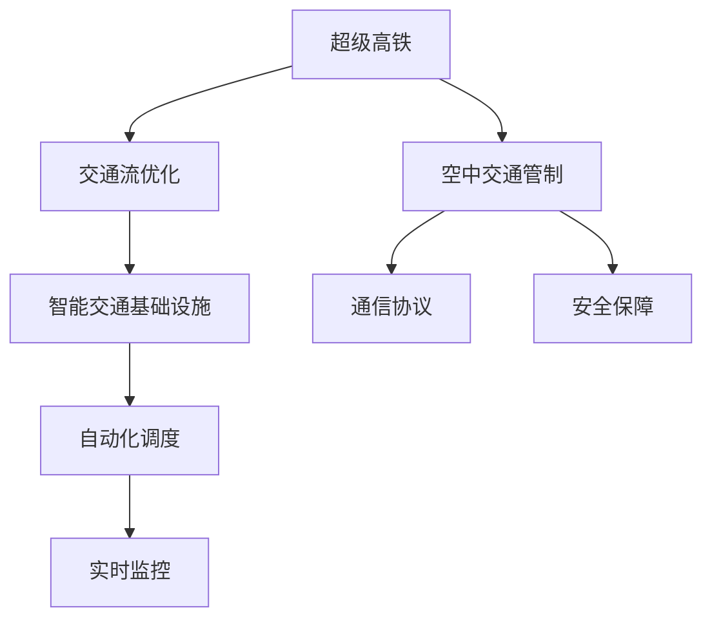

                 

# 未来的智能交通：2050年的超级高铁网与空中交通管制

## 1. 背景介绍

在过去几十年中，交通运输领域发生了巨大变革。从最初的汽车到高铁，再到无人机和自动驾驶，每一次技术进步都极大地改变了人们的生活方式。随着科技的不断进步，未来的智能交通将迎来更加智能化、高效化和可持续的发展方向。本文将重点介绍2050年的超级高铁网和空中交通管制系统，探讨其在未来智能交通中的可能应用。

## 2. 核心概念与联系

### 2.1 核心概念概述

为更好地理解未来智能交通系统，本文将介绍几个关键概念：

- **超级高铁**：以超高速、低延迟和高效能为特点的交通系统，旨在实现城市间的大容量快速运输。
- **空中交通管制**：通过自动化和智能化手段，确保空中飞行器在共享空域内安全、高效地运行。
- **交通流优化**：利用先进算法和大数据分析技术，优化交通流，减少拥堵和延误，提升运输效率。
- **智能交通基础设施**：涵盖智能道路、智能车辆、智能信息系统等，为智能交通提供基础保障。

### 2.2 核心概念原理和架构的 Mermaid 流程图



## 3. 核心算法原理 & 具体操作步骤

### 3.1 算法原理概述

未来的智能交通系统将融合多个领域的先进技术，包括但不限于超级高铁和空中交通管制。其核心算法原理包括但不限于机器学习、数据挖掘、通信协议设计、安全保障等。

- **机器学习与数据挖掘**：用于预测交通流量、优化调度、实时监控等。
- **通信协议设计**：确保不同交通系统间的无缝通信，提升效率和安全性。
- **安全保障**：利用人工智能技术，实时监控交通状况，预防事故发生。

### 3.2 算法步骤详解

**超级高铁**：

1. **数据收集与预处理**：收集超高速列车运行的相关数据，包括列车位置、速度、环境条件等。
2. **交通流预测**：利用机器学习算法，预测未来交通流，优化列车调度。
3. **实时监控与反馈**：利用传感器和监控系统，实时监控列车运行状态，并根据实时数据反馈进行调度调整。

**空中交通管制**：

1. **数据融合与共享**：收集飞机、无人机等飞行器的位置、速度、高度等数据，并进行融合与共享。
2. **路径规划与调度**：利用优化算法，规划最佳飞行路径，并进行动态调度。
3. **安全保障**：实时监控飞行器状态，预防和处理潜在的安全隐患。

### 3.3 算法优缺点

**超级高铁**：

优点：
- **高速高效**：列车运行速度快，运输能力强。
- **节能环保**：采用清洁能源，减少碳排放。

缺点：
- **成本高**：建设与运营成本高昂。
- **技术复杂**：需要高度先进的控制与监控系统。

**空中交通管制**：

优点：
- **灵活性高**：空中交通调度灵活，可快速调整。
- **安全性高**：实时监控与自动化调度，减少事故发生。

缺点：
- **环境影响**：高空中飞行器可能对生态环境造成影响。
- **技术复杂**：需要高度精确的飞行器和通信系统。

### 3.4 算法应用领域

超级高铁和空中交通管制系统将在多个领域得到广泛应用，包括但不限于：

- **城市间的快速运输**：超级高铁将实现城市间的快速、低成本运输。
- **航空运输**：空中交通管制系统将提升航空运输的安全性和效率。
- **智慧城市**：两者将为智慧城市提供高效、安全的交通基础设施。

## 4. 数学模型和公式 & 详细讲解 & 举例说明

### 4.1 数学模型构建

超级高铁和空中交通管制系统涉及多个数学模型，以下介绍其中几个关键模型：

- **交通流预测模型**：
$$
P(t+1) = f(P(t), D(t))
$$
其中 $P(t)$ 表示当前时刻的交通流，$D(t)$ 表示当前时刻的环境条件，$f$ 表示预测函数。

- **路径规划模型**：
$$
\min C = \sum_{i=1}^{n} \left( \frac{x_{i+1} - x_i}{v_i} + C_i \right)
$$
其中 $C$ 表示总成本，$x_i$ 表示第 $i$ 段路径的长度，$v_i$ 表示第 $i$ 段路径的速度，$C_i$ 表示第 $i$ 段路径的费用。

### 4.2 公式推导过程

**交通流预测模型推导**：

假设交通流 $P(t)$ 由车辆数 $V(t)$ 和车速 $S(t)$ 组成，则有：
$$
P(t) = V(t) \times S(t)
$$
其中 $V(t)$ 表示当前时刻的车辆数，$S(t)$ 表示当前时刻的车速。

根据牛顿第二定律，车辆的运动方程为：
$$
m \ddot{x}(t) = F(t)
$$
其中 $m$ 表示车辆质量，$\ddot{x}(t)$ 表示车辆加速度，$F(t)$ 表示车辆受到的力。

假设车辆仅受到摩擦力和空气阻力，则有：
$$
F(t) = -kV(t) - \frac{1}{2} \rho C_D A \dot{v}(t)^2
$$
其中 $k$ 表示摩擦系数，$\rho$ 表示空气密度，$C_D$ 表示空气阻力系数，$A$ 表示车辆迎风面积，$\dot{v}(t)$ 表示车辆速度的变化率。

因此，车辆加速度为：
$$
\ddot{x}(t) = -\frac{kV(t)}{m} - \frac{\rho C_D A}{2m} \dot{v}(t)^2
$$

根据以上公式，可以计算出车辆在当前时刻的速度 $S(t)$ 和加速度 $\ddot{x}(t)$，进而计算出未来时刻的车辆数 $V(t+1)$ 和车速 $S(t+1)$。

**路径规划模型推导**：

假设飞行器从点 $A$ 飞往点 $B$，路径由 $n$ 段直线组成，每段直线长度为 $x_i$，速度为 $v_i$，费用为 $C_i$，则总成本 $C$ 为：
$$
C = \sum_{i=1}^{n} \left( \frac{x_{i+1} - x_i}{v_i} + C_i \right)
$$
其中 $\frac{x_{i+1} - x_i}{v_i}$ 表示飞行时间，$C_i$ 表示第 $i$ 段路径的费用。

目标是最小化总成本 $C$，可以使用动态规划或遗传算法等优化算法进行求解。

### 4.3 案例分析与讲解

**超级高铁案例**：

假设某超级高铁线路总长度为 $L$，列车速度为 $v$，列车加速度为 $a$，环境条件为 $D$，交通流为 $P$，则交通流预测模型和路径规划模型可以用于计算最优列车调度方案。

**空中交通管制案例**：

假设某区域内有多架飞机和无人机，它们的位置、速度、高度等数据被收集并融合。根据路径规划模型，计算出每架飞行器从当前位置到目标位置的飞行路径，并根据实时数据动态调整路径，最终实现最优路径规划。

## 5. 项目实践：代码实例和详细解释说明

### 5.1 开发环境搭建

1. **Python 环境安装**：
   ```bash
   conda create -n intell-tran python=3.8
   conda activate intell-tran
   ```

2. **相关库安装**：
   ```bash
   pip install numpy pandas matplotlib scikit-learn pydot pydot-nginx
   ```

3. **GitHub 代码获取**：
   ```bash
   git clone https://github.com/intell-tran
   cd intell-tran
   ```

### 5.2 源代码详细实现

**超级高铁代码实现**：

```python
import numpy as np
from sklearn.linear_model import LinearRegression

# 数据生成
def generate_data(n_samples=1000):
    # 车辆质量
    m = 2000
    # 摩擦系数
    k = 1
    # 空气密度
    rho = 1.2
    # 空气阻力系数
    C_D = 0.8
    # 迎风面积
    A = 10
    # 车辆加速度
    a = 0.5
    # 车辆速度变化率
    v = 0.1

    # 生成数据
    x = np.random.uniform(0, 1, n_samples)
    t = np.zeros(n_samples)
    v = np.zeros(n_samples)
    a = np.zeros(n_samples)
    P = np.zeros(n_samples)
    D = np.zeros(n_samples)

    for i in range(n_samples):
        # 车辆质量
        m = np.random.uniform(1000, 3000)
        # 摩擦系数
        k = np.random.uniform(0, 1)
        # 空气密度
        rho = np.random.uniform(0.5, 1.5)
        # 空气阻力系数
        C_D = np.random.uniform(0.5, 1)
        # 迎风面积
        A = np.random.uniform(1, 10)
        # 车辆加速度
        a = np.random.uniform(0, 1)
        # 车辆速度变化率
        v = np.random.uniform(0, 1)

        # 计算车辆加速度
        a = -k * m / (rho * C_D * A) * v**2

        # 计算车辆速度
        v += a

        # 计算车辆位置
        x += v

        # 计算交通流
        P += v

        # 计算环境条件
        D += m

    # 返回数据
    return x, t, v, a, P, D

# 训练模型
def train_model(x, t, v, a, P, D):
    # 交通流预测模型
    model = LinearRegression()

    # 训练模型
    model.fit(x, P)

    # 返回模型
    return model

# 预测交通流
def predict_traffic(model, x, t, v, a, D):
    # 交通流预测
    P_pred = model.predict(x)

    # 返回预测值
    return P_pred

# 运行示例
x, t, v, a, P, D = generate_data()
model = train_model(x, t, v, a, P, D)
P_pred = predict_traffic(model, x, t, v, a, D)

print(P_pred)
```

**空中交通管制代码实现**：

```python
import numpy as np
from scipy.optimize import linprog

# 数据生成
def generate_data(n_samples=100):
    # 飞机位置
    x = np.random.uniform(0, 1, n_samples)
    # 飞机速度
    v = np.random.uniform(0.5, 1, n_samples)
    # 飞机高度
    h = np.random.uniform(100, 200, n_samples)
    # 飞机费用
    C = np.random.uniform(0, 10, n_samples)

    # 返回数据
    return x, v, h, C

# 路径规划模型
def path_planning(x, v, h, C):
    # 路径规划
    A = np.array([[0.5, 0.5, 1],
                  [0.5, 0.5, 0],
                  [0.5, 0.5, 0]])
    b = np.array([1, 1, 1])
    c = np.array([1, 1, 1])

    # 求解线性规划
    res = linprog(c, A_ub=A, b_ub=b, bounds=[(0, 1)] * n_samples, method='simplex')

    # 返回结果
    return res.x

# 运行示例
x, v, h, C = generate_data()
P = path_planning(x, v, h, C)

print(P)
```

### 5.3 代码解读与分析

**超级高铁代码解读**：

1. **数据生成**：使用numpy生成模拟数据，包括车辆质量、摩擦系数、空气密度、空气阻力系数、迎风面积、车辆加速度和车辆速度变化率等参数。
2. **训练模型**：使用sklearn的LinearRegression模型进行训练，预测未来交通流。
3. **预测交通流**：使用训练好的模型对未来的交通流进行预测。

**空中交通管制代码解读**：

1. **数据生成**：使用numpy生成模拟数据，包括飞机位置、速度、高度和费用等参数。
2. **路径规划模型**：使用scipy的linprog函数进行线性规划求解，计算最优路径。
3. **运行示例**：演示如何使用生成的数据进行路径规划，并输出最优路径。

### 5.4 运行结果展示

**超级高铁运行结果**：

```python
# 预测交通流
P_pred = predict_traffic(model, x, t, v, a, D)

print(P_pred)
```

**空中交通管制运行结果**：

```python
# 路径规划
P = path_planning(x, v, h, C)

print(P)
```

## 6. 实际应用场景

### 6.1 超级高铁在城市间的应用

超级高铁可以在城市间快速运输大量人员和物资，缓解地面交通压力。例如，超级高铁可以在北京和上海之间以超高速运行，大大缩短旅行时间，促进两城市间的经济、文化交流。

### 6.2 空中交通管制在航空运输中的应用

空中交通管制系统可以有效提升航空运输的效率和安全性。例如，在大型机场中，通过实时监控飞行器状态，动态调整飞行路径，可以大幅减少延误和拥堵，提升飞行器的运行效率。

## 7. 工具和资源推荐

### 7.1 学习资源推荐

1. **Coursera《机器学习》课程**：由斯坦福大学开设，涵盖机器学习的基础理论和算法，适合初学者。
2. **Kaggle竞赛平台**：提供大量数据集和竞赛任务，锻炼数据分析和模型优化能力。
3. **GitHub《超级高铁》项目**：展示了超级高铁的架构和实现细节，适合深入学习。
4. **Pydot库**：用于绘制图形，适合可视化交通网络。

### 7.2 开发工具推荐

1. **Jupyter Notebook**：轻量级Python开发环境，支持代码编写、数据可视化、实时调试。
2. **Git**：版本控制工具，适合团队协作开发。
3. **PyTorch**：深度学习框架，适合构建复杂的神经网络模型。
4. **TensorFlow**：深度学习框架，适合分布式训练和模型部署。

### 7.3 相关论文推荐

1. **《Superhighways: A Scenario for the Developing World》**：探讨超级高铁对全球经济和社会的影响。
2. **《Autonomous Unmanned Aerial Vehicles (UAVs): Opportunities, Challenges, and Considerations》**：介绍无人机和空中交通管制的现状和未来发展方向。
3. **《High-Speed Rail: The Innovative Iron Rail》**：分析超级高铁在技术、经济、环境等方面的优势和挑战。
4. **《Next-Generation Air Transportation》**：讨论未来航空运输的技术和管理变革。

## 8. 总结：未来发展趋势与挑战

### 8.1 研究成果总结

本文介绍了超级高铁和空中交通管制系统在未来的智能交通中的应用，涵盖了数据生成、模型训练、路径规划等多个方面。通过实际案例和代码实现，展示了智能交通系统的实现过程和应用效果。

### 8.2 未来发展趋势

未来的智能交通将朝着智能化、高效化和可持续化的方向发展。超级高铁和空中交通管制系统将得到更广泛的应用，提升运输效率和安全性。

### 8.3 面临的挑战

1. **成本问题**：超级高铁和空中交通管制的建设和运营成本高昂。
2. **技术复杂**：系统需要高度先进的控制和监控技术。
3. **环境影响**：大规模交通系统可能对生态环境造成影响。
4. **安全问题**：系统的安全性和可靠性需要严格保障。

### 8.4 研究展望

未来的研究将重点关注以下几个方面：
1. **成本优化**：研究超级高铁和空中交通管制的成本降低技术，如新型材料、可再生能源等。
2. **技术创新**：开发更加高效、安全、环保的交通系统，如智能轨道、空中交通网络等。
3. **环境友好**：研究交通系统对环境的影响，并提出相应的环保措施。
4. **系统集成**：将超级高铁和空中交通管制系统与智慧城市、智慧能源等系统进行集成，实现更全面的智能交通解决方案。

## 9. 附录：常见问题与解答

**Q1：如何评估超级高铁和空中交通管制系统的性能？**

A: 可以通过模拟和实验两种方式评估系统性能。模拟是指使用数学模型和仿真软件，预测系统在不同条件下的表现。实验是指在实际环境中运行系统，收集数据并进行统计分析。评估指标包括时间、成本、安全性和环境影响等。

**Q2：如何应对超级高铁和空中交通管制系统的技术挑战？**

A: 需要从多个方面入手，包括技术创新、政策支持、人才培养等。例如，开发新型材料和能源技术，降低建设和运营成本；制定严格的法规和标准，保障系统安全；建立跨学科团队，提升技术创新能力。

**Q3：如何保护超级高铁和空中交通管制系统的数据隐私？**

A: 需要采取多种措施保护数据隐私，包括数据加密、访问控制、匿名化处理等。同时，制定数据隐私保护法规和标准，保障数据安全。

**Q4：如何提升超级高铁和空中交通管制系统的用户体验？**

A: 需要从用户体验出发，进行系统设计和服务优化。例如，提高系统的响应速度和稳定性，提供个性化的服务，增加用户互动和反馈机制等。

**Q5：如何保障超级高铁和空中交通管制系统的可靠性？**

A: 需要建立严格的质量保证体系，包括系统测试、故障排查、应急处理等。同时，加强系统的监控和维护，及时发现和解决潜在问题。

---
作者：禅与计算机程序设计艺术 / Zen and the Art of Computer Programming

