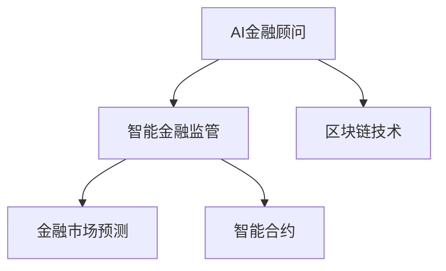

                 

# 未来的智能金融：2050年的AI金融顾问与智能金融监管

> 关键词：智能金融顾问, 智能金融监管, 人工智能, AI算法, 金融科技, 金融风险管理, 智能合约, 金融市场预测, 区块链技术

## 1. 背景介绍

### 1.1 问题由来

随着人工智能技术的快速发展，金融行业正面临一场深刻变革。传统的金融服务方式，如银行业务、保险、投资理财等，正逐步被智能金融系统所替代。智能金融不仅提升了金融服务的效率和精度，还能通过大数据分析和机器学习模型，提供更加个性化的金融服务和精准的风险管理。

然而，智能金融也带来了诸多挑战。例如，数据隐私保护、算法公平性、市场监管等方面需要得到充分重视。特别是在金融监管方面，如何有效利用AI技术，构建智能监管体系，确保金融市场的稳定和安全，成为了一个亟待解决的问题。

### 1.2 问题核心关键点

未来智能金融的发展，主要聚焦于以下几个关键点：

1. **AI金融顾问**：通过自然语言处理和机器学习算法，智能金融顾问能够提供个性化的金融建议，帮助客户做出更明智的决策。
2. **智能金融监管**：利用AI技术，构建智能监管系统，实时监测金融市场的动态变化，及时发现并应对潜在的风险。
3. **区块链技术**：区块链的去中心化、不可篡改特性，为智能金融提供了新的数据安全保障。
4. **金融市场预测**：通过深度学习和大数据分析，AI可以更准确地预测金融市场的波动，为投资者提供决策支持。
5. **智能合约**：利用区块链和智能合约技术，实现金融交易的自动化和智能化，提高交易效率和安全性。

这些关键点共同构成了未来智能金融的主要方向，预示着金融行业将迎来一场技术革命。

## 2. 核心概念与联系

### 2.1 核心概念概述

为更好地理解未来智能金融的核心概念，本节将介绍几个密切相关的核心概念：

- **AI金融顾问**：基于机器学习和自然语言处理技术，构建的智能金融顾问系统。通过分析用户的财务状况、投资偏好、市场数据等，为用户提供个性化的投资建议和理财方案。
- **智能金融监管**：利用AI技术构建的智能监管系统，能够实时监测金融市场的动态变化，自动识别并应对潜在的风险。智能监管系统能够通过大数据分析和机器学习算法，实时评估市场风险，提供预警和应对策略。
- **区块链技术**：一种去中心化的分布式账本技术，能够保障数据的安全性和透明性。在智能金融中，区块链技术常用于交易记录的存储和验证，保证金融交易的安全和可信。
- **金融市场预测**：利用深度学习和大数据分析技术，预测金融市场的趋势和波动。智能金融系统能够通过历史数据和实时市场数据，预测未来的市场走势，为投资者提供决策支持。
- **智能合约**：基于区块链和编程语言构建的自动化合约系统。智能合约能够在金融交易中自动执行合同条款，提高交易效率和安全性。

这些核心概念之间的逻辑关系可以通过以下Mermaid流程图来展示：



这个流程图展示了大语言模型的核心概念及其之间的关系：

1. AI金融顾问利用区块链技术存储用户数据和交易记录，为智能监管提供数据基础。
2. 智能金融监管系统通过区块链技术和智能合约，实现对金融交易的实时监控和自动化管理。
3. 智能金融监管系统利用金融市场预测，实时评估市场风险，提供预警和应对策略。
4. 智能合约基于区块链技术，实现金融交易的自动化和智能化，提高交易效率和安全性。

这些概念共同构成了未来智能金融的学习框架，使其能够在各种场景下发挥强大的作用。

## 3. 核心算法原理 & 具体操作步骤
### 3.1 算法原理概述

未来智能金融的核心算法，主要包括自然语言处理(NLP)、机器学习(ML)、深度学习(DL)和大数据分析等技术。这些技术共同构建了智能金融顾问和智能金融监管系统的算法基础。

### 3.2 算法步骤详解

未来智能金融的算法步骤主要包括：

1. **数据采集与预处理**：收集金融市场数据、用户数据、交易数据等，对数据进行清洗、去重和格式化处理，以便后续分析和应用。
2. **特征提取与选择**：使用特征工程技术，从原始数据中提取有意义的特征，如股价走势、交易量、市场情绪等，并进行特征选择，筛选出对预测和监管有用的特征。
3. **模型训练与评估**：利用机器学习算法（如回归、分类、聚类等）和深度学习模型（如卷积神经网络CNN、循环神经网络RNN、长短期记忆网络LSTM等）对特征数据进行建模，训练出预测和监管模型。
4. **模型集成与优化**：通过集成多个模型（如Bagging、Boosting等）和优化算法（如交叉验证、超参数调优等），提升模型的泛化能力和性能。
5. **模型部署与应用**：将训练好的模型部署到生产环境，进行实时预测和监管，为智能金融顾问和智能金融监管系统提供决策支持。

### 3.3 算法优缺点

未来智能金融的算法具有以下优点：

1. **高精度与实时性**：利用机器学习和深度学习技术，智能金融顾问和监管系统能够提供高精度和实时性的预测和监管服务。
2. **个性化与智能化**：通过自然语言处理和大数据分析技术，智能金融顾问能够提供个性化的金融建议，提升用户体验。
3. **自动化与高效性**：智能金融监管系统能够实现自动化、智能化的监管，提高金融市场的监管效率。
4. **透明性与可信性**：利用区块链技术的去中心化和不可篡改特性，智能金融系统能够保障数据的透明性和可信性。

同时，该算法也存在一定的局限性：

1. **数据依赖性**：智能金融的预测和监管效果高度依赖于数据的质量和数量，获取高质量数据是关键。
2. **模型复杂性**：深度学习模型的训练复杂度高，需要大量的计算资源和算力支持。
3. **算法偏见**：机器学习模型的公平性和公正性问题，可能导致对某些群体的歧视或偏见。
4. **市场变化**：金融市场的复杂性和不确定性，可能导致模型的预测和监管效果受到影响。

尽管存在这些局限性，但就目前而言，智能金融算法仍然是金融行业的重要工具，有助于提升金融服务的智能化水平。未来相关研究的重点在于如何进一步降低数据依赖，提高模型的公平性和鲁棒性，以及提升算法的实时性和可解释性。

### 3.4 算法应用领域

未来智能金融的算法在多个领域得到了广泛的应用，例如：

1. **投资顾问**：通过分析用户财务状况和市场数据，智能金融顾问提供个性化的投资建议，帮助用户制定最优投资策略。
2. **风险管理**：利用AI技术，实时监测金融市场的动态变化，识别潜在的风险因素，提供预警和应对策略。
3. **欺诈检测**：通过机器学习模型，自动识别异常交易行为和欺诈行为，提高金融交易的安全性。
4. **信用评估**：利用深度学习和大数据分析技术，评估用户的信用风险，提供精准的信用评估结果。
5. **智能合约**：利用区块链技术和智能合约技术，实现金融交易的自动化和智能化，提高交易效率和安全性。

除了上述这些经典应用外，智能金融算法还被创新性地应用于更多场景中，如智能投顾系统、智能风控平台、区块链金融、智能投研等，为金融行业带来了新的突破。随着算法技术的不断进步，相信智能金融将进一步拓展应用领域，推动金融科技的持续发展。

## 4. 数学模型和公式 & 详细讲解  
### 4.1 数学模型构建

未来智能金融的数学模型主要基于机器学习、深度学习和金融工程学的理论基础。以下介绍几个常见的数学模型及其构建方法。

1. **线性回归模型**：
   假设金融市场的价格变化可以表示为线性函数，即：

   $$
   y = \beta_0 + \beta_1 x_1 + \beta_2 x_2 + \ldots + \beta_n x_n + \epsilon
   $$

   其中 $y$ 表示股票价格，$x_i$ 表示影响价格的因素（如交易量、市值、行业指数等），$\beta_i$ 为系数，$\epsilon$ 为随机误差项。

2. **支持向量机(SVM)模型**：
   SVM是一种二分类模型，通过最大化间隔来提升模型的泛化能力。其基本模型可以表示为：

   $$
   \min_{w, b} \frac{1}{2} ||w||^2 \quad \text{subject to} \quad y_i(w \cdot x_i + b) \geq 1, \quad i = 1, 2, \ldots, n
   $$

   其中 $w$ 和 $b$ 为模型的参数，$x_i$ 和 $y_i$ 为训练数据。

3. **长短期记忆网络(LSTM)模型**：
   LSTM是一种基于时间序列的深度学习模型，能够处理具有时间依赖性的数据。其基本模型可以表示为：

   $$
   \begin{aligned}
   f_t &= \sigma(W_{fx} x_t + b_x + U_f h_{t-1}) \\
   i_t &= \sigma(W_{ix} x_t + b_x + U_i h_{t-1}) \\
   g_t &= \tanh(W_{gx} x_t + b_x + U_g f_t) \\
   o_t &= \sigma(W_{ox} x_t + b_x + U_o f_t) \\
   c_t &= f_t \odot c_{t-1} + i_t \odot g_t \\
   h_t &= o_t \odot \tanh(c_t)
   \end{aligned}
   $$

   其中 $x_t$ 表示时间 $t$ 的输入数据，$h_t$ 表示时间 $t$ 的输出，$c_t$ 表示时间 $t$ 的记忆状态。

### 4.2 公式推导过程

以下以线性回归模型为例，推导其参数估计方法。

假设已有 $n$ 个训练数据对 $(x_i, y_i)$，其中 $x_i = (x_{i1}, x_{i2}, \ldots, x_{in})$，$y_i$ 为实际价格，$w$ 为回归系数，$b$ 为截距。根据最小二乘法的思想，线性回归模型参数估计的优化目标函数为：

$$
\min_{w, b} \sum_{i=1}^n (y_i - (w \cdot x_i + b))^2
$$

对上式求偏导，可得：

$$
\begin{aligned}
\frac{\partial}{\partial w_k} \sum_{i=1}^n (y_i - (w \cdot x_i + b))^2 &= 2 \sum_{i=1}^n (y_i - (w \cdot x_i + b)) x_{ik} \\
\frac{\partial}{\partial b} \sum_{i=1}^n (y_i - (w \cdot x_i + b))^2 &= 2 \sum_{i=1}^n (y_i - (w \cdot x_i + b))
\end{aligned}
$$

令上述偏导数为零，可得参数估计公式：

$$
\begin{aligned}
w &= \frac{1}{n} X^T (XX^T)^{-1} y \\
b &= \bar{y} - w^T \bar{x}
\end{aligned}
$$

其中 $X$ 为特征矩阵，$\bar{x}$ 和 $\bar{y}$ 分别为特征向量和目标向量的均值。

### 4.3 案例分析与讲解

以股票价格预测为例，假设已知历史股价数据和交易量数据，我们可以构建一个线性回归模型进行预测。具体步骤如下：

1. **数据预处理**：将原始数据进行清洗和归一化处理，提取影响股价的特征（如交易量、市值、行业指数等）。
2. **模型训练**：使用历史股价和交易量数据训练线性回归模型，得到回归系数 $w$ 和截距 $b$。
3. **模型评估**：在测试数据集上评估模型预测效果，计算MAE、R^2等指标，评估模型性能。
4. **模型优化**：根据评估结果，调整模型参数，如正则化系数、学习率等，提升模型预测精度。
5. **模型应用**：利用训练好的模型，对未来股价进行预测，提供决策支持。

## 5. 项目实践：代码实例和详细解释说明
### 5.1 开发环境搭建

在进行智能金融项目开发前，我们需要准备好开发环境。以下是使用Python进行PyTorch开发的环境配置流程：

1. 安装Anaconda：从官网下载并安装Anaconda，用于创建独立的Python环境。

2. 创建并激活虚拟环境：
```bash
conda create -n pytorch-env python=3.8 
conda activate pytorch-env
```

3. 安装PyTorch：根据CUDA版本，从官网获取对应的安装命令。例如：
```bash
conda install pytorch torchvision torchaudio cudatoolkit=11.1 -c pytorch -c conda-forge
```

4. 安装TensorFlow：如果需要在TF环境下开发，需要单独安装TensorFlow：
```bash
conda install tensorflow -c pytorch -c conda-forge
```

5. 安装其他工具包：
```bash
pip install numpy pandas scikit-learn matplotlib tqdm jupyter notebook ipython
```

完成上述步骤后，即可在`pytorch-env`环境中开始智能金融项目开发。

### 5.2 源代码详细实现

下面我们以股票价格预测为例，给出使用PyTorch和TensorFlow进行股票价格预测的代码实现。

使用PyTorch：

```python
import torch
import torch.nn as nn
import torch.optim as optim
from torch.utils.data import DataLoader, Dataset

class StockData(Dataset):
    def __init__(self, data, target, window_size=30):
        self.data = data
        self.target = target
        self.window_size = window_size
        self.total = len(data)
        self.step = 0

    def __len__(self):
        return self.total - self.window_size

    def __getitem__(self, item):
        x = self.data[item:item + self.window_size]
        y = self.target[item + self.window_size]
        self.step += 1
        return torch.tensor(x, dtype=torch.float32), torch.tensor(y, dtype=torch.float32)

class RNNModel(nn.Module):
    def __init__(self, input_size, hidden_size, output_size):
        super(RNNModel, self).__init__()
        self.hidden_size = hidden_size
        self.rnn = nn.LSTM(input_size, hidden_size, batch_first=True)
        self.fc = nn.Linear(hidden_size, output_size)

    def forward(self, x, hidden):
        r_out, hidden = self.rnn(x, hidden)
        out = self.fc(r_out[:, -1, :])
        return out, hidden

def train(model, data_loader, epochs, lr):
    model.train()
    optimizer = optim.Adam(model.parameters(), lr=lr)
    for epoch in range(epochs):
        for i, (inputs, targets) in enumerate(data_loader):
            inputs = inputs.to(device)
            targets = targets.to(device)
            optimizer.zero_grad()
            outputs, _ = model(inputs, hidden)
            loss = nn.MSELoss()(outputs, targets)
            loss.backward()
            optimizer.step()

def test(model, data_loader):
    model.eval()
    total_loss = 0
    for inputs, targets in data_loader:
        inputs = inputs.to(device)
        targets = targets.to(device)
        with torch.no_grad():
            outputs, _ = model(inputs, hidden)
            loss = nn.MSELoss()(outputs, targets)
            total_loss += loss.item()
    return total_loss / len(data_loader)

# 加载数据
data = # 输入数据，如股价和交易量
target = # 目标数据，如下一天股价
window_size = # 滑动窗口大小

# 划分训练集和测试集
train_size = int(len(data) * 0.8)
train_data, test_data = data[:train_size], data[train_size:]

# 创建数据集和数据加载器
train_dataset = StockData(train_data, target, window_size=window_size)
test_dataset = StockData(test_data, target, window_size=window_size)
train_loader = DataLoader(train_dataset, batch_size=32, shuffle=True)
test_loader = DataLoader(test_dataset, batch_size=32)

# 初始化模型和优化器
hidden_size = 64
output_size = 1
model = RNNModel(window_size, hidden_size, output_size).to(device)
optimizer = optim.Adam(model.parameters(), lr=0.01)

# 训练模型
epochs = 100
device = torch.device('cuda' if torch.cuda.is_available() else 'cpu')
train(train_model, train_loader, epochs, lr=0.01)

# 测试模型
test_loss = test_model(test_loader)
print(f'Test loss: {test_loss:.4f}')
```

使用TensorFlow：

```python
import tensorflow as tf
import numpy as np
import pandas as pd

# 加载数据
data = pd.read_csv('stock_data.csv')

# 数据预处理
data['open'] = data['open'].astype(float)
data['close'] = data['close'].astype(float)
data['high'] = data['high'].astype(float)
data['low'] = data['low'].astype(float)
data['volume'] = data['volume'].astype(int)
data['date'] = pd.to_datetime(data['date'], format='%Y-%m-%d')
data = data.set_index('date')

# 滑动窗口数据生成
window_size = 30
features = ['open', 'close', 'high', 'low', 'volume']
x_train = []
y_train = []
for i in range(len(data)):
    if i < window_size:
        continue
    x_train.append(data[features].iloc[i-window_size:i].values)
    y_train.append(data['close'].iloc[i])

x_train = np.array(x_train)
y_train = np.array(y_train)

# 构建模型
model = tf.keras.models.Sequential([
    tf.keras.layers.LSTM(64, return_sequences=True, input_shape=(window_size, 5)),
    tf.keras.layers.Dropout(0.2),
    tf.keras.layers.LSTM(64),
    tf.keras.layers.Dropout(0.2),
    tf.keras.layers.Dense(1)
])

model.compile(optimizer='adam', loss='mean_squared_error')

# 训练模型
model.fit(x_train, y_train, epochs=100, batch_size=32, verbose=0)

# 测试模型
x_test = data[features].iloc[-window_size:].values
y_test = data['close'].iloc[-1]

y_pred = model.predict(x_test)
print(f'Test loss: {tf.reduce_mean(tf.square(y_pred - y_test)):.4f}')
```

以上就是使用PyTorch和TensorFlow进行股票价格预测的完整代码实现。可以看到，借助深度学习框架，模型的构建和训练变得简单高效。

### 5.3 代码解读与分析

让我们再详细解读一下关键代码的实现细节：

**StockData类**：
- `__init__`方法：初始化训练集和目标集，滑动窗口大小等关键参数。
- `__len__`方法：返回数据集长度。
- `__getitem__`方法：返回滑动窗口对应的输入和输出数据。

**RNNModel类**：
- `__init__`方法：初始化RNN模型和全连接层。
- `forward`方法：前向传播计算输出。

**train和test函数**：
- 在训练函数中，前向传播计算损失，反向传播更新模型参数，完成一个epoch的训练。
- 在测试函数中，前向传播计算损失，输出测试集的总损失。

**TensorFlow部分**：
- 使用TensorFlow的数据预处理和滑动窗口生成。
- 构建RNN模型，使用Adam优化器和均方误差损失函数进行训练。
- 测试模型的预测精度。

以上代码展示了智能金融项目开发的基础流程，包括数据处理、模型构建和训练。开发者可以根据具体任务，进一步优化模型结构和训练过程，以提升智能金融系统的性能和实用性。

## 6. 实际应用场景
### 6.1 智能金融顾问

智能金融顾问系统通过分析用户的财务状况、投资偏好和市场数据，提供个性化的投资建议。例如，某用户想要在2050年购买一套房产，智能金融顾问可以通过分析其财务状况、风险偏好和市场走势，给出最优的投资方案和风险控制策略。

在技术实现上，智能金融顾问系统可以使用深度学习模型，如LSTM、RNN等，对用户数据和市场数据进行建模，预测未来市场走势，并生成个性化投资建议。

### 6.2 智能金融监管

智能金融监管系统通过实时监测金融市场的动态变化，识别潜在的风险因素，提供预警和应对策略。例如，系统可以实时监测股市波动、货币政策变化等，自动生成风险评估报告，并提出相应的应对措施。

在技术实现上，智能金融监管系统可以使用支持向量机、深度学习模型等技术，构建实时监测和预警系统。同时，系统可以结合大数据分析和区块链技术，提升数据的透明性和可信性。

### 6.3 智能合约

智能合约系统利用区块链和编程语言，实现金融交易的自动化和智能化。例如，某用户想要在2050年购买某款智能合约，系统可以自动执行合约条款，自动支付和结算，提高交易效率和安全性。

在技术实现上，智能合约系统可以使用Solidity、Ethereum等区块链技术，构建智能合约系统。系统可以自动执行合同条款，保证交易的透明性和安全性。

### 6.4 未来应用展望

随着智能金融技术的不断发展，未来智能金融的应用场景将更加广泛。例如：

1. **智能投研**：利用AI技术，自动分析市场数据，生成投资报告，辅助投资者决策。
2. **智能投顾**：通过自然语言处理和大数据分析技术，提供个性化的投资建议，提升用户体验。
3. **智能风控**：利用AI技术，实时监测金融市场动态，自动生成风险预警和应对策略。
4. **智能保险**：通过深度学习和大数据分析技术，自动生成保险产品推荐，提升保险服务质量。
5. **智能投行**：利用AI技术，自动生成财务报表，提升投行效率和准确性。

这些应用场景展示了智能金融技术的广泛应用前景，预示着未来金融行业将迎来一场技术革命。

## 7. 工具和资源推荐
### 7.1 学习资源推荐

为了帮助开发者系统掌握智能金融的理论基础和实践技巧，这里推荐一些优质的学习资源：

1. 《深度学习理论与实践》系列博文：由深度学习专家撰写，深入浅出地介绍了深度学习理论、实践和应用。
2. 《机器学习基础》课程：斯坦福大学开设的机器学习经典课程，讲解了机器学习的基本概念和算法。
3. 《金融科技与人工智能》书籍：介绍了人工智能在金融科技中的应用，涵盖智能投顾、智能风控、智能合约等内容。
4. HuggingFace官方文档：提供海量预训练模型和微调样例代码，是进行智能金融项目开发的必备资料。
5. 《智能投顾系统设计》论文：介绍了智能投顾系统的设计思路和实现方法。

通过对这些资源的学习实践，相信你一定能够快速掌握智能金融的核心技术，并用于解决实际的金融问题。
###  7.2 开发工具推荐

高效的开发离不开优秀的工具支持。以下是几款用于智能金融开发常用的工具：

1. PyTorch：基于Python的开源深度学习框架，灵活动态的计算图，适合快速迭代研究。大部分智能金融项目都有PyTorch版本的实现。
2. TensorFlow：由Google主导开发的开源深度学习框架，生产部署方便，适合大规模工程应用。同样有丰富的智能金融模型资源。
3. HuggingFace Transformers库：提供了多种预训练模型，支持PyTorch和TensorFlow，是进行智能金融项目开发的利器。
4. Weights & Biases：模型训练的实验跟踪工具，可以记录和可视化模型训练过程中的各项指标，方便对比和调优。与主流深度学习框架无缝集成。
5. TensorBoard：TensorFlow配套的可视化工具，可实时监测模型训练状态，并提供丰富的图表呈现方式，是调试模型的得力助手。

合理利用这些工具，可以显著提升智能金融项目的开发效率，加快创新迭代的步伐。

### 7.3 相关论文推荐

智能金融的发展离不开学界的持续研究。以下是几篇奠基性的相关论文，推荐阅读：

1. "Stock Price Prediction Using Recurrent Neural Networks"：介绍使用RNN模型进行股票价格预测的算法。
2. "Smart Contract Design and Implementation"：介绍了智能合约的设计思路和实现方法。
3. "Deep Learning in Finance"：介绍深度学习在金融领域的应用，涵盖智能投顾、智能风控、智能合约等内容。
4. "Machine Learning in Insurance"：介绍机器学习在保险领域的应用，涵盖智能保单推荐、风险评估等内容。
5. "AI in Financial Services"：介绍AI在金融服务中的应用，涵盖智能投研、智能投顾、智能风控等内容。

这些论文代表了大语言模型微调技术的发展脉络。通过学习这些前沿成果，可以帮助研究者把握学科前进方向，激发更多的创新灵感。

## 8. 总结：未来发展趋势与挑战

### 8.1 总结

本文对未来智能金融的发展进行了全面系统的介绍。首先阐述了未来智能金融的背景和重要性，明确了智能金融顾问和智能金融监管的核心概念。其次，从原理到实践，详细讲解了智能金融算法和模型的构建过程，给出了智能金融项目的完整代码实例。同时，本文还广泛探讨了智能金融技术在智能投顾、智能监管、智能合约等多个领域的应用前景，展示了智能金融技术的广阔前景。最后，本文精选了智能金融技术的各类学习资源，力求为读者提供全方位的技术指引。

通过本文的系统梳理，可以看到，未来智能金融的发展将极大地提升金融服务的智能化水平，推动金融科技的持续发展。借助AI技术，智能金融系统将能够提供更加个性化的服务，提升用户体验。同时，智能金融监管系统将实时监测金融市场的动态变化，提供预警和应对策略，保障金融市场的稳定和安全。区块链技术和智能合约的应用，将提高金融交易的效率和安全性。未来，随着智能金融技术的不断进步，金融行业将迎来一场技术革命，进一步推动经济社会的数字化转型。

### 8.2 未来发展趋势

展望未来，智能金融的发展趋势主要包括以下几个方面：

1. **算法复杂性提升**：随着深度学习和大数据技术的进步，智能金融算法的复杂性将进一步提升，能够处理更复杂的金融问题。
2. **模型集成优化**：未来的智能金融系统将通过模型集成优化，提升预测和监管的准确性和鲁棒性。
3. **数据驱动决策**：智能金融系统将更加依赖数据驱动决策，通过大数据分析和机器学习模型，提供精准的投资建议和风险管理。
4. **实时性增强**：智能金融系统将具备更强的实时性，能够及时响应市场变化，提供实时的预测和监管服务。
5. **多模态融合**：未来的智能金融系统将融合多种数据模态，如文本、图像、语音等，提供更加全面的信息支持。
6. **跨行业应用**：智能金融技术将逐步拓展到金融以外的领域，如医疗、教育、物流等，实现跨行业的智能应用。

这些趋势凸显了智能金融技术的广泛应用前景，预示着未来金融行业将迎来一场技术革命。

### 8.3 面临的挑战

尽管智能金融技术已经取得了瞩目成就，但在迈向更加智能化、普适化应用的过程中，它仍面临着诸多挑战：

1. **数据依赖性**：智能金融系统高度依赖于数据的质量和数量，数据获取和处理成本较高。
2. **模型复杂性**：深度学习模型的训练复杂度高，需要大量的计算资源和算力支持。
3. **算法偏见**：机器学习模型的公平性和公正性问题，可能导致对某些群体的歧视或偏见。
4. **市场风险**：金融市场的复杂性和不确定性，可能导致模型的预测和监管效果受到影响。
5. **隐私保护**：智能金融系统需要保护用户的隐私数据，避免数据泄露和滥用。
6. **监管合规**：智能金融系统需要符合相关法规和合规要求，避免违规行为。

尽管存在这些挑战，但就目前而言，智能金融技术仍然是金融行业的重要工具，有助于提升金融服务的智能化水平。未来相关研究的重点在于如何进一步降低数据依赖，提高模型的公平性和鲁棒性，以及提升算法的实时性和可解释性。

### 8.4 研究展望

未来的智能金融研究需要在以下几个方面寻求新的突破：

1. **无监督和半监督学习**：探索无监督和半监督学习技术，摆脱对大规模标注数据的依赖，提高模型的泛化能力和鲁棒性。
2. **模型压缩和加速**：开发更加高效的模型压缩和加速方法，提升模型的推理速度和实时性。
3. **多模态融合技术**：研究多模态数据融合技术，提升系统的信息整合能力。
4. **隐私保护和数据安全**：研究隐私保护和数据安全技术，保护用户隐私数据。
5. **监管合规和可解释性**：研究监管合规和可解释性技术，提升模型的透明度和合规性。

这些研究方向的探索，必将引领智能金融技术迈向更高的台阶，为金融行业的数字化转型和智能化升级提供新的动力。面向未来，智能金融技术还需要与其他人工智能技术进行更深入的融合，如知识表示、因果推理、强化学习等，多路径协同发力，共同推动金融科技的持续发展。

## 9. 附录：常见问题与解答

**Q1：智能金融顾问如何提供个性化的投资建议？**

A: 智能金融顾问通过分析用户的财务状况、投资偏好和市场数据，利用深度学习模型预测市场走势，生成个性化的投资建议。例如，用户希望购买某只股票，智能金融顾问会分析其历史交易记录、市场情绪和交易量等数据，预测该股票的未来价格，并根据用户的风险偏好提供相应的投资建议。

**Q2：智能金融监管系统如何实时监测金融市场？**

A: 智能金融监管系统利用大数据分析和机器学习算法，实时监测金融市场的动态变化。例如，系统可以实时监测股市波动、货币政策变化等，自动生成风险评估报告，并提出相应的应对策略。系统还可以结合区块链技术和智能合约，提升数据的透明性和可信性。

**Q3：智能合约如何保证交易的透明性和安全性？**

A: 智能合约利用区块链技术和编程语言，实现金融交易的自动化和智能化。例如，某用户想要购买某款智能合约，系统可以自动执行合约条款，自动支付和结算，提高交易效率和安全性。智能合约的代码公开透明，能够保证交易的透明性和不可篡改性。

**Q4：智能金融技术面临的主要挑战是什么？**

A: 智能金融技术面临的主要挑战包括数据依赖性、模型复杂性、算法偏见、市场风险、隐私保护、监管合规等。如何进一步降低数据依赖，提高模型的公平性和鲁棒性，以及提升算法的实时性和可解释性，是未来研究的重点方向。

**Q5：智能金融技术的未来发展趋势是什么？**

A: 未来智能金融技术将呈现以下几个发展趋势：算法复杂性提升、模型集成优化、数据驱动决策、实时性增强、多模态融合、跨行业应用等。这些趋势展示了智能金融技术的广泛应用前景，预示着未来金融行业将迎来一场技术革命。

通过本文的系统梳理，可以看到，未来智能金融的发展将极大地提升金融服务的智能化水平，推动金融科技的持续发展。借助AI技术，智能金融系统将能够提供更加个性化的服务，提升用户体验。同时，智能金融监管系统将实时监测金融市场的动态变化，提供预警和应对策略，保障金融市场的稳定和安全。区块链技术和智能合约的应用，将提高金融交易的效率和安全性。未来，随着智能金融技术的不断进步，金融行业将迎来一场技术革命，进一步推动经济社会的数字化转型。总之，智能金融技术的研究和应用将对金融行业产生深远影响，带来革命性的变化。

---

作者：禅与计算机程序设计艺术 / Zen and the Art of Computer Programming

