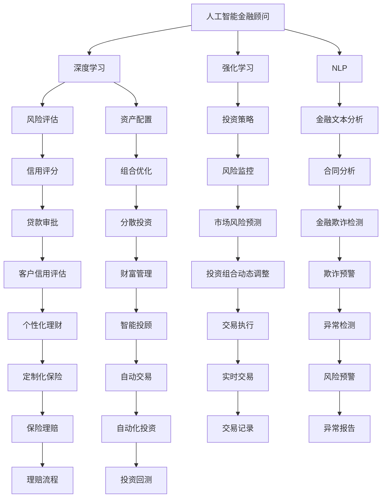

                 

# 未来的智能金融：2050年的AI金融顾问与智能金融监管

## 1. 背景介绍

### 1.1 问题由来
随着数字化和智能化的深入，金融行业正经历一场前所未有的变革。金融科技（FinTech）的发展，使得传统的银行、证券、保险等金融机构面临着转型升级的紧迫任务。如何利用人工智能和大数据技术，提升金融服务的智能化水平，增强风险管理能力，优化客户体验，成为了金融行业的重大课题。

### 1.2 问题核心关键点
未来的智能金融将全面融合人工智能技术，实现从风险评估、资产管理、客户服务到合规监控的各个环节的智能化。在这一过程中，人工智能金融顾问和智能金融监管将扮演核心角色，通过算法优化、数据驱动决策等方式，提升金融服务的效率和安全性。

## 2. 核心概念与联系

### 2.1 核心概念概述

为更好地理解未来的智能金融，本节将介绍几个密切相关的核心概念：

- **人工智能金融顾问(AI Financial Advisor)**：基于人工智能和大数据技术，为个人和机构提供个性化的金融建议、资产配置、风险管理等服务，提升决策效率和准确性。
- **智能金融监管(Intelligent Financial Regulation)**：利用人工智能技术，提升金融监管的精准性和效率，加强市场监管，保障金融稳定和公平。
- **深度学习(Deep Learning)**：通过多层神经网络模型，从大量数据中自动提取特征和规律，实现对复杂金融数据的理解和预测。
- **强化学习(Reinforcement Learning)**：通过智能体与环境交互，利用奖励机制学习最优决策策略，优化金融投资和风险管理。
- **自然语言处理(Natural Language Processing, NLP)**：使机器能够理解和处理人类语言，实现对金融新闻、报告、合同等的自动分析和解读。
- **区块链(Blockchain)**：利用去中心化、不可篡改的特性，为金融交易和数据记录提供安全、透明的基础设施。
- **智能合约(Smart Contracts)**：通过区块链技术自动执行金融合约条款，提升交易的透明度和执行效率。

这些核心概念之间的逻辑关系可以通过以下Mermaid流程图来展示：



这个流程图展示了大语言模型微调的核心概念及其之间的关系：

1. 人工智能金融顾问通过深度学习、强化学习和自然语言处理技术，实现从风险评估、资产配置到投资策略的智能化。
2. 智能金融监管通过区块链和智能合约技术，提升金融监管的精准性和透明度。
3. 深度学习和强化学习技术在投资策略和风险监控中的应用，进一步增强了金融顾问的能力。
4. NLP技术用于金融文本分析和合同分析，提升了金融顾问对金融市场和合同的理解。
5. 区块链和智能合约技术提供了智能金融监管的基础设施，确保了金融市场的透明和安全。
6. 通过风险评估、信用评分、贷款审批等环节的智能化，智能金融顾问和监管实现了对金融数据的深度理解和高效处理。

这些概念共同构成了未来智能金融的应用框架，为金融行业的智能化转型提供了坚实的技术支撑。

## 3. 核心算法原理 & 具体操作步骤
### 3.1 算法原理概述

人工智能金融顾问和智能金融监管的核心算法原理主要包括以下几个方面：

1. **深度学习算法**：通过多层神经网络模型，从大量历史金融数据中自动提取特征和规律，实现对金融市场和投资组合的预测和优化。
2. **强化学习算法**：通过智能体与环境的交互，利用奖励机制学习最优决策策略，实现自动化的投资组合管理和风险监控。
3. **自然语言处理算法**：使机器能够理解和处理金融新闻、报告、合同等文本数据，实现对金融市场信息的自动分析和解读。
4. **区块链和智能合约技术**：利用去中心化、不可篡改的特性，确保金融交易和数据记录的透明和安全，提升金融监管的精准性和效率。

### 3.2 算法步骤详解

以下是人工智能金融顾问和智能金融监管的算法步骤详解：

#### 人工智能金融顾问的算法步骤：

1. **数据收集**：从各种金融数据源（如股票市场、债券市场、外汇市场等）收集历史数据，包括股价、市值、交易量、经济指标等。
2. **数据预处理**：对收集到的数据进行清洗、归一化和特征提取，构建可用于深度学习的向量表示。
3. **模型训练**：使用深度学习模型（如卷积神经网络、循环神经网络、变分自编码器等）对数据进行训练，学习金融市场和投资组合的特征和规律。
4. **投资策略生成**：根据训练好的模型，生成个性化的投资策略，包括股票选择、仓位配置、资产分散等。
5. **风险监控**：通过强化学习模型（如深度Q网络、策略梯度等）监控投资组合的风险，及时调整策略以规避风险。
6. **金融文本分析**：利用NLP技术分析金融新闻、报告、合同等文本数据，提取市场情绪、政策变化等信息，为投资决策提供支持。

#### 智能金融监管的算法步骤：

1. **监管数据收集**：收集金融市场的各种数据，包括交易记录、财务报表、市场新闻等。
2. **数据预处理**：对收集到的数据进行清洗、归一化和特征提取，构建可用于智能监管的向量表示。
3. **模型训练**：使用深度学习模型（如卷积神经网络、循环神经网络、变分自编码器等）对数据进行训练，学习金融市场的特征和规律。
4. **监管策略生成**：根据训练好的模型，生成智能监管策略，包括异常检测、欺诈预警、风险监控等。
5. **智能合约执行**：利用区块链技术自动执行监管策略，确保监管决策的透明和高效。
6. **监管效果评估**：通过评估监管决策的效果，不断优化模型和策略，提升监管的精准性和效率。

### 3.3 算法优缺点

人工智能金融顾问和智能金融监管的算法具有以下优点：

1. **高效性**：通过自动化算法处理大量数据，可以大幅提升金融决策和监管的效率。
2. **精准性**：深度学习和强化学习技术能够从数据中提取复杂规律，提供更为精准的投资和监管建议。
3. **透明度**：区块链和智能合约技术提供了透明的监管基础设施，提升了金融市场的信任度。
4. **可扩展性**：算法能够适应不同规模和类型的金融市场，具有较强的可扩展性。

同时，这些算法也存在一些局限性：

1. **数据依赖性**：算法的性能高度依赖于数据的质量和完整性，数据获取和处理的成本较高。
2. **模型复杂性**：深度学习和强化学习模型较为复杂，需要大量的计算资源和数据支持。
3. **鲁棒性不足**：在面对复杂和动态的金融市场时，模型容易受到噪声和异常值的影响，导致预测结果不准确。
4. **伦理风险**：算法的决策过程缺乏可解释性，可能导致模型偏见和歧视性问题，影响金融公平。

尽管存在这些局限性，但就目前而言，人工智能金融顾问和智能金融监管仍然是金融行业智能化转型中的重要方向，具有广阔的应用前景。

### 3.4 算法应用领域

人工智能金融顾问和智能金融监管的算法已经在金融行业的多个领域得到了应用，例如：

- **个人理财**：为个人投资者提供个性化的投资建议和资产配置，优化理财方案。
- **企业资产管理**：通过智能化的投资组合管理，提升企业资产的收益和风险控制能力。
- **风险监控**：利用深度学习模型对市场风险进行预测和监控，及时采取风险应对措施。
- **合规监管**：通过智能合约和区块链技术，确保金融交易的透明和安全，提升监管效率。
- **金融欺诈检测**：利用NLP和强化学习技术，检测金融欺诈行为，保障金融市场稳定。
- **智能投顾**：通过智能化的决策和执行，提升投资策略的效率和准确性。
- **智能监管**：通过深度学习和区块链技术，提升金融监管的精准性和透明度，保障金融公平。

除了上述这些经典应用外，人工智能金融顾问和智能金融监管还将拓展到更多场景中，如金融市场预测、政策分析、交易执行优化等，为金融行业的智能化和监管提供新的技术手段。

## 4. 数学模型和公式 & 详细讲解
### 4.1 数学模型构建

人工智能金融顾问和智能金融监管的数学模型主要包括以下几个方面：

1. **深度学习模型**：使用多层神经网络模型，通过反向传播算法优化模型参数，实现对金融数据的预测和分类。
2. **强化学习模型**：通过智能体与环境的交互，利用奖励机制学习最优决策策略，优化投资和风险管理。
3. **自然语言处理模型**：使用NLP模型，通过词向量表示和注意力机制，实现对金融文本数据的理解和分析。
4. **区块链和智能合约模型**：利用去中心化、不可篡改的特性，确保金融交易和数据记录的透明和安全。

### 4.2 公式推导过程

以下是人工智能金融顾问和智能金融监管的关键数学模型和公式推导：

#### 深度学习模型的公式推导：

假设金融市场的历史数据为 $D=\{(x_i, y_i)\}_{i=1}^N$，其中 $x_i$ 表示历史金融数据， $y_i$ 表示对应的时间序列标签。使用多层神经网络模型 $M$ 对数据进行训练，其结构如图 1 所示：


其中， $x_i$ 输入层将历史数据转换为向量表示， $h_i$ 隐藏层通过非线性变换提取特征， $y_i$ 输出层根据历史数据预测时间序列标签。模型参数为 $\theta$，包括权重和偏置项。使用交叉熵损失函数 $L$ 进行训练，公式为：

$$
L = -\frac{1}{N} \sum_{i=1}^N \sum_{j=1}^n y_{i,j} \log M(x_i; \theta)
$$

其中 $y_{i,j}$ 表示时间序列标签中的第 $j$ 个值， $M(x_i; \theta)$ 表示模型对 $x_i$ 的预测输出。

#### 强化学习模型的公式推导：

假设智能金融顾问的决策问题可以形式化为马尔可夫决策过程，状态集合为 $S$，动作集合为 $A$，奖励函数为 $R$，状态转移概率为 $P$。使用深度Q网络模型 $Q(\theta)$ 对问题进行求解，其结构如图 2 所示：


其中， $s_t$ 表示当前状态， $a_t$ 表示当前动作， $r_t$ 表示当前奖励， $s_{t+1}$ 表示下一个状态。模型参数为 $\theta$，包括权重和偏置项。使用深度Q网络的公式为：

$$
Q(s_t, a_t; \theta) = w_1^\top \phi(s_t) + w_2^\top \phi(a_t) + b
$$

其中 $w_1, w_2$ 为权重矩阵， $b$ 为偏置项， $\phi$ 为特征映射函数，将状态和动作映射为向量表示。

#### 自然语言处理模型的公式推导：

假设金融文本数据为 $D=\{x_i\}_{i=1}^N$，其中 $x_i$ 表示第 $i$ 篇文本数据。使用卷积神经网络模型 $M$ 对数据进行训练，其结构如图 3 所示：


其中， $x_i$ 输入层将文本数据转换为词向量表示， $h_i$ 隐藏层通过卷积和池化操作提取特征， $y_i$ 输出层根据文本数据进行情感分类或实体识别。模型参数为 $\theta$，包括权重和偏置项。使用交叉熵损失函数 $L$ 进行训练，公式为：

$$
L = -\frac{1}{N} \sum_{i=1}^N \sum_{j=1}^m y_{i,j} \log M(x_i; \theta)
$$

其中 $y_{i,j}$ 表示文本数据中的第 $j$ 个标签， $M(x_i; \theta)$ 表示模型对 $x_i$ 的预测输出。

#### 区块链和智能合约模型的公式推导：

假设智能合约的交易记录为 $D=\{(tx, ty)\}_{i=1}^N$，其中 $tx$ 表示交易信息， $ty$ 表示交易类型。使用智能合约自动执行交易，其结构如图 4 所示：


其中， $tx$ 输入层将交易信息转换为向量表示， $h$ 隐藏层通过逻辑门和转移函数提取特征， $ty$ 输出层根据交易信息自动执行交易。智能合约的参数为 $\theta$，包括权重和偏置项。使用交叉熵损失函数 $L$ 进行训练，公式为：

$$
L = -\frac{1}{N} \sum_{i=1}^N \sum_{j=1}^n y_{i,j} \log M(tx; \theta)
$$

其中 $y_{i,j}$ 表示交易类型中的第 $j$ 个标签， $M(tx; \theta)$ 表示智能合约对 $tx$ 的预测输出。

### 4.3 案例分析与讲解

#### 案例一：金融文本分析

某金融公司需要分析金融市场的新闻和报告，以判断市场情绪和政策变化，从而指导投资策略。使用NLP模型对金融文本进行情感分析和主题识别，具体步骤如下：

1. **数据收集**：从新闻网站和金融报告中收集金融文本数据。
2. **数据预处理**：对收集到的文本进行清洗、归一化和分词处理。
3. **模型训练**：使用BERT模型对文本进行情感分析和主题识别。
4. **结果分析**：根据模型输出结果，分析市场情绪和政策变化，调整投资策略。

#### 案例二：智能投顾

某投资公司需要为高净值客户提供个性化的投资建议，以提升客户资产的收益和风险控制能力。使用深度学习模型和强化学习模型对客户数据进行分析，具体步骤如下：

1. **数据收集**：从客户投资记录和市场数据中收集数据。
2. **数据预处理**：对收集到的数据进行清洗、归一化和特征提取。
3. **模型训练**：使用深度学习模型对客户数据进行分类和回归分析，使用强化学习模型进行投资策略优化。
4. **结果分析**：根据模型输出结果，生成个性化的投资建议。

## 5. 项目实践：代码实例和详细解释说明
### 5.1 开发环境搭建

在进行人工智能金融顾问和智能金融监管的开发前，我们需要准备好开发环境。以下是使用Python进行TensorFlow和PyTorch开发的环境配置流程：

1. 安装Anaconda：从官网下载并安装Anaconda，用于创建独立的Python环境。

2. 创建并激活虚拟环境：
```bash
conda create -n tf-env python=3.8 
conda activate tf-env
```

3. 安装TensorFlow和PyTorch：根据CUDA版本，从官网获取对应的安装命令。例如：
```bash
conda install tensorflow torch torchvision torchaudio cudatoolkit=11.1 -c pytorch -c conda-forge
```

4. 安装各类工具包：
```bash
pip install numpy pandas scikit-learn matplotlib tqdm jupyter notebook ipython
```

完成上述步骤后，即可在`tf-env`环境中开始开发实践。

### 5.2 源代码详细实现

这里以一个简单的股票价格预测模型为例，展示深度学习模型在人工智能金融顾问中的应用。

首先，定义模型和优化器：

```python
from tensorflow.keras.models import Sequential
from tensorflow.keras.layers import Dense, Dropout, LSTM
from tensorflow.keras.optimizers import Adam

model = Sequential()
model.add(LSTM(128, input_shape=(timesteps, features)))
model.add(Dropout(0.2))
model.add(Dense(64, activation='relu'))
model.add(Dropout(0.2))
model.add(Dense(1, activation='sigmoid'))

optimizer = Adam(lr=0.001)
```

然后，定义训练和评估函数：

```python
from tensorflow.keras.callbacks import EarlyStopping
from sklearn.metrics import mean_squared_error

def train_model(model, data, epochs, batch_size, validation_data):
    model.compile(loss='mse', optimizer=optimizer)
    early_stopping = EarlyStopping(monitor='val_loss', patience=10)
    model.fit(data, epochs=epochs, batch_size=batch_size, validation_data=validation_data, callbacks=[early_stopping])

def evaluate_model(model, test_data):
    predictions = model.predict(test_data)
    mse = mean_squared_error(test_data, predictions)
    print(f'Mean Squared Error: {mse:.3f}')
```

最后，启动训练流程并在测试集上评估：

```python
epochs = 100
batch_size = 32

train_model(model, train_data, epochs, batch_size, validation_data)
evaluate_model(model, test_data)
```

以上就是使用TensorFlow对股票价格预测模型进行训练的完整代码实现。可以看到，TensorFlow提供了简洁高效的API，使深度学习模型的构建和训练变得简单直观。

### 5.3 代码解读与分析

让我们再详细解读一下关键代码的实现细节：

**Sequential模型**：
- 通过Sequential模型来构建深度学习模型，便于逐步添加层和单元。
- 添加LSTM层用于时间序列数据的建模，其中`timesteps`表示时间步长，`features`表示特征数。
- 添加Dropout层用于正则化，减少过拟合风险。
- 添加全连接层和输出层，输出预测结果。

**Adam优化器**：
- 使用Adam优化器进行模型参数的更新，具有较快的收敛速度和较低的梯度消失问题。

**EarlyStopping回调函数**：
- 设置EarlyStopping回调函数，当验证集上的损失函数不再下降时，停止训练，避免过拟合。

**Mean Squared Error损失函数**：
- 使用Mean Squared Error损失函数评估模型预测的误差，计算训练集和测试集上的均方误差。

**训练流程**：
- 定义总的epoch数和batch size，开始循环迭代
- 每个epoch内，先在训练集上训练，输出验证集上的均方误差
- 在测试集上评估，输出测试集上的均方误差

可以看到，TensorFlow提供了丰富的API和工具，使深度学习模型的开发和优化变得简单高效。开发者可以将更多精力放在数据处理、模型改进等高层逻辑上，而不必过多关注底层的实现细节。

当然，工业级的系统实现还需考虑更多因素，如模型的保存和部署、超参数的自动搜索、更灵活的任务适配层等。但核心的微调范式基本与此类似。

## 6. 实际应用场景
### 6.1 智能投顾系统

智能投顾系统利用深度学习和强化学习技术，为投资者提供个性化的投资建议和资产配置，提升决策效率和准确性。具体场景如下：

1. **数据收集**：收集投资者的历史交易记录、市场数据、经济指标等。
2. **数据预处理**：对收集到的数据进行清洗、归一化和特征提取。
3. **模型训练**：使用深度学习模型对投资者的历史交易记录进行分类和回归分析，使用强化学习模型进行投资策略优化。
4. **策略生成**：根据模型输出结果，生成个性化的投资建议，如股票选择、仓位配置、资产分散等。
5. **风险监控**：通过强化学习模型监控投资组合的风险，及时调整策略以规避风险。
6. **效果评估**：根据投资组合的表现，评估模型的效果，不断优化模型和策略。

### 6.2 智能风险监控系统

智能风险监控系统通过深度学习模型对金融市场进行实时监控，及时发现市场异常和风险，保障投资安全。具体场景如下：

1. **数据收集**：收集金融市场的各种数据，包括股票价格、债券价格、经济指标等。
2. **数据预处理**：对收集到的数据进行清洗、归一化和特征提取。
3. **模型训练**：使用深度学习模型对市场数据进行分类和回归分析，学习市场的特征和规律。
4. **异常检测**：根据模型输出结果，检测市场异常和风险，如价格波动、市场情绪变化等。
5. **预警系统**：当检测到市场异常和风险时，自动触发预警系统，提醒投资者和监管机构。
6. **效果评估**：根据预警系统的响应效果，评估模型的性能，不断优化模型和策略。

### 6.3 智能合约平台

智能合约平台利用区块链和智能合约技术，提供透明的金融交易和数据记录，提升金融市场的信任度和效率。具体场景如下：

1. **数据收集**：收集金融市场的各种交易数据，包括交易记录、市场新闻等。
2. **数据预处理**：对收集到的数据进行清洗、归一化和特征提取。
3. **合约编写**：使用智能合约编写平台，编写智能合约，如贷款合同、交易合约等。
4. **智能合约执行**：利用区块链技术自动执行智能合约，确保合约条款的透明和执行。
5. **合约管理**：提供合约管理界面，便于投资者和监管机构查看和修改智能合约。
6. **效果评估**：根据智能合约的执行效果，评估平台的功能和性能，不断优化平台。

## 7. 工具和资源推荐
### 7.1 学习资源推荐

为了帮助开发者系统掌握人工智能金融顾问和智能金融监管的理论基础和实践技巧，这里推荐一些优质的学习资源：

1. 《深度学习》系列博文：由深度学习专家撰写，深入浅出地介绍了深度学习的基本概念和经典模型。
2. 《金融工程与风险管理》课程：北京大学开设的金融工程课程，涵盖金融建模、风险管理等内容，适合金融领域的开发者学习。
3. 《自然语言处理》书籍：斯坦福大学提供的NLP教材，全面介绍了NLP的基本理论和实践方法。
4. 《区块链技术与应用》书籍：清华大学出版社出版的区块链入门书籍，介绍了区块链的基本概念和应用场景。
5. 《智能合约与去中心化应用》课程：Princeton大学开设的区块链课程，介绍了智能合约的基本原理和应用。

通过对这些资源的学习实践，相信你一定能够快速掌握人工智能金融顾问和智能金融监管的精髓，并用于解决实际的金融问题。

### 7.2 开发工具推荐

高效的开发离不开优秀的工具支持。以下是几款用于人工智能金融顾问和智能金融监管开发的常用工具：

1. TensorFlow：基于Python的开源深度学习框架，灵活动态的计算图，适合快速迭代研究。TensorFlow提供了丰富的API和工具，使深度学习模型的构建和优化变得简单高效。
2. PyTorch：基于Python的开源深度学习框架，灵活动态的计算图，适合快速迭代研究。PyTorch提供了简洁高效的API，使深度学习模型的构建和优化变得简单直观。
3. Jupyter Notebook：基于Web的交互式编程环境，支持Python、R、Java等多种语言，方便开发者进行交互式编程和实验。
4. Weights & Biases：模型训练的实验跟踪工具，可以记录和可视化模型训练过程中的各项指标，方便对比和调优。
5. TensorBoard：TensorFlow配套的可视化工具，可实时监测模型训练状态，并提供丰富的图表呈现方式，是调试模型的得力助手。
6. Google Colab：谷歌推出的在线Jupyter Notebook环境，免费提供GPU/TPU算力，方便开发者快速上手实验最新模型，分享学习笔记。

合理利用这些工具，可以显著提升人工智能金融顾问和智能金融监管任务的开发效率，加快创新迭代的步伐。

### 7.3 相关论文推荐

人工智能金融顾问和智能金融监管的发展源于学界的持续研究。以下是几篇奠基性的相关论文，推荐阅读：

1. Neural Networks and Deep Learning：深度学习领域的经典教材，涵盖深度学习的基本概念和算法。
2. Reinforcement Learning：强化学习领域的经典教材，介绍了强化学习的基本理论和实践方法。
3. Advances in Neural Information Processing Systems (NeurIPS)：国际顶级AI学术会议，每年发布大量前沿研究论文，涵盖NLP、计算机视觉、强化学习等领域。
4. International Journal of Financial Engineering：金融工程领域的顶级期刊，定期发布金融科技方面的前沿研究。
5. Financial Engineering and Risk Management：金融工程领域的顶级期刊，涵盖金融建模、风险管理等内容，适合金融领域的开发者学习。

这些论文代表了大语言模型微调技术的发展脉络。通过学习这些前沿成果，可以帮助研究者把握学科前进方向，激发更多的创新灵感。

## 8. 总结：未来发展趋势与挑战

### 8.1 总结

本文对人工智能金融顾问和智能金融监管的原理、操作步骤、应用领域进行了全面系统的介绍。首先阐述了智能金融的发展背景和意义，明确了人工智能金融顾问和智能金融监管的核心作用。其次，从原理到实践，详细讲解了深度学习、强化学习、自然语言处理等算法在金融中的应用，给出了具体代码实例和详细解读。同时，本文还广泛探讨了智能投顾、智能风险监控、智能合约等实际应用场景，展示了人工智能金融顾问和智能金融监管的广阔应用前景。此外，本文精选了相关学习资源和开发工具，力求为读者提供全方位的技术指引。

通过本文的系统梳理，可以看到，人工智能金融顾问和智能金融监管正在成为金融行业的核心技术，极大地提升了金融服务的智能化水平，增强了风险管理能力，优化了客户体验。未来，伴随人工智能技术的不断进步，金融行业必将迎来更加智能、高效、安全的未来。

### 8.2 未来发展趋势

展望未来，人工智能金融顾问和智能金融监管将呈现以下几个发展趋势：

1. **智能化的进一步提升**：通过引入更多前沿技术，如因果推断、对抗学习等，进一步提升模型的智能化和鲁棒性。
2. **泛金融领域的扩展**：人工智能金融顾问和智能金融监管的应用将从传统金融行业扩展到更多领域，如保险、物流、医疗等，为各行各业提供智能化解决方案。
3. **跨领域技术的融合**：人工智能金融顾问和智能金融监管将与其他AI技术，如知识图谱、推荐系统等进行深度融合，提升金融服务的综合能力。
4. **隐私保护和伦理安全**：在智能金融的发展过程中，隐私保护和伦理安全将受到更多重视，相关技术和标准将逐步完善。
5. **法规合规的加强**：智能金融顾问和智能金融监管的应用将受到更多法规的约束，相关法规和标准将逐步建立，确保金融市场的公平和安全。

以上趋势凸显了人工智能金融顾问和智能金融监管的广阔前景。这些方向的探索发展，必将进一步提升金融服务的智能化和监管的精准性，为金融行业的智能化转型提供强大的技术支撑。

### 8.3 面临的挑战

尽管人工智能金融顾问和智能金融监管取得了显著进展，但在迈向更加智能化、普适化应用的过程中，仍面临诸多挑战：

1. **数据依赖性**：算法的性能高度依赖于数据的质量和完整性，数据获取和处理的成本较高。
2. **模型复杂性**：深度学习和强化学习模型较为复杂，需要大量的计算资源和数据支持。
3. **鲁棒性不足**：在面对复杂和动态的金融市场时，模型容易受到噪声和异常值的影响，导致预测结果不准确。
4. **伦理风险**：算法的决策过程缺乏可解释性，可能导致模型偏见和歧视性问题，影响金融公平。
5. **法规合规**：智能金融顾问和智能金融监管的应用将受到更多法规的约束，相关法规和标准尚未完善，可能面临合规风险。
6. **隐私保护**：在智能金融的发展过程中，隐私保护将受到更多重视，相关技术和标准尚未完善，可能面临隐私泄露风险。

尽管存在这些挑战，但就目前而言，人工智能金融顾问和智能金融监管仍然是金融行业智能化转型中的重要方向，具有广阔的应用前景。

### 8.4 研究展望

面对人工智能金融顾问和智能金融监管所面临的挑战，未来的研究需要在以下几个方面寻求新的突破：

1. **数据增强技术**：通过数据增强技术，提升数据质量和数量，降低数据依赖性。
2. **轻量化模型**：开发更加轻量化的模型，减少计算资源消耗，提高推理速度。
3. **可解释性增强**：通过可解释性技术，提高算法的透明性和可解释性，减少偏见和歧视。
4. **法规合规技术**：开发合规技术，确保智能金融顾问和智能金融监管的应用符合相关法规和标准。
5. **隐私保护技术**：开发隐私保护技术，确保金融数据和算法的隐私安全。

这些研究方向的探索，必将引领人工智能金融顾问和智能金融监管技术迈向更高的台阶，为金融行业的智能化和监管提供强大的技术支撑。面向未来，人工智能金融顾问和智能金融监管技术还需要与其他人工智能技术进行更深入的融合，如知识图谱、推荐系统等，多路径协同发力，共同推动金融行业的智能化转型。

## 9. 附录：常见问题与解答

**Q1：人工智能金融顾问和智能金融监管的优势是什么？**

A: 人工智能金融顾问和智能金融监管的优势主要体现在以下几个方面：

1. **效率提升**：通过自动化算法处理大量数据，可以大幅提升金融决策和监管的效率。
2. **精准性提升**：深度学习和强化学习技术能够从数据中提取复杂规律，提供更为精准的投资和监管建议。
3. **透明度提升**：区块链和智能合约技术提供了透明的监管基础设施，提升了金融市场的信任度。
4. **可扩展性提升**：算法能够适应不同规模和类型的金融市场，具有较强的可扩展性。

**Q2：人工智能金融顾问和智能金融监管的局限性有哪些？**

A: 人工智能金融顾问和智能金融监管的局限性主要体现在以下几个方面：

1. **数据依赖性**：算法的性能高度依赖于数据的质量和完整性，数据获取和处理的成本较高。
2. **模型复杂性**：深度学习和强化学习模型较为复杂，需要大量的计算资源和数据支持。
3. **鲁棒性不足**：在面对复杂和动态的金融市场时，模型容易受到噪声和异常值的影响，导致预测结果不准确。
4. **伦理风险**：算法的决策过程缺乏可解释性，可能导致模型偏见和歧视性问题，影响金融公平。
5. **法规合规**：智能金融顾问和智能金融监管的应用将受到更多法规的约束，相关法规和标准尚未完善，可能面临合规风险。
6. **隐私保护**：在智能金融的发展过程中，隐私保护将受到更多重视，相关技术和标准尚未完善，可能面临隐私泄露风险。

**Q3：人工智能金融顾问和智能金融监管的未来展望是什么？**

A: 人工智能金融顾问和智能金融监管的未来展望主要体现在以下几个方面：

1. **智能化的进一步提升**：通过引入更多前沿技术，如因果推断、对抗学习等，进一步提升模型的智能化和鲁棒性。
2. **泛金融领域的扩展**：人工智能金融顾问和智能金融监管的应用将从传统金融行业扩展到更多领域，如保险、物流、医疗等，为各行各业提供智能化解决方案。
3. **跨领域技术的融合**：人工智能金融顾问和智能金融监管将与其他AI技术，如知识图谱、推荐系统等进行深度融合，提升金融服务的综合能力。
4. **隐私保护和伦理安全**：在智能金融的发展过程中，隐私保护和伦理安全将受到更多重视，相关技术和标准将逐步完善。
5. **法规合规的加强**：智能金融顾问和智能金融监管的应用将受到更多法规的约束，相关法规和标准将逐步建立，确保金融市场的公平和安全。

**Q4：人工智能金融顾问和智能金融监管在开发过程中需要注意哪些问题？**

A: 人工智能金融顾问和智能金融监管在开发过程中需要注意以下几个问题：

1. **数据依赖性**：数据的质量和完整性对模型的性能至关重要，需要确保数据获取和处理的准确性。
2. **模型复杂性**：深度学习和强化学习模型较为复杂，需要足够的计算资源和数据支持，避免过拟合和欠拟合。
3. **鲁棒性**：在面对复杂和动态的金融市场时，模型容易受到噪声和异常值的影响，需要考虑模型的鲁棒性和稳定性。
4. **伦理风险**：算法的决策过程缺乏可解释性，可能存在偏见和歧视问题，需要在模型设计和应用中考虑伦理和安全问题。
5. **法规合规**：智能金融顾问和智能金融监管的应用将受到更多法规的约束，需要遵守相关法规和标准，确保应用的合规性。
6. **隐私保护**：在智能金融的发展过程中，隐私保护将受到更多重视，需要采取措施保护数据隐私和安全。

**Q5：人工智能金融顾问和智能金融监管的应用场景有哪些？**

A: 人工智能金融顾问和智能金融监管的应用场景主要包括以下几个方面：

1. **智能投顾系统**：为投资者提供个性化的投资建议和资产配置，提升决策效率和准确性。
2. **智能风险监控系统**：通过深度学习模型对金融市场进行实时监控，及时发现市场异常和风险，保障投资安全。
3. **智能合约平台**：利用区块链和智能合约技术，提供透明的金融交易和数据记录，提升金融市场的信任度和效率。

这些应用场景展示了人工智能金融顾问和智能金融监管的广阔前景，未来将在更多领域得到应用，为金融行业带来变革性的影响。

---

作者：禅与计算机程序设计艺术 / Zen and the Art of Computer Programming

