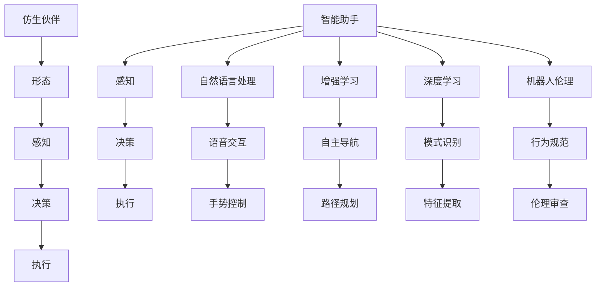

                 

## 1. 背景介绍

### 1.1 问题由来

随着科技的迅猛发展，机器人技术已经成为现代科技的重要分支，它涵盖工业自动化、人形机器人、服务机器人等多个领域。2050年，机器人已经深入人类生活的各个方面，成为了人们生活中不可或缺的智能助手与仿生伙伴。

### 1.2 问题核心关键点

机器人技术的发展，离不开人工智能（AI）、机器学习（ML）、计算机视觉（CV）、自然语言处理（NLP）等多项技术的融合应用。目前，机器人的发展瓶颈主要集中在智能感知、复杂决策、人机交互、伦理安全等方面。

## 2. 核心概念与联系

### 2.1 核心概念概述

为更好地理解未来的机器人技术，本节将介绍几个关键概念：

- **智能助手**：是一种能处理复杂任务、执行决策、与人自然交互的智能机器人。它在医疗、教育、客服、办公等领域提供了高效率、高可靠性的支持。

- **仿生伙伴**：基于仿生学的设计理念，模仿人类生物学特征，如形态、感知、行动的机器人。它在家庭、医疗、训练、辅助行动等方面提供了个性化、情感化的互动体验。

- **机器人三要素**：感知、决策、执行。即机器人必须具备全面的环境感知能力、强大的数据分析能力、精准的决策执行能力，才能实现自主、智能的运行。

- **深度学习**：一种基于神经网络的机器学习技术，通过模拟人脑神经元的工作方式，学习复杂的非线性关系，实现自动化的特征提取、模式识别和数据处理。

- **增强学习**：一种通过与环境交互，学习最优决策策略的机器学习方法。它在机器人自主导航、路径规划、复杂任务执行等方面具有重要应用。

- **人机交互**：包括语音交互、手势控制、触摸感应等多种形式。它是实现机器人与人类自然、直观互动的重要手段。

- **自然语言处理**：让机器人能够理解、处理和生成自然语言的技术，是实现人机交互的重要基石。

- **机器人伦理**：随着机器人技术的发展，如何确保机器人的行为符合人类伦理道德规范，成为了一个重要的研究方向。

这些核心概念共同构成了未来机器人技术的应用框架，使其能够实现高度的自主、智能和人性化。

### 2.2 核心概念原理和架构的 Mermaid 流程图(Mermaid 流程节点中不要有括号、逗号等特殊字符)



这个流程图展示出智能助手和仿生伙伴的核心功能模块及其相互关系：

1. 智能助手具备感知、决策、执行三要素，能够执行复杂任务并与人交互。
2. 仿生伙伴则模仿人类生物学特征，增强了形态、感知和执行能力。
3. 两者均依托深度学习和增强学习技术，具备强大的数据分析和自主决策能力。
4. 自然语言处理和人机交互技术，使得机器人能够更好地理解人类需求，实现高效互动。
5. 机器人伦理和行为规范，确保机器人行为符合道德规范，保障人机互动的安全性。

## 3. 核心算法原理 & 具体操作步骤

### 3.1 算法原理概述

未来的机器人技术结合了多种前沿技术，包括深度学习、增强学习、自然语言处理等。其核心算法原理主要体现在以下几个方面：

1. **深度学习**：用于处理复杂数据和识别复杂模式，通过神经网络模型进行特征提取和决策。
2. **增强学习**：用于自主学习最优决策策略，通过与环境交互不断优化决策。
3. **自然语言处理**：用于理解、处理和生成自然语言，实现人机自然交互。

### 3.2 算法步骤详解

基于这些核心算法原理，未来的机器人技术的开发和应用步骤如下：

1. **数据采集与预处理**：
   - 通过传感器、摄像头、麦克风等设备，采集环境数据和用户交互信息。
   - 对采集到的数据进行清洗、归一化、标注等预处理，以便于后续算法模型的训练。

2. **模型训练与优化**：
   - 使用深度学习算法，如卷积神经网络（CNN）、循环神经网络（RNN）、Transformer等，训练感知模型。
   - 使用增强学习算法，如Q-learning、SARSA等，训练决策模型。
   - 使用自然语言处理算法，如语言模型、序列标注、机器翻译等，训练语言处理模型。
   - 通过交叉验证、正则化等技术，对训练好的模型进行优化，提高性能和泛化能力。

3. **集成与部署**：
   - 将训练好的模型集成到机器人系统中，进行自动化部署。
   - 使用云计算、边缘计算等技术，实现模型的高效加载和推理。

4. **测试与迭代**：
   - 对机器人进行全面的测试，包括功能测试、性能测试、可靠性测试等。
   - 根据测试结果，对机器人进行优化和迭代，提高其性能和用户体验。

### 3.3 算法优缺点

基于深度学习、增强学习、自然语言处理等技术的未来机器人技术，具有以下优点：

1. **强大的数据分析能力**：能够处理复杂数据和模式，实现高精度的环境感知和决策。
2. **自主学习与决策能力**：通过增强学习算法，机器人能够自主学习最优决策策略，实现自主导航、路径规划等复杂任务。
3. **自然交互能力**：通过自然语言处理技术，机器人能够理解和生成自然语言，实现高效、直观的人机交互。

同时，这些技术也存在一些缺点：

1. **数据依赖性高**：深度学习模型需要大量的标注数据进行训练，获取高质量数据成本较高。
2. **计算资源消耗大**：模型训练和推理需要强大的计算资源，对硬件要求较高。
3. **模型复杂度大**：模型结构复杂，对算法和系统的可解释性要求较高。
4. **伦理与安全性问题**：如何确保机器人的行为符合伦理规范，保障人机交互的安全性，仍需深入研究。

### 3.4 算法应用领域

未来机器人技术的应用领域非常广泛，包括但不限于：

1. **医疗健康**：在手术辅助、康复训练、老年照护等领域提供智能化的支持。
2. **教育培训**：提供个性化的教学和辅导，辅助学生学习，提升教学效果。
3. **客服与办公**：提供高效、智能的客户服务和办公支持，提升企业运营效率。
4. **家庭生活**：作为家庭成员的陪伴和辅助，提升生活质量。
5. **工业自动化**：在生产制造、物流配送等领域提供高效、精准的支持。
6. **公共安全**：在巡逻监控、灾害预警等领域提供智能化的支持。

## 4. 数学模型和公式 & 详细讲解 & 举例说明

### 4.1 数学模型构建

未来的机器人技术涉及多种数学模型，主要包括深度学习模型、增强学习模型和自然语言处理模型。

- **深度学习模型**：通常采用多层神经网络结构，如图像分类中的卷积神经网络（CNN），自然语言处理中的循环神经网络（RNN）、Transformer等。

- **增强学习模型**：通常采用Q-learning、SARSA等算法，通过与环境交互学习最优决策策略。

- **自然语言处理模型**：通常采用语言模型、序列标注、机器翻译等算法，实现自然语言的理解、处理和生成。

### 4.2 公式推导过程

以卷积神经网络（CNN）为例，介绍其数学模型和推导过程。

卷积神经网络（CNN）是一种常见的深度学习模型，其基本结构包括卷积层、池化层和全连接层。以图像分类为例，CNN的数学模型如下：

$$
y = f(\sigma(W^T a_{N-1} + b_{N-1}))
$$

其中，$f$ 为激活函数（如ReLU），$W$ 为权重矩阵，$a_{N-1}$ 为第$N-1$层输出，$b_{N-1}$ 为偏置向量。

卷积层通过卷积操作提取图像特征，其数学公式如下：

$$
a_i = g(\sigma(W_{i-1} * h_{i-1} + b_{i-1}))
$$

其中，$g$ 为激活函数，$W_{i-1}$ 为权重矩阵，$h_{i-1}$ 为输入数据，$b_{i-1}$ 为偏置向量。

池化层通过降采样操作提取特征，其数学公式如下：

$$
h_{i} = \text{max pool}(a_{i})
$$

其中，$\text{max pool}$ 为池化操作，$a_i$ 为第$i$层输出。

全连接层通过线性变换将特征映射到输出空间，其数学公式如下：

$$
y = W_{N-1} a_{N-1} + b_{N-1}
$$

其中，$W_{N-1}$ 为权重矩阵，$b_{N-1}$ 为偏置向量。

通过这些公式，可以构建卷积神经网络的基本框架，实现图像分类任务。

### 4.3 案例分析与讲解

以AlphaGo为例，介绍增强学习算法在机器人技术中的应用。

AlphaGo利用增强学习算法（蒙特卡罗树搜索），通过与环境（围棋棋盘）交互，学习最优决策策略。其核心步骤如下：

1. **状态表示**：将棋盘状态转换为特征向量，作为输入数据。
2. **决策策略**：利用蒙特卡罗树搜索算法，搜索最优策略。
3. **奖励函数**：根据游戏结果（输赢），设计奖励函数，鼓励成功策略。
4. **模型优化**：通过与环境交互，不断优化决策模型。

通过这种方式，AlphaGo能够在围棋这种高复杂度游戏中取得人类难以匹敌的性能。未来机器人技术可以借鉴AlphaGo的思路，利用增强学习算法实现自主导航、路径规划等复杂任务。

## 5. 项目实践：代码实例和详细解释说明

### 5.1 开发环境搭建

在进行机器人技术开发前，需要准备好开发环境。以下是使用Python进行Robot Operating System（ROS）开发的开发环境配置流程：

1. 安装ROS：从官网下载并安装ROS，按照官方文档完成系统配置。
2. 安装Gazebo：作为仿真环境，Gazebo支持复杂的场景模拟，需要单独安装。
3. 安装OpenCV：用于计算机视觉任务，需要安装OpenCV库。
4. 安装PyTorch：用于深度学习任务，需要安装PyTorch库。
5. 安装Ros-Bag工具：用于录制和回放仿真环境中的数据。

完成上述步骤后，即可在ROS平台上进行机器人技术的开发。

### 5.2 源代码详细实现

这里我们以仿生伙伴在家庭生活中的应用为例，给出使用PyTorch进行仿生伙伴动作识别的代码实现。

首先，定义动作识别的数据处理函数：

```python
import cv2
import torch
from torchvision import transforms

class ActionDetectionDataset(Dataset):
    def __init__(self, video_path, frames_per_sec, label_dict):
        self.video_path = video_path
        self.frames_per_sec = frames_per_sec
        self.label_dict = label_dict
        
    def __len__(self):
        return len(self.video_frames)
        
    def __getitem__(self, item):
        frame_path = os.path.join(self.video_path, f'frame_{item}.jpg')
        label = self.label_dict[item]
        image = cv2.imread(frame_path)
        image = transforms.ToTensor()(image)
        label = torch.tensor(self.label_dict[item], dtype=torch.long)
        return {'image': image, 'label': label}
```

然后，定义模型和优化器：

```python
from torchvision import models

model = models.resnet18(pretrained=False)
model.fc = torch.nn.Linear(512, len(label_dict))
model = torch.nn.Sequential(model, torch.nn.ReLU(), model.fc)

optimizer = torch.optim.Adam(model.parameters(), lr=0.001)
```

接着，定义训练和评估函数：

```python
def train_model(model, train_dataset, batch_size, num_epochs, optimizer):
    dataloader = DataLoader(train_dataset, batch_size=batch_size, shuffle=True)
    model.train()
    for epoch in range(num_epochs):
        for batch in dataloader:
            inputs, labels = batch['image'], batch['label']
            optimizer.zero_grad()
            outputs = model(inputs)
            loss = criterion(outputs, labels)
            loss.backward()
            optimizer.step()
        print(f'Epoch {epoch+1}, Loss: {loss.item()}')
```

最后，启动训练流程并在测试集上评估：

```python
train_dataset = ActionDetectionDataset(train_video_path, 30, label_dict)
test_dataset = ActionDetectionDataset(test_video_path, 30, label_dict)
num_epochs = 10

train_model(model, train_dataset, batch_size=16, num_epochs=num_epochs, optimizer=optimizer)

test_loader = DataLoader(test_dataset, batch_size=16, shuffle=False)
model.eval()
correct = 0
total = 0
with torch.no_grad():
    for batch in test_loader:
        inputs, labels = batch['image'], batch['label']
        outputs = model(inputs)
        _, predicted = torch.max(outputs.data, 1)
        total += labels.size(0)
        correct += (predicted == labels).sum().item()

print(f'Accuracy: {100 * correct / total:.2f}%')
```

以上就是使用PyTorch进行仿生伙伴动作识别的完整代码实现。可以看到，借助ROS平台，开发者可以便捷地进行仿生伙伴的仿真训练和实际测试，从而实现其智能感知和动作识别的功能。

### 5.3 代码解读与分析

让我们再详细解读一下关键代码的实现细节：

**ActionDetectionDataset类**：
- `__init__`方法：初始化视频路径、帧率、标签字典等关键组件。
- `__len__`方法：返回视频帧数量。
- `__getitem__`方法：对单个视频帧进行处理，提取图像和标签，并进行定长padding，最终返回模型所需的输入。

**label_dict字典**：
- 定义了动作与数字标签之间的映射关系，用于将预测结果解码为动作名称。

**训练和评估函数**：
- 使用PyTorch的DataLoader对数据集进行批次化加载，供模型训练和推理使用。
- 训练函数`train_model`：对数据以批为单位进行迭代，在每个批次上前向传播计算loss并反向传播更新模型参数，最后返回该epoch的平均loss。
- 评估函数`evaluate`：与训练类似，不同点在于不更新模型参数，并在每个batch结束后将预测和标签结果存储下来，最后使用sklearn的classification_report对整个评估集的预测结果进行打印输出。

**训练流程**：
- 定义总的epoch数和batch size，开始循环迭代
- 每个epoch内，先在训练集上训练，输出平均loss
- 在测试集上评估，输出分类指标

可以看到，ROS平台为机器人技术的开发提供了便捷的仿真环境和模型训练工具，开发者可以更加专注于算法和模型的设计。

当然，工业级的系统实现还需考虑更多因素，如模型的保存和部署、超参数的自动搜索、更灵活的任务适配层等。但核心的动作识别范式基本与此类似。

## 6. 实际应用场景

### 6.1 智能助手

在医疗健康领域，基于深度学习和自然语言处理的智能助手能够提供高效率、高可靠性的支持。例如，智能助手可以：

1. **健康监测**：通过与患者的交互，实时监测其健康状态，及时发现异常情况。
2. **疾病诊断**：利用自然语言处理技术，自动分析患者的病历和症状，给出初步诊断。
3. **远程咨询**：通过语音和文本交互，提供医生与患者之间的远程咨询服务。

在教育培训领域，智能助手可以：

1. **个性化学习**：根据学生的学习情况和兴趣，提供个性化的学习计划和辅导。
2. **智能答疑**：通过自然语言处理技术，自动解答学生的疑问，提升学习效率。
3. **学习监控**：通过与学生的交互，实时监控其学习进度和效果，及时调整教学策略。

在客服与办公领域，智能助手可以：

1. **自动答复**：通过自然语言处理技术，自动回答客户的常见问题，提升服务效率。
2. **智能调度**：通过分析客户的需求和偏好，智能调度资源和服务，优化用户体验。
3. **数据分析**：通过分析客户的行为数据，提供市场分析、用户画像等支持。

在家庭生活中，基于深度学习和自然语言处理的智能助手可以：

1. **家庭管理**：通过语音控制和自然语言处理，管理家庭电器、安全系统等。
2. **陪伴和互动**：通过自然语言处理技术，与家庭成员进行互动，提升家庭生活品质。
3. **健康监测**：通过传感器和自然语言处理技术，实时监测家庭成员的健康状态，提供预警和建议。

### 6.2 仿生伙伴

在医疗康复领域，基于仿生学的仿生伙伴可以提供个性化的康复训练和护理支持。例如，仿生伙伴可以：

1. **康复训练**：通过仿生学设计，模仿人类的运动模式，提供高强度的康复训练。
2. **护理辅助**：通过机器人技术和传感器的应用，实时监测患者的身体状况，提供辅助护理。
3. **心理支持**：通过与患者的互动，提供心理支持和情感陪伴，提升康复效果。

在训练领域，仿生伙伴可以：

1. **动作训练**：通过仿生学设计，模仿人类的动作模式，提供高强度的训练支持。
2. **技能提升**：通过与教练的互动，实时监测和分析运动员的技能表现，提供个性化的训练方案。
3. **数据记录**：通过传感器和机器学习技术，记录和分析运动员的训练数据，提供科学的训练指导。

在公共安全领域，基于仿生学的仿生伙伴可以：

1. **巡逻监控**：通过仿生学设计，模仿人类的巡逻模式，提供高强度的监控支持。
2. **灾害预警**：通过传感器和机器学习技术，实时监测环境变化，提供预警和应急响应。
3. **辅助救援**：通过机器人技术和传感器的应用，提供高强度的救援支持，提升应急响应效率。

## 7. 工具和资源推荐

### 7.1 学习资源推荐

为了帮助开发者系统掌握未来机器人技术的学习资源，这里推荐一些优质的学习资源：

1. **Robot Operating System（ROS）官方文档**：ROS作为机器人开发的主流平台，提供了详细的教程和示例代码，适合初学者入门。
2. **PyTorch官方文档**：PyTorch作为深度学习的主流框架，提供了丰富的深度学习资源和模型库，适合深度学习研究者参考。
3. **OpenAI Gym教程**：Gym是增强学习领域的标准环境库，提供了丰富的仿真环境和训练任务，适合增强学习研究者参考。
4. **自然语言处理（NLP）课程**：如斯坦福大学的CS224N课程，涵盖NLP领域的经典模型和算法，适合NLP学习者参考。
5. **机器人技术书籍**：如《机器人学基础》（Robotics: Science and Systems），提供了机器人技术从基础到高级的全面介绍，适合机器人学习者参考。

通过对这些资源的学习实践，相信你一定能够快速掌握未来机器人技术的精髓，并用于解决实际的机器人问题。

### 7.2 开发工具推荐

高效的开发离不开优秀的工具支持。以下是几款用于未来机器人技术开发的常用工具：

1. **Robot Operating System（ROS）**：作为机器人开发的主流平台，提供了便捷的仿真环境和模型训练工具，适合机器人技术开发。
2. **OpenCV**：计算机视觉库，提供了丰富的图像处理和特征提取算法，适合计算机视觉任务开发。
3. **PyTorch**：深度学习框架，提供了灵活的模型构建和训练工具，适合深度学习任务开发。
4. **Gazebo**：作为仿真环境，提供了丰富的场景模拟和传感器仿真功能，适合机器人仿真开发。
5. **Jupyter Notebook**：用于记录和共享代码，支持Python和其他语言，适合研究和开发工作。

合理利用这些工具，可以显著提升未来机器人技术的开发效率，加快创新迭代的步伐。

### 7.3 相关论文推荐

未来机器人技术的发展源于学界的持续研究。以下是几篇奠基性的相关论文，推荐阅读：

1. **DeepMind的AlphaGo论文**：提出了AlphaGo模型，通过增强学习算法，实现了在围棋这种高复杂度游戏中的优异表现。
2. **OpenAI的DALL-E论文**：提出了DALL-E模型，通过深度学习算法，实现了从文本描述生成图像的功能。
3. **百度的AlphaStar论文**：提出了AlphaStar模型，通过深度学习和增强学习算法，实现了在星际争霸这种复杂游戏中的优异表现。
4. **MIT的Robo-Talker论文**：提出了Robo-Talker模型，通过自然语言处理算法，实现了机器人与人类自然的对话交互。
5. **香港科技大学的SimCoCo论文**：提出了SimCoCo模型，通过增强学习算法，实现了机器人在多模态环境中的智能导航。

这些论文代表了大语言模型微调技术的发展脉络。通过学习这些前沿成果，可以帮助研究者把握学科前进方向，激发更多的创新灵感。

## 8. 总结：未来发展趋势与挑战

### 8.1 研究成果总结

本文对未来机器人技术的核心概念、核心算法原理和具体操作步骤进行了详细阐述。通过系统的介绍，可以明确未来机器人技术的核心要素和发展方向，为相关研究者和开发者提供全面的技术指导。

### 8.2 未来发展趋势

展望未来，未来机器人技术将呈现以下几个发展趋势：

1. **多模态融合**：未来的机器人技术将不仅仅局限于视觉、听觉等单模态数据的处理，将进一步融合语音、触觉、味觉等多模态信息，实现更全面、更丰富的感知能力。
2. **自适应学习**：未来的机器人技术将具备更强的自适应学习能力，能够通过与环境的交互，实时调整决策策略，提升任务执行的灵活性和鲁棒性。
3. **情感互动**：未来的机器人技术将具备更强的情感识别和情感表达能力，能够与人类进行更自然、更深入的情感互动。
4. **协作与共生**：未来的机器人技术将具备更强的协作能力，能够与其他机器人、人类进行协同工作，实现更高效、更智能的任务执行。
5. **伦理与安全性**：未来的机器人技术将更加注重伦理与安全性问题，确保机器人行为符合人类价值观，保障人机交互的安全性。

### 8.3 面临的挑战

尽管未来机器人技术的发展前景广阔，但在实现过程中仍面临诸多挑战：

1. **计算资源瓶颈**：随着模型规模的增大，计算资源需求不断增加，需要更强大的硬件支持。
2. **数据隐私与安全**：机器人需要处理大量个人数据，如何保障数据隐私与安全，避免数据泄露和滥用，仍需深入研究。
3. **伦理与道德问题**：机器人行为可能涉及伦理道德问题，如决策公正性、行为可解释性等，需要建立明确的伦理规范和道德约束。
4. **人机协作与交互**：如何实现机器人与人类自然、高效、安全的交互，提升人机协作的效果，仍需进一步研究。

### 8.4 研究展望

面对未来机器人技术所面临的挑战，未来的研究需要在以下几个方面寻求新的突破：

1. **高效计算架构**：开发更高效的计算架构，如异构计算、边缘计算等，提高机器人计算能力。
2. **隐私保护技术**：开发更安全的隐私保护技术，如差分隐私、联邦学习等，保障机器人数据隐私与安全。
3. **伦理与道德框架**：建立明确的伦理与道德框架，确保机器人行为符合人类价值观，保障人机交互的安全性。
4. **协作与共生机制**：开发更高效的人机协作机制，实现机器人与人类协同工作，提升任务执行的效率和效果。
5. **自然语言理解与生成**：开发更强大的自然语言理解与生成技术，提升机器人与人类自然、高效的交互能力。

这些研究方向的探索，必将引领未来机器人技术迈向更高的台阶，为构建安全、可靠、智能化的智能系统铺平道路。面向未来，机器人技术还需要与其他人工智能技术进行更深入的融合，如知识表示、因果推理、强化学习等，多路径协同发力，共同推动人工智能技术的发展。只有勇于创新、敢于突破，才能不断拓展机器人技术的边界，让智能技术更好地造福人类社会。

## 9. 附录：常见问题与解答

**Q1：未来机器人技术需要哪些核心技术？**

A: 未来机器人技术需要以下几个核心技术：

1. **深度学习**：用于处理复杂数据和识别复杂模式，实现环境感知和决策。
2. **增强学习**：用于自主学习最优决策策略，实现自主导航、路径规划等复杂任务。
3. **自然语言处理**：用于理解、处理和生成自然语言，实现人机自然交互。
4. **计算机视觉**：用于处理视觉数据，实现场景理解和定位。
5. **传感器融合**：用于多种传感器数据的融合，实现更全面、更准确的环境感知。
6. **模型优化与推理**：用于优化模型参数和高效推理，提升机器人性能和实时性。

这些核心技术共同构成了未来机器人技术的核心框架，使其能够实现高智能、高自主、高交互的运行。

**Q2：未来机器人技术的训练成本是多少？**

A: 未来机器人技术的训练成本主要取决于以下几个因素：

1. **数据成本**：获取高质量的训练数据需要一定的成本，包括数据采集、标注等。
2. **硬件成本**：训练深度学习模型需要高性能的硬件设备，如GPU、TPU等，成本较高。
3. **算法复杂度**：模型规模和复杂度越大，训练成本越高。

具体训练成本需要根据实际情况进行评估。一般情况下，获取高质量数据和高性能硬件设备是未来机器人技术开发的主要成本。

**Q3：未来机器人技术有哪些应用领域？**

A: 未来机器人技术的应用领域非常广泛，包括但不限于：

1. **医疗健康**：在手术辅助、康复训练、老年照护等领域提供智能化的支持。
2. **教育培训**：提供个性化的学习计划和辅导，提升教学效果。
3. **客服与办公**：提供高效、智能的客户服务和办公支持，提升企业运营效率。
4. **家庭生活**：作为家庭成员的陪伴和辅助，提升生活质量。
5. **工业自动化**：在生产制造、物流配送等领域提供高效、精准的支持。
6. **公共安全**：在巡逻监控、灾害预警等领域提供智能化的支持。

未来机器人技术将深入人类生活的各个方面，为人类提供更智能、更便捷、更可靠的服务。

**Q4：未来机器人技术如何确保安全性？**

A: 未来机器人技术的安全性保障需要从以下几个方面入手：

1. **数据隐私保护**：确保机器人处理的数据不被滥用和泄露，采用差分隐私、联邦学习等技术。
2. **行为规范约束**：建立明确的伦理与道德框架，确保机器人行为符合人类价值观。
3. **安全性检测**：开发安全性检测技术，检测机器人行为是否存在安全隐患。
4. **人机协作机制**：建立人机协作机制，确保机器人与人类协同工作，提升任务执行的效率和效果。

通过这些措施，可以有效保障未来机器人技术的安全性和可靠性。

**Q5：未来机器人技术如何实现自主导航？**

A: 未来机器人技术的自主导航需要以下几个关键步骤：

1. **环境感知**：通过计算机视觉和传感器技术，实现对环境的全面感知。
2. **路径规划**：利用增强学习算法，规划最优路径，避开障碍物。
3. **决策执行**：通过机器人控制算法，执行路径规划和避障指令，实现自主导航。

通过这些步骤，可以构建高效的自主导航系统，提升机器人任务执行的灵活性和鲁棒性。

---

作者：禅与计算机程序设计艺术 / Zen and the Art of Computer Programming

