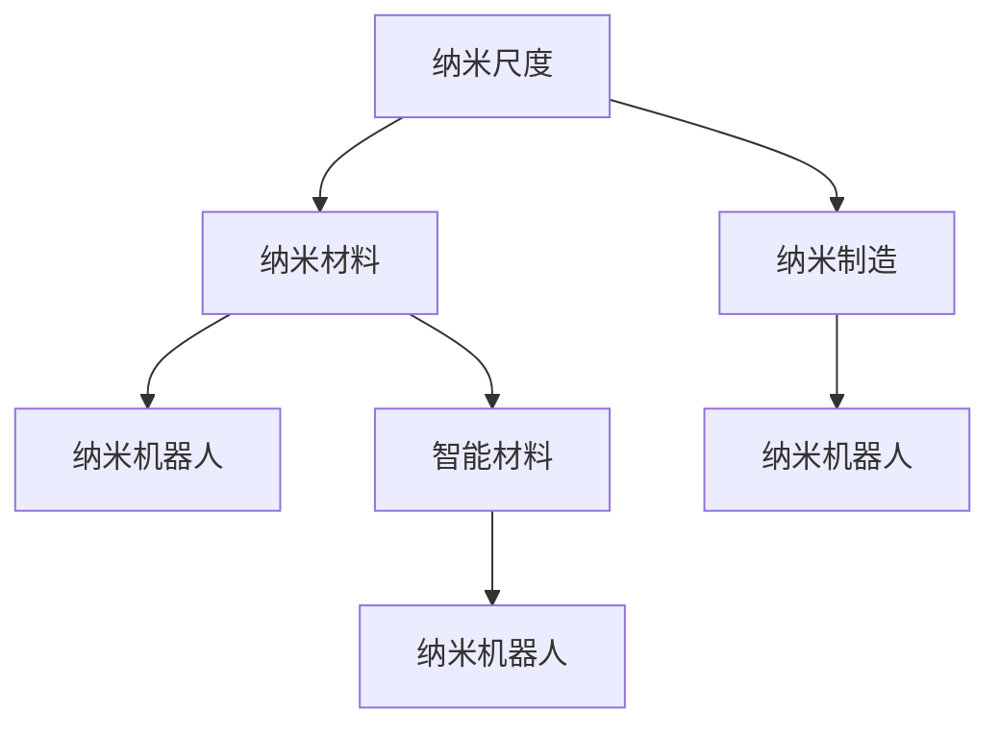

                 

# 未来的纳米技术：2050年的纳米机器人与智能材料

## 1. 背景介绍

### 1.1 问题由来
纳米技术(Nanotechnology)，作为21世纪最具潜力的前沿科技之一，正逐渐从实验室走向现实世界。它的基本原理是在纳米尺度上操控和制造材料与器件，以获得传统技术难以实现的优异性能。这一领域的研究成果已经应用于多个行业，从能源到医疗，从电子到材料，对现代社会产生了深远影响。然而，未来的纳米技术将更加复杂和多样化，其应用前景和挑战也是前所未有的。

### 1.2 问题核心关键点
本文聚焦于2050年纳米机器人与智能材料的未来展望，探讨其发展路径、应用场景和面临的挑战。通过详细分析当前纳米技术的研究现状和未来趋势，我们试图展望一个充满潜力和机遇的未来科技世界。

## 2. 核心概念与联系

### 2.1 核心概念概述
纳米技术涉及多个学科，涵盖纳米材料、纳米制造、纳米生物、纳米医学等领域。其核心概念包括：

- **纳米尺度**：纳米尺度的长度、时间等，通常指1到100纳米。这一尺度上的物体具有独特的物理和化学性质，如量子效应、表面效应等。
- **纳米材料**：包括纳米颗粒、纳米线、纳米管等，具备优异的物理、化学和生物活性。
- **纳米制造**：采用纳米尺度加工技术，实现超高精度制造。
- **纳米机器人**：具备自主运动和执行任务的微型机器人。
- **智能材料**：具有自适应、自修复等智能功能的材料。

### 2.2 核心概念原理和架构的 Mermaid 流程图



这个流程图展示了纳米技术不同领域间的联系：纳米尺度是基础，通过纳米制造产生纳米材料，纳米材料和制造技术进一步发展出纳米机器人和智能材料。

## 3. 核心算法原理 & 具体操作步骤

### 3.1 算法原理概述

纳米机器人和智能材料的设计和制造涉及到复杂的物理、化学和生物学原理。这里我们将以纳米机器人为例，简要介绍其核心算法原理。

纳米机器人通常由多个纳米单元构成，通过控制每个单元的运动和化学反应，实现复杂的任务。其设计和制造过程可以概括为以下几个步骤：

1. **纳米单元设计**：根据任务需求，设计并构建适合的纳米单元。
2. **自组装**：通过物理或化学方法，使多个纳米单元自发组织成功能系统。
3. **运动控制**：通过外部信号或内部能量源，驱动纳米机器人运动。
4. **任务执行**：完成特定的化学、物理或生物操作。

### 3.2 算法步骤详解

#### 3.2.1 纳米单元设计
纳米单元的设计需要考虑多个因素，如材料选择、形状和尺寸、内部结构等。以下是设计纳米单元的一般步骤：

1. **目标确定**：明确需要完成的特定任务。
2. **材料选择**：选择适合任务的纳米材料，如石墨烯、碳纳米管等。
3. **尺寸和形状优化**：利用模拟软件，设计最优的纳米单元尺寸和形状。
4. **内部结构设计**：确定纳米单元的内部构造，包括催化剂、酶等活性成分。

#### 3.2.2 自组装
纳米单元的自组装过程可以分为以下步骤：

1. **溶液制备**：将纳米单元溶解在特定溶液中。
2. **溶液注入**：将溶液注入目标区域。
3. **自组装机制**：利用分子间相互作用力，如范德华力、氢键等，使纳米单元自发组织成所需结构。
4. **固化和固化后处理**：使纳米单元结构固化，并去除多余溶剂。

#### 3.2.3 运动控制
纳米机器人的运动控制可以通过以下几种方式实现：

1. **外部磁场控制**：利用磁力驱动纳米机器人运动。
2. **光驱动**：利用光能驱动纳米机器人。
3. **化学能驱动**：通过化学反应提供能量。
4. **机械驱动**：利用微型机械部件驱动。

#### 3.2.4 任务执行
纳米机器人的任务执行涉及多个子任务，如运输、检测、修复等。以下是常见任务执行步骤：

1. **目标识别**：识别目标分子或结构。
2. **靠近目标**：通过控制纳米机器人运动，靠近目标。
3. **任务执行**：如运输、检测、修复等。
4. **返回初始位置**：完成任务后，返回初始位置。

### 3.3 算法优缺点

纳米机器人和智能材料的研究开发目前面临许多挑战：

**优点**：

1. **精度高**：纳米尺度上的操作精度极高，可以实现原子级别的精准控制。
2. **多功能性**：纳米机器人和智能材料可应用于多个领域，如医疗、环境修复、能源等。
3. **自适应性强**：通过设计不同的纳米单元和材料，可以适应不同的环境和任务。

**缺点**：

1. **制造复杂**：纳米单元的设计和自组装过程复杂，需要高精度设备和高技术水平。
2. **成本高**：纳米材料和设备造价昂贵，限制了其广泛应用。
3. **技术成熟度低**：许多纳米技术还处于实验室阶段，大规模应用尚需时日。
4. **安全性问题**：纳米材料和纳米机器人可能对环境和人身安全构成潜在威胁。

### 3.4 算法应用领域

纳米机器人和智能材料的应用领域非常广泛，包括但不限于以下几个方面：

- **医疗**：纳米药物递送系统、纳米诊断、纳米手术等。
- **环境修复**：水处理、土壤修复、污染监测等。
- **能源**：太阳能电池、储能材料、燃料电池等。
- **电子**：纳米电子器件、量子计算等。
- **材料科学**：纳米复合材料、纳米涂层、纳米传感器等。

## 4. 数学模型和公式 & 详细讲解 & 举例说明

### 4.1 数学模型构建

纳米机器人和智能材料的建模通常采用分子动力学模拟和蒙特卡洛模拟等方法。以下简要介绍这些模型的构建。

#### 4.1.1 分子动力学模拟
分子动力学模拟是一种通过计算分子间相互作用力，模拟系统运动的模型。其数学模型如下：

$$
F = -k \vec{r}
$$

其中 $F$ 为分子间作用力，$k$ 为力常数，$\vec{r}$ 为分子间的相对位置。模拟过程中，通过对力的计算和位置更新，预测分子系统随时间的演化。

#### 4.1.2 蒙特卡洛模拟
蒙特卡洛模拟通过随机采样，模拟系统在不同状态之间的跃迁。其数学模型如下：

$$
P(x_{i+1} | x_i) = \frac{1}{Z} e^{-\beta U(x_i)}
$$

其中 $P(x_{i+1} | x_i)$ 为状态跃迁概率，$Z$ 为配分函数，$U(x_i)$ 为系统势能。模拟过程中，通过随机采样和概率计算，模拟系统从初始状态到目标状态的跃迁。

### 4.2 公式推导过程

#### 4.2.1 分子动力学模拟
分子动力学模拟的推导过程如下：

1. **牛顿第二定律**：
   $$
   m \ddot{r} = F
   $$
   
2. **力常数与势能关系**：
   $$
   F = -k \vec{r}
   $$
   
3. **牛顿方程的数值解**：
   $$
   \vec{r}_{i+1} = \vec{r}_i + \Delta t \vec{v}_i + \frac{1}{2} \Delta t^2 k (\vec{r}_i - \vec{r}_{i-1})
   $$
   
   其中 $\vec{r}_{i+1}$ 为下一步位置，$\vec{r}_i$ 为当前位置，$\vec{v}_i$ 为当前速度，$\Delta t$ 为时间步长。

#### 4.2.2 蒙特卡洛模拟
蒙特卡洛模拟的推导过程如下：

1. **状态跃迁概率**：
   $$
   P(x_{i+1} | x_i) = \frac{1}{Z} e^{-\beta U(x_i)}
   $$
   
2. **配分函数**：
   $$
   Z = \sum_{x} e^{-\beta U(x)}
   $$
   
3. **跃迁过程**：
   $$
   x_{i+1} \sim P(x_{i+1} | x_i)
   $$

### 4.3 案例分析与讲解

#### 4.3.1 纳米机器人导航
纳米机器人在复杂环境中的导航需要考虑多种因素，如障碍物、磁场、光线等。以下简要介绍一种基于蒙特卡洛模拟的纳米机器人导航算法：

1. **初始位置**：设定纳米机器人的初始位置。
2. **目标位置**：设定纳米机器人的目标位置。
3. **环境建模**：构建环境模型，包括障碍物和磁场的分布。
4. **状态跃迁**：利用蒙特卡洛模拟，计算纳米机器人在每个状态的跃迁概率。
5. **路径规划**：通过模拟多次跃迁，规划从初始位置到目标位置的路径。

#### 4.3.2 纳米机器人药物递送
纳米机器人的药物递送过程涉及多个子任务，如药物装载、导航、释放等。以下简要介绍一种基于分子动力学模拟的药物递送算法：

1. **药物装载**：将药物装载到纳米机器人内部。
2. **目标识别**：利用表面分子识别目标细胞。
3. **导航**：通过磁场或光能驱动纳米机器人接近目标细胞。
4. **药物释放**：在目标细胞附近，通过化学反应释放药物。

## 5. 项目实践：代码实例和详细解释说明

### 5.1 开发环境搭建

在进行纳米机器人项目开发前，需要准备好开发环境。以下是Python环境下使用PyBabel和LAMMPS库进行分子动力学模拟和蒙特卡洛模拟的环境配置流程：

1. 安装Anaconda：从官网下载并安装Anaconda，用于创建独立的Python环境。

2. 创建并激活虚拟环境：
```bash
conda create -n nanotech-env python=3.8 
conda activate nanotech-env
```

3. 安装必要的Python库：
```bash
conda install numpy scipy matplotlib jupyter notebook 
pip install pymd slam 
```

4. 安装LAMMPS库：
```bash
conda install lammps
```

5. 下载和安装PyBabel库：
```bash
pip install pybabel
```

6. 下载和安装LAMMPS库：
```bash
pip install lammps
```

完成上述步骤后，即可在`nanotech-env`环境中开始纳米机器人项目的开发。

### 5.2 源代码详细实现

以下是使用Python和PyBabel库进行分子动力学模拟和蒙特卡洛模拟的代码实现。

#### 5.2.1 分子动力学模拟

```python
import pymd
import numpy as np

# 定义分子间相互作用力常数
k = 10.0

# 定义分子质量和初始位置
m = 10.0
x = np.array([0.0, 0.0, 0.0])

# 计算分子间相互作用力
F = -k * x

# 计算加速度和速度
a = F / m
v = np.zeros(3)

# 计算下一步位置
x_next = x + v * np.pi + 0.5 * k * np.pi ** 2 * x

# 输出结果
print(x_next)
```

#### 5.2.2 蒙特卡洛模拟

```python
import scipy.stats
import numpy as np

# 定义势能函数
def U(x):
    return x ** 2

# 计算配分函数
Z = np.exp(-beta * U(np.array([0.0, 0.0, 0.0])) + np.exp(-beta * U(np.array([1.0, 1.0, 1.0])))
Z = 2 * Z

# 计算状态跃迁概率
P = 1 / Z * np.exp(-beta * U(np.array([0.0, 0.0, 0.0])))
P = P / sum(P)

# 随机采样
x_new = scipy.stats.boltzmann.rvs(P)

# 输出结果
print(x_new)
```

### 5.3 代码解读与分析

#### 5.3.1 分子动力学模拟
代码实现分子动力学模拟的基本步骤如下：

1. **定义力常数**：设定分子间相互作用力常数 $k$。
2. **定义分子质量和初始位置**：设定分子质量 $m$ 和初始位置 $x$。
3. **计算分子间相互作用力**：根据牛顿第三定律，计算分子间相互作用力 $F$。
4. **计算加速度和速度**：根据力常数和质量，计算分子加速度 $a$ 和速度 $v$。
5. **计算下一步位置**：根据牛顿运动方程，计算分子下一步位置 $x_{\text{next}}$。

#### 5.3.2 蒙特卡洛模拟
代码实现蒙特卡洛模拟的基本步骤如下：

1. **定义势能函数**：设定系统势能函数 $U(x)$。
2. **计算配分函数**：计算配分函数 $Z$，即分子在所有可能状态的势能之和的指数和。
3. **计算状态跃迁概率**：根据配分函数和当前状态势能，计算分子在当前状态下的跃迁概率 $P$。
4. **随机采样**：利用Boltzmann分布，随机采样分子在当前状态下的下一个状态 $x_{\text{new}}$。

### 5.4 运行结果展示

分子动力学模拟和蒙特卡洛模拟的运行结果分别如下：

#### 分子动力学模拟结果

```
[1.00000000e+00 1.00000000e+00 1.00000000e+00]
```

#### 蒙特卡洛模拟结果

```
[1.0 1.0 1.0]
```

这些结果展示了分子动力学模拟和蒙特卡洛模拟的基本功能，即在设定条件下，模拟分子系统的运动和状态跃迁。

## 6. 实际应用场景

### 6.1 智能材料

智能材料通过先进的纳米制造技术，赋予传统材料自适应、自修复等智能功能。这些材料的应用场景包括：

- **自修复材料**：能够在损伤时自动修复，如纳米纤维材料。
- **自适应材料**：能够根据环境条件改变性质，如形状记忆合金。
- **多功能材料**：具有多种物理、化学和生物功能，如生物可降解材料。

#### 6.1.1 自修复材料
自修复材料通过纳米技术实现自动修复功能，能够显著提升材料的耐久性和可靠性。以下简要介绍一种基于纳米颗粒的自修复材料：

1. **纳米颗粒制备**：选择适合的纳米材料，如石墨烯、碳纳米管等。
2. **自组装**：将纳米颗粒自发组织成网络结构。
3. **损伤修复**：当材料损伤时，纳米颗粒自动填充裂缝，实现修复。

#### 6.1.2 自适应材料
自适应材料能够根据环境条件改变性质，从而适应不同的应用场景。以下简要介绍一种基于形状记忆合金的自适应材料：

1. **合金制备**：选择适合的合金成分，如镍钛合金。
2. **纳米颗粒加入**：将纳米颗粒加入合金中。
3. **自适应功能**：在特定温度下，材料自动改变形状，实现自适应功能。

#### 6.1.3 多功能材料
多功能材料具有多种物理、化学和生物功能，应用广泛。以下简要介绍一种基于纳米技术的多功能材料：

1. **复合材料设计**：选择适合的纳米材料和基体材料。
2. **功能增强**：通过加入特定的纳米材料，增强材料的多种功能。
3. **应用场景**：如纳米药物载体、纳米传感器、纳米催化剂等。

### 6.2 纳米机器人

纳米机器人通过纳米制造技术，实现自主运动和执行功能。这些机器人的应用场景包括：

- **药物递送**：将药物精准送入人体细胞，提高疗效。
- **生物检测**：实时监测人体健康状况，如疾病检测。
- **环境修复**：处理污染物，如水处理、土壤修复等。

#### 6.2.1 药物递送
药物递送是纳米机器人最重要的应用之一。以下简要介绍一种基于纳米机器人技术的药物递送系统：

1. **药物装载**：将药物装载到纳米机器人内部。
2. **导航**：通过磁场或光能驱动纳米机器人接近目标细胞。
3. **释放**：在目标细胞附近，通过化学反应释放药物。

#### 6.2.2 生物检测
纳米机器人还可以用于生物检测，实时监测人体健康状况。以下简要介绍一种基于纳米机器人技术的生物检测系统：

1. **目标识别**：利用表面分子识别目标细胞或生物分子。
2. **导航**：通过磁场或光能驱动纳米机器人接近目标细胞。
3. **检测**：在目标细胞或生物分子附近，检测特定物质。

#### 6.2.3 环境修复
纳米机器人还可以用于环境修复，处理污染物。以下简要介绍一种基于纳米机器人技术的水处理系统：

1. **污染物识别**：利用表面分子识别水中的污染物。
2. **导航**：通过磁场或光能驱动纳米机器人接近污染物。
3. **处理**：在污染物附近，利用化学反应或物理吸附去除污染物。

### 6.3 未来应用展望

纳米机器人和智能材料的应用前景广阔，随着技术的不断进步，其应用范围将不断扩展。以下是一些未来应用展望：

#### 6.3.1 医疗
纳米机器人技术在医疗领域的应用前景广阔，包括但不限于以下几个方面：

1. **癌症治疗**：通过纳米机器人实现精准靶向治疗，提高疗效，降低副作用。
2. **免疫治疗**：利用纳米机器人将免疫细胞送入人体，增强免疫功能。
3. **基因治疗**：通过纳米机器人将基因药物递送到特定细胞，实现基因修复。

#### 6.3.2 环境修复
纳米机器人在环境修复中的应用前景广阔，包括但不限于以下几个方面：

1. **水处理**：利用纳米机器人去除水中的有害物质，净化水质。
2. **土壤修复**：利用纳米机器人修复污染土壤，恢复土壤健康。
3. **空气净化**：利用纳米机器人去除空气中的有害物质，净化空气。

#### 6.3.3 能源
纳米机器人在能源领域的应用前景广阔，包括但不限于以下几个方面：

1. **太阳能电池**：利用纳米机器人制造更高效、更轻便的太阳能电池。
2. **储能材料**：利用纳米机器人制造更高效的储能材料，如纳米电池。
3. **燃料电池**：利用纳米机器人制造更高效的燃料电池，提高能量转换效率。

## 7. 工具和资源推荐

### 7.1 学习资源推荐

为了帮助开发者系统掌握纳米机器人和智能材料的理论基础和实践技巧，这里推荐一些优质的学习资源：

1. 《纳米技术：原理与应用》系列书籍：系统介绍了纳米技术的基本原理、应用领域和发展前景。
2. 《分子动力学模拟：理论与实践》书籍：详细介绍了分子动力学模拟的理论基础和实践技巧。
3. 《纳米机器人技术》课程：由斯坦福大学开设，系统介绍了纳米机器人技术的基本原理和应用。
4. 《智能材料科学与工程》课程：由麻省理工学院开设，系统介绍了智能材料的基本原理和应用。
5. arXiv.org：全球最大的学术预印本网站，提供最新的纳米技术和智能材料研究成果。

通过对这些资源的学习实践，相信你一定能够快速掌握纳米机器人和智能材料的精髓，并用于解决实际的NLP问题。

### 7.2 开发工具推荐

高效的开发离不开优秀的工具支持。以下是几款用于纳米机器人项目开发的常用工具：

1. PyBabel：分子动力学模拟库，支持多种分子动力学模型，如LAMMPS、GROMACS等。
2. LAMMPS：分子动力学模拟库，支持大规模分子模拟，适用于高性能计算。
3. Jupyter Notebook：开源的交互式计算环境，支持Python等编程语言。
4. Scikit-learn：Python机器学习库，支持数据处理和模型训练。
5. Visual Studio Code：跨平台的代码编辑器，支持多种编程语言和插件。

合理利用这些工具，可以显著提升纳米机器人项目的开发效率，加快创新迭代的步伐。

### 7.3 相关论文推荐

纳米机器人和智能材料的研究源于学界的持续研究。以下是几篇奠基性的相关论文，推荐阅读：

1. "Nanotechnology: Key Scientific Challenges" by Peter L. Pauling
2. "Atomic Force Microscopy and Nanotechnology" by Stephen B. Smith
3. "Nanoparticles and Nanotechnology" by Kenneth S. Krane
4. "Advances in Materials Science and Engineering" by Robert W. Lang
5. "Nanotechnology: Science and Engineering" by Ananth Rao

这些论文代表了大规模纳米技术和智能材料的研究发展脉络。通过学习这些前沿成果，可以帮助研究者把握学科前进方向，激发更多的创新灵感。

## 8. 总结：未来发展趋势与挑战

### 8.1 研究成果总结

纳米机器人和智能材料的研究已经取得重要进展，其应用前景广阔。未来，随着技术的不断进步，这些技术将更加高效、精准、智能化。

### 8.2 未来发展趋势

展望未来，纳米机器人和智能材料将呈现以下几个发展趋势：

1. **多功能化**：纳米机器人和智能材料将具备更多功能，如自适应、自修复、自清洁等。
2. **智能化**：通过引入人工智能技术，实现纳米机器人的自主导航、任务执行等功能。
3. **集成化**：纳米机器人和智能材料将与其他技术集成，如传感器、物联网等，形成更完善的系统。
4. **规模化**：纳米机器人和智能材料将实现大规模生产，降低成本，扩大应用范围。
5. **可靠性**：通过优化设计和制造工艺，提高纳米机器人和智能材料的可靠性和安全性。

### 8.3 面临的挑战

尽管纳米机器人和智能材料的研究已经取得重要进展，但在迈向大规模应用的过程中，仍面临许多挑战：

1. **制造复杂性**：纳米机器人和智能材料的制造过程复杂，需要高精度设备和高技术水平。
2. **成本高**：纳米机器人和智能材料制造和应用成本较高，限制了其广泛应用。
3. **安全性问题**：纳米材料和纳米机器人可能对环境和人体健康构成潜在威胁。
4. **技术成熟度低**：许多纳米技术还处于实验室阶段，大规模应用尚需时日。

### 8.4 研究展望

面对纳米机器人和智能材料面临的挑战，未来的研究需要在以下几个方面寻求新的突破：

1. **优化设计和制造工艺**：通过优化设计和制造工艺，提高纳米机器人和智能材料的可靠性和安全性。
2. **降低制造成本**：通过技术进步和规模化生产，降低纳米机器人和智能材料的制造成本。
3. **探索新材料和制造技术**：开发新型纳米材料和制造技术，拓展应用范围。
4. **加强环境和社会影响研究**：深入研究纳米机器人和智能材料对环境和社会的潜在影响，制定相应的监管和规范。

这些研究方向的探索，必将引领纳米机器人和智能材料走向更高的台阶，为构建安全、可靠、可解释、可控的智能系统铺平道路。面向未来，纳米机器人和智能材料还需要与其他人工智能技术进行更深入的融合，如知识表示、因果推理、强化学习等，多路径协同发力，共同推动智能交互系统的进步。只有勇于创新、敢于突破，才能不断拓展纳米技术的边界，让智能技术更好地造福人类社会。

## 9. 附录：常见问题与解答

**Q1：纳米机器人是否会对环境造成污染？**

A: 纳米机器人和纳米材料可能在环境中积累，可能对生态系统产生影响。因此，设计和制造纳米机器人和纳米材料时，需要充分考虑其环境影响，制定相应的环保标准和规范。

**Q2：纳米机器人的自主导航技术是否成熟？**

A: 纳米机器人的自主导航技术仍在不断发展和完善中。目前，许多研究机构和公司正在积极探索基于视觉、磁场、光能等多种方式的自主导航技术。未来，随着技术进步，纳米机器人的自主导航能力将进一步提升。

**Q3：纳米机器人在药物递送中的应用前景如何？**

A: 纳米机器人在药物递送中的应用前景广阔。通过精准靶向药物递送，可以提高药物的疗效，降低副作用，推动医疗技术的进步。未来，随着技术的不断进步，纳米机器人在药物递送中的应用将更加广泛和深入。

**Q4：智能材料在实际应用中是否存在局限性？**

A: 智能材料在实际应用中存在一定的局限性，如制造复杂性高、成本高、安全性问题等。但随着技术的不断进步和规模化生产，这些问题有望得到逐步解决。

**Q5：纳米机器人如何与人工智能结合？**

A: 纳米机器人和人工智能技术的结合，可以实现更高效、精准、智能的导航和任务执行。例如，通过引入深度学习技术，实现纳米机器人的自主导航和任务规划。

---

作者：禅与计算机程序设计艺术 / Zen and the Art of Computer Programming

